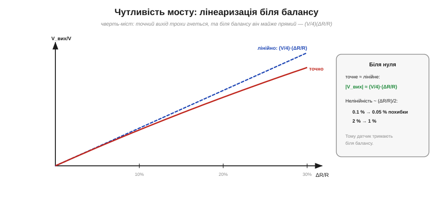

# 🧮 Чутливість мосту: лінеаризація біля балансу

> Незбалансований міст Вітстона дає вихід V_вих ≈ (V/4)·(ΔR/R). Ось точне виведення цієї формули — разом із відповіддю на два питання: **чому** датчик працює «біля балансу» і **як** позбутися залишкової нелінійності.

### Виведення для чверть-мосту

Візьмімо найпростіший випадок — **чверть-міст**: три плеча однакові (R), а четверте — датчик R+ΔR. Позначмо відносну зміну x = ΔR/R. Міст — це два [дільники напруги](root:hw-analog/voltage-divider) поряд; напишемо потенціал кожної з двох середніх точок (датчик хай стоїть у нижньому плечі правого дільника):

```
V_A = V·R/(R+R) = V/2                       (ліва половина не змінюється)
V_B = V·(R+ΔR)/(R + R+ΔR) = V·(1+x)/(2+x)   (права — з датчиком)
```

Вихід — це різниця:

```
V_вих = V_A − V_B = V/2 − V·(1+x)/(2+x)
      = V·[(2+x) − 2(1+x)] / [2(2+x)]
      = −V·x / [2(2+x)].
```

Отже, **точна** формула чверть-мосту:

```
V_вих = − (V/2) · x/(2+x),   де x = ΔR/R.
```

Зверніть увагу, звідки взялася сама нелінійність: датчик змінює не тільки **чисельник** свого дільника, а й **знаменник** — повний опір плеча стає R + R + ΔR. Саме цей «рух знаменника» й дає підступний множник (2+x) замість рівно 2; якби знаменник лишався сталим, вихід був би строго прямою з першого кроку.

### Лінеаризація: звідки береться (V/4)(ΔR/R)


*Точний вихід чверть-мосту (червона крива) трохи гнеться вниз від прямої. Та біля нуля він майже збігається з лінійним наближенням V_вих ≈ (V/4)·(ΔR/R) (синя пряма). Нелінійність росте приблизно як (ΔR/R)/2: при 0.1 % це 0.05 % похибки, при 2 % — 1 %.*

Уся нелінійність схована в множнику **(2+x)** у знаменнику. Поки зміна мала (x ≪ 1), його можна замінити просто на **2**, і формула спрощується до прямої:

```
V_вих ≈ − (V/2) · x/2 = − (V/4)·x = − (V/4)·(ΔR/R).
```

Ось звідки й узявся той коефіцієнт ¼. Знак лише каже, у який бік хитнувся міст; на практиці важлива **величина** |V_вих| ≈ (V/4)·(ΔR/R).

### Скільки коштує нелінійність

Наскільки точне це наближення? Порівняймо точне з лінійним:

```
точне = лінійне · 1/(1 + x/2)  ≈  лінійне · (1 − x/2).
```

Тобто **відносна похибка** лінеаризації — це приблизно **x/2 = (ΔR/R)/2**. Звідси проста оцінка: при ΔR/R = 0.1 % (типовий тензодатчик) нелінійність — лише 0.05 %, дрібниця; а при ΔR/R = 2 % вона вже 1 %. Тому датчики й працюють **біля балансу**: там, де x мале, міст практично лінійний, а далеко від рівноваги крива помітно гнеться.

### Як прибрати нелінійність: напів- і повний міст


*Більше активних плечей — більший сигнал. Чверть-міст: (V/4)(ΔR/R), є нелінійність. Напівміст (2 протилежні плеча): (V/2)(ΔR/R), удвічі чутливіший. Повний міст (4 плеча): V·(ΔR/R), учетверо чутливіший — і **точно лінійний**.*

Найкрасивіше: нелінійність можна не просто зменшити, а **знищити** — повним мостом. Хай усі чотири плеча активні й змінюються «назустріч»: одна діагональ +ΔR, друга −ΔR (так фізично й виходить, коли балка згинається — одні тензорезистори розтягуються, інші стискаються). Тоді:

```
V_A = V·(R+ΔR)/[(R−ΔR)+(R+ΔR)] = (V/2)(1+x)
V_B = V·(R−ΔR)/[(R+ΔR)+(R−ΔR)] = (V/2)(1−x)
V_вих = V_A − V_B = (V/2)·2x = V·x = V·(ΔR/R).
```

Підступний знаменник **(2+x) зник** — вихід вийшов **точно лінійний**, і до того ж **учетверо** більший за чверть-міст! Напівміст (два активні плеча) дає проміжне: подвоєну чутливість і часткове гасіння нелінійності. Тому точні ваги й датчики тиску роблять саме **повними** мостами: і сигнал найбільший, і крива — ідеальна пряма.

### Де працює

Підсумок практичний. Чутливість мосту прямо задає, який сигнал прийде на підсилювач (а отже, і роздільність вимірювання). Чверть-міст найдешевший, та лінійний лише біля балансу — для малих ΔR/R цього досить. Потрібні більший сигнал і строга лінійність — додають активні плеча: напів- чи повний міст. І завжди пам'ятай оцінку нелінійності (ΔR/R)/2 — вона одразу каже, чи можна довіряти простій формулі (V/4)(ΔR/R), чи зміна вже завелика.
