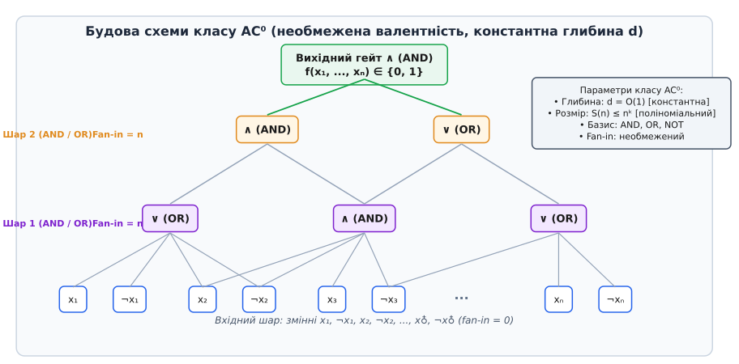
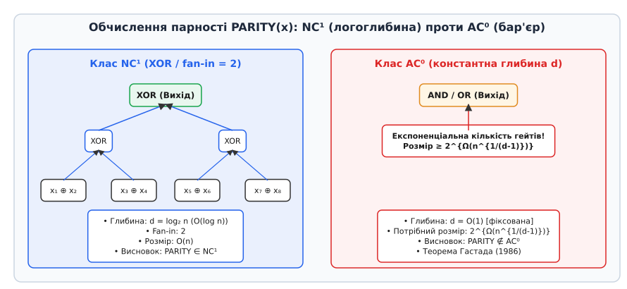
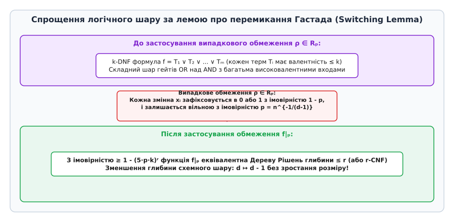

# Клас схем AC0 та схемна складність

<preknowlist>
- [Асимптотична складність](root:computability/asymptotic-complexity) — O-нотація, поліноміальний та експоненціальний ріст систем.
- [Клас P та NP](root:computability/p-vs-np) — часова складність обчислень та відношення між класами.
- [Схемна складність та клас P/poly](root:computability/p-poly) — булеві схеми як нерівномірна модель обчислень.
- [Теорема Кука — Левіна](root:computability/cook-levin-theorem) — зведеність булевих схем до форм ЗНФ та КНФ.
</preknowlist>

У паралельних обчислювальних процесорах, градієнтних апаратних матрицях та мікросхемах прямого зв'язку затримка проходження сигналу визначається глибиною логічного графа, тобто кількістю послідовних шарів вентилів від входу до виходу. Намагання звести цю затримку до константного значення `O(1)` при довільній розрядності входу `n` вимагає від інженерів застосування вентилів із великою вхідною валентністю (англ. *unbounded fan-in*), що досягає `n` сигналів на один елемент. Проте за спробу отримати константний час обчислення доводиться платити жорстким обмеженням на клас виражуваних функцій: навіть така проста операція, як перевірка парності кількості одиничних бітів у вхідному векторі `n` бітів (функція `PARITY`), вимагає експоненціальної кількості вентилів `2^{Ω(n^{1/(d-1)})}` для будь-якої схеми глибини `d`.

Дослідження класу складності **AC⁰** (англ. *Alternating Class 0*) посідає центральне місце у теорії схемної складності. Це перший фундаментальний клас нетривіальних обчислювальних схем, для якого математикам вдалося довести безумовні (абсолютні) нижні межі складності без спирання на недоведені гіпотези на кшталт `P ≠ NP`. Розгляд класу AC⁰ розкриває глибоку прірву між паралельним обчисленням локальних логічних умов та глобальним агрегуванням інформації по всьому вхідному вектору.

## 1. Схемна модель обчислень та геометричні параметри графа

Класична теорія обчислюваності вимірює складність алгоритмів через ресурси універсальної машини Тюринга — час (кількість кроків детермінованої стрічки) та простір (обсяг використаної пам'яті). Проте машина Тюринга є **однорідною (рівномірною)** моделлю: один і той самий скінченний алгоритм обробляє вхідні рядки довільної довжини `n`. 

На противагу цьому, апаратні системи (цифрові інтегральні схеми, пліски FPGA, комбінаційні процесорні блоки) функціонують у межах **неоднорідної (нерівномірної)** моделі. Для кожного фіксованого значення розрядності входу `n` будується окрема булева схема `Cₙ`. Схема являє собою орієнтований ациклічний граф (англ. *directed acyclic graph, DAG*), вершинами якого є логічні елементи (гейти), а ребрами — провідники для передачі бітових сигналів.

Основними формальними параметрами булевої схеми `Cₙ` є:

1. **Розмір схеми (англ. *circuit size*) `size(Cₙ)`** — загальна кількість внутрішніх логічних вентилів у графі. Цей параметр відповідає фізичній площі кристаллу мікросхеми, кількості використаних транзисторів або загальній обчислювальній ємності.
2. **Глибина схеми (англ. *circuit depth*) `depth(Cₙ)`** — довжина найдовшого орієнтованого шляху від будь-якого вхідного біта до вихідного вентиля. Глибина визначає критичний шлях розповсюдження сигналу (затримку перемикання транзисторів) і відповідає часу паралельного обчислення.
3. **Вхідна валентність (англ. *fan-in*)** — максимальна кількість вхідних ребер, що входять у один логічний гейт. Вона описує, скільки сигналів гейт спроможний обробити одночасно за один такт.
4. **Вихідна валентність (англ. *fan-out*)** — максимальна кількість вихідних ребер, що виходять з одного логічного гейта для розгалуження сигналу на наступні шари.

У залежності від обмежень на вхідну валентність вентилів теорія складності поділяє схемні класи на два основні сімейства: класи **NCⁱ** (англ. *Nick's Class*), де fan-in кожного вентиля обмежений фіксованою константою (зазвичай 2), та класи **ACⁱ** (англ. *Alternating Class*), де вентилі `AND` та `OR` мають необмежену вхідну валентність (можуть приймати поліноміальну кількість inputs `O(nᵏ)` на один гейт).


*Архітектура комбінаційної булевої схеми класу AC⁰. Вхідні змінні та їх заперечення подаються на вентилі AND та OR з необмеженою вхідною валентністю, сформовані у константну кількість d шарів.*

Зауважимо важливий топологічний факт: у класичних схемах із обмеженою вхідною валентністю `fan-in = 2` кожен гейт на глибині `d` може зібрати інформацію щонайбільше від `2ᵈ` вхідних бітів. Якщо обчислювана функція істотно залежить від усіх `n` вхідних бітів (тобто зміна будь-якого біта може змінити значення функції), то глибина схеми з `fan-in = 2` обов'язково задовольняє нерівність:

```
2ᵈ ≥ n  ⇒  d ≥ ⌈log₂ n⌉
```

Тому у класах із обмеженим fan-in (таких як NC¹) мінімально можлива глибина для обробки `n` бітів є логарифмічною `O(log n)`. Перехід до необмеженої вхідної валентності у класі AC⁰ потенційно знімає це логарифмічне обмеження, дозволяючи гейту проаналізувати всі `n` бітів за один крок.

Важливим теоретичним аспектом схемної моделі є концепція **однорідності (англ. *uniformity*)**. Загальне сімейство схем `{Cₙ}` називається **неоднорідним**, якщо схеми для різних `n` нічим між собою не пов'язані і можуть бути сформовані неалгоритмічно. Неоднорідні поліноміальні схеми утворюють клас **P/poly**, який спроможний розпізнавати алгоритмічно нерозв'язні мови (наприклад, проблему зупинки машини Тюринга для входу довжини `n`, закодовану в один біт допомоги). 

Щоб схеми описували реальні алгоритми, вводиться вимога **однорідності**: існує детермінований алгоритм (наприклад, машина Тюринга з логарифмічною пам'яттю `L` або логарифмічним часом `DLOGTIME`), який за вхідним вектором `1ⁿ` здатний вивести текстовий опис граф-схеми `Cₙ`.

## 2. Формальне означення класу AC0 та схемна ієрархія

Формальне означення класу AC⁰ спирається на фіксацію трьох обмежень: поліноміального розміру, константної глибини та стандартного логічного базису.

> **Означення класу AC⁰.** Мова `L ⊆ {0, 1}*` (або сімейство булевих функцій `f = {fₙ}`) належить до класу **AC⁰**, якщо існує константа `d ≥ 1`, поліном `p(n)` та сімейство комбінаційних булевих схем `C = {Cₙ | n ∈ ℕ}` у базисі `{AND, OR, NOT}` такі, що для кожного `n ≥ 1`:
> 1. Схема `Cₙ` обчислює функцію `fₙ: {0, 1}ⁿ → {0, 1}`.
> 2. Вентилі `AND` та `OR` мають необмежену вхідну валентність (*unbounded fan-in*).
> 3. Вентилі `NOT` застосовуються лише до вхідних змінних (або мають `fan-in = 1`).
> 4. Глибина схеми строго обмежена константою: `depth(Cₙ) ≤ d = O(1)` для всіх `n`.
> 5. Розмір схеми обмежений поліномом: `size(Cₙ) ≤ p(n) = n^{O(1)}`.

Будь-яку схему з класу AC⁰ можна привести до так званого **шаруватого чергувального вигляду (англ. *layered alternating form*)**. За допомогою законів Де Моргана вентилі заперечення `NOT` можна спустити на самий нижній рівень безпосередньо до вхідних бітів `xᵢ`, перетворивши вхідний шар у набір бітермінів `x₁, ¬x₁, x₂, ¬x₂, ..., x♙, ¬x♙`. 

Процес спущення заперечень виконується за такими еквівалентностями:

```
¬(A ∧ B ∧ ...) = (¬A) ∨ (¬B) ∨ ...     [закон Де Моргана для AND]
¬(A ∨ B ∨ ...) = (¬A) ∧ (¬B) ∧ ...     [закон Де Моргана для OR]
¬(¬A)          = A                     [подвійне заперечення]
```

Після такого перетворення схема складається із `d` чітко чергованих шарів: шар вентилів `AND`, над ним шар вентилів `OR`, далі знову `AND` і так далі до єдиного вихідного вентиля. При цьому глибина збільшується щонайбільше вдвічі (що залишається константою `O(1)`), а розмір зростає лише поліноміально.

У загальній ієрархії схемних класів клас AC⁰ посідає найнижчий рівень серед поліноміальних неоднорідних обчислень:

```
NC⁰ ⊂ AC⁰ ⊂ NC¹ ⊂ L ⊂ NL ⊂ NC² ⊂ ... ⊂ P ⊂ P/poly
```

Детальніше про співвідношення та параметри цих класів:

- **NC⁰**: схеми константної глибини `O(1)` із обмеженим `fan-in = 2`. У такому класі вихідний біт залежить лише від `2ᵈ = O(1)` вхідних бітів. Клас NC⁰ надзвичайно слабкий і не здатен обчислити навіть елементарну кон'юнкцію `x₁ ∧ x₂ ∧ ... ∧ x♙`.
- **AC⁰**: схеми константної глибини `O(1)` з необмеженим `fan-in`. Дозволяють обчислювати складні диз'юнктивні та кон'юнктивні нормальні форми великого розміру.
- **NC¹**: схеми логарифмічної глибини `O(log n)` з обмеженим `fan-in = 2` та поліноміальним розміром. Клас NC¹ еквівалентний логічним формулам поліноміального розміру та містить усі регулярні мови.

Виникає фундаментальне питання: чи є клас AC⁰ строго слабшим за NC¹? Оскільки вентиль `AND` або `OR` з `n` входами можна легко реалізувати у вигляді бінарного дерева глибини `⌈log₂ n⌉` з гейтів із `fan-in = 2`, включення `AC⁰ ⊆ NC¹` є очевидним. Проте доведення строгості цього включення (`AC⁰ ⊊ NC¹`) вимагало розробки глибокого математичного апарату безумовних нижніх меж.

## 3. Складність конкретних задач: що обчислюється у класі AC0

На перший погляд здається, що можливість об'єднувати довільну кількість сигналів за один крок за допомогою вентилів із необмеженим fan-in надає схемі AC⁰ величезну обчислювальну потужність. Справді, коло задач, розв'язуваних усередині AC⁰, охоплює важливі апаратні операції:

### Порівняння цілих чисел
Перевірка рівності двох `n`-бітних векторів `a = (a₁, ..., a♙)` та `b = (b₁, ..., b♙)` обчислюється як кон'юнкція побітових еквівалентностей:

```
EQ(a, b) = ∧ᵢ₌₁ⁿ ((aᵢ ∧ bᵢ) ∨ (¬aᵢ ∧ ¬bᵢ))
```

Ця формула представляється ДНФ (диз'юнктивною нормальною формою) глибини 2 та розміру `O(n)`. Перевірка нерівності `a < b` також виражається схемою глибини 3 поліноміального розміру `O(n²)` шляхом вибору найстаршого розряду, у якому біти розходяться:

```
LESS(a, b) = ∨ᵢ₌₁ⁿ (¬aᵢ ∧ bᵢ ∧ (∧ⱼ₌ᵢ₊₁ⁿ (aⱼ ↔ bⱼ)))
```

### Порігові функції константного рангу
Порігова функція `THRESHOLD_k(x)` повертає 1 тоді й лише тоді, коли кількість одиниць у вхідному векторі `x` становить щонайбільше або щонайменше `k`. Якщо поріг `k = O(1)` є константним (наприклад, `k = 3`), то функція `THRESHOLD_k` належить до AC⁰, оскільки вона виражається диз'юнкцією кон'юнкцій по всіх підмножинах розміру `k`:

```
THRESHOLD_k(x₁, ..., x♙) = ∨_{S ⊆ {1,..,n}, |S|=k} ( ∧_{i ∈ S} xᵢ )
```

Оскільки кількість підмножин розміру `k` дорівнює `(n choose k) ≤ nᵏ = O(nᵏ)`, отримане вираження є ДНФ глибини 2 поліноміального розміру `nᵏ`. Проте якщо поріг `k` росте пропорційно `n` (наприклад, `k = n / 2`), то кількість підмножин зростає експоненціально `2ⁿ`, і такий прямий підхід зазнає краху.

### Паралельне додавання цілих чисел (`ADD ∈ AC⁰`)
Попри те, що звичайне послідовне додавання зі стовпчиком поширює перенос через `n` розрядів (що дає глибину `O(n)`), спеціальні схеми прискореного переносу (англ. *Carry-Lookahead Adders*) дозволяють обчислити всі біти суми `s = a + b` у класі AC⁰.

Для кожного розряду `i` визначаються біти генерації переносу `gᵢ = aᵢ ∧ bᵢ` та розповсюдження переносу `pᵢ = aᵢ ∨ bᵢ`. Підсумковий біт переносу `cᵢ` у розряд `i + 1` обчислюється як диз'юнкція кон'юнкцій:

```
cᵢ = gᵢ ∨ (pᵢ ∧ gᵢ₋₁) ∨ (pᵢ ∧ pᵢ₋₁ ∧ gᵢ₋₂) ∨ ... ∨ (pᵢ ∧ pᵢ₋₁ ∧ ... ∧ p₁ ∧ g₀)
```

Оскільки вираз для `cᵢ` є ДНФ глибини 2 з необмеженим fan-in, усі біти переносу `c₁, c₂, ..., c♙` обчислюються паралельно у шарі глибини 2. Після цього результуючі біти суми `sᵢ = aᵢ ⊕ bᵢ ⊕ cᵢ₋₁` формуються на третьому шарі. Отже, вся схема додавача має глибину 3 і поліноміальний розмір `O(n²)`, що доводить належність `ADD ∈ AC⁰`.

### Декодування та селекція
Мультиплексори, дешифратори адрес та операції бітового зсуву на маску фіксованої довжини легко реалізуються у схемній глибині 2 або 3.

## 4. Межі спроможностей AC0 та функція парності PARITY

Однак ця обчислювальна потужність миттєво руйнується, як тільки задача вимагає **глобального підрахунку або усереднення бітів**.

Розглянемо функцію парності **PARITY**:

```
PARITY(x₁, x₂, ..., x♙) = x₁ ⊕ x₂ ⊕ ... ⊕ x♙ = (∑ᵢ₌₁ⁿ xᵢ) mod 2
```

Функція повертає 1, якщо кількість одиниць у вхідній послідовності є непарною, і 0, якщо парною. У класі **NC¹** функція PARITY обчислюється елементарно: будується звичайне збалансоване бінарне дерево з вентилів `XOR` (або еквівалентних їм схем із 4 гейтів `AND/OR` глибини 2). Глибина такого дерева дорівнює `⌈log₂ n⌉`, а загальний розмір становить `O(n)`.


*Порівняння обчислення функції PARITY: у класі NC¹ побудова бінарного дерева глибини log₂ n дає лінійний розмір O(n); у класі AC⁰ спроба зафіксувати глибину d вимагає експоненціальної кількості гейтів.*

Якщо ж ми намагаємося обчислити PARITY у класі **AC⁰** із зафіксованою константною глибиною `d`, виникає фундаментальний бар'єр. Зміна навіть одного-єдиного біта у вхідному векторі `x` змінює значення функції `PARITY(x)` на протилежне. Вентілі `AND` та `OR` мають властивість «насичення»: якщо на вхід гейта `OR` приходить хоча б одна 1, вихід гейта стає 1 незалежно від решти `n - 1` входів. Аналогічно, якщо на вхід `AND` приходить хоча б один 0, вихід стає 0.

Ця фундаментальна відсутність чутливості вентилів з великим fan-in до поодиноких змін бітів приводить до фундаментальної теореми складності.

> **Теорема (Гастад, 1986).** Будь-яка булева схема глибини `d` у базисі `{AND, OR, NOT}` з необмеженим fan-in, яка обчислює функцію `PARITY` від `n` змінних, вимагає розміру:
>
> ```
> size(C) ≥ 2^{c · n^{1/(d-1)}}
> ```
>
> де `c > 0` — абсолютна константа (зазвичай `c = 1 / 10`).

Наслідки цієї теореми є нищівними для класу AC⁰:

- **Сувора ієрархія `AC⁰ ⊊ NC¹`**: Оскільки `PARITY ∈ NC¹`, але `PARITY ∉ AC⁰`, клас AC⁰ є строго слабшим за NC¹.
- **Неможливість обчислення мажоритарного елемента (`MAJORITY ∉ AC⁰`)**: Функція `MAJORITY(x)`, яка повертає 1 тоді й лише тоді, коли `∑ xᵢ ≥ ⌈n / 2⌉`, не належить до AC⁰. Якби `MAJORITY` належала до AC⁰, то за допомогою поліноміальної кількості викликів `MAJORITY` можна було б обчислити точну кількість одиниць і, відповідно, парність, що суперечить теоремі Гастада.
- **Неможливість множення цілих чисел (`MUL ∉ AC⁰`)**: Операція множення `n`-бітних чисел вимагає підрахунку суми часткових добутків, що зводиться до обчислення парності.

Детальний аналіз історичного шляху відкриття нижніх меж складності та хронологію наукових проривів викладено у вставці [📜 Історія схемної складності та революція AC0](root:computability/ac0-circuits/hist-ac0-bounds.md).

## 5. Математичний апарат: Лема про перемикання Гастада (Switching Lemma)

Доведення теореми `PARITY ∉ AC⁰` спирається на один із найелегантніших інструментів ймовірнісного аналізу в комбінаториці — **Лему про перемикання Гастада (англ. *Håstad's Switching Lemma*)**.

Ідея методу полягає у доведенні за індукцією: якщо до схеми глибини `d` застосувати спеціально підбране **випадкове обмеження (англ. *random restriction*)**, то з високою імовірністю кожен шар вентилів ДНФ (диз'юнкція кон'юнкцій) спрощується і перетворюється у КНФ (кон'юнкцію диз'юнкцій) малої валентності, або у Дерево Рішень (Decision Tree) невеликої глибини. Це дозволяє «злити» два сусідні шари одинакових гейтів (наприклад, `OR` над `OR`), зменшивши загальну глибину схеми з `d` до `d - 1` без суттєвого збільшення її розміру.


*Спрощення логічної структури під дією випадкового обмеження ρ ∈ Rₚ: складний шар k-ДНФ із високою імовірністю перетворюється на Дерево Рішень глибини r ≤ k, знижуючи глибину схеми d ↦ d - 1.*

Формально випадкове обмеження `ρ ∈ Rₚⁿ` зафіксовує кожну вхідну змінну `xᵢ` за таким ймовірнісним розподілом:

```
        ┌ 0 ,  з імовірністю (1 - p) / 2
ρ(xᵢ) = ├ 1 ,  з імовірністю (1 - p) / 2
        └ * ,  з імовірністю p  (змінна залишається вільною)
```

Параметр `p ∈ (0, 1)` визначає частку змінних, які залишаються не зафіксованими.

> **Лема про перемикання (Гастад, 1986).** Нехай `f` — `k`-ДНФ формула (диз'юнкція кон'юнкцій, де кожна кон'юнкція містить щонайбільше `k` літералів). Якщо до `f` застосувати випадкове обмеження `ρ ∈ Rₚⁿ`, то імовірність того, що звужена функція `f|ₚ` не може бути представлена Деревом Рішень глибини менше `r`, обмежена зверху:
>
> ```
> Pr_{ρ ∈ Rₚⁿ}[ DT(f|ₚ) > r ] ≤ (5 · p · k)ʳ
> ```

Якщо обрати `p = 1 / (10 · k)`, то вираз `5 · p · k` стає дорівнювати `1 / 2`, і імовірність того, що формула не спроститься до малого Дерева Рішень глибини `r`, спадає експоненціально як `2⁻ʳ`.

Завдяки тому, що будь-яке Дерево Рішень глибини `r` можна еквівалентно переписати як `r`-КНФ (або `r`-ДНФ), ми можемо поміняти місцями вентилі `AND` та `OR` на першому рівні схеми. Після перемикання сусідні гейти `OR` зливаються в один шар, і глибина схеми зменшується на 1:

```
Початкова схема:  Глибина d  (Шари: OR → AND → OR → ...)
Після обмеження ρ: Глибина d - 1 (Шари: OR → OR → AND → ...  ⇒  OR → AND → ...)
```

Послідовно застосовуючи `d - 2` подібних випадкових обмежень, ми спрощуємо початкову схему глибини `d` до звичайного Дерева Рішень малого розміру. Проте функція `PARITY` має унікальну комбінаторну властивість: **після будь-якого обмеження `ρ`, яке залишає `s` вільних змінних, звужена функція `PARITY|ₚ` залишається точним PARITY від цих `s` змінних**. 

Оскільки для обчислення PARITY від `s` змінних Дерево Рішень зобов'язане мати глибину `s` (потрібно опитати всі `s` бітів), виникає суперечність із тим, що схема спростилася до Дерева Рішень глибини `r ≪ s`. Ця суперечність і доводить, що початковий розмір схеми `size(C)` мусив бути експоненціально великим `2^{Ω(n^{1/(d-1)})}`.

Повний математичний вивід леми про перемикання та її строге комбінаторне доведення наведено у вставці [𝔮 Лема про перемикання Гастада та доведення нижньої межі PARITY](root:computability/ac0-circuits/math-switching-lemma.md).

## 6. Алгебраїчний метод Разборова — Смоленського та розширення ACC0

Незважаючи на потужність ймовірнісного методу перемикання Гастада, він перестає працювати, якщо ми спробуємо розширити базис вентилів. Що станеться, якщо додати у схему спеціальний вентиль `MOD_p`, який повертає 1 тоді й лише тоді, коли сума входів ділиться на просте число `p`?

Таке розширення визначає клас схем **ACC⁰[p]** (або узагальнений клас **ACC⁰** — *AC⁰ with Counters*). Оскільки вентиль `MOD₂` за визначенням обчислює функцію `PARITY`, функція PARITY легко обчислюється у класі `ACC⁰[2]` за допомогою **одного-єдиного гейта** (глибина 1, розмір 1).

Для аналізу таких схем Олександр Разборов (1987) та Роман Смоленський (1987) розробили **алгебраїчний метод апроксимації многочленами**.

Основна ідея методу Смоленського полягає у представленні булевих значень `{0, 1}` як елементів скінченного поля `𝔽ₚ` (де `p` — просте число). У полі `𝔽ₚ` логічні операції виражаються алгебраїчними многочленами:

```
NOT(x)    = 1 - x
AND(x, y) = x · y
OR(x, y)  = 1 - (1 - x) · (1 - y) = x + y - x · y
```

Однак для вентиля `OR(x₁, ..., x_k)` із великим fan-in `k` точне алгебраїчне вираження `1 - ∏ᵢ (1 - xᵢ)` дає многочлен степеня `k`, що занадто багато. Смоленський запропонував наблизити вентиль `OR` випадковим многочленом степеня `l (p - 1)`: обираються `l` випадкових підмножин входів `S₁, ..., Sₗ ⊆ {1, ..., k}` і будується многочлен:

```
P(x₁, ..., x_k) = 1 - ∏ⱼ₌₁ˡ (1 - (∑ᵢ ∈ Sⱼ xᵢ)ᵖ⁻¹)
```

Цей многочлен помиляється на довільному фіксованому вході з імовірністю не більше `2⁻ˡ`. Обираючи `l = O(log n)`, отримуємо багаточлен низького степеня, який точно збігається з вентилем `OR` на майже всіх вхідних точках. Оскільки схема містить `size(C)` гейтів, сумарна імовірність помилки при апроксимації всієї схеми обмежена сумою імовірностей `size(C) / 2ˡ`.

Завдяки цій апроксимації будь-яку схему з класу `ACC⁰[p]` глибини `d` можна наблизити єдиним многочленом над полем `𝔽ₚ`, степінь якого обмежений значенням `(O(log n))ᵈ`.

Якщо тепер розглянути функцію `MOD_q` для іншого простого числа `q ≠ p` (наприклад, функцію `MOD₃` у полях `𝔽₂`), то можна довести, що жоден многочлен низького степеня над `𝔽ₚ` не здатний апроксимувати `MOD_q`. Це дає наступну теорему.

> **Теорема Разборова — Смоленського (1987).** Для двох різних простих чисел `p` та `q` обчислення функції `MOD_q` на схемах глибини `d` із вентилями `AND, OR, NOT` та `MOD_p` вимагає експоненціального розміру:
>
> ```
> size(C) ≥ 2^{Ω(n^{1/(2d)})}
> ```
> Наслідок: `MOD_q ∉ ACC⁰[p]`.

Зокрема, функція `MOD₃` (перевірка подільності суми бітів на 3) не може бути обчислена поліноміальними схемами константної глибини з гейтами `PARITY` (тобто `MOD₃ ∉ ACC⁰[2]`).

Протягом майже 25 років розширити ці нижні межі на випадок складених модулів (наприклад, `ACC⁰[6]`, де дозволені гейти `MOD₆`) залишалося нездоланним бар'єром теорії складності. Лише у 2011 році Раян Вільямс (Ryan Williams), використавши принципово новий алгоритмічний підхід на основі прискореного розв'язання задачі SAT, довів безумовну нижню межу: клас `NEXP` (недетермінований експоненціальний час) не міститься у класі `ACC⁰`.

## 7. Алгоритмічний симулятор схем та програмна реалізація

Для практичного аналізу комбінаторних властивостей схем AC⁰, перевірки роботи вентилів із необмеженим fan-in та емпіричної демонстрації ефекту леми про перемикання Гастада розробляють симулятори булевих схем на мовах системного програмування.

Вимоги до внутрішнього представлення схеми AC⁰ в коді:

- Графова структура DAG з можливістю швидкого топологічного сортування та обчислення значень у шарах.
- Підтримка списків вхідних ребер змінної довжини (`std::vector<GateId>` у C++ або масиви вказівників у C) для забезпечення необмеженого fan-in.
- Генератор випадкових обмежень `ρ ∈ Rₚⁿ` для проведення емпіричних випробувань стиснення глибини.

> 🔧 **Навіщо це в реальній розробці.**
> Розуміння схемних обмежень AC⁰ безпосередньо впливає на проектування апаратних блоків ALU процесорів та оптимізацію поведінкового RTL-коду у мовах Verilog / VHDL. Наприклад, спроба записати каскадний підрахунок одиничних бітів через великі шинні матриці без використання логарифмічних дерев (на кшталт сіток Уоллеса або дерев Баббера — Стоун) приводить кодогенератор кронштейна синтезу (Synopsys Design Compiler) до згенерованої схеми експоненціального розміру або до критичного розгону затримки сигналу, що зриває тактову частоту процесора.

Нижче наведено повну реалізацію симулятора схем AC⁰ мовою C та C++ (переключайте вкладки для вибору мови).

:::tabs
```c
/* c — Симулятор схем AC0 та генератор обмежень на C */
#include <stdio.h>
#include <stdlib.h>
#include <stdint.h>
#include <stdbool.h>
#include <string.h>

typedef enum { GATE_INPUT, GATE_NOT, GATE_AND, GATE_OR } GateType;

typedef struct {
    size_t id;
    GateType type;
    size_t input_var; /* Для GATE_INPUT */
    size_t* fan_in;   /* Масив ID вхідних гейтів (unbounded fan-in) */
    size_t fan_in_count;
    uint8_t value;
} Gate;

typedef struct {
    size_t num_inputs;
    size_t num_gates;
    Gate* gates;
    size_t output_gate_id;
} Circuit;

Circuit* circuit_create(size_t num_inputs, size_t max_gates) {
    Circuit* c = (Circuit*)malloc(sizeof(Circuit));
    c->num_inputs = num_inputs;
    c->num_gates = 0;
    c->gates = (Gate*)calloc(max_gates, sizeof(Gate));
    c->output_gate_id = 0;
    return c;
}

size_t circuit_add_input(Circuit* c, size_t var_idx) {
    size_t id = c->num_gates++;
    c->gates[id].id = id;
    c->gates[id].type = GATE_INPUT;
    c->gates[id].input_var = var_idx;
    return id;
}

size_t circuit_add_gate(Circuit* c, GateType type, const size_t* inputs, size_t count) {
    size_t id = c->num_gates++;
    c->gates[id].id = id;
    c->gates[id].type = type;
    c->gates[id].fan_in_count = count;
    c->gates[id].fan_in = (size_t*)malloc(count * sizeof(size_t));
    memcpy(c->gates[id].fan_in, inputs, count * sizeof(size_t));
    return id;
}

uint8_t circuit_eval(Circuit* c, const uint8_t* in_vec) {
    for (size_t i = 0; i < c->num_gates; ++i) {
        Gate* g = &c->gates[i];
        if (g->type == GATE_INPUT) {
            g->value = in_vec[g->input_var];
        } else if (g->type == GATE_NOT) {
            g->value = !c->gates[g->fan_in[0]].value;
        } else if (g->type == GATE_AND) {
            uint8_t res = 1;
            for (size_t j = 0; j < g->fan_in_count; ++j) {
                if (!c->gates[g->fan_in[j]].value) { res = 0; break; }
            }
            g->value = res;
        } else if (g->type == GATE_OR) {
            uint8_t res = 0;
            for (size_t j = 0; j < g->fan_in_count; ++j) {
                if (c->gates[g->fan_in[j]].value) { res = 1; break; }
            }
            g->value = res;
        }
    }
    return c->gates[c->output_gate_id].value;
}

void circuit_free(Circuit* c) {
    for (size_t i = 0; i < c->num_gates; ++i) {
        free(c->gates[i].fan_in);
    }
    free(c->gates);
    free(c);
}

int main(void) {
    size_t n = 4;
    Circuit* c = circuit_create(n, 32);
    size_t in_ids[4];
    for (size_t i = 0; i < n; ++i) in_ids[i] = circuit_add_input(c, i);

    /* Побудова спрощеного шару OR над AND для перших 2 бітів */
    size_t and1 = circuit_add_gate(c, GATE_AND, (size_t[]){in_ids[0], in_ids[1]}, 2);
    size_t out = circuit_add_gate(c, GATE_OR, (size_t[]){and1, in_ids[2]}, 2);
    c->output_gate_id = out;

    uint8_t input_val[4] = {1, 1, 0, 0};
    uint8_t res = circuit_eval(c, input_val);
    printf("Результат оцінки схеми AC0: %d\n", res);

    circuit_free(c);
    return 0;
}
```
```cpp
// cpp — Ідіоматичний симулятор схем AC0 на C++20
#include <iostream>
#include <vector>
#include <memory>
#include <numeric>
#include <random>
#include <stdexcept>
#include <span >

enum class GateType { Input, Not, And, Or };

struct Gate {
    size_t id;
    GateType type;
    size_t input_var_idx{0};
    std::vector<size_t> fan_in;
    mutable uint8_t cached_value{0};
};

class AC0Circuit {
public:
    explicit AC0Circuit(size_t num_inputs) : num_inputs_(num_inputs) {}

    size_t add_input(size_t var_idx) {
        if (var_idx >= num_inputs_) throw std::out_of_range("Індекс змінної виходить за межі");
        size_t id = gates_.size();
        gates_.push_back(Gate{id, GateType::Input, var_idx, {}, 0});
        return id;
    }

    size_t add_gate(GateType type, std::vector<size_t> inputs) {
        size_t id = gates_.size();
        gates_.push_back(Gate{id, type, 0, std::move(inputs), 0});
        return id;
    }

    void set_output(size_t gate_id) { output_id_ = gate_id; }

    uint8_t evaluate(std::span<const uint8_t> input_vector) const {
        if (input_vector.size() < num_inputs_) {
            throw std::invalid_argument("Недостатня довжина вхідного вектора");
        }
        for (const auto& g : gates_) {
            switch (g.type) {
                case GateType::Input:
                    g.cached_value = input_vector[g.input_var_idx];
                    break;
                case GateType::Not:
                    g.cached_value = !gates_[g.fan_in.at(0)].cached_value;
                    break;
                case GateType::And: {
                    uint8_t res = 1;
                    for (size_t in_id : g.fan_in) {
                        if (!gates_[in_id].cached_value) { res = 0; break; }
                    }
                    g.cached_value = res;
                    break;
                }
                case GateType::Or: {
                    uint8_t res = 0;
                    for (size_t in_id : g.fan_in) {
                        if (gates_[in_id].cached_value) { res = 1; break; }
                    }
                    g.cached_value = res;
                    break;
                }
            }
        }
        return gates_.at(output_id_).cached_value;
    }

private:
    size_t num_inputs_;
    std::vector<Gate> gates_;
    size_t output_id_{0};
};

int main() {
    AC0Circuit circuit(4);
    std::vector<size_t> inputs;
    for (size_t i = 0; i < 4; ++i) inputs.push_back(circuit.add_input(i));

    size_t and_gate = circuit.add_gate(GateType::And, {inputs[0], inputs[1]});
    size_t out_gate = circuit.add_gate(GateType::Or, {and_gate, inputs[2]});
    circuit.set_output(out_gate);

    std::vector<uint8_t> input_bits = {1, 1, 0, 0};
    std::cout << "Результат обчислення C++ AC0 схеми: " 
              << static_cast<int>(circuit.evaluate(input_bits)) << "\n";
    return 0;
}
```
:::

Повний опис програмного інтерфейсу C/C++ бібліотеки для маніпуляцій з AC⁰ графами та структури даних наведено у вставці [📋 Інтерфейс та структура даних булевих схем AC0](root:computability/ac0-circuits/api-circuit-dag.md). Повні тексти симулятора з можливістю проведения випробувань леми Гастада знаходяться у вставці [⚙️ Симулятор схем AC0 та перевірка обмежень PARITY](root:computability/ac0-circuits/proj-ac0-simulator.md).

## 8. Теорема Баррінгтона — Іммермана — Штраубінга (BIS) та зв'язок із логікою першого порядку

Окрім схемного та алгебраїчного підходів, клас AC⁰ має глибоке й несподіване описове означення у межах **дескриптивної складності (англ. *descriptive complexity*)**.

У 1990 році Девід Баррінгтон (David A. Mix Barrington), Ніл Іммерман (Neil Immerman) та Говард Штраубінг (Howard Straubing) (BIS, 1990) довели фундаментальну теорему еквівалентності однорідних схем AC⁰ та формул логіки першого порядку.

> **Теорема Баррінгтона — Іммермана — Штраубінга (BIS, 1990).** Мова `L ⊆ {0, 1}*` належить до однорідного класу **DLOGTIME-uniform AC⁰** тоді й лише тоді, коли вона виражається предикатом у **Логіці першого порядку (FO)** з операторами кванторів `∀, ∃` та предикатами порядку `<`, рівності `=` і бітової кон'юнкції `BIT(i, j)`.

Формально **DLOGTIME-однорідність** означає, що існує машина Тюринга, яка за час `O(log n)` здатна відповісти на запит: чи існує гейт `u` у схемі `Cₙ`, чи з'єднані гейти `u` та `v` ребром, і яким є тип гейта `u`.

Сутність зв'язку з логікою першого порядку проста:

- Квантор загальності `∀x` над скінченним доміном розгортається у вентиль `AND` із валентністю `n`.
- Квантор існування `∃x` розгортається у вентиль `OR` із валентністю `n`.
- Константна глибина схеми `d` відповідає кількості вкладених кванторів `∀` та `∃` у логічній формулі.

Звідси випливає альтернативне й дуже просте доведення того, чому `PARITY ∉ AC⁰`: у логіці першого порядку `FO` неможливо сформулювати властивість «вектор містить непарну кількість одиниць» без використання кванторів другого порядку або оператора індукції. Логіка першого порядку виражає лише локальні властивості структур (на кшталт «існує 3 послідовні одиниці»), але повністю сліпа до глобальних парностей.

## 9. Бар'єр природних доведень (Natural Proofs) та сучасний стан теорії

Успіхи у доведенні нижніх меж для AC⁰ (Гастад, 1986) та ACC⁰[p] (Разборов — Смоленський, 1987) у 1980-х роках викликали в науковій спільноті ейфорію. Здавалося, що поступово збільшуючи глибину схем і розширюючи базис вентилів, теорія складність за кілька років дійде до доведення безумовних нижніх меж для класу `P` або `NP` і розв'яже проблему `P ≠ NP`.

Однак у 1997 році Олександр Разборов та Стівен Рудіч (Steven Rudich) сформулювали фундаментальний софізм, відомий як **Бар'єр природних доведень (англ. *Natural Proofs Barrier*)**.

Разборов і Рудіч проаналізували всі відомі доведення нижніх меж для AC⁰ та ACC⁰ і помітили, що всі вони спираються на наявність комбінаторної властивості `C`, яка задовольняє дві умови:

1. **Конструктивна корисність (англ. *Constructivity*)**: Властивість `C` можна ефективно перевірити за поліноміальний від таблиці істинності час `2^{O(n)}`.
2. **Великий обсяг (англ. *Largeness*)**: Випадково обрана булева функція від `n` змінних має властивість `C` з високою імовірністю (щонайменше 1/2).

> **Теорема Разборова — Рудіча (1997).** Якщо у криптографії існують стійкі **псевдовипадкові генератори (PRG)** поліноміальної стійкості, то жодне «природне доведення» не здатне встановити нижні межі складності для загальних схем з базисом `{AND, OR, NOT}` поліноміального розміру (і навіть для класу `TC⁰`).

Причина полягає у тому, що природне доведення нижньої межі дозволило б використати властивість `C` як критерій для відрізнення справжнього псевдовипадкового сигналу від ідеально випадкового шуму, що миттєво зламало б усі криптографічні генератори та симетричне шифрування (DES, AES).

Новий подих у розвиток схемної складності вніс прорив Раяна Вільямса (2011), який обійшов бар'єр природних доведень через використання неалгоритмічних зв'язків між прискореним розв'язанням задачі SAT для схем та нижніми межами складності. Вільямс довів, що якщо для деякого класу схем `C` існує алгоритм перевірки виконуваності (SAT), який працює трохи швидше за повний перебір `O(2ⁿ / nᵏ)`, то клас `NEXP` не має схем з класу `C`. Використавши цей зв'язок, Вільямс довів першу нетривіальну нижню межу для класу `ACC⁰`: `NEXP ⊄ ACC⁰`.

Отже, метод Гастада (перемикання) та метод Разборова-Смоленського (многочлени) зупинилися саме на межі AC⁰ / ACC⁰. Долання бар'єру природних доведень вимагає принципово нових неконструктивних та алгебраїчних підходів, орієнтованих на структуру конкретних задач без застосування узагальнених комбінаторних властивостей. Клас AC⁰ залишається найвищою вершиною теорії складності, де математична краса безумовних доведень зустрічається із суворими межами сучасного пізнання.
