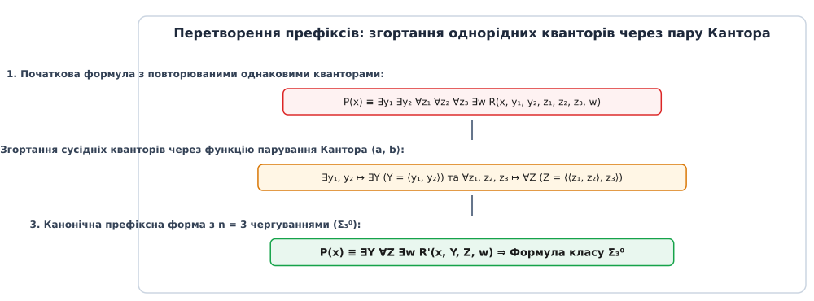
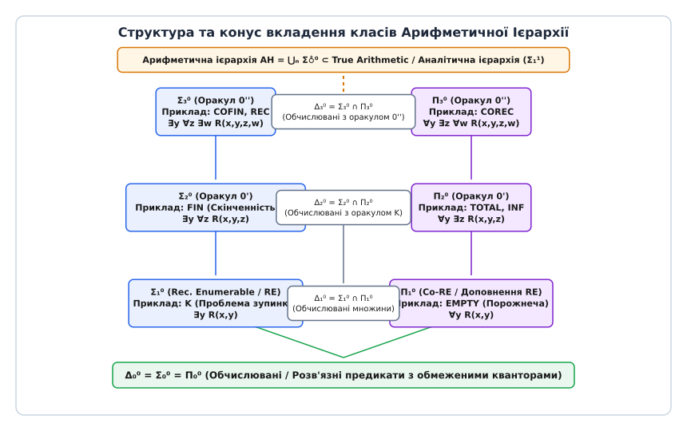
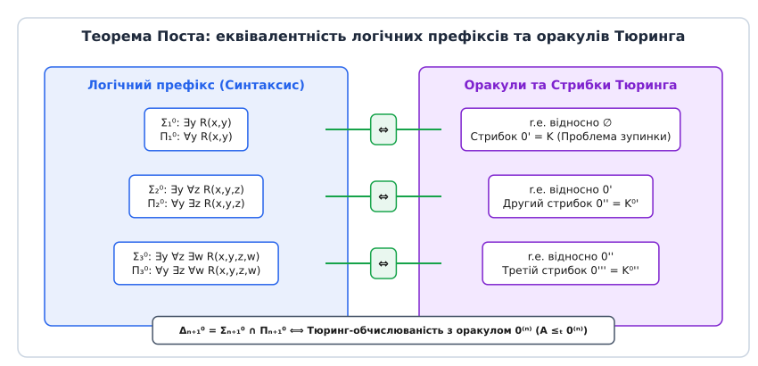

# Арифметична ієрархія

<preknowlist>
- [Проблема зупинки](topic:computability/halting-problem) — нерозв'язність класичної задачі зупинки машини Тюринга.
- [Ступені Тюринга](topic:computability/turing-degrees) — відносна обчислюваність, оракули та операція стрибка Тюринга.
- [Логіка першого порядку](topic:computability/descriptive-complexity) — синтаксис предикатів, квантори існування та загальності.
</preknowlist>

Коли програміст або інженер із верифікації програмного забезпечення намагається з'ясувати, чи зупиниться дана машина Тюринга на порожній стрічці, він стикається з класичною проблемою зупинки. Ця задача є нерозв'язною: у 1936 році Алан Тюринг довів, що не існує універсального алгоритму, який зміг би дати чітку відповідь «так» або «ні» для довільного коду програми. Проте уявімо складнішу практичну ситуацію: нам потрібно перевірити, чи зупиниться дана машина Тюринга на *усіх можливих* вхідних даних (так звана проблема тотальності програми). Якщо гіпотетично надати аналітику «чорну скриньку» — оракул, який миттєво та безкоштовно розв'язує звичайну проблему зупинки для будь-якого поодинокого входу, — то навіть такий оракул не дасть змоги розв'язати проблему тотальності за один крок. Для перевірки нескінченної кількості вхідних значень оракул доведеться опитувати нескінченне число разів.

Це фундаментальне спостереження показує, що світ алгоритмічно нерозв'язних задач не є однорідною та безструктурною безоднею. У ньому існує чітка, сувора математична ієрархія складності. Одні проблеми вимагають лише одного нескінченного пошуку, інші — нескінченного пошуку над нескінченним пошуком, а треті знаходяться ще вище. Для систематизації та класифікації нерозв'язних проблем за кількістю необхідних нескінченних процедур або за виразністю їхніх логічних формул використовують арифметичну ієрархію (грец. *arithmetike* — числове мистецтво, *hierarchia* — священний порядок).

## Синтаксичний фундамент: квантори та арифметичні предикати

В основі арифметичної ієрархії лежить класична формальна арифметика Пеано першого порядку над множиною натуральних чисел `ℕ = {0, 1, 2, 3, ...}`. Об'єктами вивчення є логічні предикати та підмножини натуральних чисел, що задаються формулами з числовими змінними.

Найпростішими базовими цеглинами усієї теорії є обчислювані (або рекурсивні) предикати. Предикат `R(x₁, x₂, ..., xₖ)` називається обчислювальним, якщо існує машина Тюринга, яка за скінченну кількість кроків повертає значення `1` (істина) або `0` (хибність) для будь-якого фіксованого вхідного набору числових аргументів. Наприклад, предикати порівняння `x < y`, перевірки простоти числа `is_prime(x)` або додавання `x + y = z` є повністю обчислюваними.

Якщо логічна формула побудована виключно з обчислювальних предикатів та містить лише обмежені квантори вида `∃z ≤ t` або `∀z ≤ t` (де верхня межа `t` є обчислюваною функцією від вхідних змінних), то така формула описує повністю розв'язну множину. Оскільки перевірка обмеженої кількості значень `z` від `0` до `t` вимагає лише скінченного числа обчислювальних кроків, клас таких предикатів називають базісним рівнем `Δ₀⁰` (або `Σ₀⁰`, `Π₀⁰`).

Якісний стрибок у складність відбувається тоді, коли у формулу вводять необмежені квантори `∃` (існує) та `∀` (для всіх), які охоплюють усю нескінченну множину натуральних чисел `ℕ`.

Розглянемо фундаментальний T-предикат Стівена Кліні `T(e, x, s)`, який стверджує: *«Машина Тюринга з кодом e на вхідному значенні x завершує роботу за точно s кроків, і її обчислювальний слід відповідає числу s»*. Предикат `T(e, x, s)` є повністю обчислюваним без жодного необмеженого квантора (`T ∈ Δ₀⁰`), бо імітація виконання `s` кроків конкретної машини вимагає лише скінченного часу. Під час такої симуляції інтерпретатор просто моделює покрокову зміну стану стрічки та головки машини Тюринга.

Проте якщо ми зафіксуємо вхід `x` та запитаємо, чи існує хоча б один такий крок `s`, на якому машина зупиниться, ми отримуємо формулу з одним необмеженим квантором існування:

```
P(e, x) ≡ ∃s T(e, x, s)
```

Цей предикат визначає класичну проблему зупинки `K`. Квантор існування `∃s` вимагає потенційно нескінченного перебору: якщо машина зупиняється, ми знайдемо відповідне `s` за скінченний час; але якщо вона циклюється, наш перебір триватиме вічно. Формули з одним квантором існування над обчислювальним предикатом утворюють перший рівень ієрархії — клас `Σ₁⁰` (що точно збігається з рекурсивно перелічуваними множинами).

Якщо ж ми розглядаємо заперечення цієї задачі — твердження про те, що машина *ніколи* не зупиниться:

```
Q(e, x) ≡ ∀s ¬T(e, x, s)
```

ми отримуємо перший рівень двоїстого класу `Π₁⁰`, що містить квантор загальності `∀s` та описує доповнення рекурсивно перелічуваних множин (co-RE).

## Спрощення префіксів: парування Кантора та префіксна нормальна форма

У реальних логічних формулах квантори можуть іти поспіль у довільному порядку та кількості. Наприклад, твердження може містити декілька кванторів існування поспіль: `∃y₁ ∃y₂ ∃y₃ R(x, y₁, y₂, y₃)`. Чи збільшує кожний новий однаковий квантор підряд алгоритмічну складність проблеми?

Відповідь — ні. Сусідні однакові квантори одного типу можна згорнути у єдиний квантор того ж типу за допомогою математичного апарату парування.


*Згортання однорідних кванторів логічної формули у канонічну префіксну форму за допомогою функції парування Кантора.*

Для цього використовується бієктивна обчислювана функція парування Георга Кантора (англ. *Cantor pairing function*) `π: ℕ × ℕ → ℕ`:

```
π(a, b) = ⟨a, b⟩ = ((a + b) · (a + b + 1)) / 2 + b
```

Оскільки кожній парі чисел `(a, b)` відповідає єдине натуральне число `Y = ⟨a, b⟩`, а з числа `Y` можна алгоритмічно видобути вихідні компоненти `a = π₁(Y)` та `b = π₂(Y)`, будь-яке твердження про існування двох чисел еквівалентне існуванню їхнього коду Кантора:

```
∃y₁ ∃y₂ R(x, y₁, y₂)
= ∃Y R(x, π₁(Y), π₂(Y))                [парування Кантора: Y = ⟨y₁, y₂⟩]
= ∃Y R'(x, Y)                         [R' — новий обчислювальний предикат]
```

Завдяки функції парування довільний блок з декількох кванторів існування `∃y₁ ∃y₂ ... ∃yₖ` згортається у єдиний квантор `∃Y`. Аналогічно, блок кванторів загальності `∀z₁ ∀z₂ ... ∀zₘ` через двоїстість заперечення та парування Кантора згортається у єдиний квантор `∀Z`.

Отже, будь-яку арифметичну формулу можна синтаксично звести до канонічної префіксної нормальної форми, у якій квантори `∃` та `∀` суворо чергуються:

```
P(x) ≡ Q₁ y₁  Q₂ y₂  Q₃ y₃ ... Q♁ y♁  R(x, y₁, y₂, ..., y♁)
```
де `Qᵢ ≠ Qᵢ₊₁` для всіх `i`, а `R` є обчислювальним предикатом без необмежених кванторів.

Детальний математичний апарат згортання та теорему про нормальну форму Кліні викладено у вставці [🧮 Теорема Поста та математичний апарат](topic:computability/arithmetic-hierarchy/math-post-theorem.md).

## Анатомія арифметичної ієрархії: класи Σ♁⁰, Π♁⁰, Δ♁⁰

На основі кількості чергувань кванторів у канонічній префіксній формі будуються три фундаментальні сімейства класів арифметичної ієрархії.


*Конус вкладення класів арифметичної ієрархії: від розв'язних предикатів Δ₀⁰ до нескінченної драбини Σ♁⁰ та Π♁⁰.*

Для кожного натурального числа `n ≥ 1` визначаються наступні класи множин (або предикатів):

1. **Клас `Σ♁⁰` (Сигма-n):** Множини, що задаються формулами з `n` чергуваннями кванторів, починаючи з квантора існування `∃`:
```
x ∈ A ⟺ ∃y₁ ∀y₂ ∃y₃ ... Q♁ y♁ R(x, y₁, y₂, ..., y♁)
```

2. **Клас `Π♁⁰` (Пі-n):** Множини, що задаються формулами з `n` чергуваннями кванторів, починаючи з квантора загальності `∀`:
```
x ∈ A ⟺ ∀y₁ ∃y₂ ∀y₃ ... Q♁ y♁ R(x, y₁, y₂, ..., y♁)
```

3. **Клас `Δ♁⁰` (Дельта-n):** Перетин відповідних класів `Σ` та `Π` одного рівня:
```
Δ♁⁰ = Σ♁⁰ ∩ Π♁⁰
```

Історичний процес формування цих класів у працях Стівена Кліні та Анджея Мостовського висвітлено у вставці [📜 Історія виникнення арифметичної ієрархії](topic:computability/arithmetic-hierarchy/hist-kleene-hierarchy.md).

### Суворі закони вкладення та двоїстість

Структура арифметичної ієрархії підпорядковується наступним фундаментальним математичним законам:

- **Двоїстість заперечення:** Множина `A` належить до класу `Σ♁⁰` тоді й лише тоді, коли її доповнення `Ā = ℕ \ A` належить до класу `Π♁⁰`:
```
A ∈ Σ♁⁰ ⟺ Ā ∈ Π♁⁰
```
- **Монотонне розширення:** Будь-який клас рівня `n` повністю міститься у класах вищого рівня `n + 1`:
```
Σ♁⁰ ⊂ Δ♁₊₁⁰ ,   Π♁⁰ ⊂ Δ♁₊₁⁰ ,   Δ♁₊₁⁰ = Σ♁₊₁⁰ ∩ Π♁⁰
```
- **Теорема про сувору ієрархію (Strict Hierarchy Theorem):** Усі вкладення в арифметичній ієрархії є суворими. Для кожного `n ≥ 1`:
```
Σ♁⁰ ⊊ Σ♁₊₁⁰ ,   Π♁⁰ ⊊ Σ♁₊₁⁰ ,   Δ♁⁰ ⊊ Σ♁⁰ ,   Δ♁⁰ ⊊ Π♁⁰
```

Доведення суворості вкладення спирається на метод діагоналізації Кантора — Тюринга. Для кожного рівня `n` будується універсальний предикат `Uₙ(e, x) ∈ Σ♁⁰`, який симулює довільну формулу рівня `Σ♁⁰` з номером `e`. Діагональна множина `Dₙ = {e ∣ Uₙ(e, e)}` належить до класу `Σ♁⁰`, але її заперечення `D̄ₙ` належить до `Π♁⁰ \ Σ♁⁰`. Це гарантує, що класи `Σ♁⁰` та `Π♁⁰` ніколи не збігаються для `n ≥ 1`.

Це означає, що існують задачі класу `Σ₂⁰`, які фундаментально неможливо виразити жодною формулою класу `Σ₁⁰` чи `Π₁⁰`, скільки б логічних перетворень ми не застосовували.

## Теорема Поста: міст між логікою та оракулами Тюринга

Синтаксичне визначення через квантори виглядає суто формально-логічним. Виникає питання: який алгоритмічний зміст відповідає додаванню кожного нового квантора `∃` або `∀`?

Відповідь дає грандіозна Теорема Еміля Поста (1948 рік), яка пов'язує кванторні класи `Σ♁⁰` з теорією відносної обчислюваності та оракульними машинами Тюринга.


*Еквівалентність між кванторною складністю формул та ітераціями операції стрибка Тюринга за теоремою Поста.*

Нагадаємо, що оракульна машина Тюринга `Mᴬ` — це машина Тюринга, яка під час обчислення може запитувати спеціальний оракул для множини `A`: *«чи належить число q до множини A?»* і отримувати відповідь за один крок. 

Операція стрибка Тюринга (англ. *Turing jump*) перетворює множину `A` на її проблему зупинки `A'`. Якщо ми почнемо з порожньої множини `0 = ∅`, її першим стрибком буде звичайна проблема зупинки `0' = K`. Другим стрибком буде `0'' = (0')'`, тобто проблема зупинки для машин з оракулом `K`. Послідовне застосування стрибка дає послідовність оракулів `0⁽⁰⁾ = ∅`, `0⁽¹⁾ = 0'`, `0⁽²⁾ = 0''`, ..., `0⁽ⁿ⁾`.

> **Теорема Поста (1948).** Для довільного `n ≥ 0`:
> 1. Множина `A` належить класу `Σ♁₊₁⁰` тоді й лише тоді, коли `A` є рекурсивно перелічуваною відносно оракула `0⁽ⁿ⁾`.
> 2. Множина `A` належить класу `Δ♁₊₁⁰` тоді й лише тоді, коли `A` є Тюринг-обчислюваною з оракулом `0⁽ⁿ⁾` (`A ≤ₜ 0⁽ⁿ⁾`).

Теорема Поста робить фізичний зміст арифметичної ієрархії абсолютно прозорим:
- **Клас `Δ₁⁰`** — це звичайні обчислювані множини без оракула (`A ≤ₜ ∅`).
- **Клас `Σ₁⁰`** — це рекурсивно перелічувані множини (r.e. відносно `∅`).
- **Клас `Δ₂⁰`** — це множини, які можна обчислити за наявності оракула проблеми зупинки `0' = K`.
- **Клас `Σ₂⁰`** — це множини, які є рекурсивно перелічуваними за допомогою оракула `0'`.

Кожне нове чергування кванторів `∃` та `∀` точно відповідає виконанню одного додаткового стрибка Тюринга `0⁽ⁿ⁾`.

## Повні задачі та класифікація властивостей програм

Як і в теорії складності (де є NP-повні задачі), на кожному рівні арифметичної ієрархії існують свої «найважчі» задачі — `Σ♁⁰`-повні та `Π♁⁰`-повні множини. Множина `A` є `Σ♁⁰`-повною, якщо `A ∈ Σ♁⁰` і будь-яка інша множина `B ∈ Σ♁⁰` зводиться до `A` за допомогою обчислюваної функції (m-зведення: `x ∈ B ⟺ f(x) ∈ A`).

Розглянемо канонічні приклади задач на кожному щаблі арифметичної ієрархії.

### Рівень 1: `Σ₁⁰` та `Π₁⁰` (Початкова нерозв'язність)

- **Проблема зупинки `K` (`Σ₁⁰`-повна):**
```
K = {e ∣ ∃s T(e, e, s)}
```
Формула містить один квантор існування `∃s`. Машина `e` зупиняється на власному коді `e`.

- **Проблема порожнечі `EMPTY` (`Π₁⁰`-повна):**
```
EMPTY = {e ∣ Wₑ = ∅} = {e ∣ ∀x ∀s ¬T(e, x, s)}
```
Твердження про те, що область визначення `e`-ї машини `Wₑ` є порожньою. Потребує квантора загальності `∀` для перевірки всіх входів `x` та кроків `s`.

- **Теорема Райса (Rice's Theorem):** Будь-яка нетривіальна семантична властивість програм (тобто властивість обчислюваної функції `φₑ`, а не тексту програми `e`) є алгоритмічно нерозв'язною. Арифметична ієрархія уточнює теорему Райса: вона показує *наскільки саме* нерозв'язною є та чи інша властивість.

### Рівень 2: `Σ₂⁰` та `Π₂⁰` (Скінченність та тотальність)

- **Проблема скінченності `FIN` (`Σ₂⁰`-повна):**
```
FIN = {e ∣ Wₑ є скінченною}
```
Щоб сформулювати скінченність множини `Wₑ`, ми стверджуємо: *«Існує межа n така, що для всіх x > n машина e не зупиняється»*:
```
e ∈ FIN ⟺ ∃n ∀x ∀s (x > n ⟹ ¬T(e, x, s))
```
Формула має префікс `∃n ∀(x,s)`, що після парування Кантора дає префікс `∃ ∀` — отже, `FIN ∈ Σ₂⁰`.

- **Проблема нескінченності `INF` (`Π₂⁰`-повна):**
```
INF = {e ∣ Wₑ є нескінченною} = ℕ \ FIN
```
Оскільки `INF` є доповненням `FIN`, за двоїстістю воно належить до класу `Π₂⁰`:
```
e ∈ INF ⟺ ∀n ∃x ∃s (x > n ∧ T(e, x, s))
```

- **Проблема тотальності `TOTAL` (`Π₂⁰`-повна):**
```
TOTAL = {e ∣ φₑ є всюди визначеною}
```
Твердження, що машина `e` зупиняється на *кожному* вхідному значенні `x`:
```
e ∈ TOTAL ⟺ ∀x ∃s T(e, x, s)
```
Префікс `∀x ∃s` робить проблему тотальності `Π₂⁰`-повною. Це доводить формальне твердження з нашого вступного прикладу: звичайний оракул проблеми зупинки `K` (рівня `Σ₁⁰`) не здатен розв'язати проблему тотальності `TOTAL`, бо `TOTAL ∉ Δ₂⁰`.

- **Теорема Райса — Шапіро (Rice-Shapiro Theorem):** Характеризує `Σ₁⁰`-властивості перелічуваних множин: семантична властивість є перелічуваною тоді й лише тоді, коли вона є компактною та монотонною (тобто задовольняється на нескінченній множині тоді й лише тоді, коли задовольняється на деякій її скінченній підмножині).

### Рівень 3: `Σ₃⁰` та `Π₃⁰` (Співскінченність та рекурсивність)

- **Проблема співскінченності `COFIN` (`Σ₃⁰`-повна):**
```
COFIN = {e ∣ ℕ \ Wₑ є скінченною}
```
Твердження, що область визначення `Wₑ` містить усі натуральні числа, крім скінченної кількості:
```
e ∈ COFIN ⟺ ∃n ∀x (x > n ⟹ x ∈ Wₑ) ⟺ ∃n ∀x ∃s (x > n ⟹ T(e, x, s))
```
Префікс `∃n ∀x ∃s` містить 3 чергування кванторів, даючи клас `Σ₃⁰`.

- **Проблема обчислюваності множини `REC` (`Σ₃⁰`-повна):**
```
REC = {e ∣ Wₑ є обчислюваною (рекурсивною) множиною}
```
З'ясувати за кодом програми `e`, чи є описана нею перелічувана множина `Wₑ` насправді повністю розв'язною (рекурсивною), вимагає 3 чергування кванторів: `∃i (Wₑ = ℕ \ Wᵢ)`. Ця задача належить до класу `Σ₃⁰`-повних.

- **Проблема нерекурсивності `COREC` (`Π₃⁰`-повна):**
```
COREC = {e ∣ Wₑ не є обчислюваною множиною} = ℕ \ REC
```

## Зведена таблиця канонічних задач арифметичної ієрархії

| Клас | Кванторний префікс | Канонічна повна задача | Фізичний / Алгоритмічний зміст |
| :--- | :--- | :--- | :--- |
| **`Δ₀⁰`** | Обмежені квантори | Перевірка простоти числа `x` | Розв'язна за скінченний час без пошуку |
| **`Σ₁⁰`** | `∃y R(x,y)` | `K` (Проблема зупинки) | Напіврозв'язна (перелічувана) задача |
| **`Π₁⁰`** | `∀y R(x,y)` | `EMPTY` (`Wₑ = ∅`) | Доповнення перелічуваної задачі |
| **`Δ₂⁰`** | Оракул `0'` | Оракульне обчислення з `K` | Розв'язна за допомогою оракула зупинки |
| **`Σ₂⁰`** | `∃y ∀z R(x,y,z)` | `FIN` (`Wₑ` скінченна) | Існує межа для нескінченної перевірки |
| **`Π₂⁰`** | `∀y ∃z R(x,y,z)` | `TOTAL` (`φₑ` всюди визначена) | Зупинка на всіх вхідних значеннях |
| **`Σ₃⁰`** | `∃y ∀z ∃w R(x,y,z,w)` | `REC` (`Wₑ` розв'язна) | Множина належить до класу обчислюваних |

Практичну реалізацію автоматичного аналізатора логічних префіксів та симулятора арифметичних класів у коді наведено у вставках [⚙️ Симулятор аналізу кванторних префіксів](topic:computability/arithmetic-hierarchy/proj-formula-classifier.md) та [📋 Специфікація інтерфейсу оракулів](topic:computability/arithmetic-hierarchy/api-arithmetic-oracle.md).

## Межі ієрархії: неарифметичні множини та аналітичне розширення

Чи вичерпує арифметична ієрархія `AH = ⋃ₙ Σ♁⁰` геть усі можливі математичні множини натуральних чисел?

Відповідь — ні. Існують множини, які знаходяться суворо *вище* усієї арифметичної ієрархії.

Найвідомішим прикладом є **True Arithmetic (`Th(ℕ, +, ×)`)** — множина номерів усіх істинних тверджень арифметики Пеано. 

За фундаментальною Теоремою Альфреда Тарського про невизначуваність істинності (1933 рік), поняття істинності арифметичного твердження не можна виразити всередині самої арифметики Пеано. Якби множина `True Arithmetic` належала до деякого класу `Σ♁⁰` арифметичної ієрархії для фіксованого `n`, то за допомогою парадоксу брехуна та ґеделівської нумерації можна було б побудувати суперечливе рекурсивне твердження.

Отже:
```
True Arithmetic  ∉  ⋃ₙ=1^∞ Σ♁⁰
```

Для класифікації об'єктів, що лежать за межами арифметичної ієрархії, математична логіка використовує наступні розширення:

1. **`ω`-стрибок (Omega jump):** Гіперарифметична ієрархія (англ. *hyperarithmetic hierarchy*), яка продовжує арифметичні рівні в область трансфінітних ординальних чисел Кантора `ω, ω+1, ω^2, ...` за допомогою конструкції `0⁽ʷ⁾`.
2. **Аналітична ієрархія (Analytical Hierarchy):** Позначається індексом `1` (`Σ♁¹`, `Π♁¹`, `Δ♁¹`). У ній дозволяється квантифікація вищого порядку — не лише над натуральними числами `ℕ`, але й над нескінченними послідовностями чи функціями `f: ℕ → ℕ` (або підмножинами натуральних чисел). Наприклад, предикати виду `∃f ∀x R(x, f(x))` утворюють клас `Σ₁¹`.

## Практичний вимір у верифікації програм та компіляторах

Може здатися, що дослідження предикатів рівня `Σ₂⁰` чи `Σ₃⁰` — це абстрактна вправа для логіків. Проте арифметична ієрархія має безпосередній практичний стосунок до розробки надійного програмного забезпечення та статичного аналізу коду.

> 🔧 **Навіщо це у верифікації коду.**
> При автоматиційній верифікації програм інженери перевіряють три основні типи властивостей:
> 1. **Safety Properties (Властивості безпечності — «нічого поганого не станеться»):** Відсутність виходу за межі масиву, відсутність ділення на нуль, відсутність взаємоблокувань (deadlocks). Ці властивості мають формальну структуру `Π₁⁰` (для всіх кроків виконання стан системи залишається коректним). Спростувати таку властивість можна скінченним контрприкладом (трасою виконання), що належить до `Σ₁⁰`.
> 2. **Liveness Properties (Властивості життєздатності — «щось добре неодмінно станеться»):** Запит до сервера врешті-решт отримає відповідь; потік вийде з циклу. Ці властивості мають формальну структуру `Σ₂⁰` або `Π₂⁰`. Для їхнього доведення недостатньо простої перевірки скінченної траси — потрібні інваріанти та варіанти циклів.
> 3. **Fairness Properties (Властивості справедливості):** Якщо процес нескінченно часто запитує ресурс, він нескінченно часто його отримує. Формалізуються префіксами `∀∃` або `∃∀` рівнів `Π₂⁰` / `Σ₂⁰`.
> 
> Розуміння кванторного рівня властивості підказує розробникам інструментів верифікації (таких як Z3 SMT solver або CBMC), який математичний рушій слід застосувати: чи достатньо символьного виконання (для `Σ₁⁰`), чи необхідна побудова індуктивних інваріантів та функцій впорядкування (для `Π₂⁰`).

Таким чином, арифметична ієрархія слугує компасом, який визначає точні межі того, що в принципі можна піддати автоматичному статичному аналізу, а де розробники інструментів верифікації неминуче стикнуться з глибоким алгоритмічним бар'єром нерозв'язності.
