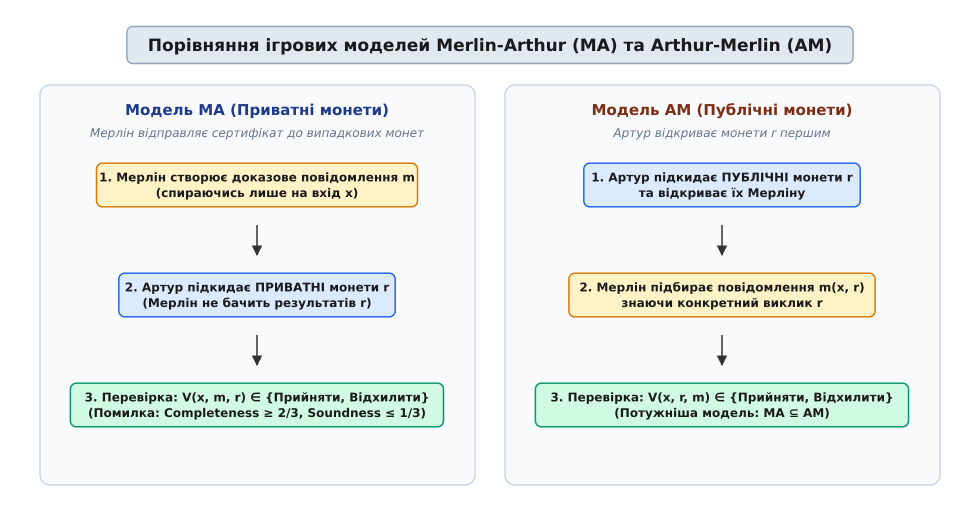
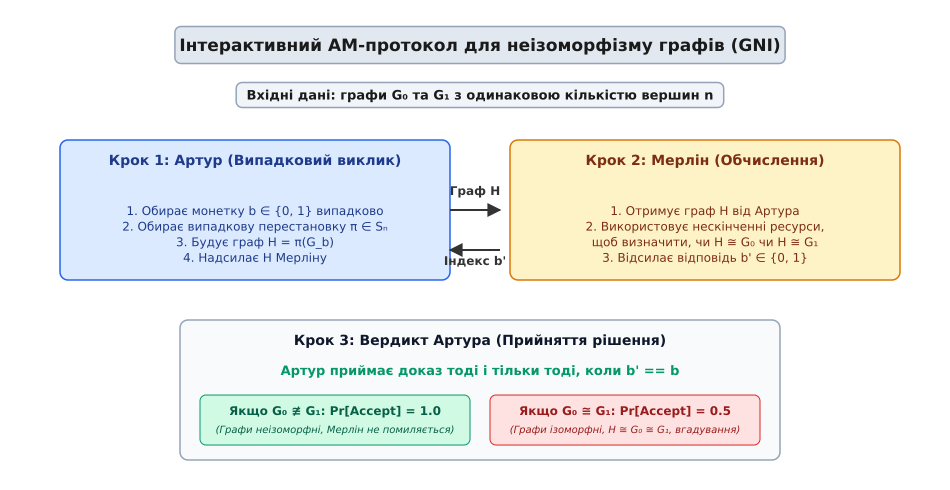
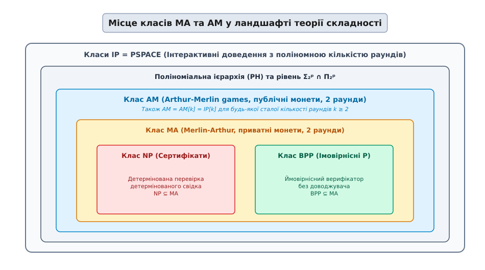

# Ігри Артура — Мерліна: публічні монети, інтерактивні доведення та ієрархія складності

<preknowlist>
- [Асимптотична складність](topic:computability/asymptotic-complexity) — нотація O(…), поліномний час.
- [Класи P і NP](topic:computability/p-vs-np) — детерміновані та недетерміновані обчислення, перевірка свідків.
- [NP-повнота](topic:computability/np-completeness) — поняття поліномного зведення Карпа та найважчих задач.
- [Теорема Кука — Левіна](topic:computability/cook-levin-theorem) — здійсненність булевих формул (SAT) як перша NP-повна задача.
- [Класи PSPACE та IP](topic:computability/pspace) — пам'ять поліноміального розміру та інтерактивні доведення.
- [Поліноміальна ієрархія](topic:computability/polynomial-hierarchy) — кванторна структура та рівні Σ₂ᵖ / Π₂ᵖ.
</preknowlist>

Уявімо банківський сервер, який змушений довірити виконання складних комбінаторних обчислень зовнішньому хмарному суперкомп'ютеру, оператори якого можуть надати помилковий або навмисно зфальсифікований результат. Якщо обчислювана задача належить до класичного класу `NP` (наприклад, пошук здійснюваного набору у булевій формулі), суперкомп'ютер може просто передати коротке свідоцтво — вектор значень змінних. Банківський сервер перевіряє це свідоцтво за поліномний час і, переконавшись у його коректності, приймає результат. Але що робити серверу, якщо задача вимагає перевірки відсутності розв'язку, аналізу неізоморфізму двох величезних графів або доведення властивостей, для яких не існує короткого детермінованого свідка у межах `NP`? У такій ситуації статична перевірка виявляється безсилою.

У 1985 році математик Ласло Бабаї запропонував фундаментальний вихід із цього глухого кута, переосмисливши саме поняття математичного доказу. Замість пасивного читання статичного сертифіката верифікатор вступає в імовірнісний активний діалог із доводжувачем. Бабаї надав цій обчислювальній концепції яскраву ігрову метафору: верифікатором виступає король Артур — імовірнісний суб'єкт, обчислювальні можливості якого обмежені поліномним часом, а доводжувачем є чарівник Мерлін — всемогутній недетермінований суб'єкт з необмеженою обчислювальною потужністю. Такий підхід започаткував теорію **ігор Артура — Мерліна** (Arthur-Merlin Games) та дав початок сучасному апарату інтерактивних доведень.

## Від статичного доказу до імовірнісного діалогу

Щоб осягнути революційність ідеї Бабаї, необхідно зіставити її з класичною теорією складності. У класичному класі `NP` верифікація є абсолютно односторонньою, статичною та пасивною. Весь процес обмежується двома фіксованими кроками:
1. Мерлін створює свідок (сертифікат) `w` поліноміальної довжини `|w| ≤ p(|x|)`.
2. Артур отримує `w` і детерміновано обчислює `V(x, w) ∈ {0, 1}` за поліномний час від довжини входу `|x|`.
3. Перевірка вважається успішною, якщо для будь-якого `x ∈ L` існує принаймні один свідок `w`, а для `x ∉ L` жодного приймаючого свідка не існує взагалі.

Ця математична модель не залишає місця для випадковості чи сумніву: Артур або отримує беззаперечне детерміноване підтвердження, або відхиляє вхід. Однак ця ж жорсткість обмежує можливості Артура. Якщо для перевірки твердження Мерлін повинен перебрати експоненційну кількість варіантів (наприклад, довести неізоморфізм двох графів), розмір детермінованого свідка стає непідйомним, а сам свідок виходить за межі поліноміального простору `NP`.

Ігри Артура — Мерліна розширюють класичну модель `NP`, надаючи Артуру **генератор випадкових монет** (random coins). Завдяки випадковості Артур втрачає абсолютну детерміновану впевненість, але натомість отримує здатність ставити Мерліну випадкові прицільні запитання (виклики). Якщо твердження істинне (`x ∈ L`), Мерлін переконує Артура з високою ймовірністю (властивість повноти, Completeness). Якщо ж твердження хибне (`x ∉ L`), будь-які маніпуляції та обмани з боку Мерліна можуть дурити Артура лише з малою ймовірністю (властивість обґрунтованості, Soundness).

Такий підхід фундаментально змінює філософію перевірки: замість вимоги перевірити весь простір варіантів, Артур перевіряє випадкову точку або випадкову проекцію цього простору. Якщо Мерлін стверджує, що володіє знанням або що дві математичні структури є принципово відмінними, Артур ставить виклик, який змушує Мерліна продемонструвати це знання на практиці у реальному часі.

З математичної точки зору, введення випадковості створює гнучкий імовірнісний простір, у якому повнота і обґрунтованість відокремлені достатнім імовірнісним розривом. Оскільки Артур володіє випадковими монетами, він може ставити виклики, які неможливо передбачити заздалегідь. Якщо доводжувач не знає, які саме біти випадуть у верифікатора, він позбавлений можливості завчасно побудувати хибний сертифікат, який би задовольняв усі можливі виклики одночасно.

Фундаментальною властивістю імовірнісного розриву є його стійкість до параметризації: будь-який розрив вигляду `c - s ≥ 1/p(n)` (де `p(n)` — поліном) можна за допомогою послідовного або паралельного повторення протоколу розширити до експоненціально великого розриву `c ≥ 1 - 2^(-q(n))` та `s ≤ 2^(-q(n))`. Це гарантує, що константи `2/3` та `1/3` у визначеннях класів є лише домовленістю, яка не змінює самого класу мов.

Детальний аналіз витоків цієї концепції та паралельного відкриття криптографічних протоколів нульового розголошення міститься у нарисі [Історія інтерактивних доведень](topic:computability/arthur-merlin-games/hist-interactive-proofs.md).

## Формалізація моделей: класи Merlin-Arthur (MA) та Arthur-Merlin (AM)

Залежно від того, хто з гравців робить перший крок у діалозі та кому доступні результати підкидання випадкових монет, теорія складності виділяє дві основні ігрові моделі: `MA` (Merlin-Arthur) та `AM` (Arthur-Merlin).

### 1. Модель Merlin-Arthur (MA)
У грі `MA` діалог складається з двох послідовних кроків:
1. **Крок Мерліна:** Мерлін, знаючи лише вхідний рядок `x`, створює та надсилає Артуру доказове повідомлення `m ∈ {0, 1}^p(|x|)`.
2. **Крок Артура:** Артур отримує `m`, підкидає серію ПРИВАТНИХ випадкових монет `r ∈ {0, 1}^q(|x|)` та обчислює детермінований предикат `V(x, m, r) ∈ {0, 1}`.

Оскільки Мерлін створює доказ `m` ДО того, як Артур підкине монети `r`, Мерлін не знає результатів випадкового вибору Артура. Повідомлення Мерліна `m` залежить виключно від входу `x`.

Формальні умови належності мови `L` до класу `MA`:
- **Повнота (Completeness):** Якщо `x ∈ L`, то існує таке повідомлення `m`, що `Pr_r [ V(x, m, r) = 1 ] ≥ 2/3`.
- **Обґрунтованість (Soundness):** Якщо `x ∉ L`, то для будь-якого повідомлення `m` виконується `Pr_r [ V(x, m, r) = 1 ] ≤ 1/3`.

Ігрове дерево для моделі `MA` має наступну структуру: у корені дерева знаходиться існувальний вузол вибору Мерліна `m`, за яким слідує ймовірнісний вузол випадкових монет Артура `r`.

```
                    Ігрове дерево моделі MA
                         [ Вхід x ]
                             │
                      ∃ m (Крок Мерліна)
                             │
                      ┌──────┴──────┐
                      ▼             ▼
                    m = m₁        m = m₂
                      │             │
                Pr_r (Монети)  Pr_r (Монети)
                      │             │
                 ┌────┴────┐   ┌────┴────┐
                 ▼         ▼   ▼         ▼
                r=r₁      r=r₂ r=r₁     r=r₂
```

Клас `MA` можна розглядати як імовірнісну аналогію `NP`, де детермінований верифікатор замінено на імовірнісну машину класу `BPP`. Звідси природно випливають вкладення `NP ⊆ MA` та `BPP ⊆ MA`. Якщо випадкові монети не використовуються (`q = 0`), клас `MA` вироджується у звичайний `NP`. Якщо повідомлення Мерліна є порожнім (`p = 0`), клас `MA` вироджується у `BPP`.

### 2. Модель Arthur-Merlin (AM)
У грі `AM` порядок кроків змінюється на протилежний:
1. **Крок Артура:** Артур підкидає ПУБЛІЧНІ випадкові монети `r ∈ {0, 1}^q(|x|)` і відкрито надсилає результати `r` Мерліну.
2. **Крок Мерліна:** Мерлін бачить монети `r` і підбирає відповідь `m(x, r) ∈ {0, 1}^p(|x|)` спеціально під цей конкретний випадковий виклик.
3. **Вердикт Артура:** Артур детерміновано обчислює `V(x, r, m) ∈ {0, 1}`.

Формальні умови належності мови `L` до класу `AM` (або `AM[2]`):
- **Повнота (Completeness):** Якщо `x ∈ L`, то `Pr_r [ ∃ m : V(x, r, m) = 1 ] ≥ 2/3`.
- **Обґрунтованість (Soundness):** Якщо `x ∉ L`, то `Pr_r [ ∃ m : V(x, r, m) = 1 ] ≤ 1/3`.

Ігрове дерево для моделі `AM` має перевернуту структуру: у корені знаходиться ймовірнісний вузол монет Артура `r`, а під ним розміщені існувальні вузли вибору Мерліна `m(r)`.

```
                    Ігрове дерево моделі AM
                         [ Вхід x ]
                             │
                      Pr_r (Монети Артура)
                             │
                      ┌──────┴──────┐
                      ▼             ▼
                    r = r₁        r = r₂
                      │             │
                ∃ m(r₁) (Мерлін) ∃ m(r₂) (Мерлін)
                      │             │
                 ┌────┴────┐   ┌────┴────┐
                 ▼         ▼   ▼         ▼
                m=m₁      m=m₂ m=m₁     m=m₂
```


*Порівняння структур протоколів MA (приватні монети) та AM (публічні монети).*

Оскільки у грі `AM` Мерлін дізнається монети `r` до того, як сформує свою відповідь `m`, він має значно більше простору для маневру: його відповідь `m` є функцією від `r`. Будь-який протокол класу `MA` можна легко виконати в моделі `AM` (Артур просто ігнорує той факт, що Мерлін побачив монети `r`). Отже, виконується фундаментальне включення:

```
MA ⊆ AM
```

Кванторна структура обох класів чітко показує їхню відмінність: у `MA` існувальний квантор за свідком стоїть перед ймовірнісним за монетами (`∃ m Pr_r`), тоді як у `AM` ймовірнісний квантор передує існувальному (`Pr_r ∃ m`). Зміна порядку кванторів істотно посилює Мерліна, роблячи клас `AM` ширшим за `MA`.

## Еквівалентність монет та теорема Ґольдвассер — Зіпсера

Коли теорія інтерактивних доведень тільки формувалася, наукова спільнота розділилася на два табори. Криптографічний напрямок (Ґольдвассер, Мікалі, Ракофф) вивчав модель `IP`, у якій монети верифікатора були **приватними** (прихованими від доводжувача). Вважалося, що приватність монет є фундаментальною передумовою безпеки: якщо Мерлін не бачить монет Артура, він не може завчасно підготувати обман або вирахувати сліпі плями верифікатора. Модель Бабаї `AM`, навпаки, базувалася на **публічних монетах** (public coins), де Артур «грає у відкриту» і транслює всі підкинуті випадкові біти Мерліну.

Здавалося очевидним, що приватні монети роблять верифікатора сильнішим, і тому `AM` має бути строго слабшим за `IP`. Проте у 1986 році Шафі Ґольдвассер та Майкл Зіпсер спростували цю інтуїцію, довівши теорему про еквівалентність монет.

> **Теорема Ґольдвассер — Зіпсера (1986).** Для будь-якої сталої кількості раундів `k` будь-який інтерактивний протокол з приватними монетами `IP[k]` можна засимулювати протоколом з публічними монетами `AM[k+2]` з додаванням лише двох додаткових раундів:
>
> `IP[k] ⊆ AM[k+2]`

Математична ідея перетворення полягає у зміні предмету доведення. Замість того щоб критично приховувати випадковий вибір, Артур змушує Мерліна доводити, що **множина приймаючих монет `S_x` має великий розмір**.

Позначимо через `S_x ⊆ {0, 1}^q` множину послідовностей монет Артура, при яких існує приймаюча відповідь Мерліна. Якщо `x ∈ L`, то розмір множини `|S_x|` великий (наприклад, більший за `(2/3) · 2^q`). Якщо ж `x ∉ L`, то розмір `|S_x|` малий (менший за `(1/3) · 2^q`).

Для публічної довідності розміру `S_x` Артур застосовує 2-універсальні хеш-функції `h : {0, 1}^q → {0, 1}^m`, відправляючи Мерліну випадкову хеш-функцію `h` та випадковий рядок `z ∈ {0, 1}^m`. 

Властивість 2-універсального хешування гарантує рівномірність покриття:
```
Pr_{h ∈ H} [ h(y₁) = z₁  ∧  h(y₂) = z₂ ] = 1 / 2^(2m)
```

Якщо множина монет `S_x` велика, то з імовірністю, близькою до 1, випадковий елемент `z` має прообраз у `S_x`, який Мерлін може пред'явити Артуру. Якщо ж множина `S_x` мала, такого прообразу з великою ймовірністю не існує взагалі.

Артур перевіряє пред'явлений елемент `y` за дві швидкі детерміновані дії: перевіряє, що `y ∈ S_x` (запускаючи свій вихідний детермінований предикат) та перевіряє тотожність `h(y) == z`. Оскільки хеш-функція `h` і рядок `z` обираються відкритими публічними монетами у першому раунді, весь протокол перетворюється на публічно-монетну AM-гру.

Конструкція Гольдвассер — Зіпсера розв'язала принципову теоретичну суперечку: вона довела, що приховування випадкових бітів верифікатором не розширює обчислювальний клас інтерактивних доведень для будь-якої сталої кількості раундів. Публічні монети Артура мають таку ж фундаментальну математичну силу, як і приховані криптографічні секрети.

Крім того, цей результат підкреслив ключову відмінність між чисто складнісним контекстом та криптографічним: для вимірювання обчислювальної складності розпізнавання мов приватність монет не додає потужності, однак для створення властивості **нульового розголошення** (Zero-Knowledge) приватність монет залишається критичною вимовою, оскільки публічні монети передають Мерліну ентропію Артура.

Повний математичний вивід цього перетворення та нерівності ампліфікації помилки наведено у матеріалі [Математичний апарат ігор Артура — Мерліна](topic:computability/arthur-merlin-games/math-public-vs-private-coins.md).

## Згортання раундів та теорема Бабаї (AM[k] = AM[2])

Ще одним фундаментальним питанням теорії ігор Артура — Мерліна була роль кількості раундів взаємодії. Позначимо через `AM[k]` клас мов, які можна верифікувати за `k` раундів публічного обміну повідомленнями між Артуром та Мерліном.

Наприклад:
- `AM[2]` (або просто `AM`): Артур відправляв монети `r`, Мерлін відповідає `m` (послідовність `A → M`).
- `AM[3]` (або `MAM`): Мерлін відправляв `m₁`, Артур відправляв `r`, Мерлін відповідає `m₂` (послідовність `M → A → M`).
- `AM[4]` (послідовність `A → M → A → M`).

Здавалося, що із збільшенням кількості раундів `k` верифікатор отримує все більше можливостей заплутати шкідливого доводжувача, перевіряючи узгодженість його відповідей у часі. Однак Ласло Бабаї та Шаї Моран (Shai Moran) у 1988 році довели вражаючу **теорему про згортання раундів** (Round Reduction Theorem).

> **Теорема Бабаї — Морана (1988).** Для будь-якого сталого числа раундів `k ≥ 2` багатораундовий клас `AM[k]` повністю збігається з двораундовим класом `AM[2]`:
>
> `AM[k] = AM[2] = AM  (для будь-якого сталого k ≥ 2)`

Механізм згортання раундів базується на ідеї паралельної симуляції та випереджального вибору. Якщо протокол містить послідовність `M → A → M` (де Мерлін спочатку надсилає `m₁`, Артур відповідає випадковим `r`, а Мерлін дає `m₂`), Артур може змінити порядок: Артур спочатку генерує набір із `N` паралельних незалежних випадкових викликів `(r₁, r₂, ..., r_N)` і відкриває їх Мерліну. Мерлін змушений надіслати відповіді одразу на весь набір викликів.

Математичне обґрунтування згортання раундів спирається на верхню хвостову межу нерівності Чернова:
```
Pr [ ∑ X_i ≥ N/2 ] ≤ exp( - 2 · N · ε² )
```
Якщо твердження хибне, ймовірність того, що Мерлін підбере приймаючі відповіді для більше ніж половини паралельних викликів, спадає експоненціально з ростом `N`. Це дозволяє згорнути три раунди `MAM` у два раунди `AM` без втрати точності.

За індукцією це згортання застосовується до будь-якої сталої кількості раундів `k`. Сконструйоване доведення свідчить про те, що для будь-якої сталої кількості раундів публічні монети не додають обчислювальної сили: двораундовий виклик `AM` охоплює увесь потенціал скінченнораундових ігор з відкритими монетами.

Однак важливо підкреслити: теорема Бабаї — Морана діє лише для **сталої** кількості раундів `k = O(1)`. Якщо кількість раундів зростає поліноміально від довжини входу (`k = poly(n)`), клас `AM[poly(n)]` перетворюється на повний `IP`, який за теоремою Шаміра 1990 року збігається з `PSPACE`.

## Практичний застосунок: проблема неізоморфізму графів (GNI ∈ AM)

Найвідомішим та найважливішим практичним прикладом задачі, яка належить до класу `AM`, але невідомо, чи належить вона до `NP`, є **задача неізоморфізму графів** (Graph Non-Isomorphism, GNI).

Два неорієнтовані графи `G₀ = (V, E₀)` та `G₁ = (V, E₁)` називаються **ізоморфними** (`G₀ ≅ G₁`), якщо існує така перестановка вершин `π`, яка зберігає всі ребра. Задача перевірки ізоморфізму графів (Graph Isomorphism, GI) належить до `NP`, оскільки сама перестановка `π` слугує коротким детермінованим свідком, який Артур перевіряє за час `O(n²)`.

Проте доповнення цієї задачі — перевірка того, що два графи **НЕ є ізоморфними** (`G₀ ≇ G₁`) — належить до класу `coNP`. Надіслати коротке детерміноване свідоцтво того, що *жодна* з `n!` можливих перестановок не зберігає ребра, у межах класичного `NP` неможливо.

Артур та Мерлін розв'язують цю задачу за допомогою двораундового AM-протоколу всього за `O(n²)` кроків:

```
            Покроковий AM-протокол для Graph Non-Isomorphism
   
   Вхід: Два графи G₀ та G₁ з однаковою кількістю вершин n.
   
   Крок 1 (Артур — Публічний виклик):
   • Підкидає випадкову монету b ∈ {0, 1} рівномірно.
   • Обирає випадкову перестановку вершин π ∈ Sₙ.
   • Будує викликовий граф H = π(G_b).
   • Публічно надсилає граф H Мерліну.
   
   Крок 2 (Мерлін — Недетерміноване обчислення):
   • Обчислює, чи H ≅ G₀ чи H ≅ G₁.
   • Якщо G₀ ≇ G₁, граф H може бути ізоморфним лише одному з них.
     Мерлін однозначно визначає b' = b і відсилає b' Артуру.
   • Якщо G₀ ≅ G₁, граф H одночасно ізоморфний і G₀, і G₁.
     Мерлін бачить H, але не може знати, з якого саме графа Артур
     його утворив (простори перестановок π(G₀) та π(G₁) повністю збігаються).
     Імовірність Мерліна вгадати b' = b дорівнює точно 1/2.
   
   Крок 3 (Детермінована перевірка Артура):
   • Артур приймає доказ тоді і тільки тоді, коли b' == b.
```


*Інтерактивний AM-протокол для неізоморфізму графів: Артур будує випадковий виклик, Мерлін відновлює вихідний індекс.*

Алгебраїчна причина ефективності протоколу полягає у геометрії орбіт перестановок. Позначимо через `Orb(G)` множину всіх графів, ізоморфних `G`. 
- Якщо `G₀ ≇ G₁`, то орбіти `Orb(G₀)` та `Orb(G₁)` є диз'юнктними множинами (`Orb(G₀) ∩ Orb(G₁) = ∅`). Кожен випадковий граф `H` належить строго одній орбіті, тому всемогутній Мерлін легко відновлює біт `b`.
- Якщо ж `G₀ ≅ G₁`, то орбіти повністю збігаються (`Orb(G₀) = Orb(G₁)`). Рівномірний розподіл графа `H = π(G₀)` повністю тотожний розподілу `H = π(G₁)`. Доводжувач Мерлін отримує об'єкт `H`, який не містить жодного біта інформації про початковий вибір Артура `b`.

Розглянемо конкретний мініатюрний приклад для `n = 4` вершин. Нехай граф `G₀` є простим циклом `C₄` (4 ребра), а граф `G₁` є зіркою `K₁,₃` (три ребра, під'єднані до однієї центральної вершини). Оскільки кількість ребр різниться (`4 ≠ 3`), графи завідомо неізоморфні. Коли Артур надсилає переставлений граф `H`, Мерлін обчислює кількість ребр в `H`: якщо ребр 4, він негайно відповідає `b' = 0`; якщо ребр 3, він відповідає `b' = 1`. У цьому випадку Мерлін ніколи не помиляється.

Якщо ж `G₀` та `G₁` мають однакову кількість ребр та однаковий степенний послідовний вектор (наприклад, цикл `C₄` та об'єднання двох диз'юнктних відрізків `2K₂`), але є ізоморфними, Мерлін не бачить жодної відмінності між `π(G₀)` та `π(G₁)`, тому його шанси вгадати вихідний біт становлять точно 50%.

Аналіз точності протоколу GNI:
- **Повнота (Completeness):** Якщо графи неізоморфні (`G₀ ≇ G₁`), Мерлін володіє необмеженими ресурсами і завжди бачить, якому саме графа ізоморфний `H`. Він завжди відповідає правильно: `Pr[Accept] = 1.0`.
- **Обґрунтованість (Soundness):** Якщо графи ізоморфні (`G₀ ≅ G₁`), множини графічних ізоморфів `π(G₀)` та `π(G₁)` є тотожними. Граф `H` не містить жодної інформації про біт `b`. Мерлін змушений вгадувати біт `b`. Його імовірність обдурити Артура у кожному раунді становить `1/2`.

Повторивши цей протокол `k = 30` разів незалежно, імовірність того, що шкідливий Мерлін обдурить Артура для двох ізоморфних графів, стає меншою за `(1/2)³⁰ ≈ 10⁻⁹` (один шанс на мільярд).

Повну реалізацію цього протоколу мовами C та C++ з використанням матриць суміжності та генераторів випадкових перестановок наведено у файлі [Реалізація AM-протоколу неізоморфізму графів](topic:computability/arthur-merlin-games/proj-graph-nonisomorphism.md).

## Зв'язок із поліноміальною ієрархією та теорема про колапс

Місце класів `MA` та `AM` у загальній структурній ієрархії теорії складності визначається їхньою строгою вкладеністю між імовірнісними обчисленнями та другим рівнем поліноміальної ієрархії `PH`.

Співвідношення основних класів складності:

```
P ⊆ BPP ⊆ MA ⊆ AM ⊆ Σ₂ᵖ ∩ Π₂ᵖ ⊆ PH ⊆ IP = PSPACE
```


*Співвідношення класів складності навколо Артура — Мерліна: BPP ⊆ MA ⊆ AM ⊆ Σ₂ᵖ ∩ Π₂ᵖ та IP = PSPACE.*

Вкладення `AM ⊆ Π₂ᵖ` доводиться шляхом вираження ймовірнісної умови `Pr_r [ ∃ m : V(x, r, m) = 1 ] ≥ 2/3` через предикат з двома кванторами `∀ r_set ∃ m`.

Найбільш резонансним теоретичним результатом стосовно класу `AM` є **теорема про колапс поліноміальної ієрархії** (Boppana — Håstad — Zachos / Schöning).

> **Теорема про колапс ієрархії.** Якщо клас `coNP` міститься у класі `AM` (`coNP ⊆ AM`), то поліноміальна ієрархія згортається до свого другого рівня:
>
> `Σ₂ᵖ = Π₂ᵖ = PH`

Доведення цієї теореми виходить із заміни внутрішнього предикату `coNP` у кванторній формі `Σ₂ᵖ = ∃ y ∀ z R(x, y, z)` на двораундовий протокол `AM`. Використовуючи паралельну ампліфікацію точності та принцип винесення ймовірнісного квантора назовні, кванторна вежа `∃ ∀ ∃` скорочується до `∀ ∃`, що відповідає класу `Π₂ᵖ`. Отже, `Σ₂ᵖ ⊆ Π₂ᵖ`, що автоматично призводить до `Σ₂ᵖ = Π₂ᵖ = PH`.

З цієї теореми випливає критичний фундаментальний висновок для задачі неізоморфізму графів (GNI):
Оскільки мова `GNI` належить до `coNP` і, як ми довели вище, належить до `AM`, вона підпорядковується цій теоремі. Якби задачею неізоморфізму графів `GNI` виявилася `NP`-повною, то за властивістю зведення Карпа будь-яка мова з `coNP` зводилася б до `GNI`, що означало б включення `coNP ⊆ AM`.

Це призвело б до катастрофічного колапсу усієї поліноміальної ієрархії `PH` до рівня `Σ₂ᵖ`. Оскільки переважна більшість фахівців теорії складності переконані у нескінченності та безперервності ієрархії `PH` (тобто `PH` не згортається на жодному скінченному рівні), це слугує майже беззаперечним доказом того, що **задача неізоморфізму графів НЕ є NP-повною**.

Вона утворює один із найяскравіших реальних кандидатів на роль NP-проміжної задачі (NP-intermediate problem), існування яких для випадку `P ≠ NP` було доведено теоремою Леднера.

Крім того, клас `AM` володіє цікавими властивостями відносно оракулів та схемної складності. Зокрема, за теоремою Карпа — Ліптона, якщо `NP ⊆ P/poly`, то поліноміальна ієрархія згортається до `PH = Σ₂ᵖ`. У контексті ігор Артура — Мерліна було встановлено, що `NP ⊆ P/poly ⇒ NP ⊆ MA`, що дає ще глибше розуміння зв'язку між підкиданням монет та порадою нерівномірних обчислень.

З фундаментальної точки зору, відсутність NP-повноти для GNI була згодом підтверджена у 2016 році квазіполіноміальним детермінованим алгоритмом Ласло Бабаї для задачі ізоморфізму графів (GI), який працює за час `exp(O((log n)^c))`.

## Дерандомізація та сучасне інженерне значення

Розвиток теорії складності наприкінці 1990-х та у 2000-х роках (Impagliazzo, Wigderson, Klivans, van Melkebeek) привів до вражаючого гіпотетичного висновку: випадкові монети Артура, ймовірно, взагалі не розширюють обчислювальні межі класичного класу `NP`.

За умови прийняття природної дерандомізаційної гіпотези про те, що у класі `E = DTIME(2^(O(n)))` існують функції, які вимагають схем експоненціального розміру (тобто складність схем `S(n) = 2^(Ω(n))`), класи складності `MA` та `AM` повністю дерандомізуються:

```
MA = NP  та  AM = NP
```

Це означає, що імовірнісний виклик Артура є надзвичайно ефективним інструментом для швидкого пошуку та верифікації доведень «тут і зараз», але з точки зору фундаментальної обчислювальної сили складність цих задач збігається з детермінованою верифікацією `NP`. Випадкові монети дозволяють стискати докази та будувати зручні діалоги, але не дозволяють розв'язувати задачі, які виходять за межі недетермінованого поліноміального часу.

На практичному інженерному рівні концепція ігор Артура — Мерліна переживає колосальний розквіт у сучасних криптографічних системах та розподілених обчисленнях. Використовуючи **перетворення Фіата — Шаміра** (Fiat-Shamir heuristic), публічні випадкові монети Артура `r` замінюються хеш-кодом від попередніх повідомлень діалогу та вхідних даних:

```
r = Hash( x, m₁ )
```

Це перетворює будь-яку інтерактивну AM-гру на **неінтерактивний аргумент знань** (Zero-Knowledge Proof / zk-SNARK / zk-STARK). При цьому доводжувач Мерлін не може заздалегідь підробити монети `r`, оскільки будь-яка зміна його повідомлення `m₁` миттєво змінює вихідний хеш `r = Hash(x, m₁)`.

Подібні неінтерактивні AM-протоколи сьогодні масово застосовуються:
- У блокчейн-мережах (Ethereum Rollups, ZK-Rollups) для масштабування обчислень та стиснення тисяч транзакцій в один короткий математичний доказ.
- У системах конфіденційного голосування та цифрової ідентифікації (Zero-Knowledge Identity), де користувач доводить наявність прав (наприклад, вік понад 18 років), не розкриваючи персональних даних.
- У децентралізованих хмарних обчисленнях (Verifiable Computation), де слабкий пристрій доручає обрахунок потужному серверу та перевіряє результат за кілька мілісекунд.

Формальний програмний контракт для розробки верифікаційних двигунів Артура — Мерліна, включно зі структурою автомата станів, буферами викликів та кодами помилок, описано у довіднику [Інтерфейс специфікації Arthur-Merlin протоколів](topic:computability/arthur-merlin-games/api-protocol-spec.md).

> 🔧 **Навіщо це у розробці.**
> Розуміння ігор Артура — Мерліна надає розробникам та архітекторам обчислювальних систем фундаментальний криптографічний інструментарій для побудови верифікованих обчислень (Verifiable Computation). Коли клієнт із слабким процесором (смартфон, вбудований контролер або смарт-контракт) замовляє складний комбінаторний або аналітичний обрахунок у хмарного сервера, протоколи типу AM дозволяють перевірити правильність виконання обчислень за кілька мілісекунд, не повторюючи сам обрахунок та гарантуючи математичну захищеність від підробки з імовірністю помилки менше `10⁻¹²`.
