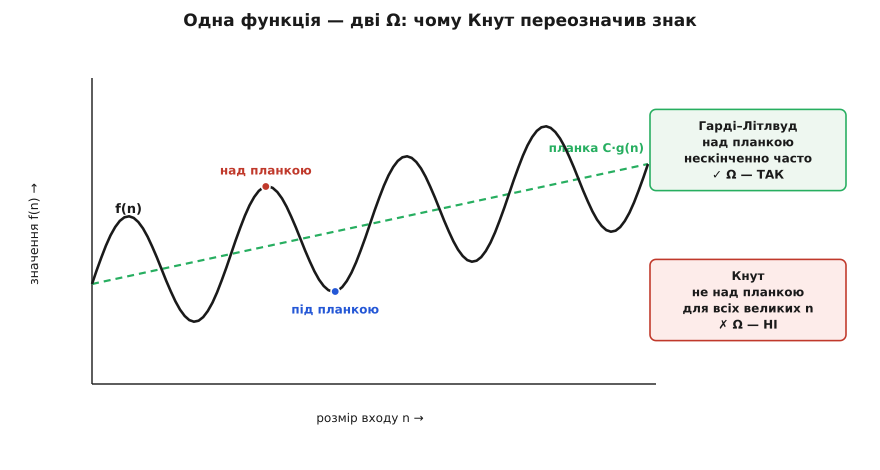

# 📜 Літера, що втекла з теорії чисел

Ти пишеш `O(n log n)`, щоб за мить сказати колезі, чи витримає сортування мільйон записів. Знак так зрісся з програмуванням, що здається його власним винаходом — народженим десь коло перших компіляторів, разом зі словом «алгоритм» у сучасному сенсі. Насправді ця літера прийшла в інформатику з поля, де про обчислювальні машини ніхто й не думав: із теорії чисел, де нею ловили розмір похибки в [підрахунку простих чисел](topic:math-number-theory/prime-numbers). А коли вона нарешті дісталася алгоритмів, то прийшла настільки зіпсованою недбалим ужитком, що одному з батьків молодої галузі довелося сісти й написати редакторові журналу листа — аби навести лад. Ось ця дорога: від похибки в лічбі простих до присуду твоєму коду.

## Порядок зростання ще до всякого знаку

Ідея старша за символ. Задовго до будь-якої літери математики вже мали потребу порівнювати не самі функції, а **швидкість, із якою вони ростуть**, — і то не зважаючи на сталі множники. Питання «яка з двох функцій урешті переганяє іншу» виникає скрізь, де є границі, ряди й наближення, і воно живе окремо від питання «а на скільки саме».

Пауль дю Буа-Реймон (Paul du Bois-Reymond, 1831–1889), німецький аналітик, на початку 1870-х вибудував під це цілий апарат — «числення нескінченного» (нім. *Infinitärcalcül*), спосіб ранжувати функції за темпом зростання. Він писав відношення на кшталт `g ≺ f` — «g росте повільніше за f», — і це вже було по суті те, чим ми користуємося щодня, тільки записане знаком порівняння, а не вкладеним усередину формули символом. Коли через сто років Дональд Кнут копав історію нотації по бібліотеках, він із подивом виявив, що цей підхід «випереджає саму O-нотацію»: найраніша згадка, на яку він натрапив, — стаття дю Буа-Реймона 1871 року, а систематична його праця над «порядками нескінченного» тяглася від 1870-го й далі.

Тут варто спинитися, бо саме це — суть усієї подальшої історії. Важким був не вибір знаку. Важким було саме усвідомлення, що «темп зростання з точністю до сталого множника» — це самостійна річ, варта власної алгебри. Щойно математики це відчули, знак став лише питанням зручності — і по нього прийшов Бахман.

## Бахман дає порядкові літеру (1894)

Пауль Бахман (Paul Bachmann, 1837, Берлін — 1920, Веймар) — німецький математик, у Ґеттінгені слухав Діріхле, Рімана й Дедекінда, а докторат здобув у Берліні під орудою Куммера. Усе життя він писав велику оглядову працю — п'ятитомну «Zahlentheorie» («Теорію чисел», 1892–1923), що впорядковувала й оцінювала методи цілої галузі. Її другий том вийшов 1894 року окремою книгою — *Die analytische Zahlentheorie* («Аналітична теорія чисел»). Саме там, на сторінці 401, уперше з'являється знак O.

Навіщо він знадобився саме тут? Аналітична теорія чисел уся зіткана з наближень. Скільки простих чисел не перевищує x? Точної елементарної формули немає, зате є добре наближення з **похибкою**, яка сама поводиться складно:

```
π(x) ≈ x / ln x     — скільки простих не більших за x,
                       з похибкою, точну форму якої ніхто не хоче виписувати
```

Бахманів хід: увести символ, який можна вкинути прямо в рівність замість цієї похибки й означати ним «доданок, порядок якого не перевищує такого-то». Літера O — від нім. *Ordnung*, «порядок» (порядок величини). Написавши `= (головний член) + O(√x)`, ти чесно кажеш: залишок росте не швидше за √x, а якої він там точно форми — байдуже, і виписувати її не треба.

Чому це виявилося не просто зручним, а геніальним? Бо з O можна **рахувати всередині формули**, не перериваючи викладку. Замість «а тепер окремо оцінимо залишок» ти лишаєш O(√x) на місці й тягнеш рівність далі, як звичайний доданок. Ти платиш за це дрібною логічною дивиною — рівність стає односторонньою (`x + O(1) = O(x)` правда, а навпаки — ні; знак «=» тут насправді означає «належить до»), — але виграєш незрівнянно більше: цілі сторінки оцінок пишуться суцільним потоком. Саме ця вкладеність у формулу, а не сам вибір літери, і зробила нотацію непереможною.

## Ландау: рознощик символів і батько «малого o» (1909)

Знак Бахмана міг би лишитися дрібною зручністю в одній книзі, якби не людина, чиє ім'я родина цих символів носить досі. Едмунд Ландау (Edmund Landau, 1877, Берлін — 1938, Берлін) — німецький математик єврейського походження, з 1909 до 1934 року професор у Ґеттінгені, тодішній світовій столиці математики. Його двотомний *Handbuch der Lehre von der Verteilung der Primzahlen* («Підручник про розподіл простих чисел», 1909) став першим систематичним викладом аналітичної теорії чисел — і в ньому Ландау вживав O так широко, послідовно й чітко, що всю сім'ю знаків відтоді звуть **символами Ландау** (нім. *Landau-Symbole*). Не він її придумав — але саме він її поширив.

І він додав до неї другий знак — **«мале o»**. За власним свідченням Ландау (його й розкопав Кнут: Ландау зауважив, що найперша відома йому поява O — саме в Бахмана 1894 року на с. 401, а «мале o» він винайшов сам, коли писав свій підручник про прості), різниця між двома літерами тонка, але глибока:

```
f = O(g)   ⟺   |f| ≤ C·g   для всіх великих n     — «росте не швидше за g» (стеля)
f = o(g)   ⟺   f / g → 0                          — «зникає проти g» (нескінченно нижче)
```

Аналогія проста й точна там, де точна. Велике O — це стеля, якої функція може торкатися: `n = O(n)` — правда, крива йде впритул до стелі. Мале o — це стеля, від якої функція нескінченно **тікає**: `n = o(n²)`, бо відношення `n/n² = 1/n` збігає до нуля. O каже «не вище»; o каже «безнадійно нижче». Ламається ж аналогія на тому, що O нічого не обіцяє знизу: `n = O(n²)` теж правда, хоч n тут аж ніяк не «майже n²» — і саме на цій пастці за півстоліття спіткнеться ціла молода наука.

Історію ґеттінгенської школи не розказати чесно без гіркої примітки. 2 листопада 1933 року, коли до влади вже прийшли нацисти, лекції Ландау бойкотували: студентський зрив очолив Освальд Тайхмюллер (Oswald Teichmüller) — блискуче обдарований математик і переконаний нацист, — заявивши професорові, що «арійські студенти хочуть арійської математики». В аудиторії, за свідченням очевидців, зібралася юрба в есесівській формі, а всередину не пустили жодного слухача. Ландау, єврей, невдовзі покинув Ґеттінген, викладав ще в Кембриджі й Брюсселі й помер 1938 року. Школа, де нотація визріла й звідки розійшлася світом, була розгромлена за кілька років.

## Ω приходить з іншого боку — і значить інше (Гарді й Літлвуд, 1914)

Поки в Німеччині усталювалися O та o, в Англії народжувалася третя літера — і, що найцікавіше, з іншим змістом, ніж той, який згодом візьме інформатика. Ґодфрі Гарольд Гарді (G. H. Hardy, 1877–1947) і Джон Іденсор Літлвуд (J. E. Littlewood, 1885–1977), знаменитий дует аналітичної теорії чисел, потребували знаку, протилежного до малого o: способу сказати не «функція зникає», а «функція **не** лишається малою — вона знову й знову підскакує високо».

У праці 1914 року «Some problems of Diophantine approximation» (Acta Mathematica, том 37, с. 225) вони ввели для цього знак Ω, назвавши його «новим». Але — і це вирішальна деталь усієї історії — їхня Ω значила не те, що пишуть у підручниках алгоритмів. Вони означили її як заперечення малого o:

```
Гарді й Літлвуд, 1914:   |f(n)| > C·g(n)   для НЕСКІНЧЕННО БАГАТЬОХ n
                          (за досить малої сталої C > 0) — заперечення o
```

Для теорії чисел це рівно те, що треба. Щоб довести, що похибка в наближенні π(x) не гасне з ростом x, зовсім не треба, щоб вона трималася великою **весь час** — досить, щоб вона нескінченно часто вистрілювала над будь-яку задану планку, навіть якщо між сплесками провалюється низько. «Нескінченно часто» — природна мова для похибок, що осцилюють.

І ще одне про цю Ω: вона була рідкісна. Кнут згодом переказав власну марну пригоду — він якось порадив колезі писати Ω, «бо теоретики чисел користуються ним роками», а коли його попросили показати посилання, згаяв у бібліотеці цілу безплідну годину, не знайшовши жодного. Понад половина видатних математиків, яких він розпитав, ніколи не бачили запису Ω(n²). Джордж Пойа (George Pólya), що, за власними словами, вчився в Ландау, знав значення Ω — але сам ним ніколи не користувався. «Який учитель, такий і учень», — додав він. Отже, до середини 1970-х Ω існувала, значила ледь інше, ніж хотілося б програмістам, і майже забулася. У цей стан і втрутився Кнут.

## Кнут наводить лад — і навмисно переписує Ω (1976)


*Століття мандрів однієї нотації. Ідея порядку зростання (дю Буа-Реймон) старша за перший символ (Бахманова O) на два десятиліття; Ландау поширив родину знаків і додав «мале o»; Ω прийшла збоку — з англійської теорії чисел — і з іншим змістом; і лише 1976 року, вже в інформатиці, Кнут звів O, Ω та Θ у струнку трійку. Синє тло — теорія чисел, зелене — інформатика: знак перетнув межу полів аж наприкінці.*

До 1970-х «аналіз алгоритмів» уже став окремою наукою — і вживав O неохайно, натягуючи його на те, чого воно не описує. Що саме допекло Кнутові, він каже прямо в першому ж абзаці свого листа: люди відкидали «певний метод сортування, **бо його час — O(n²)**». Абсурд у тім, що O(n²) — це лише **стеля**, і сама по собі вона нічого поганого не гарантує: метод, що є O(n²), цілком може виявитися насправді швидким. Ба більше — кожен метод, що є O(n log n), заразом і O(n²), бо росте не швидше й за квадрат. Відкидати алгоритм «за те, що він O(n²)» — все одно що бракувати людину «за те, що вона не вища за два метри». Той, хто так казав, мав на думці зовсім інше: що методові потрібно **щонайменше** порядку n² — а це вже нижня межа, Ω, або точна, Θ.

> 🔧 **Навіщо це.** Плутанина зі знаком — не педантизм, вона коштує рішень. «Час O(n²)» і «час Θ(n²)» звучать майже однаково, а кажуть протилежне про ризик. O(n²) — обіцянка згори: «не гірше за квадрат, можливо, значно краще» — привід придивитися. Θ(n²) — вирок із двох боків: «саме квадрат, швидше не буде» — привід шукати іншу ідею. Відкинути алгоритм за верхньою межею, прийнявши її за точну, — значить викинути, можливо, найшвидше рішення через неправильно прочитаний знак. Саме щоб цього не ставалося, і потрібні три різні літери замість однієї на всі випадки.

Тож 1976 року Дональд Кнут (Donald Knuth) надіслав до бюлетеня SIGACT News лист до редактора під грайливою назвою «Big Omicron and Big Omega and Big Theta» (том 8, № 2, с. 18–24) і зробив три речі, що досі тримають усю нотацію складності.

По-перше, він узяв Ω для нижньої межі — але навмисно **переозначив** його строгіше за Гарді й Літлвуда: не «нескінченно часто», а «для всіх великих n».

```
Гарді й Літлвуд:   |f(n)| > C·g(n)   для нескінченно багатьох n   (сплески)
Кнут:               f(n) ≥ C·g(n)     для ВСІХ великих n           (тримається знизу)
```

Різницю добре видно на осцилюючій функції, що періодично торкається планки, а між доторками провалюється під неї.



*Одна функція — два присуди про той самий знак Ω. Крива раз по раз вистрілює над планку `C·g(n)`, але між сплесками падає нижче. Для Гарді й Літлвуда цього досить: планку перевищено нескінченно часто, отже, Ω — так. Для Кнута — ні: його Ω вимагає, щоб функція трималася над планкою для всіх великих n, а тут вона щоразу провалюється. Той самий символ, дві несумісні відповіді — ось чому Кнутові довелося переозначувати, а не просто позичати.*

Він виправдав це переписування прямо: означення Гарді й Літлвуда «аж ніяк не в широкому вжитку», а для інформатики строгіша вимога — «тримається знизу завжди» — куди доречніша, бо ми хочемо гарантій на весь великий вхід, а не лише на його нескінченну підпослідовність.

По-друге, він увів **Θ** — точну межу, «порядок рівно g», коли функція затиснута між `C·g` і `C′·g` з обох боків. Цей знак підказали йому незалежно Роберт Тарджан (Bob Tarjan) і Майк Патерсон (Mike Paterson). Саме Θ — те, що більшість людей насправді має на думці, кажучи «складність цього алгоритму — n²».

По-третє, він закріпив **множинне** тлумачення, яке колись запропонував Рон Рівест (Ron Rivest): `O(g)` — це не одна функція, а **множина** всіх функцій, обмежених згори через g. Тоді запис `T(n) = O(n²)` чесно читається як «T належить до цієї множини», і одностороння рівність перестає бентежити — «=» тут із самого початку означало «∈».

Лишається жарт із назви — той самий «омікрон». Кнут читає O не як латинську літеру й не як цифру нуль, а як грецький великий омікрон (Ο) — тоді трійця виходить суцільно грецька: омікрон, омега, тета. Це, звісно, ретроспективна вигадка: у Бахмана O була латинська, від *Ordnung*, і ні Бахман, ні Ландау омікроном її не звали. Але Кнутів мнемонічний жарт прижився разом із самою трійцею знаків.

До честі Кнута, він у тому ж листі вклонився й **змагальному** підходу — відносним знакам у дусі дю Буа-Реймона: Гардіїв `≺` із тракту «Orders of Infinity» (1910), Виноградове `≪` (Іван Виноградов / Ivan Vinogradov). Вони теж мають ясні, прозорі властивості й обходяться без односторонньої рівності. Але, доводив Кнут, O виграє однією рисою: його можна вкинути в середину формули, речення чи таблиці з часами цілої родини алгоритмів, тоді як відносний знак щоразу вимагає перенести все, крім оцінюваної функції, на один бік рівняння. Зручність вкладення — те саме, за що знак полюбив ще Бахман, — вирішила й тут.

## Ідея, знак, поширення, стандарт — хто що зробив

Історія нотації плутається саме тому, що «хто придумав O велике» — питання без єдиної відповіді: різні люди зробили різні речі, і зливати їх в одну заслугу нечесно. Розплетімо нитки начисто, з позначкою доказовості на кожній.

- **Ідея** порядку зростання з точністю до сталих — Пауль дю Буа-Реймон, початок 1870-х, ще без вкладеного символу. *Статус: усталено; Кнутова бібліотечна розвідка датує це раніше за сам знак O.*
- **Знак O** — Пауль Бахман, 1894, *Die analytische Zahlentheorie*, том 2, с. 401. Найраніша задокументована поява O — за атрибуцією самого Ландау («перша відома мені»). *Статус: добре засвідчено, з визнаним відносним попередником у дю Буа-Реймона; «абсолютно перший» твердити обережно — це «найраніший відомий».*
- **Знак o + поширення** — Едмунд Ландау, 1909, *Handbuch*. «Мале o» — за власним свідченням Ландау; широкий ужиток, від якого родину й прозвали символами Ландау. *Статус: самосвідчення автора + загальновизнана роль популяризатора.*
- **Інша Ω з іншого поля** — Ґодфрі Гарольд Гарді й Джон Ідензор Літлвуд, 1914, зі змістом «нескінченно часто», відмінним від інформатичного. *Статус: усталено; Кнут локалізував першу появу на с. 225.*
- **Стандарт для інформатики** — Дональд Кнут, 1976: переозначив Ω (строгіше), увів Θ, закріпив множинне тлумачення O. *Статус: усталено; першоджерело — сам лист до SIGACT News.*

І остання іронія, задля якої цю історію й варто знати. Інструмент, яким ти сьогодні питаєш «чи переживе цей код той день, коли даних стане в тисячу разів більше», викували не для коду взагалі — а щоб зважити похибку в лічбі простих чисел. Він перейшов з чистої теорії чисел в обчислення не тому, що хтось задумав його для алгоритмів, а тому, що питання «наскільки це велике, з точністю до сталих, коли все росте» — буквально те саме питання в обох світах. Бахман дав цьому питанню літеру, Ландау — розмах і другий знак, Гарді з Літлвудом принесли третій збоку, а Кнут через вісімдесят років звів усе в дисципліну, придатну судити алгоритми. Наступного разу, ставлячи `O` перед функцією, згадай: ти пишеш знак, що століття тому позначав те, чого ніхто не хотів виписувати, — і саме тому вцілів.
