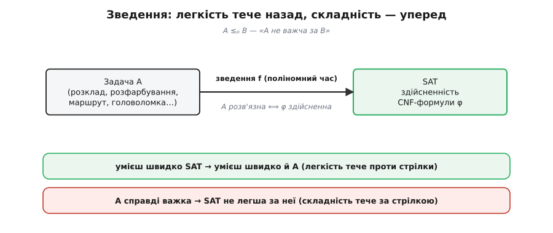
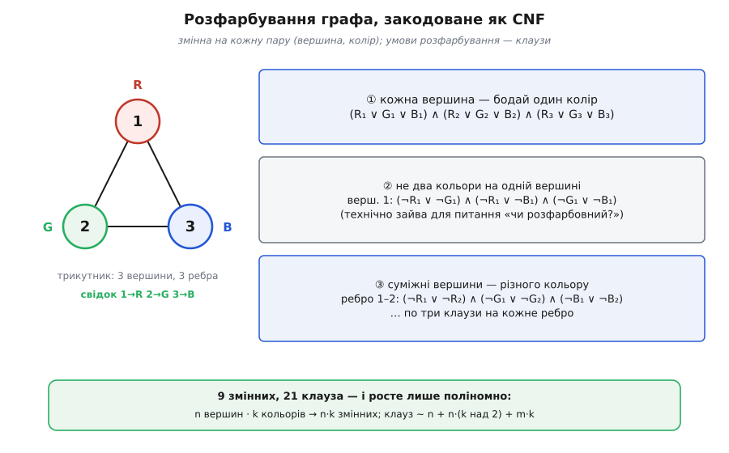
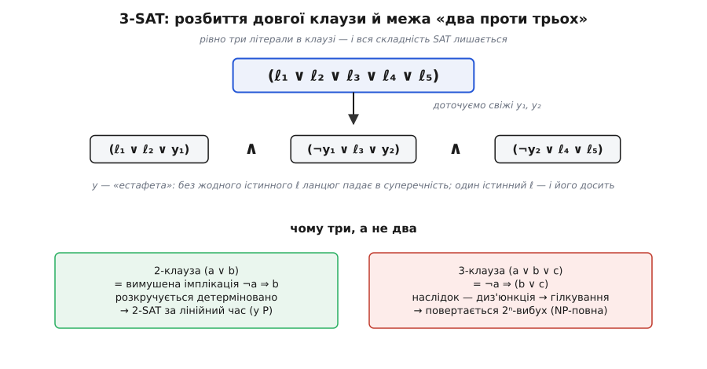

# 🧮 Зведення: як чужу задачу переписати мовою SAT

Про SAT кажуть: універсальний ключ, до якого зводиться будь-що з класу NP. За цим гаслом стоїть цілком механічна дія — **зведення** (лат. *reductio* — «повернення, приведення назад»). Якщо SAT — майстер-ключ, то зведення — це коли ви переточуєте власний замок під нього. Тут ми відкриємо саме цей механізм: що буквально означає «**закодувати** задачу як SAT», чому одного розв'язувача вистачає на всіх, як крок за кроком перекласти розфарбування графа в CNF-формулу, чому скромне обмеження «три літерали в клаузі» зберігає всю складність — і як із цього виходить робочий спосіб розв'язати **свою** задачу.

## Що таке «звести» — точне означення

Ідея зведення до смішного проста, і саме тому потужна. Замість того щоб вигадувати алгоритм під задачу **A**, ми перекладаємо **кожен** її приклад у приклад іншої задачі **B** так, щоб відповідь «так/ні» збереглася. Тоді розв'язати B — це вже розв'язати A: переклав умову, покрутив готовий розв'язувач B, прочитав відповідь назад.

Формалізуймо. **Зведення** задачі A до задачі B — це функція **f**, яка:

```
1) кожен вхід x задачі A перетворює на вхід f(x) задачі B;
2) обчислюється за поліномний час;
3) зберігає відповідь:   x — «так» для A   ⟺   f(x) — «так» для B.
```

Таке зведення записують `A ≤ₚ B` і читають «A зводиться до B» або, змістовніше, «A **не важча** за B». Індекс *p* — від *polynomial*: наголос, що сам переклад дешевий. Ця форма зветься зведенням *many-one* (одне перетворення входу — одна відповідь), або **зведенням Карпа**.

Уся вага — у двох дрібних на вигляд словах. Перше — стрілка `⟺` в пункті 3: рівносильність в **обидва боки**. Якби зберігалося лише «так → так», переклад міг би вигадувати неіснуючі розв'язки; якби лише «ні → ні» — губити справжні. Потрібно рівно те, щоб f **не брехала** в жоден бік: жодного хибного «так», жодного пропущеного «так».

Друге слово — **поліномний**. Це не формальна причіпка, а серце означення.

> 🔧 **Навіщо це.** Уявіть, що переклад f сам працює експоненційний час або видає формулу експоненційного розміру. Тоді ми нічого не «звели»: роздування перекладу з'їло б будь-яку швидкість розв'язувача B. Поліномність — це обіцянка, що переклад **знехтувано дешевий** поряд із самим розв'язанням, тож уся складність чесно лягає на B, а не ховається в дорозі до нього. Різницю [полінома проти експоненти](topic:computability/asymptotic-complexity) тут не можна замести під килим — на ній усе тримається.

## Куди тече легкість, а куди — складність

Що ж дає нам `A ≤ₚ B`? Дві речі, дзеркальні одна одній.

Перша — приємна. Якщо `A ≤ₚ B` **і** ви вмієте швидко (за поліномний час) розв'язувати B, то ви автоматично вмієте швидко розв'язувати A: переклали (дешево) — розв'язали (дешево) — прочитали відповідь. **Легкість тече проти стрілки**: розв'язали важчу — задарма маємо легшу.

Друга — гостра, і саме на ній тримається вся теорія. Візьмімо те саме твердження за протилежний кінець (контрапозиція): якщо A **справді важка**, то й B **не легша за неї**. **Складність тече за стрілкою** — зводячи A до B, ми перекладаємо на B весь тягар A.

Тепер доведімо цю думку до краю — і отримаємо суть NP-повноти. Теорема Кука–Левіна (Стівен Кук і Леонід Левін, 1971) стверджує: **будь-яка** задача з класу NP зводиться до SAT, тобто `X ≤ₚ SAT` для кожної X ∈ NP. Отже, SAT стоїть на самій вершині — у NP немає нічого важчого за нього. Ось що насправді розгортається зі слів «**SAT NP-повний**»: не «SAT — одна з важких задач», а «SAT — **найважча** в NP, універсальна ціль, до якої стягується весь клас». Що таке цей клас і що означає «повна» — окрема [тема про P, NP та NP-повноту](topic:computability/np-completeness).


*Зведення f перекладає кожен вхід задачі A у формулу φ за поліномний час так, що A розв'язна ⟺ φ здійсненна. Наслідок двобічний: швидкий розв'язувач SAT задарма розв'язав би й A (легкість переноситься назад), а доведена важкість A робить і SAT не легшою (складність переноситься вперед). Саме тому один універсальний розв'язувач вартий цілого класу задач.*

Далі ту корону, яку Кук дав SAT, роздав по всьому класу **Річард Карп** (*Richard Karp*, американський математик): 1972 року в праці «Reducibility Among Combinatorial Problems» він виписав поліномні зведення `SAT ≤ₚ X` для **21 класичної задачі** — кліка, [покриття множини](topic:sf-algorithms/set-cover), гамільтонів цикл, комівояжер, [розфарбування графа](topic:math-combinatorics/graph-coloring) й інші. Механіка проста, як тільки-но описана: щойно `SAT ≤ₚ X` і сама X належить NP, то X теж NP-повна — бо `≤ₚ` **транзитивне** (звів усе NP до SAT, а SAT до X — отже, все NP до X). Так зведеннями й розмітили всю родину NP-повних задач: ланцюг перекладів із коренем у SAT. Це усталений факт, підвалина теорії складності.

## Наскрізний приклад: розфарбування графа → CNF

Перейдімо від слів до діла й перекладемо конкретну задачу власноруч. Візьмімо ту саму, з якої починалася розмова про SAT: скласти розклад іспитів. Її серце — **розфарбування графа**: вершини — це іспити, ребро між двома — спільний студент (їх не можна ставити одночасно), кольори — часові слоти. «Чи можна розкласти в k слотів?» = «чи можна розфарбувати граф у k кольорів так, щоб суміжні вершини різнилися?». Закодуймо найчистіше формулювання: даний граф, дано 3 кольори — **чи існує правильне розфарбування?**

**Крок 1 — змінні.** Найважливіший хід усього зведення. Заведімо по одній булевій змінній на кожну пару (вершина, колір):

```
Rᵥ  істинна  ⟺  вершину v пофарбовано в червоне (R)
Gᵥ  істинна  ⟺  вершину v пофарбовано в зелене  (G)
Bᵥ  істинна  ⟺  вершину v пофарбовано в синє    (B)
```

Для маленького графа-трикутника — три вершини 1, 2, 3, попарно з'єднані — це `3 × 3 = 9` змінних: R₁ G₁ B₁, R₂ G₂ B₂, R₃ G₃ B₃. Уся суть тут: **набір значень змінних — це і є розфарбування**. Здійсненний набір буквально скаже, який колір кожній вершині. Лишилося клаузами відсіяти «несправжні» набори — ті, що розфарбуванням не є.

**Крок 2 — умови як клаузи.** Що робить набір змінних *правильним* розфарбуванням? Рівно три вимоги, і кожна перекладається у клаузи майже дослівно.

*Вимога 1 — кожна вершина має бодай один колір.* Це чисте «хоч одне з трьох», тобто одна клауза на вершину:

```
(R₁ ∨ G₁ ∨ B₁) ∧ (R₂ ∨ G₂ ∨ B₂) ∧ (R₃ ∨ G₃ ∨ B₃)
```

*Вимога 2 — не більше одного кольору на вершину.* «Не червоне-й-зелене водночас» — це `¬(Rᵥ ∧ Gᵥ)`, тобто клауза `(¬Rᵥ ∨ ¬Gᵥ)`. По три пари кольорів на кожну вершину:

```
вершина 1:  (¬R₁ ∨ ¬G₁) ∧ (¬R₁ ∨ ¬B₁) ∧ (¬G₁ ∨ ¬B₁)
                          … те саме для вершин 2 і 3
```

*Вимога 3 — суміжні вершини різного кольору.* По ребру: не обидві червоні, не обидві зелені, не обидві сині. Для ребра 1–2:

```
(¬R₁ ∨ ¬R₂) ∧ (¬G₁ ∨ ¬G₂) ∧ (¬B₁ ∨ ¬B₂)
```

і так само для ребер 2–3 та 1–3.

**Крок 3 — розмір.** Порахуймо, у що обійшовся переклад: `3` клаузи вимоги 1, `3×3 = 9` вимоги 2, `3 ребра × 3 = 9` вимоги 3 — разом 21 клауза й 9 змінних. Для довільного графа: n вершин, k кольорів, m ребер дають `n·k` змінних, `n` клауз-«бодай один» (по k літералів), `n·(k над 2)` клауз-«не два» і `m·k` клауз-«суміжні різні». Усе це **поліном** від n, m, k — жодного натяку на 2ⁿ. Ось воно, означення в дії: переклад дешевий.


*Трикутник (три вершини, три ребра) переходить у 9 булевих змінних Rᵥ/Gᵥ/Bᵥ і три сім'ї клауз: «кожна вершина — бодай один колір», «не два кольори на вершині», «суміжні — різні». Здійсненний набір R₁=G₂=B₃=1 (решта 0) читається просто як розфарбування 1→червоне, 2→зелене, 3→синє — і воно правильне: кожне ребро сполучає різні кольори.*

**Крок 4 — розв'язати й прочитати назад.** Віддамо всі ці клаузи розв'язувачу. Він знайде, скажімо, набір R₁ = G₂ = B₃ = 1, решта 0. Перевірмо руками, що це справді свідок:

```
вимога 1:  (R₁∨G₁∨B₁) = (1∨0∨0) = 1 ✓   … і так кожна вершина
вимога 2:  (¬R₁∨¬G₁)  = (0∨1)    = 1 ✓   … по одному кольору на вершину
вимога 3:  ребро 1–2:  (¬R₁∨¬R₂) = (0∨1) = 1 ✓
                       (¬G₁∨¬G₂) = (1∨0) = 1 ✓
                       (¬B₁∨¬B₂) = (1∨1) = 1 ✓
```

Формула здійсненна. Тепер найголовніше для практики: набір **розкодовується назад** у відповідь вихідної задачі. R₁=1 → вершина 1 червона, G₂=1 → вершина 2 зелена, B₃=1 → вершина 3 синя. Це не просто «так, розфарбовний» — це саме́ розфарбування, готове до вжитку. Зведення дало не ярлик, а розв'язок.

**Крок 5 — і бік «ні».** А якби граф розфарбувати трьома кольорами було **неможливо**? Долучімо четверту вершину, з'єднану з усіма трьома (повний граф K₄): тепер три вершини трикутника вже забрали всі три кольори, а четверта суміжна з кожною — їй кольору не лишилося (χ(K₄)=4). Формула для такого графа стане **нездійсненною**: скільки не крути 12 змінних, якась клауза-«суміжні різні» завжди провалиться. Розв'язувач відповість «свідка немає» — і це рівно відповідь «граф не розфарбовний трьома кольорами». Обидва боки `⟺` працюють: «так» дає розфарбування, «ні» доводить його неможливість.

Тут ховається гарна тонкість. Придивіться: вимога 2 («не два кольори») насправді **не потрібна** для питання «чи розфарбовний?». Викиньмо її — і формула лишиться рівносильною. Чому? Якщо набір задовольняє лише вимоги 1 і 3, вершина може дістати навіть два кольори одразу — але тоді просто **виберемо** їй один із них. Чи не зіпсує це ребра? Ні: вимога 3 забороняє суміжним ділити **будь-який** колір, тож у сусідів спільних кольорів немає взагалі, і хоч якого одного виберемо кожному — сусіди все одно різні. Отже, для самого лише рішення «так/ні» досить двох сімей клауз; третю додають, коли хочуть, щоб **кожен** свідок був рівно одним розфарбуванням (наприклад, щоб їх рахувати). Добре зведення — це ще й розуміння, які клаузи справді несуть вагу.

## Чому переклад не роздувається — і чому це не дрібниця

Ми весь час пильнували, щоб клауз було мало. Може здатися — дрібна охайність. Насправді це умова життя чи смерті зведення, і варто побачити, як легко її порушити.

Спробуйте взяти довільну логічну умову й **силою** загнати її в CNF розкриттям дужок за дистрибутивністю. Ось невинний вираз:

```
(a₁ ∧ b₁) ∨ (a₂ ∧ b₂) ∨ … ∨ (aₙ ∧ bₙ)
```

Розкрийте його в кон'юнкцію клауз — і кожна клауза мусить узяти по одному літералу з кожної дужки, а таких виборів `2ⁿ`. Формула на 2n змінних роздулася в **експоненційно** довгу CNF. Зведення, яке так робить, нічого не варте: поліномна обіцянка розбита.

Рятує **перетворення Цейтіна** (радянський логік Григорій Цейтін, Ленінградський університет, 1968). Замість розкривати дужки, воно **дає ім'я** кожному підвиразу: заводить свіжу змінну `y`, оголошує «y ⟺ (цей підвираз)» кількома дрібними клаузами — і далі вживає `y` замість цілого шматка. Формула-результат уже **не тотожна** початковій (у ній нові змінні), але **рівноздійсненна** їй — здійсненна тоді й лише тоді, коли й початкова, — а розміром лише **лінійно** більша. Слово `рівноздійсненні` (*equisatisfiable*) варто закарбувати: у зведеннях ідеться не про тотожність формул, а саме про збіг відповіді «так/ні». Це та монета, якою платять усі зведення. Саме тому наше розфарбування ми кодували клаузами напряму й ощадливо: гарне зведення **інженерять** так, щоб воно лишалося малим.

## 3-SAT: чому вистачає трьох літералів

Гляньте на клаузи розфарбування — усі мають щонайбільше три літерали (бо кольорів три). Це не завжди так: закодуйте 5 кольорів — і клауза-«бодай один» набуде п'яти літералів; інші зведення плодять клаузи будь-якої довжини. Постає питання: а що, як **заборонити** довгі клаузи — дозволити рівно (щонайбільше) три літерали? Цей урізаний різновид звуть **3-SAT**. І ось несподіванка: 3-SAT **так само NP-повний**, не легший за повний SAT. Уся складність уміщається в клаузах із трьох літералів.

Доводить це — знову зведення, тепер `SAT ≤ₚ 3-SAT`: **розбиття клауз**. Довгу клаузу ріжуть на ланцюжок трилітеральних, доточуючи свіжі «естафетні» змінні. Візьмімо клаузу з п'яти літералів:

```
(ℓ₁ ∨ ℓ₂ ∨ ℓ₃ ∨ ℓ₄ ∨ ℓ₅)

     ↓  доточуємо свіжі y₁, y₂

(ℓ₁ ∨ ℓ₂ ∨ y₁) ∧ (¬y₁ ∨ ℓ₃ ∨ y₂) ∧ (¬y₂ ∨ ℓ₄ ∨ ℓ₅)
```

Чому це рівноздійсненно? Естафетні `y` — то ланцюжок кісточок доміно. Уявімо, що **жоден** із `ℓ` не істинний. Тоді перша клауза жадає `y₁=1`; друга, `(¬y₁ ∨ ℓ₃ ∨ y₂)`, при `y₁=1` і `ℓ₃=0` жадає `y₂=1`; третя, `(¬y₂ ∨ ℓ₄ ∨ ℓ₅)`, при `y₂=1` і хибних `ℓ₄,ℓ₅` — провалюється. Доміно падає до кінця й розбивається: без жодного істинного `ℓ` ланцюг **нездійсненний**, точно як порожня вихідна клауза. А досить **одному** `ℓᵢ` бути істинним — і він «підпирає» свою клаузу сам, а решту `y` вільно виставляємо так, щоб кожна інша клауза мала або істинний `¬y`, або істинний `y`. Ланцюг стає здійсненним рівно тоді, коли істинний бодай один `ℓ` — тобто точно тоді, коли здійсненна вихідна клауза. Довга клауза з k літералів так розпадається на `k−2` трилітеральні з `k−3` новими змінними — приріст лінійний, зведення поліномне. Отже, 3-SAT успадковує **всю** складність SAT.

Але чому саме **три**, а не два? Тут — найгостріша межа всієї теорії, і вона того варта.

**2-SAT — легкий, він у P.** Придивіться до клаузи з двох літералів `(a ∨ b)`: вона тотожна парі імплікацій `(¬a ⇒ b)` та `(¬b ⇒ a)`. Тобто кожна двійкова клауза — це **вимушений хід**: тільки-но ви зробили `a` хибним, `b` **зобов'язане** стати істинним, і навпаки. Жодного вибору. Побудуйте «граф імплікацій» (вузли — літерали, стрілки — оці змушування) — і вся формула здійсненна, доки, ідучи вимушеними стрілками, ви не приходите до того, що якесь `x` змушує `¬x`, а `¬x` змушує `x` (обидва в одній сильно зв'язній компоненті). Це — чиста перевірка досяжності, лінійний час (Аспвалл, Пласс і Тар'ян, 1979). Ніде не треба **вгадувати**.

**3-SAT — важкий.** Клауза `(a ∨ b ∨ c)` як імплікація — це `(¬a ⇒ (b ∨ c))`: наслідок сам є **диз'юнкцією**. Знаючи `¬a`, ви не змушуєте ні `b`, ні `c` — лише «одне з двох». А це вже **розвилка**, справжній вибір. Щойно ходи перестають бути вимушеними й починають гілкуватися — повертається те саме дерево пошуку з його 2ⁿ листками й експоненційним найгіршим випадком. Три — це рівно поріг, на якому «розкручуй вимушене» переходить у «мусиш угадати». Урізати до двох літералів — задача провалюється в P; дозволити три — вона вже несе повну важкість SAT.


*Угорі: клауза з п'яти літералів розпадається на ланцюжок трилітеральних, зшитий свіжими змінними y₁, y₂ — «естафета», що ловить суперечність, коли жоден вихідний літерал не істинний. Унизу — чому три, а не два: двійкова клауза = вимушена імплікація (розкручується детерміновано, 2-SAT за лінійний час), тривимірна = імплікація з диз'юнкцією в наслідку (гілкується — і тут повертається експоненційний вибух).*

## Двобічність: як розв'язати СВОЮ задачу через SAT

Зведення — це переклад в один бік, `A → φ`. Але щоб із нього була користь, потрібен **круговий обіг**, і обидві його половини ми вже бачили на розфарбуванні.

Уперед — **закодувати**: умови задачі стають клаузами. Назад — **розкодувати свідка**: здійсненний набір формули це не голе «так», а справжній розв'язок вихідної задачі (ми буквально прочитали розфарбування з R₁=G₂=B₃). Ось що перетворює зведення з теоретичної класифікації на **інструмент**.

Звідси робочий конвеєр, яким сьогодні живуть цілі галузі:

```
своя задача  →  модель у CNF  →  готовий промисловий SAT-розв'язувач  →  розкодувати набір
```

Ви **не пишете** власного експоненційного перебору під свою NP-задачу — ви кодуєте її формулою й успадковуєте десятиліття чужої праці над одним універсальним розв'язувачем. Моделювання в CNF (руками чи бібліотекою-моделлю) — це і є те саме зведення, зроблене прикладно.

Тут корисно розрізнити два ґатунки зведень, бо практика спирається на обидва. **Зведення Карпа** (*many-one*) — одне перетворення входу, один виклик розв'язувача, відповідь задачі = відповідь розв'язувача; це і є те поняття, яким означують «SAT NP-повний». **Зведення Кука** (за Тюрінгом) дозволяє більше: ваш алгоритм кличе SAT-розв'язувач **як підпрограму**, і то багато разів. Саме так рішеневий розв'язувач стає пошуковим: щоб знайти **найменше** число кольорів (хроматичне число), а не лише перевірити конкретне, питаєте «розфарбовний у k?» для k = 1, 2, 3, … (чи двійковим пошуком) — низка викликів SAT перетворює «так/ні» на повноцінну оптимізацію.

І остання, найпрактичніша осторога. Зведення доводить важкість **найгіршого** випадку — але, як не раз бувало, справжні формули структуровані, і промислові розв'язувачі беруть їх за секунди. Тому кодування — це **ремесло**: одну й ту саму задачу можна закодувати десятком різних CNF, і ощадливе, «прозоре» для розв'язувача кодування — це різниця між секундою й вічністю. Упізнати, що ваша задача зводиться до SAT, і закодувати її **вдало** — оце і є вміння, заради якого варто розуміти механіку зведень зсередини.
