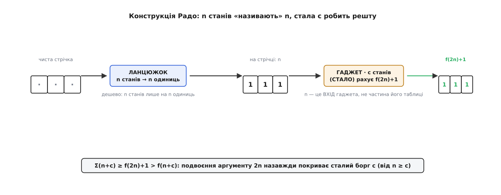
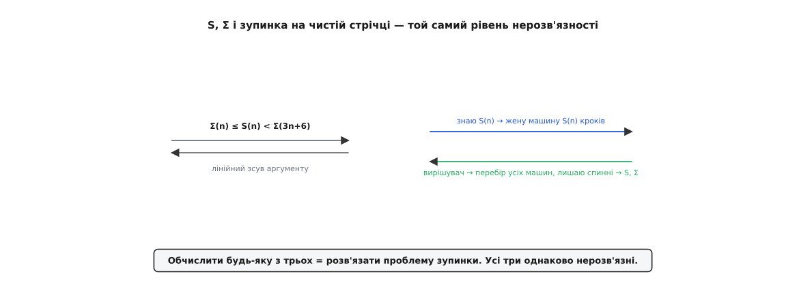
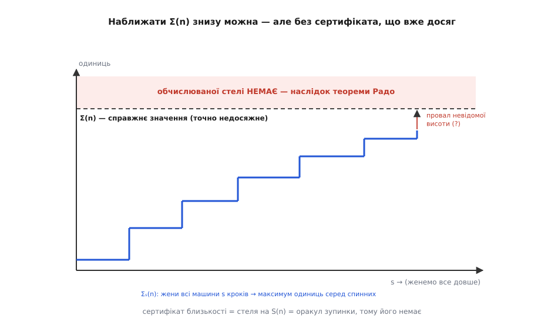

# 🧮 Чому бобра не спіймати: повне доведення необчислюваності

Твердження, що функція завзятого бобра переростає кожен алгоритм, а її обчислення розкололо б проблему зупинки, легко проголосити — і важко відчути як залізну необхідність, доки не збудуєш доведення власноруч. Зробімо це. Увесь ланцюг тримається на одному скромному факті: станів `n` скінченно, тож і машин з такою кількістю станів лише скінченно багато. З цього зерна виросте функція, якої не обчислить жодна машина, якої не притиснути навіть згори, і яка виявиться тим самим об'єктом, що й проблема зупинки. Кожну ланку збудуємо на очах.

## Домовленості і дві безкоштовні нерівності

Зафіксуймо мову. [Машина Тюринга](topic:computability/turing-machine) тут — це `n` робочих станів плюс окремий стан зупинки `H`, стрічка з двох символів (`0` — порожньо, `1`), старт із чистої стрічки, на кожному кроці обов'язковий зсув ліворуч або праворуч. Таблиця переходів для кожної пари (стан, символ) каже: що записати, куди зсунутися, у який стан перейти. Пар — `2n`, у кожній клітинці `2·2·(n+1)` виборів (символ · бік · наступний стан або `H`), тож усіх машин не більш як `(4n+4)²ⁿ` — число величезне, але **скінченне**. Це вся підстава, на якій стоятиме решта.

Дві мірки завзятості:

```math
Σ(n) = максимум одиниць на стрічці в мить зупинки
S(n) = максимум кроків до зупинки
```

— обидві по тих і лише тих `n`-станових машинах, що **зупиняються** на чистій стрічці. Максимум береться по скінченній непорожній множині, тож обидва — конкретні натуральні числа.

Перш ніж доводити велике, зберімо два факти, що даються майже задарма і триматимуть увесь каркас.

**Монотонність.** `Σ(n) ≤ Σ(n+1)` і `S(n) ≤ S(n+1)`. Чому: візьми будь-яку `n`-станову машину-рекордсменку й долий один стан, у який ніколи не потрапляєш. Поведінка не змінилась ані на крок, а машина тепер формально `(n+1)`-станова. Отже, усе, чого досягали `n` станів, досяжне й `(n+1)` станам — максимум упасти не може.

**Слід не довший за час: `Σ(n) ≤ S(n)`.** У мить зупинки на стрічці `Σ(n)` одиниць. Кожна з них колись була записана — а машина стартувала з чистої стрічки, тож жодна одиниця не «була там від початку». За один крок пишеться рівно один символ в одну клітинку. Отже, одиниць у фіналі не більше, ніж кроків, які взагалі щось писали, а тих — не більше за всі кроки. Звідси `Σ(n) ≤ S(n)` для кожного `n`. Проста нерівність, а знадобиться двічі.

## Теорема Радо: Σ переростає все обчислюване

Ось серце. Радо довів не «Σ велика», а незрівнянно сильніше твердження про її швидкість.

**Теорема (Радо, 1962).** Для кожної [обчислюваної](topic:computability/church-turing-thesis) функції `f: ℕ → ℕ` знайдеться поріг `N`, від якого `Σ(n) > f(n)` для всіх `n ≥ N`. Коротко: Σ від певного місця обганяє будь-яку обчислювану `f` — і далі розрив лише шириться.

Доведення конструктивне: ми **побудуємо** машину, що переростає задану `f`. Усе тримається на одному спостереженні — число станів це бюджет, і його можна витратити двояко.

Спершу спростимо ціль. Досить довести теорему для **неспадних** `f`: будь-яку обчислювану `f` мажорує обчислювана неспадна `f̂(n) = max(f(0), …, f(n))`, і хто переросте `f̂`, той переросте й `f`. Тож далі `f` неспадна.

Тепер конструкція, у два блоки.

**Блок-лічильник: `n` станів, що виписують `n`.** Ланцюжок із `n` станів, кожен пише одиницю і крокує праворуч:

```math
q₁  0 → (1, R, q₂)
q₂  0 → (1, R, q₃)
 ⋮
qₙ  0 → (1, R, g₁)      # g₁ — перший стан гаджета
```

Стартувавши з чистої стрічки, він лишає `n` одиниць поспіль і передає керування далі. Читання `1` у цих станах ніколи не трапляється (ділянка була порожня), тож ті клітинки таблиці байдужі. Витрачено рівно `n` станів — і на стрічці лежить число `n`, записане в одиницях.

**Блок-гаджет: стала кількість станів, що робить решту.** Тепер під голівкою — унарний запис `n`. Приробимо гаджет `G`, який прочитає це `n`, обчислить `h(n) = f(2n) + 1` і випише `h(n)` одиниць, після чого спиниться. Бо `f` обчислювана, то й `h` обчислювана, а отже, існує **одна фіксована** машина, що її рахує; переклад на дві букви й станову форму дає якесь стале число станів `c`. І ось де прихована пружина: `n` — це **вхід** гаджета, який приходить на стрічці, а не частина його таблиці. Тому `c` залежить від `f`, але **не від `n`**. Назвати `n` коштує `n` станів; зробити над цим іменем скільки завгодно складне обчислення — лише сталу `c`.

Склеївши блоки, маємо `(n + c)`-станову машину, що з чистої стрічки спиняється, лишивши щонайменше `h(n)` одиниць. Отже:

```math
Σ(n + c) ≥ h(n) = f(2n) + 1
```

Лишилось прибрати зсув на сталу `c`. Покладімо `m = n + c`. Для `n ≥ c` маємо `2n ≥ n + c = m`, а `f` неспадна, тож `f(2n) ≥ f(m)`. Складаємо:

```math
Σ(m) = Σ(n+c) ≥ f(2n) + 1 ≥ f(m) + 1 > f(m),   щойно m ≥ 2c
```

Тобто `Σ(m) > f(m)` для всіх `m ≥ 2c`. Теорему доведено: поріг `N = 2c`. ∎

Тут варто спинитися й побачити, **чому** трюк із подвоєнням спрацював. Гаджет коштує сталих `c` станів — і саме на `c` зсунувся аргумент Σ. Якби ми виписували просто `f(n)`, нерівність `Σ(n+c) ≥ f(n)` порівнювала б Σ у точці `n+c` із `f` у точці `n` — і зсув `c` міг би все з'їсти. Але ми виписали `f(2n)`: подвоєння аргументу створює запас, що завиграшки покриває будь-яку сталу `c`, бо `2n` переганяє `n + c` уже від `n ≥ c`. Один зайвий множник в аргументі — і сталий борг блока-гаджета сплачено назавжди. Зверніть ще увагу, який марнотратний наш ланцюжок: `n` цілих станів витрачено лише на `n` одиниць, тоді як справжній чемпіон на тих самих станах пише незрівнянно більше. Ми навмисно граємо слабко — і навіть ця кволість уже переростає `f`. Отже, справжній `Σ(n+c)` іще далі за нашою оцінкою.

І одразу — приголомшливо коротке слідство.

**Σ не обчислювана.** Якби Σ була обчислюваною, підставмо в теорему `f = Σ`. Тоді від певного `m` мусило б бути `Σ(m) > Σ(m)` — очевидна нісенітниця. Значить, Σ не обчислювана. Те саме для S: адже `S(n) ≥ Σ(n) > f(n)` від певного місця для кожної обчислюваної `f`, тож і S переростає все обчислюване, а `S = S` дало б `S(m) > S(m)`. Жодного звертання до проблеми зупинки тут навіть не знадобилось — сама швидкість росту вже виганяє обидві функції за межу обчислюваного.


*Конструкція, що переростає будь-яку `f`. Дешевий ланцюжок витрачає `n` станів, щоб просто **назвати** `n`; сталий гаджет із `c` станів робить над цим іменем будь-яке обчислення — рахує `f(2n)+1` і викладає стільки одиниць. Тому `Σ(n+c) ≥ f(2n)+1 > f(n+c)`, а подвоєння аргументу назавжди покриває сталий борг `c`.*

## Двобічне зведення: S, Σ і проблема зупинки — один об'єкт

Швидкість росту — це один доказ необчислюваності. Та найясніше природу бобра видно з іншого боку: він **дослівно рівносильний** [проблемі зупинки](topic:computability/halting-problem). Точніше — її окремому випадку, **проблемі зупинки на чистій стрічці** (ПЗЧС): дано машину, спитати, чи спиниться вона, стартувавши з порожньої стрічки. Цей випадок теж нерозв'язний: загальну зупинку зводять до нього — щоб спитати, чи спиниться `M` на вході `w`, будують машину, яка спершу сама пише `w` на чисту стрічку, а тоді запускає `M`; вона спиняється на чистій стрічці рівно тоді, коли `M` спиняється на `w`. Покажемо зведення в обидва боки.

**Уперед: хто вміє S, той вирішує зупинку.** Дали машину `M` з `n` станів; питають, чи спиниться вона на чистій стрічці. Обчислюю `S(n)` і проганяю `M` рівно `S(n)` кроків. Спинилась у цей строк — відповідь «так». Не спинилась — відповідь «ніколи»: за означенням `S(n)` є найбільша тривалість серед **усіх** `n`-станових машин, що взагалі спиняються, тож `M`, переступивши цю межу, до тих, що спиняються, не належить. Безпомилковий провісник зупинки готовий. А його не існує — отже, і `S` не обчислити. (Тепер ця думка постає як половина точної рівносильності.)

**Назад: хто вирішує зупинку, той рахує S і Σ.** Хай є вирішувач `H`, що про будь-яку машину каже, спиняється вона на чистій стрічці чи ні. Обчислюю `S(n)` так: перебираю всі `n`-станові машини (їх скінченно, `(4n+4)²ⁿ`); кожну питаю в `H` — спиняється? Тих, кому `H` сказав «так», проганяю до кінця (вони справді спиняться, тож симуляція завершиться) і записую їхню тривалість та кількість одиниць. Максимум тривалостей — `S(n)`, максимум одиниць — `Σ(n)`. Процес завершенний: машин скінченно, а нескінченно крутитися я не ризикую — симулюю лише тих, кого `H` уже засвідчив як спинних. Отже, і `S`, і `Σ` обчислювані **відносно** ПЗЧС.

Дві стрілки склались у рівність: **вміти `S` — це те саме, що вміти вирішувати ПЗЧС.** А що з Σ? Одну стрілку вже маємо (назад: вирішувач дає і `Σ`). Бракує стрілки «Σ ⇒ зупинка»: знання числа одиниць `Σ(n)` не дає прямої стелі на **кроки**, бо кількість одиниць під час роботи скаче вгору-вниз і лічильником часу не служить. Місток дає наступний розділ: `S` обмежується згори обчислюваною функцією від `Σ` (з лінійно розтягнутим аргументом). Тому Σ обчислювана ⇒ S обчислювана ⇒ ПЗЧС розв'язна. Коло замкнулось:

```math
S  ≡  Σ  ≡  ПЗЧС      (усі три — той самий рівень нерозв'язності)
```

Бобер — не «схожий» на проблему зупинки. Це вона і є, перевдягнена в найбільше число.


*Три об'єкти — один рівень нерозв'язності. Праворуч: `S` дає вирішувач зупинки (жени машину `S(n)` кроків), а вирішувач дає `S` і `Σ` (перебери всі машини, лиши спинні). Ліворуч: `Σ` і `S` затиснуті одне в одному лінійним зсувом аргументу. Обчислити будь-яку з трьох — це вирішити зупинку.*

## Наскільки Σ і S різняться

Ми двічі сперлись на `Σ(n) ≤ S(n)` і раз пообіцяли зворотну межу. Складімо повну картину — вона й гарна, і потрібна.

Знизу все просто: `Σ(n) ≤ S(n)` (довели вище). Згори — тонше. Радо ще 1962 року показав, що `S` не втікає від `Σ` надто далеко:

```math
S(n) < (n + 1) · Σ(5n) · 2^(Σ(5n))              (Радо, 1962)
```

Пізніше межу разюче загострили. Бен-Амрам, Юльстром і Цвік 1996 року довели майже неймовірне:

```math
Σ(n) ≤ S(n) < Σ(3n + 6)                          (Ben-Amram–Julstrom–Zwick, 1996)
```

Прочитаймо це повільно. `S(n)` — час, `Σ(n)` — слід; у сирих числах вони різняться катастрофічно. І все ж `S(n)` вкладається **між** `Σ(n)` і `Σ(3n+6)`: щоб час роботи бобра перетворити на кількість одиниць, досить дозволити машині якихось `2n+6` зайвих станів. Обидві функції — це, по суті, **один і той самий надшвидкий об'єкт**, лише знятий у двох ракурсах; лінійна добавка до числа станів переводить один ракурс в інший.

Чому взагалі `S` ловиться через `Σ`? Ось інтуїція за верхньою межею. Візьми `n`-станову машину-рекордсменку за часом. Збудуй нову машину, яка її **симулює**, але за кожен відтворений крок відкладає одну зайву одиницю в окремій ділянці стрічки — унарний лічильник часу. Коли оригінал спиняється (а він спиняється), нова машина теж стає, лишивши на стрічці щонайменше стільки одиниць, скільки кроків зробив оригінал, — тобто `S(n)`. Симуляція `n`-станової машини з дописуванням лічильника коштує лінійно більше станів, `O(n)`, — звідси й аргумент виду `Σ(лінійне від n) ≥ S(n)`. Тонка інженерія Бен-Амрама зі співавторами витискає цей коефіцієнт аж до `3n+6`.

**Числовий доказ рівносильності на п'ятірці.**

```math
Σ(5)     = 4 098
S(5)     = 47 176 870          ≈ 11 500 · Σ(5)
межа BJZ: S(5) < Σ(21)         (21 = 3·5 + 6)
```

Прірва в одинадцять із половиною тисяч разів між `Σ(5)` і `S(5)` здається безоднею — а лягає всередину відступу лише в шістнадцять станів (від 5 до 21). Ось що означає «той самий об'єкт із точністю до лінійного зсуву аргументу».

## Чому бобра не наблизити навіть приблизно

Лишається найтонше. «Необчислювана» — це про точне значення. А чи не можна Σ бодай **наблизити** — дати число, гарантовано близьке? Відповідь показує, у якому саме сенсі бобер недосяжний, і вона несподівано двобічна.

**Згори — глухо.** Немає обчислюваної `g`, для якої `Σ(n) ≤ g(n)` від певного місця. Це просто перечитана теорема Радо: якби така `g` існувала, вона була б обчислюваною мажорантою Σ — а Σ, довели ми, від певного `n` переростає **кожну** обчислювану функцію, зокрема `g`. Суперечність. Ба більше — жодна обчислювана оцінка не бере Σ навіть «з точністю до множника»: якщо `g` обчислювана, то й `g(n)·(будь-що обчислюване)` обчислюване, і однаково не втримає Σ згори. І це не випадковість, а знову зупинка: обчислювана стеля на `S` — це буквально універсальний вирішувач зупинки (проженем машину стільки кроків, скільки стеля дозволяє). Стелі немає, бо вирішувача немає.

**Знизу — можна, та без гарантії.** А от **знизу** Σ підступна інакше. Означмо наближення:

```math
Σₛ(n) = максимум одиниць серед n-станових машин,
        що спинилися не пізніше кроку s
```

Кожна `Σₛ` **обчислювана**: скінченно машин, кожну женемо рівно `s` кроків (скінченна робота), беремо максимум одиниць по тих, хто встиг стати. Зі зростанням `s` дедалі більше повільних, але спинних машин потрапляє в підрахунок, тож `Σₛ(n)` не спадає і в границі точно дає `Σ(n)`:

```math
Σ₀(n) ≤ Σ₁(n) ≤ Σ₂(n) ≤ ⋯ → Σ(n)
```

Тобто Σ **обчислювана в границі** — вона є границею обчислюваної зростаючої послідовності (у теорії обчислюваності це клас Δ⁰₂): числа чесно повзуть угору до `Σ(n)`.

І ось де пастка: **немає обчислюваного моменту зупинки цього повзання.** Не існує обчислюваної `N(n)`, для якої вже `Σ_{N(n)}(n) = Σ(n)`, — бо така `N` була б обчислюваною стелею на час: `N(n) ≥ S(n)` (усі спинні машини стали б до кроку `N(n)`), а обчислюваної стелі на `S` немає. Отже, ти дивишся, як `Σₛ(n)` росте, але **ніколи не знаєш, чи це вже стеля, чи за мільярд кроків підхопиться ще одна машина, що стане останньої миті й додасть одиниць.** Наближення збігається — а сертифіката збіжності не видають.

Оце і є точний зміст «не наблизити»: не те що Σ десь далеко за муром — до неї можна підповзати знизу як завгодно близько. Але кожен крок, що **виглядає** остаточним, може бути перекреслений однією машиною, яка спиниться трохи пізніше. Будь-яка похибкова вилка навколо `Σ(n)` — це прихований оракул зупинки; тому вилки й немає.


*Наближення знизу без сертифіката. `Σₛ(n)` — обчислювані сходинки, що монотонно повзуть до `Σ(n)` (штрихова межа). Та висота останнього провалу невідома: жоден алгоритм не скаже, чи вже досягнуто стелі, чи пізніша машина ще додасть одиниць. Сертифікат близькості дорівнював би стелі на `S` — тобто оракулу зупинки.*

## Де це працює

Три доведення — швидкість росту, двобічне зведення, границя без сертифіката — це не три різні факти, а три обличчя одного. Саме тому будь-який засіб, що обіцяє **напевно** розпізнати завершення довільної програми, наражається на цю саму стіну: вирішити завершуваність = обчислити `S` = розв'язати зупинку. Практичні аналізатори тому й працюють наближено — знизу, як `Σₛ`: женуть довше, ловлять дедалі більше справжніх зупинок, але про «ніколи не спиниться» напевно не скажуть, бо це вимагало б наперед відомої стелі. І та сама границя без сертифіката пояснює, чому «просто почекаймо ще» ніколи не закриває питання вічного циклу. Бобер — це не екзотика на краю теорії; це точна форма межі, об яку впирається кожен інструмент, що хоче передбачити поведінку всіх програм.
