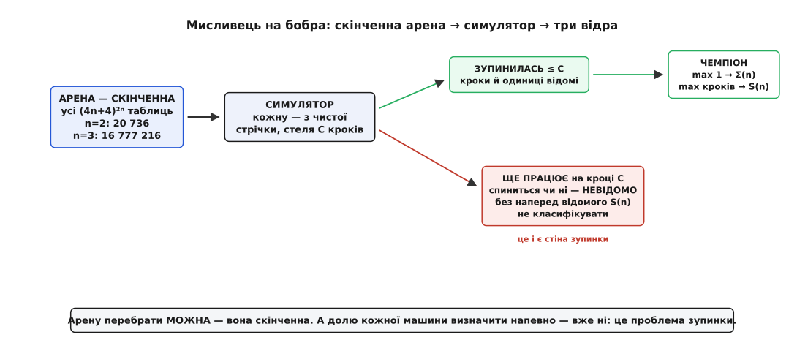
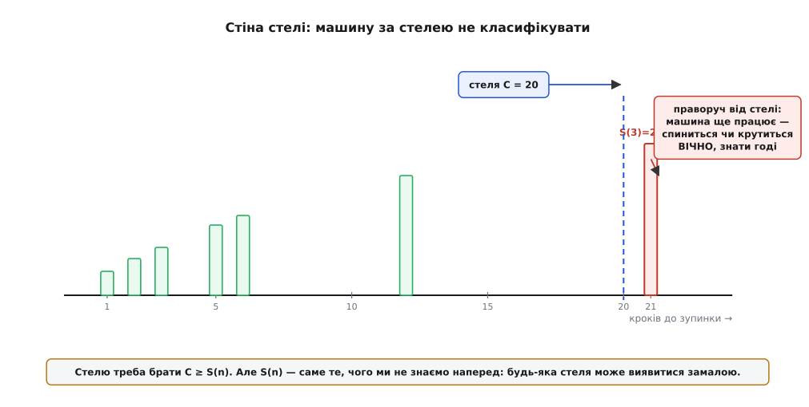
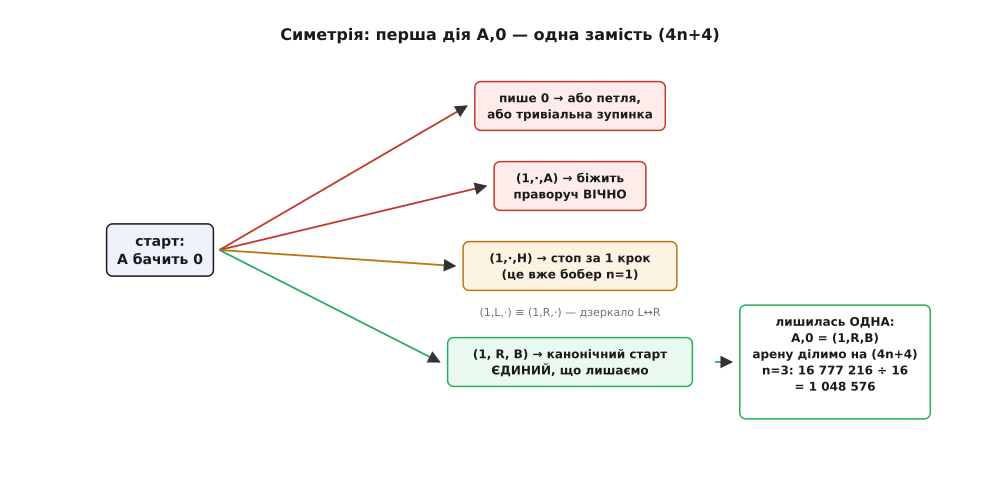

# ⚙️ Мисливець на бобра: перебрати арену власноруч

Про завзятого бобра можна довго говорити абстрактно: арена скінченна, тож максимум існує; а обчислити його не можна, бо це розкололо б проблему зупинки. Обидва твердження перестають бути словами тієї ж миті, коли ти сідаєш **написати мисливця** — програму, що згенерує всі машини з `n` станів, прожене кожну з чистої стрічки й коронує найпрацьовитішу. У консолі проступить рівно те, про що йшлося: арену справді можна перебрати від першої машини до останньої, а стіна справді стоїть — машину, що на стелі кроків усе ще працює, годі покласти в купку «зупиняється» чи в купку «ніколи», не знаючи наперед S(n).

Зберемо цього мисливця по-справжньому — так, щоб він запустився й видав `Σ(2)=4, S(2)=6` та `Σ(3)=6, S(3)=21` не з таблиці, а з власного перебору. І щоб потім тим самим кодом можна було намацати стіну.

Функція бобра дає два числа: **Σ(n)** — найбільше одиниць, які `n`-станова машина лишає на стрічці перед зупинкою, і **S(n)** — найбільше кроків, які вона встигає зробити. Максимум береться лише по тих машинах, що таки спиняються з чистої стрічки. Наше завдання — перебрати кандидатів і знайти обидва рекорди.

> 🔧 **Навіщо системна мова.** Перебір і симуляція — гаряча петля: до мільйонів машин, кожну женемо десятки-сотні кроків, і все це в найглибшому циклі. Тут вирішує сира швидкодія, а не виразність домену, тож системна мова (Rust, C++, Go) дістає високу оцінку — жодного збирача сміття, стрічка як щільний масив байтів, перехід — кілька зсувів. Rust лягає найкраще: перелічуваний тип точно моделює дію клітинки, а володіння — стрічку без зайвих копій. Поряд той самий алгоритм даю на C++ (та сама щільна стрічка й ручна пам'ять) і ясним Python — його читати найлегше, але той самий перебір `n=3` забрав у мене там близько хвилини, а системна мова впорається за частки секунди. Це і є §5 наочно: де приклад про гарячий шлях, перформанс-мова виграє оцінку чесно.

## Що саме перебираємо: кодування таблиці

[Машина Тюринга](topic:computability/turing-machine) тут — це її таблиця переходів і нічого більше. Для кожної пари «стан + символ під голівкою» таблиця каже три речі: який символ **записати** (0 чи 1), **куди зсунутись** (ліворуч чи праворуч) і **в який стан перейти** — один із `n` робочих або зупинку. Пар таких `2n` (n станів × 2 символи), і в кожній клітинці `2 · 2 · (n+1) = 4n+4` можливих дій (записати · зсунути · перейти в один із n станів або зупинитись).

Ключ до всього перебору — упакувати одну дію в одне ціле число `a` з проміжку `0 … 4n+4`. Три поля дістаємо зсувами:

```math
дія a  ∈  0 … 4n+4:
  write  = a & 1          # 0 або 1 — що записати
  dir    = (a >> 1) & 1   # 0 = ліворуч, 1 = праворуч
  target = a >> 2          # 0 … n:  якщо == n, це ЗУПИНКА
```

Уся таблиця машини — це просто масив із `2n` таких чисел, де клітинку `(стан, символ)` шукаємо за індексом `стан·2 + символ`. Тепер «згенерувати всі машини» означає «перебрати всі масиви завдовжки `2n`, де кожен елемент пробігає `0 … 4n+4`». Це буквально мішано-основний лічильник — арена стала об'єктом, який можна крутити в циклі.

:::tabs
```rust
// Дію клітинки тримаємо в одному u32; розпаковуємо трьома дрібницями.
fn write(a: u32) -> u8  { (a & 1) as u8 }          // 0 або 1
fn dir(a: u32)   -> i64 { if (a >> 1) & 1 == 1 { 1 } else { -1 } } // 1=R, -1=L
fn target(a: u32) -> u32 { a >> 2 }                 // == n  →  зупинка

// Машина — це просто масив із 2n дій; клітинку шукаємо за станом і символом.
// table[state * 2 + symbol]  →  дія
```
```cpp
#include <cstdint>

// Дію клітинки тримаємо в одному uint32_t; розпаковуємо трьома дрібницями.
inline uint8_t  write (uint32_t a) { return a & 1u; }                   // 0 або 1
inline int      dir   (uint32_t a) { return ((a >> 1) & 1u) ? 1 : -1; } // 1=R, -1=L
inline uint32_t target(uint32_t a) { return a >> 2; }                   // == n → зупинка

// Машина — це просто масив із 2n дій; клітинку шукаємо за станом і символом:
//   table[state * 2 + symbol]  →  дія
```
```python
# Дію клітинки тримаємо в одному цілому; розпаковуємо трьома дрібницями.
# write  = a & 1           # 0 або 1
# dir    = (a >> 1) & 1     # 1 = праворуч, 0 = ліворуч
# target = a >> 2           # == n  →  зупинка

# Машина — це просто список із 2n дій; клітинку шукаємо за станом і символом:
#   table[state * 2 + symbol]  →  дія
```
:::

## Симулятор однієї машини

Серце мисливця — цикл, що проганяє одну машину з чистої стрічки. Він читає символ під голівкою, бере відповідну дію з таблиці, записує символ, робить крок, змінює стан — і так доти, доки не перейде в стан зупинки **або** не впреться в стелю кроків `cap`. Повертає три речі: чи зупинилась, скільки кроків зробила, скільки одиниць лишила.

Стрічка нескінченна лише в теорії; на практиці за `cap` кроків голівка зсунеться щонайбільше на `cap` клітинок від старту, тож масив завширшки `2·cap + 3` з голівкою в центрі гарантовано вміщає все, до чого машина дотягнеться. Це робить стрічку щільним масивом байтів — і симуляція летить.

Але саме тут і причаїлася вся філософія бобра, вкладена в один рядок коду. Оте `if steps >= cap` — не технічна дрібниця, а **єдине**, що не дає програмі зависнути на машині, яка крутиться вічно. Без стелі симулятор на першому ж вічному циклі зупинявся б сам — тобто ніколи. Стеля рятує програму від зависання, але за це бере ціну, до якої ми зараз дійдемо.

:::tabs
```rust
// Женемо `table` з чистої стрічки, не більш як `cap` кроків.
// Повертає (зупинилась?, кроків, одиниць).
fn simulate(table: &[u32], n: u32, cap: u64) -> (bool, u64, u64) {
    let width = (2 * cap + 3) as usize;
    let mut tape = vec![0u8; width];       // стрічка — щільний масив
    let mut h = (cap + 1) as usize;        // голівка стартує в центрі
    let mut st = 0u32;                     // стан A
    let mut steps = 0u64;
    loop {
        let sym = tape[h];
        let a = table[(st * 2 + sym as u32) as usize];
        tape[h] = write(a);
        steps += 1;
        if target(a) == n {                // перейшли в стан зупинки
            let ones = tape.iter().map(|&b| b as u64).sum();
            return (true, steps, ones);
        }
        h = (h as i64 + dir(a)) as usize;  // зсув на одну клітинку
        st = target(a);
        if steps >= cap {                  // СТЕЛЯ — далі не женемо
            let ones = tape.iter().map(|&b| b as u64).sum();
            return (false, steps, ones);
        }
    }
}
```
```cpp
#include <vector>
#include <numeric>

struct Run { bool halted; uint64_t steps; uint64_t ones; };

// Женемо `table` з чистої стрічки, не більш як `cap` кроків.
// Повертає (зупинилась?, кроків, одиниць).
Run simulate(const std::vector<uint32_t>& table, uint32_t n, uint64_t cap) {
    size_t width = 2 * cap + 3;
    std::vector<uint8_t> tape(width, 0);   // стрічка — щільний масив
    size_t h = cap + 1;                    // голівка стартує в центрі
    uint32_t st = 0;                       // стан A
    uint64_t steps = 0;
    for (;;) {
        uint32_t a = table[st * 2 + tape[h]];
        tape[h] = write(a);
        ++steps;
        if (target(a) == n) {              // перейшли в стан зупинки
            uint64_t ones = std::accumulate(tape.begin(), tape.end(), uint64_t{0});
            return {true, steps, ones};
        }
        h = (size_t)((int64_t)h + dir(a)); // зсув на одну клітинку
        st = target(a);
        if (steps >= cap) {                // СТЕЛЯ — далі не женемо
            uint64_t ones = std::accumulate(tape.begin(), tape.end(), uint64_t{0});
            return {false, steps, ones};
        }
    }
}
```
```python
def simulate(table, n, cap):
    tape = {}                              # позиція → символ (0 за замовчуванням)
    h = st = steps = 0
    while True:
        a = table[st * 2 + tape.get(h, 0)]
        tape[h] = a & 1                    # write
        steps += 1
        t = a >> 2                         # target
        if t == n:                         # перейшли в стан зупинки
            return True, steps, sum(tape.values())
        h += 1 if (a >> 1) & 1 else -1     # dir: 1 = праворуч
        st = t
        if steps >= cap:                   # СТЕЛЯ — далі не женемо
            return False, steps, sum(tape.values())
```
:::

## Перебір арени і коронація

Тепер зберемо все докупи. Генератор крутить мішано-основний лічильник по всіх вільних клітинках, симулятор виносить вирок кожній машині, а ми тримаємо два рекорди — найбільше одиниць і найбільше кроків серед тих, що зупинилися, — і окремо лічимо тих, кого стеля лишила недокласованими.

Одну клітинку зафіксуємо наперед: старт `A,0 = (1, R, B)`. Чому саме так — розберемо нижче в скороченнях; поки досить знати, що чемпіон для `n ≥ 2` завжди можна привести до цього старту, а це вже ділить арену на `4n+4`.

:::tabs
```rust
fn hunt(n: u32, cap: u64) -> (u64, u64, u64, u64, u64) {
    let a_size = 4 * n + 4;                 // дій на клітинку
    let cells = (2 * n) as usize;
    let mut table = vec![0u32; cells];
    table[0] = 7;                           // старт-нормалізація: A,0 = (1,R,B) = 7
    let free = cells - 1;                    // вільні клітинки — 1 … cells-1
    let mut idx = vec![0u32; free];          // мішано-основний лічильник
    let (mut total, mut halted, mut undecided) = (0u64, 0u64, 0u64);
    let (mut best_ones, mut best_steps) = (0u64, 0u64);
    loop {
        for i in 0..free { table[i + 1] = idx[i]; }
        total += 1;
        let (ok, steps, ones) = simulate(&table, n, cap);
        if ok {
            halted += 1;
            best_ones = best_ones.max(ones);      // рекорд одиниць  → Σ(n)
            best_steps = best_steps.max(steps);   // рекорд кроків   → S(n)
        } else {
            undecided += 1;                       // ще працює на стелі
        }
        // ++лічильник за основою a_size; переповнення → арену пройдено
        let mut k = 0;
        while k < free { idx[k] += 1; if idx[k] < a_size { break; } idx[k] = 0; k += 1; }
        if k == free { break; }
    }
    (total, halted, undecided, best_ones, best_steps)
}
```
```cpp
struct Hunt { uint64_t total, halted, undecided, best_ones, best_steps; };

Hunt hunt(uint32_t n, uint64_t cap) {
    uint32_t a_size = 4 * n + 4;              // дій на клітинку
    size_t cells = 2 * n;
    std::vector<uint32_t> table(cells, 0);
    table[0] = 7;                             // старт-нормалізація: A,0 = (1,R,B) = 7
    size_t free_cells = cells - 1;            // вільні клітинки — 1 … cells-1
    std::vector<uint32_t> idx(free_cells, 0); // мішано-основний лічильник
    Hunt r{0, 0, 0, 0, 0};
    for (;;) {
        for (size_t i = 0; i < free_cells; ++i) table[i + 1] = idx[i];
        ++r.total;
        Run run = simulate(table, n, cap);
        if (run.halted) {
            ++r.halted;
            if (run.ones  > r.best_ones)  r.best_ones  = run.ones;   // рекорд одиниць → Σ(n)
            if (run.steps > r.best_steps) r.best_steps = run.steps;  // рекорд кроків  → S(n)
        } else {
            ++r.undecided;                        // ще працює на стелі
        }
        // ++лічильник за основою a_size; переповнення → арену пройдено
        size_t k = 0;
        while (k < free_cells) { if (++idx[k] < a_size) break; idx[k] = 0; ++k; }
        if (k == free_cells) break;
    }
    return r;
}
```
```python
from itertools import product

def hunt(n, cap):
    A = 4 * n + 4                           # дій на клітинку
    cells = 2 * n
    ranges = [[7]] + [range(A)] * (cells - 1)   # A,0 = 7 = (1,R,B) фіксовано
    total = halted = undecided = 0
    best_ones = best_steps = 0
    for combo in product(*ranges):          # усі таблиці арени
        table = list(combo)
        total += 1
        ok, steps, ones = simulate(table, n, cap)
        if ok:
            halted += 1
            best_ones = max(best_ones, ones)     # рекорд одиниць → Σ(n)
            best_steps = max(best_steps, steps)  # рекорд кроків  → S(n)
        else:
            undecided += 1                       # ще працює на стелі
    return total, halted, undecided, best_ones, best_steps
```
:::

Запускаємо для двох і трьох станів зі стелею із запасом — і ось що друкує програма (до лічильників я додав ще й запис виграшної таблиці — це зайвий рядок: копіюй `table`, щойно побив рекорд):

```
n=2:  перебрано 1 728,  зупинились 808,  недокласовано 920
      Σ(2) = 4 одиниці
      S(2) = 6 кроків
      чемпіон:  A: 0→1RB  1→1LB     B: 0→1LA  1→1LH

n=3:  перебрано 1 048 576,  зупинились 471 236,  недокласовано 577 340
      Σ(3) = 6 одиниць   (машина ставить 6 одиниць за 12 кроків)
      S(3) = 21 крок     (ІНША машина: 21 крок, а лишає всього 4 одиниці)
      Σ-чемпіон:  A: 0→1RB  1→1RA    B: 0→1LC  1→1LH    C: 0→1RA  1→1LB
      S-чемпіон:  A: 0→1RB  1→0LH    B: 0→1LB  1→0RC    C: 0→1LC  1→1LA
```

Числа співпали з відомими — але тепер вони не переписані, а **виведені**. Кілька речей у цьому виводі варті окремої уваги.

По-перше, `1 728` і `1 048 576` — це вже після старт-нормалізації. Повна арена — у `4n+4` разів більша: для `n=2` це `12 · 1728 = 20 736` машин (`12⁴`), для `n=3` — `16 · 1 048 576 = 16 777 216` (`16⁶`). Саме число `20 736` і є та скінченна арена, про яку йшлося: її справді можна прокрутити всю.

По-друге, зверніть увагу на `n=3`: **рекорд одиниць і рекорд кроків беруть різні машини**. Σ-чемпіон викладає шість одиниць уже за дванадцять кроків; а S-чемпіон труситься аж двадцять один крок, але лишає по собі жалюгідні чотири одиниці. Для `n=2` пощастило — одна машина тримає обидва рекорди (це той самий двостановий чемпіон; `1LH` замість `1RH` — байдужа різниця, бо на зупинці напрям зсуву вже нічого не важить). А от із трьох станів Σ і S остаточно розходяться по різних машинах, і мисливець мусить стежити за обома нарізно.

І по-третє — те, заради чого все й затівалось. Поряд зі `808` зупиненими стоять `920` **недокласованих** машин (для `n=3` — аж `577 340`). Це машини, що на стелі все ще працювали. І от що з ними робити — то вже не питання перебору.


*Мисливець у три ходи. Скінченну арену `(4n+4)²ⁿ` таблиць женемо крізь симулятор зі стелею `C`. Направо відгалужуються два відра: зупинені машини (кроки й одиниці відомі — з них беремо чемпіона) і ті, що на кроці `C` ще працюють. Друге відро — це стіна: без наперед відомого S(n) машину звідти не перекласти ні в «зупиняється», ні в «крутиться вічно».*

## Стіна кроку-стелі

Ми взяли стелю «із запасом» і дістали правильні відповіді. Але звідки я знав, що `cap = 500` — це запас? Тільки з того, що хтось уже довів: `S(3) = 21`. А якби не знав? Спробуймо збрехати мисливцеві про світ — дати йому замалу стелю — і подивитись, що станеться.

Проженемо `n=3` з різними стелями й порівняймо:

```
cap = 20:  зупинились 471 232   недокласовано 577 344   Σ=6   S=20  ← ХИБА
cap = 21:  зупинились 471 236   недокласовано 577 340   Σ=6   S=21  ✓
cap = 22:  зупинились 471 236   недокласовано 577 340   Σ=6   S=21
cap = 50:  зупинились 471 236   недокласовано 577 340   Σ=6   S=21
```

Погляньте на перший рядок. Стеля `20` — на один-єдиний крок нижча за справжнє `S(3)=21` — і мисливець упевнено бреше: рапортує `S=20`. Справжній двадцятиоднокроковий чемпіон не зник — він просто не встиг зупинитися до стелі й провалився в купку недокласованих (їх стало рівно на чотири більше: `577 344` замість `577 340` — це чемпіон і ще три машини, що теж спиняються рівно на 21-му кроці). Мисливець їх бачив, ганяв — і викинув у «не знаю».

А тепер найважливіше, і це варто перечитати повільно. Рядки `cap=21`, `cap=22`, `cap=50` **однакові до останньої цифри**. Скільки не піднімай стелю понад 21 — нічого не міняється, бо жодна тристанова машина не зупиняється між 22-м і 500-м кроком. Ми, люди, це знаємо — бо знаємо `S(3)=21`. Але **сама програма цього знати не може**. Вона бачить, що від 21 до 50 нічого не змінилось, — та хіба це доказ, що не зміниться на 51? на тисячі? на мільярді? Раптом десь далеко чекає машина, яка мовчки труситься сто тисяч кроків, а тоді все-таки спиняється й перебиває рекорд? Щоб знати, що такої немає, треба вже знати `S(3)`. А `S(3)` — це саме те, що ми шукаємо.


*Стіна стелі. Кожен стовпчик — машина, що зупинилась за стільки-то кроків. Стеля `C=20` (штрихова) відрізає справжнього чемпіона `S(3)=21`: він праворуч від стелі, і мисливець його вже не бачить — для програми він у зоні «ще працює, а спиниться чи ні — знати годі». Підняти стелю до 21 його ловить; але жодне скінченне «нічого не змінилось» не доводить, що більшої машини немає.*

Ось точний зміст того, що мисливець насправді обчислює. Він дає не Σ(n) і S(n), а **нижню оцінку**: рекорд серед машин, які встигли зупинитися до стелі, плюс мішок недокласованих. Піднімеш стелю — частина недокласованих перетече в зупинені, і рекорд, можливо, підросте. Але сказати «оце вже стеля, вище нічого не буде» — означає провістити, що всі недокласовані машини не спиняться **ніколи**. А безпомилковий провісник вічної роботи — це і є розв'язувач [проблеми зупинки](topic:computability/halting-problem), якого не існує.

> 🔧 **Навіщо це.** Спокуса очевидна: «ну проженемо ще довше, і хто не спинився — той зациклився». Мисливець показує, чому це пастка. «Ще працює на стелі» — **не те саме**, що «не спиниться ніколи»; перше твоя програма чесно бачить, друге — не має права стверджувати. Тому будь-який аналізатор, що обіцяє **напевно** сказати про довільну програму, спиниться вона чи ні, впирається в цю саму стіну — і чесні інструменти замість «зациклиться» кажуть «не довів». Наш мисливець — крихітна модель цієї межі: він блискуче перебирає скінченну арену й безпорадно застигає перед єдиним питанням, якого перебором не взяти.

## Симетрійні скорочення

Наївний перебір швидко впирається в розмір арени: `20 736` для двох станів ще дрібниця, `16 777 216` для трьох уже відчутно, а далі — прірва. Урятувати може тільки одне: не перебирати машини, які й так еквівалентні вже баченим або й так очевидно нецікаві. Кожне скорочення мусить бути **чесним** — зберігати чемпіона, а не втратити його разом зі сміттям.

**Старт-нормалізація.** Машина завжди стартує в стані A на нулі — тож перша дія `A,0` особлива. Переберемо, що вона взагалі може робити, і побачимо, що майже все — виродки:

- **Пише 0.** Тоді на стрічці нічого не змінилось, і машина або зациклиться, або звелася до меншої задачі — нового чемпіона так не здобути.
- **Пише 1 і йде в A.** Читає наступний нуль → та сама дія → біжить праворуч навічно, викладаючи одиниці. Не зупиняється.
- **Пише 1 і зупиняється.** Стоп за один крок, одна одиниця — це чемпіон для `n=1`, не більше.
- **Пише 1, крок праворуч, у новий стан B.** Оце єдиний змістовний варіант.

Напрям першого кроку теж не грає ролі: дзеркальна машина (усі L↔R навпаки) робить те саме число кроків і лишає те саме число одиниць, тож ліворуч і праворуч дають дзеркальних близнюків — беремо праворуч. Разом: `A,0 = (1, R, B)` — одна дія замість `4n+4`. Це ділить усю арену на `4n+4` без жодної втрати чемпіона.


*Симетрія першого кроку. З `4n+4` дій для `A,0` майже всі — виродки: запис нуля дає петлю або дрібницю, перехід у A жене машину праворуч навічно, перехід у H — це вже бобер `n=1`. Дзеркало L↔R прирівнює лівий старт до правого. Лишається один канонічний `A,0=(1,R,B)` — і арена меншає в `4n+4` разів (для `n=3`: з 16 777 216 до 1 048 576).*

**Стягування зупинок.** На дії, що веде в стан зупинки, напрям зсуву вже нічого не важить — машина стала. А писати варто одиницю (нуль на зупинці лише зменшив би Σ, ніколи не збільшив). Тож чотири «зупинкові» дії в кожній клітинці стягуються до однієї змістовної. Дрібниця, але множиться по всіх клітинках.

**Деревна нормальна форма (TNF).** Найсильніше скорочення б'є в корінь наївного перебору — а той марнує час на дві речі одразу. По-перше, він генерує **недосяжні** клітинки: якщо машина до стану C ніколи не дістається, усі `(4n+4)²` варіантів його рядка дають ту саму поведінку, а перебираються як різні. По-друге, він рахує **перейменування**: та сама машина з переставленими іменами станів B↔C — це той самий бобер, а лічиться багато разів.

Ідея TNF прибирає обидві біди заразом: не генеруймо таблицю наперед, а **вирощуймо її по ходу симуляції**. Женемо машину; щойно вона впирається в клітинку, якої ще не визначено, — саме тут розгалужуємось і пробуємо всі дії для цієї клітинки. А нові стани вводимо **строго за порядком**: перехід дозволено лише в уже вжитий стан або в один-єдиний наступний свіжий. Так кожна машина породжується рівно в одному канонічному вигляді, а недосяжні клітинки просто ніколи не визначаються — їх нема куди перебирати.

```python
import sys
sys.setrecursionlimit(100_000)

def hunt_tnf(n, cap):
    st = {"leaves": 0, "halted": 0, "holdouts": 0, "best_ones": 0, "best_steps": 0}

    def simulate(table):                        # симуляція з ЧАСТКОВОЮ таблицею
        tape = {}; h = s = steps = 0
        while True:
            key = (s, tape.get(h, 0))
            if key not in table:                # клітинку ще не визначено —
                return ("undef", key)           # час розгалужуватись
            w, d, t = table[key]
            tape[h] = w; steps += 1
            if t == n:
                return ("halt", steps, sum(tape.values()))
            h += 1 if d == 1 else -1; s = t
            if steps >= cap:
                return ("cap", steps, sum(tape.values()))

    def search(table, used):                    # used — скільки станів уже введено
        r = simulate(table)
        if r[0] == "halt":
            _, steps, ones = r
            st["leaves"] += 1; st["halted"] += 1
            st["best_ones"]  = max(st["best_ones"],  ones)
            st["best_steps"] = max(st["best_steps"], steps)
            return
        if r[0] == "cap":
            st["leaves"] += 1; st["holdouts"] += 1   # недобиток: не класифікувати
            return
        _, cell = r                              # невизначена клітинка → гілкуємось
        targets = list(range(used)) + ([used] if used < n else [])  # вжиті + ОДИН новий
        for w in (0, 1):
            for d in (0, 1):                     # 0=L, 1=R
                for t in targets:
                    nxt = dict(table); nxt[cell] = (w, d, t)
                    search(nxt, max(used, t + 1))
        for w in (0, 1):                         # зупинка: напрям байдужий — одна гілка
            nxt = dict(table); nxt[cell] = (w, 1, n)
            search(nxt, used)

    search({(0, 0): (1, 1, 1)}, 2)               # старт A,0=(1,R,B); стани A,B уведено
    return st
```

Той самий алгоритм системною мовою (C++ чи Rust) читався б майже слово в слово — тільки часткову таблицю зручніше тримати масивом із «порожнім» значенням-міткою, а не хеш-мапою, і рекурсію лишити на стеку. Виграш — не у виразності, а у швидкодії гарячої петлі; логіка розгалуження ідентична.

Що дає TNF на практиці — видно одразу:

```
             повна арена     старт-норм        TNF (cap=200)
 n=2            20 736           1 728           136 листків
 n=3        16 777 216       1 048 576        17 928 листків
```

З майже сімнадцяти мільйонів — до вісімнадцяти тисяч, і всі відповіді ті самі: `Σ(3)=6, S(3)=21`. Тими самими сімнадцятьма тисячами «листків» TNF ділиться на дві частини: `2 758` машин, що зупинились (кандидати в чемпіони), і `15 170` **недобитків** — тих, що на стелі ще працювали. Оті недобитки й є вся справжня праця: перебір їх знайшов, а класифікувати не зумів — це знову наша стіна, тепер уже стисла до кількох тисяч найтвердіших горішків. Той самий TNF-мисливець тягне й чотири стани: `3 127 652` листки, і серед них чесно проступають `Σ(4)=13, S(4)=107`.

А далі скорочень уже не досить. П'ять станів не бере навіть TNF наскоком — щоб довести `S(5)=47 176 870`, відкрита спільнота bbchallenge мусила перебрати **181 385 789** машин і кожну або довести незупинною окремим аргументом, або прогнати до кінця, а весь перебір загорнути у [формально перевірений доказ](topic:sf-release/formal-verification). Скорочення виграють станів зо два — і впираються в ту саму стіну, тільки вже величезну.

## Складність і пастки

Розмір арени росте як `(4n+4)²ⁿ` — швидше за будь-яку експоненту, бо росте й основа, і показник. Скорочення збивають множник, але не саму природу: перебір лишається над-експоненційним. Ось чому мисливець любісінько бере `n=2, 3, 4` і безнадійно захлинається на `n=5` (наївно — це `24¹⁰ ≈ 6.3·10¹³` таблиць), а `n=6`, де `S(6)` перевищує `2↑↑↑5`, не візьме ніколи й ніяка машина.

На що наступити найлегше, коли пишеш власного мисливця:

- **Стеля — це стіна зупинки, перевдягнена в число.** Замала стеля мовчки занижує S і роздуває мішок недокласованих; а стелі, яка **напевно** досить, не існує без наперед відомого S(n). Мисливець дає не рекорд, а нижню оцінку рекорду — так його й треба читати.
- **«Ще працює» — не «не спиниться».** Найспокусливіша й найгрубіша помилка — вивести недокласовані машини як «зациклені». Симулятор бачить лише, що машина не стала до стелі; робити з цього висновок про вічність — означає тихцем привласнити собі розв'язувач проблеми зупинки.
- **Недосяжні стани й перейменування** роздувають наївний перебір на порядки. Обидві біди прибирає TNF — вирощуй таблицю по ходу й уводь стани за порядком.
- **Переповнення лічильників.** `S(5) = 47 176 870` ще влазить у 32 біти, але вже `S(6)` не влазить у жоден скінченний тип — тому лічильник кроків у мисливці безпечний **лише тому**, що ми його стелею й обмежуємо. Знімеш стелю — і на великих `n` переповнення прийде раніше за відповідь.
- **Домовленість про зупинку.** Один крок туди-сюди — і S зсунеться на одиницю. Ми рахуємо перехід у стан зупинки як окремий крок, а символ на ньому пишемо (він іде в залік Σ). Звіряй цю домовленість об еталон: якщо твій код не видає `S(2)=6` для двостанового чемпіона, ти десь схибив на одиницю саме тут.

Зрештою, мисливець на бобра — це два рядки теорії, покладені в код і від того відчутні на дотик. Скінченна арена — це `for`-цикл, який справді добігає кінця: його можна запустити й побачити всі `20 736` машин. А стіна зупинки — це `if steps >= cap`: рядок, який рятує програму від зависання й тією ж миттю відбирає в неї всезнання. Перебрати арену виявляється легко. Спіймати останнього недобитка — незмога, вписана в саму задачу.
