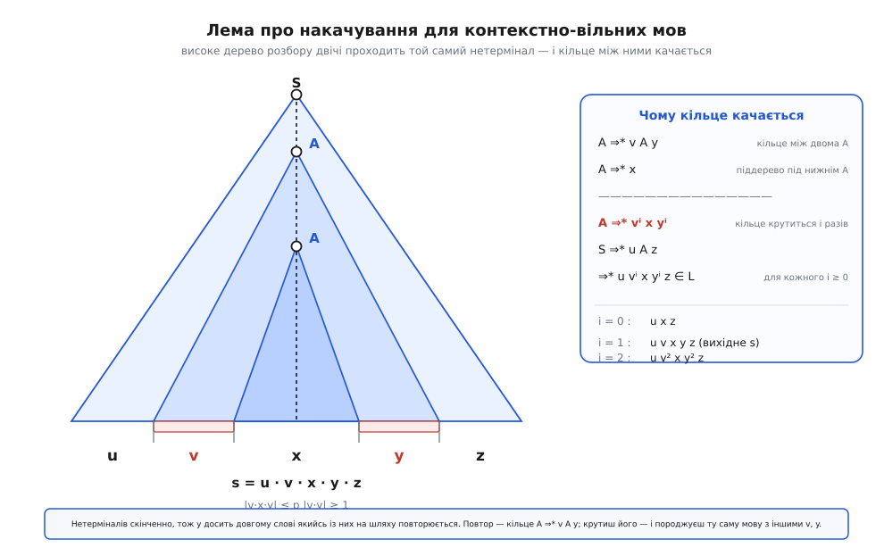
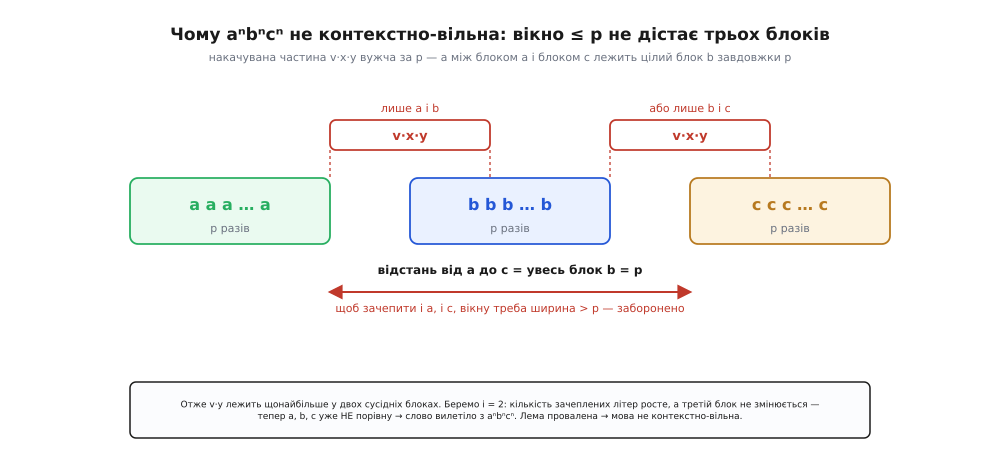
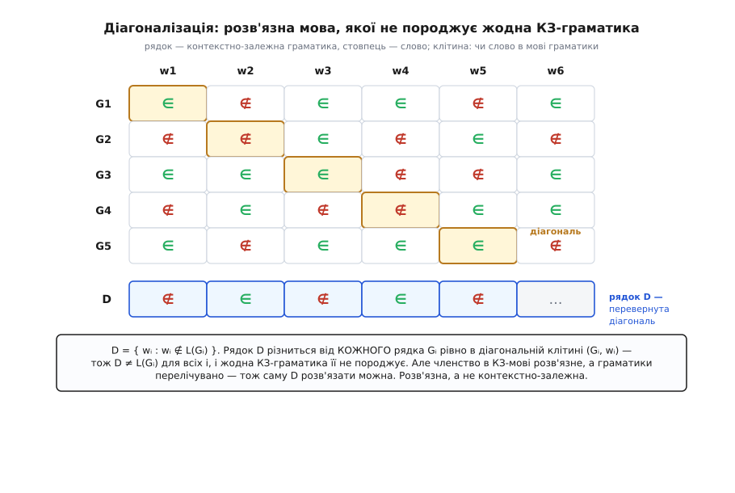

# 🧮 Драбина не колапсує: строгі докази чотирьох включень

Розкласти моделі обчислення по поверхах — це половина справи. Друга половина, без якої мапа нічого не варта, — довести, що поверхи **справді різні**, що драбина не складається потай в один щабель. Формально це п'ять класів і чотири стики між ними:

```
регулярні ⊊ контекстно-вільні ⊊ контекстно-залежні ⊊ розв'язні ⊊ рекурсивно-зліченні
```

Легша половина кожного знака — це `⊆`: кожна нижча мова лежить у вищому класі. Вона випливає прямо з означень (слабші правила граматики — окремий випадок сильніших; слабша машина — окремий випадок потужнішої), і доводити тут майже нічого. Уся напруга — у **строгості** `⊊`: у тому, що на кожному стику ширший клас **справді ширший**, містить щось, чого вужчий не досягає нікотрим чином.

І ось де починається робота. Показати, що мова лежить у ширшому класі, легко — пред'явив граматику чи машину, та й по всьому. А показати, що мова **не лежить** у вужчому, — це зовсім інша задача: недосить не знайти для неї автомата чи граматики. Треба довести, що його **не існує в принципі** — жодного, ніколи, хоч скільки старайся. Кожен із чотирьох стиків має свого **свідка**: конкретну мову, що живе у ширшому класі й доведено відсутня у вужчому. Свідок — не приклад, а доказ: він показує рівно ту здатність, якої нижчому поверху бракує.

## Дві половини драбини, дві зброї

Найцікавіше в цих чотирьох доказах — що вони розпадаються на дві пари, і в кожної пари **своя** зброя. Це не випадок оформлення, а відбиток глибокої різниці між поверхами.

```
                        зброя доказу         чому саме вона
регулярні  ⊊ КВ         лема (регулярна)   ┐
КВ         ⊊ КЗ         лема (КВ)          ┴  пам'ять ОБМЕЖЕНА → вимушений повтор
КЗ         ⊊ розв'язні  діагональ (Патнем) ┐
розв'язні  ⊊ Тип 0      діагональ (зупинка)┴  сила ТЮРИНГА → відрив діагоналлю
```

Нижні два стики беруть **лему про накачування**. Її можна застосувати рівно тому, що на цих поверхах пам'ять **обмежена**: у скінченного автомата — числом станів, у контекстно-вільної граматики — числом різних нетерміналів. А скінченна пам'ять лишає слід: у досить довгому слові щось неминуче **повторюється**, і цей повтор можна прокрутити зайвий раз, не питаючи дозволу в машини. Це локальний дефект — крутиться маленький шматок усередині слова.

Верхні два стики так уже не візьмеш. Лінійно-обмежений автомат і машина Тюринга орудують стрічкою, довжина якої росте разом із входом (або й безмежно), — вимушеного повтору тут немає, качати нема чого. Тому зброю доводиться міняти на **діагоналізацію**: замість шукати дефект усередині одного слова, ми будуємо цілу мову, яка **суперечить кожному** кандидатові з вужчого класу — розходиться з ним хоча б в одній точці. Це глобальний дефект — мова спроєктована так, щоб перебити весь перелік суперників.

Межа між зброями пролягає точно там, де пам'ять із обмеженої стає необмеженою. Пройдімося по всіх чотирьох стиках і подивімося, як кожна зброя влучає.

## Стик 1: регулярні ⊊ контекстно-вільні — свідок aⁿbⁿ

Свідок тут — мова **aⁿbⁿ** = { aⁿbⁿ : n ≥ 1 }: спершу кілька `a`, потім **рівно стільки ж** `b`.

Що вона контекстно-вільна, видно з двоправилової граматики:

```
S → a S b   |   a b

S ⇒ a S b ⇒ a a S b b ⇒ a a a b b b  =  a³b³
```

Кожне застосування `S → aSb` дописує по одному `a` ліворуч і `b` праворуч **симетрично**, тож їх завжди порівну. Один нетермінал `S` тримає всю ще-не-дописану вкладеність — рівно так, як стек магазинного автомата тримає, скільки `a` вже прочитано, щоб потім звірити з `b`.

> 🔧 **Навіщо це.** Цей самий кістяк — «відкрив, потім закрий стільки ж» — лежить під усім вкладеним: дужки, теги, блоки коду. Стек рахує глибину, і саме тому синтаксис мов програмування розбирають магазинним автоматом, а не регулярним виразом. Знаменита пересторога «не парси HTML регексом» — це буквально межа цього стику: вкладеність без стелі скінченному стану не під силу.

А чому aⁿbⁿ **не** регулярна — каже [лема про накачування для регулярних мов](topic:computability/regular-languages/math-pumping-lemma.md). Коротко: якщо мову розпізнає автомат із p станів, то будь-яке слово завдовжки ≥ p женеться нею так, що якийсь стан повторюється, — а шматок між повторами утворює цикл, який можна прокрутити скільки завгодно разів, і слово мусить лишитися в мові. Обертаємо це проти aⁿbⁿ:

```
Припустимо, aⁿbⁿ регулярна; нехай p — її довжина накачування.
Беремо  s = aᵖ bᵖ  ∈ L,  |s| = 2p ≥ p.

Перші p символів — самі a, тож умова |x·y| ≤ p замикає цикл y
всередині них:   y = aᵏ,   1 ≤ k ≤ p.

Качаємо вгору, i = 2:
        x·y²·z  =  aᵖ⁺ᵏ bᵖ ,   a стало p+k,  b лишилось p,  k ≥ 1
        →  a і b уже НЕ порівну  →  ∉ aⁿbⁿ.

Суперечність. Отже aⁿbⁿ не регулярна.  ∎
```

Свідок доводить не «aⁿbⁿ складна», а точну річ: **скінченний стан не вміє рахувати без стелі**. Щоб звірити число `a` з числом `b`, машині треба десь тримати перше число, поки читає друге, — а необмежене число у скінченному наборі станів не вміщається. Стек магазинного автомата рівно цю нестачу й закриває, тому й ловить aⁿbⁿ, а скінченний автомат — ні. Стик між першим і другим поверхом — це рівно ціна одного лічильника без стелі.

## Стик 2: контекстно-вільні ⊊ контекстно-залежні — свідок aⁿbⁿcⁿ

Тепер свідок — **aⁿbⁿcⁿ** = { aⁿbⁿcⁿ : n ≥ 1 }: три однакові кількості поспіль.

Що вона контекстно-залежна, показує граматика, чиї правила **не вкорочують** рядок (ліва частина ніколи не довша за праву — це й є означення контекстно-залежної):

```
S → a S B C   |   a B C          наростити a; за кожним — значок B і C
C B → B C                        пересортувати: усі B наперед, C назад
a B → a b      b B → b b         B стає b поряд з a або b
b C → b c      c C → c c         C стає c поряд з b або c
```

Правило `CB → BC` — серце конструкції: ліворуч **два** символи, і жоден не «головний», доля `B` вирішується у сплетінні з сусіднім `C`. Саме така сила потрібна, щоб утримати **дві** незалежні рівності — a = b і b = c — водночас. І саме її бракує контекстно-вільним, що ми зараз і доведемо.

### Лема про накачування для контекстно-вільних мов

Регулярна лема виростала зі скінченного числа **станів**. Контекстно-вільна виростає зі скінченного числа **нетерміналів** — і механізм майже той самий, лише замість пробігу автомата дивимося на **дерево розбору**.

Слово породжується деревом: у корені `S`, у листках — літери слова, у внутрішніх вузлах — нетермінали. Якщо слово довге, дерево мусить бути **високим** — бо гілкування обмежене (у нормальній формі кожен вузол має щонайбільше двох дітей), тож коротким деревом багато листків не накриєш. А високе дерево має **довгий шлях** від кореня до листка. І тут спрацьовує та сама шухлядна логіка: якщо шлях довший за число різних нетерміналів, то якийсь нетермінал на ньому **повторюється**.


*Механізм контекстно-вільної леми. Високе дерево розбору двічі проходить той самий нетермінал `A`. Кільце між верхнім і нижнім `A` породжує `v` (ліворуч від шляху) і `y` (праворуч), а піддерево під нижнім `A` — `x`. Оскільки `A ⇒* vAy` і `A ⇒* x`, кільце можна прокрутити скільки завгодно разів: `A ⇒* vⁱ x yⁱ`, і все слово `u·vⁱ·x·yⁱ·z` лишається в мові.*

Нехай `A` — той повторений нетермінал. Тоді малюнок читається так: зовнішнє входження `A` породжує все, що під ним, — назвімо це `v·(щось)·y`, де `v` — листки ліворуч від шляху вниз, `y` — праворуч. Внутрішнє входження `A` породжує серединку — назвімо її `x`. Виходить `A ⇒* v A y` (кільце) і `A ⇒* x` (дно). А раз `A` переходить сам у себе в обгортці `v … y`, цю обгортку можна накрутити скільки завгодно:

```
A ⇒* x                       (одразу на дно)
A ⇒* v A y ⇒* v x y          (одне кільце)
A ⇒* v A y ⇒* v v A y y ⇒* v² x y²   (два кільця)
…
A ⇒* vⁱ x yⁱ                 для кожного i ≥ 0
```

Ціле слово збирається як `s = u·v·x·y·z`, де `u` і `z` — те, що зовні верхнього `A`. Звідси й формулювання:

```
ЛЕМА ПРО НАКАЧУВАННЯ (для контекстно-вільних мов)

Якщо L контекстно-вільна, то існує p ≥ 1, що КОЖНЕ слово s ∈ L
завдовжки |s| ≥ p ріжеться на П'ЯТЬ частин

        s  =  u · v · x · y · z

так, що виконано всі три умови:
   (1)  |v·x·y| ≤ p        качуване вікно вузьке (беремо повтор БІЛЯ дна)
   (2)  |v·y| ≥ 1          обидві качувані частини разом непорожні
   (3)  u·vⁱ·x·yⁱ·z ∈ L    для КОЖНОГО i = 0, 1, 2, …
```

Дві частини `v` і `y` качаються **синхронно** — це прямий слід того, що вони народжені одним кільцем `A ⇒* vAy`. Умова (1) виходить із того, що повтор беруть не будь-де, а серед останніх кількох нетерміналів шляху, близько до листків, — тоді піддерево під ним маленьке. Умова (2) тримається на тому, що в граматиці без марних одиничних та ε-переходів (нормальна форма Чомського) кільце обов'язково щось дописує, тож `v` або `y` непорожнє. За духом це та сама лема, що й для регулярних мов, лише слідів тепер два — по один з кожного боку шляху.

### Чому aⁿbⁿcⁿ під неї не лягає

Тепер обертаємо лему проти свідка. Уся сила — в умові (1): вікно `v·x·y` **вузьке**, вужче за p.

```
Припустимо, aⁿbⁿcⁿ контекстно-вільна; нехай p — її довжина накачування.
Беремо  s = aᵖ bᵖ cᵖ  ∈ L,  |s| = 3p ≥ p.
```


*Чому aⁿbⁿcⁿ ламає контекстно-вільну лему. Слово — три блоки по p літер. Качуване вікно `v·x·y` завширшки ≤ p не дістає водночас блоку `a` і блоку `c`: між ними лежить увесь блок `b` завдовжки p. Тож `v·y` сидить щонайбільше у двох сусідніх блоках із трьох — і качання лишає третій блок незмінним, а рівність a = b = c рветься.*

Логіка проста, як тільки бачиш картинку. Вікно завширшки ≤ p не може одночасно зачепити `a` і `c`: щоб дотягтися від одного блока до іншого, треба перестрибнути весь блок `b`, а він завдовжки рівно p. Отже накачувана частина `v·y` цілком лежить **щонайбільше у двох сусідніх блоках** із трьох.

```
Качаємо, i = 2  (додаємо ще по копії v та y):
   • v·y чіпає лише a і/або b  →  c лишилось p, а a або b стало більше
   • або чіпає лише b і/або c  →  a лишилось p, а b або c стало більше

У будь-якому разі один із трьох блоків не змінився, а інший виріс
        →  a = b = c зламано  →  ∉ aⁿbⁿcⁿ.

Суперечність. Отже aⁿbⁿcⁿ не контекстно-вільна.  ∎
```

Що саме довів свідок? Магазинний автомат має **один** стек — один лічильник без стелі. Його вистачає на **одну** рівність: поклав `a`, познімав на `b`. Але коли `b` дочитано, стек порожній, і звіряти `b` із `c` немає чим — фішки скінчилися. `aⁿbⁿcⁿ` вимагає тримати дві рівності нараз, а стек тримає одну. Стик між другим і третім поверхом — це ціна другого незалежного лічильника.

> 🔧 **Навіщо це.** Це не абстрактна вправа, а межа, об яку розбиваються реальні задачі. Узгодження, що тягнеться крізь три різні місця («стільки-то оголошено — стільки-то вжито — стільки-то передано»), контекстно-вільною граматикою не перевіриш: парсер збудує дерево, але порахувати три збіги водночас не зможе. Тому такі перевірки виносять із граматики в **окремий семантичний прохід** — це вже сила контекстно-залежного рівня. Коли бачите, що вимога зшиває більш ніж дві незалежні кількості, знайте: одним CFG-парсером не обійдетесь, і це теорема, а не ваша невправність.

Для важчих свідків, де плаский підрахунок «двох блоків» не спрацьовує, є посилена версія — **лема Огдена**: вона дозволяє наперед **позначити** p позицій і гарантує, що качувані частини зачеплять саме позначене. Це той самий механізм дерева розбору, лише з прицільним вибором повтору; для aⁿbⁿcⁿ вистачає й простої леми, тож на Огдені тут не спиняємось.

## Стик 3: контекстно-залежні ⊊ розв'язні — діагональ Патнема

Тут зброя міняється. Свідка-мови «на пальцях» уже не показати — його доведеться **сконструювати**, і конструкція буде діагональна.

Спершу — легша половина: **кожна контекстно-залежна мова розв'язна**. Це не самоочевидно (означення КЗ-мови нічого не каже про зупинку), але доводиться коротко саме з того, що правила **не вкорочують**. Раз кожне правило `α → β` має `|α| ≤ |β|`, то в будь-якому виведенні `S ⇒ … ⇒ w` проміжні рядки **не коротшають**. Отже, щоб вивести слово `w` завдовжки n, досить розглядати лише рядки завдовжки ≤ n — а їх над скінченним алфавітом скінченне число. Пошук у цій скінченній множині завжди спиняється:

```python
from collections import deque

def csg_accepts(rules, start, w):
    """rules: список (ліва, права) з |ліва| ≤ |права|, рядки над V ∪ Σ.
    Повертає True ⟺ start ⇒* w. ЗАВЖДИ зупиняється."""
    n = len(w)
    seen, queue = {start}, deque([start])
    while queue:
        s = queue.popleft()
        if s == w:
            return True
        for lhs, rhs in rules:
            i = s.find(lhs)
            while i != -1:
                t = s[:i] + rhs + s[i + len(lhs):]
                # правила не вкорочують → форми довші за w — глухий кут
                if len(t) <= n and t not in seen:
                    seen.add(t)
                    queue.append(t)
                i = s.find(lhs, i + 1)
    return False
```

Процедура зупиняється завжди: різних рядків завдовжки ≤ n над скінченним алфавітом скінченно, а `seen` не пускає жоден двічі. Тож `csg_accepts` — **справжній розв'язувач**: на будь-якому вході видасть «так» або «ні» за скінченний час. (Порожнє слово — окремий дріб'язковий випадок, який КЗ-граматики обробляють спеціальним `S → ε`; на суть це не впливає.) Це рівно те, що каже машинний бік: [лінійно-обмежений автомат](topic:computability/linear-bounded-automaton) — машина Тюринга, замкнена в клітинках входу, — має скінченне число конфігурацій, тож або дійде відповіді, або зациклиться в уже баченій конфігурації, і те зациклення можна виявити. Хай там як, КЗ-мова завжди **розв'язна** — тобто лежить у класі, де машина на кожному слові спиняється й дає чітке «так»/«ні».

> Що таке [розв'язні мови](topic:computability/decidable-languages) і чим вони відрізняються від просто перелічних — тема сама по собі; тут досить одного: розв'язна мова — та, для якої існує процедура, що на **кожному** вході зупиняється з правильною відповіддю.

Тепер важча половина: **існує розв'язна мова, якої не породжує жодна контекстно-залежна граматика**. Її будуємо діагоналлю — тим самим прийомом, яким Кантор показав, що дійсних чисел більше, ніж натуральних.

Ключ — що контекстно-залежні граматики можна **занумерувати**. Кожна така граматика — скінченний об'єкт: скінченна множина правил над скінченним алфавітом. Отже, її можна записати рядком, а всі рядки — перебрати за довжиною й абеткою, відкидаючи ті, що не є правильними КЗ-граматиками. Дістаємо **перелік** G₁, G₂, G₃, … — усі КЗ-граматики, кожна зі своїм номером. Слова теж нумеруються: w₁, w₂, w₃, …


*Діагоналізація Патнема. У клітині (Gᵢ, wⱼ) стоїть «∈» або «∉» — чи належить слово wⱼ мові L(Gᵢ). Мову D означуємо, перевертаючи діагональ: wᵢ кладемо в D тоді й лише тоді, коли wᵢ ∉ L(Gᵢ). Тоді рядок D різниться з кожним рядком Gᵢ рівно в діагональній клітині — тож D ≠ L(Gᵢ) для всіх i. А що членство в КЗ-мові розв'язне, саму D розв'язати можна: вона розв'язна, але не контекстно-залежна.*

Означуємо мову `D`, перевертаючи діагональ таблиці:

```
        wᵢ ∈ D   ⟺   wᵢ ∉ L(Gᵢ)

D РОЗВ'ЯЗНА:
    по слову w знаходимо його номер i, будуємо i-ту граматику Gᵢ,
    запускаємо csg_accepts(Gᵢ, wᵢ) — воно ЗУПИНЯЄТЬСЯ — і видаємо
    протилежне. Скінченна процедура, що завжди спиняється.

D НЕ КОНТЕКСТНО-ЗАЛЕЖНА:
    якби D = L(Gₘ) для якогось m, то на слові wₘ маємо
        wₘ ∈ D  ⟺  wₘ ∉ L(Gₘ) = D  —  wₘ і в D, і не в D.
    Суперечність. Отже D ≠ L(Gᵢ) для КОЖНОГО i,
    а значить, жодна КЗ-граматика D не породжує.

Розв'язна, а не контекстно-залежна  →  контекстно-залежні ⊊ розв'язні.  ∎
```

Придивіться, **чому діагональ спрацьовує там, де накачування вже безсиле**. Накачування ловило локальний повтор — а в контекстно-залежних мовах пам'ять уже пропорційна входу, вимушеного повтору немає. Зате клас лишається «слухняним»: його граматики можна перелічити, і членство в кожній **розв'язне**. А будь-яку перелічну родину розв'язних мов діагональ переростає: вибудуй мову, що з кожним членом переліку розходиться в його власній клітині, — і вона гарантовано поза родиною, лишаючись сама розв'язною (бо кожну клітину ми **обчислюємо**, перевертаючи готову відповідь). Це і є суть: розв'язних мов «занадто багато», щоб усі вмістились у злічений перелік контекстно-залежних.

**Хто це помітив.** Спостереження, що розв'язні мови строго ширші за контекстно-залежні, традиційно пов'язують із **Гіларі Патнемом** (Hilary Putnam, 1926–2016, американський філософ і логік) та його працею з теорії граматик рубежу 1950–60-х («Some Issues in the Theory of Grammar», надрукована в Proceedings of Symposia in Applied Mathematics 12, AMS, 1961). Оцінімо доказовий статус чесно: **математичний факт** — елементарний і безсумнівний, це стандартна діагоналізація, яку сьогодні відтворить будь-який студент. А от **точне «хто перший»** тут м'якше, ніж хотілося б: діагональні відділення такого роду носилися в повітрі одразу після Чомського (1959), рік «1959» у ходінні близький, але саму верифіковану публікацію датовано 1961-м. Тож правильно сказати: результат — фольклор ранньої теорії, а ім'я Патнема — усталена, хоч і не бездоганно задокументована, атрибуція першого спостереження. (Сучасні *явні* приклади розв'язних, але не контекстно-залежних мов — на кшталт арифметики Пресбургера, чиє розв'язання вимагає більше за експоненційну пам'ять, — з'явилися пізніше, у Фішера й Рабіна (1974) та Оппена (1978); це вже інша, складнісна дорога до того самого стику.)

## Стик 4: розв'язні ⊊ рекурсивно-зліченні — проблема зупинки

Останній стик — той самий діагональний прийом, але піднятий на щабель. Свідок — **проблема зупинки**: мова пар «машина, вхід», де машина на цьому вході доходить кінця.

```
HALT  =  { ⟨M, w⟩ :  машина M на вході w зупиняється }
```

Легша половина: **HALT перелічна** (Тип 0). Щоб її напіврозпізнати, досить запустити `M` на `w` і чекати:

```
HALT ПЕРЕЛІЧНА:
    запусти M на w і жди. Зупинилась — кажеш «так».
    (Якщо не зупиниться — чекаєш вічно; для перелічності цього досить:
     від Тип 0 вимагають лише, щоб на СВОЇХ словах машина сказала «так».)
```

Важча половина: **HALT не розв'язна**. Отут і живе межа. Розв'язність вимагала б машини, що на **кожній** парі за скінченний час каже «зупиниться» або «ні». Такої машини немає — і це видно з тієї самої діагоналі, лише самозастосованої:

```
HALT НЕ РОЗВ'ЯЗНА:
    Припустимо, є розв'язувач H, що для будь-яких ⟨M, w⟩ завжди
    спиняється й правильно каже, зупиниться M на w чи ні.
    Будуємо диверсанта D від опису однієї машини ⟨M⟩:
          якщо H каже «M на ⟨M⟩ ЗУПИНИТЬСЯ»  →  зациклитись навмисне
          якщо H каже «M на ⟨M⟩ ЗАЦИКЛИТЬСЯ» →  зупинитись одразу
    Питаємо D про саму себе — запускаємо D(⟨D⟩):
          D зупиняється  ⟺  H сказав «зупиниться»  ⟺  D зациклюється
    Слово суперечить собі. Отже H не існує.  ∎
```

За [проблемою зупинки](topic:computability/halting-problem) стоїть саме ця самозастосовна діагональ — машина, збудована так, щоб чинити протилежне будь-якому власному передбаченню. HALT перелічна (запусти й чекай), але не розв'язна (передбачити зупинку наперед неможливо) — а це рівно й означає, що розв'язні мови строго вужчі за перелічні.

> 🔧 **Навіщо це.** Цей стик — причина, чому не буває ідеального аналізатора коду. Програму, що для будь-якої іншої програми напевно скаже, чи та колись зациклиться, збудувати не можна — це буквально розв'язувач HALT, якого не існує. Тому лінтери, верифікатори й компілятори **наближають**: ловлять частину випадків, а решту чесно позначають «не знаю» або обмежують мову так, щоб питання стало розв'язним. Межа тут не інженерна, а теоретична — жодне вдосконалення інструмента її не перейде.

Тепер видно, **чим четвертий стик відрізняється від третього**, хоч зброя в обох діагональна. У третьому стику ми діагоналізували родину, чиє членство було **розв'язне**, — тому перевернута діагональ лишалася обчислюваною, і мова `D` вийшла **розв'язною**. У четвертому ми діагоналізуємо самі **розв'язувачі зупинки** — а перевернути «зупиниться чи ні» наперед не можна, бо саме це й нерозв'язне. Тому втікач зривається нижче: він уже не розв'язний, а лише **перелічний**. Одна й та сама діагональ, але на третьому стику вона лишає мову в розв'язних, а на четвертому — виштовхує аж у Тип 0. Різниця між двома верхніми поверхами — це рівно різниця між «клітину можна обчислити» і «клітину лише напіввгадати».

## Що з цього брати

Чотири стики — чотири свідки, і жоден із доказів не спирається на «мабуть»: кожен пред'являє конкретну мову й доводить, що вужчий клас її не досягає **в принципі**.

- **регулярні ⊊ КВ** — `aⁿbⁿ`: скінченному стану бракує одного лічильника без стелі. Ловить лема про накачування для регулярних мов.
- **КВ ⊊ КЗ** — `aⁿbⁿcⁿ`: одному стеку бракує **другого** незалежного лічильника. Ловить лема про накачування для контекстно-вільних мов — вузьке качуване вікно не дістає трьох блоків одразу.
- **КЗ ⊊ розв'язні** — діагональна мова `D`: розв'язних мов забагато, щоб усі влізли в злічений перелік контекстно-залежних граматик. Ловить діагоналізація (Патнем).
- **розв'язні ⊊ Тип 0** — `HALT`: зупинку можна підтвердити, та не можна спростувати наперед. Ловить та сама діагональ, самозастосована, — проблема зупинки.

І над усім — одна думка, заради якої варто було все це пройти. Зброя докладу мінялася не примхою, а за суттю поверху. Поки пам'ять **обмежена** (скінченний стан, скінченний набір нетерміналів), вона лишає локальний слід — вимушений повтор, який качається. Щойно пам'ять стає **тюринговою** (стрічка завдовжки як вхід і далі), повтору більше не гарантовано, і відділяти класи доводиться глобально — діагоналлю, що будує мову-суперечницю всьому переліку суперників. Драбина Хомського міцна саме тому, що на кожному її стику сидить свідок, а доказ його відсутності влучає рівно в те, чого нижчому поверху бракує: обмеженої пам'яті — знизу, тюрингової сили — згори.
