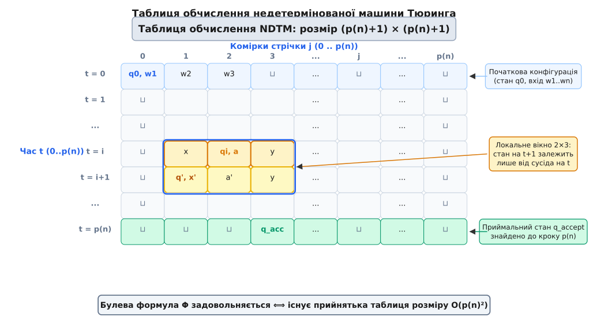
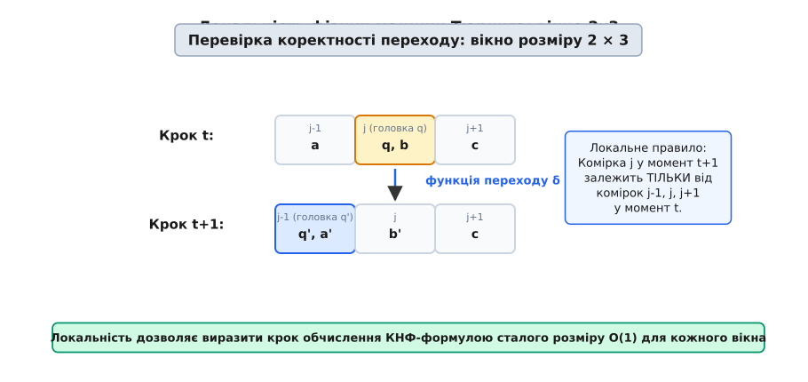
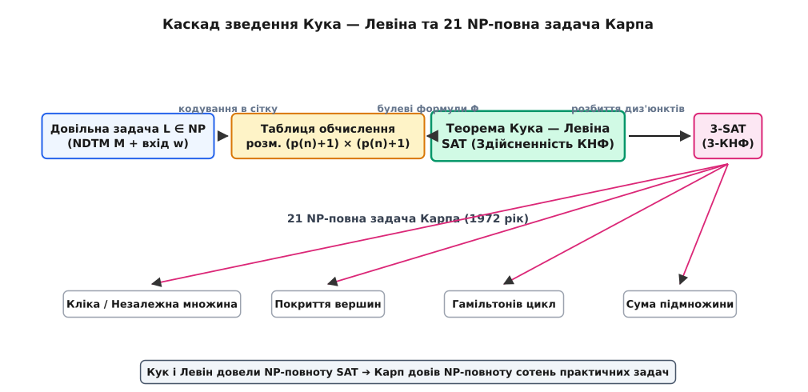

# Теорема Кука — Левіна: фундаментальний камінь NP-повноти

<preknowlist>
- [Асимптотична складність](topic:computability/asymptotic-complexity) — нотація O(…), поліномний і експоненційний час.
- [Машина Тюринга](topic:computability/turing-machine) — конфігурація (стан, стрічка, головка), недетермінований обчислювальний крок.
- [NP-повнота](topic:computability/np-completeness) — класи P і NP, поняття зведення (reduction) та універсальної найважчої задачі.
- [Здійсненність булевих формул (SAT)](topic:computability/boolean-satisfiability) — кон'юнктивна нормальна форма (КНФ), змінні та диз'юнкти.
</preknowlist>

До весни 1971 року теорія складності обчислень нагадувала карту океану без жодного материка: математики знали про існування тисяч задач у класі NP, перевірка відповідей для яких виконується за поліномний час, але не знали, чи існує серед них хоча б одна найбільш загальна, «універсальна» задача, розв'язання якої автоматично відкрило б шлях до розв'язання всіх інших. Кожна складна проблема — від розфарбування графів та пошуку маршруту комівояжера до розкладання чисел на множники та перевірки математичних доведень — здавалася ізольованим островом зі власною специфічною природою складників.

Фундаментальне відкриття, яке здійснили Стівен Кук та незалежно Леонід Левін, докорінно змінило цю картину. Вони довели, що **задача здійсненності булевих формул (SAT)** є **NP-повною**. Це означає, що будь-яка задача з класу NP за поліномний час може бути перекладена мовою здійсненності логічних формул. Якщо знайдеться алгоритм, що розв'язує SAT за поліномний час, то абсолютно кожна задача з класу NP також отримає поліномний розв'язок. Теорема Кука — Левіна не просто створила поняття NP-повноти, а й надала перший універсальний ключ, від якого розгорнулася вся сучасна теорія обчислювальної складності.

## Пошук універсальної задачі: концептуальний стрибок 1971 року

Щоб осягнути грандіозність теореми Кука — Левіна, варто уявити стан інформатики наприкінці 1960-х років. Дослідники вже усвідомлювали прірву між детермінованим поліномним часом (клас P) та недетермінованим поліномним часом (клас NP). Було зрозуміло, що для будь-якої задачі з NP можна побудувати недетерміновану [машину Тюринга](topic:computability/turing-machine), яка за поліномну кількість кроків `p(n)` вгадує та перевіряє розв'язок. Проте залишалося відкритим питання: чи не є клас NP лише випадковим конгломератом різнорідних проблем?

Гіпотеза про існування «найважчої» задачі здавалася малоймовірною, адже для цього одна конкретна математична структура мала б уміти кодувати абсолютно довільний алгоритм та довільні дані. Звичайна людська інтуїція підказувала, що алгоритм обходу графа не має нічого спільного з алгоритмом розкладання формул математичної логіки чи розподілу ресурсів у операційній системі. Стівен Кук у Торонто та Леонід Левін у Москві підійшли до цієї проблеми з несподіваного боку: замість шукати спільні риси між комбінаторними задачами, вони вирішили кодувати **сам процес обчислення абстрактної машини Тюринга** засобами математичної логіки.

Недетерміноване обчислення за своєю суттю є деревом можливих конфігурацій. На кожному кроці машина Тюринга може мати декілька альтернативних варіантів продовження обчислення, описаних її функцією переходу `δ`. Задача з класу NP полягає у питанні: чи існує у цьому величезному дереві бодай одна гілка (шлях від кореня до листка), яка приводить машину у приймальний стан `q_accept` за час, що не перевищує поліном `p(n)`?

[Історію двох незалежних відкриттів Кука та Левіна](topic:computability/cook-levin-theorem/hist-cook-levin.md) розкрито в окремому історичному нарисі: від знаменитого листа Курта Ґеделя до Джона фон Неймана 1956 року через праці Кука в Канаді до незалежного відкриття Левіна в Радянському Союзі під впливом школи Андрія Колмогорова.

Концептуальний стрибок полягав у тому, що фізичні закони роботи машини Тюринга — зчитування символу, зміна стану, перезапис та зсув головки — є абсолютно **локальними**. Вони не вимагають глобального огляду всієї пам'яті. Робота будь-якої машини Тюринга розгортається у часі й просторі за дуже простими локальними правилами: те, що станеться у комірці `j` у момент часу `t + 1`, повністю визначається лише тим, що відбувалося у трьох сусідніх комірках `j - 1`, `j` та `j + 1` у момент часу `t`. Звідси випливає, що весь траєкторійний слід недетермінованого обчислення можна записати у вигляді двовимірної таблиці, а правильність кожного кроку перевірити за допомогою логічних операторів «І», «АБО» та «НІ».

## Формулювання теореми та її концептуальний зміст

Формальне твердження теореми Кука — Левіна звучить так:

> **Теорема (Кук, 1971; Левін, 1973).** Задача здійсненності булевих формул (SAT) є NP-повною.

Щоб довести NP-повноту будь-якої задачі `L`, необхідно виконати дві суворі умови:
1. Довести, що сама задача належить до класу NP (`L ∈ NP`).
2. Довести, що кожна задача `A` з класу NP поліномно зводиться до `L` (`A ≤ₚ L`).

Перша частина для SAT виконується майже тривіально. Якщо нам дано булеву формулу `Φ` від `m` змінних та запропоновано набір істиннісних значень змінних (свідок або сертифікат), то перевірка полягає у звичайній обчислювальні оцінці значення формули. Для кожного диз'юнкта перевіряється, чи містить він хоча б один істинний літерал, а потім обчислюється кон'юнкція всіх диз'юнктів. Це виконується за поліномний (і навіть лінійний) час від довжини формули шляхом підстановки значень та обчислення логічного дерева.

Друга частина становить головну складність доведення. Нам потрібно побудувати єдиний універсальний алгоритм-перекладач `R`, який приймає на вхід опис довільної недетермінованої машини Тюринга `M`, що вирішує задачу `A` за поліномний час `p(n)`, та конкретний вхідний рядок `w` довжини `n`, і за поліномний час будує булеву формулу `Φ = R(M, w)` таку, що:

```
Формула Φ є здійсненною  ⇔  Машина M приймає рядок w за час ≤ p(n)
```

Це означає, що якби ми мали швидкий чорний ящик для розв'язання SAT, ми змогли б розв'язати абсолютно будь-яку задачу з NP: переклали б її в формулу `Φ` за поліномний час і віддали чорному ящику. Якщо чорний ящик каже «так, формула здійсненна», це означає, що вихідна задача має ствердну відповідь; якщо каже «ні», то ствердного розв'язку не існує.

Суттєво підкреслити, що зведення `R` будується за поліномний час від довжини входу `n`. Формула `Φ` не розгортає всі експоненційно численні гілки недетермінованого дерева обчислень. Замість цього формула `Φ` описує **простір можливих конфігурацій** та локальні правила переходів так, що будь-який істиннісний набір змінних, який задовольняє формулу `Φ`, однозначно задає одну конкретну прийнятну траєкторію машини Тюринга.

## Таблиця обчислення: недетерміноване обчислення як геометрична сітка

Ключовим геометричним конструктом у доведенні є **таблиця обчислення** (англ. *computation tableau*). Розглянемо недетерміновану [машину Тюринга](topic:computability/turing-machine) `M`, яка на вхідному рядку `w` довжини `n` здійснює обчислення за час, що не перевищує поліном `p(n)`.

Оскільки машина за один крок може перемістити головку зчитування не більше ніж на одну комірку вліво або вправо, за весь час обчислення `p(n)` вона здатиметься відвідати максимум `p(n)` комірок стрічки (якщо на початку головка стояла у комірці 0 і рухалася лише вправо). Усі інші комірки стрічки залишаться недоторканими.

Таким чином, усю історію обчислення можна повністю зафіксувати в квадратній сітці (таблиці) розміру `(p(n) + 1) × (p(n) + 1)`:

- Рядки таблиці відповідають моментам часу `t` від `0` до `p(n)`.
- Стовпчики таблиці відповідають позиціям на стрічці `j` від `0` до `p(n)`.


*Таблиця обчислення недетермінованої машини Тюринга. Кожен рядок від 0 до p(n) відповідає конфігурації машини в момент часу t. Локальне вікно розміру 2×3 зв'язує сусідні рядки.*

Кожна клітина таблиці `(t, j)` містить інформацію про повний стан комірки стрічки `j` у момент часу `t`. Ця інформація включає в себе:
1. Який саме символ алфавіту стрічки `σ ∈ Γ` записаний у даній комірці.
2. Чи розташована головка зчитування/запису машини саме над цією коміркою у момент `t`.
3. Якщо головка розташована над цією коміркою, то у якому саме внутрішньому стані `q ∈ Q` перебуває керівний пристрій машини.

Якщо машина `M` має хоча б один прийнятний шлях обчислення для рядка `w`, то існує таке заповнення клітин цієї таблиці, яке відповідає дійсному послідовному виконанню кроків `M` від початкового стану до приймального стану `q_accept`. Якщо такого шляху немає, то жодна дійсна таблиця обчислення не може бути побудована без порушення внутрішніх правил машини.

Завдання теореми Кука — Левіна полягає у тому, щоб виразити всі правила «правильності» цієї таблиці у вигляді булевої формули.

## Чотири стовпи логічного кодування: від стану машини до КНФ-формули

Щоб перетворити геометрію таблиці обчислення на булеву формулу `Φ`, вводиться скінченний набір булевих змінних для кожної клітини `(t, j)` таблиці:

1. Змінні вмісту стрічки: `x[t, j, σ] = 1` тоді й лише тоді, коли у момент `t` у комірці `j` записано символ `σ`.
2. Змінні стану та головки: `y[t, j, q] = 1` тоді й лише тоді, коли у момент `t` головка машини розташована над коміркою `j`, а машина перебуває у стані `q`.

Загальна кількість змінних у формулі становить `O(p(n)²)`, адже розмір алфавіту `Γ` та множини станів `Q` є сталими для фіксованої машини `M`, а кількість клітин таблиці дорівнює `(p(n) + 1)²`.

Підсумкова булева формула `Φ` конструюється як кон'юнкція чотирьох окремих формул-умов:

```
Φ = Φ_cell ∧ Φ_start ∧ Φ_accept ∧ Φ_move
```

Розглянемо детальний фізичний та математичний зміст кожної з цих чотирьох складових:

### 1. Формула однозначності клітин (`Φ_cell`)
Ця частина формули вимагає, щоб кожна клітина таблиці `(t, j)` у кожен момент часу містила **рівно один** символ алфавіту та не більше ніж один стан головки. Ми не можемо допустити фізичного абсурду, коли комірка стрічки одночасно містить і символ `0`, і символ `1`, або коли головка машини перебуває в двох місцях одночасно.

Для кожної клітини `(t, j)` формула `Φ_cell` будується з двох типів умов:
- **Умова існування символу:** принаймні один символ з алфавіту `Γ` записаний у клітинці `(t, j)` (диз'юнкція змінних `x[t, j, σ]` по всіх `σ ∈ Γ`).
- **Умова єдиності символу:** жодні два різні символи `σ` та `σ'` не можуть бути записані у клітинці одночасно (кон'юнкція диз'юнктів виду `¬x[t, j, σ] ∨ ¬x[t, j, σ']` для всіх пар `σ ≠ σ'`).
- Аналогічні умови будуються для змінних головки та стану `y[t, j, q]`.

### 2. Формула початкової конфігурації (`Φ_start`)
Ця частина фіксує стан таблиці у найперший момент часу `t = 0`. Вона жорстко прив'язує логічні змінні першого рядка таблиці до вхідного рядка `w`:
- Перші `n` комірок стрічки містять вхідні символи: `x[0, 0, w₁] = 1`, `x[0, 1, w₂] = 1`, ..., `x[0, n-1, wₙ] = 1`.
- Усі наступні комірки стрічки від `n` до `p(n)` містять символ порожнього місця (пробіл `⊔`): `x[0, j, ⊔] = 1` для всіх `j ≥ n`.
- Головка машини розташована у першій комірці `j = 0`, а керівний пристрій перебуває у початковому стані `q₀`: `y[0, 0, q₀] = 1`.
- Усі інші позиції `j > 0` не містять головки машини: `y[0, j, q] = 0` для всіх `j > 0` та всіх `q ∈ Q`.

### 3. Формула досягнення приймального стану (`Φ_accept`)
Ця умова вимагає, щоб обчислення завершилося успішно. Для цього принаймні в одному рядку таблиці `t` (де `0 ≤ t ≤ p(n)`) принаймні в одній комірці `j` машина перебувала у приймальному стані `q_accept`:

```
Φ_accept = ⋁_{t=0}^{p(n)} ⋁_{j=0}^{p(n)} y[t, j, q_accept]
```

Якщо машина `M` досягає стану `q_accept`, ця диз'юнкція приймає значення «істина». Якщо ж машина заблокувалася або потрапила у відхиляючий стан `q_reject`, формула `Φ_accept` стає хибною, що робить хибною і всю формулу `Φ`.

### 4. Формула коректності переходів (`Φ_move`)
Це найважливіша та найглибша частина доведення. Вона гарантує, що конфігурація у рядку `t + 1` одержується з конфігурації у рядку `t` згідно з детермінованими або недетермінованими правилами функції переходу `δ` машини `M`.

Головний секрет полягає у **локальності** машини Тюринга. Робота машини в комірці `j` у момент часу `t + 1` залежить виключно від вмісту трьох сусідніх комірок `j - 1`, `j` та `j + 1` у момент часу `t`. Якщо у момент `t` головка машини не перебувала поблизу комірки `j`, то вміст комірки `j` у момент `t + 1` повинен залишитися абсолютно незмінним!


*Локальна фізика машини Тюринга. Стан комірки j у момент t+1 визначається виключно трьома сусідніми комірками j-1, j, j+1 у момент t.*

Оскільки розмір вікна переходу становить `2 × 3` клітини (три комірки у рядку `t` та три комірки у рядку `t + 1`), кількість можливих заповнень такого вікна є обмеженою сталою величиною, що залежить лише від розмірів `Γ` та `Q`.

Для кожного вікна розміру `2 × 3` ми можемо скласти перелік усіх **допустимих конфігурацій** (які відповідають правильному застосуванню функції переходу `δ` або збереженню незмінності стрічки за відсутності головки). Усі недопустимі комбінації символів та станів забороняються відповідними диз'юнктами КНФ.

Оскільки кількість вікон у таблиці дорівнює `p(n) × p(n) = O(p(n)²)`, а для кожного вікна виражається КНФ-формула сталого розміру, загальний розмір формули `Φ_move` (і всієї формули `Φ`) є поліномним від `n`!

[Детальний математичний вивід змінних та диз'юнктів таблиці обчислення](topic:computability/cook-levin-theorem/math-cook-levin-tableau.md) наведено у математичній вставці, де крок за кроком виведено точні вирази для кожної з чотирьох складових та доведено поліномність загального розміру формули `O(p(n)²)`.

## Простеження виконання: конкретний приклад таблиці обчислення

Щоб остаточно закріпити геометрію побудови, простежимо невеликий приклад розгортання таблиці для спрощеної детермінованої машини Тюринга `M_ex`. Нехай алфавіт стрічки становить `Γ = {0, 1, ⊔}`, множина станів `Q = {q0, q1, q_acc}`, а вхідний рядок має вигляд `w = 01` (довжина `n = 2`).

Припустимо, що функція переходів `δ` задає такі правила:
- `δ(q0, 0) = (q1, 1, R)` (замінити `0` на `1`, перейти у стан `q1` і зсунути головку вправо)
- `δ(q1, 1) = (q_acc, 1, R)` (заставити `1` без змін, перейти у стан `q_acc` і зсунути головку вправо)

Оскільки машина виконує задовільне обчислення рівно за 2 кроки, обмеження часу дорівнює `p(n) = 2`. Сітка таблиці матиме розмір `3 × 3` (моменти `t ∈ {0, 1, 2}` та позиції `j ∈ {0, 1, 2}`).

Розглянемо значення змінних у кожному рядку таблиці:

```
Рядок t = 0 (початковий стан):
  - j = 0: y[0, 0, q0] = 1, x[0, 0, 0] = 1 (головка у позиції 0, стан q0, символ 0)
  - j = 1: x[0, 1, 1] = 1                  (символ 1)
  - j = 2: x[0, 2, ⊔] = 1                  (порожній символ ⊔)

Рядок t = 1 (після першого кроку):
  - j = 0: x[1, 0, 1] = 1                  (символ 0 перезаписано на 1)
  - j = 1: y[1, 1, q1] = 1, x[1, 1, 1] = 1 (головка зсунулася в комірку 1, стан q1)
  - j = 2: x[1, 2, ⊔] = 1                  (без змін)

Рядок t = 2 (після другого кроку):
  - j = 0: x[2, 0, 1] = 1                  (без змін)
  - j = 1: x[2, 1, 1] = 1                  (без змін)
  - j = 2: y[2, 2, q_acc] = 1, x[2, 2, ⊔] = 1 (головка в комірці 2, стан q_acc!)
```

Усі інші змінні `x[t, j, σ]` та `y[t, j, q]` для цього обчислення дорівнюють `0`. Побудована булева формула `Φ` приймає значення «істина» (1) тоді й лише тоді, коли вищевказані змінні встановлено в 1, адже це задовольняє всі диз'юнкти `Φ_cell`, `Φ_start`, `Φ_accept` та `Φ_move`.

## Зведення за Карпом проти зведення за Тюрингом

Під час аналізу історіографії теореми важливо розрізняти два різні види поліномних зведень, що використовувалися у первісних працях:

1. **Зведення за Тюрингом (Turing reduction, `A ≤ₜᵖ B`):** Задача `A` зводиться за Тюрингом до `B`, якщо існує програма, яка вирішує `A` за поліномний час, використовуючи оракул (чорний ящик) для задачі `B` довільну поліномну кількість разів. У своїй оригінальній статті 1971 року Стівен Кук застосував саме зведення за Тюрингом, довівши, що будь-яку NP-задачу можна розв'язати за допомогою оракула для SAT.
2. **Багато-однозначне зведення за Карпом (Karp / Many-one reduction, `A ≤☨ᵖ B` або `A ≤ₚ B`):** Задача `A` зводиться за Карпом до `B`, якщо існує поліномна функція `f`, яка будь-який вхід `x` для `A` перетворює на вхід `f(x)` для `B` так, що `x ∈ A ⇔ f(x) ∈ B`. 

Річард Карп у 1972 році та Леонід Левін у 1973 році використали саме багато-однозначні зведення. Для класів NP та NP-повноти саме зведення за Карпом є стандартним і більш витонченим, оскільки воно зберігає структуру рішень та зберігає замкненість класу щодо доповнення (на відміну від зведень Тюринга, які не розрізняють проблему та її доповнення `co-NP`).

## Структурні властивості КНФ та класична границя 2-SAT / 3-SAT

Пряма побудова теореми Кука — Левіна дає булеву формулу `Φ` у кон'юнктивній нормальній формі (КНФ), проте диз'юнкти (скобки з операторами «АБО») можуть містити довільну кількість літералів (залежно від кількості станів та символів алфавіту машини Тюринга).

Майже одразу постало важливе питання: чи залишається задача NP-повною, якщо обмежити довжину кожного диз'юнкта конкретним числом літералів?

Відповідь дала процедура зведення SAT до **3-SAT** (де кожен диз'юнкт містить рівно 3 літерали). Для цього будь-який довгий диз'юнкт виду `(l₁ ∨ l₂ ∨ l₃ ∨ ... ∨ lₖ)` з `k > 3` літералами розбивається на ланцюжок коротких трилітеральних диз'юнктів за допомогою додаткових логічних змінних `z₁, z₂, ...`:

```
(l₁ ∨ l₂ ∨ z₁) ∧ (¬z₁ ∨ l₃ ∨ z₂) ∧ (¬z₂ ∨ l₄ ∨ z₃) ∧ ... ∧ (¬zₖ₋₃ ∨ lₖ₋₁ ∨ lₖ)
```

Така трансформація (відома як редукція Цейтіна) займає поліномний час і зберігає здійсненність: вихідний диз'юнкт істинний тоді й лише тоді, коли існує набір значень додаткових змінних `z_i`, що робить істинним увесь ланцюжок коротких скобок. Якщо вихідний диз'юнкт мав `k` літералів, новий ланцюжок міститиме `k - 2` скобок та `k - 3` нових змінних. Оскільки загальна довжина формули була поліномною, підсумкова 3-КНФ формула також залишається поліномного розміру.

Проте, якщо зменшити кількість літералів у диз'юнкті з трьох до двох (задача **2-SAT**), відбувається фундаментальний фазовий перехід складникової природи: задача 2-SAT потрапляє до класу P!

Чому 2-SAT виявляється легкою? Диз'юнкт виду `(A ∨ B)` логічно еквівалентний двом імплікаціям: `¬A → B` та `¬B → A`. Це дозволяє побудувати так званий **граф імплікацій**, у якому вершинами є змінні та їх заперечення, а орієнтованими ребрами — логічні наслідки. Формула 2-SAT є здійсненною тоді й лише тоді, коли у графі імплікацій жодна змінна `x` не лежить у єдиній сильно зв'язаній компоненті зі своїм запереченням `¬x` (тобто не існує шляху від `x` до `¬x` та одночасно від `¬x` до `x`). Оскільки пошук сильно зв'язаних компонентів (алгоритм Тар'яна або Корасаджу) виконується за лінійний час `O(V + E)`, задача 2-SAT розв'язується миттєво.

Аналогічний фазовий перехід спостерігається і для **Horn-SAT** (де кожен диз'юнкт містить не більше одного позитивного літерала) — вона також належить до класу P і розв'язується каскадним поширенням одиниць (unit propagation). 

Таким чином, саме число **3** у задачі 3-SAT є найменшою межею, де виникає повна обчислювальна складність NP.

## Від 3-SAT до вибуху двадцяти однієї задачі Карпа

У 1972 році Річард Карп опублікував свою епохальну працю *«Reducibility Among Combinatorial Problems»*, у якій скористався NP-повнотою 3-SAT як фундаментальним важелем. Завдяки транзитивності поліномного зведення (`A ≤ₚ B` і `B ≤ₚ C` ⇒ `A ≤ₚ C`), Карпу більше не треба було будувати важкі таблиці обчислення машин Тюринга. Йому було достатньо звести 3-SAT до інших класичних комбінаторних задач.


*Каскад зведення Кука — Левіна. Зведення від довільної NP-задачі до SAT відкрило шлях для Річарда Карпа довести NP-повноту 21 класичної комбінаторної задачі.*

Карп застосував витончені комбінаторні конструкції («гаджети»), щоб перекласти трилітеральні диз'юнкти 3-SAT мовою графів, множин та чисел:

1. **3-SAT ≤ₚ Незалежна множина (Independent Set):** Для кожного диз'юнкта створюється трикутник із трьох вершин, що відповідають літералам. Додатково ребрами з'єднуються суперечливі літерали (наприклад, `x` та `¬x`). Пошук незалежної множини розміру, що дорівнює кількості диз'юнктів, еквівалентний вибору по одному істинному літералу у кожному диз'юнкті без логічних суперечностей.
2. **Незалежна множина ≡ Кліка (Clique) ≡ Покриття вершин (Vertex Cover):** Ці три задачі перетворюються одна в одну майже механічно за допомогою доповнення графа.
3. **3-SAT ≤ₚ 3D Matching ≤ₚ Гамільтонів цикл ≤ₚ Маршрут комівояжера (TSP):** Двовимірні та тривимірні структури дозволяють кодувати вибір змінних у вигляді обходу вершин графа.
4. **3-SAT ≤ₚ Сума підмножини (Subset Sum):** Числа кодуються у десятковій або двійковій системі так, щоб розряди чисел відповідали змінним та диз'юнктам.

Сьогодні відомо понад десятки тисяч NP-повних задач у комп'ютерній біології (вирівнювання послідовностей ДНК), логістиці, квантовій фізиці, компіляторах (оптимальне призначення регістрів) та криптографії. Усі вони зв'язані в єдину мережу: якщо завтра для бодай однієї з них буде знайдено поліномний алгоритм, усі інші також будуть розв'язані за поліномний час.

Якщо ж, як вважає більшість дослідників, `P ≠ NP`, то згідно з теоремою Леднера (Ladner's Theorem) у класі NP існують так звані **NP-проміжні задачі** (NP-intermediate) — задачі, які не лежать у P, але й не є NP-повними. Довгий час головними кандидатами на цю роль були ізоморфізм графів та розкладання чисел на множники (факторизація).

## Експоненційна гіпотеза часової складності (ETH)

Хоча гіпотеза `P ≠ NP` стверджує, що для SAT не існує поліномного алгоритму, вона залишає відкритим питання про те, **наскільки саме повільним** мусить бути точний розв'язок.

Для уточнення нижніх меж складності Рассел Імпальяццо та Рамамохан Патрі у 2001 році висунули **Експоненційну гіпотезу часової складності (ETH — Exponential Time Hypothesis)**. Вона стверджує, що задачу 3-SAT неможливо розв'язати за субекспоненційний час `2^{o(n)}` (де `n` — кількість змінних).

З ETH випливає низка суворих нижніх меж для багатьох NP-повних задач:
- Задачу про кліку чи незалежну множину на графі з `V` вершинами неможливо розв'язати за час `2^{o(V)}`.
- Задачу про найкоротший шлях комівояжера неможливо розв'язати за час `2^{o(V)}`.

Ще сильніша версія — **SETH (Strong Exponential Time Hypothesis)** — припускає, що для `k`-SAT при збільшенні `k` необхідний час розв'язку прямує до межі `2ⁿ`.

[Практичний ґенератор та перевіряч КНФ-формул Кука — Левіна](topic:computability/cook-levin-theorem/proj-sat-verifier.md) містить розбір реалізованого коду мовами C та C++, який будує КНФ-формулу для спрощеної машини Тюринга та здійснює автоматичну перевірку свідків.

## Сучасне значення: від теоретичної мети до SAT-сольверів у промисловості

Парадокс теореми Кука — Левіна полягає у тому, що довівши теоретичну експоненційну важкість задачі SAT у найгіршому випадку (worst-case complexity), вона водночас перетворила SAT на головний інструмент практичного розв'язання складних комбінаторних проблем.

У 1970-х роках NP-повноту сприймали як вирок: якщо задача NP-повна, інженер повинен опустити руки й відмовитися від пошуку точного розв'язку, переходячи до наближених (евристичних) алгоритмів. Проте наприкінці 1990-х років стався потужний інженерний прорив у галузі **SAT-сольверів** (програм розв'язання SAT, таких як MiniSat, Glucose, Z3, CaDiCaL).

Сучасні SAT-сольвери використовують архітектуру CDCL (*Conflict-Driven Clause Learning* — навчання диз'юнктів, кероване конфліктами). Замість сліпого перебору значень змінних, CDCL-сольвер виконує такі кроки:
- **Поширення одиниць (Unit Propagation):** якщо у диз'юнкті всі літерали, крім одного, хибні, єдиний невідомий літерал мусить стати істинним. Алгоритм двох спостережуваних літералів (two-watched literals) дозволяє виконувати це за малий час.
- **Аналіз конфліктів та виведення нових диз'юнктів:** потрапляючи у глухий кут (суперечність), сольвер будує граф конфлікту, виводить новий диз'юнкт, який описує причину помилки, і додає його до бази знань, щоб ніколи більше не повторювати цю комбінацію.
- **Нехронологічне повернення (Backjumping):** сольвер повертається не на один крок назад, а одразу на кілька рівнів вгору — до першопричини конфлікту.
- **Евристики вибору змінних (VSIDS):** надають перевагу змінним, які найчастіше беруть участь у свіжих конфліктах.

Завдяки цим механізмам сучасні SAT-сольвери здатні за лічені секунди розв'язувати промислові формули, що містять мільйони змінних та десяткові мільйони диз'юнктів!

Сьогодні промисловість використовує теорему Кука — Левіна у зворотному напрямку: замість того щоб доводити складність задачі, інженери **зводять свої практичні проблеми до SAT**:
- **Формальна верифікація мікропроцесорів:** перевірка, чи не містить схема критичних помилок при будь-яких вхідних сигналах (Intel, AMD, ARM, Apple).
- **Синтез системної логіки та автоконфігурація:** розв'язання залежностей у пакетах ОС (Debian/Apt, Cargo, npm, Spack).
- **Автоматична генерація тестів та фазинг:** пошук вразливостей у програмному забезпеченні шляхом символьного виконання (KLEE, angr).
- **Планування та логістика:** складання розкладів авіарейсів, залізничного руху та розподілу технологічних процесів у базах даних.

> 🔧 **Навіщо це.** Теорема Кука — Левіна дає інженеру два найважливіші практичні орієнтири. По-перше, вона вчить розпізнавати NP-повну сутність задачі: якщо ваша проблема зводиться до SAT чи 3-SAT, не витрачайте місяці на пошук алгоритму точного поліномного розв'язку "з нуля" — його майже напевно не існує. По-перше, вона надає універсальний метод розв'язання: замість писати власний повільний перебір, сформулюйте обмеження вашої задачі у вигляді КНФ-формули й віддайте її сучасному промисловому SAT-сольверу (Z3 або MiniSat). У 95% практичних випадків це дасть оптимізоване рішення за мілісекунди.
