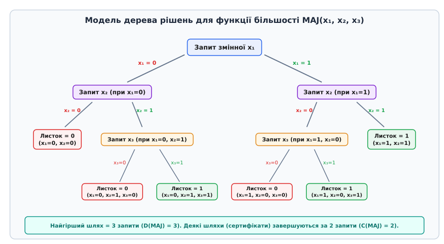
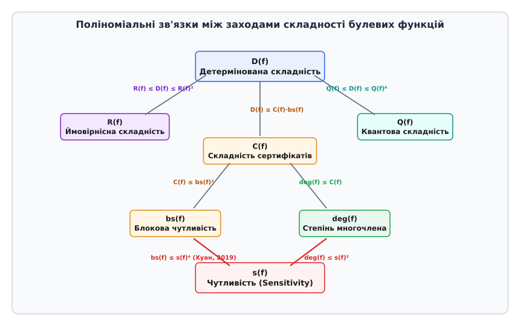
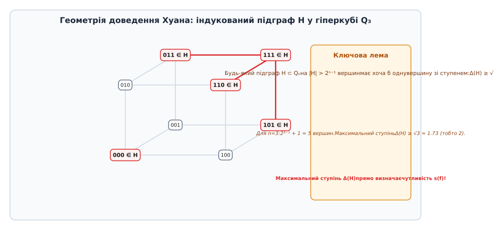
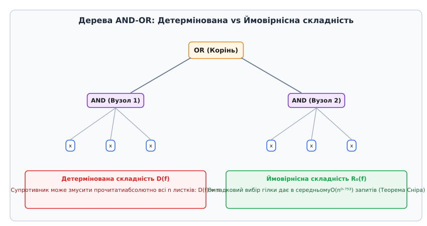

# Складність дерев рішень

<preknowlist>
- [Асимптотична складність (нотація O великого)](topic:computability/asymptotic-complexity) — базові поняття верхніх O та нижніх Ω меж складності алгоритмів.
- [Теорема Кука — Левіна та булева здійсненність (SAT)](topic:computability/cook-levin-theorem) — поняття булевих змінних, кодування даних бітовими векторами та класів складності.
- [Нижня межа сортування порівняннями](topic:computability/comparison-sort-lower-bound) — інформаційний підхід до розгалуження та дерева прийняття рішень у комбінаторних задачах.
</preknowlist>

Уявімо високопродуктивний сервіс авторизації банківських транзакцій, який перевіряє право підпису клієнта на основі масиву із 64 незалежних цифрових прапорців безпеки. Кожен запит до віддаленої бази даних або захищеного чипа HSM займає 10 мікросекунд і коштує реальних обчислювальних ресурсів. Якщо алгоритм змушений послідовно зчитувати абсолютно всі 64 біти вхідного вектора для кожного переказу, середня затримка системи досягає 640 мікросекунд, що створює пляшкове горло під час обробки тисяч операцій на секунду.

Аналогічна проблема виникає у мережевих маршрутизаторах під час фільтрації пакетів за правилами брандмауера, у системах символьного виконання програм (Symbolic Execution), де кожен запит до оракула змушує запускати важкий SMT-сольвер, та у криптографічних протоколах із нульовим розголошенням. Усі ці системи стикаються з одним фундаментальним обмеженням: **вартістю отримання інформації**.

Чи можна побудувати алгоритм перевірки так, щоб на основі результатів перших кількох запитів (наприклад, трьох або чотирьох бітів) достроково ухвалити безпомилкове рішення й не зчитувати решту входу? Яка мінімальна кількість бітових запитів гарантує обчислення будь-якої заданої булевої функції у найгіршому випадку?

Відповідь на ці запитання надає **складність дерев рішень (Decision Tree Complexity)** — один із найфундаментальніших розділів теорії складності обчислень, відомий також як **опитувальна складність (Query Complexity)**. Ця модель оцінює складність алгоритму не за кількістю арифметичних операцій чи розміром оперативної пам'яті, а виключно за **кількістю звернень до вхідних даних**.

---

## Інформаційна модель та відмінність від класичних моделей складності

У класичній теорії складності обчислень (класи P, NP, PSPACE) головною обчислювальною одиницею є крок машини Тюрінга або кількість вентилів у логічній схемі. Проте у цих моделях доведення безумовних нижніх меж складності стикається із жорстокими теоретичними бар'єрами (як-от бар'єр природних доведень Разборова — Рудіча).

Модель дерев рішень усуває цю проблему шляхом **ізоляції інформаційного бар'єра**. Ми припускаємо, що алгоритм має необмежену обчислювальну потужність для обробки вже отриманих даних, а єдиним обмеженим ресурсом є доступ до чорної скриньки (оракула). Це дозволяє отримувати абсолютні, математично непохитні нижні межі складності без жодних незадоведених гіпотез на зразок `P ≠ NP`.

Вхідний об'єкт подається у вигляді бітового вектора `x = (x₁, x₂, ..., x♁) ∈ {0, 1}ⁿ`. Алгоритм не знає значень бітів заздалегідь: вони заховані всередині інформаційного оракула. Єдина доступна операція — це поставити оракулу запит: «Яке значення має біт `x_i`?». Оракул миттєво повертає `0` або `1`.

Мета алгоритму — обчислити значення фіксованої булевої функції `f: {0, 1}ⁿ → {0, 1}`, зробивши якнайменше запитів. При цьому алгоритм є детермінованим: кожний наступний запит адаптивно обирається на основі відповідей, отриманих на попередніх кроках.

**Детерміноване дерево рішень `T`** для функції `f` — це двійкове дерево, у якому:
1. Кожен **внутрішній вузол** позначений індексом змінної `x_i` (`1 ≤ i ≤ n`), про значення якої запитує алгоритм.
2. З кожного внутрішнього вузла виходять **два ребра**: ліве відповідає відповіді `x_i = 0`, праве — `x_i = 1`.
3. Кожен **листок** позначений остаточним результатом обчислення: `0` або `1`.
4. Для будь-якого входу `x ∈ {0, 1}ⁿ` шлях від кореня до листка однозначно визначає послідовність запитів та підсумковий вихід `f(x)`.

Вартістю обчислення дерева `T` на конкретному вході `x` (позначається `cost(T, x)`) є кількість запитів на шляху від кореня до відповідного листка.

```
cost(T, x) = довжина шляху від кореня до листка для входу x
```

**Детермінована складність дерева рішень `D(f)`** визначається як найгірша вартість обчислення серед усіх можливих входів для найоптимальнішого дерева `T`:

```
D(f) = min_T max_{x ∈ {0, 1}ⁿ} cost(T, x)
```

Геометрично `D(f)` дорівнює **найменшій можливій висоті (глибині)** двійкового дерева рішень, яке тотожно обчислює функцію `f`.



*Модель дерева рішень для функції більшості MAJ(x₁, x₂, x₃). Внутрішні вузли перевіряють значення бітів, ребра відповідають відповідям 0 чи 1. Найдовший шлях від кореня до листка дорівнює 3, тому детермінована складність D(MAJ) = 3.*

### Адаптивні та Неадаптивні дерева рішень

Важливо розрізняти два класи алгоритмів запитів:
- **Адаптивні дерева рішень:** алгоритм обирає індекс наступного біта `x_i` на основі відповідей на всі попередні запити. Повний графовий вигляд алгоритму є саме двійковим деревом.
- **Неадаптивні дерева рішень:** алгоритм обирає фіксовану множину бітів `S ⊆ {1, ..., n}` заздалегідь, зчитує їх одночасно, після чого обчислює результат.

Для багатьох симетричних функцій неадаптивна складність є набагато вищою за адаптивну. Загалом, можливість адаптивного вибору наступного біта забезпечує експоненціальну перевагу в глибині дерев рішень для складних функцій адресації.

### Докладний аналіз базових класів булевих функцій

Щоб відчути внутрішні механізми моделі, розглянемо кілька репрезентативних класів булевих функцій та обчислимо їхню детерміновану складність:

1. **Функція Кон'юнкції `AND(x₁, ..., x♁)`:**
   Функція дорівнює `1` тоді й лише тоді, коли всі `x_i = 1`. Якщо алгоритм перевіряє біти один за одним і бачить одиниці, він змушений перевірити абсолютно всі `n` бітів. Якщо хоча б один біт дорівнює `0`, обчислення можна зупинити. Проте на вході із суцільних одиниць `(1, 1, ..., 1)` алгоритм виконує `n` запитів. Отже, `D(AND) = n`.

2. **Функція Диз'юнкції `OR(x₁, ..., x♁)`:**
   Функція дорівнює `0` тоді й лише тоді, коли всі біти дорівнюють `0`. На вході із суцільних нулів `(0, 0, ..., 0)` алгоритм змушений прочитати всі `n` бітів, перш ніж переконатися, що жодної одиниці немає. Отже, `D(OR) = n`.

3. **Функція Паритету `PARITY(x₁, ..., x♁)`:**
   Повертає `1`, якщо кількість одиниць у вході непарна. Зміна будь-якого біта `x_i` змінює паритет усієї суми. Оскільки жоден біт не є зайвим, алгоритм не здатний визначити результат, не прочитавши останній невизначений біт. Для будь-якого алгоритму та будь-якої послідовності запитів супротивник може утримувати паритет неозначеним до `n`-го запиту. Отже, `D(PARITY) = n`.

4. **Функція Більшості `MAJORITY(x₁, ..., x_n)` (для непарного n):**
   Повертає `1`, якщо принаймні `(n + 1) / 2` бітів дорівнюють `1`. Навіть якщо перші `(n - 1) / 2` бітів дорівнюють `1`, а наступні `(n - 1) / 2` бітів дорівнюють `0`, алгоритм змушений прочитати останній біт для встановлення переваги. Звідси `D(MAJORITY) = n`.

5. **Функція Адресації / Індексації `INDEX(a₁, ..., a_k, d₀, ..., d_{2ᵏ-1})`:**
   Вхід складається з `k` адресних бітів `a` та `2ᵏ` бітів даних `d`. Загальна довжина входу `n = k + 2ᵏ`. Функція повертає біт даних `d[a]`, на який вказує адреса `a`. Оптимальне дерево рішень спочатку зчитує `k` адресних бітів, обчислює ціле число `a`, після чого робить один підсумковий запит до біта `d[a]`. Загальна кількість запитів дорівнює `k + 1`. Це демонструє експоненціальний розрив між довжиною входу та необхідною кількістю запитів: `D(INDEX) = O(log n)`.

6. **Функція племен `TRIBES_{k, w}(x)`:**
   Визначається як диз'юнкція `k` незалежних кон'юнкцій (племен) розміром `w` бітів кожна:
   ```
   TRIBES_{k, w}(x) = (x_{1,1} ∧ ... ∧ x_{1,w}) ∨ ... ∨ (x_{k,1} ∧ ... ∧ x_{k,w})
   ```
   Загальна кількість змінних `n = k · w`. Для досягнення балансу обирають `w ≈ log₂ k`. Функція `TRIBES` має багату комбінаторну структуру і використовується як контрприклад у багаторазових розділах теорії складності.

---

## Ієрархія комбінаторних та алгебраїчних заходів складності

Детермінована складність `D(f)` — лише один із багатьох способів виміряти інформаційну ємність булевої функції. Для глибокого розуміння структури функцій теорія алгоритмів використовує ієрархію додаткових комбінаторних та алгебраїчних параметрів.

### 1. Складність сертифікатів C(f)

Сертифікатом (або підтвердженням) для входу `x` називається часткова підстановка зафіксованих бітів `S ⊆ {1, ..., n}`, яка гарантує значення функції `f(x)` незалежно від решти змінних.

- **`0`-сертифікат `C₀(f, x)`:** мінімальна кількість бітів, зафіксувавши які, ми гарантуємо `f = 0`.
- **`1`-сертифікат `C₁(f, x)`:** мінімальна кількість бітів, зафіксувавши які, ми гарантуємо `f = 1`.

Складність сертифікатів функції `C(f)` визначається як максимальний розмір мінімального сертифіката серед усіх входів:

```
C(f) = max_{x ∈ {0, 1}ⁿ} C(f, x)
```

Для функції `AND(x₁, ..., x♁)`:
- Щоб підтвердити результат `f = 0`, достатньо показати один біт `x_i = 0`. Тому `C₀(AND) = 1`.
- Щоб підтвердити результат `f = 1`, необхідно зафіксувати всі `n` бітів `x_i = 1`. Тому `C₁(AND) = n`.
- Загальна складність сертифікатів `C(AND) = max(1, n) = n`.

Геометричний зміст сертифіката полягає у тому, що кожен сертифікат розміру `k` відповідає подпростору (грані гіперкуба) розмірності `n - k`, на якому функція є константою.

### 2. Чутливість s(f) та Блокова чутливість bs(f)

Чутливість описує локальну нестабільність функції при зміні вхідних бітів.

- **Проста чутливість `s(f, x)`** на вході `x` — це кількість окремих індексів `i ∈ {1, ..., n}`, для яких `f(x ⊕ e_i) ≠ f(x)` (де `e_i` — вектор із єдиною одиницею в i-й позиції). Максимальна чутливість за всіма входами становить `s(f) = max_x s(f, x)`.
- **Блокова чутливість `bs(f, x)`** на вході `x` — це максимальна кількість взаємно неперетинних підмножин (блоків) `B₁, B₂, ..., B_k ⊆ {1, ..., n}`, зміна бітів у кожному з яких поодинці змінює значення функції: `f(x ⊕ e_{B_j}) ≠ f(x)`. Загальна блокова чутливість `bs(f) = max_x bs(f, x)`.

Звичайне інвертування одного біта відповідає блоку розміру 1. Тому для будь-якої функції виконується очевидна нерівність:

```
s(f) ≤ bs(f) ≤ C(f) ≤ D(f) ≤ n
```

Девід Рубінштейн у 1995 році побудував приклад функції, для якої блокова чутливість була квадратично більшою за звичайну чутливість. Функція Рубінштейна розбиває біти на блоки й перевіряє наявність спеціальних патернів, досягаючи `bs(f) = (1/2) · s(f)²`.

Проте для окремих класів функцій ці заходи збігаються. Наприклад, для **монотонних булевих функцій** (де інвертування `0 → 1` ніколи не змінює значення з `1` на `0`) проста чутливість тотожно дорівнює блоковій чутливості та складності сертифікатів:

```
s(f) = bs(f) = C(f)   (для всіх монотонних функцій f)
```

### 3. Алгебраїчний степінь deg(f) та апроксимаційний степінь

Будь-яку булеву функцію `f: {0, 1}ⁿ → {0, 1}` можна подати у вигляді єдиного мультилінійного многочлена від `n` змінних над дійсними числами `ℝ`:

```
P(x₁, ..., x♁) = ∑_{S ⊆ {1, ..., n}} c_S ∏_{i ∈ S} x_i
```

**Степенем `deg(f)`** називається максимальний розмір множини `|S|`, для якої коефіцієнт `c_S ≠ 0`.
Наприклад, для `AND(x₁, x₂)` многочлен дорівнює `x₁ · x₂`, тому `deg(AND) = 2`. Для `PARITY(x₁, x₂)` многочлен дорівнює `x₁ + x₂ - 2x₁x₂`, тому `deg(PARITY) = 2`.

Окрім точного степеня, у квантовій інформатиці та теорії наближень використовують **апроксимаційний степінь `deg̃(f)`** — найменший степінь дійснозначного многочлена `Q(x)`, який наближає `f(x)` з точністю до `1/3` на всіх вхідних точках:

```
|Q(x) - f(x)| ≤ 1/3   для всіх x ∈ {0, 1}ⁿ
```

Апроксимаційний степінь тісно пов'язаний із квантовою складністю: `Q(f) ≥ (1/2) · deg̃(f)`.

### 4. Фур'є-аналіз булевих функцій

Кожну булеву функцію можна розкласти за ортонормованим базисом функцій Уолша — Адамара `χ_S(x) = (-1)^{∑_{i ∈ S} x_i}`:

```
f(x) = ∑_{S ⊆ {1, ..., n}} f̂(S) · χ_S(x)
```
де `f̂(S) = E_x [f(x) · χ_S(x)]` — коефіцієнти Фур'є.

Фур'є-степінь дорівнює максимальному розміру `|S|` з ненульовим коефіцієнтом `f̂(S)`, що алгебраїчно відповідає точному степеню `deg(f)` після зміни базису з `{0, 1}` на `{-1, 1}`. Фур'є-аналіз надає потужний інструментарій для оцінки ймовірнісної складності та середньої чутливості.

### 5. Композиція булевих функцій та тензорний добуток

Важливим алгоритмічним інструментом побудови складних булевих функцій із заданими властивостями є **композиція (блокова заміна) `(f ∘ g)`**. Якщо `f: {0, 1}ᵏ → {0, 1}` та `g: {0, 1}ᵐ → {0, 1}`, то композиція `f ∘ g` є функцією від `k · m` змінних, де замість кожного біта `x_i` у функцію `f` підставляється вихід окремого екземпляра функції `g`.

Завдяки мультиплікативності детермінованої складності `D(f ∘ g) = D(f) · D(g)` та простої чутливості `s(f ∘ g) = s(f) · s(g)`, композиція дозволяє будувати фрактальні сімейства функцій. Наприклад, композиція функції Рубінштейна сама із собою дозволяє систематично підсилювати розриви між заходами складності та будувати граничні приклади для теоретичних оцінок.



*Карта поліноміальних нерівностей між основними заходами складності булевих функцій. Стрілки вказують обмеження зверху, підписи містять математичні степені зв'язку.*

Довгий час залишалося відкритим запитання: чи всі ці заходи є поліноміально еквівалентною групою? Докладний математичний апарат спектрального доведення та точні формули обмежень виведено у вставці [Докладне математичне виведення теореми Хуана та поліноміальних обмежень](topic:computability/decision-tree-complexity/math-huang-sensitivity-proof.md).

---

## Евазивні функції та геометрична структура гіперкуба

Серед усього різноманіття булевих функцій особливе місце посідають **евазивні функції (Evasive Functions)**.

> **Означення:** Булева функція `f: {0, 1}ⁿ → {0, 1}` називається **евазивною**, якщо її детермінована складність досягає теоретичного максимуму: `D(f) = n`.

Це означає, що для будь-якого детермінованого алгоритму існує такий «зловмисний» вхід (супротивник), який змушує алгоритм прочитати абсолютно всі `n` бітів входу перш ніж назвати відповідь.

Евазивними є такі класичні функції:
- Усі симетричні функції, значення яких залежить від кількості одиниць у вході, крім констант (зокрема `AND`, `OR`, `PARITY`, `MAJORITY`);
- Практично всі монотонні графічні властивості (наприклад, перевірка зв'язності графа чи наявності гамільтонового циклу за його матрицею суміжності — знаменита **гіпотеза Рівеста — Вюіймена**).

Гіпотеза Рівеста — Вюіймена (1975) стверджувала, що будь-яка нетривіальна монотонна властивість графа на `v` вершинах (де входом є `n = v(v-1)/2` бітів матриці суміжності) є евазивною. У 1984 році Кан, Сакс та Стертевант довели цю гіпотезу для випадку, коли кількість вершин `v` є степенем простого числа, використавши топологічні методи непорушної точки на симпліційних комплексах.

### Геометрична інтерпретація через булевий гіперкуб Q♁

Множину всіх вхідних векторів `{0, 1}ⁿ` можна уявити як вершини n-мірного одиничного гіперкуба `Q♁`. Дві вершини з'єднані ребром тоді й лише тоді, коли вони відрізняються в одному біті.

Булева функція `f` розбиває `2ⁿ` вершин гіперкуба на дві множини: підграф `H = {x : f(x) = 1}` та підграф `H̄ = {x : f(x) = 0}`.

Чутливість функції на вході `x` дорівнює кількості ребер гіперкуба, що з'єднують `x` із вершинами протилежного кольору.



*Геометричне представлення підграфа H у 3-вимірному гіперкубі Q₃. Червоні ребра з'єднують вершини підграфа H, ступінь кожної вершини прямо визначає нижню межу чутливості.*

У 2019 році Хао Хуан застосував теорему Коші про переплетення власних значень знакової матриці суміжності гіперкуба й довів, що будь-який підграф `H ⊂ Q♁` розміру більше ніж `2ⁿ⁻¹` містить вершину зі ступенем принаймні `√n`. Це дало фундаментальне співвідношення `s(f) ≥ √(deg(f))`.

Детальну хронологію висунення цієї гіпотези та чвертьвікові пошуки її доведення висвітлено у вставці [Історія висунення та доведення Гіпотези про чутливість (1994–2019)](topic:computability/decision-tree-complexity/hist-sensitivity-conjecture.md).

---

## Ймовірнісні та квантові дерева рішень

Якщо детермінований алгоритм змушений перевіряти всі біти в найгіршому випадку, чи може використання випадкових чисел (монети) або квантової суперпозиції істотно прискорити обчислення?

### 1. Ймовірнісна складність R(f) та мінімаксний принцип Яо

У ймовірнісній моделі дерев рішень алгоритм має доступ до джерела випадкових бітів і обирає наступну змінну для запиту відповідно до певного ймовірнісного розподілу.

Існують дві основні модифікації ймовірнісних дерев:
- **Лас-Вегас `R₀(f)`:** алгоритм завжди дає 100% точну відповідь, але час обчислення (кількість запитів) є випадковою величиною. `R₀(f)` дорівнює мінімальному середньому числу запитів у найгіршому випадку за всіма входами.
- **Монте-Карло `R_ε(f)`:** алгоритм гарантує виконання не більше ніж `k` запитів, але може помилятися з ймовірністю `ε ≤ 1/3`.

Для аналізу нижніх меж ймовірнісної складності використовують **Мінімаксний принцип Яо (Yao's Minimax Principle)**, який базується на теоремі фон Неймана про матричні ігри із нульовою сумою:

```
R₀(f) = max_{D} min_{T} E_{x ~ D} [cost(T, x)]
```

Мінімаксний принцип стверджує, що для оцінки складності ймовірнісного алгоритму достатньо сформулювати підступний ймовірнісний розподіл вхідних даних `D` і довести, що **жодне детерміноване дерево** не здатне обчислити функцію на цьому розподілі швидше ніж за `k` запитів у середньому.

### 2. Стратегія супротивника (Adversary Method)

Уважно побудований супротивник (Adversary) не фіксує вхід на початку, а динамічно конструює відповіді під час виконання алгоритму. Супротивник підтримує множину вхідних векторів `S`, для яких функція дає значення `1`, та множину `S'`, де значення дорівнює `0`.

Коли алгоритм запитує біт `x_i`, супротивник обирає таку відповідь `0` або `1`, яка залишає максимальну кількість сумісних входів у бох множинах, змушуючи алгоритм робити все нові й нові запити. Метод супротивника Амбайніса дозволяє отримувати нижні межі не лише для класичних, а й для квантових дерев рішень.

### 3. Квантова складність за запитами Q(f) та Амплітудне посилення

У квантових деревах рішень алгоритм виконує запити до оракула у стані квантової суперпозиції. Замість зчитування одного класичного біта `x_i`, квантовий оракул здійснює унітарне перетворення `O_x |i, b, z⟩ = |i, b ⊕ x_i, z⟩`.

Початковий стан квантового регістра готується як рівномірна суперпозиція:
```
|ψ₀⟩ = (1 / √2ⁿ) ∑_{x ∈ {0, 1}ⁿ} |x⟩
```
Алгоритм почергово застосовує квантовий оракул `O_x` та незалежні від входу унітарні оператори `U_1, U_2, ..., U_T`. Після `T` запитів вимірюється кінцевий стан регістра.

Найвідомішим прикладом квантового прискорення за запитами є **Алгоритм Гровера** для функції `OR(x₁, ..., x♁)` (пошук неупорядкованого елемента):
- Детермінована складність: `D(OR) = n`.
- Квантова складність: `Q(OR) = Θ(√n)`.

Квантовий алгоритм досягає квадратного прискорення порівняно з класичним оракулом! Іншим видатним прикладом є **Алгоритм Бернштейна — Вазірані**, який знаходить прихований бітовий вектор `s` для лінійної функції `f(x) = s · x (mod 2)` за `1` квантовий запит, тоді як детермінований алгоритм вимагає `D(f) = n` запитів.

Слід підкреслити фундаментальне розрізнення між **тотальними** та **частковими (Promise)** булевими функціями:
- **Для тотальних булевих функцій** квантове прискорення може бути щонайбільше поліноміальним (не більше 6-го степеня: `D(f) ≤ O(Q(f)⁶)`). Експоненціального квантового прискорення для повністю визначених тотальних функцій не існує!
- **Для часткових булевих функцій (Promise Problems)** (наприклад, у задачах Дойча — Йожі, Саймона та Шора) квантове прискорення може бути **експоненціальним**: алгоритм Саймона виконує `Q(Simon) = O(n)` квантових запитів проти класичних `D(Simon) = Ω(2ⁿ/²)`.

### Перевага ймовірнісних дерев: Дерева AND-OR

Розглянемо повне двійкове дерево висоти `h` з `n = 2ʰ` листками, у якому рівні чергуються між логічними операціями `AND` та `OR`.



*Оцінка складності обчислення дерев AND-OR. Детермінований алгоритм перевіряє всі n листків D(f) = n. Ймовірнісний алгоритм Сніра обирає гілку випадково й обчислює результат за О(n⁰ˑ⁷⁵³) запитів.*

1. **Детермінована складність:** Для будь-якого детермінованого алгоритму супротивник може підібрати вхідні біти так, що алгоритм змушений буде прочитати абсолютно всі `n` листків: `D(AND-OR) = n`.
2. **Ймовірнісна складність (Теорема Сніра / Соловей — Сака):**
   Якщо у вузлі `OR` алгоритм випадковим чином із ймовірністю `1/2` обирає ліве чи праве піддерево для першої перевірки, то з ймовірністю `1/2` він одразу знайде відповідь `1` і взагалі НЕ буде читати друге піддерево!
   Рівняння середньої кількості запитів `R(h)` має вигляд:
   ```
   R(h) = R(h-1) + (1/2) · R(h-1) = (3/2) · R(h-1)
   ```
   Розв'язуючи цю рекурентність для `n = 2ʰ` листків, отримуємо:
   ```
   R₀(AND-OR) = Θ(3ʰ/²) = Θ((2ʰ)^{log₂ 3 / 2}) = Θ(n^{log₂ 3 / 2}) ≈ Θ(n⁰ˑ⁷⁵³)
   ```
   Ймовірнісний алгоритм працює строго швидше за будь-який детермінований алгоритм (`O(n⁰ˑ⁷⁵³)` проти `O(n)`).

---

## Побудова та апроксимація дерев рішень у машинному навчанні

У практичному машинному навчанні та аналізі даних (алгоритми ID3, C4.5, CART) дерево рішень будується на основі навчальної вибірки для класифікації або регресії. Проте побудова **оптимального за глибиною** дерева рішень для заданої таблиці істинності або датасету є **NP-повною задачею** (Теорема Хіяфи — Рівеста, 1976).

Тому на практиці застосовують жадібні алгоритми:
1. На кожному кроці розгалуження оцінюється зменшення ентропії (Information Gain) або індекс Джині (Gini Impurity) для всіх доступних ознак `x_i`.
2. Обирається ознака, яка розбиває вхідні дані на найбільш однорідні підмножини.
3. Дослідження показують, що жадібний вибір забезпечує `O(log n)`-фактор апроксимації відносно мінімальної висоти дерева `D(f)`.

Завдяки цьому дерева рішень залишаються єдиним базовим класом моделей штучного інтелекту, для яких можливе точне математичне декодування внутрішньої логіки у вигляді скінченного набору сертифікатів `C(f)`.

---

## Захист від витоків інформації у криптотехнологіях (Side-Channel Protection)

У криптографічній інженерії глибина та структура дерев рішень безпосередньо впливають на безпеку реалізації алгоритмів шифрування (AES, RSA, ECC).

Якщо алгоритм виконує умовне розгалуження залежно від таємного біта ключа (наприклад, `if (key_bit == 1)` виконання додаткового множення у схемі піднесення до степеня), дерево рішень матиме різну довжину шляхів для різних ключів.

Зловмисник, вимірюючи точний час виконання операції (Timing Attack) або споживану потужність процесора (Power Analysis), здатний легко відновити таємний ключ за витоком часу на гілках дерева. Для захисту від таких атак криптографічні бібліотеки будуються за принципами **коду постійного часу (Constant-Time Code)**, де виконувальне дерево рішень вирівнюється за висотою для всіх можливих значень секретних параметрів.

---

## Зв'язок із комунікаційною складністю та симуляційні теореми

Один із найпотужніших застосувань складності дерев рішень полягає у її прямому зв'язку з **комунікаційною складністю (Communication Complexity)**, започаткованою Ендрю Яо у 1979 році.

У двосторонній моделі комунікації Аліса тримає вхід `x ∈ {0, 1}ⁿ`, Боб тримає вхід `y ∈ {0, 1}ⁿ`, і вони прагнуть обчислити спільну двомісну функцію `F(x, y)` за мінімальної кількості переданих бітів.

Якщо двомісна функція `F(x, y)` утворюється шляхом підстановки локальних функцій Аліси та Боба в зовнішню булеву функцію `g` (композиція `F = g ∘ h`), то детермінована складність дерева рішень `D(g)` прямо обмежує комунікаційну складність:

```
CC(F) ≤ D(g) · CC(h)
```

В останні роки теорія складності пережила прорив завдяки доведенню **симуляційних теорем (Simulation Theorems)** (Раз — Маккензі, Гьоос — Пітассі — Уотсон). Ці теореми доводять, що для спеціально обраних селекторних функцій `h` комунікаційна складність `CC(g ∘ h)` є строго еквівалентною складності дерева рішень `D(g)`:

```
CC(g ∘ h) = Θ(D(g) · log n)
```
Це дозволяє переносити будь-які складні нижні межі, отримані для дерев рішень, безпосередньо у галузь розподілених систем, паралельних обчислень та нижніх меж для розміру логічних схем.

---

## Нижні межі у комбінаторних задачах та матричних перевірках

Модель дерев рішень виходить далеко за межі булевих функцій і є стандартом для доведення нижніх меж комбінаторних та матричних алгоритмів:

1. **Сортування порівняннями:**
   Будь-який алгоритм сортування масиву з `n` елементів будує двійкове дерево порівнянь. Кількість листків має бути не меншою за `n!` (кількість перестановок). Отже, глибина дерева `D ≥ log₂ (n!) = Ω(n log n)`.
2. **Пошук елемента в упорядкованому масиві:**
   Двійковий пошук є оптимальним деревом рішень тернарних запитів `<, =, >` з глибиною `⌈log₂ (n + 1)⌉`.
3. **Перевірка множення матриць (Перевірка Фрейвальдса):**
   Для перевірки тотожності `A · B = C` двох матриць розміру `N × N` детерміноване дерево рішень змушене перевірити всі `N²` елементів. Ймовірнісний оракул Фрейвальдса із рандомізованим вектором `r ∈ {0, 1}^N` виконує це за `O(N²)` арифметичних кроків із нульовим ризиком ложнопозитивних результатів.
4. **Задача про зважування фальшивої монети:**
   Серед `N` монет одна є фальшивою і легшою за інші. Кожне зважування на терезах дає 3 результати (ліва легша, рівні, права легша). Тернарне дерево рішень вимагає глибини `D ≥ ⌈log₃ N⌉`.

---

## Практичне значення та застосування

Складність дерев рішень є не лише витонченим розділом теоретичної інформатики, а й потужним інструментом у сучасній інженерії програмного забезпечення.

> 🔧 **Навіщо це.**
> 
> 1. **Аналіз складності комунікації (Communication Complexity):**
>    У розподілених системах дві класичні машини (наприклад, клієнт і сервер) прагнуть обчислити спільну функцію від своїх локальних даних `f(x, y)`. Нижній поріг передачі бітів мережею прямо обмежується складністю дерев рішень підфункцій.
> 2. **Мінімальна глибина схем (Circuit Complexity):**
>    Глибина дерева рішень `D(f)` дає жорстку нижню межу для глибини логічних схем із гейтів `AND`, `OR`, `NOT` з обмеженою валентністю: `depth(Circuit) ≥ log₂ D(f)`.
> 3. **Інтерпретовне машинне навчання (Interpretable ML):**
>    Ансамблі дерев рішень (XGBoost, Random Forest) будують класифікатори у вигляді дерев прийняття рішень. Показник `D(f)` відповідає найгіршому часу виконання передбачення (inference latency), а складність сертифікатів `C(f)` прямо визначає довжину пояснення (explainability) для конкретного рішення алгоритму.
> 4. **Верифікація апаратних схем та символьне виконання (Symbolic Execution):**
>    Під час тестування цифрових інтегральних схем (ASIC/FPGA) складність дерев рішень визначає мінімальну кількість тестових векторів, необхідних для покриття всіх логічних гілок програми чи вентиля.

Практичну реалізацію алгоритмів обчислення метрик складності дерев рішень із повним вихідним кодом наведено у вставці [Практична реалізація аналізатора дерев рішень мовами C та C++](topic:computability/decision-tree-complexity/proj-decision-tree-evaluator.md).

Для використання готового інструменту аналізу у власних проєктах зверніться до довідника [Довідник інтерфейсу та командного рядка (API Reference)](topic:computability/decision-tree-complexity/api-tree-complexity-analyzer.md).

---

## Підсумкова порівняльна характеристика

Завдяки спектральному доведенню Хао Хуана у 2019 році було остаточно доведено, що **усі тотальні булеві функції мають поліноміально еквівалентні заходи опитувальної складності**.

Зведемо основні параметри у єдину таблицю:

| Захід складності | Позначення | Сутність вимірювання | Поліноміальне обмеження від `D(f)` |
| :--- | :--- | :--- | :--- |
| **Детермінована складність** | `D(f)` | Найменша глибина детермінованого дерева рішень | `D(f)` (еталон) |
| **Складність сертифікатів** | `C(f)` | Максимальний розмір підтверджувального набору бітів | `C(f) ≤ D(f) ≤ C(f)²` |
| **Блокова чутливість** | `bs(f)` | Макс. кількість неперетинних блоків, що змінюють результат | `bs(f) ≤ D(f) ≤ bs(f)³` |
| **Чутливість** | `s(f)` | Макс. кількість поодиноких бітів, що змінюють результат | `s(f) ≤ D(f) ≤ O(s(f)⁶)` |
| **Степінь многочлена** | `deg(f)` | Степінь унікального точного многочлена над `ℝ` | `deg(f) ≤ D(f) ≤ deg(f)⁶` |
| **Ймовірнісна складність** | `R(f)` | Середня кількість запитів для ймовірнісного дерева | `R(f) ≤ D(f) ≤ R(f)³` |
| **Квантова складність** | `Q(f)` | Кількість квантових суперпозиційних запитів | `Q(f) ≤ D(f) ≤ O(Q(f)⁶)` |

Складність дерев рішень доводить: навіть за наявності необмеженої обчислювальної потужності процесора, інформаційний бар'єр доступу до даних створює непоборні межі швидкодії, які визначаються внутрішньою комбінаторною геометрією задачі.
