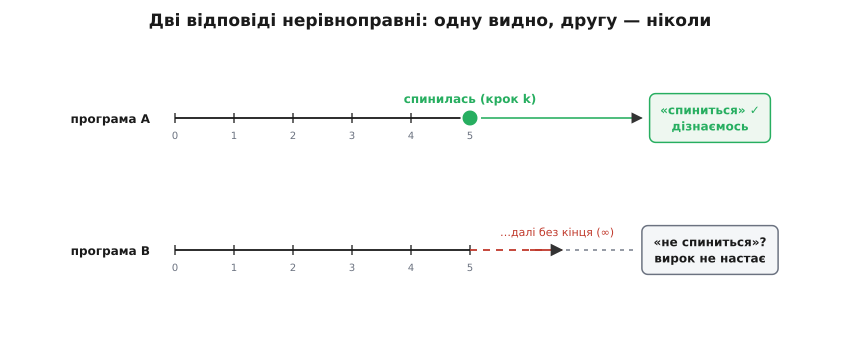
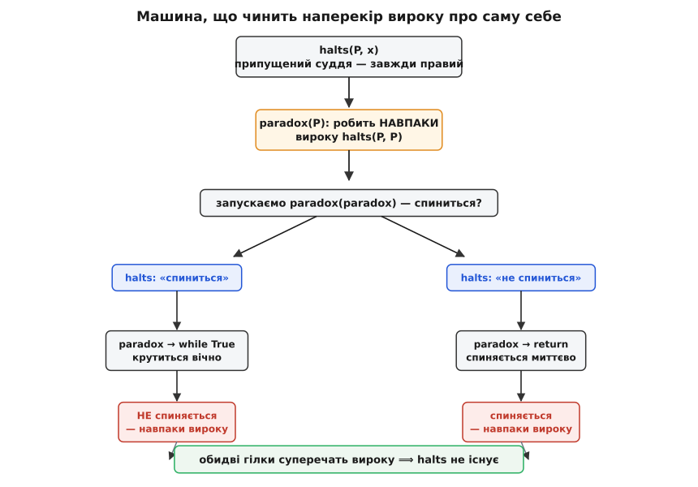
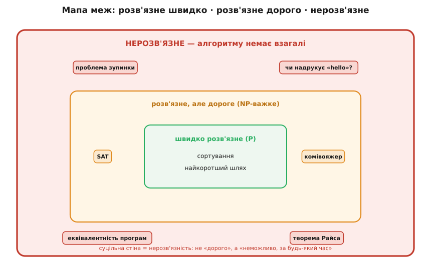

# Проблема зупинки

<preknowlist>
- [Машина Тюринга](topic:computability/turing-machine) — формальна модель будь-якого алгоритму; головне звідти: програма — це скінченний текст, а отже, її можна подати іншій програмі як звичайні вхідні дані (код — теж дані).
- [Доведення від супротивного](topic:math-logic/proof-by-contradiction) — прийом: припусти, що бажана річ існує, виведи з припущення суперечність — і цим доведи, що вона існувати не може.
</preknowlist>

Уяви програму-суддю, якій показуєш будь-яку іншу програму разом з її входом і ставиш одне-єдине питання: «Вона колись спиниться — чи крутитиметься довіку?» І суддя — щоразу за скінченний час — чесно каже одне з двох: «спиниться» або «зациклиться». Назвемо його `halts(програма, вхід)`.

Такий суддя був би дивом. Найгидкіший різновид помилки — не хибна відповідь, а зависання: програма мовчки крутиться, не віддаючи керування, і ти навіть не знаєш, чекати їй ще секунду чи вже ніколи. Мали б `halts` — компілятор відмовлявся б збирати код, що на якомусь вході кільцюється; жоден сервіс не завис би на рідкісному запиті. Ба більше: `halts` розв'язав би одним махом чимало відкритих задач математики. Візьми гіпотезу Гольдбаха (кожне парне число, більше за два, — сума двох простих). Напиши програму, що перебирає парні числа підряд і спиняється, щойно натрапить на таке, яке в суму двох простих **не** розкладається. Спитай `halts` про цю програму — і його «спиниться / ні» просто скаже тобі, існує контрприклад чи ні, тобто закриє гіпотезу, навіть не пред'явивши того числа.

Занадто добре, щоб бути правдою. Так і є: такого судді **не існує**. Не «ще не написали» й не «бракує потужного заліза» — а неможливо в принципі, доведено, назавжди. Оце і є проблема зупинки.

## «Та просто запусти її»

Найперша думка: навіщо якийсь мудрий суддя — просто **виконай** програму й дивися. Спинилась — кажемо «спиниться». Крутиться... а скільки чекати? Мільярд кроків позаду, а вона все рахує — застрягла навік чи просто повільна й от-от видасть відповідь? Ззовні не відрізниш. Виконання вміє підтвердити лише **одну** з двох відповідей: якщо програма таки спиниться, ти рано чи пізно це побачиш. А от «зациклиться» не підтвердить ніколи — щоб пересвідчитися, довелось би достояти до кінця нескінченності.



*Дві відповіді нерівноправні. «Спиниться» видно за скінченний час — досить дочекатися зупинки (згори). «Не спиниться» — це твердження про всю нескінченну майбутню поведінку, і жодне скінченне спостереження його не засвідчить (знизу). Тому саме виконання дає лише напівсуддю: він каже «спиниться», коли так, але на вічних програмах зависає разом із ними.*

Оця нерівноправність двох відповідей — корінь усієї халепи. «Спиниться» — властивість, яку видно за скінченний час. «Не спиниться» — властивість про **всю** нескінченну решту поведінки, і скінченним спостереженням її не впіймати. Тож наївне виконання дає напівсуддю: правдиве «спиниться» — так, але на вічних програмах він зависає сам. А нам потрібен суддя, що **завжди** відповідає за скінченний час. Здавалося б, треба лише розумніше — заглянути в код, а не тупо його крутити. Ось тут і чекає засідка.

## Машина, що чинить наперекір

Припустимо — усупереч тому, що я обіцяв, — що `halts` таки написали. Це звичайна програма: завжди завершується (на будь-якому вході дає відповідь за скінченний час) і завжди каже правду. Далі — самий фокус, і тримається він на одній властивості коду: [програма — це просто текст](topic:computability/turing-machine), скінченний рядок символів. А раз так, програму можна згодувати іншій програмі як вхідні дані. І навіть **самій собі**.

Збудуймо з `halts` одну шкідливу програму. Назвемо її `paradox`. Вона бере на вхід якусь програму `P`, питає в судді, чи спиниться `P`, коли їй дати на вхід її **власний** код, — і робить рівно навпаки почутому:

```py
def paradox(P):
    if halts(P, P):      # суддя: чи спиниться P на власному коді?
        while True:      # каже «так» — тоді навмисне зациклюємось
            pass
    else:
        return           # каже «ні» — тоді одразу спиняємось
```

`paradox` — теж цілком звичайна програма (якщо існує `halts`, то існує й вона). А тепер поставмо їй пастку, згодувавши їй **її саму**: запустимо `paradox(paradox)`. Спиниться цей запуск чи ні?

Суддя всередині обчислює `halts(paradox, paradox)` — виносить вирок саме про той запуск, що ми оце й робимо. Розгляньмо обидва його вироки.

- Суддя каже: «`paradox(paradox)` **спиниться**». Тоді `if` бере першу гілку — `while True` — і `paradox(paradox)` крутиться **вічно**. Тобто не спиняється. Суддя збрехав.
- Суддя каже: «`paradox(paradox)` **не спиниться**». Тоді `if` бере `else` — `return` — і `paradox(paradox)` спиняється **негайно**. Суддя знову збрехав.

Хоч би що суддя сказав про цей один вхід, `paradox` збудована так, щоб зробити протилежне, — і вирок виявляється хибним. Але ж ми припустили, що `halts` **завжди** правий. Суперечність. Єдине припущення в усьому міркуванні — що `halts` існує; отже, хибне саме воно. **Судді зупинки не існує.**



*Скелет доведення від супротивного. Припустимо, що суддя `halts` існує. З нього будуємо `paradox`, яка робить наперекір вироку про саму себе, і запускаємо `paradox(paradox)`. Вирок «спиниться» жене машину в нескінченний цикл (не спиняється); вирок «не спиниться» — у негайну зупинку. Обидві гілки суперечать вироку, тож правильного вироку не існує — а отже, не існує й `halts`.*

Уся сила — в останньому рядку задуму: `paradox` дивиться на передбачення про **саму себе** й чинить наперекір. Це та сама [діагональна витівка Кантора](topic:math-logic/cantor-diagonal): будуємо об'єкт, що навмисне різниться з кожним рядком таблиці на її ж діагоналі, — і тому в таблиці його немає. Тут «таблиця» — уявний повний список правильних відповідей судді про всі пари «програма та її власний код», а `paradox` — рядок, зроблений так, щоб не збігтися з передбаченням саме в тій клітині, де про нього питають. Такий рядок у список не влазить — а отже, повного списку, тобто судді, немає.

> 🔧 **Навіщо це.** Це не абстрактна прикрість, а тверда межа інструментів, якими ти користуєшся щодня. Ніхто ніколи не напише лінтер чи компілятор, що ловив би **кожне** зависання перед запуском, — гарантовано, без хибних тривог і без пропусків. Не тому, що ще не додумались, а тому, що така програма — це і є `halts`, якого не буває. Тому будь-який реальний детектор нескінченних циклів або перестраховується (лається й на цілком добрий код), або щось пропускає. Знати, що досконалого варіанта нема, — значить не витрачати місяці на його пошук і одразу будувати чесний, приблизний.

## Що означає «нерозв'язна»

Проблему зупинки називають **нерозв'язною** (англ. *undecidable*), і варто точно відчути, наскільки це слово сильне. Воно **не** означає «складна». Не означає «людям бракує кмітливості». Не означає «потрібен потужніший комп'ютер» чи «більше пам'яті й часу». Воно означає, що [алгоритму](topic:computability/church-turing-thesis), який давав би правильну відповідь на всіх входах, **не існує** — і не з'явиться в жодній мові програмування, на жодному залізі, ні сьогодні, ні за тисячу років.

Звідки така категоричність про «жодну мову й жодне залізо»? Адже довели ми неможливість лише для машин Тюрінга. Місток — [теза Черча–Тюринга](topic:computability/church-turing-thesis): усе, що взагалі можна порахувати за будь-яким притомним рецептом — хоч на квантовому комп'ютері, хоч на майбутньому невідомому пристрої, — можна порахувати й машиною Тюрінга. Тож «жодна машина Тюрінга не вміє» перекладається як «жоден механічний спосіб не вміє». Мовою теорії обчислюваності: множина пар «(програма, вхід), що спиняються» — [нерозв'язна мова](topic:computability/decidable-languages), її неможливо розпізнати алгоритмом, що завжди дає відповідь.

Тут корисно не сплутати дві дуже різні стіни. Є задачі **важкі**: [NP-повні](topic:computability/np-completeness), як-от пошук найкоротшого маршруту через усі міста, — їх розв'язати **можна**, алгоритм існує, просто на великих входах він може рахувати довше за вік Всесвіту. Це стіна ціни. А нерозв'язність — стіна іншого ґатунку: тут алгоритму нема **взагалі**, і жодні століття обчислень не зарадять, бо рахувати нема чого.



*Три пояси задач. Усередині — те, що розв'язується швидко (сортування, найкоротший шлях). Ширший пояс — розв'язне, але дороге: відповідь існує, та на великих входах чекати її можна астрономічно довго (перебірні, NP-важкі задачі). А за суцільною стіною — нерозв'язне: проблема зупинки й уся її рідня, куди жоден алгоритм не дістає ні за який час. Важливо не сплутати «дорого» зі «неможливо».*

Що нерозв'язних задач мусить бути повно, видно й з простого підрахунку. Програм — **зліченно** багато: кожна є скінченним рядком символів, а всі скінченні рядки можна перенумерувати натуральними числами. Задач же — тобто способів кожному можливому входу приписати «так» чи «ні» — **незліченно** [багато](topic:math-logic/countable-sets), їх строго більше, ніж натуральних чисел. Отже, програм банально не вистачає на всі задачі: майже кожна задача не має програми, що її розв'язує. Проблема зупинки просто найприродніша, найбуденніша з цього безміру — та, об яку спотикаєшся щодня.

## Нерозв'язність заразна

Одна нерозв'язна задача — це вже прикро, але справжня халепа в тому, що вона **заражає** сусідні. Знаряддя зараження зветься **зведенням** (англ. *reduction*, від лат. *reducere* — «відводити назад»): якщо вміння розв'язати задачу X дало б нам і розв'язок проблеми зупинки, то X теж нерозв'язна — інакше через неї ми б розв'язали й зупинку, а її розв'язати не можна.

Візьмімо питання, що на перший погляд геть не про зупинку: «Чи надрукує ця програма колись рядок `hello`?» Здавалося б, простіше. Але уяви, що суддя `prints_hello` існує. Тоді проблему зупинки я розв'яжу так: щоб дізнатися, чи спиниться `P` на вході `x`, візьму `P`, викину з неї всякий друк, а в самий кінець допишу `print("hello")`. Ця перероблена програма надрукує `hello` **тоді й лише тоді**, коли `P` дійшла до кінця, тобто спинилася. Питаю `prints_hello` — і маю відповідь про зупинку `P`. Отже, `prints_hello` розв'язав би зупинку, а значить, його теж не існує. Та сама доля спіткає «чи два ці програми обчислюють одну функцію?», «чи виконається колись оцей рядок коду (чи він мертвий)?», «чи впаде програма на якомусь вході?» — усі вони нерозв'язні, бо в кожну можна вкласти проблему зупинки.

Ця навала не випадкова — за нею стоїть напрочуд широка **теорема Райса**: [будь-яка](topic:computability/rice-theorem) нетривіальна властивість самої **поведінки** програми (того, що вона обчислює, а не того, як виглядає її текст) — нерозв'язна. «Нетривіальна» тут означає лише, що властивість мають одні програми й не мають інші. Тобто механічно й безпомильно перевірити «ця програма робить те-то» — не можна майже ніколи; винятки — хіба поверхові питання про сам текст («чи є в ньому слово `goto`»), а не про те, що код насправді робить. Як саме зведення переносить нерозв'язність з однієї задачі на іншу й як із цього виростає теорема Райса — [розібрано окремо](topic:computability/halting-problem/math-undecidability.md), разом зі строгим формулюванням через машини Тюрінга.

> 🔧 **Навіщо це.** Ось чому не буває ідеального антивіруса, що напевно розпізнає всякий шкідливий код; ідеального оптимізатора, що завжди каже, чи дві гілки роблять те саме; ідеального аналізатора, що без хиби знаходить кожну ваду. «Чи поводиться програма отак» — саме той клас питань, який теорема Райса оголошує нерозв'язним. Тому статичні аналізатори живуть за принципом обережності: відповідають «безпечно», «небезпечно» **або** «не знаю» — і свідомо перестраховуються, бо повного й точного «так/ні» отримати неможливо.

## То що, руки опустити? Ні

З усього цього легко зробити надто похмурий висновок, ніби доводити зупинку взагалі марно. Це не так — і різницю варто вловити точно. Проблема зупинки забороняє **один загальний** алгоритм, що впорався б із **усіма** програмами заразом. Вона аж ніяк не забороняє довести зупинку **конкретної** програми, яку ти тримаєш перед очима.

І це роблять постійно. Щоб довести, що саме цей цикл завершується, досить пред'явити [варіант циклу](topic:math-logic/loop-variant) — величину, що строго спадає при кожному проході й не може впасти нижче дна; така неодмінно дійде до дна за скінченне число кроків. Знайшов її — зупинку доведено, без винятків. Проблема зупинки лише каже, що **механічно знаходити** такий варіант для будь-якої програми ніхто не навчить машину: якби навчив, то й зупинку б розв'язав.

Тому реальні знаряддя — компілятори, верифікатори, доводжувачі завершення, перевіряльники моделей — грають чесно, обираючи **надійність** ціною **повноти**: вони дають три відповіді, «спиниться», «зациклиться» **або** «не певен». Ніколи не брешуть, але подеколи розводять руками. А найпростіший практичний напівсуддя — просто виконати програму з лічильником кроків і здатися після ліміту: він чесно ловить ті програми, що спиняються швидко, а решту лишає під питанням. Як побудувати і сам суперечливий `paradox` у робочому коді, і такий обмежений перевіряльник, [показано на прикладі](topic:computability/halting-problem/proj-halting-in-code.md).

Наскільки глибока прірва між «спиниться / ні» видно на [завзятому бобрі](topic:computability/busy-beaver) — гранично простій, чітко означеній функції, яку **жодна** програма не обчислює. Вона питає: яке найбільше число кроків може зробити машина Тюрінга з `n` станів, перш ніж спиниться? Число цілком конкретне для кожного `n` — а порахувати його не можна, бо це означало б уміти казати, котрі машини спиняються, а котрі ні. Нерозв'язність тут не десь у нетрях, а в невинному на вигляд запитанні про маленькі машинки.

## Близнюк теореми Гьоделя

Прийом, яким ми звалили судді зупинки, — не поодинокий трюк, а обличчя глибшої речі. За п'ять років до Тюрінга Курт Гьодель тим самим самопосиланням довів [теореми про неповноту](topic:math-logic/godel-incompleteness): у будь-якій достатньо багатій несуперечливій формальній системі є істинні твердження, яких вона не доведе. Гьоделеве речення каже про себе «мене не можна довести»; наш `paradox` — програма, що спиняється тоді й лише тоді, коли не спиняється. Один і той самий вузол самопосилання, зав'язаний двічі: у Гьоделя — про доведення, у Тюрінга — про обчислення.

Історія цього результату сама повчальна. Тюрінг довів нерозв'язність зупинки 1936 року, відповідаючи на **Entscheidungsproblem** (нім. — «проблема розв'язності») — питання Давида Гільберта, чи є механічний спосіб вирішувати, істинне довільне математичне твердження чи ні; незалежно й трохи раніше те саме показав Алонзо Черч. Цікаво, що ані слова «зупинка» (*halting*), ані звичного нам формулювання в Тюрінга ще не було — чітку назву й постановку через «спиниться / ні» пустив у світ Мартін Девіс аж наприкінці 1950-х. [Повна історія](topic:computability/halting-problem/hist-halting-problem.md) — від Гільбертової мрії про повну механізацію математики до того, як Черч і Тюрінг незалежно її поховали, — варта окремої розповіді.

Тож наступного разу, коли захочеться інструмент, що напевно вкаже на всякий вічний цикл, згадай `paradox`. Межа тут не в нашій кмітливості, яку колись доженемо, — вона в самій природі обчислення. Машина не може достеменно передбачати машини, бо хай що вона напророчить, знайдеться програма, якій можна наказати зробити рівно навпаки. І в цій неможливості — не поразка, а точна форма того, що взагалі означає «обчислити».
