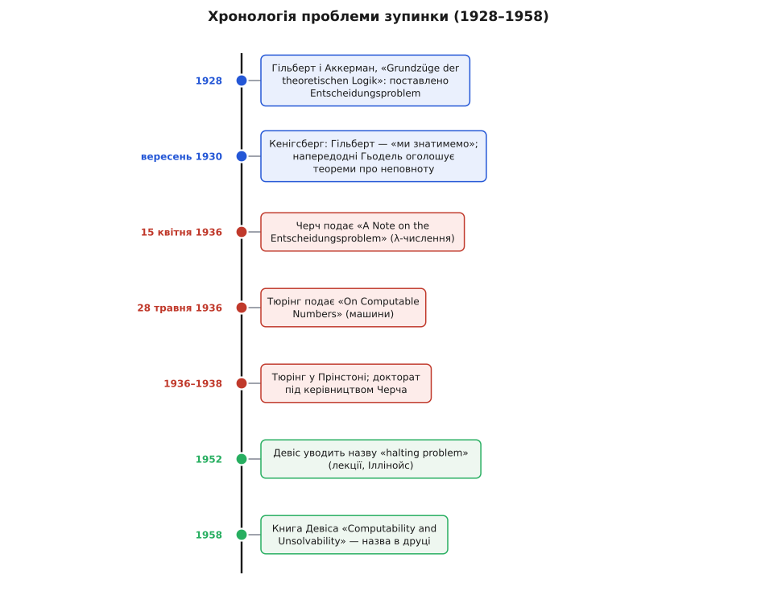
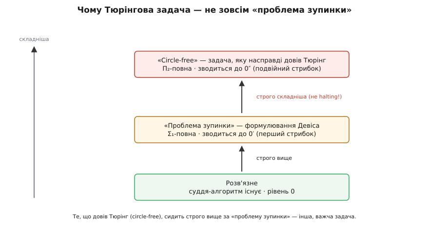

# 📜 Три постаті й одна мрія: як народилася проблема зупинки

Дивовижа цієї історії в тому, що чоловік, чиїм ім'ям підписують проблему зупинки, ніколи не вживав ані слова «зупинка», а того, хто дав їй звичну нам назву, більшість людей назвати не зможе. Між цими двома фактами вміщається ціла драма — про мрію накрутити математику на корбу, про двох незнайомців, що за кілька тижнів один по одному ту мрію поховали, і про те, як через двадцять років комусь третьому нарешті стало сили назвати вбите на ім'я. Розплутаймо її по-чесному.

## Мрія, яку можна накрутити на корбу

На зламі XX століття німецький математик Давид Гільберт (David Hilbert) вірив у річ, що нам сьогодні здається майже зухвалою: математику можна довести до кінця. Не в сенсі «вивчити все», а в сенсі — звести доведення до безвідмовного механічного ремесла. Ідеал був такий: узяти всю математику, покласти її на скінченний список аксіом і правил, а тоді довести про цю систему три речі — що вона несуперечлива (не доведе водночас і твердження, і його заперечення), повна (доведе кожну істину) і **розв'язна**: що є механічний спосіб для будь-якого твердження за скінченний час сказати, доводжуване воно чи ні.

Оце третє — розв'язність — Гільберт разом з учнем Вільгельмом Аккерманом (Wilhelm Ackermann), теж німцем, чітко виписав 1928 року в підручнику «Grundzüge der theoretischen Logik» («Основи теоретичної логіки») й назвав головною проблемою математичної логіки. Німецькою вона звалася **Entscheidungsproblem** — «проблема розв'язності». Питання просте на вигляд: чи існує загальна процедура, яка про будь-яке твердження [логіки предикатів](topic:computability/decidable-languages) вирішить, чи є воно логічно загальнозначущим (істинним за будь-якого тлумачення). Дай процедурі формулу — вона за скінченний час поверне «так» або «ні». Знайшлась би така — і математик перетворився б на оператора при машині: закладай гіпотезу, крути корбу, читай вирок.

Гільберт не просто хотів такої машини — він був певен, що вона є, треба лише знайти. Його гасло проти філософського «ignorabimus» («ми не знатимемо») стало приказкою: для математика жодного «ми не знатимемо» немає, кожна чесно поставлена задача має розв'язок. Ще 1930-го — а це важлива дата — він у це щиро вірив: нерозв'язних задач, гадав він, просто не буває.

## Кенігсберг, вересень 1930: тріщина, якої Гільберт не почув

Тут історія влаштовує одну зі своїх найгостріших іроній, і вона підтверджена документально. У вересні 1930-го Гільберт приїхав до рідного Кенігсберга — на з'їзд Товариства німецьких природознавців і лікарів, де 8 вересня виголосив урочисту промову. Скінчив він її словами, які потім вибили на його надгробку: «Wir müssen wissen. Wir werden wissen» — «Ми мусимо знати. Ми знатимемо». У залі — жодного сумніву, що математика піддасться до кінця.

А напередодні, 7 вересня, у тому самому місті, на іншому засіданні того ж наукового тижня, двадцятичотирилітній австрійський (згодом американський) логік Курт Гьодель (Kurt Gödel) тихо, майже між іншим, оголосив результат, що вибивав у Гільбертової мрії дві опори з трьох. Його [теореми про неповноту](topic:math-logic/godel-incompleteness) казали: жодна досить багата несуперечлива система не буде повною — у ній завжди лишиться істинне твердження, якого вона не доведе; і вона не зможе довести власної несуперечливості. Повнота й самозасвідчена несуперечливість, дві Гільбертові підпори, падали. Гільберт своєї промови не міняв — за переказами, про Гьоделів удар він тоді ще не знав.

Та вбити всю мрію Гьодель не встиг — і це тонкість, яку варто відчути точно. Неповнота — про **один зафіксований набір аксіом**: хоч би яку систему ти взяв, вона чогось не доведе. А Entscheidungsproblem питає інше — чи є **зовнішня** механічна процедура, що для будь-якої формули вирішує загальнозначущість. Одне про межі фіксованої системи зсередини, друге про існування універсального судді ззовні. Гьодель першого не переклав на друге. Третя опора — розв'язність — після 1930-го стояла собі неторкана. Її ще належало звалити, і для цього бракувало найдивнішого: ніхто досі не сказав, що ж таке «механічна процедура».



*Тридцять років в одному стовпчику. Синій пояс — Гільбертова віра в повну механізацію (1928–1930). Червоний — 1936-й, коли Черч і Тюрінг за кілька тижнів один по одному незалежно довели, що судді розв'язності немає. Зелений — аж наприкінці 1950-х, коли Мартін Девіс дав задачі назву, під якою ми знаємо її сьогодні.*

## Головна засідка: що взагалі таке «механічний спосіб»

Ось де ховалася справжня перепона. Довести, що процедура **існує**, легко: пред'яви її, покажи, як вона працює, — і по всьому. А як довести, що процедури **не існує**? Не «ми не знайшли», а «її немає й бути не може»? Для цього треба спершу мати математично точне означення того, що ти заперечуєш. Доти, доки «механічний спосіб» лишався розпливчастим людським поняттям («ну, крутиш корбу за правилами»), про його неіснування не можна було довести нічого — бо не було чого заперечувати. Півстоліття Гільбертова програма впиралася саме в цю стіну означення.

Стіну проламали 1936 року, і — це найкрасивіше в усій історії — двоє людей проламали її незалежно, з різних боків, різними знаряддями, майже одночасно.

## 1936: двоє незнайомців, дві мови, один вирок

Першим був американець Алонзо Черч (Alonzo Church) із Прінстона. Його знаряддям стало [лямбда-числення](topic:computability/lambda-calculus) — крихітна формальна мова, у якій усе на світі є функцією, а обчислення — це переписування виразів за одним-єдиним правилом підстановки. Черч запропонував ототожнити «обчисленне за механічним рецептом» саме з «λ-визначенним» (тим, що виражається в цьому численні). Спираючись на це означення, він побудував конкретну задачу з теорії чисел, для якої розв'язку-функції не існує, — і показав, що з такого висновку випливає нерозв'язність Entscheidungsproblem. Головний, важчий результат він доповів Американському математичному товариству ще навесні 1935-го, а стислу статтю з висновком про розв'язність — «A Note on the Entscheidungsproblem» — редакція Journal of Symbolic Logic отримала **15 квітня 1936 року** (пізніше довелося друкувати й невелику поправку). Мрію про корбу було офіційно поховано.

За кілька тижнів, з того боку океану й нічого не знаючи про Черча, те саме зробив англієць Алан Тюрінг (Alan Turing) — і зробив так, що його спосіб пережив усіх. Замість абстрактних функцій він вигадав уявну [машину](topic:computability/turing-machine): нескінченна стрічка, голівка, скінченна таблиця правил «побачив символ у стані — перепиши, зсунься, зміни стан». «Механічний спосіб», сказав Тюрінг, — це рівно те, що вміє така машина. Означення виявилося настільки прозорим, настільки очевидно вловлювало саму суть «рахувати за правилами», що переконувало відразу. Статтю «On Computable Numbers, with an Application to the Entscheidungsproblem» Лондонське математичне товариство отримало **28 травня 1936 року** (прочитано 12 листопада, надруковано двома випусками наприкінці того ж року, з поправкою 1937-го).

Уяви Тюрінгів подив, коли, майже завершивши працю, він дізнався, що якийсь Черч у Прінстоні вже надрукував висновок про Entscheidungsproblem — на кілька місяців раніше. Замість опустити руки Тюрінг зробив красивий хід: дописав до статті додаток, де показав, що його «обчисленне машиною» й Черчеве «λ-визначенне» — це **одне й те саме**. І ось це збіг двох означень, знайдених незалежно, з геть різних міркувань, і став справжнім тріумфом. Коли два розумні люди, йдучи різними стежками, приходять до тієї самої межі обчисленного, важко й далі вірити, що межа випадкова. Із цього збігу згодом виросла [теза Черча–Тюринга](topic:computability/church-turing-thesis) — переконання, що всі притомні означення «обчисленного» дають одну й ту саму множину, а отже, «жодна машина Тюрінга не вміє» чесно означає «жоден механічний спосіб не вміє».

А далі — те, що й мало статися: 1936-го Тюрінг сів на пароплав до Прінстона й наступні два роки писав докторат **під керівництвом самого Черча**. Дисертацію «Systems of Logic Based on Ordinals» (там уперше з'явилися машини-оракули) захистив 1938-го. Суперник за кілька тижнів став науковим керівником — рідкісно охайний вузол в історії науки.

## Дражлива правда: Тюрінг не доводив «проблеми зупинки»

А тепер найтонше — те, повз що ковзають майже всі підручники. Розгорни статтю Тюрінга 1936 року й пошукай там слово «halt» чи «halting». Його немає. І сучасного формулювання — «чи спиниться машина на цьому вході» — теж немає. Це не дрібниця в термінології; це інша задача.

Тюрінгові машини задумувалися не для того, щоб спинятися, а щоб **друкувати нескінченно**: кожна мала виписувати десятковий (двійковий) розклад якогось дійсного числа, знак за знаком, довіку. «Добра» машина в такому світі та, що не вмовкає. Тому Тюрінг оперував не зупинкою, а парою власних понять: машину він звав **кружною** (circular), якщо вона друкує лише **скінченно** багато цифр, і **безкружною** (circle-free) — якщо друкує їх **нескінченно** багато. І довів він нерозв'язність саме такого питання: чи є загальний спосіб про будь-яку машину сказати, безкружна вона чи ні.

Здавалося б, дрібна різниця з «чи спиниться». Насправді — прірва. «Безкружна» — це «друкує без кінця», тобто твердження про **всю** нескінченну майбутню поведінку відразу: «для кожного n колись з'явиться n-та цифра». А «спиниться» — це «є момент, коли машина стала»: одненький свідок, одненький крок. Мовою теорії обчислюваності це різні поверхи однієї вежі. Проблема зупинки — на першому поверсі нерозв'язності (Σ₁, «чи існує крок?»), вона зводиться до першого «стрибка» 0′. А Тюрінгова безкружність — на другому (Π₂, «чи для всіх n існує крок?»), вона зводиться до подвійного стрибка 0″ і є **строго складнішою**: маючи навіть оракула для проблеми зупинки, безкружність ним усю не розв'яжеш.

```
рівень 0    розв'язне               суддя-алгоритм існує
0′  (Σ₁)    проблема зупинки        ∃ крок: «на цьому кроці спинилась»
0″  (Π₂)    circle-free (Тюрінг)    ∀n ∃ крок: «надруковано ≥ n цифр»
```



*Те, що насправді довів Тюрінг, сидить строго вище за «проблему зупинки». Halting питає про існування одного кроку — зупинки; circle-free питає про нескінченне майбутнє — «чи не вмовкне машина ніколи». Друге важче: воно не зводиться до першого навіть з оракулом. Тому приписувати Тюрінгові «halting problem» — означає підмінювати його задачу легшою.*

Чи є в статті Тюрінга взагалі щось рівносильне зупинці? Є — і в цьому чесність вимагає точності. Поряд із безкружністю Тюрінг розглядав і «задачу друку» (чи надрукує машина колись даний символ), а вона вже **рівносильна** проблемі зупинки. Тобто зерно того результату в тексті лежить. Але **названого**, самопосильного «halting problem» — того чепурного доведення через машину, що робить наперекір вироку про саму себе, — у Тюрінга немає. Він до своєї нерозв'язності дійшов [діагональним](topic:math-logic/cantor-diagonal) міркуванням про безкружні машини, не через самозастосування судді зупинки.

Це не переказ легенди, а усталений серед тюрінгознавців висновок: докладно його обґрунтували, звіривши текст 1936 року з пізнішою літературою, Джек Коупленд (B. Jack Copeland) та Джоел Девід Гемкінс (Joel David Hamkins) із колегами. Від 1936-го й до кінця 1950-х у жодній статті про машини Тюрінга словосполучення «halting problem» не трапляється взагалі.

## Назву дав Девіс

Звідки ж вона взялася? Її пустив у світ американець Мартін Девіс (Martin Davis) — логік, що народився 1928 року в Нью-Йорку, у родині єврейських емігрантів із польського Лодзя. Наприкінці 1940-х він писав докторат у того ж таки Черча, тож стояв рівно в тій традиції, з якої проблема й виросла.

За свідченнями (і його власним переказом), сам термін «halting problem» Девіс уживав уже 1952 року — у циклі лекцій у Лабораторії систем керування Іллінойського університету, де тоді викладав; схоже, це й було перше його вживання. А в друці словосполучення вперше стало 1958-го — у його підручнику «Computability and Unsolvability» (McGraw-Hill), одній з перших книжок, що зробили теорію обчислюваності доступною й для інженерів. Девіс переформулював результат так, як ми його й знаємо: про зупинку машини, чисто, без розкладів дійсних чисел і без «кружності». Треба, щоправда, віддати належне й іншим: того ж 1952-го Стівен Кліні (Stephen Kleene) у «Introduction to Metamathematics» вже обертав фактично те саме поняття — просто без цієї влучної назви.

Тож коли Коупленд каже, що приписувати Тюрінгові формулювання й доведення теореми про зупинку — помилка, а справжнім автором цього конкретного результату слід бачити Девіса, він не применшує Тюрінга. Він лише наводить різкість. Тюрінгові належить головне — саме поняття універсальної машини й перше доведення, що є чітко означені питання про машини, на які жоден алгоритм не відповість. Девісу належить те **формулювання** цієї межі — коротке, зупинкове, самопосильне, — яким користується сьогодні кожен програміст. Ідея — Тюрінгова за духом; чепурна постановка й ім'я — Девісові за буквою. І в цьому нема нічого принизливого для жодного з них: великі поняття рідко народжуються вже вбраними в остаточні слова. Спершу хтось прорубує стіну — а назву над проламом чіпляють згодом, коли крізь неї вже ходять юрбами.

Ось чому в підручниках стоїть «теорема Тюрінга про зупинку», а в самого Тюрінга слова «зупинка» немає. Не помилка авторів — стисла іронія того, як народжуються поняття: мрію Гільберта поховали двічі, 1936-го, двоє за кілька тижнів; а назву тому, що вони закопали, дали аж утретє, через двадцять із гаком років, і зовсім інша рука.
