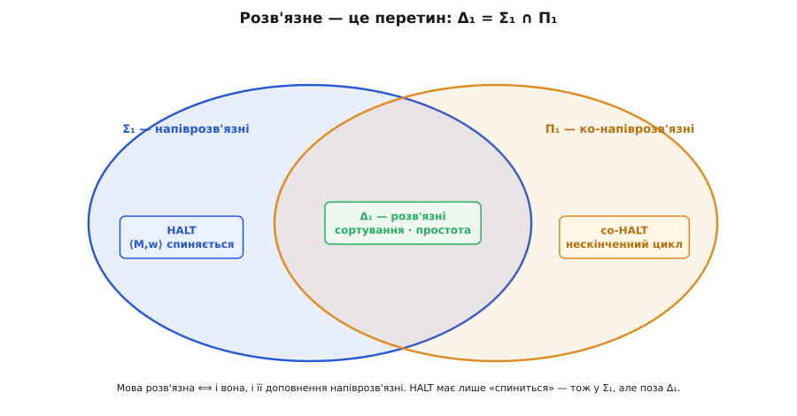
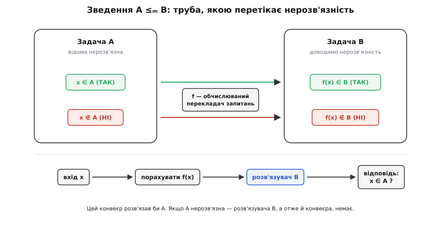

# 🧮 Строгий шар: мова HALT, зведення й теорема Райса

Доведення через програму, що чинить наперекір вироку про саму себе, переконує — але воно тримається на словах «програма», «спиниться», «зробити навпаки», кожне з яких ще треба закріпити цвяхом. Зробімо це. Перекладемо задачу на мову, якою про неї говорять строго: задача стане **множиною рядків**, «розв'язати» стане точним технічним словом, а сам парадокс — акуратним рахунком по діагоналі. А коли апарат буде зібрано, з нього виросте головне робоче знаряддя всієї теорії — **зведення**, яким одна нерозв'язна задача заражає десятки сусідніх, аж до однорядкового вироку теореми Райса: майже ніщо про поведінку програми не перевіриш механічно.

## Задача — це мова, «розв'язати» — це розв'язувач

Перше, що треба зафіксувати: будь-яка [машина Тюринга](root:computability/turing-machine) `M` — скінченний об'єкт, тож її можна записати скінченним рядком символів. Цей рядок позначають `⟨M⟩` — код машини. Так само кодують пару «машина та її вхід»: `⟨M, w⟩` — один рядок, що містить і опис `M`, і вхідне слово `w`. Нічого магічного: це буквально текст програми поряд з її аргументом, як `main.py` поруч із файлом даних.

Тепер задачу «чи спиниться `M` на `w`?» можна сформулювати без жодного «чи»: зібрати в одну купу всі коди, для яких відповідь «так»:

```
HALT = { ⟨M, w⟩ : машина M спиняється на вході w }
```

Це **мова** — підмножина всіх скінченних рядків. Кожен рядок або належить `HALT` (машина спиняється), або ні (крутиться вічно). Питання про зупинку конкретної пари звелося до питання про належність рядка множині — а це вже те, що теорія обчислюваності вміє препарувати.

Що означає «розв'язати» таку задачу? Точне слово — **розв'язувач** (англ. *decider*): машина `D`, яка на **будь-якому** вході спиняється за скінченний час і каже одне з двох — «належить» чи «не належить». Не «іноді відповідає», не «на хороших входах» — **завжди** спиняється й **завжди** правильно. Мову називають [розв'язною](root:computability/decidable-languages), якщо такий `D` для неї існує. `HALT` **нерозв'язна** — розв'язувача для неї немає; це те саме твердження, що й «судді зупинки не існує», лише вимовлене мовою мов і машин.

> 🔧 **Навіщо це.** Перевід «задача → мова» не косметика. Він робить різні на вигляд питання — «чи спиниться», «чи надрукує `hello`», «чи еквівалентні дві програми» — об'єктами **одного** типу (мовами), які можна порівнювати, вкладати одна в одну й переносити висновки між ними. Без цього спільного знаменника не було б ні зведень, ні теореми Райса — лише розрізнені історії про окремі задачі.

## Напіврозв'язне: точна межа Σ₁

Перш ніж валити `HALT`, варто зважити, наскільки саме вона недосяжна — бо недосяжність буває різного ґатунку. Одну відповідь про зупинку здобути **можна**. Візьмімо універсальну машину `U` — ту, що приймає код `⟨M⟩` та вхід `w` і крок за кроком імітує роботу `M` на `w` (це і є звичайний інтерпретатор). Запустімо `U` на `⟨M, w⟩` і чекаймо:

- якщо `M` на `w` спиняється — `U` доведе імітацію до кінця й **скаже «так»** за скінченний час;
- якщо `M` крутиться вічно — `U` крутиться разом із нею й **не скаже нічого** ніколи.

Отже, `HALT` **напіврозв'язна** (англ. *semi-decidable*): є машина, що приймає рівно її члени, але на не-членах може зависнути. Це рівно той «напівсуддя», що його дає наївне виконання. Клас таких мов у теорії обчислюваності має ім'я — **Σ₁**, перший рівень арифметичної ієрархії (її незалежно ввели Кліні 1943 року й Анджей Мостовський 1946-го). Σ₁ — це точно **рекурсивно перелічувані** мови: ті, чиїх членів можна «підтвердити за скінченний час», хай навіть не-членів підтвердити не можна. `HALT` лежить у Σ₁.

А чи не лежить вона, бува, і в розв'язних? Ні — і тут корисно побачити, чому напіврозв'язність **строго слабша**. Розгляньмо доповнення:

```
co-HALT = { ⟨M, w⟩ : машина M НЕ спиняється на w }  — «зациклиться»
```

Ця мова не належить навіть Σ₁: підтвердити «крутиться вічно» за скінченний час неможливо в принципі (довелося б додивитися нескінченність до кінця). `co-HALT` живе на **дзеркальному** рівні — **Π₁**, ко-напіврозв'язні мови. І ось замок, що тримає все: мова розв'язна **тоді й лише тоді**, коли напіврозв'язні і вона сама, і її доповнення (теорема Поста). Розв'язне — це рівно перетин:

```
Δ₁ (розв'язні)  =  Σ₁ ∩ Π₁
```

Якби `HALT` була розв'язна, то й `co-HALT` була б напіврозв'язна — а вона не є. Отже, `HALT` сидить у Σ₁, але **поза** Δ₁: підтвердити «спиниться» можна, спростувати — ні. Оце і є точна форма її нерозв'язності. Не «важко порахувати», а «одну половину правди видно, другу — принципово ні».



*Три класи одним оком. Розв'язне (`Δ₁`, зелений серп) — це рівно перетин напіврозв'язного (`Σ₁`) і ко-напіврозв'язного (`Π₁`): мова розв'язна тоді й лише тоді, коли за скінченний час можна підтвердити і належність, і неналежність. `HALT` має лише перше — тож лежить у `Σ₁`, але випадає з `Δ₁`. Її доповнення `co-HALT` не має навіть цього й тулиться в `Π₁`. Прірва між «спиниться» і «зациклиться» — це прірва між двома серпами.*

## Універсальна машина й акуратна діагональ

Тепер строге доведення нерозв'язності — те саме за духом, що й машина-наперекірниця, але з кожним кроком, закріпленим цвяхом. Припустимо супротивне: `HALT` **розв'язна**, тобто існує розв'язувач `D`, який на будь-якому `⟨M, w⟩` завжди спиняється й відповідає правильно:

```
D(⟨M, w⟩) = ТАК,  якщо M спиняється на w
D(⟨M, w⟩) = НІ,   якщо M не спиняється на w
```

З `D` збудуємо машину `G` (від «діагональ»), яка бере на вхід **один** код `⟨M⟩` і робить ось що:

```
G(⟨M⟩):
    якщо D(⟨M, ⟨M⟩⟩) = ТАК:   # чи спиниться M, коли їй дати ЇЇ ВЛАСНИЙ код?
        крутитися вічно
    інакше:
        спинитися
```

`G` — цілком законна машина: якщо `D` існує, то `G` будується з нього механічно. А тепер підставмо `G` її власний код і спитаймо, що робить `G(⟨G⟩)`. Усередині рахується `D(⟨G, ⟨G⟩⟩)` — вирок саме про той запуск, який ми оце й робимо.

- Якщо `D` каже **ТАК** («`G(⟨G⟩)` спиниться») — `G` за своїм текстом іде в перше відгалуження й **крутиться вічно**. Значить, `G(⟨G⟩)` не спиняється, а `D` збрехав.
- Якщо `D` каже **НІ** («`G(⟨G⟩)` не спиниться») — `G` іде в друге відгалуження й **спиняється негайно**. Знову навпаки, знову брехня.

Розв'язувач `D` мав бути завжди правий — а на вході `⟨G, ⟨G⟩⟩` він неправий хоч так, хоч так. Суперечність. Єдине, що ми припустили, — існування `D`; отже, хибне саме це припущення. **Розв'язувача для `HALT` не існує.**

Один крок тут заслуговує окремого цвяха — той, де `G` дістає свій **власний** код і згодовує його собі. Чому машина взагалі має право на свій код? Це не самоочевидно: наче змія ковтає власний хвіст. Формальну гарантію дає [теорема рекурсії Кліні](root:computability/kleene-recursion-theorem) (Кліні виклав її ще 1938 року, збудувавши самовідтворну програму задовго до перших комп'ютерів): для будь-якого обчислюваного перетворення програм існує програма, що поводиться так, ніби вже тримає в руках власний код. Саме вона перетворює побутове «нехай `G` подивиться на себе» на дозволену операцію, а не на замкнене коло. Це та ж [діагональ Кантора](root:math-logic/cantor-diagonal): `G` зроблено так, щоб на «своїй» клітині таблиці правильних вироків не збігтися з жодним рядком — тому в таблиці її немає, а отже, немає й повного розв'язувача.

## Зведення: труба, якою перетікає нерозв'язність

Одна нерозв'язна мова — це ще пів біди. Небезпечна вона тим, що вміє **передавати** свою нерозв'язність іншим, і робить це через єдиний прийом — **багато-однозначне зведення** (англ. *many-one reduction*; поняття ввів Еміл Пост 1944 року в праці про рекурсивно перелічувані множини). Ось означення, і в ньому вся суть:

```
A ≤ₘ B    означає:   існує ОБЧИСЛЮВАНА тотальна функція f: рядки → рядки,
                     така що для кожного x:   x ∈ A  ⟺  f(x) ∈ B
```

Словами: `f` — це механічний перекладач запитань. Він бере будь-яке запитання `x` про задачу `A` й вертає запитання `f(x)` про задачу `B` — так, щоб відповіді збігалися завжди: `x` у `A` рівно тоді, коли `f(x)` у `B`. `f` мусить сама бути обчислюваною й давати відповідь на всіх входах (тотальна) — інакше це не механічний переклад, а ще одна нерозв'язна задача під килимом.

Чому одна стрілка `≤ₘ` переносить нерозв'язність? Припустимо, `A ≤ₘ B` і `B` **розв'язна** — є розв'язувач `D_B`. Тоді ось розв'язувач для `A`: узяти `x`, порахувати `f(x)`, запустити `D_B(f(x))`, вернути його відповідь. Він завжди спиняється (обидві частини — `f` і `D_B` — завжди спиняються) і завжди правий (бо `x ∈ A ⟺ f(x) ∈ B`). Отже:

```
A ≤ₘ B   і   B розв'язна    ⟹   A розв'язна
```

Прочитаймо це навпаки (протилежне твердження логічно тотожне):

```
A ≤ₘ B   і   A НЕрозв'язна   ⟹   B НЕрозв'язна
```

Ось воно. Щоб довести, що нова задача `B` нерозв'язна, треба **звести відому нерозв'язну до неї**: показати `HALT ≤ₘ B`. Напрям критичний, і його плутають найчастіше — тож закарбуймо: **важку задачу зводимо до нової**, `HALT` ліворуч. Якби ми показали навпаки, `B ≤ₘ HALT`, це б лише сказало, що `B` не важча за `HALT` — а нам треба, що вона не легша.



*Механіка зведення `A ≤ₘ B`. Перекладач `f` кладе кожне «так»-запитання про `A` в «так»-область `B`, а кожне «ні» — у «ні»-область: належність зберігається точно. Тоді конвеєр знизу — спершу `f`, потім розв'язувач `B` — був би розв'язувачем для `A`. Якщо `A` нерозв'язна, такого конвеєра бути не може, а отже, не може бути й розв'язувача `B`. Стрілка `≤ₘ` — це труба, якою нерозв'язність перетікає з `A` в `B`.*

Та сама труба несе й напіврозв'язність: якщо `A ≤ₘ B` і `B` напіврозв'язна, то й `A` напіврозв'язна (порахуй `f(x)`, запусти розпізнавач `B`). Тому зведення заразом упорядковує задачі за складністю — і в цьому воно рідне тій техніці, що [класифікує NP-повні задачі](root:computability/np-completeness): там теж усе тримається на зведеннях, лише перекладач `f` мусить бути ще й **швидким** (за поліноміальний час). Прибери обмеження на час — і поліноміальне зведення стає нашим обчислюваним. Один прийом, дві шкали.

## Приклад до кінця: HALT ≤ₘ «чи надрукує програма hello»

Слова про трубу набувають ваги лише на повному прикладі. Візьмімо задачу, що на позір геть не про зупинку:

```
PRINTS = { ⟨P⟩ : програма P колись друкує рядок "hello" }
```

Доведімо `HALT ≤ₘ PRINTS`, тобто збудуймо обчислюваний перекладач `f`, що з коду пари `⟨M, w⟩` робить код такої програми `P′`, яка друкує `hello` **точно тоді**, коли `M` спиняється на `w`. Ось `f` — звичайна функція, що приймає текст `M` та вхід `w` і склеює текст нової програми:

```py
def f(M_src, w):
    # Повертає ВИХІДНИЙ ТЕКСТ нової програми P′.
    # P′ нічого не друкує, доки імітує M на w; надрукує "hello" лише в кінці.
    return f'''
def P_prime():
    M = load_machine({M_src!r})     # відновити машину M з її коду
    simulate(M, {w!r})              # крок за кроком імітувати M на вході w
    print("hello")                 # цей рядок досяжний ЛИШЕ якщо імітація завершилась
P_prime()
'''
```

Тепер простежмо обидва випадки — і побачмо, що рівносильність тримається залізно.

**Випадок «`M` спиняється на `w`».** Тоді `simulate(M, w)` доходить до кінця за скінченний час, керування минає його — і `P′` виконує `print("hello")`. Отже, `P′` друкує `hello`, а значить `⟨P′⟩ ∈ PRINTS`.

**Випадок «`M` не спиняється на `w`».** Тоді `simulate(M, w)` крутиться вічно, керування **ніколи** не доходить до рядка `print("hello")` — а більше `P′` нічого не друкує. Отже, `P′` не друкує `hello` ніколи, і `⟨P′⟩ ∉ PRINTS`.

Складаючи обидва рядки докупи:

```
⟨M, w⟩ ∈ HALT   ⟺   P′ друкує "hello"   ⟺   ⟨P′⟩ ∈ PRINTS
```

Перекладач `f` очевидно обчислюваний — він лише вставляє тексти `M` і `w` у сталий шаблон, жодного разу нічого не запускаючи (це важливо: `f` **не виконує** `M`, лише **пише** програму, що її виконає). Отже, `HALT ≤ₘ PRINTS`, а раз `HALT` нерозв'язна — нерозв'язна й `PRINTS`. Жоден аналізатор не скаже напевно про кожну програму, чи виведе вона колись задане слово.

## Порожнеча і еквівалентність тим самим ключем

Той самий шаблон «встав імітацію `M` на `w` перед тим, що цікавить» відмикає задачу за задачею. Візьмімо **порожнечу** — чи не приймає програма геть нічого:

```
NONEMPTY = { ⟨N⟩ : мова, яку приймає N, непорожня — N хоч щось приймає }
```

Будуємо перекладач: із `⟨M, w⟩` робимо машину `N`, що на **будь-якому** своєму вході `x` спершу цілком ігнорує `x`, імітує `M` на `w`, і **якщо** та імітація завершилась — приймає `x`:

```py
def f(M_src, w):
    return f'''
def N(x):                          # x ігнорується
    M = load_machine({M_src!r})
    simulate(M, {w!r})             # спершу — доля M на w
    return ACCEPT                  # приймаємо будь-який x, але лише діставшись сюди
'''
```

Простежмо, яку мову приймає `N`. Якщо `M` спиняється на `w`, імітація завжди завершується, і `N` приймає **кожен** `x` — її мова це весь набір рядків, вона непорожня. Якщо `M` крутиться на `w`, `N` зависає на кожному `x`, не прийнявши жодного — її мова **порожня**. Тобто:

```
⟨M, w⟩ ∈ HALT   ⟺   мова N непорожня   ⟺   ⟨N⟩ ∈ NONEMPTY
```

Отже, `HALT ≤ₘ NONEMPTY` — порожнеча нерозв'язна. (А з нею й доповнення, `EMPTY` — «чи приймає програма нічого»: розв'язувач одного дав би розв'язувач другого простим перевертанням відповіді.)

Звідси один крок до **еквівалентності** — чи роблять дві програми те саме:

```
EQUIV = { ⟨A, B⟩ : A і B приймають ту саму мову }
```

Зафіксуймо раз і назавжди машину `M∅`, яка миттєво відкидає будь-який вхід (її мова порожня). Тоді для будь-якої `N`: сказати «мова `N` порожня» — те саме, що сказати «`N` еквівалентна `M∅`». Перекладач `⟨N⟩ ↦ ⟨N, M∅⟩` обчислюваний, і

```
⟨N⟩ ∈ EMPTY   ⟺   мова N порожня   ⟺   L(N) = L(M∅)   ⟺   ⟨N, M∅⟩ ∈ EQUIV
```

тобто `EMPTY ≤ₘ EQUIV`. Нерозв'язність перетекла ще далі: не можна механічно й безпомильно перевіряти, чи два шматки коду обчислюють одне й те саме — а це якраз те, чого прагнув би кожен оптимізатор, що хоче замінити повільну реалізацію швидкою «еквівалентною».

## Теорема Райса: один патерн валить усі семантичні властивості

Придивімось до всіх трьох зведень — `PRINTS`, `NONEMPTY`, `EQUIV`. У кожному ми будували машину, чия **поведінка** ставала однією з двох залежно від того, спиняється `M` на `w` чи ні: або «цікава» (друкує `hello`, приймає все, не еквівалентна порожній), або «нецікава пустка» (нічого не робить). Це не три збіги, а один патерн — і він узагальнюється до разючої широти. Це **теорема Райса** (Генрі Ґордон Райс, докторська дисертація 1951 року в Сиракузькому університеті, опублікована 1953-го):

> **Будь-яка нетривіальна семантична властивість програм — нерозв'язна.**

Розберімо два прикметники, бо в них уся точність.

**Семантична** означає: властивість самої **функції**, яку програма обчислює, а не її тексту. Формально — властивість `φ_M`, тобто відображення «вхід → вихід», яке задає `M`. Ключове: якщо дві програми обчислюють ту саму функцію (`φ_M = φ_N`), то властивість або є в обох, або в жодної. «Чи обчислює програма сталу `0`», «чи спиниться на всіх входах», «чи еквівалентна оцій» — семантичні. А от «чи довший текст за 100 символів», «чи є в коді слово `goto`» — **не** семантичні: залежать від запису, не від поведінки, і чудово розв'язні.

**Нетривіальна** означає: властивість мають **одні** програми й **не мають** інші (не «всі» і не «жодна»). Тривіальні дві — «істина завжди» і «хиба завжди» — очевидно розв'язні (відповідь стала). Райс каже: **усе між ними** нерозв'язне.

Ескіз доведення — те саме зведення від `HALT`, лише піднесене на рівень абстрактного `P`. Нехай `P` — нетривіальна семантична властивість. Без утрати загальності припустимо, що ніде-невизначена функція `⊥` (програма, що зависає на всьому й нічого не обчислює) властивості `P` **не** має — якщо має, візьмімо доповнення `P`, воно теж нетривіальне й семантичне, а розв'язність однієї рівносильна розв'язності другої. Позаяк `P` нетривіальна, знайдеться програма-**свідок** `R`, чия функція `φ_R` властивість `P` таки має. Тепер перекладач: із `⟨M, w⟩` будуємо машину `M′`, що на кожному вході `x` спершу імітує `M` на `w`, а **як** та завершиться — робить те, що на `x` зробила б `R`:

```py
def f(M_src, w, R_src):
    return f'''
def M_prime(x):
    M = load_machine({M_src!r})
    simulate(M, {w!r})             # ворота: пройти можна лише якщо M спиняється на w
    R = load_machine({R_src!r})
    return run(R, x)               # за воротами M′ поводиться ТОЧНО як свідок R
'''
```

Тепер яку функцію обчислює `M′`?

- Якщо `M` спиняється на `w` — ворота відчинені для кожного `x`, і `M′` на кожному вході робить те саме, що `R`. Отже, `φ_{M′} = φ_R`, а `φ_R` має `P`. Значить, `M′` має властивість `P`.
- Якщо `M` не спиняється на `w` — ворота зачинені завжди, `M′` зависає на кожному `x` і не обчислює нічого: `φ_{M′} = ⊥`. А `⊥` властивості `P` не має. Значить, `M′` властивості `P` не має.

Одним рядком:

```
⟨M, w⟩ ∈ HALT   ⟺   φ_{M′} має властивість P   ⟺   ⟨M′⟩ ∈ L_P
```

де `L_P = { ⟨M⟩ : φ_M має P }`. Перекладач `f` обчислюваний (він лише склеює тексти — те, що така склейка завжди можлива й механічна, гарантує так звана теорема s-m-n, близька родичка [теореми рекурсії Кліні](root:computability/kleene-recursion-theorem)). Отже, `HALT ≤ₘ L_P`, і `L_P` нерозв'язна. Позаяк `P` була **довільна** нетривіальна семантична властивість — нерозв'язні вони **всі**. ∎

Саме тут ховається причина, чому в брифі повний розбір винесено окремо: у доведенні є тонкі місця (обґрунтування «без утрати загальності», роль семантичності в тому, що `φ_{M′}` однозначно вирішує належність незалежно від того, якою машиною її обчислено). Повне їх розкриття — в окремій темі [теорема Райса](root:computability/rice-theorem); тут важливий сам **патерн**: будь-яку семантичну властивість можна «підвісити на ворота зупинки», і вона успадкує нерозв'язність `HALT`.

## Що з цього тримати в голові

Строгий шар додав до інтуїтивного парадоксу три речі, яких на рівні «машина-наперекірниця» не видно.

Перше — **точну висоту стіни**. `HALT` не просто «нерозв'язна»; вона рівно на рівні Σ₁: її члени підтверджуються за скінченний час, не-члени — ні. Це не «важко», а «одну половину правди видно, другу принципово ні». Доповнення `co-HALT` не має навіть половини — воно поза Σ₁. Розв'язне живе тільки в перетині `Σ₁ ∩ Π₁`, куди `HALT` не дістає.

Друге — **робочий інструмент** замість окремого фокуса на кожну задачу. Зведення `A ≤ₘ B` — обчислюваний перекладач запитань, що зберігає відповідь; він жене нерозв'язність (і напіврозв'язність) трубою від `A` до `B`. Щоб довести нерозв'язність нового `B`, зводь до нього `HALT`, а не навпаки — напрям вирішує все.

Третє — **один патерн на цілий клас**. Теорема Райса каже, що зведення `HALT` до «чи має програма властивість `P`» проходить для **кожної** нетривіальної семантичної `P`. Тому нерозв'язних питань про поведінку програм не жменя, а стіна: усе, що про **суть** роботи коду, а не про його **текст**, механічно й безпомильно не перевіриш. Лишається текстове (синтаксичне) — і чесні наближення, що деколи кажуть «не знаю».
