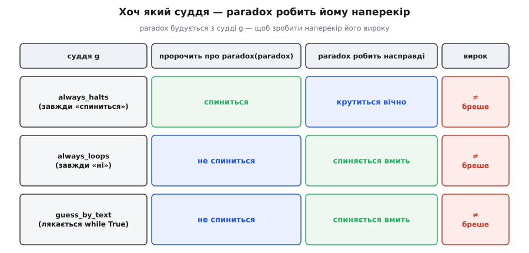

# ⚙️ Три спроби спіймати зупинку в коді

Досконалого судді зупинки не буває — це доведено. Але з доведення не випливає, що писати про зупинку марно; випливає рівно протилежне — воно каже, **чого саме** бракуватиме будь-якому реальному інструменту, і тим підказує, який інструмент варто будувати. Тож зберемо три робочі програми. Перша — сама машина, що ховає досконалого суддю в могилу, тільки не на папері, а в коді, який запускається. Друга — чесний напівсуддя, що ніколи не бреше, ціною того, що подеколи мовчить. Третя — вузенький перевіряльник, який про більшість циклів знизує плечима, зате про свій клопіткий закуток каже правду без винятків. Крізь усі три проходить одна вісь, і варто назвати її на самому початку.

Інструмент про зупинку буває **надійний** (англ. *sound*): коли він виносить певний вирок — «спиниться» чи «ні», — цей вирок правдивий, інструмент не бреше. І буває **повний** (англ. *complete*): він виносить певний вирок про **кожен** вхід, ніколи не лишаючи «не знаю». Досконалий суддя `halts` — це надійний **і** повний **і** такий, що завжди відповідає за скінченний час. Саме така трійця неможлива. А коли ідеал недосяжний, кожна робоча програма жертвує чимось одним: або повнотою (чесно каже «не знаю»), або широтою свого поля (береться лише за вузький клас входів). Надійністю не жертвує ніхто — інструмент, що бреше, не інструмент. Ось цей розмін, надійність проти повноти, і є нитка всіх трьох спроб.

## 1. Машина, що спростовує будь-якого суддю

**Задача.** Довести неможливість `halts` можна на папері. Але міркування «припустимо, суддя існує…» лишає легкий післясмак абстракції. Перекладімо його в код, який справді виконується, — щоб суперечність можна було не уявити, а **побачити на екрані**.

**Ідея.** Уся сила доведення тримається на одній властивості: [програма — це скінченний текст](topic:computability/turing-machine), а отже, її можна згодувати іншій програмі як звичайні дані. Найгостріше «код = дані» видно тоді, коли програма дістає **власний** текст. Це не фокус і не витік абстракції — це строга можливість, за якою стоїть [теорема рекурсії Кліні](topic:computability/kleene-recursion-theorem): у будь-якій повній моделі обчислень існує програма, що обчислює свій власний опис. Найпростіший її свідок — **квайн** (англ. *quine*, на честь логіка Вілларда Квайна), програма, що друкує саму себе літера в літеру:

```py
s = 's = %r\nprint(s %% s)'
print(s % s)
```

Запусти її — і на виході буде рівно ці два рядки, символ у символ. Жодного читання файлу, жодної магії: текст програми відтворює себе з даних, які в ній лежать. (Квайни є в кожній повній мові, C зокрема; різниться лише те, як програма дістає свій текст.) Раз програма вміє тримати власний код як рядок, вона вміє й **розпитувати про себе** уявного суддю, а тоді чинити наперекір почутому.

**Робочий код.** Збудуймо машину-пастку. Вона будується **з** судді `guess` й чинить наперекір тому, що той пророкує про неї саму: даємо судді на вхід текст `paradox` (код-як-дані); якщо суддя віщує «спиниться» — `paradox` іде в нескінченну гілку, якщо «не спиниться» — негайно спиняється. Мова з інтроспекцією (Python) дістає власне джерело просто під час роботи через `inspect.getsource`; у C, де інтроспекції нема, ми подаємо текст `paradox` явною сталою — це той самий код-як-дані, лише виписаний руками. `guess` тут — параметр: підстав будь-якого претендента на суддю. Досконалого `halts` підставити не можна, бо його не існує, — але **будь-якого конкретного** здогадувача можна, і `paradox` неодмінно виявиться тим входом, на якому той бреше. Перевірмо це на трьох геть різних претендентах: один завжди каже «спиниться», другий завжди «ні», третій зазирає в текст і лякається явного нескінченного циклу (`for (;;)` у C, `while True` у Python):

:::tabs
```c
#include <stdio.h>
#include <string.h>
#include <stdbool.h>

// Суддя бачить програму як дані — її текст (код = дані):
typedef struct { const char *text; } Program;

// Суддя вгадує: чи спиниться програма, коли дати їй на вхід саму себе?
typedef bool (*Judge)(Program self, Program input);

bool always_halts(Program self, Program input) { return true;  }
bool always_loops(Program self, Program input) { return false; }
bool guess_by_text(Program self, Program input) {           // наївна статична евристика
    return strstr(input.text, "for (;;)") == NULL;          // не видно циклу — кажу «спиниться»
}

// Текст paradox подаємо явно: у C нема інтроспекції, тож код-як-дані пишемо руками.
static const Program paradox = {
    "if (guess(self, self)) for (;;);  else return;"
};

// Що paradox РОБИТЬ, коли суддя видав verdict (нескінченну гілку не запускаємо):
//   verdict=true  («спиниться»)    -> гілка for(;;) -> насправді loops
//   verdict=false («не спиниться») -> return        -> насправді halts
static const char *paradox_does(bool verdict) { return verdict ? "loops" : "halts"; }

int main(void) {
    struct { const char *name; Judge guess; } probe[] = {
        { "always_halts",  always_halts  },
        { "always_loops",  always_loops  },
        { "guess_by_text", guess_by_text },
    };
    for (int k = 0; k < 3; k++) {
        bool verdict = probe[k].guess(paradox, paradox);    // пророцтво про paradox(paradox)
        const char *predicted = verdict ? "halts" : "loops";
        const char *actual    = paradox_does(verdict);
        printf("%-13s пророчить: %-5s | paradox робить: %-5s | суддя збрехав: %s\n",
               probe[k].name, predicted, actual,
               strcmp(predicted, actual) != 0 ? "так" : "ні");
    }
    return 0;
}
```
```py
import inspect

def make_paradox(guess):
    def paradox():
        src = inspect.getsource(paradox)   # програма читає власний текст
        if guess(src, src):                # суддя: чи спиниться paradox на собі?
            while True:                    # каже «спиниться» -> крутимось вічно
                pass
        else:
            return "спинилась"             # каже «не спиниться» -> стоп негайно
    return paradox

def always_halts(src, arg):  return True
def always_loops(src, arg):  return False
def guess_by_text(src, arg): return "while True" not in src   # наївна статична евристика

def defeat(name, guess):
    src = inspect.getsource(make_paradox(guess))   # текст paradox — той самий для всіх суддів
    verdict   = guess(src, src)                    # пророцтво про paradox(paradox)
    predicted = "halts" if verdict else "loops"
    actual    = "loops" if verdict else "halts"    # береться протилежна гілка
    print("%-13s пророчить: %-5s | paradox робить: %-5s | суддя збрехав: %s"
          % (name, predicted, actual, "так" if predicted != actual else "ні"))

for name, g in [("always_halts", always_halts),
                ("always_loops", always_loops),
                ("guess_by_text", guess_by_text)]:
    defeat(name, g)
```
:::

Обидві мови друкують те саме:

```
always_halts  пророчить: halts | paradox робить: loops | суддя збрехав: так
always_loops  пророчить: loops | paradox робить: halts | суддя збрехав: так
guess_by_text пророчить: loops | paradox робить: halts | суддя збрехав: так
```

Троє з трьох посоромлені. Зверни увагу на дрібницю: коли суддя пророчить «спиниться», ми **не запускаємо** нескінченну гілку — і не мусимо. Що вона крутиться вічно, видно з самого тексту; виконувати нескінченність, аби пересвідчитися, що вона нескінченна, було б безглуздо. Тому й `paradox_does` (у C) та симетричний вибір гілки (у Python) читають вирок **з тексту**, а не з прогону. Суперечність не десь у динаміці — вона **читається очима** в коді, і саме в цьому дух доведення.

А чому цей трюк валить **геть усіх** суддів, а не лише цих трьох? Бо `paradox` будується **з** судді так, щоб розійтися з ним рівно в тій клітині, де про неї й питають. Це та сама [діагональ Кантора](topic:math-logic/cantor-diagonal): яку відповідь суддя не впиши у свою уявну таблицю на перетині «paradox × paradox», машина зроблена так, щоб у цій клітині поставити інше. Рядок, що навмисне різниться з діагоналлю, у таблицю не влазить — тож повної таблиці, тобто судді, немає.

> 🔧 **Навіщо це.** Ця вправа — не гра в парадокси, а щеплення від однієї спокуси. Раз по раз хтось сідає писати «розумний аналізатор, що напевно вкаже кожен вічний цикл». Код вище показує, чим це закінчиться завжди: щойно твій аналізатор `guess` готовий, за десяток рядків будується програма, на якій він помиляється, — і так для будь-якого `guess`, хоч який хитрий. Не тому, що ти не дотяг, а тому, що дотягти нікуди. Знати це — значить не міняти місяці життя на полювання за неможливим.

Помітна й окрема пастка в `guess_by_text`. Він побачив у тексті нескінченний цикл (`for (;;)` / `while True`) й перелякано пророчить «зациклиться» — а `paradox` якраз спиняється, бо та гілка **не виконується**. Присутність нескінченного циклу в тексті програми ще нічого не каже про те, чи він колись запуститься. Синтаксис — це не поведінка; на цьому спотикається кожен, хто судить код за виглядом, а не за тим, що він робить.



*Спростування будь-якого судді, зведене в таблицю. Хоч що передбачить конкретний здогадувач `g` про `paradox(paradox)`, машина зроблена з `g` так, щоб зробити навпаки, — тож правий стовпчик щоразу інший, ніж лівий. Підставного досконалого `halts` тут немає лише тому, що його не буває; усе інше — реальний код, що дає саме цей вивід.*

**Складність і пастки.** Сама `paradox` тривіальна — вона робить один запит до `guess` і йде в одну з двох гілок. Уся вага не в її роботі, а в тому, що вона неможлива разом із `halts`. Головна пастка тут концептуальна: спокусливо подумати, ніби ми «майже» побудували суддю й бракує дрібнички. Ні — бракує саме серця, функції `guess`, яка була б **водночас** надійною, повною й завжди-завершеною. Усе, що її оточує, — тримання власного тексту, інверсія вироку — реальне й запускається; діра рівно одна, і вона непроглядна. Друга пастка — сплутати «текст містить нескінченний цикл» із «програма зациклиться»: `guess_by_text` показав, як легко на цьому обпектися.

## 2. Чесний напівсуддя: бюджет кроків

**Задача.** Досконалий суддя недосяжний. Пожертвуймо повнотою — хай інструмент має право сказати «не знаю» — і виторгуймо за це те, що лишилось: суддю, який **ніколи не бреше**.

**Ідея.** Найчесніший спосіб дізнатися, чи спиниться програма, — просто її виконати. Пастка відома: якщо вона крутиться, чекати можна вічно. Тож поставмо лічильник кроків і **здаваймося** після наперед узятого бюджету. Спинилася в межах бюджету — кажемо «спиниться», і це щира правда, ми ж бачили зупинку. Бюджет вичерпано — кажемо «не знаю», а **не** «зациклиться»: раптом вона спинилася б на наступному кроці. Тут і живе нерівноправність двох відповідей: «спиниться» підтверджується скінченним спостереженням, а «не спиниться» — ніколи.

**Робочий код.** Щоб чесно порахувати кроки будь-якої програми, треба вміти виконувати її **по одному кроку** й після кожного питати «чи вже кінець?». Найпрозоріша модель цього — програма як **крокова функція**: вона рухає стан і повертає `RUNNING`, доки працює, або `DONE`, коли спинилась. Напівсуддя жене таку функцію не більш як `budget` разів. Ця модель — не навчальна умовність: так улаштовані обмежені виконавці й лічильники «пального» в реальних віртуальних машинах (те саме газове метрування в EVM). Головне — межа «кроку» тут **явна**, і ми ще побачимо, як багато це важить.

:::tabs
```c
#include <stdio.h>
#include <stdbool.h>

typedef enum { RUNNING, DONE } Status;
typedef Status (*Step)(long *state);   // один крок: рухає стан; DONE, коли спинилась

typedef enum { HALTS, UNKNOWN } Verdict;   // LOOPS не буває — у цьому вся суть

// Женемо step не більш як budget кроків.
Verdict halts_within(Step step, long init, long budget, long *steps_out) {
    long st = init;
    for (long i = 0; i < budget; i++) {
        if (step(&st) == DONE) {
            *steps_out = i + 1;
            return HALTS;              // достеменно спинилась — ми бачили
        }
    }
    *steps_out = budget;
    return UNKNOWN;                    // бюджет вичерпано — не знаємо
}

Status countdown(long *s) {            // рахує вниз до 0, тоді спиняється
    if (*s <= 0) return DONE;
    (*s)--;
    return RUNNING;
}

Status forever(long *s) {              // вічна
    (void)s;
    return RUNNING;
}

Status heavy(long *s) {                // уся праця — в одному кроці
    long acc = 0;
    for (long k = 0; k < 2000000; k++) acc += k;   // мільйони додавань під одним кроком
    *s = acc;
    return DONE;
}

int main(void) {
    const char *V[] = { "HALTS", "UNKNOWN" };
    long n; Verdict v;

    v = halts_within(countdown, 50,  10000, &n);
    printf("countdown(50),  б=10000 -> %-7s кроків %ld\n", V[v], n);
    v = halts_within(forever,   0,   10000, &n);
    printf("forever,        б=10000 -> %-7s кроків %ld\n", V[v], n);
    v = halts_within(countdown, 500, 100,   &n);
    printf("countdown(500), б=100   -> %-7s кроків %ld\n", V[v], n);
    v = halts_within(countdown, 500, 5000,  &n);
    printf("countdown(500), б=5000  -> %-7s кроків %ld\n", V[v], n);
    v = halts_within(heavy,     0,   5,     &n);
    printf("heavy,          б=5     -> %-7s кроків %ld\n", V[v], n);
    return 0;
}
```
```py
RUNNING, DONE = 0, 1

def halts_within(step, state, budget):
    """Напівсуддя: женемо не більш як budget кроків.
    Повертає ('HALTS', кроки) або ('UNKNOWN', кроки) — ніколи 'LOOPS'."""
    for i in range(budget):
        status, state = step(state)
        if status == DONE:
            return ("HALTS", i + 1)     # достеменно спинилась — ми бачили
    return ("UNKNOWN", budget)          # бюджет вичерпано — не знаємо

def countdown(s):                       # рахує вниз до 0, тоді спиняється
    return (DONE, s) if s <= 0 else (RUNNING, s - 1)

def forever(s):                         # вічна
    return (RUNNING, s)

def heavy(s):                           # уся праця — в одному кроці
    acc = sum(range(2_000_000))         # мільйони додавань під одним кроком
    return (DONE, acc)

print("countdown(50),  б=10000 -> %-7s кроків %d" % halts_within(countdown, 50,  10000))
print("forever,        б=10000 -> %-7s кроків %d" % halts_within(forever,   0,   10000))
print("countdown(500), б=100   -> %-7s кроків %d" % halts_within(countdown, 500, 100))
print("countdown(500), б=5000  -> %-7s кроків %d" % halts_within(countdown, 500, 5000))
print("heavy,          б=5     -> %-7s кроків %d" % halts_within(heavy,     0,   5))
```
:::

Обидві мови дають один вивід:

```
countdown(50),  б=10000 -> HALTS   кроків 51
forever,        б=10000 -> UNKNOWN кроків 10000
countdown(500), б=100   -> UNKNOWN кроків 100
countdown(500), б=5000  -> HALTS   кроків 501
heavy,          б=5     -> HALTS   кроків 1
```

Придивись до третього й четвертого рядка. `countdown(500)` — та сама програма, що **завжди** спиняється рівно за 501 крок. З бюджетом 100 напівсуддя каже «не знаю» — і це не помилка, а чесність: він справді не встиг побачити зупинку. Підняв бюджет до 5000 — і те саме «не знаю» перетворилось на тверде «спиниться». Вирок «UNKNOWN» ніколи не означає «зациклиться»; він означає лише «на цьому бюджеті я не додивився». А колонки вироків красномовні: тут є `HALTS` і `UNKNOWN`, і нема — не може бути — `LOOPS`. Це **напіврозв'язник** (англ. *semi-decider*): надійний, але однобокий, підтверджує тільки зупинку.

**Складність і пастки.** Ціна прогону — `O(min(справжні кроки, бюджет))`, помножена на вартість одного кроку. І сама ця дешевина ховає найглибші пастки:

- **Він насправді ВИКОНУЄ програму.** Це не безсторонній суддя, що дивиться збоку, — усі побічні дії стаються по-справжньому: файли пишуться, листи шлються, лічильники цокають. Нацькувати такий напівсуддя на невідомий код — те саме, що просто його запустити, з усіма наслідками.
- **Більший бюджет не рятує принципово.** Спокусливо: візьмімо бюджет колосальний — і хай усе «не знаю» стане вироком. Не вийде. Немає жодного обчислюваного числа, про яке можна знати, що «як за стільки кроків не спинилась, то вже ніколи»: така межа росла б швидше за будь-яку обчислювану функцію — це [завзятий бобер](topic:computability/busy-beaver). Тому `UNKNOWN` неможливо надійно доварити до `LOOPS` жодним скінченним бюджетом; однобокість тут не недогляд реалізації, а стеля самого підходу.
- **Тісний бюджет плодить хибні «не знаю».** Як зі `countdown(500)` при бюджеті 100: програма спиниться, а вирок — «не знаю». Інструмент не збрехав, але й не допоміг.
- **Що взяти за «крок» — вирішуєш ти, і від цього залежить усе.** `heavy` перемолотила два мільйони додавань і дістала вирок `HALTS` на **одному** кроці: уся праця сховалась усередині єдиного виклику крокової функції, а лічильник побачив тільки один крок. Величезний цикл прослизнув під бюджетом, ніби його й не було. Хай крок — виклик функції, рядок, байткод чи машинна інструкція: від цього вибору залежить, кого лічильник злічить, а кого проґавить, і скільки роботи здатне сховатися за одним «кроком».

## 3. Вузький, але надійний: статичний перевіряльник

**Задача.** Напівсуддя мусив запускати програму — а з нею й усі її побічні дії. Спробуймо інакше: судити про зупинку, **не виконуючи** код, лише читаючи його текст. За це доведеться заплатити найдорожче — майже повною відмовою від широти, — зате в нагороду дістанемо вирок миттєвий, безпечний і надійний.

**Ідея.** Пнутися в загальний випадок марно: [теорема Райса](topic:computability/rice-theorem) каже, що будь-яка нетривіальна властивість **поведінки** програми нерозв'язна, тож жоден текстовий аналіз не розсудить усі цикли. Тому не будуймо всезнайку — виберімо два вузькі візерунки, про які можна судити **напевно**. Перший бік — надійна зупинка: якщо для циклу видно [варіант](topic:math-logic/loop-variant) — величину, що строго спадає до дна щопроходу, — цикл конче скінченний. Найпростіший варіант — лічильник, що монотонно повзе до межі. Другий бік — надійна незупинка в її найгрубішому вигляді: `while True` без жодного виходу з тіла. Усе, що не влізло в ці два візерунки, чесно дістає «не знаю».

**Робочий код.** Це єдина з трьох спроб, що лишається суто в Python, — і причина по суті. Тут ми не виконуємо код, а розбираємо його **текст**: мова з готовим синтаксичним аналізатором дає дерево розбору задарма. Вбудований модуль `ast` перетворює джерело на дерево вузлів, яким зручно ходити; писати заради цього власний парсер (як довелося б у C) означало б поміняти інструмент, що пасує задачі, на той, що ні. Спершу три помічники: чи є в тілі циклу вихід, що належить **саме йому**; чи є там виклики; скільки разів тіло переприсвоює змінну.

```py
import ast

def escapes(node, kinds, mine=True):
    """Чи є в node вихід одного з типів kinds, що належить НАШОМУ циклу?
    break/continue гілкуються до найближчого циклу (тому mine гасне у вкладеному);
    return/raise виносять із функції завжди."""
    if isinstance(node, (ast.FunctionDef, ast.AsyncFunctionDef, ast.Lambda, ast.ClassDef)):
        return False                                   # інша область видимості
    if isinstance(node, kinds):
        if isinstance(node, (ast.Break, ast.Continue)):
            if mine:
                return True
        else:
            return True
    inner = isinstance(node, (ast.For, ast.While, ast.AsyncFor))
    return any(escapes(ch, kinds, mine and not inner) for ch in ast.iter_child_nodes(node))

def has_call(node):
    if isinstance(node, (ast.FunctionDef, ast.AsyncFunctionDef, ast.Lambda, ast.ClassDef)):
        return False
    if isinstance(node, (ast.Call, ast.Await)):
        return True
    return any(has_call(ch) for ch in ast.iter_child_nodes(node))

def binds(node, name):
    """Скільки разів тіло переприсвоює `name` (=, +=, ціль for)."""
    n = 0
    for ch in ast.iter_child_nodes(node):
        if isinstance(ch, (ast.FunctionDef, ast.AsyncFunctionDef, ast.Lambda, ast.ClassDef)):
            continue
        if isinstance(ch, ast.Assign):
            n += sum(isinstance(t, ast.Name) and t.id == name for t in ch.targets)
        elif isinstance(ch, ast.AugAssign):
            n += int(isinstance(ch.target, ast.Name) and ch.target.id == name)
        elif isinstance(ch, (ast.For, ast.AsyncFor)):
            n += int(isinstance(ch.target, ast.Name) and ch.target.id == name)
        n += binds(ch, name)
    return n
```

`escapes` — не педантизм, а серце надійності. Наївний перевіряльник, побачивши будь-який `break`, вирішив би «є вихід» і промовчав. Але `break` у **вкладеному** циклі виходить із того циклу, а не з нашого; тож, спускаючись у вкладений цикл, ми гасимо прапорець `mine` — і той `break` для нас уже не вихід. Проґавити цю тонкість — значить проґавити справжні вічні цикли. Тепер сам присуд:

```py
def classify(loop):
    body, test = loop.body, loop.test
    exits = any(escapes(st, (ast.Break, ast.Return, ast.Raise)) for st in body)
    calls = any(has_call(st) for st in body)

    # (1) тривіальна нескінченність: while True без жодного виходу й виклику
    if isinstance(test, ast.Constant) and test.value is True:
        if not exits and not calls:
            return "LOOPS", "while True — жодного виходу, жодного виклику"
        return "UNKNOWN", "while True, але є вихід чи виклик — не беруся"

    # (2) простий лічильниковий варіант:  while i {<,<=,>,>=} межа
    if (isinstance(test, ast.Compare) and len(test.ops) == 1
            and isinstance(test.left, ast.Name)):
        i, op, bound = test.left.id, test.ops[0], test.comparators[0]
        if calls:
            return "UNKNOWN", "у тілі виклик — чужа функція могла б не повернутись"
        if any(escapes(st, (ast.Continue,)) for st in body):
            return "UNKNOWN", "є continue — крок може прослизнути"
        if binds(loop, i) != 1:
            return "UNKNOWN", "i змінюється не рівно одну безумовну дію"
        step = next((st for st in body if isinstance(st, ast.AugAssign)
                     and isinstance(st.target, ast.Name) and st.target.id == i), None)
        if step is None:
            return "UNKNOWN", "єдина зміна i — не безумовне i ±= c на верхньому рівні"
        c = step.value
        if not (isinstance(c, ast.Constant) and isinstance(c.value, int) and c.value > 0):
            return "UNKNOWN", "крок не є додатною цілою константою"
        if isinstance(bound, ast.Name) and binds(loop, bound.id) > 0:
            return "UNKNOWN", "межу теж рухають — варіант не сталий"
        up = isinstance(step.op, ast.Add)
        toward = (isinstance(op, (ast.Lt, ast.LtE)) and up) or \
                 (isinstance(op, (ast.Gt, ast.GtE)) and isinstance(step.op, ast.Sub))
        if not toward:
            return "UNKNOWN", "крок веде i ГЕТЬ від межі — може не спинитись"
        return "TERMINATES", "варіант строго спадає до дна, крок %d" % c.value

    return "UNKNOWN", "форма циклу не з тих, що вміє цей інструмент"
```

Пройдімося тим самим набором циклів, який тільки й може попастися в реальному коді:

```py
def check(src):
    for node in ast.walk(ast.parse(src)):
        if isinstance(node, ast.While):
            print("  [%-10s] %s" % classify(node))
```

```
while i < n: total += i; i += 1          [TERMINATES] варіант строго спадає до дна, крок 1
while i > 0: i -= 1                       [TERMINATES] варіант строго спадає до дна, крок 1
while True: pass                          [LOOPS     ] while True — жодного виходу, жодного виклику
while True: (if done: break); i += 1      [UNKNOWN   ] while True, але є вихід чи виклик
while i < n: (if flag: i += 1)            [UNKNOWN   ] єдина зміна i — не безумовне i ±= c
while i < n: (if odd: continue); i += 1   [UNKNOWN   ] є continue — крок може прослизнути
while i < n: n -= 1; i += 1               [UNKNOWN   ] межу теж рухають — варіант не сталий
while i < n: i -= 1                       [UNKNOWN   ] крок веде i ГЕТЬ від межі
while i < n: print(i); i += 1            [UNKNOWN   ] у тілі виклик — чужа функція могла б не повернутись
while b != 0: a, b = b, a % b             [UNKNOWN   ] i змінюється не рівно одну безумовну дію
while n != 1: n = n//2 if n%2==0 else 3*n+1   [UNKNOWN] єдина зміна i — не безумовне i ±= c
```

Кожен вирок тут — або надійна правда, або чесне «не знаю». Найкраще це видно на вкладеному випадку, де перевіряльник судить кожен цикл окремо:

```py
check("""
while True:
    k = 0
    while k < 3:
        if bad: break     # цей break виходить з ВНУТРІШНЬОГО циклу
        k += 1
    y += 1
""")
```

```
  [LOOPS     ] while True — жодного виходу, жодного виклику
  [TERMINATES] варіант строго спадає до дна, крок 1
```

Внутрішній `while k < 3` завершується — його варіант `3 − k`. А зовнішній `while True` **справді вічний**: єдиний `break` виходить із внутрішнього циклу, зовнішній лишається без виходу. Перевіряльник це бачить і сміливо каже `LOOPS` — там, де наївний, злякавшись слова `break`, промовчав би й проґавив вічний цикл.

**Складність і пастки.** Ціна — `O(розміру дерева)`: один прохід синтаксичним деревом, без жодного виконання, тож вирок миттєвий і без побічних дій. За цю дешевину й безпеку заплачено повнотою, і рахунок чималий:

- **Він не знає майже нічого.** `while b != 0: a, b = b, a % b` — це [алгоритм Евкліда](topic:math-logic/loop-variant), що **гарантовано** спиняється (варіант тут — саме `b`); перевіряльник знизує плечима, бо це не його візерунок. Коллац і поготів. «Не знаю» тут — не хиба, а межа вузького інструмента: він надійний саме тому, що не пнеться за свій закуток.
- **Надійність `LOOPS` тримається на забороні викликів.** Чому `while True` з викликом у тілі дістає «не знаю», а не `LOOPS`? Бо викликана функція могла б кинути виняток чи сама впасти в `sys.exit` — і цикл таки урвався б. Прибери цю пересторогу, і вирок про незупинку стане брехливим. Кожне «не беруся» в коді стереже конкретну шпарину, крізь яку зупинка могла б утекти: умовний крок (`if flag: i += 1`) — бо приріст може так і не статись; `continue` — бо він перестрибує крок; рухома межа — бо тоді запас роботи не тане.
- **Варіант живе в ℕ лише завдяки безмежним цілим Python.** Доведення спирається на те, що `n − i` не може спадати вічно, — а це правда для натуральних. Перенеси цю саму логіку на мову з машинними цілими скінченної ширини (той самий `long` у C), і [все посиплеться](topic:math-logic/loop-variant): при переповненні лічильник закільцюється, дна не стане, і «надійний» вирок обернеться хибним. Надійність перевіряльника — не лише в його коді, а й у припущеннях про арифметику, над якою він міркує.
- **Райс невблаганний.** Можна докидати візерунки — розпізнавати ще й подвійні лічильники, словникові варіанти, — і поле надійних вироків ширшатиме. Але накрити **всі** цикли, що завершуються, не вдасться ніколи: за це ручається теорема Райса. Скільки візерунків не додай, лишиться нескінченно багато програм, що спиняються, а перевіряльник цього не доведе.

## Надійність проти повноти: три інструменти поруч

Складімо здобуте докупи. Три спроби — це три різні відповіді на одне питання: що робити, коли досконалий суддя недосяжний.


*Хто які вироки може виносити. Ідеальний `halts` заповнив би обидва верхні рядки надійно й нічого не лишив на «не знаю» — але цей стовпчик перекреслено, бо його не буває. Напівсуддя надійно підтверджує тільки «спиниться», а «не спиниться» не каже ніколи — його однобокість принципова. Статичний перевіряльник надійний в обидва боки, зате кожен певний вирок дає лише на своєму вузькому візерунку, і майже все зостається під «не знаю». Жоден стовпчик не жертвує надійністю — усі жертвують повнотою, тільки в різні боки.*

Матриця показує саму суть розміну. Ідеальний `halts` — надійний і повний водночас — стоїть перекреслений: він і є те, чого не існує. Обидва реальні інструменти зберігають надійність недоторканою й відступають рівно в повноті, але відступають **у різні боки**. Напівсуддя однобокий: дай йому нескінченний бюджет — і він зрештою підтвердить кожну програму, що спиняється, зате про вічні не скаже нічого й ніколи; він накриває саме те, що можна лише «перелічити, дочекавшись». Статичний перевіряльник зрікається навіть цього: він не переконає й половини зупинок, зате платить нулем за виконання, відповідає вмить і надійний в обидва боки — там, де взагалі відповідає.

Ось чому знання про неможливість `halts` — не привід опустити руки, а **технічне завдання**. Воно не забороняє будувати корисне; воно точно каже, за що доведеться заплатити: якусь частину правди кожен чесний інструмент лишає під вироком «не знаю». Уся інженерія навколо зупинки — компілятори з їхніми перестрахованими попередженнями, верифікатори, доводжувачі завершення — зводиться до одного вибору: **котру половину правди ти можеш дозволити собі не знати**. Напівсуддя лишає в тіні вічні цикли; статичний перевіряльник — усе, крім кількох візерунків. А `paradox` стоїть поруч вартовим і нагадує, чому третьої, всезнайної половини не буде: скільки суддю не вдосконалюй, знайдеться програма, зроблена з нього ж, аби зробити наперекір.
