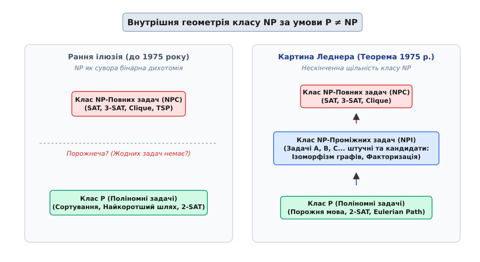
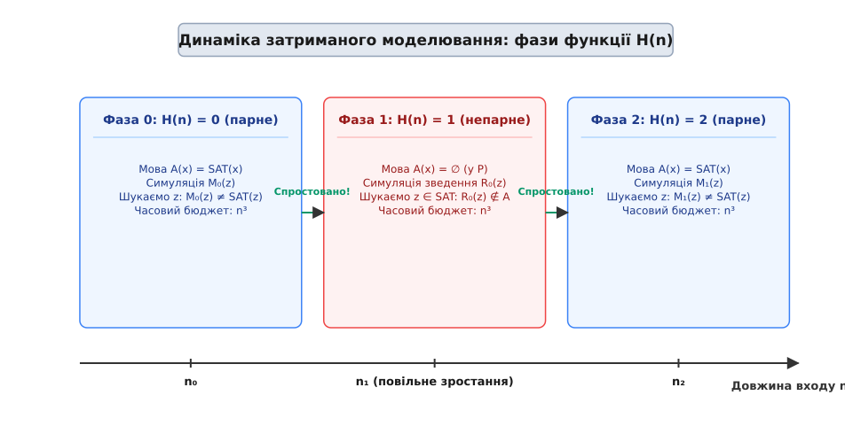
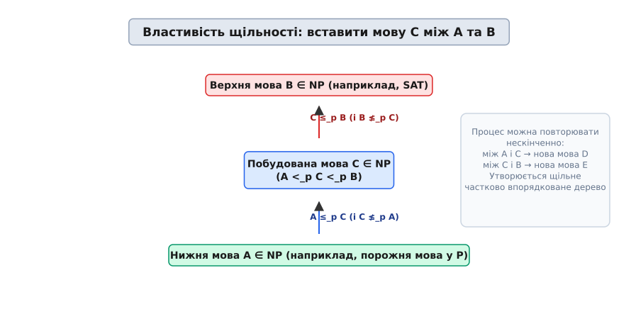

# Теорема Леднера: структура класу NP та проміжні закономірності

<preknowlist>
- [Асимптотична складність](root:computability/asymptotic-complexity) — нотація O(…), поліномний та експоненційний час.
- [Класи P і NP](root:computability/p-vs-np) — детерміновані та недетерміновані обчислення, перевірка свідків.
- [NP-повнота](root:computability/np-completeness) — поняття поліномного зведення (Karp/Levin reduction) та найважчих задач.
- [Теорема Кука — Левіна](root:computability/cook-levin-theorem) — здійсненність булевих формул (SAT) як перша NP-повна задача.
- [Проблема зупинки](root:computability/halting-problem) — обчислюваність, універсальні машини Тюринга та діагональний метод.
- [Поліноміальна ієрархія](root:computability/polynomial-hierarchy) — вежа складності PH над NP, чергування кванторів та оракульні класи.
</preknowlist>

Навесні 1972 року, після того як Стівен Кук, Леонід Левін та Річард Карп довели NP-повноту сотень практичних комбінаторних задач — від здійсненності булевих формул (SAT) до обходу графів, розфарбування та пакування рюкзака, в теорії обчислювальних систем запанувала дихотомічна ілюзія. Дослідники спостерігали дивовижну картину: кожна розглядана задача або легко розв'язувалася за поліномний час детермінованим алгоритмом, або виявлялася гранично важкою NP-повною проблемою, до якої можна було поліномно звести будь-яку іншу задачу з класу NP. Склалося враження, що простір NP за умови нерівності класів P та NP має бінарну структуру без жодних проміжних рівнів складності.

У 1975 році американський математик та інформатик Річард Леднер докорінно змінив це уявлення. Він довів, що якщо класи P та NP не збігаються (`P ≠ NP`), то клас NP містить нескінченну кількість задач, які не належать до P, але при цьому не є NP-повними. Ці проблеми отримали назву **NP-проміжних задач** (NP-intermediate problems). Крім того, Леднер установив, що частковий порядок поліномних ступенів складності у межах NP є щільним: між будь-якими двома задачами різної складності завжди можна побудувати третю задачу строго проміжного рівня.

## Ілюзія двійкової дихотомії та виклики ранньої теорії складності

Щоб осягнути фундаментальний зміст відкриття Леднера, необхідно відтворити контекст теорії складності початку 1970-х років. Після публікації знаменитого списку Карпа з 21 NP-повної проблеми дослідники масово знаходили нові NP-повні задачі у найрізноманітніших галузях математики та інженерії: розклад розкладу завдань у процесорах, розфарбування карт, оптимізація мереж та автоматичне проектування мікросхем.

Кожна нова проблема, що потрапляла до фокусу уваги інформатиків, після кількох місяців аналізу або отримувала швидкий алгоритм розв'язання (наприклад, перевірка дводольності чи пошук мінімального остовного дерева), або поповнювала список NP-повних задач. Це сформувало інтуїтивну передумову: нібито всі проблеми з класу NP природно діляться лише на дві категорії — «прості» (з класу P) та «гранично важкі» (NP-повні).

Паралель із математичною логікою підказувала, що ситуація може бути значно складнішою. У 1944 році Еміль Пост у теорії алгоритмів сформулював питання про існування рекурсивно перелічувальних (r.e.) множин з проміжним ступенем Тюринга між розв'язними множинами (ступінь 0) та мовою проблеми зупинки (ступінь 0'). У 1956–1957 роках Альберт Мучнік у СРСР та Альберт Фрідберг у США незалежно довели існування таких проміжних ступенів за допомогою складного метода пріоритету з травмами (priority method with injuries).

Проте пряме перенесення методу пріоритету у теорію складності зіштовхнулося з нездоланним часовим бар'єром. У класичній теорії обчислюваності діагоналізація дозволяє алгоритму витрачати необмежену кількість кроків для спростування чергового кандидатурного розв'язку. Виконання вимог одного ступеня може «травмувати» (зіпсувати) вже досягнутий результат нижчого ступеня, вимагаючи його повторного обчислення знову і знову.

У поліномному світі складність кожної перевірки строго обмежена часовим бюджетом від довжини входу. Пряма інверсія результатів детермінованих машин або нескінченні травми призводили до виходу за поліномні межі, що робило побудовану мову такою, яка взагалі випадає з класу NP. Наукова спільнота потребувала принципово нового методу діагоналізації, розрахованого на поліномні часові рамки.

[Історію відкриття Леднера та паралелі з математичною логікою](root:computability/ladner-theorem/hist-ladner.md) розкрито в окремому історичному нарисі: від проблеми Поста 1944 року в теорії алгоритмів до методу пріоритету Фрідберга — Мучніка та прориву Леднера 1975 року.

## Формальне твердження теореми Леднера та геометрія класу NP

Формальне твердження теореми Леднера описує геометрію складкастей у разі існування розриву між детермінованими та недетермінованими обчисленнями.

> **Теорема Леднера (1975).** Якщо `P ≠ NP`, то існує мова `A ∈ NP` така, що `A ∉ P` і `SAT ≰ₚ A` (тобто мова `A` не належить до класу P і не є NP-повною).

Традиційне поняття поліномного зведення за Карпом (`A ≤ₚ B`) означає існування обчислюваної за поліномний час функції `R` такої, що для будь-якого входу `x` виконується рівносильність:

```
x ∈ A  ⇔  R(x) ∈ B
```

Якщо `SAT ≤ₚ A`, то мова `A` є NP-важкою; якщо при цьому `A ∈ NP`, то `A` є NP-повною. Теорема Леднера гарантує існування мов, для яких це зведення є неможливим у жоден бік.


*Внутрішня геометрія класу NP: наївне розділення на P та NP-повні задачі (ліворуч) проти нескінченної щільності за теоремою Леднера (праворуч).*

Робота Леднера установила значно сильніший результат про частково впорядковану структуру ступенів складності (поліномних еквівалентних класів).

> **Теорема про щільність ступенів NP.** Нехай `A` та `B` — дві мови з класу NP такі, що `A <ₚ B` (тобто `A ≤ₚ B`, але `B ≰ₚ A`). Якщо `P ≠ NP`, то існує мова `C ∈ NP` така, що:
>
> `A <ₚ C <ₚ B`

Це означає, що відношення поліномного зведення утворює щільну напівґратку: між порожньою мовою (або будь-якою мовою з P) та задачею SAT можна вставити нескінченний ланцюг строго проміжних за складністю мов `C₁, C₂, C₃, ...`. У цій напівґратці не існує «найближчих сусідів» зверху чи знизу: будь-який проміжок можна розщепити новими мовами.

## Конструкція затриманого моделювання (Delayed Simulation)

Ключовою інновацією Річарда Леднера, яка дозволила обійти часові обмеження класичної діагоналізації та уникнути травм методу пріоритету, став **метод затриманого моделювання** (delayed simulation), який також називають методом згасаючого розредження або сповільненого падінгу.

Ідея полягає у побудові дуже повільно зростаючої детермінованої функції `H(n)`, яка для кожної довжини входу `n` визначає по поточній фазі обчислень, як саме має поводитися штучна мова `A`.

Мова Леднера `A` конструюється шляхом вибіркового розредження класичної NP-повної задачі SAT:

```
A = { x ∈ SAT | H(|x|) є парним числом }
```

Якщо для довжини вхідного рядка `x` значення `H(|x|)` є парним, мова `A` локально поводиться точно як SAT. Якщо ж `H(|x|)` є непарним, мова `A` локально поводиться як порожня мова `∅` (тобто відхиляє всі вхідні рядки, що є тривіальною мовою з класу P).


*Динаміка затриманого моделювання: функція H(n) перебуває у парних та непарних фазах, здійснюючи розредження мови A та захищаючи її від приналежності до P та від NP-повноти.*

Поведінка функції `H(n)` будується так, щоб послідовно спростовувати всі можливі кандидатурні алгоритми та зведення з формальних нумерацій:
- Нумерація детермінованих машин поліномного часу: `M₁, M₂, M₃, ...`, де час виконання `Mᵢ` обмежений `nⁱ + i`.
- Нумерація поліномних зведень Карпа: `R₁, R₂, R₃, ...`, де час виконання `Rᵢ` обмежений `nⁱ + i`.

Для обчислення `H(n)` симулятор витрачає строго фіксований бюджет у `n³` кроків на симуляцію роботи машин на малих вхідних рядках. Завдяки тому, що часовий бюджет на кожному кроці обмежений величиною `n³`, сама функція `H(n)` є поліномно обчислюваною від `n` (за загальний час `O(n⁴)`). Це гарантує, що належність рядка `x` до мови `A` можна перевірити недетермінованим поліномним алгоритмом: спочатку обчисливши `H(|x|)` за час `O(|x|⁴)`, а потім перевіривши `x ∈ SAT` у разі парності `H(|x|)`. Отже, `A ∈ NP`.

Розглянемо докладну механіку спростування на двох типах фаз:

### 1. Парна фаза: `H(n) = 2i` (спростування приналежності `A ∈ P`)
У цій фазі мова `A` копіює `SAT`. Симулятор намагається спростувати детерміновану машину `Mᵢ`. Для всіх рядків `z` довжини `|z| ≤ n` симулятор перевіряє рівність:

```
Mᵢ(z) == SAT(z)
```

Оскільки за припущенням `P ≠ NP`, мова `SAT` не належить до `P`. Отже, машина `Mᵢ` обов'язково зробить помилку на деякому вхідному рядку `z_err`. Як тільки бюджет у `n³` кроків стає достатнім для досягнення довжини `|z_err|`, симулятор знаходить цю помилку і переключає значення `H(n)` на `2i + 1`.

### 2. Непарна фаза: `H(n) = 2i + 1` (спростування NP-повноти `SAT ≤ₚ A`)
У цій фазі мова `A` копіює порожню мову `∅` (яка належить до `P`). Симулятор намагається спростувати зведення `Rᵢ`. Для всіх рядків `z ∈ SAT` симулятор перевіряє, чи виконується:

```
Rᵢ(z) ∈ A
```

Якби зведення `Rᵢ` було коректним для всіх входів, то ми змогли б розв'язувати `SAT` за поліномний час, оскільки мова `A` у цій фазі є тривіальною. Оскільки `SAT ∉ P`, зведення `Rᵢ` неодмінно спрямує якийсь рядок `z_err ∈ SAT` у рядок `Rᵢ(z_err) ∉ A`. Як тільки бюджет у `n³` кроків дозволяє знайти цю помилку зведення, симулятор переключає `H(n)` на `2i + 2`.

Оскільки обидва типи помилок неодмінно знаходяться при зростанні `n`, функція `H(n)` нескінченно зростає, проходячи всі цілі числа від `0` до `∞`. Це означає, що жодна детермінована машина `Mᵢ` не може повністю розв'язати мову `A`, і жодне зведення `Rᵢ` не може звести `SAT` до `A`.

Покрокове формальне доведення всіх п'яти ключових лем міститься у [математичному розборі доказу теореми Леднера](root:computability/ladner-theorem/math-delayed-simulation.md), де детально виведено часові межі `O(n⁴)` та властивості монотонного зростання `H(n)`.

## Детальний аналіз діагностичного бюджету та зміна фаз

Щоб чітко зрозуміти, чому функція `H(n)` не виходить за поліномні межі, простежимо покроковий розрахунок симуляційного бюджету на конкретному обчислювальному прикладі.

Розглянемо послідовне оцінювання `H(n)` для перших довжин входу `n = 1, 2, 3, ...`:

```
Довжина n | Бюджет n³ | Виконувана симуляція                       | Знайдено помилку? | Результат H(n)
---------------------------------------------------------------------------------------------------------
n = 1     | 1³ = 1    | Перевірка H(0), ініціалізація              | НІ                | H(1) = 0
n = 2     | 2³ = 8    | Симуляція M₀ на рядках довжини |z| ≤ 2       | НІ (мало часу)    | H(2) = 0
n = 3     | 3³ = 27   | Симуляція M₀ на рядках довжини |z| ≤ 3       | НІ                | H(3) = 0
...       | ...       | ...                                        | ...               | ...
n = k     | k³        | Симуляція M₀ знаходить z_err такий, що     | ТАК!              | H(k) = 1 (Перехід!)
          |           | M₀(z_err) ≠ SAT(z_err)                     |                   |
n = k+1   | (k+1)³    | Симуляція зведення R₀ на рядках z ∈ SAT    | НІ                | H(k+1) = 1
...       | ...       | ...                                        | ...               | ...
n = m     | m³        | Симуляція R₀ знаходить z_err ∈ SAT такий,  | ТАК!              | H(m) = 2 (Перехід!)
          |           | що R₀(z_err) ∉ A                           |                   |
```

Кожен крок симулятора спирається виключно на вже обчислені попередні значення `H(0), H(1), ..., H(n-1)`. Оскільки на кожному кроці витрачається не більше ніж `n³` базових операцій, підсумковий час обчислення `H(n)` становить:

```
T_total(n) = ∑_{m=1}^{n} O(m³) = O(n⁴)
```

Оскільки `O(n⁴)` є поліномною функцією від `n`, перевірка належності вхідного рядка `x` до мови Леднера `A` є поліномною:
1. За час `O(|x|⁴)` детерміновано обчислюється значення `H(|x|)`.
2. Якщо `H(|x|)` є непарним, відхиляємо вхід (повертаємо `false`).
3. Якщо `H(|x|)` є парним, запускаємо стандартний недетермінований верифікатор задачі SAT за час `O(|x|²)`.

Сумарна складність перевірки належить до недетермінованого поліномного часу (`NP`).

## Генералізація до щільності ступенів складності

Принцип затриманого моделювання легко узагальнюється для доведення щільності між двома довільними мовами `A` та `B` з класу NP такими, що `A <ₚ B`.

Замість порожньої мови `∅` та задачі SAT ми конструюємо проміжну мову `C` як комбінацію вхідних даних з `A` та `B`:

```
C = { x ∈ B | H(|x|) є парним }  ∪  { x ∈ A | H(|x|) є непарним }
```


*Властивість щільності: побудова проміжної мови C між двома довільними мовами A та B з класу NP.*

Функція `H(n)` у цьому випадку почергово спростовує можливість зведення `C ≤ₚ A` (під час парних фаз, коли `C` копіює `B`) та можливість зведення `B ≤ₚ C` (під час непарних фаз, коли `C` копіює `A`). Оскільки за умовою `B ≰ₚ A`, обидва типи помилок неодмінно виявляються симулятором, що змушує `H(n)` нескінченно зростати і забезпечує суворі нерівності:

```
A <ₚ C <ₚ B
```

Цю процедуру можна застосовувати рекурсивно до нових пар мов (наприклад, між `A` та `C` або між `C` та `B`), утворюючи нескінченне фрактальне дерево ступенів складності.

### Зведення за Карпом проти зведення за Тюрингом у теоремі Леднера

Суттєво підкреслити різницю між двома фундаментальними типами поліномного зведення:
1. **Зведення Карпа (Karp reduction, `≤ₚᵐ`)**: Перетворює один вхідний екземпляр `x` мови `A` на один екземпляр `R(x)` мови `B` за один виклик.
2. **Зведення Тюринга (Turing reduction, `≤ₚᵀ`)**: Дозволяє поліномній машині Тюринга робити багаторазові адаптивні запити до оракула мови `B`.

Оригінальна теорема Леднера доведена для зведень Карпа, проте її доведення аналогічно поширюється і на зведення Тюринга. Якщо `P ≠ NP`, то існують мови у `NP \ P`, які не є NP-повними навіть відносно поліномного зведення за Тюрингом. Це підтверджує, що щільність ступенів є фундаментальною властивістю геометрії класів складності, а не артефактом обмеженого типу зведення.

## Природні кандидати у NP-проміжні задачі

Мова Леднера `A`, побудована методом затриманого моделювання, є **штучною мовою**: вона навмисно створена шляхом падінгу та розредження символів для маніпуляції діагоналізаційним симулятором. Проте теорема Леднера доводить принципову можливість існування NP-проміжних проблем.

Для інформатиків-практиків постало фундаментальне питання: чи існують **природні математичні задачі**, які виникають у реальних алгоритмічних застосуваннях і є NP-проміжними?

На сьогодні відомо кілька важливих математичних проблем, які розглядаються науковою спільнотою як головні кандидати на статус NP-проміжних (за умови `P ≠ NP`):

### 1. Ізоморфізм графів (Graph Isomorphism)
Задача полягає у визначенні того, чи можна шляхом перестановки вершин перетворити один граф `G₁` на інший граф `G₂`.
- Попри десятиліття досліджень, для ізоморфізму графів не знайдено детермінованого поліномного алгоритму в загальному випадку. Перші прориви в алгоритмах для окремих класів графів зробив Юджин Лукс у 1982 році (алгоритм Luks для графів з обмеженим ступенем вершин).
- У 2015 році Ласло Бабаї розробив квазіполіномний алгоритм розв'язання ізоморфізму графів із часовою складністю `2^(O((log n)^c))` за допомогою розкладу групових дій на граф Джонсона та методу «розділяй і володарюй» для струнних автоморфізмів.
- Крім того, задача ізоморфізму графів належить до низького рівня інтерактивних доведень (клас `AM ∩ coAM`). Якби ізоморфізм графів був NP-повним, це призвело б до колапсу [поліномної ієрархії](root:computability/polynomial-hierarchy) (Polynomial Hierarchy) до другого рівня (`PH = Σ₂ᵖ`), що вважається малоймовірним.

### 2. Факторизація цілих чисел (Integer Factorization)
Дано натуральне число `N`, знайти його прості множники.
- Задача є основою сучасної асиметричної криптографії (зокрема криптосистеми RSA). Найкращий класичний алгоритм — загальний метод сита числового поля (GNFS) — має сублінійну експоненційну складність `exp(O(n^(1/3) (log n)^(2/3)))`.
- У 2002 році Маніндра Агравал, Нірадж Каял та Нітін Саксена (алгоритм AKS) довели, що перевірка простоти чисел належить до класу `P`. Проте сама задача розкладу на множники залишається сублінійно експоненційною.
- Факторизація належить до перетину класів `NP ∩ coNP`. Якщо будь-яка задача з `NP ∩ coNP` виявиться NP-повною, це також миттєво призведе до колапсу [поліномної ієрархії](root:computability/polynomial-hierarchy) `PH = Σ₂ᵖ`.
- Отже, якщо `P ≠ NP`, факторизація цілих чисел з високим ступенем ймовірності є NP-проміжною задачею для класичних комп'ютерів (хоча квантовий алгоритм Шора розв'язує її за поліномний час `O(n³)`).

### 3. Дискретний логарифм (Discrete Logarithm)
Дано елементи `g`, `h` скінченної групи та модуль `p`, знайти ціле число `x` таке, що `g^x ≡ h (mod p)`.
- Подібно до факторизації, задача належить до `NP ∩ coNP` і є базою для протоколів Діффі — Геллмана та еліптичної криптографії (ECC). Класичні методи обчислення (алгоритм Поліга — Геллмана, метод исчислення індексів) вимагають сублінійного експоненційного часу.
- Задача не демонструє ознак NP-повноти і є природним кандидатом на статус NPI у класичних обчисленнях.

### 4. Найменша булева схема (Minimum Circuit Size Problem, MCSP)
Дано таблицю істинності булевої функції та число `s`, визначити, чи існує булева схема розміру не більше `s`, яка обчислює цю функцію.
- Задача MCSP посідає центральне місце у мета-складності. Доведення її NP-повноти наражається на природні бар'єри (Natural Proofs Разборова — Рудіча), оскільки існування поліномного зведення SAT до MCSP дозволило б ламати стійкі псевдовипадкові генератори. Це робить MCSP ідеальним кандидатом у проміжні задачі.

### 5. Пошук найкоротшого вектора у гратках (GapSVP / CVP)
У решітковій криптографії (Lattice-based cryptography), яка є основою постквантових стандартів безпеки (Kyber/ML-KEM, Dilithium/ML-DSA), наближені задачі пошуку найкоротшого вектора з аппроксимаційним фактором `γ(n) = √n` належать до `NP ∩ coNP`. Це робить їхні наближені версії кандидатами у проміжні задачі, що захищає їх від NP-повноти та гарантує стійкість.

## Спеціальні обмеження: Теорема про дихотомію CSP

У 1978 році Томас Шефер виявив дивовижне виключення з теореми Леднера для конкретного алгебраїчного класу задач. Він вивчав задачі задоволення обмежень (Constraint Satisfaction Problems, CSP) над двовимірним алфавітом.

> **Теорема про дихотомію Шефера (1978).** Кожна задача задоволення обмежень над булевим алфавітом (Boolean CSP) або належить до класу P, або є NP-повною. NP-проміжних задач серед булевих CSP не існує.

Шефер класифікував усі булеві CSP за шістьма базовими алгебраїчними типами (секційні, тотожні, 2-SAT, Horn-SAT, dual-Horn, лінійні рівняння modulo 2). Усі задачі, що не потрапляють до цих шести категорій, автоматично стають NP-повними.

У 2017 році Андрій Булатов та Дмитро Жук незалежно довели загальну гіпотезу дихотомії для CSP над довільними скінченними доменами (Bulatov-Zhuk Theorem). Це довело, що для структурованих алгебраїчних систем CSP теорема Леднера не створює проміжних задач.

Проте дихотомія CSP стосується лише вузьких комбінаторних структур. Для загального класу мов та обчислювальних задач теорема Леднера залишається фундаментальним незламним законом: якщо `P ≠ NP`, то простір складності є не порожнечею, а нескінченним і щільним континуумом.

## Релятивізація та оракульні світи

У 1975 році Теодор Бейкер, Джонел Ґілл та Роберт Соловей опублікували фундаментальний результат про релятивізацію (Baker-Gill-Solovay Theorem), показавши, що існують оракули `A` та `B` такі, що `P^A = NP^A`, але `P^B ≠ NP^B`. Це довело, що доведення проблеми `P vs NP` не може спиратися лише на методи, які зберігаються під оракулами.

Теорема Леднера володіє важливою властивістю: вона **повністю релятивізується**.

```
Для довільного оракула O:
Якщо P^O ≠ NP^O, то існує мова L ∈ NP^O \ P^O така, що SAT^O ≰ₚ L.
```

Це означає, що конструкція затриманого моделювання працює однаково надійно у будь-якому оракульному світі, де класи P та NP розрізняються. Вона не порушує релятивізаційний бар'єр, що підтверджує її глибоку логічну гармонійність із загальними принципами теорії обчислень.

## Практичне значення та інженерні рекомендації

Розуміння існування NP-проміжного шару змінює орієнтири при розробці складних обчислювальних систем та аналізі алгоритмів.

> 🔧 **Навіщо це.**
> Якщо розробник зіштовхується з новою складною проблемою, яка тривалий час не піддається поліномному розв'язанню (наприклад, аналіз ізоморфізму хімічних молекул, перевірка еквівалентності логічних схем або наближений аналіз решіток у криптографії), не варто обмежуватися спробами довести її NP-повноту.
> Якщо задача належить до класу `NP ∩ coNP` або володіє специфічною алгебраїчною симетрією, вона може виявитися NP-проміжною. Це означає, що для неї варто шукати сублінійні експоненційні, квазіполіномні або алгебраїчні алгоритми (як це було зроблено Бабаї для ізоморфізму графів), не чекаючи на загальний розв'язок проблеми `P vs NP`.

Супровідні практичні та формальні матеріали розширюють розуміння методу Леднера: [програмну модель симулятора Леднера](root:computability/ladner-theorem/proj-ladner-simulator.md) наведено у кодовій вставці з детальною діагностикою, а [довідник специфікації класів складності та зведень](root:computability/ladner-theorem/api-ladner-reduction.md) містить формальну класифікаційну матрицю та суворі контракти класів P, NPI та NPC.
