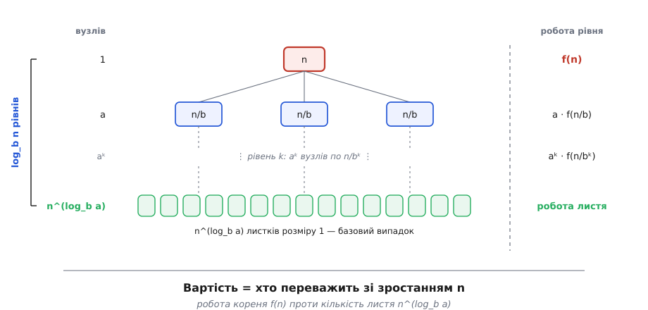
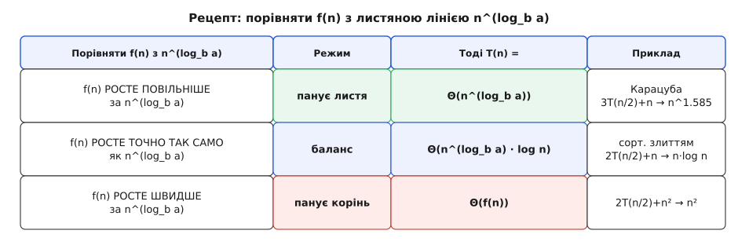

# Основна теорема про рекурентні співвідношення (master theorem)

<preknowlist>
- [Розділяй і володарюй](root:sf-algorithms/divide-and-conquer) — як задачу ділять на менші копії того самого вигляду, розв'язують кожну рекурсивно й зліплюють; звідси й беруться рекурентності, які ця теорема розв'язує.
- [Асимптотична складність (O великого)](root:computability/asymptotic-complexity) — Θ, O, Ω: як записують швидкість росту роботи від розміру входу; відповідь теореми — це Θ.
- [Двійковий логарифм](root:math-information/binary-logarithm) — скільки разів число ділиться навпіл до одиниці; він дає глибину поділу.
- [Рекурсія](root:sf-algorithms/recursion) — коли функція викликає саму себе на меншому вході; рушій, що породжує рекурентність.
</preknowlist>

Алгоритм, що ділить задачу навпіл, розв'язує половини й зліплює відповіді, записати легко — а от **скільки він працює**, з коду не видно. Час такого алгоритму задається не звичайною формулою, а **рекурентним співвідношенням** (лат. *recurrere* — вертатися: задача повертається до себе ж, тільки меншої):

```
T(n) = a · T(n/b) + f(n)
```

Читається просто: щоб розв'язати задачу розміру `n`, робимо `a` підзадач по `n/b` кожна й докладаємо `f(n)` роботи на сам поділ та зліплювання. Сортування злиттям — це `T(n) = 2·T(n/2) + n`: дві половини плюс лінійне злиття. Та саме рівняння відповіді ще не дає — `T` стоїть по обидва боки. Щоб дізнатися, куди воно сходить, доводиться розгортати рекурсію в **дерево** й руками рахувати роботу на кожному рівні. Робити це щоразу наново марудно й легко схибити. Хочеться машинки: заклав три числа `a`, `b`, `f(n)` — дістав відповідь. Ця машинка є, і зветься вона **майстер-теоремою** (англ. *master theorem* — «головна» теорема: один рецепт покриває цілий клас поділів).

## Три числа поділу

Уся будова поділу вміщається в три величини рекурентності.

```
a     — на скільки підзадач розпадається задача
b     — у скільки разів кожна підзадача менша
f(n)  — робота НЕ на рекурсію: поділ на частини плюс зліплювання розв'язків
```

`a` і `b` не зобов'язані збігатися, і саме їхнє суперництво вирішує все. Сортування злиттям ділить навпіл (`b = 2`) і бере **обидві** половини (`a = 2`). [Двійковий пошук](root:sf-algorithms/binary-search) теж ділить навпіл, але одну половину викидає (`a = 1`). Множення Карацуби ділить навпіл, а підзадач бере аж **три** (`a = 3`). Три різні долі вартості — і всі три випливуть із того самого рівняння.

## Дві сили, що змагаються

Розгорнімо поділ у дерево, щоб побачити, звідки взагалі береться відповідь. Корінь — задача `n`. З нього росте `a` гілок по `n/b`, з кожної — знову `a`, і так униз, поки розмір не впаде до одиниці. Скільки рівнів? Розмір ділиться на `b` щокроку, тож рівнів — [стільки разів, скільки `b` вкладається в `n` логарифмом](root:math-information/binary-logarithm), тобто **log_b n**.

Тепер найважливіше — **скільки листків** унизу дерева. Кількість вузлів множиться на `a` з кожним рівнем, а рівнів `log_b n`, тож листків `a^(log_b n)`. Коротка логарифмна тотожність перетворює цей незручний вираз на чистіший:

```
листків = a^(log_b n) = n^(log_b a)
```

Показник `log_b a` з'являтиметься постійно — назвімо його **критичним показником**. Він каже, як швидко росте кількість листя від розміру входу.

І ось де народжується відповідь. Уся вартість — це змагання **двох сил**. Угорі, у корені, робиться `f(n)` роботи. Унизу сидить `n^(log_b a)` листків, і кожен коштує бодай одиницю. Хто з них важчий зі зростанням `n` — той і вирішує підсумок. Незліченне дрібне листя переважує — вартість збирає **дно** дерева; корінь дорогий, а листя мало — панує **верх**; сили рівні — внесок дають усі рівні порівну.


*Дві сили поділу. Угорі корінь робить f(n); унизу — n^(log_b a) листків. Дерево має log_b n рівнів. Куди сходить уся вартість, вирішує те, хто важчий зі зростанням n: робота нагорі f(n) чи кількість листя внизу n^(log_b a).*

## Рецепт

Звідси й уся теорема: **порівняй роботу `f(n)` з листяною лінією `n^(log_b a)`** — і читай відповідь.

**Випадок 1 — панує листя.** `f(n)` росте повільніше за `n^(log_b a)`. Дно переважує:

```
T(n) = Θ(n^(log_b a))
```

**Випадок 2 — баланс.** `f(n)` росте точно як `n^(log_b a)`. Усі `log_b n` рівнів коштують однаково, додається логарифмічний множник:

```
T(n) = Θ(n^(log_b a) · log n)
```

**Випадок 3 — панує корінь.** `f(n)` росте швидше за `n^(log_b a)` (і поводиться пристойно — робота справді спадає донизу деревом). Заправляє верхній рівень:

```
T(n) = Θ(f(n))
```


*Рецепт у трьох рядках. Порахувати критичний показник c* = log_b a, порівняти роботу f(n) з листяною лінією n^(log_b a) — і виписати відповідь. Повільніше за листя → панує листя; урівні → баланс і зайвий log; швидше → панує корінь.*

Прогонимо рецепт наживо.

**Умова.** Три класичні поділи, кожен своїм випадком.

```
сортування злиттям:  T = 2T(n/2) + n     c* = log₂2 = 1        f = n¹ = n^c*   → баланс → Θ(n·log n)
двійковий пошук:     T =  T(n/2) + 1      c* = log₂1 = 0        f = 1  = n^c*   → баланс → Θ(log n)
множення Карацуби:   T = 3T(n/2) + n      c* = log₂3 ≈ 1.585    1 < 1.585       → листя  → Θ(n^1.585)
```

Три рядки — і складність кожного алгоритму без жодного намальованого дерева. Ту саму логіку легко закласти й у код: [кілька рядків, що за `a`, `b` і показником `f` називають випадок](root:computability/master-theorem/proj-master-classify.md).

> 🔧 **Навіщо це.** Майстер-теорема — це «усний рахунок» складності. Побачивши рекурсивний алгоритм, ви читаєте його час за секунди: полічили `a` й `b`, зважили роботу на зліплювання — готово, дерево малювати не треба. Ба більше, вона підказує, **як** проектувати. Зменшити число підзадач `a` на одиницю (як Карацуба з чотирьох множень до трьох, а Штрассен із восьми до семи) — і критичний показник, а з ним і вартість, помітно падає. Здешевити зліплювання `f(n)` — і, може, перескочиш із балансу в дешевший випадок. Теорема показує, яка саме ручка керує швидкістю.

## Де рецепт мовчить

Майстер-теорема — рецепт, а не всесильний оракул, і чесно знати її межу. Вона розв'язує **лише** рекурентності вигляду `T(n) = a·T(n/b) + f(n)` — рівні підзадачі однакового розміру. Між випадками лишаються **щілини**: функція, що росте повільніше за листя, але не на цілий множник `n^ε` (як-от `n^(log_b a)/log n`), застрягає між випадками 1 і 2, і теорема на неї не відповідає. Для таких щілин, а також для нерівних поділів (`T(n) = T(n/3) + T(2n/3) + n`) існує важчий інструмент — теорема Акри-Баззі. І сам «баланс» приховує тонкощі: строгість порівняння степенів і умову, що робота справді спадає деревом. Повне виведення всіх трьох випадків із однієї геометричної суми — [у математиці рекурентностей поділу](root:sf-algorithms/divide-and-conquer/math-recurrence.md).

Готовий рецепт для рекурентностей поділу вперше виклали 1980 року Джон Бентлі, Доротея Гакен (згодом Блостейн) і Джеймс Сакс; звичну назву «майстер-теорема» закріпив популярний підручник Кормена, Лейзерсона, Рівеста й Стайна — [звідки взявся цей рецепт і його ім'я](root:computability/master-theorem/hist-master-theorem.md).
