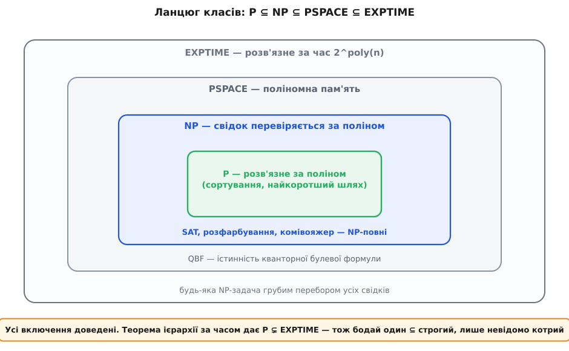
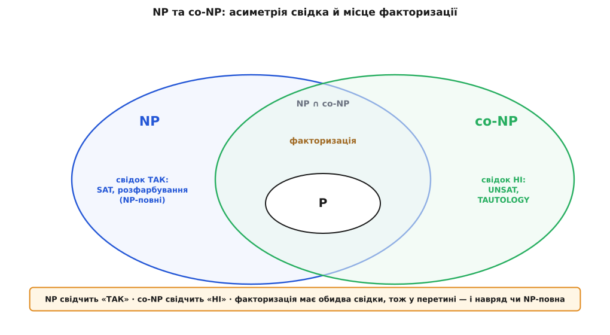

# 🧮 Класи P і NP — строго: мови, свідки, зведення

Інтуїцію «перевірити легше, ніж знайти» можна відчувати нутром, але доводити нею нічого не можна. Тільки-но ми захочемо стверджувати щось на кшталт «SAT — найважча задача в NP» або «усі NP-задачі розв'язні, лише повільно», гасло мусить стати теоремою — а теорема потребує означень настільки точних, щоб у них не лишилося жодної шпарини для двозначності. Ця вставка й будує такий скелет: що таке задача, що таке «швидко», що таке P і NP, коли одна задача не легша за іншу, і чому цілий поверх задач стоїть і падає разом. Кожне попереднє гасло теми тут перетвориться на твердження, яке можна довести.

## Задача-рішення — це мова

Перша й найважливіша спрощувальна умова: обмежуємося задачами з відповіддю **«так» або «ні»**. Не «знайди найкоротший маршрут», а «чи існує маршрут, коротший за 1000 км». Це не збіднення: майже будь-яку оптимізаційну задачу можна обернути на низку таких порогових питань (бінарним пошуком по межі), а натомість ми дістаємо кристально чисту форму, з якою зручно міркувати.

Тепер зауважмо, що вхід задачі — граф, число, формула — завжди можна записати як **рядок символів** над скінченним алфавітом Σ (зазвичай Σ = {0, 1}). А раз так, то вся задача-рішення зводиться до одного: розбити всі можливі рядки на два табори — ті, на яких відповідь «так», і всі інші. Множину рядків-«так» називають **мовою** (англ. *language*):

```
L ⊆ Σ*        Σ* — усі скінченні рядки над алфавітом Σ
x ∈ L         ⟺  на вході x відповідь задачі — «так»
```

«Розв'язати задачу на вході x» тепер означає буквально одне: **вирішити, чи належить рядок x мові L**. Ця заміна — задача стає мовою — не косметична: вона переводить питання складності в питання про множини рядків, де вже працює точний апарат [машини Тюринга](topic:computability/turing-machine), яка крок за кроком читає рядок і зупиняється з вердиктом «прийняти» або «відхилити». Розмір входу n = |x| — це просто довжина рядка; різні розумні способи кодування того самого об'єкта різняться щонайбільше поліномно, тож «розмір n» визначений однозначно з точністю до полінома, а більшого нам і не треба.

## P — клас, де є поліномний розв'язувач

Тепер точна межа «швидко». Кажуть, що мова L лежить у класі **P**, якщо існує машина Тюринга, яка на **кожному** вході x зупиняється з правильною відповіддю, витративши не більше ніж поліномне від довжини входу число кроків:

```
L ∈ P   ⟺   ∃ машина M, ∃ стала c :  для будь-якого x  M(x) = [x ∈ L]
                                       і M(x) зупиняється за ≤ |x|ᶜ кроків
```

Мовою класів часу це записують стисло. Позначмо TIME(f(n)) — усі мови, розв'язні за час O(f(n)); тоді P — це об'єднання по всіх степенях:

```
P = TIME(n) ∪ TIME(n²) ∪ TIME(n³) ∪ … = ⋃  TIME(nᶜ)
                                          c≥1
```

Чому саме поліном, а не якась конкретна межа на кшталт n²? Бо поліном — єдина межа, що не тріскається під власною вагою. Це помітили незалежно **Алан Кобем** (1965, праця «The intrinsic computational difficulty of functions») і **Джек Едмондс** (того ж 1965-го, «Paths, trees, and flowers»); відтоді ототожнення «здійсненне ⟺ поліномне» звуть **тезою Кобема–Едмондса**. Її сила у двох властивостях, які треба бачити ясно. По-перше, поліномність **не залежить від машини**: ідеальна машина Тюринга й реальний процесор моделюють один одного з поліномним накладом, тож поліном в одної моделі лишається поліномом і в іншої — межа P об'єктивна, а не артефакт вибору заліза. По-друге, поліноми **замкнені відносно складання**: поліном від полінома — знову поліном. Це не дрібниця, а фундамент: алгоритм, зібраний із поліномних частин (підпрограма в циклі, зведення перед розв'язувачем), лишається поліномним. Саме на цю замкненість спиратиметься транзитивність зведень — серце всієї теорії. Межа P не обіцяє «миттєво» (n¹⁰⁰ теж поліном), вона відділяє **де є надія** від **де стіна**.

## NP — два обличчя того самого класу

Клас NP означують двома, на перший погляд різними, способами. Дивовижа теорії в тому, що обидва задають **ту саму** множину мов — і побачити, чому, значить зрозуміти сам NP.

**Означення A — через перевіряч і свідка.** Мова L лежить у NP, якщо в неї є **поліномний перевіряч**: машина V(x, w), що дістає вхід x і додатковий рядок-**свідок** w (англ. *certificate* — посвідка), працює поліномний час і має властивість

```
x ∈ L   ⟺   ∃ w,  |w| ≤ p(|x|)  :   V(x, w) = прийняти
```

Тут критичні дві умови, і жодну не можна послабити. Перша: свідок **короткий** — його довжина обмежена поліномом p(|x|) від розміру входу. Друга: перевірка **дешева** — V працює поліномний час. Разом вони кажуть: «так»-відповідь завжди має короткий доказ, який швидко перевіряється. Знайти w може бути як завгодно важко — вимагається лише, щоб він **існував** і **перевірявся** швидко.

**Означення B — через недетерміновану машину.** Мова L лежить у NP, якщо її розв'язує **недетермінована** [машина Тюринга](topic:computability/turing-machine) за поліномний час. Звичайна (детермінована) машина на кожному кроці має рівно один наступний крок. Недетермінована на деяких кроках має **кілька** дозволених продовжень і ніби роздвоюється, породжуючи дерево обчислень; вона **приймає** вхід, якщо **бодай одна** гілка цього дерева доходить до «прийняти». Поліномний час означає, що кожна гілка не довша за p(n).

**Чому це те саме.** Рівність двох означень доводиться прямою побудовою в обидва боки — і кожен бік простий, коли ясно бачиш відповідність.

*З A випливає B.* Маємо перевіряч V і межу p(n) на довжину свідка. Будуємо недетерміновану машину так: спершу вона недетерміновано **вгадує** свідка — виписує p(n) символів, і на кожному робить недетермінований вибір (0 чи 1); потім детерміновано запускає V(x, w) на вгаданому w. На тій гілці, де вгадано «правильний» w (той, що годиться), V прийме — отже, машина прийме. Якщо ж жодного придатного w немає, V відхилить на всіх гілках. Час — поліном (p(n) кроків угадування плюс поліномний прогін V). Виходить недетермінований розв'язувач за поліном.

*З B випливає A.* Маємо недетерміновану машину N, що працює час p(n). Свідком оголошуємо **послідовність недетермінованих виборів уздовж однієї гілки** — а їх не більше p(n), тобто свідок короткий. Перевіряч V(x, w) тепер детерміновано **проганяє N по цих виборах**: на кожному недетермінованому кроці бере не «всі варіанти», а той, що записано у w, і дивиться, чи дійде до «прийняти». Один прогін — поліномний час. Якщо N приймала (була приймальна гілка), то її послідовність виборів і є свідок, на якому V прийме; якщо не приймала — жоден w не проведе V до «прийняти».

Ось де ховаються самі літери назви: **N** — недетермінована, **P** — поліномна. І ось звідки та казкова «здогадливість» із інтуїтивного опису: недетермінована гілка, що щасливо приймає, — це рівно короткий свідок, який хтось міг би нам подати. Дві мови, один клас.


*Два означення NP — одне ціле. Зліва «угадати свідка й перевірити його поліномним V»; справа «є недетермінована гілка, що приймає за поліном». Переклад між ними прямий: недетерміновані вибори машини — це рівно ті біти, що складають свідка, а перевіряч — це детермінований прогін машини вздовж однієї заданої гілки. Тому обидва означення задають ту саму множину мов.*

> 🔧 **Навіщо це.** Дві дефініції — не педантизм, а два робочі інструменти. Означення через свідка дає **практичний рецепт**: щоб довести L ∈ NP, придумай, що подавати як короткий доказ «так» і як його швидко перевірити (для SAT — набір значень; для маршруту — сам маршрут). Означення через недетерміновану машину дає **теоретичну ручку**: із ним природно рахувати час, будувати ієрархію класів і формулювати теорему Кука–Левіна. Володіти обома — значить перемикатися між «як це запрограмувати» і «як це довести», не втрачаючи, що йдеться про один об'єкт.

Одне включення тепер очевидне й важливе: **P ⊆ NP**. Якщо L розв'язується поліномною машиною напряму, то вона ж — тривіальний перевіряч, який просто **ігнорує** свідка й розв'язує сам. Отже, все легке автоматично лежить і в NP; цікаве — зворотне, і воно відкрите.

## Зведення ≤ₚ — терези важкості

Щоб порівнювати важкість двох задач, не знаючи точної ціни жодної, потрібне поняття **поліномного багато-однозначного зведення** (англ. *polynomial-time many-one reduction*, або зведення Карпа). Кажуть, що мова A **зводиться** до мови B, і пишуть A ≤ₚ B, якщо є поліномно обчислювана функція-перекладач f, яка зберігає відповідь:

```
A ≤ₚ B   ⟺   ∃ функція f, обчислювана за поліном :
             для будь-якого x     x ∈ A  ⟺  f(x) ∈ B
```

Слово **багато-однозначне** (*many-one*) уточнює природу перекладу: f може відображати багато різних x у той самий образ, але це **одна** функція, яку застосовують **один раз**, а результат f(x) віддають розв'язувачу B **як єдине запитання**. Це слабший, а тому цінніший інструмент, ніж зведення з оракулом (де B можна питати багато разів): чим скромніший переклад, тим сильніший висновок, коли він таки вдається.

Напрям висновку — головне. Дешевий переклад A ≤ₚ B каже, що **B не легша за A**. Формально це видно з властивості, яка робить зведення осмисленим:

**Замкненість P униз за ≤ₚ.** Якщо B ∈ P і A ≤ₚ B, то A ∈ P. Доведення — пряме склеювання: щоб розв'язати A на x, обчисли f(x) за поліном, тоді запусти поліномний розв'язувач B на f(x); за означенням зведення його відповідь — це і є відповідь для A. Два поліномні кроки поспіль — знову поліном. Отже, якби B була легка, легкою стала б і A; тому важкість A «перетікає» на B проти напряму перекладу.

Дві структурні властивості ≤ₚ роблять із нього справжні терези.

**Рефлексивність: A ≤ₚ A.** Перекладач — тотожність f(x) = x, обчислювана миттєво. Кожна задача зводиться сама до себе — банально, але потрібне для того, щоб ≤ₚ був передпорядком.

**Транзитивність: якщо A ≤ₚ B і B ≤ₚ C, то A ≤ₚ C.** Тут ховається єдина тонкість усієї конструкції, і її варто побачити до кінця. Маємо f (переклад A→B, час ≤ nᵃ) і g (переклад B→C, час ≤ mᵇ на вході довжини m). Композиція g(f(x)) — кандидат на переклад A→C. Чому вона поліномна? Обчислити f(x) — час nᵃ. Але яка довжина проміжного рядка f(x)? Ось ключ: машина, що працює час nᵃ, **фізично не встигає записати більше ніж nᵃ символів** — за крок пишеться щонайбільше один. Тому |f(x)| ≤ nᵃ. Отже, g працює на вході розміру ≤ nᵃ і витрачає ≤ (nᵃ)ᵇ = n^(a·b) кроків. Сумарно n^a + n^(ab) — поліном.

```
x  ──f (nᵃ)──▶  f(x)   ──g ((nᵃ)ᵇ)──▶  g(f(x))
   |f(x)| ≤ nᵃ   (за час nᵃ не запишеш більше нᵃ символів)
   разом:  nᵃ + n^(a·b)  — знову поліном
```

Саме тому «поліном» — правильна мірка дешевизни перекладу: тільки замкненість поліномів відносно складання (і той факт, що поліномна машина породжує поліномний вихід) гарантує, що важкість передається **ланцюжком** як завгодно далеко. З рефлексивністю й транзитивністю ≤ₚ — **передпорядок** (англ. *preorder*). Він не антисиметричний: дві задачі можуть зводитися одна до одної, не бувши тотожними, — тоді їх звуть **поліномно рівносильними** (однаково важкими з точністю до полінома).

## NP-важка й NP-повна — строго

Тепер два означення, заради яких будувався весь апарат. Вони розводять два близькі, але різні поняття.

```
L — NP-важка   ⟺   для КОЖНОЇ A ∈ NP :  A ≤ₚ L

L — NP-повна   ⟺   (1) L ∈ NP   І   (2) L — NP-важка
```

**NP-важкість** — це «не легша за все в NP»: до L зводиться будь-яка NP-задача. Зверни увагу, чого тут **немає** — не вимагається, щоб сама L лежала в NP чи взагалі була задачею-рішенням. Тому NP-важка задача може бути **важчою** за NP. **NP-повна** — вужче: NP-важка **та ще й сама в NP**. Це найважчі задачі **всередині** NP — верхня межа класу, досягнута зсередини.

З означень одразу випливає твердження, що надає їм ваги. **Якщо бодай одна NP-повна L лежить у P, то P = NP.** Доведення: візьмімо будь-яку A ∈ NP. Оскільки L NP-важка, A ≤ₚ L; оскільки L ∈ P — за замкненістю P униз A ∈ P. Тобто **кожна** A ∈ NP лежить у P, отже NP ⊆ P; разом із P ⊆ NP це дає P = NP. І навпаки за контрапозицією: якщо P ≠ NP, то **жодна** NP-повна задача не має поліномного алгоритму. Ось математичний зміст гасла «стоять і падають разом»: замкненість униз плюс транзитивність зведень зшивають долю всього класу з долею однієї задачі.

## Теорема Кука–Левіна — перший універсальний ключ

Лишається питання, від якого все залежить: чи існує бодай одна NP-повна задача? Умова (2) вимагає, щоб до L зводилося **все** NP, — це звучить надто сильно, щоб хтось її задовольняв. Відповідь — так, існує, і це поворотний пункт теорії.

**Теорема (Кук, 1971; незалежно Левін, опубл. 1973).** [Задача здійсненності SAT](topic:computability/boolean-satisfiability) — NP-повна. Тобто SAT ∈ NP (свідок — набір значень змінних, перевірка — підстановка) і для кожної A ∈ NP справджується A ≤ₚ SAT.

Легка частина — SAT ∈ NP — очевидна. Уся сила в другій: **будь-яку** NP-задачу можна за поліном перекласти в питання про здійсненність булевої формули. Ідея (без повного доведення) така: взяти недетерміновану машину, що розв'язує A за час p(n), і **закодувати весь її обчислювальний процес** — стрічку на кожному кроці, стан, положення голівки — набором булевих змінних; тоді правила машини записуються як логічні обмеження, а вся формула виходить здійсненною **рівно тоді**, коли існує приймальна гілка, тобто коли x ∈ A. Повний розбір цієї побудови «обчислення як формула» винесено окремо: [історія відкриття по два боки завіси](topic:computability/boolean-satisfiability/hist-cook-levin.md) — від Кука в Торонто до Левіна, уродженця Дніпра, — і [технічний бік із зведеннями](topic:computability/boolean-satisfiability/math-reductions.md).

Чому ця теорема — стрижень усього? Бо вона дає **перший** NP-повний об'єкт, а далі спрацьовує транзитивність. Щоб довести NP-повноту **нової** задачі L, більше не треба зводити до неї все NP заново — досить (а) показати L ∈ NP і (б) звести до L **одну вже відому** NP-повну задачу, скажімо SAT (SAT ≤ₚ L). Тоді для будь-якої A ∈ NP маємо A ≤ₚ SAT ≤ₚ L, і за транзитивністю A ≤ₚ L. Один поліномний перекладач замість універсального доведення — ось чому 1972 року Річард Карп зумів довести NP-повноту двадцяти однієї класичної задачі майже конвеєром, а сьогодні їх відомо тисячі.

## Драбина класів: P ⊆ NP ⊆ PSPACE ⊆ EXPTIME

NP-повнота лякає, аж поки не поставити її на місце в ширшій драбині. Введімо ще два класи — тепер міркою стає не тільки час, а й **пам'ять**:

```
PSPACE  = ⋃ SPACE(nᶜ)      розв'язне з ПОЛІНОМНОЮ пам'яттю (час будь-який)
EXPTIME = ⋃ TIME(2^(nᶜ))    розв'язне за ЕКСПОНЕНЦІЙНИЙ час
```

Стверджується ланцюг включень, і кожну ланку варто довести — бо саме з останньої випливає, що NP-задачі взагалі **розв'язні**.

```
P  ⊆  NP  ⊆  PSPACE  ⊆  EXPTIME
```

**P ⊆ NP** — уже доведено: детермінований розв'язувач є перевірячем, що ігнорує свідка.

**NP ⊆ PSPACE.** Візьмімо L ∈ NP з перевірячем V і межею p(n) на свідка. Розв'яжімо L так: **переберімо всі** можливі свідки w довжини ≤ p(n) — по одному — і на кожному запустімо V(x, w); якщо хоч один прийме, відповідь «так». Часу це з'їдає експоненту (свідків 2^p(n)), але **пам'яті** — обмаль: тримаємо лише поточний w (це p(n) біт) плюс поліномну робочу пам'ять V, а перед наступним свідком усе **перезатираємо**, повторно використовуючи те саме місце. Поліномна пам'ять — отже L ∈ PSPACE.

**PSPACE ⊆ EXPTIME.** Машина з поліномною пам'яттю s = poly(n) має скінченне число різних **конфігурацій** (стан + вміст стрічки + положення голівки) — не більше ніж 2^O(s). Якщо вона зупиняється, то не може двічі побувати в одній конфігурації (інакше зациклилась би вічно), тож робить щонайбільше 2^O(s) = 2^poly(n) кроків. Це — експоненційний час, отже PSPACE ⊆ EXPTIME.

Найважливіша ланка — остання, і до неї є **прямий** шлях, без PSPACE, який варто побачити наочно, бо саме він знімає весь містицизм із NP-повноти.

**NP ⊆ EXPTIME — грубий перебір свідків.** Той самий перебір усіх 2^p(n) свідків, але тепер рахуємо час: свідків не більше 2^p(n), на кожному V працює поліном, разом 2^p(n) · poly(n) = 2^O(p(n)) — експонента. Це не оцінка згори якогось хитрого методу, а **готовий, цілком означений алгоритм**, який завжди дає правильну відповідь:

```python
from itertools import product

def solve_np(x, verify, p):
    """Універсальний розв'язувач будь-якої NP-задачі: перебрати всіх свідків.
       verify(x, w) — поліномний перевіряч; p — межа на довжину свідка."""
    m = p(len(x))                          # свідок не довший за p(|x|)
    for bits in product((0, 1), repeat=m): # усі 2^m рядків-свідків
        if verify(x, bits):                # знайшовся придатний свідок
            return True                    #   → відповідь «так»
    return False                           # жоден не підійшов → «ні»

# Задача про суму підмножини як NP-мова: свідок — маска вибраних чисел.
def subset_sum_verify(inst, mask):
    nums, target = inst
    return sum(v for v, b in zip(nums, mask) if b) == target

solve_np(([3, 34, 4, 12, 5, 2], 9), subset_sum_verify, p=lambda n: n)  # True
```

Висновок звідси — не технічний, а світоглядний: **кожна** NP-задача **розв'язна** цим циклом. Немає жодної NP-задачі, перед якою алгоритм безсилий у принципі, — усі вони мають чесний метод. Уся біда лише в тому, що `product((0,1), repeat=m)` перебирає 2ᵐ варіантів, і цикл дихає експонентою. NP-повнота — це межа **практично** обчислюваного, а не обчислюваного взагалі; за нею стоять зовсім інші звірі — [нерозв'язні задачі, як проблема зупинки](topic:computability/halting-problem), де алгоритму немає **ні за яку** ціну часу.


*Драбина класів як вкладені множини. P (найглибше) — розв'язне за поліном; NP — свідок перевіряється за поліном; PSPACE — вистачає поліномної пам'яті; EXPTIME — розв'язне за експоненційний час, і сюди грубим перебором свідків потрапляє **весь** NP. Усі включення доведені. Хитрість у тому, що жодне з них не відоме як строге поокремо — але теорема ієрархії за часом (Гартманіс і Стернс, 1965) доводить P ⊊ EXPTIME, тобто ланцюг не може бути суцільними рівностями: **десь** усередині є строгий стрибок, лише невідомо котрий (зокрема, чи то P ⊊ NP).*

Остання думка про драбину — тонка й красива. Кожне включення доведене, але **жодне не доведене як строге** окремо: може статися, що P = NP, а може — що ні. Проте разом усе не може злипнутися: теорема ієрархії за часом дає **P ⊊ EXPTIME** (більше часу — строго більше задач). Отже, у ланцюзі P ⊆ NP ⊆ PSPACE ⊆ EXPTIME **бодай один** знак ⊆ насправді строгий — ми точно знаємо, що стрибок є, але не вміємо показати, **де** саме. Питання «P проти NP» — здогад про те, що перший же стрибок стається вже між P і NP.

## co-NP і чому факторизація навряд чи NP-повна

Означення NP несе приховану **асиметрію**: короткий свідок обіцяно лише для відповіді «так». Дзеркальний клас вирівнює перекіс. Мова L лежить у **co-NP**, якщо в NP лежить її **доповнення** — мова всіх «ні»-входів:

```
co-NP = { L : доповнення L̄ належить NP }
      = задачі, де коротко засвідчується відповідь «НІ»
```

Приклад робить різницю відчутною. [SAT](topic:computability/boolean-satisfiability) ∈ NP: щоб довести «формула здійсненна», подають придатний набір значень — короткий свідок «так». А задача-доповнення UNSAT («формула **не**здійсненна») та TAUTOLOGY («формула істинна за **всіх** значень») лежать у co-NP: коротко засвідчити «так, тавтологія» важко (треба перебрати всі набори), зате «ні, не тавтологія» доводиться одним контрприкладом — набором, де формула хибна. NP питає короткий доказ «так»; co-NP — короткий доказ «ні».

Чи збігаються NP і co-NP — відкрите питання, і майже всі певні, що **ні** (NP ≠ co-NP). З цього припущення випливає тонкий, але потужний висновок про межі NP-повноти.

**Якщо якась NP-повна задача лежить і в co-NP, то NP = co-NP.** Доведення тим самим прийомом: хай L NP-повна і L ∈ co-NP. Клас co-NP замкнений униз за ≤ₚ (доповнення зводиться дзеркально), тож для будь-якої A ∈ NP з A ≤ₚ L і L ∈ co-NP випливає A ∈ co-NP. Отже NP ⊆ co-NP, а симетрично й навпаки — тобто NP = co-NP. Оскільки в рівність не вірять, **NP-повна задача майже напевно не може сидіти в co-NP**.

Тепер [розклад числа на множники](topic:sf-security/rsa). Його задача-рішення — «чи має число m дільник d в межах 1 < d < k?» — лежить **одразу в двох** класах. У NP: свідок «так» — сам дільник d, перевірка — одне ділення. У co-NP: свідок «ні» — **повний розклад m на прості**; перевіряч множить прості назад у m, засвідчує простоту кожного (простота — у P, це довели Аґравал, Каял і Саксена 2002 року) і бачить, що жоден простий не менший за k, тобто дрібного дільника немає. Отже факторизація ∈ NP ∩ co-NP. А тоді за щойно доведеним: **якби вона була NP-повна, то NP = co-NP** — у що не вірять (упав би й поліномний ієрархічний поверх над NP). Тому факторизацію відносять до ймовірних **проміжних** задач: важча за P (наскільки відомо), але не з найважчих у NP.


*NP і co-NP та їхній перетин. У NP коротко засвідчується «так», у co-NP — «ні»; NP-повні задачі (SAT) сидять у NP, але, найпевніше, поза co-NP. У перетині NP ∩ co-NP лежить увесь P — і факторизація, бо в неї є обидва свідки: дільник для «так» і повний простий розклад для «ні». Саме це членство робить факторизацію непридатною на роль NP-повної: NP-повнота потягла б увесь NP у co-NP. І саме тому [RSA](topic:sf-security/rsa) будують на факторизації, а не на NP-повній задачі, — її твердість тонша, не «все або нічого» разом із питанням P проти NP.*

> 🔧 **Навіщо це.** Пара NP / co-NP — робочий фільтр підозри. Побачивши задачу **водночас** у NP і в co-NP (обидва свідки — і на «так», і на «ні»), ставте на те, що вона **не** NP-повна: інакше злипнулися б NP і co-NP. Це не лінощі, а тверезий орієнтир — так криптографи розуміють, що твердість факторизації не тотожна питанню P проти NP, а живе у власній, делікатнішій зоні; ламати RSA — не те саме, що розв'язати весь NP.

---

Отак інтуїтивні гасла теми стають доказовими твердженнями. «Задача» — це **мова** L ⊆ Σ*; «легко» — це **P** = ⋃ TIME(nᶜ); «легко перевірити» — це **NP**, і два його обличчя (короткий свідок · недетермінована гілка) — той самий клас. «B не легша за A» — це **A ≤ₚ B**, поліномний перекладач, а рефлексивність із транзитивністю роблять із ≤ₚ терези важкості. «Найважчі в NP» — це **NP-повні** задачі, і замкненість P униз доводить, що поліномний розв'язок однієї означав би P = NP. Першу таку задачу дала **теорема Кука–Левіна** (SAT ∈ NPC). Драбина P ⊆ NP ⊆ PSPACE ⊆ EXPTIME ставить NP-повноту на місце: усі ці задачі **розв'язні** грубим перебором свідків за експоненту, тож межа тут — не обчислюваного, а практично обчислюваного; а теорема ієрархії гарантує, що бодай один стрибок у драбині строгий, лише ховає, котрий. І нарешті **co-NP** пояснює, чому факторизація — основа RSA — навряд чи NP-повна: сидячи в NP ∩ co-NP, вона стягнула б увесь NP у co-NP, якби була найважчою. Скелет зібрано — і на ньому вже тримається кожне «очевидно» цієї теми.
