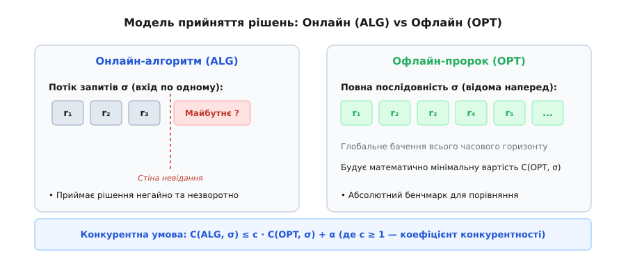
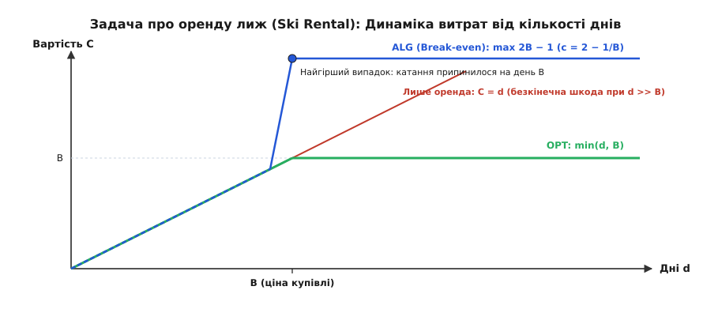
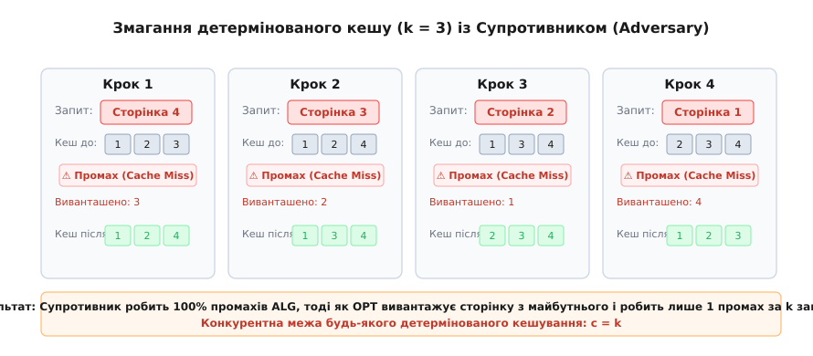

# Онлайнові алгоритми й конкурентний аналіз

<preknowlist>
- [Асимптотична складність](root:computability/asymptotic-complexity) — як оцінювати алгоритми у найгіршому разі за допомогою нотації O великого.
- [Амортизований аналіз](root:computability/amortized-analysis) — як оцінювати середню вартість послідовності операцій у найгіршому разі без ймовірностей.
</preknowlist>

Уявіть, що ви приїхали на гірськолижний курорт. Ви не знаєте, наскільки вам сподобається кататися чи якою буде погода завтра. Можливо, ви покатаєтеся лише один день і зламаєте ногу, а можливо, проведете на трасі три тижні поспіль. Щодня перед вами постає вибір: орендувати лижі за 10 доларів на день чи одразу купити власні за 100 доларів?

Якщо ви орендуватимете лижі щодня, а покатаєтеся місяць, ви витратите 300 доларів замість 100 — і пожалкуєте, що не купили їх першого ж дня. Якщо ж ви купите лижі за 100 доларів, а покатаєтеся лише один день, ви втратите 90 доларів даремно — і пожалкуєте, що не орендували.

Головна складна суть цієї ситуації полягає в тому, що **ви мусите приймати рішення негайно, не знаючи майбутнього**.

Традиційний класичний аналіз алгоритмів припускає, що всі вхідні дані відомі заздалегідь. Коли ви сортуєте масив чи шукаєте найкоротший шлях на графі, весь масив чи граф повністю лежить у пам'яті комп'ютера. Такі алгоритми називаються **офлайновими** (offline algorithms).

Однак величезний клас реальних систем працює у зовсім інших умовах. Операційній системі приходять запити на читання сторінок пам'яті по одному. Мережевому роутеру приходять пакети без знання майбутнього трафіку. Хмарному середовищу приходять завдання від користувачів без інформації про те, коли вони завершаться. Системи, які мусять приймати незворотні рішення на основі поточних запитів без знання майбутніх вхідних даних, називаються **онлайновими алгоритмами** (online algorithms).

Як математично об'єктивно оцінити якість алгоритму, якщо його успіх залежить від майбутнього, яке йому невідоме?

Відповіддю на це запитання став **конкурентний аналіз** (competitive analysis). Замість марних спроб вгадати майбутнє за допомогою ймовірнісних припущень, конкурентний аналіз порівнює результат онлайнового алгоритму з результатом ідеального, всезнаючого «пророка» — офлайнового алгоритму, який знає весь потік запитів наперед.

---

## Модель прийняття рішень: Онлайн проти Офлайн

Щоб побудувати чітку фізичну та логічну модель, розділимо процес обробки даних на часові кроки. На вхід алгоритму надходить послідовність запитів:
```
σ = (r₁, r₂, r₃, ..., r_m)
```

На кожному кроці i онлайновий алгоритм ALG отримує новий запит r_i і мусить виконати певну дію, яка тягне за собою витрати C(ALG, r_i). Головні обмеження онлайнового режиму:
1. **Інформаційний бар'єр**: Під час прийняття рішення на кроці i алгоритм бачить лише минуле та теперішнє (r₁, ..., r_i). Майбутні запити (r_{i+1}, ..., r_m) повністю приховані за стіною невизначеності.
2. **Незворотність рішень**: Прийняте рішення не можна «скасувати» без додаткових витрат. Якщо сторінку пам'яті вивантажено на диск, її повернення вимагатиме повторного зчитування.


*Конкурентна модель порівнює онлайновий алгоритм ALG, що діє «наосліп» покроково, із всезнаючим офлайновим алгоритмом OPT, який будує глобально оптимальний план дій.*

Натомість ідеальний офлайновий алгоритм (позначається як **OPT**) володіє абсолютним знанням усієї послідовності σ ще до початку обробки. Він обчислює таке узгоджене рішення для всіх кроків разом, яке дає математично мінімально можливу сумарну вартість C(OPT, σ).

Звісно, у реальному житті всезнаючого OPT не існує — це теоретична абстракція. Проте саме OPT слугує золотим стандартом і абсолютним бенчмарком. Якщо онлайновий алгоритм працює лише на 20% гірше за всезнаючого пророка, ми можемо стверджувати, що він працює чудово, незалежно від складності вхідних даних.

---

## Поняття Competitive Ratio (Конкурентного співвідношення)

Як сформулювати порівняння алгоритму ALG з оптимумом OPT у вигляді жорсткої математичної гарантії?

У 1985 році Деніел Слейтор і Роберт Тарджан запропонували метрику **конкурентного співвідношення** (Competitive Ratio).

Онлайновий алгоритм ALG називається **c-конкурентним** (c-competitive), якщо існує така константа c ≥ 1 та додатне число α ≥ 0, що для **будь-якої** вхідної послідовності запитів σ виконується нерівність:
```
C(ALG, σ) ≤ c · C(OPT, σ) + α
```

Значення c називається **коефіцієнтом конкурентності**. Вносьте це поняття у свою інтуїцію як «максимальну ціну невідання майбутнього» (price of ignorance):
- Якщо c = 1, онлайновий алгоритм працює так само ідеально, як і всезнаючий пророк (у реальних онлайнових задачах c = 1 трапляється вкрай рідко).
- Якщо c = 2, онлайновий алгоритм гарантує, що його сумарні витрати ніколи не перевищать подвоєних витрат всезнаючого пророка, хоч якою лихою чи підступною виявиться послідовність запитів.
- Число α — це стала величина, яка компенсує початкові відмінності у стані системи (наприклад, початковий вміст кешу) і не залежить від довжини послідовності σ.

Ключова сила конкурентного аналізу полягає у тому, що нерівність мусить виконуватися для **будь-якої** послідовності σ. Щоб оцінити алгоритм у найгіршому разі, ми уявляємо зловмисного **супротивника** (Adversary). Супротивник знає код нашого алгоритму ALG і спеціально конструює найгірший можливий потік запитів σ, намагаючись змусити ALG зробити якомога більше помилок, водночас мінімізуючи власні витрати C(OPT, σ).

> 🔧 **Навіщо це.** Конкурентний аналіз дає гарантії там, де класична нотація O великого безсила. Складність за часом у більшості онлайнових алгоритмів на один запит становить O(1) або O(log k). Але нотація O показує лише обчислювальний час процесора, вона не каже, наскільки *якісним* є прийняте рішення. Конкурентне співвідношення оцінює саме *якісну ефективність* рішень у порівнянні з ідеалом.

---

## Задача про оренду лиж: стратегія звитяжної межі

Повернімося до задачі про оренду лиж (Ski Rental Problem) і проаналізуємо її через призму конкурентного аналізу.

Нехай вартість оренди лиж на один день становить 1 долар, а ціна купівлі нових лиж становить B доларів. Ми не знаємо загальну кількість днів d, протягом яких будемо кататися.

Розглянемо базові детерміновані стратегії:
1. **Стратегія «Завжди орендувати»**: Якщо ми катаємося d днів, наші витрати дорівнюють C = d. Якщо d виявиться значно більшим за B (наприклад, d = 1000 при B = 10), наші витрати будуть у 100 разів більшими за OPT (який просто купив би лижі за 10 доларів першого дня). Коефіцієнт конкурентності такої стратегії нескінченний (c = ∞).
2. **Стратегія «Купити першого дня»**: Витрати C = B. Якщо d = 1 (ми покаталися один день і припинили), OPT орендував би лижі за 1 долар. Наші витрати у B разів більші за OPT. Коефіцієнт конкурентності c = B. Для великих B це дуже песимістично.

Чи існує найкраща детермінована стратегія?

Логіка підказує шукати точку беззбитковості (break-even point). Розумний алгоритм має орендувати лижі доти, доки сума оренди не зрівняється з ціною купівлі B, і лише після цього купити їх.

**Пороговий детермінований алгоритм (Break-even Algorithm)**:
- Орендувати лижі перші B − 1 днів.
- На день B купити лижі за B доларів.


*Динаміка витрат у задачі про оренду лиж. Пороговий онлайновий алгоритм гарантує, що витрати не перевищать 2B − 1, досягаючи конкурентного співвідношення c = 2 − 1/B.*

Обчислимо конкурентне співвідношення цієї стратегії для різних варіантів кількості днів d:

- **Випадок 1: d < B** (катання припинилося раніше дня B).
  Алгоритм орендував лижі d днів, витративши d доларів.
  Оптимум OPT також орендував лижі d днів і витратив d доларів.
  Співвідношення: C(ALG) / C(OPT) = d / d = 1.

- **Випадок 2: d ≥ B** (катання тривало B днів або довше).
  Алгоритм орендував лижі B − 1 днів (витратив B − 1) і на день B купив їх за B. Загальні витрати ALG:
  ```
  C(ALG) = (B − 1) + B = 2B − 1
  ```
  Офлайновий оптимум OPT, знаючи наперед, що d ≥ B, купив лижі першого дня за B доларів:
  ```
  C(OPT) = B
  ```
  Зважимо співвідношення у найгіршому разі (який настає точно при d = B):
  ```
  c = C(ALG) / C(OPT) = (2B − 1) / B = 2 − 1/B < 2
  ```

Висновок вражає: проста порогова стратегія гарантує, що ви **ніколи не витратите більше ніж удвічі проти ідеального рішення**, навіть якщо майбутнє абсолютно невідоме! Більше того, можна довести, що жоден детермінований онлайновий алгоритм не може досягти коефіцієнта меншого за 2 − 1/B.

---

## Класична задача заміни сторінок кешу (Paging Problem)

Задача про оренду лиж чудово демонструє суть, але найважливішим практичним застосуванням конкурентного аналізу стала **задача заміни сторінок кешу** (Paging Problem).

Уявимо оперативну пам'ять як кеш, що може вмістити фіксовану кількість k сторінок. Сукупний обсяг віртуальної пам'яті на диску значно більший і містить N сторінок (де N > k).

Процесор генерує потік запитів до сторінок σ = (r₁, r₂, ..., r_m).
- Якщо запитана сторінка r_i вже перебуває у кеші, виникає **влучання** (cache hit) — вартість 0.
- Якщо сторінки r_i немає в кеші, виникає **промах** (cache miss) — вартість 1. Система мусить завантажити r_i з диска. Якщо кеш заповнений (містить k сторінок), одну з наявних сторінок доводиться вивантажити.

Мета будь-якого алгоритму пейджингу — мінімізувати загальну кількість промахів кешу.

Розглянемо найвідоміші детерміновані алгоритми:
- **FIFO (First-In, First-Out)**: вивантажує сторінку, що потрапила до кешу раніше за інші.
- **LRU (Least Recently Used)**: вивантажує сторінку, до якої зверталися найдавніше.
- **LFU (Least Frequently Used)**: вивантажує сторінку з найменшою лічильною частотою звернень.

А як поводиться офлайновий оптимум OPT? Як довів Ласло Бєладі у 1966 році, **алгоритм Бєладі (OPT)** вивантажує ту сторінку, наступне звернення до якої станеться найпізніше у майбутньому.

---

## Теорема Слейтора-Тарджана: Нижня межа детермінованих алгоритмів

Яким є конкурентне співвідношення LRU та FIFO? Чи можна вигадати детермінований алгоритм, який працюватиме суттєво краще?

У 1985 році Деніел Слейтор і Роберт Тарджан довели фундаментальну теорему, що встановила точні межі можливостей для детермінованих алгоритмів кешування.

**Теорема Слейтора-Тарджана:**
1. Коефіцієнт конкурентності алгоритмів LRU та FIFO для кешу розміру k дорівнює точно **k**:
   ```
   C(LRU, σ) ≤ k · C(OPT, σ)
   ```
2. Жоден детермінований онлайновий алгоритм заміни сторінок не може мати коефіцієнт конкурентності менший за **k**.


*Конструювання найгіршого випадку: супротивник запитує єдину сторінку з (k+1), якої немає в кеші ALG. ALG робить промах на кожному кроці (100% промахів), тоді як OPT вивантажує сторінку з майбутнього і робить лише 1 промах за k кроків.*

Простежмо за логікою доведення цієї нижньої межі.

Нехай наш кеш має розмір k = 3, а загальна множина сторінок у системі містить N = k + 1 = 4 сторінки: {1, 2, 3, 4}.

Нехай початковий вміст кешу детермінованого алгоритму ALG становить {1, 2, 3}.

Супротивник знає алгоритм ALG. На кожному кроці супротивник дивиться на поточний кеш ALG і запитує **саме ту 4-ту сторінку, якої в кеші ALG зараз немає**:
1. Початковий кеш ALG: {1, 2, 3}. Супротивник запитує сторінку **4**. Промах у ALG! ALG вивантажує, наприклад, сторінку 3. Новий кеш ALG: {1, 2, 4}.
2. Супротивник бачить кеш {1, 2, 4} і негайно запитує сторінку **3**. Промах у ALG! ALG вивантажує 2. Новий кеш: {1, 3, 4}.
3. Супротивник запитує сторінку **2**. Промах у ALG! ALG вивантажує 1. Новий кеш: {2, 3, 4}.
4. Супротивник запитує сторінку **1**. Промах у ALG!

У результаті алгоритм ALG робить промах на **кожному** кроці! За m запитів алгоритм ALG здійснить точно **m промахів**.

А що робить всезнаючий OPT на цій же послідовності (4, 3, 2, 1, 4, 3, 2, 1, ...)?
OPT знає майбутнє. У момент першого промаху OPT дивиться вперед на k наступних запитів. Оскільки в системі всього k + 1 = 4 різних сторінок, серед наступних k запитів одна зі сторінок обов'язково **не буде запитана**. OPT вивантажує саме її!

Тому OPT робить лише **1 промах за кожні k запитів**. Сумарна кількість промахів OPT становитиме m / k.

Обчислюємо співвідношення витрат у найгіршому разі:
```
c = C(ALG, σ) / C(OPT, σ) = m / (m / k) = k
```

Отже, c = k — це непорушна теоретична межа для будь-якого детермінованого алгоритму. Якщо ваш кеш має розмір k = 1000 сторінок, супротивник може змусити будь-який детермінований алгоритм помилятися у 1000 разів частіше за OPT.

---

## Подолання бар'єра через рандомізацію та алгоритм Маркера

Чи означає коефіцієнт k, що онлайнове кешування приречене на песимістичну оцінку у великих кешах?

Ні! Секрет подолання цього бар'єра полягає у **рандомізації** (Randomization). Супротивник будує найгірший випадок, чітко знаючи, яку сторінку алгоритм вивантажить наступною. Якщо алгоритм підкидає монетку і приймає випадкові рішення, супротивник більше не може передбачити стан кешу.

У 1991 році Амос Фіат, Річард Карп, Христос Пападімітріу та їхні колеги ввели **Маркерний алгоритм** (Marker Algorithm).

### Як працює маркерний алгоритм Фіата:
1. Робота алгоритму розбивається на **фази**.
2. Кожна сторінка в кеші має прапорець — біт маркування (marked/unmarked). На початку фази всі сторінки незамарковані.
3. Коли відбувається звернення до сторінки r_i (влучання чи новий промах), ця сторінка позначається як **замаркована**.
4. Якщо виникає промах і кеш повний:
   - Алгоритм вибирає **випадковим чином рівномірно** одну з **незамаркованих** сторінок у кеші й вивантажує її.
5. Якщо промах стався тоді, коли **всі k сторінок у кеші вже замарковані**, поточна фаза завершується. Прапорці всіх сторінок скидаються в false, і починається нова фаза.

Завдяки тому, що алгоритм обирає сторінку для вивантаження випадково серед усіх незамаркованих, супротивник (а саме забудькуватий супротивник, Oblivious Adversary) не знає, які саме сторінки лишилися в кеші.

**Теорема Фіата:**
Конкурентне співвідношення рандомізованого Маркерного алгоритму проти забудькуватого супротивника становить:
```
c = 2 H_k ≈ 2 ln k
```
де H_k = 1 + 1/2 + 1/3 + ... + 1/k — k-те гармонічне число.

Порівняємо детерміновану та рандомізовану межі для різних розмірів кешу k:

| Розмір кешу k | Детермінована межа (c = k) | Рандомізована межа Marker (c ≈ 2 ln k) |
|---|---|---|
| k = 10 | 10 | ≈ 4.6 |
| k = 100 | 100 | ≈ 9.2 |
| k = 1000 | 1000 | ≈ 13.8 |
| k = 1 000 000 | 1 000 000 | ≈ 27.6 |

Випадковий вибір знижує ціну невідання майбутнього з лінійної залежності k до логарифмічної O(ln k)! Це один із найвидатніших результатів у теорії алгоритмів.

---

## Практичні застосування у реальних системах

Конкурентний аналіз — це не просто елегантна математична теорія. Він лежить в основі проєктування багатьох критично важливих інженерних систем:

1. **Управління пам'яттю операційних систем (Linux / Windows / macOS)**:
   ОС використовують гібридні варіанти LRU (наприклад, алгоритм 2Q чи Clock/Second-Chance). Конкурентна теорія пояснює, чому ці евристики стійкі до сплесків трафіку.
2. **Розподілене кешування (Redis / Memcached / CDN)**:
   При переповненні оперативно вивантажуються об'єкти за рандомізованими алгоритмами, подібними до алгоритму Маркера (Randomized Eviction), що забезпечує логарифмічну конкурентність O(ln k) при мінімальних витратах пам'яті на службові метадані.
3. **Хмарні обчислення та автомасштабування (Kubernetes / AWS Auto Scaling)**:
   Планувальник вирішує проблему «оренди чи купівлі» (Ski Rental): коли тримати виділений сервер увімкненим, а коли гасити його чи орендувати безсерверні функції (Serverless / AWS Lambda).
4. **Управління буферами мережевих роутерів (Active Queue Management / RED / CoDel)**:
   Роутер приймає рішення про скидання пакетів при заповненні буфера без знання майбутньої інтенсивності потоків TCP.

---

## Поглиблені вставки та матеріали

Для детальнішого вивчення окремих аспектів дивіться допоміжні матеріали:

- 📜 [Історія конкурентного аналізу: від евристик до вимірюваної гарантії](root:computability/online-competitive-analysis/hist-online-algorithms.md) — розгортає хронологію від праць Бєладі 1966 року до революційної статті Слейтора й Тарджана 1985 року та рандомізованих алгоритмів Фіата 1991 року.
- 🧮 [Математичний апарат конкурентного аналізу](root:computability/online-competitive-analysis/math-competitive-ratio.md) — містить строгі формальні означення, ієрархію супротивників (Oblivious, Adaptive Online, Adaptive Offline) та доведення нижніх меж за принципом мінімаксу Яо.
- ⚙️ [Практична реалізація: порівняльний аналіз стратегій пейджингу](root:computability/online-competitive-analysis/proj-online-paging.md) — пропонує повний робочий код симуляції кешування (FIFO, LRU, Marker, Bélády OPT) мовами C++ та Python у :::tabs із вимірюванням реального співвідношення промахів.
