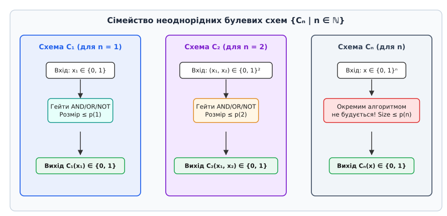
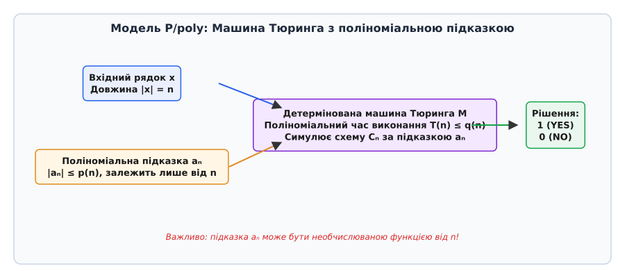
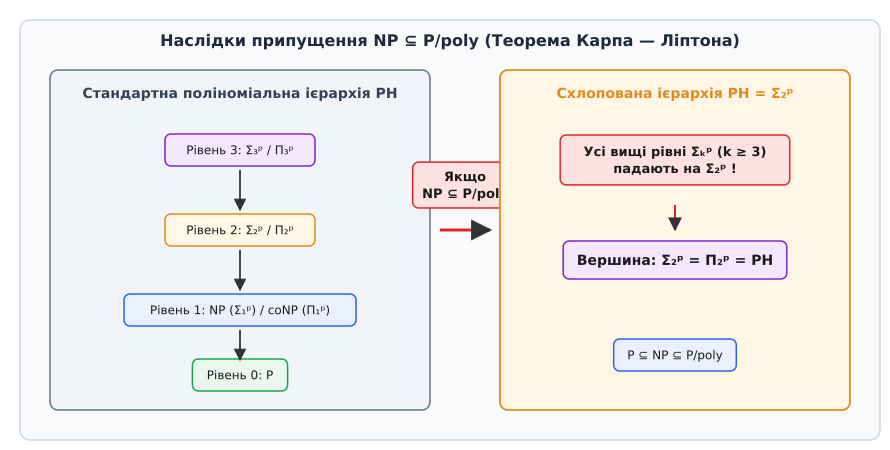

# Клас P/poly: схема складності

<preknowlist>
- [Класи P і NP та NP-повнота](root:computability/np-completeness) — базові визначення складності P та NP, детерміновані та недетерміновані машини Тюринга.
- [Поліноміальна ієрархія (PH)](root:computability/polynomial-hierarchy) — будова кванторних рівнів складності та оператор схлопування.
- [Теорема Кука — Левіна](root:computability/cook-levin-theorem) — поліномна зведеність та еквівалентність логічних схем і машин Тюринга.
</preknowlist>

У класичній теорії алгоритмів універсальне обчислення описується єдиним детермінованим алгоритмом або єдиною машиною Тюринга, яка спроможна обробити вхідний рядок довільної довжини `n`. Така модель є **однорідною (рівномірною)**: скінченний опис алгоритму фіксується раз і назавжди до початку виконання, а сам процес обробки не змінює свою внутрішню логіку залежно від того, розглядаємо ми рядок із 10 бітів чи з 10 мільйонів бітів. Проте в реальному цифровому світі комп'ютерні процесори, мікросхеми та програмовані вентильні матриці (FPGA) будуються інакше: для кожної фіксованої розрядності входу `n` конструюється окрема комбінаційна булева схема `Cₙ`.

Якщо зняти вимогу про те, щоб алгоритм побудови схеми `Cₙ` сам по собі був обчислювальним, виникає модель **неоднорідних (нерівномірних)** обчислень. Головним об'єктом цієї теорії є клас складності **P/poly** — клас мов, які розпізнаються сімействами булевих схем поліноміального розміру, або, що еквівалентно, детермінованими машинами Тюринга поліноміального часу, які отримують додатковий рядок допомоги (підказку `aₙ`) поліноміальної довжини, що залежить лише від довжини входу `n`.

Дослідження класу P/poly відкриває фундаментальні парадокси та межі обчислюваності: з одного боку, цей клас містить алгоритмічно нерозв'язні мови, які не здатна обчислити жодна звичайна машина Тюринга; з іншого боку, якщо для NP-повних задач знайдеться поліноміальне сімейство схем (`NP ⊆ P/poly`), то вся поліноміальна ієрархія PH схлопнеться на свій другий рівень.

## Обмеження однорідності та виникнення нерівномірних моделей

Щоб зрозуміти необхідність введення класу P/poly, розглянемо фундаментальне обмеження класичного визначення алгоритму. Машина Тюринга `M` задається скінченною множиною станів `Q` та функцією переходу `δ`. Коли ми стверджуємо, що мова `L` належить до класу **P**, це означає існування **єдиного** алгоритму `M`, який для будь-якого входу `x ∈ {0, 1}*` здійснює обчислення за час `T(n) ≤ c · nᵏ`.

Проте в інженерній практиці логічного синтезу та криптоаналізу часто виникає ситуація, коли обчислювальна система оптимізується під **конкретну розмірність вхідних даних**. Наприклад, під час розробки апаратного прискорювача для перевірки цифрового підпису довжиною 256 бітів інженер не створює універсальний процесор для обробки довільних довжин: замість цього розгортається оптимальний граф булевих елементів (І, АБО, НІ), пристосований виключно для `n = 256`.

Розглянемо послідовність таких обчислювальних блоків `{C₁, C₂, C₃, ..., Cₙ, ...}`, де кожен об'єкт `Cₙ` призначений виключно для обробки вхідних рядків фіксованої довжини `n`.


*Сімейство булевих схем Cₙ для вхідних даних різної довжини n. Для кожного n будується окрема схема розміру ≤ p(n).*

Якщо схема `Cₙ` складається з вентилів І, АБО та НІ, а її загальна кількість елементів (розмір схемы `size(Cₙ)`) обмежена поліномом `p(n)`, то виникає природне запитання: як пов'язані між собою схеми `C₁₀₀` та `C₁₀₁`?

У **однорідному (рівномірному)** випадку вимагається існування алгоритму, який за полиноміальний час за вхідним числом `1ⁿ` буде будувати текст або графічний опис схеми `Cₙ`. У такому разі схемна модель є повністю еквівалентною звичайній машині Тюринга.

У **неоднорідному (нерівномірному)** випадку ми **не вимагаємо**, щоб послідовність схем `{Cₙ}` могла бути згенерована будь-яким алгоритмом. Схема `Cₙ` може бути «подарована» зовнішнім оракулом або сформована на основі невідтворного комбінаторного пошуку. Клас **P/poly** — це математична формалізація саме такого неоднорідного обчислення.

## Двояке математичне означення класу P/poly

Існує два абсолютно рівноправних та математично еквівалентних способи визначення класу P/poly: через сімейства поліноміальних булевих схем та через машини Тюринга з поліноміальною підказкою.

### Означення 1: Сімейства поліноміальних булевих схем

> **Означення через схеми.** Мова `L ⊆ {0, 1}*` належить до класу **P/poly**, якщо існує сімейство комбінаційних булевих схем `C = {Cₙ | n ∈ ℕ}` у базісі `{AND, OR, NOT}` та поліном `p(n)` такі, що для кожного `n ≥ 1`:
> 1. Схема `Cₙ` має `n` вхідних вентилів та 1 вихідний вентиль.
> 2. Кількість логічних гейтів у схемі обмежена поліномом: `size(Cₙ) ≤ p(n)`.
> 3. Для кожного вхідного рядка `x ∈ {0, 1}ⁿ` виконується рівність: `Cₙ(x) = 1 ⇔ x ∈ L`.

Розмір схеми `size(Cₙ)` вимірюється загальною кількістю внутрішніх вентилів І, АБО та НІ. Глибина схеми `depth(Cₙ)` визначається довжиною найдовшого шляху від вхідного біта до виходу.

### Означення 2: Машини Тюринга з поліноміальною підказкою

Позначення **P/poly** походить від скісної риски, яка в теорії складності позначає оператор підказки (англ. *advice operator*). Якщо `C` — клас складності, а `F` — клас функцій обмеження довжини, то `C/F` позначає клас задач, які розпізнаються алгоритмом із класу `C`, що отримує рядок підказки, довжина якого обмежена функцією з `F`.


*Машина Тюринга M отримує на вхід рядок x та підказку aₙ довжини ≤ p(n). Підказка залежить лише від n.*

> **Означення через підказку.** Мова `L ⊆ {0, 1}*` належить до класу **P/poly**, якщо існує детермінована машина Тюринга `M`, поліном `q(n)` та послідовність рядків підказки `A = {aₙ | n ∈ ℕ, aₙ ∈ {0, 1}*}` такі, що:
> 1. Довжина підказки обмежена поліномом від довжини входу: `|aₙ| ≤ p(n)` для деякого полінома `p`.
> 2. Машина `M` зупиняється за час `T(n) ≤ q(n + |aₙ|)` для всіх входів.
> 3. Для кожного рядка `x ∈ {0, 1}ⁿ` виконується: `M(x, aₙ) = 1 ⇔ x ∈ L`.

Ключовий деталь полягає у тому, що підказка `aₙ` **залежить виключно від довжини входу `n = |x|`**, але не від самого конкретного вмісту рядка `x`. Наприклад, для всіх 2ⁿ вхідних рядків довжини `n` машина `M` використовує один і той самий рядок підказки `aₙ`.

## Доведення еквівалентності двох моделей

Щоб переконатися, що визначення через схеми та визначення через підказку є тотожними, необхідно простежити двосторонній логічний перехід між ними.

[Детальні математичні виведення та доведення](root:computability/p-poly/math-karp-lipton-proof.md) зібрані в окремій математичній вставці, а нижче розкрито їхню причинно-наслідкову суть.

### 1. Перехід «Схеми ⇒ Підказка»
Нехай мова `L` розпізнається сімейством схем `{Cₙ}` розміру `size(Cₙ) ≤ p(n)`. Побудуємо рядок підказки `aₙ` як **пряму двійкову серіалізацію опису графа схеми `Cₙ`**.

Оскільки схема складається з `N ≤ p(n)` вентилів, кожен вентиль можна закодувати його типом (AND, OR, NOT) та індексами вхідних вентилів (які потребують `log₂ N` бітів). Загальна довжина серіалізованого коду схеми становить:

```
|aₙ| = O(p(n) · log p(n))
```

Ця величина є поліноміальною від `n`. Машина Тюринга `M(x, aₙ)` зчитує опис схеми з підказки `aₙ` і за допомогою універсального симулятора логічних графів обчислює вихід `Cₙ(x)` за поліноміальний час від `|aₙ|`.

### 2. Перехід «Підказка ⇒ Схеми»
Нехай мова `L` розпізнається машиною `M(x, aₙ)` за поліноміальний час `q(n)`. Розглянемо обчислення `M` на загальному вхідному векторі довжини `n + |aₙ|`.

За теоремою Кука — Левіна, процес обчислення детермінованої машини Тюринга за час `q(n)` можна перекласти у булеву схему `C'ₙ` розміру `O(q(n)²)`. Ця схема має `n` входів для змінних `x` та `|aₙ|` входів для підказки.

Зафіксуємо конкретні значення бітів підказки `aₙ` як константи на відповідних входах схеми `C'ₙ`. Утворена схема `Cₙ(x) = C'ₙ(x, aₙ)` має розмір `O(q(n)²)`, оперує лише входом `x` і розпізнає мову `L`.

Таким чином, обидві концепції повністю еквівалентні.

## Глибина схем, паралельні обчислення та ієрархія NC

Схемна складність характеризується не лише розміром схеми `size(Cₙ)`, але й її **глибиною `depth(Cₙ)`** — максимальною кількістю вентилів на найдовшому шляху від входу до виходу. З точки зору паралельних обчислень, розмір схеми відповідає загальній кількості процесорів (апаратних ресурсів), а глибина схеми — загальному часу виконання при ідеальному паралелізмі.

Важливим підкласом класу P/poly є **ієрархія NC (Nick's Class)**. Клас `NCᵏ` позначає мови, які розпізнаються сімействами схем поліноміального розміру `O(nᶜ)` та полілогарифмічної глибини `O(logᵏ n)`, де вентилі мають обмежений фанін (fan-in ≤ 2).

Зв'язок між паралельними класами та P/poly визначається наступними включеннями:

```
NC¹ ⊆ NC² ⊆ ... ⊆ NC ⊆ P ⊆ P/poly
```

Схеми низької глибини (наприклад, `NC¹` з глибиною `O(log n)`) описують алгоритми, які можна обчислити надзвичайно швидко на паралельних суперкомп'ютерах. Проте P/poly включає в себе схеми довільної поліноміальної глибини `O(p(n))`, що покриває як паралельні, так і суворо послідовні обчислення.

## Варіанти однорідності: Logspace-uniformity та P-uniformity

Щоб зблизити теорію схемної складності з класичними алгоритмами на машинах Тюринга, науковці вводять додаткові умови **однорідності (uniformity)** на сімейства схем.

1. **Logspace-uniform P/poly:** Сімейство схем `{Cₙ}` називається логарифмічно однорідним, якщо існує детермінована машина Тюринга, яка за вхідним рядком `1ⁿ` будує опис схеми `Cₙ`, використовуючи лише `O(log n)` додаткової пам'яті. Доведено, що клас мов, розпізнаваних логарифмічно однорідними поліноміальними схемами, **строго збігається з класом P**.
2. **P-uniform P/poly:** Сімейство схем називається поліноміально однорідним, якщо схема `Cₙ` будується за поліноміальний час від `n`. Цей клас також еквівалентний класичному **P**.

Ці результати підкреслюють, що клас P/poly стає ширшим за клас P **виключно за рахунок неоднорідності** (необчислюваності алгоритму побудови схем).

## Феномен неоднорідності: Нерозв'язність у класі P/poly

Найбільш вражаючим і неінтуїтивним фактом про клас P/poly є те, що він **містить алгоритмічно нерозв'язні (необчислювані) мови**.

У класичній теорії обчислюваності [Проблема зупинки](root:computability/halting-problem) доводить існування задач, які неможливо розв'язати жодною машиною Тюринга. Проте неоднорідний клас P/poly здатний обходити бар'єр Тюринга завдяки тому, що послідовність підказок `{aₙ}` не зобов'язана бути обчислювальною.

### Унарна проблема зупинки (Unary Halting)

Розглянемо унарну мову `HALT₁ ⊆ {1}*`, визначену наступним чином:

```
1ⁿ ∈ HALT₁  ⇔  n-на машина Тюринга Mₙ зупиняється на порожньому вводі
```

Звичайна проблема зупинки є алгоритмічно нерозв'язною, тому й унарна мова `HALT₁` є нерозв'язною: жоден універсальний алгоритм не може визначити, чи зупиниться машина `Mₙ` за скінченну кількість кроків.

Проте доведемо, що `HALT₁ ∈ P/poly`:

Для кожного `n ≥ 1` вхідний рядок `x = 1ⁿ` має єдиний варіант. Визначимо біт підказки `aₙ ∈ {0, 1}` довжиною всього **1 біт**:

```
aₙ = 1, якщо Mₙ зупиняється на порожньому вводі;
aₙ = 0, якщо Mₙ працює безкінечно.
```

Оскільки `aₙ` залежить тільки від `n`, послідовність підказок `{a₁ = 0, a₂ = 1, a₃ = 1, ...}` існує як математичний об'єкт у множині `{0, 1}*`.
Машина Тюринга `M(x, aₙ)` отримує рядок `x = 1ⁿ` та біт `aₙ` і просто повертає значення `aₙ` за час `O(1)`.

```
M(1ⁿ, aₙ) = aₙ
```

Оскільки довжина підказки `|aₙ| = 1 ≤ n`, а час обчислення `O(1) ≤ n`, ми отримуємо `HALT₁ ∈ P/poly`.

> 🔧 **Навіщо це розуміти.** Цей приклад показує, що клас P/poly не є модель лише «швидких практичних алгоритмів». Всі унарні мови `L ⊆ {1}*` автоматично належать до P/poly, оскільки для кожної довжини `n` існує лише один рядок `1ⁿ`, і відповідь «так/ні» можна просто зашидувати в 1 біт підказки `aₙ`.

### Чому P/poly не містить абсолютно всі мови?

Постає логічне питання: якщо підказка може кодувати необчислювану інформацію, чи чи не включає P/poly **всі можливі підмножини** `{0, 1}*`?

Відповідь — **ні**. Підказка `aₙ` має поліноміальну довжину `|aₙ| ≤ p(n)`. Загальна кількість різних підказок довжини `p(n)` становить `2ᵖ⁽ⁿ⁾`.

Проте кількість різних бінарних мов для вхідних рядків довжини `n` дорівнює кількості булевих функцій від `n` змінних, яка виражається подвійною експонентою:

```
Кількість функцій f: {0, 1}ⁿ → {0, 1}  =  2^(2ⁿ)
```

Оскільки при `n → ∞` подвійна експонента `2^(2ⁿ)` зростає незрівнянно швидше за одинарну експоненту розміру підказок `2ᵖ⁽ⁿ⁾`, підказка поліноміальної довжини спроможна покрити лише мізерну частку від усіх можливих бінарних проблем decision-типу.

## Ієрархія класів із підказкою: L/poly, NP/poly та PSPACE/poly

Концепція оператора підказки `/poly` поширюється на інші класи обчислювальної складності:

- **L/poly (Logspace with polynomial advice):** Клас мов, розпізнаваних детермінованими машинами з логарифмічною пам'яттю `O(log n)` та поліноміальною підказкою. Еквівалентний сімействам брейнч-програм (Branching Programs) поліноміального розміру.
- **NP/poly (Nondeterministic Polynomial time with polynomial advice):** Недетерміновані машини Тюринга з поліноміальною підказкою.
- **PSPACE/poly:** Мови, що розпізнаються машинами з поліноміальною пам'яттю та підказкою. Доведено, що `PSPACE/poly = PSPACE`, тобто підказка поліноміального розміру не додає нових можливостей до класу PSPACE.

## Теорема Адлемана: BPP ⊆ P/poly та дерандомізація

Одним із найвизначніших теоретичних тріумфів неоднорідної моделі стало доведення Леонарда Адлемана (1978) про те, що будь-який ймовірнісний алгоритм із класу **BPP** можна перетворити на поліноміальну булеву схему.

Клас **BPP** (Bounded-error Probabilistic Polynomial-time) описує алгоритми, які використовують випадкові біти і дають правильну відповідь з ймовірністю не менше `2/3`.

Теорема Адлемана стверджує:

```
BPP ⊆ P/poly
```

### Фізична інтуїція доведення Адлемана

Припустимо, у нас є ймовірнісний алгоритм, який для перевірки простоти числа або аналізу графа кидає монету `m = p(n)` разів. Для одного конкретного входу `x` алгоритм може помилитися з ймовірністю `1/3`.

Якщо ми повторимо цей алгоритм `k = 12(n + 1)` разів із незалежними кидками монети та візьмемо більшість голосів (мажоритарне рішення), то за [нерівністю Чернова](root:math-probability/chernoff-bound) ймовірність помилки для даного `x` впаде до експоненціально малої величини `Pr[error] < 2⁻⁽ⁿ⁺¹⁾`.

Усього існує `2ⁿ` різних вхідних рядків довжини `n`. Помножимо ймовірність помилки на кількість вхідних рядків (за сумою ймовірностей Union Bound):

```
Pr[існує х, на якому мажоритарний алгоритм помиляється] ≤ 2ⁿ · 2⁻⁽ⁿ⁺¹⁾ = 1/2
```

Це означає, що якщо ми випадково оберемо послідовність випадкових бітів `r*` для всіх `k` прогонів, то з ймовірністю **не менше 1/2** ця єдина послідовність `r*` дасть 100% правильну відповідь **одночасно для всіх `2ⁿ` вхідних рядків** довжини `n`!

Зафіксувавши цю «ідеальну» послідовність бітів `r*` як статичну підказку `aₙ`, ми отримуємо детермінований алгоритм поліноміального часу без жодного елемента випадковості. Отже, випадковість у BPP завжди можна замінити неоднорідною поліноміальною підказкою.

## Теорема Карпа — Ліптона та схлопування поліноміальної ієрархії

Якщо дерандомізація BPP є позитивним результатом, то фундаментальна теорема Річарда Карпа та Річарда Ліптона (1980) описує наслідки можливого існування малих схем для складних NP-повних задач.

Питання Карпа та Ліптона звучало так: що станеться з теорією складності, якщо з'ясується, що NP-повна задача **SAT** має поліноміальні булеві схеми (`NP ⊆ P/poly`) короткої довжини?

З огляду на неоднорідність P/poly, це не означало б автоматично `P = NP`, адже самі схеми могли б бути необчислюваними за алгоритмом. Проте Карп і Ліптон довели фундаментальну теорему про структуру обчислювального всесвіту:

> **Теорема Карпа — Ліптона (1980).** Якщо `NP ⊆ P/poly`, то поліноміальна ієрархія PH схлопується до свого другого рівня:
> ```
> NP ⊆ P/poly  ⇒  PH = Σ₂ᵖ = Π₂ᵖ
> ```


*Схлопування поліноміальної ієрархії за теоремою Карпа — Ліптона. Якщо NP ⊆ P/poly, то ієрархія PH опускається на рівень Σ₂ᵖ.*

### Механізм схлопування через самозведення SAT

Ключ до доведення теореми Карпа — Ліптона полягає у властивості **самозведенності (self-reducibility)** задачі здійсненності булевих формул SAT. 

Якщо існує сімейство схем `{Cₙ}`, яке за формулою `Φ` визначає, чи є вона здійсненною, то за допомогою цієї ж схеми можна за поліноміальний час **покроково побудувати сам виконуватимий набір змінних** (свідок `w`):

1. Зафіксувати першу змінну `x₁ = 1` та віддати формулу `Φ|x₁=1` схемі `C`.
2. Якщо схема відповідає «так», зафіксувати `x₁ = 1`; якщо «ні» — зафіксувати `x₁ = 0`.
3. Повторити процедуру для всіх `m` змінних.

Завдяки цьому квантор існування свідка `∃ w` в предикатах вищих рівнів ієрархії (наприклад, у формулах рівня `Σ₃ᵖ = ∃ u ∀ v ∃ w R(u,v,w)`) можна замінити на явний виклик схеми `C(u, v)`.

У результаті складний кванторний вираз із трьома чергуваннями перетворюється на вираз із двома кванторами: «існує коректна схема `C` та свідок `u` такі, що для всіх `v` схема видає правильний результат». Це означає, що будь-яка задача з третього рівня `Σ₃ᵖ` опускається на другий рівень `Σ₂ᵖ`.

Оскільки наукова спільнота переконана у тому, що поліноміальна ієрархія `PH` є нескінченною і не схлопується на другий рівень, теорема Карпа — Ліптона слугує найсильнішим непрямим доказом того, що **NP-повні задачі НЕ мають схем поліноміального розміру**:

```
Гіпотеза: NP ⊈ P/poly
```

Докладно історію створення цієї теорії, наукові дискусії 1980-х років та внесок Карпа, Ліптона і Разборова висвітлено в [історичному нарисі](root:computability/p-poly/hist-karp-lipton.md).

## Нижній підрахунок Шеннона та бар'єр природних доведень

Спроба довести, що `NP ⊈ P/poly`, тривалий час вважалася найголовнішою стратегією для розв'язання проблеми P проти NP. Логіка була бездоганною: оскільки `P ⊆ P/poly`, то довівши, що якась задача з NP вимагає суперполіноміальних схем, ми б автоматично довели, що `P ≠ NP`.

### Шеннонівський підрахунок (1949)

Ще в 1949 році Клод Шеннон довів, що **майже всі** булеві функції від `n` змінних вимагають схем розміру не менше:

```
size(Cₙ) = Ω(2ⁿ / n)
```

Випадково обрана булева функція з імовірністю, близькою до 1, є надзвичайно складною і вимагає експоненційного розміру схеми.

Проте коли математики спробували довести суперполіноміальну нижню межу для **конкретної, явно заданої задачі** (такої як SAT, Кліка чи Розфарбування графа), вони зіштовхнулися з нездоланими труднощами. Для загальних булевих схем із вентилями НІ найкраща відома нижня межа для явних функцій протягом десятиліть залишається скромно лінійною — близько `3n` або `5n`.

### Бар'єр природних доведень Разборова — Рудіча (1994)

У 1994 році Олександр Разборов та Стівен Рудіч пояснили причину цієї тривалої невдачі, опублікувавши концепцію **природних доведень (Natural Proofs)**.

Вони довели, що більшість комбінаторних методик, якими математики намагалися довести нижні оцінки схемної складності, володіють двома властивостями:

1. **Корисність (Usefulness):** Властивість виділяє складні функції, які вимагають великих схем.
2. **Конструктивність (Constructibleness):** Наявність цієї властивості в булевій функції можна перевірити за поліноміальний час від її таблиці істинності.

Разборов і Рудіч довели: якщо в криптографії існують стійкі **псевдовипадкові генератори (PRG)** (що є загальноприйнятою гіпотезою), то **жодне природне доведення не здатне відокремити NP від P/poly**.

Причина в тому, що природне доведення мало б уміти відрізняти справді випадкові функції від псевдовипадкових функцій, згенерованих малою схемою. Але здатність відрізняти їх зламала б криптографічну стійкість псевдовипадкових генераторів. 

Отже, доведення `NP ⊈ P/poly` вимагає кардинально нових, «неприродних» математичних методів, які враховують глибоку специфіку конкретних алгоритмів.

## Практичне значення та застосування у логічному синтезі

Незважаючи на абстрактний теоретичний статус, концепції класу P/poly лежать в основі сучасного інженерного стеку розробки мікроелектроніки та програмованих логічних інтегральних схем (ПЛІС / FPGA).

```
          +-------------------------------------------------------+
          |         Високорівневий опис мовою Verilog / VHDL        |
          +-------------------------------------------------------+
                                      |
                                      v
          +-------------------------------------------------------+
          |  Логічний синтез (DAG-оптимізація та підстановка LUT) |
          +-------------------------------------------------------+
                                      |
                                      v
          +-------------------------------------------------------+
          | Конфігураційна матриця FPGA (Бітова підказка a_n)      |
          +-------------------------------------------------------+
```

1. **Оптимізація DAG-графіків у САПР (EDA Tools):** Під час компіляції коду Verilog або VHDL логічний синтезатор перетворює високорівневий алгоритм у спрямований ациклічний граф елементарних логічних гейтів (DAG). Завдання синтезатора полягає у мінімізації розміру графа `size(Cₙ)` для зменшення площі кристала та зменшенні глибини `depth(Cₙ)` для підвищення тактової частоти процесора.
2. **Програмування таблиць пошуку LUT (Look-Up Tables):** У сучасних FPGA вентилі реалізуються за допомогою осередків пам'яті SRAM, які виконують роль таблиць LUT. Вміст цих таблиць слугує конфігураційною підказкою `aₙ`, яка завантажується у кристали під час подачі живлення, перетворюючи універсальну вентильну матрицю на спеціалізований обчислювач.
3. **Криптоаналіз та неоднорідні атаки:** У сучасній криптографії стійкість шифрів (наприклад, AES або RSA) вимірюється не лише проти класичних однорідних алгоритмів, а й проти **неоднорідних атак**. Неоднорідний зловмисник може витратити довільний час (наприклад, роки попередніх обчислень) на побудову оптимальної підказки `aₙ` для даного розміру ключа `n`, після чого здійснювати швидку розшифровку за поліноміальний час `P/poly`.

Практичну програмну реалізацію оцінювача булевих схем мовами C та C++ з урахуванням кеш-ефективності та SIMD-паралелізму наведено у [практичній вставці](root:computability/p-poly/proj-circuit-eval.md).

Формальні специфікації двійкового формату `.ppc`, C API та схеми JSON для обміну схемами між інструментами синтезу представлено у [довідковому API-документі](root:computability/p-poly/api-circuit-builder.md).

## Підсумковий синтез

Клас P/poly посідає унікальне місце в теорії складності обчислень, слугуючи мостом між абстрактними машинами Тюринга та фізичними комбінаційними схемами цифрової електроніки. 

Він розширює традиційну межу обчислюваності, показуючи, що надання алгоритму невеликого обсягу нерівномірної інформації (підказки `aₙ` поліноміальної довжини) дозволяє розв'язувати алгоритмічно нерозв'язні мови та дерандомізувати ймовірнісні алгоритми класу BPP. 

Водночас P/poly встановлює жорсткі теоретичні межі: якщо NP-повні задачі виявляться розв'язними малими схемами, поліноміальна ієрархія схлопнеться на другий рівень. А бар'єр природних доведень Разборова — Рудіча нагадує, що шлях до розуміння справжньої складності обчислень вимагає глибших математичних ідей, ніж ті, якими ми володіємо сьогодні.
