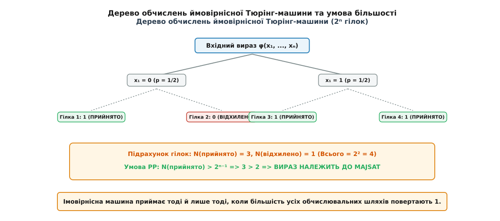
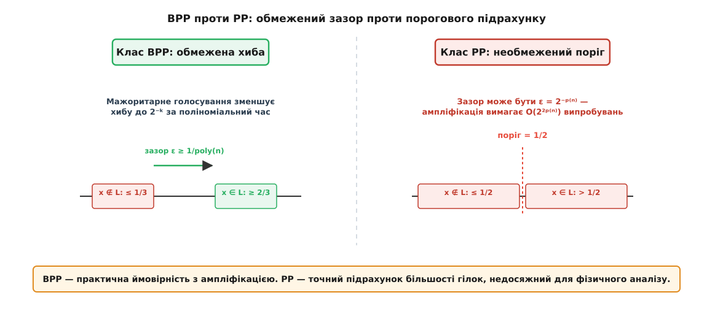
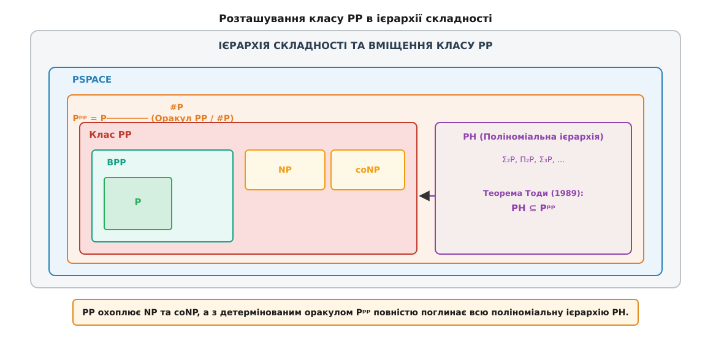

# Клас PP: ймовірнісний поліноміальний час

<preknowlist>
- [Класи P і NP та NP-повнота](root:computability/np-completeness) — поняття поліноміального часу, недетермінізму та верифікаторів.
- [Асимптотична складність](root:computability/asymptotic-complexity) — нотація O великого для вимірювання ресурсів обчислень.
- [Клас #P: складність підрахунку розв'язків](root:computability/sharp-p-counting) — обчислення кількості задовольняючих наборів формули.
</preknowlist>

Коли алгоритм приймає рішення на основі монетних кидків, різниця між надійним практичним інструментом і теоретичним монстром криється у крихітному математичному зазорі. Якщо алгоритм відповідає «так» із імовірністю 2/3, а «ні» — з імовірністю 1/3, повторення процедури лише кілька десятків разів зменшує шанси на помилку до мікроскопічних величин. Але якщо алгоритм гарантує імовірність правильної відповіді лише на одну мільйонну частку відсотка вище за половину — скажімо, 1/2 + 2⁻ⁿ проти 1/2, — фізична ампліфікація стає неможливою. Клас складності PP (Probabilistic Polynomial-time) формалізує саме такий пороговий режим: прийняття рішення строго за більшістю обчислювальних шляхів без жодного гарантованого зазору відокремлення.

Вивчаючи PP, теоретична інформатика відкрила вражаючий парадокс. З одного боку, алгоритми класу PP абсолютно непридатні для запусків на реальних комп'ютерах. З іншого боку, абстрактна модель порогового підрахунку виявилася настільки потужною, що вона поглинає не лише класи NP та coNP, а й усю нескінченну Поліноміальну ієрархію.

## 1. Концепція монетних машин та означення класу PP

У класичній теорії обчислень недетермінована машина Тюрінга на кожному кроці розгалужується на кілька можливих наступних станів. Якщо хоча б один шлях у дереві обчислень приводить до стану прийняття (ACCEPT), машина повертає ствердну відповідь. Ця модель лежала в основі визначення класичного класу NP, де існування хоча б одного свідка (сертифіката) є достатнім для прийняття слова.

Імовірнісна машина Тюрінга (Probabilistic Turing Machine, PTM) змінює алгоритмічну парадигму. Замість абстрактного існування хоча б одного успішного шляху, кожен перехід у дереві обчислень сприймається як фізичний випадковий вибір із імовірністю 1/2 (наприклад, кидок симетричної монети).

За поліноміальний час `p(n)`, де `n = |x|` — довжина вхідного слова `x`, машина генерує `p(n)` випадкових бітів. Це утворює повне бінарне дерево обчислень із рівно `2ᵖ⁽ⁿ⁾` випадковими шляхами однаковою ймовірності `2⁻ᵖ⁽ⁿ⁾`.


*Дерево обчислень ймовірнісної Тюрінг-машини та умова більшості.*

Формальне означення класу PP спирається на суворий порівняльний поріг прийняття рішення:

Мова `L ⊆ {0, 1}*` належить до класу **PP**, якщо існує ймовірнісна машина Тюрінга `M`, яка працює за поліноміальний час, така що для кожного вхідного слова `x`:
- Якщо `x ∈ L`, то імовірність прийняття `P(M(x) = 1) > 1/2`.
- Якщо `x ∉ L`, то імовірність прийняття `P(M(x) = 1) ≤ 1/2`.

Перевівши імовірності у цілочисельну кількість успішних шляхів `N_accept(x)` із загальної кількості `2ᵖ⁽ⁿ⁾`, умова спрощується до прямого порівняння:

```
x ∈ L  ⇔  N_accept(x) > 2ᵖ⁽ⁿ⁾⁻¹
```

Слово належить мові тоді й лише тоді, коли строго більше половини усіх можливих обчислювальних шляхів завершуються у стані прийняття. Якщо кількість прийнятних шляхів становить рівно половину або менше, машина відхиляє вхід.

## 2. Прірва між BPP та PP: крах ампліфікації Чернова

На перший погляд може здатися, що клас PP мало чим відрізняється від відомого класу ймовірнісних обчислень BPP (Bounded-error Probabilistic Polynomial-time). Проте між ними лежить принципова аналітична прірва, яка кардинально змінює фізичний зміст обчислення.

У класі BPP імовірність прийняття відокремлена від 1/2 гарантованим зазором `ε ≥ 1/poly(n)`. Це дозволяє використати теорему Чернова: якщо ми виконаємо `k` незалежних запусків BPP-алгоритму і візьмемо відповідь більшості, імовірність помилки зменшиться експоненційно швидко за формулою `exp(-2kε²)`. Завдяки цьому BPP є моделлю ефективних реальних алгоритмів (таких як тестування чисел на простоту методом Міллера-Рабіна чи перевірка тотожностей поліноміальних виразів).


*Порівняння порогів прийняття в BPP (обмежена хиба) та PP (необмежений поріг).*

У класі PP зазор `ε` не обмежений знизу ніяким поліномом. Для вхідного слова `x ∈ L` імовірність прийняття може становити:

```
P(accept) = 1/2 + 1/2ᵖ⁽ⁿ⁾
```

Для слова завдовжки `n = 100` різниця між `x ∈ L` та `x ∉ L` може становити лише один шлях із `2¹⁰⁰` (приблизно `10³⁰`).

Щоб статистично розрізнити ймовірності `1/2 + 2⁻ⁿ` та `1/2` за допомогою мажоритарного голосування, фізичному алгоритму знадобилося б зробити близько `O(2²ⁿ)` запусків. Навряд чи можна вважати поліноміальним алгоритм, запуск якого вимагає більше часу, ніж вік Всесвіту.

Розглянемо числовий приклад ампліфікації. Припустимо, що зазор для входу розміром `n = 50` дорівнює `ε = 2⁻⁵⁰ ≈ 8.88 · 10⁻¹⁶`. Щоб зменшити імовірність помилки до 1%, кількість необхідних незалежних запусків `k` складатиме:

```
k ≥ (ln(100) / 2) · (1 / ε²) 
  ≈ 2.302 · (2⁵⁰)² 
  ≈ 2.302 · 2¹⁰⁰ 
  ≈ 2.9 · 10³⁰ запусків
```

Навіть якщо кожен запуск виконуватиметься за одну пікосекунду (`10⁻¹²` секунди), загальний час обчислення становитиме понад 90 мільйонів років.

Отже, PP — це не модель практичних ймовірнісних обчислень, а модель точного порогового підрахунку.

## 3. Канонічна PP-повна задача: MAJSAT

Щоб зрозуміти внутрішнє влаштування класу складності, теоретики вивчають його найважчі задачі — PP-повні задачі. Канонічним прикладом є задача **MAJSAT** (Majority SAT, або Задача більшості задовольняльних наборів).

Вхідними даними задачі MAJSAT є булева формула `φ(x₁, x₂, ..., xₙ)`, задана в кон'юнктивній нормальній формі (КНФ). Питання задачі: чи існує строго більше ніж `2ⁿ⁻¹` різних наборів значень змінних `(x₁, ..., xₙ)`, які перетворюють формулу `φ` на 1 (TRUE)?

Порівняємо три класичні задачі на формулах:
1. **SAT (Клас NP):** Чи існує **хоча б один** задовольняльний набір (`N_sat ≥ 1`)?
2. **#SAT (Клас #P):** Яке **точне число** виконуючих наборів `N_sat`?
3. **MAJSAT (Клас PP):** Чи перевищує число виконуючих наборів **строгу половину** (`N_sat > 2ⁿ⁻¹`)?

Розглянемо конкретну КНФ-формулу з 3 змінними (`x₁, x₂, x₃`), усього `2³ = 8` можливих інтерпретацій:

```
φ(x₁, x₂, x₃) = (x₁ ∨ x₂) ∧ (¬x₁ ∨ x₃)
```

Обчислимо значення формули для всіх 8 наборів:
- `(0, 0, 0)` ⇒ `(0) ∧ (1) = 0`
- `(0, 0, 1)` ⇒ `(0) ∧ (1) = 0`
- `(0, 1, 0)` ⇒ `(1) ∧ (1) = 1`  [Виконує]
- `(0, 1, 1)` ⇒ `(1) ∧ (1) = 1`  [Виконує]
- `(1, 0, 0)` ⇒ `(1) ∧ (0) = 0`
- `(1, 0, 1)` ⇒ `(1) ∧ (1) = 1`  [Виконує]
- `(1, 1, 0)` ⇒ `(1) ∧ (0) = 0`
- `(1, 1, 1)` ⇒ `(1) ∧ (1) = 1`  [Виконує]

Кількість виконуючих наборів `N_sat = 4`. Половина від загальної кількості шляхів дорівнює `2³⁻¹ = 4`. Умова MAJSAT вимагає `N_sat > 4`. Оскільки 4 не перевищує 4, дана формула **НЕ належить** до MAJSAT (хоча вона є виконуваною у сенсі NP-задачі SAT).

Будь-яку мову з класу PP можна поліноміально звести до задачі MAJSAT. Конструкція доведення спирається на аналог теореми Кука-Левіна: поліноміальна ймовірнісна машина Тюрінга кодується у булеву формулу `φ(x, r)`, де змінні `r` відповідають випадковим монетним кидкам. Кількість прийнятних шляхів машини дорівнює кількості виконуючих наборів формули `φ`.

Детальний аналіз алгоритмічного розв'язання MAJSAT та кодову реалізацію мовами C і C++ наведено у вставці:
⚙️ [Алгоритм вирішення MAJSAT: пороговий підрахунок виконуючих наборів](root:computability/pp-probabilistic-polynomial/proj-majsat-solver.md).

## 4. Структурні властивості: вміщення NP ⊆ PP та симетрія coPP = PP

Незиблемим результатом структурної теорії складності є доведення того, що клас PP містить у собі весь клас NP (`NP ⊆ PP`), а також клас coNP (`coNP ⊆ PP`).

Щоб зрозуміти, чому `NP ⊆ PP`, уявимо PTM, яка намагається розв'язати задачу SAT. Машина генерує випадковий вектор значень `y ∈ {0, 1}ᵐ` та перевіряє, чи є він виконуючим набором.
- Якщо `y` є виконуючим, машина негайно приймає.
- Якщо ні, машина виконує додаткові балансувальні кидки монети.

Налаштувавши дерево обчислень так, щоб при відсутності виконуючих наборів машина приймала рівно у половині випадків (`N_accept = 2ᵖ⁽ⁿ⁾⁻¹`), наявність навіть одного дійсного розв'язку додасть додаткові шляхи прийняття, змусивши загальну суму перевищити поріг: `N_accept > 2ᵖ⁽ⁿ⁾⁻¹`.

Подібним чином доводиться і `coNP ⊆ PP`, оскільки перевірка відсутності протиріч у формулах кодується через порогову більшість шляхів.

Фундаментальною властивістю класу PP є його симетрія відносно доповнення:

```
coPP = PP
```

У класі NP аналогічне питання (`NP = coNP`) залишається однією з найбільших відкритих таємниць. Але для PP симетрія доводиться алгебраїчно.

Складність інверсії умови `N_accept > 2ᵖ⁽ⁿ⁾⁻¹` полягає у межовій точці: інверсія дає `N_accept ≤ 2ᵖ⁽ⁿ⁾⁻¹`. Проста заміна станів ACCEPT та REJECT на листі дерева не працює, оскільки рівність `N_accept = 2ᵖ⁽ⁿ⁾⁻¹` при інверсії не стає строго більшою за половину.

Джон Ґілл розв'язав цю проблему за допомогою елегантного математичного трюку: розширення простору обчислень на один додатковий біт та додавання одного гарантованого шляху прийняття. Це дозволило зсунути поріг і перетворити нестрогу нерівність на строгу.

Покрокові математичні доведення теорем `NP ⊆ PP` та `coPP = PP` викладено у вставці:
🧮 [Математичний апарат класу PP: порогове обчислення та доведення замкненості](root:computability/pp-probabilistic-polynomial/math-pp-properties.md).

## 5. Зв'язок із підрахунковим класом #P та оракульні обчислення

Клас PP тісно пов'язаний із класом функціональної складності #P (Sharp-P), який вимірює складність підрахунку кількості розв'язків.

За визначенням, мова `L ∈ PP` тоді й лише тоді, коли існують функція `f ∈ #P` та поліноміально обчислювана функція `g ∈ FP` такі, що:

```
x ∈ L  ⇔  f(x) > g(x)
```

Зв'язок між рішенням порогових задач та обчисленням точного значення проявляється при використанні оракулів (чорних скриньок, які відповідають на запити за 1 крок).

Якщо детермінованій поліноміальній машині надати доступ до оракула PP, вона може за допомогою бінарного пошуку обчислити точне число виконуючих наборів `f(x) ∈ #P`. Запитавши у оракула PP: «Чи правда, що `f(x) > K`?», машина за `log2(2ⁿ) = n` кроків звужує інтервал можливих значень від `[0, 2ⁿ]` до єдиного точного числа.

Звідси випливає фундаментальна рівність оракульних класів складності:

```
Pᵖᵖ = P────────
```

Потужність детермінованого поліноміального комп'ютера з оракулом PP тотожно дорівнює його потужності з оракулом #P.

## 6. Теорема Тоди: PP як вершина Поліноміальної ієрархії

Найбільшим триумфом у дослідженні класу PP стала теорема японського математика Сейносуке Тоди, опублікована у 1989 році.

Поліноміальна ієрархія (PH) розглядалася як нескінченна піраміда класів складності, що будувалася шляхом послідовного додавання оракулів: `P, NP, Σ₂P, Σ₃P, ...`. Вважалося, що кожен новий рівень кванторів (`∃ y₁ ∀ y₂ ∃ y₃ ...`) додає принципово нову обчислювальну складність, яку неможливо подолати одним кроком.


*Розташування класу PP в ієрархії складності та теорема Тоди.*

Теорема Тоди доруйнувала це уявлення, довівши наступне вміщення:

```
PH ⊆ Pᵖᵖ  (або еквівалентно PH ⊆ P────────)
```

**Значення теореми Тоди:**
Уся Поліноміальна ієрархія довільної глибини згортається всередину поліноміального часу, якщо машина має доступ до одного виклику оракула PP (або #P). Можливість підрахунку більшості шляхів є принципово сильнішою за будь-яке скінченне чергування кванторів існування та загальності.

Ідея алгебраїчного доведення Тоди спирається на так звані поліноми низького степеня над скінченними полями `F_p`. Квантори ∃ та ∀ замінюються ймовірнісними операторами більшості, які подаються як суми за модулем 2, а потім піднімаються до точного порогового підрахунку за допомогою ітеративних поліноміальних трансформацій.

Доведення складається з двох ключових етапів:
1. **Зведення крок за кроком (Валліант-Вазірані і по модулю 2):** Будь-яка формула з кванторами ∃ та ∀ згортається у випадкову КНФ-формулу, кількість виконуючих наборів якої непарна тоді й лише тоді, коли початкова кванторна формула істинна. Це доводить, що `PH ⊆ BP · ⊕P`.
2. **Алгебраїчне підсилення модульних операторів:** За допомогою поліноміальних алгебраїчних операцій підрахунок за модулем 2 (оператор Parity `⊕P`) піднімається до точного порівняння з більшістю в PP.

Детальний історичний очерк відкриття теореми Тоди та її впливу на сучасну теорію складності наведено у вставці:
📜 [Історія класу PP: від випадкових машин Ґілла до теореми Тоди](root:computability/pp-probabilistic-polynomial/hist-gill-toda.md).

## 7. Порогові схеми та алгебраїчний підрахунок (TC⁰ та PTF)

Модель PP проникає не лише у теорію Тюрінг-машин, а й у теорію булевих схем (Circuit Complexity).

У теорії схем клас **TC⁰** відповідає булевим схемам константної глибини з необмеженим входом, збудованим із вентилів більшості (Majority gates). Вентиль більшості повертає 1 тоді й лише тоді, коли більше ніж половина його входів дорівнюють 1.

Класичним результатом є те, що поліноміально-розмірні порогові схеми здатні обчислювати додавання, множення та ділення цілих чисел за константну глибину. Зв'язок із PP виявляється у концепції **порогових поліномів (Polynomial Threshold Functions, PTF)**:

Функція `f(x₁, ..., xₙ)` називається пороговим поліномом степеня `d`, якщо існує поліном `P(x₁, ..., xₙ)` степеня `d` із дійсними коефіцієнтами такий, що:

```
f(x₁, ..., xₙ) = 1  ⇔  P(x₁, ..., xₙ) > 0
```

Клас PP є безпосереднім узагальненням порогових поліномів поліноміального степеня над бінарним кубом `{0, 1}ⁿ`. Будь-яка задача в PP може бути подана як перевірка знаку мультилінійного полінома, коефіцієнти якого виражають кількість успішних шляхів машини.

## 8. Порівняльна характеристика класів складності

Для систематизації знань про пороговий підрахунок зведемо основні класи складності у порівняльну таблицю за типами умов прийняття вхідного слова:

| Клас складності | Модель обчислення | Критерій прийняття слова `x ∈ L` | Зазор хиби `ε` |
| :--- | :--- | :--- | :--- |
| **P** | Детермінована Тюрінг-машина | `M(x) = 1` (єдиний детермінований шлях) | Детерміновано (хиба 0) |
| **NP** | Недетермінована Тюрінг-машина | `N_accept(x) ≥ 1` (існує хоча б 1 шлях) | Не застосовується |
| **coNP** | Недетермінована Тюрінг-машина | `N_reject(x) = 0` (усі шляхи приймають) | Не застосовується |
| **BPP** | Імовірнісна Тюрінг-машина | `P_accept(x) ≥ 2/3` | Обмежений: `ε ≥ 1/poly(n)` |
| **PP** | Імовірнісна Тюрінг-машина | `P_accept(x) > 1/2` (більшість шляхів) | Необмежений: `ε = 2⁻ᵖ⁽ⁿ⁾` |
| **#P** | Функціональний підрахунок | Повертає точне значення `N_accept(x)` | Не застосовується |
| **PSPACE** | Детермінована з поліноміальною пам'яттю | Пам'ять обмежена `O(p(n))` | Детерміновано |

## 9. Розташування між BPP та PSPACE

Незважаючи на колосальну потужність, клас PP не є безмежним. Він строго обмежений зверху класом PSPACE (задачі, що розв'язуються за поліноміальну пам'ять).

```
P ⊆ BPP ⊆ PP ⊆ PSPACE
```

Доведення включення `PP ⊆ PSPACE` є простим та конструктивним:
Детермінована машина Тюрінга за допомогою поліноміальної пам'яті може послідовно згенерувати всі `2ᵖ⁽ⁿ⁾` бінарних векторів `r ∈ {0, 1}ᵖ⁽ⁿ⁾`, симулювати роботу PTM `M(x, r)` для кожного вектора та підтримувати лічильник прийнятних шляхів.

Оскільки лічильник вимагає лише `p(n) + 1` біт пам'яті для збереження числа від `0` до `2ᵖ⁽ⁿ⁾`, ця процедура виконується за поліноміальну пам'ять. По завершенні обходу машина порівнює значення лічильника з `2ᵖ⁽ⁿ⁾⁻¹`.

## 10. Квантові обчислення та PostBQP = PP

Парадоксальний зв'язок класу PP із квантовою фізикою було відкрито Скоттом Ааронсоном у 2005 році.

Стандартні квантові обчислення описуються класом BQP (Bounded-error Quantum Polynomial-time). Уявімо квантовий комп'ютер, якому додано гіпотетичну можливість здійснювати **пост-селекцію** (Post-selection) — вибирати вимірювання, які гарантовано дають певний результат, навіть якщо їхня імовірність дорівнює крихітному `2⁻ᵖ⁽ⁿ⁾`.

Ааронсон довів фундаментальну тотожність:

```
PostBQP = PP
```

Це доводить, що якщо б ми мали квантовий пристрій із можливістю пост-селекції, ми змогли б за поліноміальний час вирішувати будь-яку задачі з Поліноміальної ієрархії. Це фундаментальне обмеження підкреслює, чому фізичні квантові обчислення без пост-селекції обмежені класом BQP і не здатні легко розв'язувати NP-повні чи PP-повні задачі за поліноміальний час.

> 🔧 **Навіщо це.**
> Клас PP дає фундаментальну межу для аналізу алгоритмів прийняття рішень на основі точних імовірнісних моделей та байєсівських мереж. Коли інженер розробляє алгоритми оцінки ризиків у складних системах (наприклад, оцінка імовірності відмови ядерного реактора або аварії самокерованого автомобіля), обчислення того, чи перевищує імовірність катастрофічної події певний поріг (Threshold Model Checking), виявляється PP-повною задачею. Розуміння властивостей PP пояснює, чому точний аналіз ймовірнісних графів вимагає набагато більше ресурсів, ніж пошук окремого сценарію помилки (NP), і чому на практиці доводиться використовувати наближені методи аппроксимації Монте-Карло замість точних порогових підрахунків.
