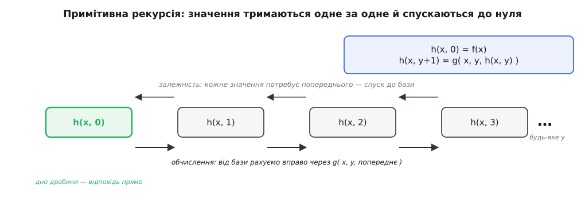
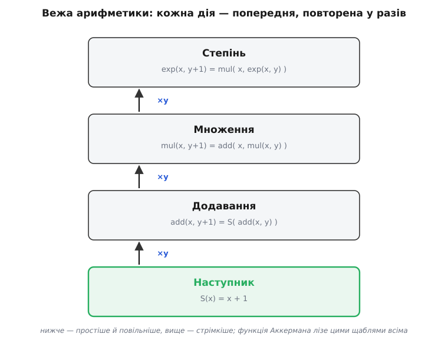
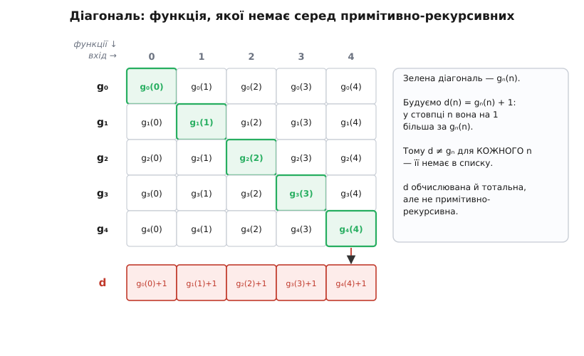

# Примітивно-рекурсивні функції

<preknowlist>
- [Натуральні числа](root:math-logic/natural-numbers) — числа будуються з нуля єдиною дією «наступник» S(n); саме на цій будові тримається вся рекурсія.
- [Математична індукція](root:math-logic/mathematical-induction) — доведення «база + перехід від n до n+1»; примітивна рекурсія — її обчислювальний двійник.
</preknowlist>

Уявімо, що ми хочемо чесно описати, які функції над числами машина здатна **насправді** обчислити — не в мріях, а програмою, що гарантовано доходить до відповіді. Найлегший спосіб зіпсувати таку програму — цикл, який ніколи не завершиться: означення, що нескінченно крутить саме себе, взагалі не задає жодного значення, це не функція, а обіцянка, якої не дотримано. Тож постає різке питання: чи є спосіб **будувати** функції так, щоб зупинка була не окремим клопотом, який щоразу доводиться доводити, а безкоштовною властивістю самої конструкції? Щоб, тільки-но функцію зібрано за правилами, вона вже **не могла** зациклитися навіть у принципі?

Примітивно-рекурсивні функції (лат. *primitivus* — «первісний, найпростіший», і *recurrere* — «вертатися, бігти назад») — це і є одна така відповідь, історично перша й найпрозоріша. Ідея: узяти жменьку найтупіших «атомів-функцій», що їх ніхто не заперечить, і два способи склеювати з них нові функції — і оголосити примітивно-рекурсивним усе, що можна зібрати цими засобами за скінченну кількість кроків. Виявиться, що в цей клас потрапляє майже вся арифметика, яку людина колись рахувала руками: додавання, множення, степінь, факторіал, перевірка на простоту, n-те просте число. І при цьому **кожна** така функція тотальна (лат. *totus* — «увесь»; визначена на всіх входах) і завершується — не з ласки, а тому, що інакше її будова не дозволяє.

## Одна ідея: рахувати вниз по драбині наступника

Уся конструкція виростає з одного спостереження про самі числа. Натуральне число не дане нам готовим — воно **побудоване**: нуль, і далі щоразу «наступний». Число 3 — це S(S(S(0))), нуль, до якого тричі застосували [наступника](root:math-logic/natural-numbers) (англ. *successor*, від лат. *succedere* — «іти слідом»). Отже, якщо число зібрано сходженням угору по одній драбині, то функцію на числах природно означити **тим самим** рухом — тільки згори вниз.

Скажімо, що функція робить на нулі. А тоді скажімо, як дістати її значення на S(n), якщо вже відоме значення на n. Оце й усе — і цим двома реченнями функцію задано на **всіх** числах відразу. Чому на всіх? Бо кожне число — це якийсь S(S(…S(0)…)), і щоб дійти до його значення, ми спускаємося сходинками вниз: значення на n звели до значення на n−1, те — до n−2, і так неминуче до 0, де відповідь дано прямо. Рекурсія (те саме *recurrere* — «біжу назад») котиться **вниз по тій самій драбині**, якою число будувалося вгору, і мусить упертися в нуль за стільки кроків, скільки в числі одиниць. Нескінченного спуску немає, бо драбина має дно.


*Означити функцію примітивною рекурсією — це задати її на нулі (база) і на кроці «наступний» через її ж значення на попереднику. Кожне значення тягне за собою попереднє, ланцюг спускається до нуля, де база замикає його прямою відповіддю, — і аж тоді числа рахуються назад угору. Зупинка вбудована: спуск по скінченній драбині не буває нескінченним.*

Ось чому це «двійник» [індукції](root:math-logic/mathematical-induction). Індукція доводить твердження для всіх чисел, спираючись на базу (нуль) і крок (від n до n+1); примітивна рекурсія тим самим рухом **обчислює** значення для всіх чисел. Індукція гарантує, що доведення накриє всю низку; рекурсія гарантує, що обчислення до всієї низки дійде. Це одна теорема, прочитана двічі: раз як «істинно скрізь», раз як «обчислюється скрізь».

## Найменший стартовий набір

Будувати з нічого не можна, тож треба чесно виписати «атоми» — функції, узяті без пояснень, бо простіших не буває. Їх три сорти, і кожен потрібен.

```
1. нуль-функція      Z(x) = 0            (хоч що подай — вертає нуль)
2. наступник         S(x) = x + 1        (єдина справжня дія над числом)
3. проєкції          Pᵢⁿ(x₁,…,xₙ) = xᵢ   (вертає i-й зі своїх n аргументів)
```

Перші дві очевидні: нуль мусить звідкись узятися, а наступник — єдина дія, яку самі аксіоми чисел нам дають. А от **проєкції** (лат. *projectio* — «кидання вперед») на вигляд смішні: навіщо функція, що просто вибирає один зі своїх аргументів і викидає решту? Бо це — дроти. Коли ми складатимемо функції одна в одну, комусь треба керувати аргументами: підставити той, а не цей; продублювати один у два місця; проігнорувати зайвий. Проєкції — і є ця розводка. Без них багатоаргументні функції неможливо було б правильно живити, і вся збірка розсипалася б на невзаємодійні шматки.

## Два способи склеювати

Тепер — правила збірки. Їх теж рівно два, і разом з трьома атомами вони вичерпують усе означення.

**Композиція** (лат. *compositio* — «складання»), вона ж підстановка: результати кількох функцій подати на вхід іще однієї.

```
h(x⃗) = f( g₁(x⃗), g₂(x⃗), …, gₘ(x⃗) )
```

Це буквально «спочатку порахуй усі gₖ від тих самих аргументів x⃗, а тоді згодуй їхні відповіді у f». Нічого хитрого — так ми щодня вкладаємо функції одна в одну.

**Примітивна рекурсія** — головна дійова особа, той самий рух «згори вниз», записаний формально. З функції-бази f і функції-кроку g вона будує нову функцію h за одним аргументом більше:

```
h(x⃗, 0)   = f(x⃗)                     ← база: значення на нулі задано прямо
h(x⃗, y+1) = g(x⃗, y, h(x⃗, y))         ← крок: з попереднього значення й лічильника
```

Прочитаймо другий рядок повільно. Щоб дістати значення на y+1, кроковій функції g дають три речі: сталі параметри x⃗, поточний лічильник y (щоб вона знала, на якій сходинці стоїть) і **попереднє значення** h(x⃗, y). Із цих трьох вона ліпить нове значення. Лічильник неухильно спадає: y+1 звели до y, те — до y−1, аж до нуля, де чекає база. Те, що g бачить і сам лічильник y, важитиме за мить — це дасть трюки, яких на око не сподіваєшся.

Отже, повне означення: **функція примітивно-рекурсивна, якщо її можна зібрати з трьох атомів (нуль, наступник, проєкції) скінченним числом застосувань композиції та примітивної рекурсії.** Крапка. Усе решта — наслідки, і зараз ми побачимо, як багато їх випливає.

## Уся арифметика виростає на очах

Найпереконливіше означення показує себе не в поясненні, а в тому, що зі своїх трьох атомів воно **справді відтворює** знайому арифметику — не постулює додавання й множення окремо, а вирощує їх із самого наступника.

Почнімо з **додавання**. Додати нуль — нічого не змінити; додати наступного — це наступний від суми:

```
add(x, 0)   = x                 ← база f(x) = x   (це проєкція P¹₁)
add(x, y+1) = S( add(x, y) )    ← крок: до попереднього результату — наступник
```

Крок тут не використовує лічильник y, лише попереднє значення, до якого чіпляє S. Порахуймо за самим означенням, щоб побачити спуск до нуля:

**Умова: обчислити 2 + 3, розкручуючи лише схему.**
```
add(2, 3) = S( add(2, 2) )
          = S( S( add(2, 1) ) )
          = S( S( S( add(2, 0) ) ) )
          = S( S( S( 2 ) ) )          ← база спрацювала: add(2,0) = 2
          = S( S( 3 ) ) = S( 4 ) = 5
```

Три сходинки вниз до бази, тоді три наступники назад угору — рівно як на схемі. Тепер **множення**: помножити на нуль — це нуль, помножити на наступного — додати ще раз множене:

```
mul(x, 0)   = 0
mul(x, y+1) = add( x, mul(x, y) )
```

Множення — це повторюване додавання, і воно так і означене: рекурсія по y, а на кроці кличемо вже побудоване add. Далі — **степінь**, повторюване множення:

```
exp(x, 0)   = 1
exp(x, y+1) = mul( x, exp(x, y) )
```

Проступає драбина: наступник → додавання → множення → степінь, де кожен щабель — це «повтори попередній y разів». Кожна нова дія означена примітивною рекурсією через попередню. Ця вежа зростання ще зіграє ключову роль наприкінці — саме по її щаблях примітивна рекурсія й видереться до своєї стелі, а дехто крізь ту стелю прослизне.


*Кожна звична дія — це попередня, повторена потрібну кількість разів, і саме так вона й означується примітивною рекурсією. Наступник додає одиницю; додавання — це наступник, застосований y разів; множення — додавання, повторене y разів; степінь — повторене множення. Уся вежа стоїть на одному наступникові.*

> 🔧 **Навіщо це.** Примітивна рекурсія — це рівно цикл `for` із наперед відомою кількістю проходів. Схема h(x⃗, y+1) = g(…, h(x⃗, y)) — то й є «повтори тіло y разів, щоразу оновлюючи накопичувач», а лічильник y відомий **до** входу в цикл. Тому будь-яку примітивно-рекурсивну функцію можна записати програмою, у якій **усі** цикли — це `for` зі скінченною межею, і жодного `while`, чия умова могла б ніколи не настати. Це не образ, а теорема: мова програмування з єдиною циклічною конструкцією «повтори n разів» (її звуть LOOP) обчислює точно примітивно-рекурсивні функції. Звідси й безкоштовна зупинка: кожен лічильник лише спадає до нуля.

Ці рецепти — не фігура мови: їх можна буквально втілити як структуру даних, що її виконує один-єдиний інтерпретатор. [Зібраний так виконавець будує add, mul, exp просто з трьох атомів і рахує їхні значення](root:computability/primitive-recursive-functions/proj-primrec-interpreter.md) — і робить очевидним, що примітивно-рекурсивна функція **тотожна** своєму скінченному рецептові.

## Не тільки додавати: віднімання, порівняння, розгалуження

Дотепер крок рекурсії ліпив нове значення з попереднього. Але g бачить і **лічильник** — і це відмикає те, що на перший погляд примітивній рекурсії недоступне. Найяскравіший приклад — **попередник** (число на одиницю менше):

```
pred(0)   = 0
pred(y+1) = y            ← крок просто вертає лічильник, попереднє значення викидає
```

Придивімося до кроку: він **не чіпає** попереднього значення pred(y), а віддає сам лічильник y. Значення на y+1 — це y, тобто попередник. Рекурсія тут — лише привід дістатися лічильника; сходинку «мінус один», яку аксіоми чисел прямо не давали (наступник же необоротний як окрема дія), ми відтворили в обхід. Маючи попередник, будуємо **зрізане віднімання** (щоб не провалюватися в од'ємні числа, яких серед натуральних немає):

```
x ∸ 0     = x
x ∸ (y+1) = pred( x ∸ y )        ← відняти y+1 = відняти y, тоді ще один попередник
```

Це `x ∸ y = max(0, x − y)`: віднімаємо, поки є що, а на нулі застрягаємо. З цієї однієї цеглинки сиплеться решта. **Знак числа** sg(x) (нуль на нулі, одиниця на всьому іншому) відрізняє порожнє від непорожнього. Порівняння `x < y`, `x = y` зводяться до перевірки, чи певна різниця обнулилася. А головне — стає можливим **розгалуження**, оте `якщо-то-інакше`, без якого не буває обчислень:

```
cond(0,   a, b) = b              ← умова хибна (нуль) → друга гілка
cond(y+1, a, b) = a              ← умова істинна (не нуль) → перша гілка
```

Знову рекурсія, чий крок ігнорує попереднє значення й дивиться лише на те, нуль лічильник чи ні. Кодуючи «хибу» нулем, а «істину» — одиницею, ми дістаємо всю булеву логіку прямо в арифметиці: `якщо c, то a, інакше b` — примітивно-рекурсивне. Отже, примітивно-рекурсивні функції вміють не лише рахувати, а й **вирішувати** — розводити обчислення по гілках залежно від умов.

## Як далеко це сягає: обмежений пошук і кодування

Тепер зберімо силу докупи й побачимо, наскільки широкий цей клас насправді. Два прийоми виводять його далеко за межі шкільної арифметики.

Перший — **обмежені сума й добуток**. Просумувати f(0)+f(1)+…+f(n) — це накопичувальна рекурсія, тож примітивно-рекурсивна, коли примітивно-рекурсивна сама f; так само добуток. Другий, потужніший, — **обмежений пошук**: «знайти найменше y ≤ n, для якого P(y) істинне». Оскільки кандидатів скінченно (їх не більше n+1), пошук — це перебір у циклі `for` з відомою межею, а отже, примітивна рекурсія. І звідси лавиною: `x ділиться на d` — перевірка, чи існує частка ≤ x; `x — просте` — перевірка, що жоден дільник від 2 до x−1 не підходить; ділення з остачею, найбільший спільний дільник, `n-те просте число` — усе це примітивно-рекурсивне, бо всюди пошук обмежений наперед відомою величиною.

Лишається останній, вирішальний крок — **кодування**. Існує примітивно-рекурсивна взаємно-однозначна відповідність між парами чисел і числами: пару ⟨a, b⟩ можна пакувати в одне число (класична нумерація Кантора `⟨a,b⟩ = (a+b)(a+b+1)/2 + a`) і розпаковувати назад, і обидві дії примітивно-рекурсивні. А раз пару — то й трійку, і взагалі будь-яку **скінченну послідовність** чисел можна зашити в одне число й діставати звідти елементи. Це означає, що примітивно-рекурсивна функція здатна тримати в одному числі цілий список, стек, таблицю — і працювати з ними. Уся скінченна «пам'ять» вкладається в арифметику.

> 🔧 **Навіщо це.** Саме на цьому стоїть [перша теорема Геделя про неповноту](root:math-logic/godel-incompleteness). Гедель закодував формули й доведення числами й показав, що присуд «число p кодує доведення формули з кодом f» — примітивно-рекурсивний: його можна перевірити скінченним перебором за самим синтаксисом. Тобто вся механіка «що є доведенням» живе всередині арифметики, і арифметика змогла заговорити про власну доказовість. Гедель називав ці функції просто «рекурсивними» (нім. *rekursiv*) — теперішнє «примітивно-» додали пізніше, коли з'ясувалося, що бувають і потужніші рекурсії. Як саме числа кодують синтаксис — [окрема струнка конструкція](root:math-logic/godel-incompleteness/math-godel-numbering.md).

## Стеля: тотальна, обчислювана — і все ж не примітивно-рекурсивна

Клас вийшов такий місткий, що закрадається підозра: а може, примітивно-рекурсивні функції — це **всі** обчислювані тотальні функції, які взагалі бувають? Адже ми зловили всю звичну арифметику, логіку, обмежений пошук, роботу зі списками. Що ще лишилося?

Лишилося чимало, і бачимо ми це не з якогось хитрого прикладу, а з **самої природи класу**. Кожна примітивно-рекурсивна функція має скінченний «рецепт» — дерево збірки з атомів двома операціями. А скінченні рецепти над скінченним алфавітом можна занумерувати: викласти всі підряд, як слова у словнику. Зосередьмося на одномісних примітивно-рекурсивних функціях і випишімо їх у нескінченний список:

```
g₀, g₁, g₂, g₃, …        ← усі одномісні примітивно-рекурсивні функції, за їхніми рецептами
```

А тепер збудуймо функцію-бешкетницю, яка навмисне не збігається з жодною в списку. Означмо її по діагоналі:

```
d(n) = gₙ(n) + 1
```

Тобто: візьми n-ту функцію зі списку, застосуй її до її ж номера n, додай одиницю. Ця d **обчислювана**: маючи n, знайди n-й рецепт, виконай його на вході n (рецепт скінченний, обчислення завершиться), додай 1. І вона **тотальна**: визначена на кожному n, бо кожна gₙ тотальна. Але чи є d у списку? Якби була, вона мала б якийсь номер k, тобто `d = gₖ`. Порахуймо тоді `d(k)` двома способами: з одного боку `d(k) = gₖ(k)` (бо d — це gₖ), з другого `d(k) = gₖ(k) + 1` (за самим означенням d). Виходить `gₖ(k) = gₖ(k) + 1` — неможливо. Отже, d **немає** в списку: d обчислювана й тотальна, але **не примітивно-рекурсивна**.


*Усі одномісні примітивно-рекурсивні функції вишикувано в список-рядки, у стовпцях — їхні значення на входах 0,1,2,… По головній діагоналі беремо gₙ(n) і додаємо одиницю: побудована так функція d у кожному рядку n відрізняється від gₙ саме в точці n. Тому вона не дорівнює жодній функції списку — обчислювана, тотальна, а проте поза примітивною рекурсією.*

Це [діагональний метод Кантора](root:math-logic/cantor-diagonal) — той самий прийом, що ловить незліченність дійсних чисел, тут спрямований на функції. Тонкість, яка і є суттю справи: універсальний виконавець рецептів (програма, що з рецепта й входу видає значення) обчислюваний, але сам **не** примітивно-рекурсивний. Якби він був — ми діагоналлю дістали б із нього d усередині класу, і клас суперечив би собі. Отже, примітивна рекурсія не замкнена щодо власного інтерпретатора; саме тут проходить її межа. Повний хід цього доведення — [покроково у вставці](root:computability/primitive-recursive-functions/math-diagonal-not-pr.md).

Діагональна d штучна — її зумисне зліплено, щоб вислизнути. Та є природний, нічим не закодований свідок тієї ж межі — **функція Аккермана**. Її означують так званою подвійною рекурсією (рекурсія вкладена в рекурсію), у двоаргументній формі:

```
A(0,   n)   = n + 1
A(m+1, 0)   = A(m, 1)
A(m+1, n+1) = A(m, A(m+1, n))        ← аргумент другої рекурсії — сам виклик Аккермана
```

Придивіться до останнього рядка: щоб порахувати A на (m+1, n+1), треба спершу порахувати A на (m+1, n), а результат подати всередину як **другий аргумент** нового виклику. Рекурсія гризе не один лічильник, а обидва навперемін, і саме тому не вкладається в примітивну схему з єдиним спадним лічильником. Що це дає, видно, якщо пройтися по першому аргументу: `A(1, n)` — це майже додавання, `A(2, n)` — майже множення, `A(3, n)` — майже степінь, `A(4, n)` — вежа степенів (степінь від степеня від степеня…). Функція Аккермана піднімається **тією самою вежею** арифметики, що ми будували, — тільки не застрягає на жодному щаблі, а лізе по них усіх відразу, як по драбині. Кожна примітивно-рекурсивна функція сидить на якомусь скінченному щаблі тієї вежі; Аккерман переростає їх усі. Зростає він так, що годі уявити: `A(4, 2)` — це число `2⁶⁵⁵³⁶ − 3`, у якому 19 729 десяткових цифр. [Сама функція Аккермана, її історія й де вона зринає](root:computability/ackermann-function) — окрема тема; тут важливе одне: вона тотальна, обчислювана й доводить, що примітивна рекурсія — не вся обчислюваність.

## Де ця межа проходить і що за нею

Стеля примітивної рекурсії має точну назву в термінах програмування: це межа між `for` і `while`. Усі цикли примітивно-рекурсивної функції — обмежені: кількість проходів відома до входу в цикл. Щоб дістати **всі** обчислювані функції, треба додати необмежений пошук — оператор мінімізації μ, «шукай найменше y, для якого щось справдиться», **без** наперед відомої межі. Ось тут і з'являється `while`, чия умова може не настати ніколи, а з ним — і можливість зациклитися. Клас, що виходить із додаванням μ, — це [загальнорекурсивні функції](root:computability/general-recursive-functions) (сам μ може й не спинитися, тож у повному обсязі вони частково-рекурсивні — визначені не конче всюди), і він, за [тезою Черча–Тюринга](root:computability/church-turing-thesis), збігається з усім, що взагалі можна обчислити: з [машиною Тюринга](root:computability/turing-machine), з програмами, з людиною за папером. Примітивна рекурсія — це рівно та його частина, у якій μ ні разу не знадобився.

> 🔧 **Навіщо це.** Ця межа — не музейний факт, а стіна, об яку щодня спираються системи, що **вимагають** гарантованої зупинки. Помічники доведень (Coq, Agda, Lean) не пускають у код довільний `while`: кожна функція мусить бути тотальною, а рекурсія — структурною, спуском по вже наявних даних, тобто майже дослівно примітивною. Плата відома наперед і випливає з діагоналі: у такій мові не можна написати її ж власний універсальний інтерпретатор — інакше з нього дістали б функцію поза мовою. Хочеш залізну гарантію, що ніщо не зависне, — відмовляєшся від повноти Тюринга; хочеш повноту — миришся з тим, що зупинку доведеться доводити щоразу окремо. Обрати і те, і те не можна, і примітивна рекурсія показує, чому саме.

Тепер видно, чим примітивно-рекурсивні функції особливі серед усього обчислюваного. Це те місце, де **означення і є програма**, а програма не може не зупинитися: рецепт функції читається водночас як інструкція для машини й як доведення, що машина скінчить роботу. Сюди вкладається практично вся конкретна арифметика, яку хтось колись рахував; на цьому фундаменті стоїть арифметизація доведень у Геделя й фінітна [арифметика Сколема](root:computability/primitive-recursive-functions/hist-birth-of-recursion.md). І все ж це доведено не вся обчислюваність — а перший крок за неї, чи то штучна діагональ, чи природний Аккерман, відкриває, що навіть серед функцій, які **завжди** зупиняються, сила не має верху: над кожним рівнем зростання є вищий. Примітивна рекурсія — це найнижчий поверх, на якому обчислення ще прозоре наскрізь; кожен крок вище докуповує потужність ціною тієї прозорості, і за все врешті платять тим самим — гарантією, що машина спиниться.
