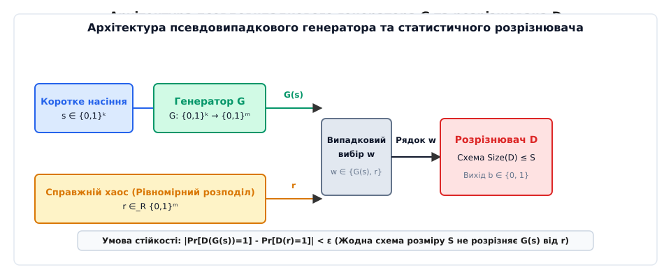
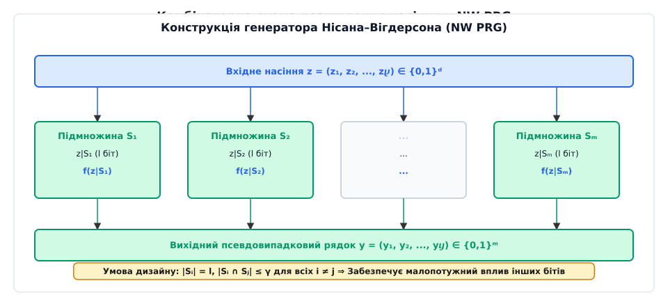
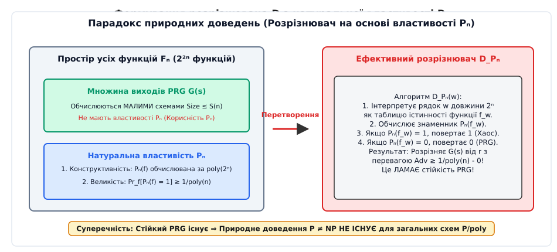

# Псевдовипадкові генератори та бар'єр природних доведень

<preknowlist>
- [Проблема P проти NP](topic:computability/p-vs-np) — фундаментальне питання складності обчислень про рівність детермінованого та недетермінованого поліноміального часу.
- [Клас P/poly](topic:computability/p-poly) — клас мов, що розпізнаються неоднорідними сімействами булевих схем поліноміального розміру.
- [Натуральні доведення](topic:computability/natural-proofs) — фундаментальний мета-математичний бар'єр Разборова та Рудіча для нижніх оцінок складності схем.
- [Клас BPP](topic:computability/bpp) — ймовірнісні поліноміальні алгоритми з двосторонньою обмеженою помилкою.
</preknowlist>

У 1994 році Олександр Разборов та Стівен Рудіч сформулювали парадокс на межі криптографії та комбінаторної теорії складності: існування стійких псевдовипадкових генераторів — алгоритмів, які розширюють коротку насінину у довгий бітовий потік, нерозрізнений від справжнього хаосу жодною булевою схемою обмеженого розміру, — принципово блокує стандартні математичні методи доведення схемної складності. Якщо псевдовипадковий генератор `G: {0,1}ᵏ → {0,1}ᵐ` здатний розтягнути 128-бітну насінину в послідовність довжиною 1 мегабайт, яку не може відрізнити від хаосу жодна схема розміру `2^(k^ε)`, то будь-яка комбінаторна властивість, спроможна довести складність функції, може бути перетворена на ефективний алгоритм розрізнення, що зламає цей генератор. Таким чином, фундаментальні засади сучасної криптографії утворюють непроникний бар'єр проти комбінаторних доведень `P ≠ NP`.

---

## 1. Фундаментальна парадигма псевдовипадковості в теорії складності

Щоб зрозуміти природу псевдовипадковості, необхідно відмовитися від класичного уявлення про хаос як абсолютну нестисливість даних. У теорії обчислювальної складності послідовність вважається псевдовипадковою не тому, що вона позбавлена внутрішньої структури, а тому, що **жоден ефективний алгоритм спостереження не в змозі виявити цю структуру за обмежений час**.

### Обчислювальна нерозрізненність (Computational Indistinguishability)

Формально детермінований алгоритм `G: {0,1}ᵏ → {0,1}ᵐ` (де `m > k`) називається **псевдовипадковим генератором** (PRG), якщо він приймає коротку рівномірно випадкову насінину `s ∈_R {0,1}ᵏ` довжини `k` і обчислює довший бітовий рядок `G(s)` довжини `m`, який є обчислювально нерозрізненним від абсолютно випадкового рядка `r ∈_R {0,1}ᵐ`.

Класична схема оцінки нерозрізненності спирається на поняття **статистичного розрізнювача** (англ. *statistical distinguisher*). Розрізнювачем називається булева схема або детермінований алгоритм `D: {0,1}ᵐ → {0,1}`, який намагається відрізнити псевдовипадковий вихід генератора від справжнього хаосу.

```
                  ┌──────────────────────┐
                  │    Джерело насіння   │
                  │      s ∈ {0,1}ᵏ      │
                  └──────────┬───────────┘
                             │
                             ▼
                  ┌──────────────────────┐
                  │    Генератор G       │
                  │   G: {0,1}ᵏ → {0,1}ᵐ │
                  └──────────┬───────────┘
                             │ G(s)
                             ▼
 ┌──────────────┐     ┌──────────────┐     ┌─────────────────────┐
 │ Справжній    │     │ Випадковий   │ w   │ Розрізнювач D       │  Вихід
 │ хаос r       ├────►│ вибір входу  ├────►│ Схема Size(D) ≤ S   ├───────► b ∈ {0,1}
 │ r ∈_R {0,1}ᵐ │     │ w ∈ {G(s),r} │     │                     │
 └──────────────┘     └──────────────┘     └─────────────────────┘
```

**Перевагою розрізнення** (англ. *distinguishing advantage*) схеми `D` проти генератора `G` називається абсолютна різниця ймовірностей видачі одиниці на псевдовипадковому та випадковому розподілах:

```
Adv_D(G) = | Pr_{s ∈_R {0,1}ᵏ}[ D(G(s)) = 1 ] - Pr_{r ∈_R {0,1}ᵐ}[ D(r) = 1 ] |
```

Якщо для всіх схем `D` розміру, що не перевищує `S`, перевага розрізнення є строго меншою за `ε` (`Adv_D(G) < ε`), кажуть, що генератор `G` є `(S, ε)`-стійким.


*Архітектура псевдовипадкового генератора G та процедура тестування розрізнювачем D.*

### Однорідні та неоднорідні розрізнювачі

Важливо розрізняти тип моделі обчислень розрізнювача `D`:
- **Однорідний розрізнювач (Uniform Distinguisher)**: Імовірнісна машина Тюринга поліноміального часу `BPP`.
- **Неоднорідний розрізнювач (Non-uniform Distinguisher)**: Сімейство булевих схем поліноміального розміру `P/poly`.

Оскільки схема з класу `P/poly` може кодувати довільну пораду для кожної довжини входу `m`, неоднорідна стійкість генератора є набагато сильнішою вимогою, ніж однорідна. У криптографії та бар'єрах природних доведень розглядаються саме неоднорідні розрізнювачі, оскільки нижні оцінки складності доводяться для схем `P/poly`.

### Універсальна еквівалентність: Тести Яо та непередбачуваність бітів

Ендрю Яо (Andrew Yao) у 1984 році довів фундаментальну теорему, яка пов'язує статистичні тести нерозрізненності з можливістю передбачення бітів.

Нісан і Яо показали, що послідовність бітів `G(s)` проходить усі статистичні тести нерозрізненності для схем розміру `S` тоді й лише тоді, коли жодна булева схема розміру `S'` не здатна вгадати `i`-тий біт послідовності `G(s)ᵢ` за її префіксом `(G(s)₁, ..., G(s)ᵢ₋₁)` з імовірністю, більшою за `1/2 + ε / m`.

Розглянемо математичний механізм доведення цієї еквівалентності через гібриди:
1. Зафіксуємо гібриди `H₀ = r` та `Hⴘ = G(s)`.
2. Якщо схема `D` має перевагу розрізнення `|Pr[D(G(s))=1] - Pr[D(r)=1]| ≥ ε`, за нерівністю трикутника знайдеться крок `i`, на якому `|Pr[D(Hᵢ)=1] - Pr[D(Hᵢ₋₁)=1]| ≥ ε / m`.
3. Оскільки `Hᵢ` та `Hᵢ₋₁` відрізняються лише у позиції `i` (у `Hᵢ` там стоїть детермінований біт `G(s)ᵢ`, а у `Hᵢ₋₁` — випадковий біт `rᵢ`), схема `D` дає точний алгоритм передбачення біта `G(s)ᵢ` за префіксом.

Цей результат спростив аналіз псевдовипадкових генераторів: замість перевірки всіх можливих комбінаторних тестів нерозрізненності достатньо довести, що жоден алгоритм не здатний передбачити наступний біт послідовності.

### Теорема HILL: Зв'язок односторонніх функцій та PRG

Фундаментальне досягнення теоретичної криптографії — теорема HILL (Гастад, Імпальяццо, Левін, Лубі, 1989/1999) — встановила остаточний зв'язок між фундаментальними обчислювальними припущеннями:

> Псевдовипадкові генератори криптографічної якості існують тоді й лише тоді, коли існують односторонні функції (англ. *one-way functions*).

Односторонньою функцією `f: {0,1}ⁿ → {0,1}ⁿ` називається функція, яка обчислюється за поліноміальний час, проте обернення `f⁻¹(y)` є обчислювально нездійсненним за поліноміальний час для будь-якого ймовірнісного алгоритму. Отже, криптографічна псевдовипадковість базується на тому ж фундаменті, що й криптографія з відкритим ключем.

### Ключова відмінність: Криптографічні PRG проти дерандомізаційних PRG

У теорії обчислень існує два фундаментально різних сімейства псевдовипадкових генераторів, які відрізняються співвідношенням ресурсів:

1. **Криптографічні PRG (Blum-Micali-Yao)**: Генератор `G` є надзвичайно швидким (обчислюється за малий поліноміальний час `poly(k)`), а розрізнювач `D` володіє значно більшим ресурсом часу `poly(m)`. Криптографічні генератори будуються на основі передбачуваної складності математичних задач (як-от дискретне логарифмування, факторизація чисел або складнообчислювальні односторонні функції).
2. **Дерандомізаційні PRG (Nisan-Wigderson)**: Генератор `G` сам по собі може бути складним і спиратися на таблицю істинності функції з класу `E = DTIME(2^(O(n)))`, проте він конструюється так, щоб дурити відносно малі схеми `D` поліноміального розміру `Size(D) ≤ m^c`. Головною метою таких генераторів є усунення випадковості із ймовірнісних алгоритмів класу `BPP`.

[Історію відкриття дерандомізації та бар'єра природних доведень](topic:computability/pseudorandom-generator/hist-prg-natural-proofs.md) детально розкрито у хронологічному описі: від праць Блюма, Мікалі та Яо початку 1980-х років до проривної мета-теореми Разборова та Рудіча на симпозіумі FOCS 1994 року.

---

## 2. Конструкція Нісана–Вігдерсона та парадигма Hardness vs. Randomness

У 1994 році Ноам Нісан та Аві Вігдерсон запропонували алгебраїчний механізм перетворення будь-якої складнообчислюваної булевої функції на псевдовипадковий генератор. Цей підхід отримав назву парадигми **«Складність проти випадковості»** (Hardness vs. Randomness).

### Матриця комбінаторного дизайну (Combinatorial Design)

Ключовим елементом NW-генератора є спеціальний вибір підмножин індексів вхідного насіння, які мають малий взаємний перетин.

Нехай `z ∈ {0,1}ᵈ` — вхідне насіння довжини `d`. Обирається сімейство з `m` підмножин `S₁, S₂, ..., Sⴘ ⊂ {1, 2, ..., d}`, яке задовольняє дві умови `(m, l, d, γ)`-дизайну:
- Кожна підмножина має розмір `|Sᵢ| = l`.
- Перетин будь-яких двох різних підмножин не перевищує `γ`: `|Sᵢ ∩ Sⱼ| ≤ γ` для всіх `i ≠ j`.

Генератор Нісана–Вігдерсона `NW_f: {0,1}ᵈ → {0,1}ᵐ` обчислює кожен `i`-тий біт вихідної послідовності шляхом застосування базової «складної» функції `f: {0,1}ˡ → {0,1}` до проекції насіння `z|Sᵢ`:

```
NW_f(z) = ( f(z|S₁),  f(z|S₂),  ...,  f(z|Sⴘ) )
```


*Комбінаторна схема розширення насіння z у псевдовипадковий бітовий рядок y у NW PRG.*

Завдяки тому, що різні підмножини `Sᵢ` та `Sⱼ` перетинаються лише по `γ` бітах, біти вихідного рядка `y = NW_f(z)` майже не залежать один від одного. Якщо базова функція `f` вимагає великих булевих схем для свого обчислення, то вихід `NW_f(z)` є нерозрізненним від випадкового рядка.

### Явна алгебраїчна побудова дизайнів над скінченними полями

Створення комбінаторного дизайну виконується через графіки багаточленів над скінченними полями Галуа `GF(q)`. Зафіксувавши `q = 2ᵏ`, елементами універсальної множини обираються пари `(x, y) ∈ GF(q) × GF(q)`. Оскільки поле містить `q` елементів, розмір універсальної множини дорівнює `d = q²`.

Кожна з `m` підмножин відповідає багаточлену `Pᵢ(x)` степеня не вище `r` над `GF(q)`. Оскільки кількість таких багаточленів становить `qʳ⁺¹`, ми можемо побудувати `m = qʳ⁺¹` підмножин. Підмножина `Sᵢ` складається з `q` точок виду `(x, Pᵢ(x))`, тобто `|Sᵢ| = q = l`.

Оскільки два різних багаточлени степеня не вище `r` можуть перетинатися не більше ніж у `r` точках (основна теорема алгебри), перетин будь-яких двох підмножин строго задовольняє умову `|Sᵢ ∩ Sⱼ| ≤ r = γ`. 

Ця точна алгебраїчна побудова дає дизайн з параметрами `d = q²`, `l = q`, `m = qʳ⁺¹`, `γ = r`.

### Посилення складності (Hardness Amplification)

У вихідній теоремі Нісана–Вігдерсона вимагалося, щоб базова функція `f` була найгіршим чином складною (англ. *worst-case hard*). У 1997 році Рассел Імпальяццо та Аві Вігдерсон розробили методику **посилення складності** (Hardness Amplification):

> Якщо в класі `E` існує функція `f`, яку не може обчислити жодна схема розміру `2^(Ω(n))` навіть на `1%` входів, її можна алгоритмічно перетворити за допомогою коду Ріда–Соломона та предиката Голдрейха–Левіна на нову функцію `g`, яку жодна схема не може передбачити з імовірністю, кращою за `1/2 + ε`.

Це дозволило сформулювати остаточну теорему дерандомізації: `E` вимагає експоненціальних схем тоді й лише тоді, коли `P = BPP`.

### Лема про реконструкцію та трьохрежимна дерандомізація BPP

Фундаментальна теорема Нісана–Вігдерсона стверджує: якщо існує схема `D` розміру `S`, яка розрізняє вихід `NW_f(z)` від хаосу з перевагою `ε`, то функцію `f` можна обчислити новою булевою схемою `C` розміру:

```
Size(C) ≤ Size(D) + m · 2gamma
```

[Математичний аналіз NW-генератора та леми про реконструкцію](topic:computability/pseudorandom-generator/math-nw-generator-reconstruction.md) містить точне виведення цієї леми через гібридний аргумент Яо та фіксацію зовнішніх змінних підмножин.

З залежності між складністю функції `f` та довжиною насіння `d` випливає три основних режими дерандомізації ймовірнісного класу `BPP`:

```
1. Експоненціальна складність (Hardness Paradigm):
   Size(f) = 2^(Ω(l))  ⇒  d = O(log m)  ⇒  P = BPP (Повна дерандомізація)

2. Субекспоненціальна складність:
   Size(f) = 2^(l^δ)   ⇒  d = m^ε       ⇒  BPP ⊆ DTIME(2^(n^ε))

3. Поліноміальна складність:
   Size(f) = l^k       ⇒  d = m / 2     ⇒  Слабка дерандомізація
```

---

## 3. Формалізація бар'єра природних доведень (Natural Proofs Framework)

Паралельно з розвитком псевдовипадкових генераторів дослідники намагалися розділити класи складності `P` і `NP` за допомогою нижніх оцінок схемної складності. Найпопулярнішим підходом вважався аналіз комбінаторних властивостей таблиць істинності булевих функцій.

Позначимо через `F⴮` множину всіх `2^(2ⁿ)` булевих функцій від `n` змінних. Таблиця істинності кожної такої функції являє собою бітовий рядок довжини `N = 2ⁿ`.

Властивістю булевих функцій називається підмножина `P⴮ ⊆ F⴮`. Доведення нижніх оцінок через комбінаторні властивості зазвичай діє за схемою: математик будує критерій `P⴮` і доводить, що якщо функція `f` володіє властивістю `P⴮`, то її схемна складність перевищує поріг `S(n)` (`Size(f) > S(n)`).

У 1994 році Олександр Разборов та Стівен Рудіч дали формальне визначення **натуральної (природної) властивості**.

### Три стовпи натуральної властивості

Властивість булевих функцій `P⴮ ⊆ F⴮` називається **`S(n)`-натуральною з мірою `δ(n)`**, якщо вона задовольняє три математичні вимоги:

1. **Конструктивність (Constructivity)**: Властивість `P⴮` є обчислювально ефективною. Існує алгоритм (або родина булевих схем), який за таблицею істинності функції `f` довжини `N = 2ⁿ` перевіряє, чи належить `f` до `P⴮`, за час, поліноміальний від довжини таблиці: `poly(N) = 2^(O(n))`.
2. **Великість / Поширеність (Largeness)**: Властивість `P⴮` є притаманною значній частині функцій. Рівномірно випадкова булева функція `R ∈_R F⴮` володіє властивістю `P⴮` з імовірністю не меншою за `δ(n)`:
   ```
   Pr_{R ∈_R F⴮}[ R ∈ P⴮ ] ≥ δ(n) ≥ 1 / poly(n)
   ```
3. **Корисність проти схем S(n) (Usefulness)**: Кожна функція `f`, яка володіє властивістю `P⴮`, вимагає булевих схем розміру, строго більшого за `S(n)`:
   ```
   Якщо f ∈ P⴮  ⇒  Size(f) > S(n)
   ```

### Детальний розбір комбінаторних методів 1980-х років

Майже всі відомі нижні оцінки складності схем 1980-х років виявилися натуральними доведеннями:

1. **Метод апроксимації Разборова (1985)**: Для доведення монотонної складності функції кліки Разборов побудував апроксимаційні оператори над монотонними диз'юнкціями. Перевірка того, чи має функція відхилення від усіх малих монотонних схем, зводиться до аналізу її таблиці істинності за час `2^(O(n))` (конструктивність). Випадкова булева функція має величезне відхилення з імовірністю `1 - o(1)` (великість). Отже, доведення Разборова для монотонних схем є натуральним.
2. **Переключна лема Гостада (1987)**: Доведення нижніх оцінок для схем обмеженої глибини `AC0` (доведення складності функції парності). Переключна лема стверджує, що при випадковій фіксації більшості змінних будь-яка КНФ або ДНФ малої ширини з високою ймовірністю перетворюється на функцію залежну від декількох змінних. Властивість «не спрощуватися при випадковій фіксації» перевіряється перебором приписів за `2^(O(n))` часу (конструктивність) і властива більшості випадкових функцій (великість).
3. **Спектральний метод Смоленського (1987)**: Для схем класу `AC0[p]` (схеми обмеженої глибини з вентилями додавання за модулем `p`). Смоленський довів, що будь-яка функція, обчислювана малюю схемою з `MOD_p` вентилями, можна наближати поліномом низького степеня над скінченним полем `GF(p)`. Властивість «не апроксимуватися низькоступеневими поліномами над `GF(p)`» легко перевіряється спектральним аналізом за час `2^(O(n))` і притаманна `99.9%` всіх булевих функцій.

---

## 4. Теорема Разборова–Рудіча: Чому PRG ламають природні доведення

Головний результат Разборова та Рудіча розкриває фундаментальний конфлікт між існуванням стійких псевдовипадкових генераторів та можливістю побудови натуральних доведень.

### Механізм перетворення натуральної властивості на розрізнювач

Припустимо, що в теоретично-складносному світі існує `S(k)`-стійкий псевдовипадковий генератор `G: {0,1}ᵏ → {0,1}ᴺ`, де `N = 2ⁿ`, а складність обчислення самого генератора обмежена поліномом `poly(k)`.

Припустимо також, що математики сконструювали `S(n)`-натуральну властивість `P⴮` з мірою великості `δ(n) ≥ 1 / poly(n)`.

Побудуємо на основі властивості `P⴮` статистичний розрізнювач `D_P` за наступним алгоритмом:

```
Алгоритм розрізнювача D_P(w) для рядка w довжини N = 2ⁿ:
1. Інтерпретувати вхідний рядок w як таблицю істинності функції f_w від n змінних.
2. Обчислити значення натуральної властивості P⴮(f_w).
3. Якщо P⴮(f_w) = 1, повернути 1 (прийняти рядок як справжній хаос).
4. Якщо P⴮(f_w) = 0, повернути 0 (прийняти рядок як вихід PRG).
```


*Парадокс природних доведень: побудова ефективного розрізнювача D з натуральної властивості Pₙ.*

Проаналізуємо поведінку розрізнювача `D_P` на двох вихідних розподілах:

1. **На справді випадковому рядку `r ∈_R {0,1}ᴺ`**:
   Рядок `r` відповідає рівномірно випадковій булевій функції `R ∈_R F⴮`. За умовою **великості** натуральної властивості, `P⴮(R) = 1` з імовірністю принаймні `δ(n)`:
   ```
   Pr_{r}[ D_P(r) = 1 ] = Pr_{R}[ R ∈ P⴮ ] ≥ 1 / poly(n)
   ```

2. **На псевдовипадковому виході генератора `G(s)`**:
   Кожен вихідний рядок `G(s)` являє собою таблицю істинності функції `f_s`, яка обчислюється генератором `G` від насіння `s` довжини `k`. Оскільки генератор є обчислювально ефективним (`poly(k)`), схемна складність кожної такої функції `f_s` є малою:
   ```
   Size(f_s) ≤ poly(k) ≤ S(n)
   ```
   Але за умовою **корисності** натуральної властивості, жодна функція зі складністю `Size(f) ≤ S(n)` **не може** володіти властивістю `P⴮`! Отже, для всіх псевдовипадкових виходів `G(s)` значення `P⴮(f_s)` тотожно дорівнює 0:
   ```
   Pr_{s}[ D_P(G(s)) = 1 ] = Pr_{s}[ f_s ∈ P⴮ ] = 0
   ```

### Підсумкова суперечність

Обчислимо перевагу розрізнення сконструйованої схеми `D_P`:

```
Adv_{D_P}(G) = | Pr_{s}[ D_P(G(s)) = 1 ] - Pr_{r}[ D_P(r) = 1 ] |
             = | 0 - Pr_{r}[ R ∈ P⴮ ] |
             ≥ 1 / poly(n)
```

За умовою **конструктивності**, схема `D_P` обчислюється за час `poly(N) = 2^(O(n))`. Якщо обрати довжину насіння `k = n^c`, то розмір схеми `D_P` становить `poly(k)`, що не перевищує поріг стійкості `S(k)`.

Отримана позитивна перевага розрізнення `Adv_{D_P}(G) ≥ 1 / poly(n)` означає, що схема `D_P` **успішно зламала псевдовипадковий генератор `G`**!

Це доводить фундаментальну **мета-теорему Разборова–Рудіча**:

> **Теорема (Разборов, Рудіч).** Якщо існують `S(k)`-стійкі псевдовипадкові генератори, обчислювані у класі `P/poly` (або навіть у `TC0`), то не існує жодної `S(n)`-натуральної властивості для доведення нижніх оцінок схемної складності проти цього класу.

### Криптографічні кандидати стійких генераторів

Припущення про існування стійких псевдовипадкових генераторів є надзвичайно міцним і лежить в основі сучасної практичної криптографії:
- **Генератор Наора–Райнгольда (Naor-Reingold)**: Будується на основі важкості проблеми обчислення решіток або дифузних послідовностей і обчислюється схемами малого розміру класу `TC0` (схеми з вентилями порогового підсумовування).
- **Генератор Блюма–Блюма–Шуба (BBS)**: Спирається на складність знаходження квадратних залишків за модулем Блюма `N = p · q`.
- **Симметричні блокові шифри (AES/Rijndael)**: Режим лічильника (CTR) створює псевдовипадковий потік, обчислюваний малим схемним розміром.

Якщо припустити, що хоча б один із цих генераторів є стійким до схем розміру `2^(k^ε)`, це автоматично доводить неіснування натуральних доведень нижніх оцінок для схем `TC0` та `P/poly`.

[Інтерфейс модуля псевдовипадкового генератора та тестування розрізнювачів](topic:computability/pseudorandom-generator/api-prg-interface.md) деталізує практичну специфікацію C API для побудови подібних статистичних тестів нерозрізненності.

---

## 5. Обіхід бар'єра: Неприродні доведення та сучасні напрями в теорії

Бар'єр Разборова–Рудіча не означає, що нерівність `P ≠ NP` є принципово недовідною. Він показує лише те, що **класичні комбінаторні методи, які задовольняють умови конструктивності та великості, досягли своєї межі**.

Для прориву крізь бар'єр теорія складності розробляє підходи, які свідомо порушують принаймні одну з вимог натуральності:

### 1. Порушення вимоги великості (Non-large properties)

Математичний критерій складності може шукатися серед властивостей, якими володіє **надзвичайно мала частка функцій** (імовірність виникнення на випадковій функції є нехтовно малою `2^(-O(n))`).

Прикладом є спеціальні алгебраїчні властивості, притаманні лише детермінованим поліномам низького степеня, або геометрія кодових відстаней у теорії кодування. Натуральний розрізнювач `D_P` на таких властивостях дасть `Pr[D_P(r) = 1] ≈ 0`, і його перевага розрізнення впаде до нуля, що не загрожує стійкості PRG.

### 2. Порушення вимоги конструктивності (Non-constructive proofs)

Якщо перевірка належності функції `f` до властивості `P⴮` вимагає надзоряного часу (наприклад, неалгоритмічного аналізу чи часу `2^(2ⁿ)`), то така властивість не може бути реалізована поліноміальною схемою `D_P`. Відповідно, стійкість псевдовипадкового генератора не ламається.

### 3. Програма Раяна Вільямса: Алгоритми для нижніх оцінок

У 2010-х роках Раян Вільямс (Ryan Williams) запропонував новаторський підхід до побудови нижніх оцінок через швидкі нетривіальні алгоритми розв'язання задачі `SAT` для обмежених схем.

Метод Вільямса використовує нетривіальні алгоритми аналізу схем для побудови **неприродних** нижніх оцінок. Зокрема, Вільямсу вдалося довести, що клас `NEXP` (недетермінований експоненціальний час) не належить до класу схем `ACC0` (схеми обмеженої глибини з вентилями додавання за модулем). Це стало першим великим проривом у нижніх оцінках схем за останні два десятиліття, який успішно оминув бар'єр Разборова–Рудіча.

### 4. Алгебраїзація (Algebration Barrier)

У 2008 році Скотт Ааронсон та Аві Вігдерсон сформулювали третій великий бар'єр теорії складності — **алгебраїзацію** (англ. *algebration*). Вони узагальнили бар'єр релятивізації на випадки, коли оракул розширюється низькоступеневими поліномами над скінченними полями (як це робиться у протоколах інтерактивних доведень `IP = PSPACE`).

Бар'єр алгебраїзації показує, що навіть арифметизаційні методи (які лежать в основі теореми Шаміра `IP = PSPACE` та теореми PCP) самі по собі не здатні розділити `P` і `NP`. Це вимагає використання специфічних не-оракульних властивостей булевих обчислень.

### 5. Геометрична теорія складності (Geometric Complexity Theory, GCT)

Започаткована Кетеном Мульмулеєм (Ketan Mulmuley) та Міліндом Сохані (Milind Sohoni) програма GCT пропонує розділити `P` і `NP` (а точніше, їхні алгебраїчні аналоги `VP` і `VNP` у моделі Валіанта) через теорію репрезентацій алгебраїчних груп та алгебраїчну геометрію.

В рамках GCT не шукаються комбінаторні натуральні властивості. Замість цього аналізуються орбіти обчислювальних многовидів (наприклад, многовиду перманента та детермінанта) і шукаються **структурні обдурюючі мономи** (англ. *obstructing representation modules*). Оскільки такі геометричні монументальні об'єкти виникають лише в алгебраїчних групах симетрій і не є притаманними більшості випадкових функцій, програма GCT повністю оминає бар'єр Разборова–Рудіча.

[Практичну реалізацію NW-генератора мовами C та C++](topic:computability/pseudorandom-generator/proj-nw-generator.md) детально розглянуто у проектній вставці, де продемонстровано розгортання насіння та алгоритм вибірки індексів підмножин.

---

## 6. Підсумковий синтез

Псевдовипадкові генератори та бар'єр природних доведень демонструють глибинну внутрішню єдність теорії складності обчислень та криптографії.

Те, що в криптографії є **перемогою** (створення стійких незаламних генераторів `G`), у комбінаторній теорії схем виявляється **нездоланною перешкодою** (неможливістю виявити простоту виходів `G(s)` через комбінаторні критерії). Зрозуміти цей бар'єр означає усвідомити, що майбутнє доведення `P ≠ NP` полягає не у звичайному накопиченні складних комбінаторних лем, а в розробці принципово нових алгебраїчних та алгоритмічних методів, вільних від ланцюгів натуральності.
