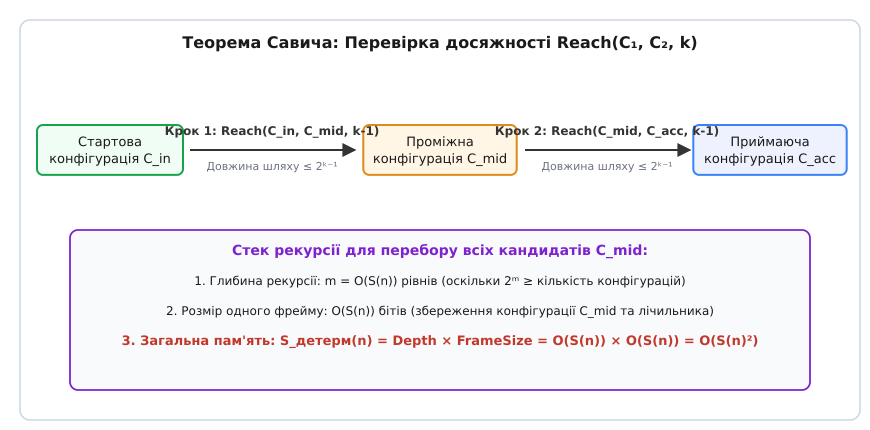
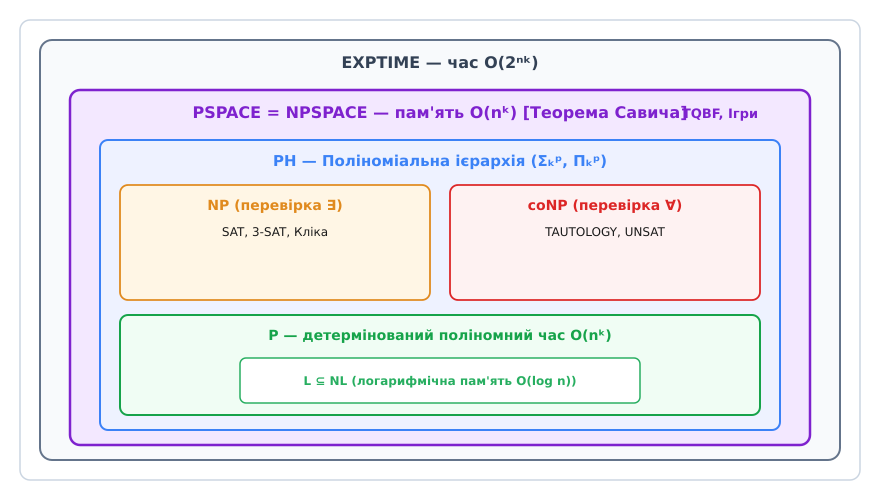
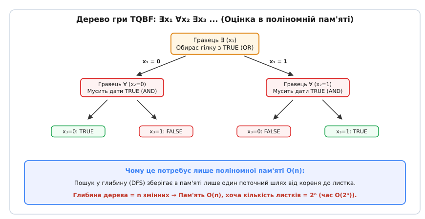

# Клас PSPACE: поліноміальна пам'ять, ігри двох гравців та незламні межі обчислень

<preknowlist>
- [Асимптотична складність](topic:computability/asymptotic-complexity) — поняття поліномного O(nᵏ) та експоненційного 2ⁿ часу, просторова складність DSPACE і NSPACE.
- [NP-повнота](topic:computability/np-completeness) — класи P, NP, coNP, асиметрія пошуку розв'язку та перевірки готового свідка.
- [Машина Тюринга](topic:computability/turing-machine) — детерміновані та недетерміновані обчислювачі, стрічка, конфігурація та функція переходу.
- [Задача здійсненності (SAT)](topic:computability/boolean-satisfiability) — булеві формули, зведення за поліномний час, структура виконання обмежень.
- [Поліноміальна ієрархія](topic:computability/polynomial-hierarchy) — вежі з чергуванням кванторів, оракульні машини та класи Σₖᵖ, Πₖᵖ.
</preknowlist>

Спроба змоделювати поведінку автоматичного автопілота літака або системи керування ядерним реактором ставить перед обчислювальною технікою задачу фундаментально іншого характеру, ніж звичайний пошук маршруту в навігаторі. Навігатору достатньо знайти один короткий шлях з пункту A в пункт B (класична задача з класу P або NP). Проте інженерна верифікація автопілота вимагає відповіді на значно складніше запитання: «Чи правда, що для **будь-якої** комбінації повітряних турбулентностей та відмов датчиків **існує** така послідовність корекцій штурвала, яка втримає судно на траєкторії?». 

Цей пошук створює глибоке дерево взаємодій двох супротивників: зовнішнього середовища, яке намагається дестабілізувати систему, та алгоритму керування, який намагається її врятувати. Якщо випробувати всі варіанти на звичайному процесорі за один прохід, кількість можливих сценаріїв перевищить кількість атомів у спостережуваному Всесвіті. Проте комп'ютер володіє унікальною властивістю, якої позбавлений часовий вимір обчислень: **оперативну пам'ять можна стирати й використовувати знову**. Очистивши кілька кілобайт після перевірки одного сценарію, програма перезаписує їх для дослідження наступного. 

Саме ця здатність до безконечного перевикористання простору утворює математичний фундамент **класу PSPACE** (Polynomial Space) — класу задач, які розв'язуються за допомогою обсягу пам'яті, пропорційного поліному від розміру вхідних даних `O(nᵏ)`.

> 📜 **Історія визрівання:** [від несподіваного відкриття Савича до тотожності IP = PSPACE](topic:computability/pspace/hist-pspace.md) — як математики 1970–1990-х років виявили слабкість недетермінізму у просторі, довели PSPACE-повноту кванторних формул та об'єднали пам'ять з інтерактивними доведеннями.

---

## 1. Парадокс перезапису: чому пам'ять вирішує більше за час

Щоб збагнути справжню силу класу PSPACE, необхідно зіставити дві головні фізичні ресурси алгоритму: час виконання `T(n)` та оперативну пам'ять `S(n)`.

Між цими величинами існує фундаментальна асиметрія:
- **Час незворотний:** кожен виконаний такт процесора згорає назавжди. Якщо алгоритм працює `T(n)` кроків, він не може «повернути» витрачені секунди назад.
- **Пам'ять перезаписувана:** якщо осередку пам'яті виділено `S(n)` бітів, алгоритм може записати туди значення `0`, використати його для обчислень, очистити в `0` і записати нове значення `1`.

```
Витрата часу (безповоротна):
Крок 1 ──> Крок 2 ──> Крок 3 ──> ... ──> Крок T(n) [Разом: T(n) кроків]

Витрата пам'яті (перезаписувана):
[ Комірка M₁ ] ── (використали для Гілки A) ──> [ Стерли ] ──> (використали для Гілки B)
```

Звідси випливає ключовий парадокс: **алгоритм із поліномною пам'яттю O(nᵏ) здатний виконуватися експоненційний час 2^{O(nᵏ)}**.

Як це можливо? Погляньмо на систему з точки зору математичної теорії автоматів. Нехай машина Тюринга має обмеження на пам'ять `S(n) = nᵏ`. У кожен момент часу стан усієї програми повністю описується її **конфігурацією** — сукупністю внутрішнього стану процесора, позиції зчитувальної головки та поточних символів у всіх `S(n)` комірках пам'яті.

Загальна кількість унікальних конфігурацій `N`, у яких може перебувати така машина, обмежена зверху:
```
N = |Q| · n · S(n) · |Γ|^{S(n)} ≤ 2^{c · S(n)}
```
де `|Q|` — кількість внутрішніх станів, `|Γ|` — розмір алфавіту стрічки, а `c > 0` — стала величина.

Якщо детермінована програма працює довше за `N` кроків, то за принципом Діріхле вона неминуче зайде в одну й ту саму конфігурацію двічі. А оскільки машина детермінована, з цього моменту вона потрапить у зациклення й ніколи не зупиниться. Отже, **будь-який детермінований алгоритм, який гарантовано зупиняється в межах пам'яті S(n), робить не більше ніж 2^{O(S(n))} кроків**.

Поліноміальна пам'ять дає алгоритму розкіш проводити експоненційно глибокі розшуки, стираючи й перебираючи варіанти, доки загальний час обчислення не сягне межі `2^{O(nᵏ)}`.

---

## 2. Формальне означення класів PSPACE та NPSPACE

У теорії складності обчислювальні ресурси моделюють за допомогою багатострічкових машин Тюринга. Для точного вимірювання пам'яті використовують модель, де вхідні дані записані на **вхідній стрічці тільки для читання** (read-only), а обчислення проводяться на окремій **робочій стрічці**. Це дозволяє коректно розглядати навіть сублінійні обсяги пам'яті (наприклад, `O(log n)`).

### Означення DSPACE та NSPACE
- **DSPACE(f(n)):** клас мов (задач розпізнавання), які розв'язуються *детермінованою* машиною Тюринга, що використовує не більше ніж `O(f(n))` комірок на робочій стрічці для входу довжини `n`.
- **NSPACE(f(n)):** клас мов, які розв'язуються *недетермінованою* машиною Тюринга, де на кожній гілці дерево обчислень використовує не більше ніж `O(f(n))` комірок робочої стрічки.

```
Формальні об'єднання класів PSPACE та NPSPACE:

PSPACE  = ⋃_{k ≥ 1} DSPACE(nᵏ)
NPSPACE = ⋃_{k ≥ 1} NSPACE(nᵏ)
```

Таким чином, **PSPACE** — це множина всіх задач, для яких існує детермінований алгоритм, що потребує обсяг оперативної пам'яті, обмежений деяким поліномом `nᵏ` від розміру входу. Аналогічно, **NPSPACE** припускає наявність недетермінованого вгадування на кожному кроці, за умови що жодна гілка обчислень не виходить за межі поліномної пам'яті.

---

## 3. Теорема Савича: несподіване стирання недетермінізму

У теорії часової складності недетермінізм вважається джерелом колосальної сили. Питання `P vs NP` запитує, чи можна недетермінований пошук за поліномний час замінити детермінованим алгоритмом. Більшість фахівців переконані, що `P ≠ NP`, тобто недетермінований час дає експоненційний стрибок у потужності.

Однак у 1970 році американський математик Уолтер Савич (Walter Savitch) навів доведення твердження, яке радикально відрізняє просторову складність від часової.

> 🧮 **Математичний вивід:** [строге доведення теореми Савича та оцінка рекурсивного стеку](topic:computability/pspace/math-savitch.md) — математичний аналіз рекурентного рівняння `Space(i) = Space(i-1) + O(S(n))` та згортання графів конфігурацій.

### Склеювання гілок через рекурсивний поділ
Савич довів, що будь-яку недетерміновану машину з пам'яттю `S(n) ≥ log n` можна повністю змоделювати детермінованою машиною з пам'яттю `O(S(n)²)`:

```
Теорема Савича (1970):
For any space-constructible f(n) ≥ log n:
NSPACE(f(n)) ⊆ DSPACE(f(n)²)
```


*_Рекурсивна перевірка досяжності у графі конфігурацій за теоремою Савича з квадратичним споживанням пам'яті O(S(n)²)._*

Ідея доведення полягає в перетворенні обчислення NDTM на задачу досяжності у графі конфігурацій `G = (V, E)`.
Нам потрібно перевірити, чи існує шлях у графі від початкового стану `C_start` до приймаючого стану `C_accept` за не більше ніж `N = 2^{c · S(n)}` кроків.

Замість зберігання шляху або перебору в ширину (що потребувало б експоненційної пам'яті), детермінований алгоритм викликає рекурсивну функцію `Reach(C₁, C₂, k)`, яка перевіряє досяжність за `≤ 2ᵏ` кроків:
1. Якщо `k = 0`, перевіряємо, чи `C₁ == C₂` або чи є прямий перехід за 1 крок.
2. Якщо `k > 0`, перебираємо всі можливі проміжні конфігурації `C_mid` довжини `O(S(n))`.
3. Для кожного кандидата `C_mid` послідовно викликаємо:
   - `Reach(C₁, C_mid, k - 1)`
   - `Reach(C_mid, C₂, k - 1)`

Глибина рекурсивного стеку становить лише `k = O(S(n))` рівнів. На кожному рівні стек зберігає одну поточну конфігурацію `C_mid` розміру `O(S(n))`.

Обчислимо загальну пам'ять стеку:
```
Загальна пам'ять = Глибина_стеку × Розмір_фрейму
                = O(S(n)) × O(S(n))
                = O(S(n)²)
```

### Наслідок для PSPACE
Якщо `S(n) = nᵏ` є поліномом, то квадрат полінома `(nᵏ)² = n^{2k}` також є поліномом.

Звідси випливає фундаментальна тотожність теорії складності:
```
PSPACE = NPSPACE
```

Недетермінізм у просторовій складності не додає принципово нових можливостей! Він дає лише квадратичне стиснення пам'яті. Це колосально відрізняється від часового світу, де відсутність подібного результату утримує прірву між P та NP.

---

## 4. Вежа складності: вкладення класів від L до EXPTIME

Складемо цілісну картину того, як PSPACE співвідноситься з іншими фундаментальними класами складності.


*_Ієрархія класів складності: від логарифмічної пам'яті L до експоненційного часу EXPTIME з центральним місцем PSPACE._*

Розглянемо ланцюг вкладення класів:
```
L ⊆ NL ⊆ P ⊆ NP ⊆ PH ⊆ PSPACE = NPSPACE ⊆ EXPTIME
```

Розберемо кожне включення за кроками causal-ієрархії:

1. **`P ⊆ PSPACE`:** Будь-який детермінований алгоритм, що працює за поліномний час `O(nᵏ)`, фізично не здатний торкнутися більше ніж `O(nᵏ)` комірок стрічки, оскільки за один крок зчитувальна головка зсувається лише на один осередок.
2. **`NP ⊆ PSPACE`:** Для задачі з класу NP існує детермінований перевіряч `V(I, w)`, який валідує свідок `w` поліномної довжини `|w| ≤ nᵏ`. Машина PSPACE може послідовно згенерувати всі `2^{|w|}` можливих свідків, перевіряючи кожен за допомогою `V`. Після перевірки кожного свідка робоча стрічка **очищається й перезаписується**. Загальна пам'ять дорівнює лише `O(nᵏ)`.
3. **`PH ⊆ PSPACE`:** Поліноміальна ієрархія складена з рівнів `Σₖᵖ` та `Πₖᵖ`, де задачі вимагають чергування `k` кванторів над свідками поліномної довжини. Оскільки `k` є фіксованою константою для кожного рівня, PSPACE-машина може оцінити будь-яку таку формулу через рекурсивний DFS-перебір глибини `k`, споживаючи `O(k · nᵐ) = O(nᵐ)` пам'яті.
4. **`PSPACE ⊆ EXPTIME`:** Як було доведено в §1, кількість унікальних конфігурацій машини з пам'яттю `O(nᵏ)` не перевищує `2^{c · nᵏ}`. Будь-який алгоритм PSPACE, який зупиняється, працює не більше ніж цей час, а отже, входить до детермінованого експоненційного часу EXPTIME.

### Що з цього доведено строго?
Згідно з **теоремою про ієрархію простору** (Space Hierarchy Theorem), суворе збільшення пам'яті розширює клас задач:
```
DSPACE(f(n)) ⊊ DSPACE(g(n))   при f(n) = o(g(n))
```
Звідси строго випливає, що:
```
L ⊊ PSPACE    та    PSPACE ⊊ EXPSPACE
```

Крім того, ми знаємо з часової ієрархії (Time Hierarchy Theorem), що `P ⊊ EXPTIME`. Оскільки `P ⊆ NP ⊆ PSPACE ⊆ EXPTIME`, **щонайменше одне із проміжних включень у цій триаді має бути суворим (strict)**! Тобто принаймні одна з рівностей не справджується: або `P ≠ NP`, або `NP ≠ PSPACE`, або `PSPACE ≠ EXPTIME`. Проте теорія складності досі не знає, яка саме з цих дверей зачинена, або чи всі вони зачинені одночасно.

Також PSPACE містить такі важливі класи, як **⊕P (Parity-P)** та **#P (Sharp-P)**, оскільки обчислення кількості задовольняючих наборів або перевірка їхньої парності вимагає лише лічильника розміру `O(n)` бітів, який збільшується при проходженні повного дерева варіантів у глибину.

---

## 5. TQBF — Серце складності PSPACE

Для оцінки важкості задач у класах складників використовують поняття **повноти** (completeness). Задача називається PSPACE-повною, якщо вона належить до PSPACE і будь-яка інша задача з PSPACE може бути зведена до неї за поліномний час `P`.

Канонічною PSPACE-повною задачею є **TQBF** (True Quantified Boolean Formulas — істинні кванторні булеві формули), яка виконує для PSPACE таку саму роль, яку [SAT](topic:computability/boolean-satisfiability) виконує для NP.

### Від SAT до TQBF
Звичайна задача SAT запитує, чи існує набір змінних, що робить формулу істинною:
```
SAT (NP-повна):
∃ x₁ ∃ x₂ ... ∃ xₙ  ϕ(x₁, x₂, ..., xₙ)
```

Задача TQBF знімає обмеження однорідності кванторів. У ній допускається **довільне чергування кванторів існування (∃) та загальності (∀)**:
```
TQBF (PSPACE-повна):
Q₁ x₁ Q₂ x₂ ... Qₙ xₙ  ϕ(x₁, x₂, ..., xₙ),   де Qᵢ ∈ {∃, ∀}
```

*Приклад формули TQBF:*
```
∃ x₁  ∀ x₂  ∃ x₃  [ (x₁ ∨ x₂) ∧ (¬x₂ ∨ x₃) ∧ (¬x₁ ∨ ¬x₃) ]
```

Щоб з'ясувати істинність цієї формули, нам потрібно перевірити: «Чи існує таке значення `x₁`, що для **обох** варіантів `x₂ = 0` та `x₂ = 1` знайдеться таке значення `x₃`, при якому бескванторна частина дає 1?».

> ⚙️ **Практична реалізація:** [обчислювач TQBF у поліномній пам'яті C та C++](topic:computability/pspace/proj-tqbf-evaluator.md) — робочий код оцінювача кванторних формул на основі пошуку в глибину зі збереженням O(N) пам'яті.

### Чому TQBF розв'язується в поліномній пам'яті?
Алгоритм оцінки TQBF працює за допомогою рекурсивного розгалуження:
- Якщо перший квантор `∃ x₁`, обчислюємо `Eval(x₁=0)` та `Eval(x₁=1)`. Результат: `Eval(x₁=0) ∨ Eval(x₁=1)`.
- Якщо перший квантор `∀ x₁`, обчислюємо `Eval(x₁=0)` та `Eval(x₁=1)`. Результат: `Eval(x₁=0) ∧ Eval(x₁=1)`.

Глибина рекурсивного дерева викликів строго дорівнює кількості змінних `N`. Кожен стековий фрейм зберігає лише поточний біт змінної.
Отже, споживання пам'яті становить **`O(N)` бітів**, хоча дерево обчислень містить `2ᴺ` листків і вимагає експоненційного часу `O(2ᴺ)`.

---

## 6. Комбінаторні ігри двох гравців та ігрова семантика

Структура кванторного чергування `∃ x₁ ∀ x₂ ∃ x₃ ∀ x₄ ...` природно ізоморфна **комбінаторній грі двох гравців** з повною інформацією.


*_Ігрова семантика TQBF: чергування виборів гравців ∃ та ∀ та його оцінка через пошук у глибину зі стеком O(n)._*

Розглянемо дуель двох супротивників:
- **Гравець 1 (Existential, ∃):** відповідає за вибір змінних з квантором `∃`. Йому достатньо знайти хоча б одну переможну гілку (логічне АБО).
- **Гравець 2 (Universal, ∀):** відповідає за вибір змінних з квантором `∀`. Він намагається збити Гравця 1 і перевіряє всі можливі контратаки (логічне І).

Формула TQBF є істинною тоді й лише тоді, коли **Гравець 1 має гарантовану виграшну стратегію**.

### Поліномна довжина ходів — межа PSPACE
Більшість класичних настільних ігор, зіграних на дошці розміру `n × n` з поліномним обмеженням на загальну кількість ходів `poly(n)`, є **PSPACE-повними**:

1. **Generalized Geography (Узагальнена географія):** Гра на орієнтованому графі. Гравці по черзі пересувають фішку вздовж дуг. Повторне відвідування вершин заборонено. Той, хто не може зробити крок, програє. Це прямий графовий еквівалент TQBF.
2. **Hex (на дошці n × n):** Заповнення шестикутних комірок двох кольорів. Доведено, що визначення переможця в довільній позиції є PSPACE-повною задачею.
3. **Sokoban (з обмеженою кількістю ходів):** Головоломка з пересуванням ящиків у лабіринті.
4. **Обмежені шахи та шашки (Bounded Chess/Checkers):** Якщо встановити правило, що гра завершується нічиєю після `nᵏ` ходів без узяття фігур, аналіз позиції стає PSPACE-повним.

```
Правило межі складності ігор:
- Ходи обмежені поліномом poly(n) ──> PSPACE-повна задача (пошук DFS у пам'яті O(n))
- Ходи НЕ обмежені (можливі цикли)  ──> EXPTIME-повна задача (потрібен аналіз графу станів)
```

Якщо ж гра дозволяє нескінченні повторення позицій без обов'язкового обмеження на довжину (як звичайні шахи на дошці `n × n` за правилом 50 ходів), розмір дерева ходів зростає до `2^{2^{O(n)}}`, а задача аналізу виграшної стратегії переходить у вищий клас **EXPTIME-повноти**.

---

## 7. Практичні застосування, верифікація та оракули

Прикладне значення класу PSPACE поширюється далеко за межі теоретичних ігор. До цього класу належать критичні задачі розробки складних програмно-апаратних систем.

### 1. Верифікація програм та LTL Model Checking
У сучасній розробці мікропроцесорів і критичного ПЗ (авіоніка, медичні стимулятори, автомобільні гальма) використовують метод **Model Checking**. Властивості системи описують мовою лінійного темпорального логічного аналізу (LTL — Linear Temporal Logic).

Задача перевірки, чи задовольняє модель скінченного автомата з `S` станами темпоральну формулу `ϕ` довжини `|ϕ|`, має складність **PSPACE-повноти відносно довжини формули `|ϕ|`**.

### 2. Автоматичне планування (Automated Planning)
У робототехніці та штучному інтелекті задача STRIPS-планування вимагає знайти послідовність дій, яка переведе робота з початкового стану в цільовий за умови обмежених ресурсів. Якщо кількість дій не перевищує поліномного обмеження на розмір стану, формальне планування є PSPACE-повним.

### 3. Еквівалентність та універсальність автоматів (NFA)
Для детермінованих скінченних автоматів (DFA) перевірка еквівалентності розв'язується за поліномний час P. Однак для **недетермінованих автоматів (NFA)**:
- Задача **NFA Universality** («Чи приймає NFA абсолютно всі можливі рядки?»): PSPACE-повна.
- Задача **NFA Equivalence** («Чи збігаються мови двох NFA?»): PSPACE-повна.

Це пов'язано з тим, що детермінізація NFA (алгоритм побудови підмножин) вимагає переходу до автомата з `2ᴺ` станами. PSPACE-алгоритм може виконувати цю детермінізацію на льоту, не зберігаючи весь експоненційний автомат у пам'яті.

### 4. Інтерактивні доведення: IP = PSPACE
Одним із найвеличніших відкриттів теорії складності стала **теорема Шаміра (1990)**:
```
IP = PSPACE
```
Клас **IP** описує задачі, у яких недовірений Доводжувач з необмеженими обчислювальними ресурсами переконує імовірнісного поліномного Перевіряча в істинності твердження за допомогою поліномної кількості раундів запитань і відповідей.

Це означає, що **все, що можна розв'язати у поліноміальній пам'яті, можна інтерактивно довести верифікатору за поліномний час**! Цей результат став містком між теорією просторової складності та сучасною криптографією із нульовим розголошенням (Zero-Knowledge Proofs).

---

> 🔧 **Навіщо це розробникові.**
> Розуміння меж класу PSPACE захищає інженера від марних спроб побудувати точний детермінований алгоритм швидкого пошуку там, де задача принципово вимагає глибокого DFS-перебору. Коли ви розробляєте верифікатор формальних специфікацій, аналізатор регулярних виразів для NFA або бот для комбінаторної гри, усвідомлення PSPACE-повноти підказує правильний архітектурний вибір: замість пошуку точного розв'язку "в лоб" слід застосовувати емуляцію на основі [QSAT/SMT-сольверів](topic:computability/np-completeness), евристичний пошук alpha-beta з відсіканням гілок або імовірнісні методи Монте-Карло (MCTS).
