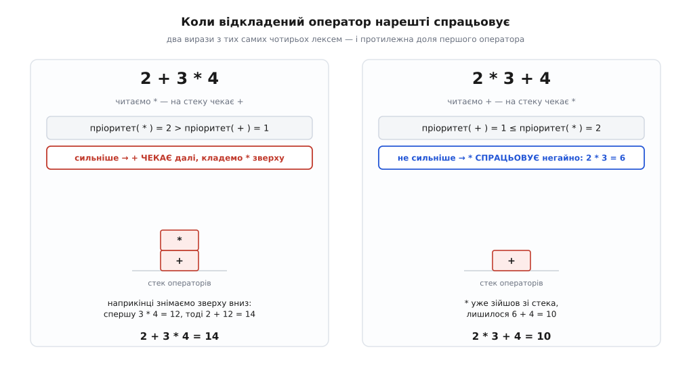
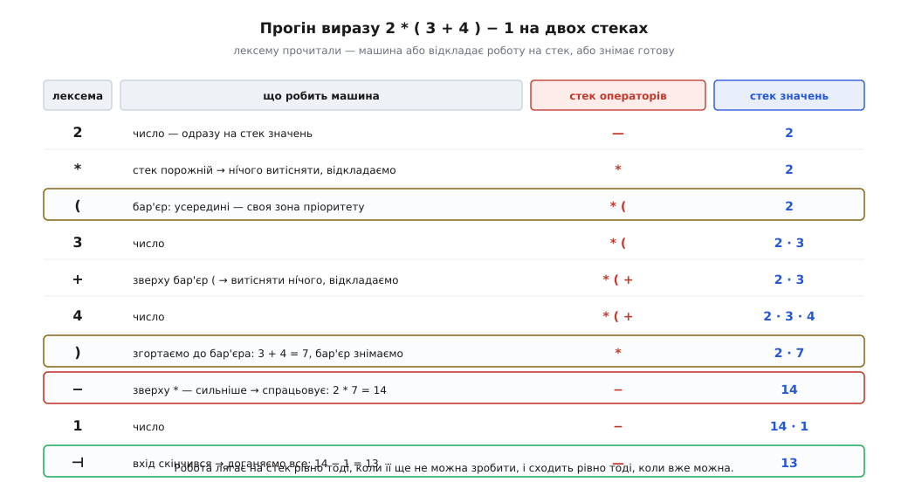
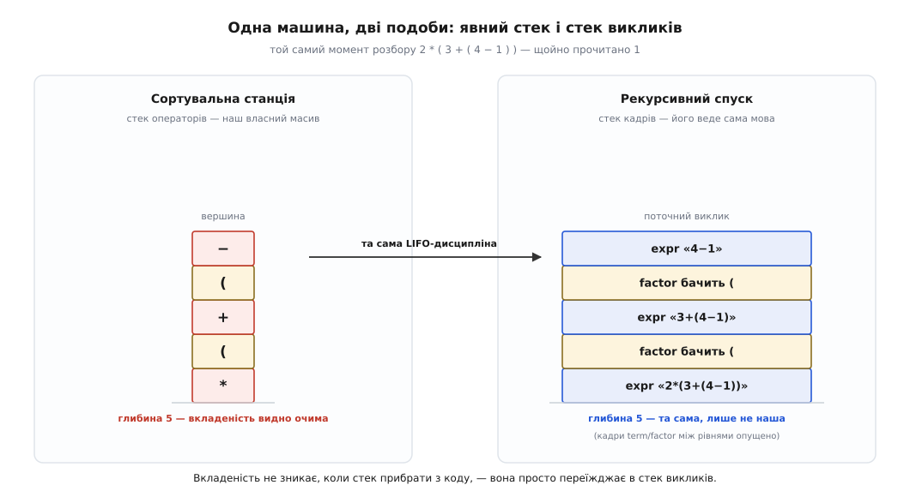

# ⚙️ Розбір арифметичного виразу: машина, що відкладає роботу

`2*(3+4)-1` — тринадцять. Око бачить відповідь швидше, ніж рука встигає її записати, і здається, що рахувати тут нема чого. Але спробуйте пояснити, **як саме** ви це порахували, — і виявиться, що ви робили щось геть не схоже на читання зліва направо. Око стрибало: спершу всередину дужки, потім назовні до множення, аж наприкінці — до віднімання. Машині так не можна: вона читає рядок так, як їй дано, символ за символом, і не має права ні зазирнути вперед, ні повернутися назад.

## Задача

Подивімося, що з цього виходить.

Прочитали `2`. Прочитали `*`. Здавалося б, множення — ось воно, множ. Але на що? Другого множника ще немає, а те, що йде далі, — ціла дужка, яку саму спершу треба порахувати. Множення доводиться **відкласти**.

Гаразд, це через дужку. Приберімо дужки зовсім: `2+3*4`. Прочитали `2`, прочитали `+`, прочитали `3`. Тепер у `+` є обидва операнди — 2 і 3, усе на місці. Додаємо? Ні. Наступний символ — `*`, і він хапає трійку собі. Правильна відповідь — 14, а не 20. Плюс мусив чекати, хоч на вигляд був цілком готовий спрацювати.

Ось корінь задачі, і він не в дужках: **порядок, у якому лексеми надходять, не збігається з порядком, у якому їх треба виконувати**. Це не вада запису, а його природа. Інфіксний запис (від лат. *infixus* — вставлений усередину) ставить оператор **між** операндами — і тоді доля оператора залежить від того, що стоїть **праворуч** від нього, тобто від тексту, якого машина ще не бачила. Читання йде в один бік, обчислення — в інший.

Отже, машині доведеться щось **відкладати**: тримати прочитане, але ще не виконане, доки не настане його час. Постає точне питання — **що саме відкладати, куди це складати і за яким правилом діставати назад**. Відповідь на всі три частини дає одна структура, і зараз стане видно, чому саме вона.

Спокуса обійтися лічильником дужок тут не працює принципово: вкладеність нічим не обмежена, а `2*(3+(4-(5+6)))` вимагає пам'ятати всі відкладені множення й додавання одночасно. Скінченним набором прапорців такого не втримати — і саме тому це робота для машини зі стеком, а не для лічильника.

## Ідея: відкладати те, чого ще не можна зробити

Придивімося уважніше до моменту, коли `+` довелося чекати, і порівняймо його з майже тим самим виразом, де чекати не довелося.

`2+3*4`: читаємо `*`, а на черзі стоїть відкладений `+`. Множення сильніше — воно забирає трійку собі, тож `+` не має права спрацювати: його правий операнд ще не готовий — щойно з'ясувалося, що це цілий добуток `3*4`. Плюс чекає далі.

`2*3+4`: читаємо `+`, а на черзі стоїть відкладений `*`. Тепер навпаки — плюс **слабший**, він на трійку не претендує. Отже, у `*` більше нема на що чекати: обидва його операнди на місці й ніхто їх уже не відбере. Множення спрацьовує **негайно**, просто тут, і 2·3 = 6 стає готовим числом.

Два майже однакові рядки — і протилежна доля першого оператора. Різницю робить одне порівняння, і з нього виростає все правило:

```
Відкладений оператор спрацьовує рівно тоді,
коли наступний оператор НЕ сильніший за нього.
Сильніший наступний — відкладений чекає далі.
```


*Одне порівняння пріоритетів вирішує долю відкладеного оператора. Ліворуч наступний оператор сильніший — плюс лишається чекати, і відкладена робота накопичується. Праворуч наступний не сильніший — множення вже ніхто не перебиває, воно спрацьовує негайно й сходить із черги. Обидва вирази складені з тих самих чотирьох лексем; уся різниця — в тому, який оператор трапився другим.*

Тепер найважливіше — **якого роду сховище** для цієї відкладеної роботи потрібне. Придивімося до порядку, у якому вона стає готовою. Оператор чекає, бо його перебив сильніший. Але той сильніший, спрацювавши, звільняє **того, кого перебив останнім**. У `2+3*4` першим спрацьовує `*` (відкладений останнім), і аж тоді `+` (відкладений першим). Заглибтеся ще: `2+3*4^5` — чекають `+`, потім `*`, потім `^`; готовність приходить у зворотному порядку, від `^` назад до `+`.

Це не збіг, а прямий наслідок правила. Оператор потрапляє на чергу лише тому, що наступний виявився сильнішим за нього; отже, все, що ляже поверх нього, буде **сильніше** й дозріє **раніше**. Відкладена робота дозріває строго у зворотному порядку до того, як її відкладали. А сховище з правилом «останнім поклав — першим узяв» — це стек, і ніщо інше тут не підійде: черга віддавала б у прямому порядку, масив із довільним доступом дозволяв би зазирати всередину, чого нам просто не треба. Структура не вигадана під задачу — вона в задачі **виявлена**.

> 🔧 **Навіщо це.** Правило «спрацьовує, коли наступний не сильніший» — це вся таблиця пріоритетів, зведена до одного порівняння чисел. Коли пріоритет живе в одній таблиці, а не розповзається по гілках `if`, додати новий оператор — це дописати рядок; змінити старшинство — виправити число. Парсери, у яких пріоритет «зашитий» у структуру коду, доводиться переписувати щоразу, коли в мові з'являється ще один знак.

## Дужка — це бар'єр

Лишилися дужки, і на тлі правила вони стають майже тривіальними. Що робить `(`? Вона каже: усередині мене — окремий світ, і жоден зовнішній оператор туди не дотягнеться. Тобто `(` — це **бар'єр** на стеку: те, що лежить під ним, тимчасово не бере участі в порівняннях пріоритету. Читаючи `+` усередині дужки, ми дивимося на вершину стека, бачимо там бар'єр — і порівнювати нема з чим, просто відкладаємо.

А `)` каже: світ закінчився, підбий підсумок. Знімаємо й виконуємо все до бар'єра, тоді прибираємо сам бар'єр. Після цього дужка зникає безслідно, лишивши по собі одне готове число, — і зовнішній світ бачить на її місці звичайний операнд.

Ось чому дужки й пріоритет — це не дві різні механіки, а одна: дужка тимчасово **скасовує** пріоритет, огородивши шматок виразу. І тому в коді вона коштує один `push` і один цикл `pop` — не більше.

## Код: сортувальна станція

Алгоритм, що це робить, звуть **сортувальною станцією** (*shunting-yard*). Назва — залізнична: на сортувальній станції вагони заганяють із головної колії на бічну, притримують там і випускають назад у потрібному порядку. Бічна колія — це стек, вагони — оператори.

Опис алгоритму дав Едсгер Дейкстра у звіті `MR 35` «ALGOL 60 translation» (Mathematisch Centrum, Амстердам, листопад 1961) — тому самому, що описував перший у світі компілятор ALGOL 60, який Дейкстра зробив із Яапом Зоневельдом для машини Electrologica X1. *(Дрібниця для точності: частина вторинних джерел подає номер звіту як «MR 34/61» — це, схоже, плутанина, бо MR 34 — інший звіт того самого 1961 року, «On the Design of Machine-Independent Programming Languages».)*

Тут варто відразу відняти зайве, бо ім'я Дейкстри легко перетягує на себе всю історію. **Саму** ідею рахувати вирази стеком він не винаходив: її ще в середині 1950-х запропонували Фрідріх Бауер і Клаус Замельсон у Технічному університеті Мюнхена під назвою *Kellerprinzip* («принцип льоху»: як у баварському пивному льосі, остання закочена бочка відкривається першою), 1957 року подали на неї німецький патент, а тоді описали друком у «Sequentielle Formelübersetzung» наприкінці десятиліття. Внесок Дейкстри — конкретний однопрохідний алгоритм і його дуже зручне формулювання, а не стек як такий. Сам постфіксний запис, до якого сортувальна станція природно веде, тягнеться ще далі: бездужкову нотацію придумав польський логік Ян Лукасевич у 1920-х, її постфіксний варіант описали 1954 року Артур Беркс, Дон Воррен і Джессі Райт, а незалежно від них і вже прямо для обчислень — австралієць Чарлз Гемблін наприкінці 1950-х. Класична річ із багатьма батьками, де кожен доклав свою окрему частину: нотацію, структуру даних, алгоритм.

Класична сортувальна станція перекладає інфікс у постфікс, а вже той рахують. Але постфікс — це лише проміжна стрічка, і якщо потрібне саме число, її можна не матеріалізувати: рахувати відразу, тримаючи **два** стеки — операторів (те, що чекає) і значень (те, що вже пораховано). Виходить менше коду й наочніший автомат, тож зробімо так.

:::tabs
```python
import operator
import re

# Лексер: рядок → список лексем. Числа стають числами, решта лишається символом.
TOKEN = re.compile(r"\s*(?:(\d+(?:\.\d+)?)|(.))")

def tokenize(src):
    pos, out = 0, []
    while pos < len(src):
        m = TOKEN.match(src, pos)
        if not m:
            break
        pos = m.end()
        num, sym = m.group(1), m.group(2)
        if num is not None:
            out.append(float(num))       # число — ОДНА лексема, а не окремі цифри
        elif sym.strip():
            out.append(sym)
    return out

# Таблиця операторів — ЄДИНЕ місце, де живе пріоритет.
# (пріоритет, асоціативність, дія)
OPS = {
    '+': (1, 'left',  operator.add),
    '-': (1, 'left',  operator.sub),
    '*': (2, 'left',  operator.mul),
    '/': (2, 'left',  operator.truediv),
    '^': (3, 'right', operator.pow),
}

def apply_top(vals, ops):
    """Зняти один оператор і два його операнди — покласти назад результат."""
    op = ops.pop()
    if len(vals) < 2:
        raise SyntaxError("оператору «%s» бракує операнда" % op)
    b = vals.pop()                       # правий операнд зняли ПЕРШИМ…
    a = vals.pop()                       # …лівий другим: стек віддає у зворотному порядку
    vals.append(OPS[op][2](a, b))

def evaluate(src):
    vals, ops = [], []                   # порахувати вже можна / ще ні
    for t in tokenize(src):
        if isinstance(t, float):         # число — одразу готове
            vals.append(t)
        elif t == '(':                   # бар'єр: усередині своя зона пріоритету
            ops.append(t)
        elif t == ')':                   # згорнути все до бар'єра
            while ops and ops[-1] != '(':
                apply_top(vals, ops)
            if not ops:
                raise SyntaxError("зайва закривна дужка")
            ops.pop()                    # сам бар'єр геть — дужка зникла безслідно
        elif t in OPS:
            prec, assoc, _ = OPS[t]
            while ops and ops[-1] != '(':            # бар'єр зупиняє порівняння
                top_prec = OPS[ops[-1]][0]
                # ось воно, все правило — в одному if:
                if top_prec > prec or (top_prec == prec and assoc == 'left'):
                    apply_top(vals, ops)             # вершині вже ніхто не завадить
                else:
                    break                            # вершина чекає далі
            ops.append(t)
        else:
            raise SyntaxError("невідомий символ «%s»" % t)

    while ops:                           # вхід скінчився — доганяємо все відкладене
        if ops[-1] == '(':
            raise SyntaxError("незакрита дужка")
        apply_top(vals, ops)
    if len(vals) != 1:
        raise SyntaxError("вираз не склався")
    return vals[0]
```
```cpp
#include <cctype>
#include <cmath>
#include <map>
#include <stack>
#include <stdexcept>
#include <string>

struct Op {
    int    prec;                          // пріоритет: більше — міцніше в'яже
    bool   left;                          // лівоасоціативний?
    double (*apply)(double, double);      // сама дія
};

// Таблиця операторів — ЄДИНЕ місце, де живе пріоритет.
static const std::map<char, Op> OPS = {
    {'+', {1, true,  [](double a, double b) { return a + b; }}},
    {'-', {1, true,  [](double a, double b) { return a - b; }}},
    {'*', {2, true,  [](double a, double b) { return a * b; }}},
    {'/', {2, true,  [](double a, double b) { return a / b; }}},
    {'^', {3, false, [](double a, double b) { return std::pow(a, b); }}},
};

// Зняти один оператор і два його операнди — покласти назад результат.
static void applyTop(std::stack<double>& vals, std::stack<char>& ops) {
    const char op = ops.top(); ops.pop();
    if (vals.size() < 2)
        throw std::runtime_error(std::string("оператору бракує операнда: ") + op);
    const double b = vals.top(); vals.pop();   // правий операнд зняли ПЕРШИМ…
    const double a = vals.top(); vals.pop();   // …лівий другим
    vals.push(OPS.at(op).apply(a, b));
}

double evaluate(const std::string& src) {
    std::stack<double> vals;               // порахувати вже можна
    std::stack<char>   ops;                // ще ні — чекає

    for (std::size_t i = 0; i < src.size(); ) {
        const char c = src[i];

        if (std::isspace(static_cast<unsigned char>(c))) { ++i; continue; }

        if (std::isdigit(static_cast<unsigned char>(c))) {   // число цілком, не по цифрі
            std::size_t len = 0;
            vals.push(std::stod(src.substr(i), &len));       // len — де число скінчилося
            i += len;
            continue;
        }

        if (c == '(') { ops.push(c); ++i; continue; }        // бар'єр

        if (c == ')') {                                      // згорнути все до бар'єра
            while (!ops.empty() && ops.top() != '(') applyTop(vals, ops);
            if (ops.empty()) throw std::runtime_error("зайва закривна дужка");
            ops.pop();                                       // сам бар'єр геть
            ++i;
            continue;
        }

        const auto it = OPS.find(c);                         // оператор
        if (it == OPS.end())
            throw std::runtime_error(std::string("невідомий символ: ") + c);
        const Op& cur = it->second;
        while (!ops.empty() && ops.top() != '(') {           // бар'єр зупиняє порівняння
            const Op& top = OPS.at(ops.top());
            // ось воно, все правило — в одному if:
            if (top.prec > cur.prec || (top.prec == cur.prec && cur.left))
                applyTop(vals, ops);                         // вершині вже ніхто не завадить
            else
                break;                                       // вершина чекає далі
        }
        ops.push(c);
        ++i;
    }

    while (!ops.empty()) {                 // вхід скінчився — доганяємо відкладене
        if (ops.top() == '(') throw std::runtime_error("незакрита дужка");
        applyTop(vals, ops);
    }
    if (vals.size() != 1) throw std::runtime_error("вираз не склався");
    return vals.top();
}
```
:::

Два стеки — це дві різні долі прочитаного: `vals` тримає те, що вже зведено до числа, `ops` — те, що ще чекає свого часу. У C++ це видно буквально, бо стеки там — окремі типізовані предмети `std::stack<double>` і `std::stack<char>`; у Python роль стека грає звичайний список, у якого `append` — це push, а `pop` — це pop.

Умова, заради якої все затівалося, — оцей `if`:

```
top_prec > prec   або   (top_prec == prec  і  оператор лівоасоціативний)
```

Перша половина — саме правило «сильніший на вершині вже дозрів». Друга половина — про асоціативність, і на неї варто подивитися окремо, бо саме там ховається найтихіша помилка в усьому алгоритмі.

## Прогін

Проженімо `2*(3+4)-1` і подивімося на обидва стеки на кожній лексемі.


*Десять кроків, і в кожному машина робить рівно одне з двох: або відкладає роботу на стек, бо її ще не можна виконати, або знімає готову, бо вже можна. Два цікаві місця підсвічено. На `)` згортається все до бар'єра: 3 + 4 = 7, і дужка зникає, лишивши по собі одне число. На `−` вершиною виявляється сильніше `*` — воно дозріло й спрацьовує тут-таки: 2 · 7 = 14. Наприкінці стек операторів порожній, на стеку значень рівно одне число — це і є ознака того, що вираз склався.*

Два рядки таблиці варто перечитати. На `)` виконалося те, що лежало під бар'єром від самого початку дужки. А на `−` сталося найцікавіше: машина, прочитавши **слабкий** оператор, зрозуміла, що сильному вже нема чого чекати, і виконала множення, якого не могла виконати шість кроків тому. Відкладена робота дочекалася свого — рівно тієї миті, коли її нарешті стало можна зробити.

Кінцева перевірка теж не косметична: `len(vals) != 1` — це і є умова прийому. Один операнд на стеку значень і порожній стек операторів означають, що кожен оператор дістав своє й нічого зайвого не лишилося.

## Той самий автомат навиворіт: рекурсивний спуск

Є другий спосіб розібрати той самий вираз, і на вигляд він **не має стека взагалі**. Це варто побачити, бо він показує, звідки стек береться навіть тоді, коли ви його не писали.

Почнімо не з коду, а з опису того, як вираз узагалі влаштований, — із [контекстно-вільної граматики](topic:computability/formal-grammar). Граматика — це кілька правил-підстановок, що вирощують усі правильні рядки мови: зліва ім'я поняття, справа — з чого воно складається, і поняття вільно посилаються одне на одного, зокрема самі на себе. Ось увесь наш вираз, у чотирьох рядках:

```
expr   → term  (('+' | '−') term)*        сума доданків
term   → power (('*' | '/') power)*       добуток множників
power  → factor ('^' power)?              степінь
factor → число | '(' expr ')' | '−' factor    найдрібніше: число, дужка або мінус
```

Пріоритет тут ніде не записаний числом — він **у формі самих правил**. `expr` складений із `term`, а не навпаки; отже, доданки — це щось, зібране на нижчому рівні, і `+` бере вже готовий добуток. Старшинство перетворилося на глибину вкладеності правил. А `factor → '(' expr ')'` — це те місце, де правило посилається саме на себе через ланцюжок: звідси й береться довільна вкладеність дужок.

Тепер фокус: кожне правило стає функцією, [рекурсія](topic:sf-algorithms/recursion) в граматиці — рекурсією у виклику, і граматика буквально переписується в код.

```python
class Parser:
    """Кожне правило граматики — окрема функція. Явного стека тут немає."""

    def __init__(self, src):
        self.toks = tokenize(src)        # той самий лексер
        self.i = 0

    def peek(self):
        return self.toks[self.i] if self.i < len(self.toks) else None

    def eat(self, want=None):
        t = self.peek()
        if want is not None and t != want:
            raise SyntaxError("очікували «%s», а тут %r" % (want, t))
        self.i += 1
        return t

    def expr(self):                      # expr → term (('+' | '−') term)*
        v = self.term()
        while self.peek() in ('+', '-'):
            v = v + self.term() if self.eat() == '+' else v - self.term()
        return v

    def term(self):                      # term → power (('*' | '/') power)*
        v = self.power()
        while self.peek() in ('*', '/'):
            v = v * self.power() if self.eat() == '*' else v / self.power()
        return v

    def power(self):                     # power → factor ('^' power)?
        v = self.factor()
        if self.peek() == '^':
            self.eat()
            return v ** self.power()     # рекурсія ПРАВОРУЧ → правоасоціативність
        return v

    def factor(self):                    # factor → число | '(' expr ')' | '−' factor
        t = self.peek()
        if isinstance(t, float):
            return self.eat()
        if t == '-':                     # унарний мінус: тут він ні з чим не плутається
            self.eat()
            return -self.factor()
        if t == '(':
            self.eat()
            v = self.expr()              # ← вертаємося на самий верх: нова зона пріоритету
            self.eat(')')                # дужка мусить закритися
            return v
        raise SyntaxError("очікували число або «(», а тут %r" % (t,))

def evaluate(src):
    p = Parser(src)
    v = p.expr()
    if p.peek() is not None:             # дійшли до кінця? інакше десь зайве
        raise SyntaxError("зайве після виразу: %r" % (p.peek(),))
    return v
```

Жодної таблиці пріоритетів. Жодного `push`. Жодного порівняння `>` чи `>=`. І та сама відповідь: `evaluate("2*(3+4)-1")` дає 13.0, `evaluate("2+3*4")` — 14.0, `evaluate("2^3^2")` — 512.0.

То де ж подівся стек? Він нікуди не подівся — його просто веде не наш код, а мова. Коли `factor` бачить `(` і кличе `expr`, машина мусить запам'ятати, куди повертатися й у якому стані був виклик, — і кладе кадр на **стек викликів**. Вкладена дужка кладе ще кадр. Закривна дужка знімає його поверненням із функції. Це той самий push і pop, тільки написаний за нас.


*Один момент розбору, дві подоби однієї машини. Ліворуч вкладеність тримає стек, який ми написали власноруч: два бар'єри-дужки й три оператори, що чекають. Праворуч — стек кадрів, який завела сама мова, коли `factor` покликав `expr` усередині дужки. Глибина та сама, дисципліна та сама, і розкручується все це в тому самому порядку. Різниця лише в тому, хто веде стек.*

Ось чому це варто було показати: **прибрати стек із коду не означає прибрати стек**. Вкладеність виразу нікуди не дінеться — вона мусить десь відбитися, і якщо не в масиві, то в кадрах викликів. Рекурсивний спуск не обходить магазинний автомат, а реалізує його, віддавши магазин під керування мові.

> 🔧 **Навіщо це.** Так влаштована більшість справжніх парсерів мов програмування — від JSON-читачів до фронтендів компіляторів: правило граматики — функція, вкладеність — рекурсія. Тому граматику в документації мови можна читати як план коду, а код — як граматику; і тому, побачивши в чужому парсері функції з іменами `parse_expr`, `parse_term`, `parse_factor`, ви вже знаєте його будову, не читаючи тіл.

Сильні боки в цих двох підходів різні, і різняться вони показово. Асоціативність у сортувальній станції — це один символ порівняння; у рекурсивному спуску — **напрям рекурсії**: `power → factor ('^' power)?` рекурсує праворуч, у хвості, тому `2^3^2` збирається як `2^(3^2)`; а `expr` крутить `while` ліворуч, тому `8-3-2` збирається як `(8-3)-2`. Одна й та сама властивість, записана двома різними мовами. Унарний мінус, який у станції потребує окремої мороки, у спуску розв'язується одним рядком у `factor` — бо функція **знає, де вона стоїть**: коли викликали `factor`, тут за означенням очікується операнд, тож `-` може бути лише унарним. Ця обізнаність про контекст — головна перевага спуску; головна ж його вада — стек викликів, до якого зараз дійдемо.

## Складність

За часом обидва — **O(n)** за числом лексем, і це видно з коду, а не з інтуїції. Зовнішній цикл проходить кожну лексему рівно раз. Внутрішній `while` виглядає підозріло, ніби робить прохід квадратним, але порахуймо чесно: кожен оператор потрапляє на стек **рівно один раз** і сходить із нього **рівно один раз**. Скільки б ітерацій не зробив внутрішній цикл на окремому кроці, за весь прогін їх разом буде не більше, ніж було операторів. Витрата, розмазана на весь прохід, — константна на лексему; це класична обліково-амортизована оцінка.

За пам'яттю відповідь тонша, і варто вивести її чесно, бо звична відповідь «глибина вкладеності» — неповна. Стек операторів росте лише там, де покласти вже треба, а зняти ще нíчого. Погляньмо, коли таке буває:

```
вираз                      найбільший стек операторів
1+1+1+1+1+1+1+1+1+1               1     ← ліво-асоц ланцюг збивається негайно
1*2/3*4/5*6                       1
2*(3+4)-1                         3     ← «* ( +»
((((((1))))))                     6     ← бар'єр до своєї пари зняти нíчим
1^1^1^1^1^1^1^1^1^1^1^1          11     ← ПРАВО-асоц ланцюг: не збивається зовсім
```

Перший рядок — найкращий випадок: рівні лівоасоціативні оператори збивають один одного відразу, і стек не росте взагалі, скільки б доданків не було — хоч мільйон. Дужки, навпаки, кладуть бар'єр, якого до його пари зняти нíчим, тож глибина стека йде за глибиною вкладеності.

А останній рядок ламає просте правило. `1^1^1^...` — жодної дужки, вкладеність нульова, а стек росте лінійно. Причина — рівно в тій половині умови, що про асоціативність: правоасоціативний оператор рівного пріоритету вершину **не витісняє**, тож усі `^` лягають один на одного й чекають до самого кінця рядка. Інакше й не могло бути: найправіший степінь мусить порахуватися першим, а він аж наприкінці — доти не готовий жоден.

```
час:     O(n)  — кожна лексема: один push і не більш як один pop, разом
пам'ять: O(n)  у найгіршому разі — глибокі дужки або право-асоц ланцюг
         O(1)  на ланцюгу рівних ліво-асоц операторів: збиваються негайно
```

Верхня межа O(n) — не хиба реалізації, а рівно та свобода, яку дає означення магазинного автомата: стек нічим не обмежений. За цю свободу доводиться платити, і рахунок надходить у вигляді дуже конкретної пастки.

## Пастки

Найгірші збої тут — тихі: не падіння, а **неправильне число**. Ось чотири пастки, вартих імені.

**Асоціативність — той самий `>` замість `>=`.** Найтихіша з усіх. Умова витіснення для лівоасоціативних операторів мусить збивати вершину **рівного** пріоритету теж — інакше рівні оператори накопичуються на стеку й спрацьовують у зворотному порядку, тобто справа наліво. Помилка в один символ, а поводиться так:

```
вираз       правильно    з умовою «>» замість «>=»
8-3-2          3              7          ← зібралося як 8-(3-2)
8-3+2          7              3          ← зібралося як 8-(3+2)
100/5/2       10             40          ← зібралося як 100/(5/2)
1-2-3-4       -8             -2
2^3^2        512            512          ← а тут «>» правильно: степінь правоасоціативний
```

Останній рядок — ключ до всієї плутанини. Для `^` умова зі строгим `>` **правильна**, бо `2^3^2` за домовленістю означає `2^(3^2)` = 512, а не `(2^3)^2` = 64. Одна й та сама умова правильна для одних операторів і хибна для інших — тому асоціативність і мусить лежати в таблиці поруч із пріоритетом, а не в голові автора. Підступність у тому, що на `2+3*4` і `2*(3+4)-1` обидві версії дають однаково правильну відповідь: помилка спить, доки не трапляться два **однакові** оператори поспіль — а `a-b-c` у тестах чомусь пишуть рідше, ніж `a+b*c`.

**Незбалансовані дужки — обидва боки.** Провалюються вони по-різному, і перевірок потрібно **дві**. Зайва закривна: `1+2)` — на `)` доходимо до дна стека, не знайшовши бар'єра. Без перевірки `if not ops` тут буде `pop` із порожнього стека, тобто `IndexError` замість людського діагнозу. Незакрита: `(1+2` — вхід скінчився, а бар'єр досі лежить. Без перевірки `if ops[-1] == '('` фінальний цикл спробує **виконати дужку як оператор** — і `OPS['(']` дасть `KeyError`. Обидва місця легко забути, бо на правильних входах вони не спрацьовують ніколи. І от що показово: перевірка «чи є бар'єр» і перевірка «чи не лишився бар'єр» — це буквально та сама умова прийому магазинного автомата, «стек порожній наприкінці», прочитана з двох боків.

**Лексер, якого ніби й нема.** Спокуса пробігтися рядком по символу — найпоширеніший шлях до тихо зламаного парсера. `12+3` тоді читається як `1`, `2`, `+`, `3` — і на стеку опиняються два окремі числа замість дванадцяти. Далі за тим самим списком: `1.5` розпадається на три лексеми, `>=` — на два різні оператори, пробіли лізуть у таблицю як невідомі символи. Лексема — це не символ, і межа між [лексичним аналізом](topic:sf-lang/lexer-design) і розбором проведена не для краси: лексер зшиває символи в лексеми за плоскими, регулярними правилами, а стек уже працює з лексемами й займається лише вкладеністю. Змішаєте два шари — дістанете обидві задачі відразу, і жодної розв'язаної.

**Стек викликів не безмежний — на відміну від того, що в означенні.** Це найцікавіша пастка, бо вона розводить теорію й залізо. У магазинного автомата стек **нескінченний** — так записано в означенні. Стек викликів справжньої програми — ні, і рекурсивний спуск успадковує саме його межу. Ось виміряні числа: наша граматика витрачає рівно **чотири** кадри на одну дужку (`expr` → `term` → `power` → `factor`), тож при типовому обмеженні глибини рекурсії в 1000 кадрів парсер розбирає щонайбільше **248** вкладених дужок, а на 249-й падає — не з синтаксичною помилкою, а з `RecursionError`, тобто впирається якраз у [переповнення стека](topic:sf-lang/stack-overflow). Сортувальна станція на тому самому вході не помічає нічого: її стек — звичайний список у купі, і 100 000 вкладених дужок вона розбирає за десяту частку секунди.

```
вкладених дужок:       248         249        1 000      100 000
рекурсивний спуск:      ok      RecursionError  ✗           ✗
сортувальна станція:    ok          ok          ok      ok (~0.1 с)
```

Це не дрібниця й не вада Python — так поводиться будь-який рекурсивний спуск у будь-якій мові, тільки константи різні. Тому парсери, що читають чужий текст із мережі, або обмежують глибину явно, або тримають стек своїм — інакше рядок із десяти тисяч дужок стає способом покласти сервіс. Ось де «нескінченний стек» з означення перестає бути формальністю: різниця між моделлю й машиною тут вимірюється в конкретному числі 248.

**І одна не-пастка, варта згадки.** Обидва парсери повертають число — і разом із ним викидають структуру. Для калькулятора це те, що треба; але щойно знадобиться оптимізувати вираз, підставити змінні чи вивести його назад у текст, число вже не допоможе. Виправлення дрібне: там, де `apply_top` рахує `a + b`, нехай натомість збирає вузол `('+', a, b)` — і той самий алгоритм, без жодної зміни в логіці стека, побудує [абстрактне синтаксичне дерево](topic:sf-lang/abstract-syntax-tree). Стек — той самий, змінюється лише те, що на нього кладуть. Саме так і роблять справжні компілятори.

Отже, увесь розбір виразу зводиться до одного питання, яке машина ставить собі на кожній лексемі: **чи можна вже цю роботу зробити?** Якщо ні — на стек, бо дозріє вона строго в зворотному порядку. Якщо так — знімай і виконуй. Пріоритет вирішує, коли настає «так»; дужка ставить бар'єр, за який порівняння не заглядає; а сам стек — чи то написаний вами масив, чи то стек викликів, який завела мова, — тримає рівно ту вкладеність, що є у вході, і нічого понад неї.
