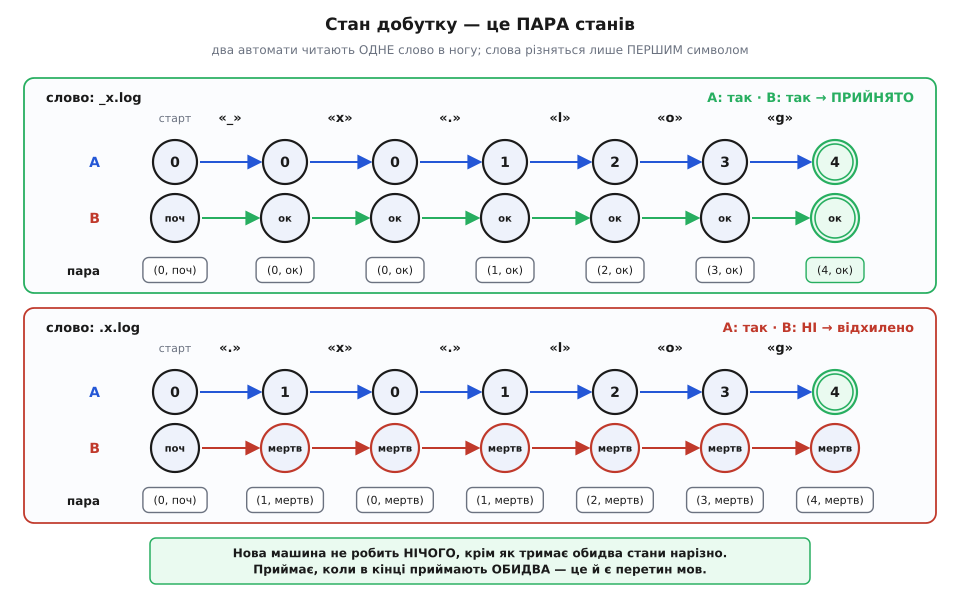
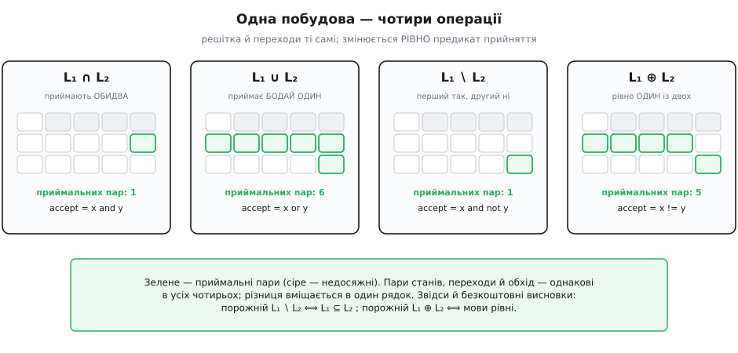
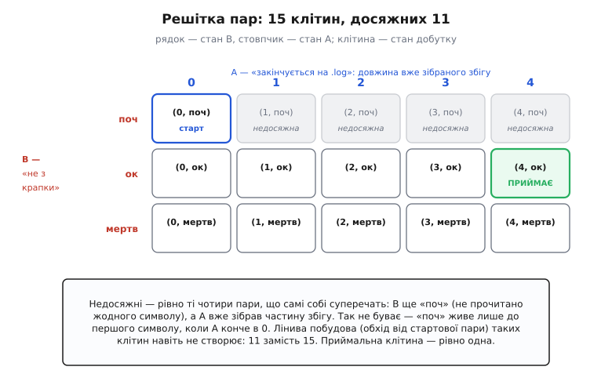

# ⚙️ Добутковий автомат: перетин двох мов однією машиною

Правило, яке легко сказати вголос: **ім'я файлу закінчується на `.log` і не починається з крапки**. Перша половина лишає самі журнали; друга викидає приховані файли — ті, що в Unix-традиції починаються з крапки й не показуються без окремої вказівки. Кожну половину окремо записати — хвилина роботи. А от разом вони раптом упираються в те, чого в алгебрі регулярних виразів просто **немає**.

## Задача

Придивімося до інструментів. Регулярний вираз зібраний із трьох операцій: вибір `|`, склейка й зірка. Вибір — це «або». Склейки й зірки — це «спершу одне, потім друге». Сполучника «**і**» — «обидві умови на тому самому слові» — серед них нема. Тому дві прості умови не з'єднати навпростець: доводиться зшивати їх руками в один вираз, вручну перебираючи, як вони можуть накластися. Для `.log` без початкової крапки це ще посильно, для трьох-чотирьох умов — уже ні, і в такому виразі оселяються помилки, яких не видно.

Найпростіший вихід напрошується сам: прожени слово першим автоматом, прожени другим і склей два вердикти сполучником «і». Варто відразу визнати — для питання «чи підходить оце конкретне ім'я» цього справді досить. Понад те, це рівно та побудова, про яку йдеться, просто виконана нашвидку: два автомати, що біжать одним словом, і є добутковий автомат — ви вже його писали, тільки не називали так.

Але є питання, на які пробіг не відповідає **в принципі**, скільки слів у нього не подавай:

- **Чи можуть два правила спрацювати на одному імені?** Скажімо, одне правило шле файл в архів, інше — у смітник. Чи є ім'я, яке підпадає під обидва? Прогнавши тисячу імен і не знайшовши збігу, ви не довели нічого: імен нескінченно багато.
- **Чи все, що приймає нове правило, приймало й старе?** Ви звузили умову й хочете знати, чи не втратили чогось потрібного. Це питання про **всі** слова одразу.

Ось де самого пробігу мало. Потрібна **машина** — окремий предмет, який можна не тільки запускати, а й розпитувати: чи порожня твоя мова? чи вміщається вона в іншу? Задача, отже, така: маючи два скінченні автомати, скласти **один**, що розпізнає перетин їхніх мов, — і дістати з нього ці відповіді.

## Ідея: пара — це рівно та пам'ять, якої треба

Уся пам'ять [скінченного автомата](topic:computability/finite-automata) — це його стан. Автомат читає слово по символу, на кожному кроці переходить зі стану в стан за функцією переходів δ, і наприкінці дивиться, чи опинився в приймальному. Більше він не пам'ятає нічого: ані що читав, ані як довго — тільки де він зараз.

Спитаймо тепер прямо: що треба пам'ятати, щоб знати, що скажуть **обидва** автомати? Відповідь коротка — що робить перший і що робить другий. Не більше: кожен із них сам по собі більшого не пам'ятає, тож тримати щось понад їхні стани нема сенсу — ця пам'ять нікому не знадобиться. І не менше: викиньте будь-що з цих двох — і втратите вердикт одного з автоматів. Отже потрібна й достатня пам'ять — це **пара** (p, q): «перший у стані p, другий у стані q».

Тепер найважливіше: чи має пара право зватися станом автомата? Умова тут одна — майбутнє мусить залежати **лише** від поточного стану й наступного символу, більше ні від чого. Перевірмо. Наступний стан першого автомата — δ₁(p, c) — залежить лише від p і c. Наступний стан другого — δ₂(q, c) — лише від q і c. Отже наступна пара

```
δ((p, q), c) = (δ₁(p, c), δ₂(q, c))
```

залежить рівно від пари та символу. Умова виконана точно, без натяжок: пара — законний стан законного автомата. Лишається сказати, коли він приймає. Приймає, коли приймають обидва:

```
приймальні пари:  F = { (p, q) : p ∈ F₁  і  q ∈ F₂ }
```

І тут варто спинитися, бо сталося дещо більше, ніж опис алгоритму. Пар — рівно |Q₁| × |Q₂| штук. Скінченне на скінченне — скінченне. Отже, перетин двох регулярних мов розпізнає скінченний автомат — а значить, цей перетин регулярний. **Побудова і є доведення**: не окремий аргумент, доліплений до алгоритму, а той самий предмет, прочитаний двічі — раз як програма, раз як теорема. Той рідкісний випадок, коли з коду прямо випливає математичний факт.

Ось новий автомат повністю:

```
дано:    A₁ = (Q₁, Σ, δ₁, s₁, F₁)      A₂ = (Q₂, Σ, δ₂, s₂, F₂)
         спільний алфавіт Σ, обидва — ПОВНІ детерміновані

добуток: Q = Q₁ × Q₂                    стани — усі пари
         δ((p,q), c) = (δ₁(p,c), δ₂(q,c))
         s = (s₁, s₂)                    старт — пара стартів
         F = F₁ × F₂                     приймає, коли приймають обидва

тоді:    L(A) = L(A₁) ∩ L(A₂)
```

Що клас автоматних мов замкнений щодо всіх булевих операцій — тобто утворює булеву алгебру множин, — установили Майкл Рабін і Дана Скотт у праці «Finite Automata and Their Decision Problems» (IBM Journal of Research and Development, 1959): та сама стаття, що ввела недетерміновані автомати й побудову підмножин, за яку 1976 року їм дали премію Тюрінга з формулюванням «за спільну працю… яка ввела ідею недетермінованих машин». Сама ж побудова пар відтоді розійшлася підручниками як стандартне доведення й окремого автора вже не має — це радше спільне надбання, ніж чийсь особистий винахід.


*Пробіг у ногу на двох словах, що різняться **лише першим символом** — тож видно рівно той внесок, який робить другий автомат. Угорі `_x.log`: перший автомат збирає збіг `.log` (стан = довжина зібраного), другий бачить звичайний символ і йде в «ок». Унизу `.x.log`: перший поводиться так само й наприкінці приймає, але другий на першій же крапці провалюється в «мертв» і вже не вибереться. Нова машина не робить нічого, крім як тримає обидва стани нарізно — і приймає, коли наприкінці приймають обидва.*

## Одна побудова — чотири операції

Погляньмо ще раз на приймальні пари: `p ∈ F₁ і q ∈ F₂`. Уся суть перетину сидить в одному слові «і». А що як його замінити?

Пари станів — ті самі. Переходи — ті самі. Обхід — той самий. Змінюється **рівно предикат прийняття**, і з тієї самої машини виходить інша булева операція:

```
accept(x, y) = x і y          →  L₁ ∩ L₂      перетин
accept(x, y) = x або y        →  L₁ ∪ L₂      об'єднання
accept(x, y) = x і не y       →  L₁ ∖ L₂      різниця
accept(x, y) = x ≠ y          →  L₁ ⊕ L₂      симетрична різниця
```

Це не косметика — звідси беруться ті самі відповіді, по які ми прийшли. Різниця L₁ ∖ L₂ — це «слова, які приймає перший і не приймає другий». Якщо таких слів **немає**, то кожне слово першого приймає й другий, тобто L₁ ⊆ L₂. Питання про включення, яке стосується нескінченної множини слів, обернулося питанням «чи порожня мова оцієї конкретної машини». А симетрична різниця порожня тоді й лише тоді, коли мови збігаються — це вже перевірка рівносильності двох правил.

> 🔧 **Навіщо це.** «Чи порожня мова автомата?» — питання, на яке відповідають **обходом графа**: чи досяжна з початкового стану бодай одна приймальна пара. Не пробігом слів, а прогулянкою станами. Тому те, що здавалося недосяжним («перевір усі нескінченно можливі імена»), коштує лічені мілісекунди на графі з кількох десятків вершин.


*Та сама решітка пар під чотирма операціями. Зелене — приймальні пари, сіре — недосяжні. Перетин приймає одну-єдину пару (обидва в приймальному), об'єднання — шість, різниця — одну, симетрична різниця — п'ять. Пари, переходи й обхід в усіх чотирьох випадках однакові; уся різниця вміщається в один рядок коду. Звідси й дешеві висновки внизу: порожня різниця означає включення мов, порожня симетрична різниця — їхню рівність.*

## Робочий код

Спершу про алфавіт. У справжньому імені файлу символів десятки тисяч, тому для прикладу візьмімо Σ = {`.`, `l`, `o`, `g`, `t`, `x`, `_`}, де `_` заступає «будь-який інший звичайний символ». Це не лінощі, а зменшена копія справжньої проблеми — до неї повернемося серед пасток.

Ядро — подання автомата й сам добуток. Мови тут дві, і вони показують **різні** способи думати про автомат: у Python δ — це таблиця (словник), у TypeScript — функція. Друге дає добуток, що взагалі нічого не будує наперед.

:::tabs
```py
from collections import deque

class DFA:
    """Повний детермінований автомат: із КОЖНОГО стану по КОЖНОМУ символу
    веде рівно один перехід."""
    def __init__(self, alphabet, states, delta, start, accepting):
        self.alphabet = alphabet      # множина символів
        self.states = states          # множина станів (будь-що хешоване)
        self.delta = delta            # (стан, символ) -> стан
        self.start = start
        self.accepting = accepting    # підмножина states
        for q in states:              # тотальність — умова коректності доповнення
            for c in alphabet:
                assert (q, c) in delta, "немає переходу з %r по %r" % (q, c)

    def accepts(self, word):
        q = self.start
        for c in word:
            if c not in self.alphabet:
                raise ValueError("символ %r поза алфавітом" % c)
            q = self.delta[(q, c)]
        return q in self.accepting


AND  = lambda x, y: x and y        # L₁ ∩ L₂
OR   = lambda x, y: x or y         # L₁ ∪ L₂
DIFF = lambda x, y: x and not y    # L₁ ∖ L₂
XOR  = lambda x, y: x != y         # L₁ ⊕ L₂

def product(a, b, accept):
    """Добутковий автомат. accept вирішує, ЯКА булева операція вийде.
    Будуємо ЛІНИВО: обхід завширшки від стартової пари — недосяжні пари
    навіть не створюються."""
    assert a.alphabet == b.alphabet, "спільний алфавіт обов'язковий"
    start = (a.start, b.start)
    states, delta, accepting = {start}, {}, set()
    queue = deque([start])
    while queue:
        p, q = queue.popleft()
        if accept(p in a.accepting, q in b.accepting):
            accepting.add((p, q))
        for c in a.alphabet:
            nxt = (a.delta[(p, c)], b.delta[(q, c)])
            delta[((p, q), c)] = nxt
            if nxt not in states:
                states.add(nxt)
                queue.append(nxt)
    return DFA(a.alphabet, states, delta, start, accepting)
```
```ts
type Sym = string;

interface DFA<S> {
  alphabet: Sym[];
  start: S;
  step: (q: S, c: Sym) => S;   // тотальна за побудовою: функція, а не таблиця
  accepts: (q: S) => boolean;
  key: (q: S) => string;       // канонічний ключ: Map порівнює обʼєкти за ПОСИЛАННЯМ
}

const AND  = (x: boolean, y: boolean) => x && y;    // L₁ ∩ L₂
const OR   = (x: boolean, y: boolean) => x || y;    // L₁ ∪ L₂
const DIFF = (x: boolean, y: boolean) => x && !y;   // L₁ ∖ L₂
const XOR  = (x: boolean, y: boolean) => x !== y;   // L₁ ⊕ L₂

// Добуток — просто запис із п'яти полів: жодного стану не збудовано наперед.
function product<A, B>(a: DFA<A>, b: DFA<B>,
                       op: (x: boolean, y: boolean) => boolean): DFA<[A, B]> {
  return {
    alphabet: a.alphabet,
    start: [a.start, b.start],
    step: ([p, q], c) => [a.step(p, c), b.step(q, c)],
    accepts: ([p, q]) => op(a.accepts(p), b.accepts(q)),
    key: ([p, q]) => `${a.key(p)}|${b.key(q)}`,
  };
}

function run<S>(d: DFA<S>, word: string): boolean {
  let q = d.start;
  for (const c of word) {
    if (!d.alphabet.includes(c)) throw new Error(`символ '${c}' поза алфавітом`);
    q = d.step(q, c);
  }
  return d.accepts(q);
}

// Матеріалізувати досяжні стани — лише коли вони справді потрібні.
function explore<S>(d: DFA<S>): S[] {
  const seen = new Set([d.key(d.start)]);
  const out: S[] = [d.start];
  for (let head = 0; head < out.length; head++)
    for (const c of d.alphabet) {
      const nx = d.step(out[head], c), nk = d.key(nx);
      if (!seen.has(nk)) { seen.add(nk); out.push(nx); }
    }
  return out;
}
```
:::

Різниця між вкладками не косметична, і вона повчальна. Табличне подання доводиться **стерегти на повноту** — звідси перевірка в конструкторі. Функційне подання робить δ тотальною **за побудовою типу**: функція `(q, c) => S` зобов'язана повернути стан для будь-якої пари, і пастка неповноти просто не існує. Зате з'являється інша: у JavaScript `Map` і `Set` порівнюють об'єкти за посиланням, тож пара `[p, q]` ключем бути не може — два однакові масиви вважатимуться різними. Тому в інтерфейсі й живе `key`: канонічний рядок-ключ стану.

Тепер самі машини прикладу. Перша — «закінчується на `.log`»; її стан має напрочуд ясний зміст: **довжина найдовшого суфікса прочитаного, який є початком слова `.log`**. Прочитали `.` — зібрали одиницю; прочитали `l` — двійку; спіткнулися на чужому символі — відкотилися до найдовшого збігу, який ще лишився:

:::tabs
```py
def ends_with(pattern, alphabet):
    """«Слово закінчується на pattern».
    Стан i = довжина найдовшого суфікса прочитаного, що є префіксом pattern."""
    m = len(pattern)
    delta = {}
    for i in range(m + 1):
        for c in alphabet:
            cand = pattern[:i] + c          # що тепер у хвості
            k = 0
            for k2 in range(min(len(cand), m), 0, -1):
                if cand.endswith(pattern[:k2]):
                    k = k2                  # найдовший префікс, що лишився суфіксом
                    break
            delta[(i, c)] = k
    return DFA(alphabet, set(range(m + 1)), delta, 0, {m})

def contains(pattern, alphabet):
    """«Слово МІСТИТЬ pattern». Той самий кістяк — стан m стає пасткою."""
    a = ends_with(pattern, alphabet)
    m = len(pattern)
    delta = dict(a.delta)
    for c in alphabet:
        delta[(m, c)] = m                   # ← уся різниця
    return DFA(alphabet, a.states, delta, 0, {m})

def not_starting_with(bad, alphabet):
    """«Слово непорожнє й НЕ починається з bad»."""
    delta = {}
    for c in alphabet:
        delta[("поч", c)] = "мертв" if c == bad else "ок"
        delta[("ок", c)] = "ок"
        delta[("мертв", c)] = "мертв"
    return DFA(alphabet, {"поч", "ок", "мертв"}, delta, "поч", {"ок"})
```
```ts
function endsWith(pattern: string, alphabet: Sym[]): DFA<number> {
  const m = pattern.length;
  return {
    alphabet,
    start: 0,
    step: (i, c) => {
      const cand = pattern.slice(0, i) + c;          // що тепер у хвості
      for (let k = Math.min(cand.length, m); k > 0; k--)
        if (cand.endsWith(pattern.slice(0, k))) return k;  // найдовший уцілілий
      return 0;
    },
    accepts: (i) => i === m,
    key: String,
  };
}

function contains(pattern: string, alphabet: Sym[]): DFA<number> {
  const base = endsWith(pattern, alphabet), m = pattern.length;
  return { ...base, step: (i, c) => (i === m ? m : base.step(i, c)) };  // m — пастка
}

function notStartingWith(bad: Sym, alphabet: Sym[]): DFA<"поч" | "ок" | "мертв"> {
  return {
    alphabet,
    start: "поч",
    step: (q, c) => (q === "поч" ? (c === bad ? "мертв" : "ок") : q),
    accepts: (q) => q === "ок",
    key: (q) => q,
  };
}
```
:::

Зверніть увагу на `contains`: різниця між «закінчується на `.log`» і «містить `.log`» — **один рядок**. Зробіть стан повного збігу пасткою, з якої нема виходу, — і замість «збіг у самому кінці» дістанете «збіг колись трапився». Той самий кістяк, інша мова.

Лишилося три речі: доповнення, пошук найкоротшого прийнятого слова й перевірка включення.

:::tabs
```py
def complement(a):
    """Доповнення: поміняти приймальні й неприймальні місцями.
    Правильно ЛИШЕ на повному ДСА — тому DFA і стежить за тотальністю."""
    return DFA(a.alphabet, a.states, a.delta, a.start, a.states - a.accepting)

def witness(a):
    """Найкоротше слово, яке автомат приймає, або None, якщо мова порожня.
    Обхід завширшки СТАНАМИ (не словами!) — тому перше знайдене найкоротше."""
    parent = {a.start: None}
    queue = deque([a.start])
    while queue:
        q = queue.popleft()
        if q in a.accepting:
            out = []
            while parent[q] is not None:
                q, c = parent[q]
                out.append(c)
            return "".join(reversed(out))
        for c in sorted(a.alphabet):
            nxt = a.delta[(q, c)]
            if nxt not in parent:
                parent[nxt] = (q, c)
                queue.append(nxt)
    return None

def subset_witness(a, b):
    """None ⟺ L(a) ⊆ L(b). Інакше — найкоротше слово з L(a), якого нема в L(b)."""
    return witness(product(a, complement(b), AND))

def equiv_witness(a, b):
    """None ⟺ L(a) = L(b). Інакше — найкоротше слово, де вони розходяться."""
    return witness(product(a, b, XOR))
```
```ts
function complement<S>(d: DFA<S>): DFA<S> {
  return { ...d, accepts: (q) => !d.accepts(q) };   // δ тотальна за побудовою
}

function witness<S>(d: DFA<S>): string | null {
  const back = new Map<string, { from: string; via: Sym } | null>([[d.key(d.start), null]]);
  const queue: S[] = [d.start];
  for (let head = 0; head < queue.length; head++) {   // обхід завширшки СТАНАМИ
    const q = queue[head];
    if (d.accepts(q)) {
      const out: Sym[] = [];
      for (let k = d.key(q), p = back.get(k); p; k = p.from, p = back.get(k)) out.push(p.via);
      return out.reverse().join("");
    }
    for (const c of [...d.alphabet].sort()) {
      const nx = d.step(q, c), nk = d.key(nx);
      if (!back.has(nk)) { back.set(nk, { from: d.key(q), via: c }); queue.push(nx); }
    }
  }
  return null;
}

// None ⟺ L(a) ⊆ L(b); інакше — найкоротший контрприклад.
const subsetWitness = <A, B>(a: DFA<A>, b: DFA<B>) => witness(product(a, complement(b), AND));
const equivWitness  = <A, B>(a: DFA<A>, b: DFA<B>) => witness(product(a, b, XOR));
```
:::

Придивіться до `witness` — там сховано трюк, вартий окремої уваги. Обхід іде **станами**, а не словами: слів нескінченно, станів жменя. Дійшовши до приймального стану, ми відмотуємо шлях назад по батьках і **складаємо слово із символів на ребрах**. А що обхід завширшки, перше знайдене слово — найкоротше можливе. Тобто перевірка на порожнечу не просто каже «ні, не порожня» — вона задарма видає **найкоротший контрприклад**, який можна показати людині.

## Що це дає

Складаємо все й запускаємо. Далі — справжні відповіді машини, а не переказ задуму.

**Перевірка імен** — добуток погоджується з обома автоматами на кожному слові:

```
слово       A: «.log» у кінці   B: не з крапки   добуток
_.log            так                 так           ПРИЙМАЄ
x_x.log          так                 так           ПРИЙМАЄ
.log             так                 НІ            відхилено   ← прихований файл
.x.log           так                 НІ            відхилено
x_log            НІ                  так           відхилено
x.txt            НІ                  так           відхилено
x_x.logx         НІ                  так           відхилено
```

Рядок `.log` — саме той випадок, задля якого все й затівалося: файл, що зветься просто `.log`, кінцем підходить, а початком — ні.

**Чи можуть два правила зіткнутися.** Питання, на яке пробіг не відповідає:

```
witness(product(ends_with(".log"), ends_with(".txt"), AND))  →  None
```

`None` означає: мова порожня, **жодного** такого імені не існує — правила `.log` і `.txt` не перекриваються ніколи. Це не «ми потестували й не знайшли», а доведення: у добутковому автоматі з початкової пари не досяжна жодна приймальна. Причина зрозуміла й без машини (останній символ не буває водночас `g` і `t`), і саме тому приклад добрий — видно, що машина дає правильну відповідь там, де її можна звірити.

**Регресія правил.** Ви звузили умову з «містить `.log`» до «закінчується на `.log`». Чи не загубили чогось?

```
subset_witness(ends_with(".log"), contains(".log"))  →  None      # так, вміщається
subset_witness(contains(".log"), ends_with(".log"))  →  '.log.'   # ні, ось контрприклад
```

Перший рядок: усе, що закінчується на `.log`, звісно ж, його містить — включення є. Другий: навпаки не працює, і машина не просто каже «ні», а тицяє пальцем — `.log.`. Ім'я, що містить `.log`, але ним не закінчується. Найкоротше з можливих, знайдене без жодної підказки від людини.

## Скільки це коштує

Ціна стоїть просто в означенні: станів — |Q₁| × |Q₂|, переходів — |Q₁| × |Q₂| × |Σ|, і побудова обходить кожен перехід один раз:

```
станів:      |Q₁| · |Q₂|
переходів:   |Q₁| · |Q₂| · |Σ|
час:         O(|Q₁| · |Q₂| · |Σ|)

наш приклад: 5 · 3       = 15 пар      (а досяжних — 11)
             15 · 7      = 105 переходів
```

Множення — не додавання, і в цьому вся сіль. Ланцюжок із k правил по n станів кожне дає nᵏ: двадцять правил по десять станів — це 10²⁰ пар, тобто ніколи. Тому лінива побудова (обхід від стартової пари) не розкіш, а норма: вона створює лише **досяжні** пари.


*Усі 15 пар нашого прикладу як решітка: стовпчик — стан першого автомата, рядок — другого. Недосяжні рівно чотири клітини, і всі вони самі собі суперечать: другий автомат ще «поч» (не прочитано жодного символу), а перший уже встиг зібрати частину збігу — так не буває, бо «поч» живе лише до першого символу, коли перший конче в нулі. Лінивий обхід таких клітин навіть не створює: 11 замість 15. Приймальна клітина — одна-єдина.*

Спокусливо вирішити, що лінива побудова рятує завжди. Не рятує, і ось чесний приклад, де множення непереборне. Візьмімо мову «двійковий запис числа, кратного трьом» (три стани — остачі 0, 1, 2) і «кратного п'яти» (п'ять станів). Їхній перетин — «кратне п'ятнадцяти». У добутку всі 15 пар досяжні, і жодну не викинути: мінімальний автомат для «кратного 15» має рівно 15 станів — усі остачі попарно розрізняльні, будь-які дві розводить якийсь хвіст. Тобто 15 тут не роздуття побудови, а **точна ціна самої мови**. Множення станів — властивість задачі, а не вада алгоритму; лінивість прибирає зайве, коли воно є, і не прибирає нічого, коли нема.

## Пастки

**Доповнення вимагає ПОВНОГО автомата.** Найдорожча помилка з усіх, бо тиха. Хай Σ = {`a`, `b`}, а автомат для `a*` має один стан `0` (він же приймальний) і перехід `δ(0,a) = 0`. Переходу по `b` немає — «і так зрозуміло, що відхилить». Міняємо приймальні місцями, як велить рецепт, і дістаємо порожню множину приймальних, тобто мову ∅. А правильне доповнення `a*` — це «всі слова, де є хоч одне `b`», аж ніяк не порожнеча:

```
було:   стани {0}, F = {0}, δ(0,a) = 0, по 'b' переходу НЕМА
міняємо F → {}      дістаємо  ∅           ✗ неправильно

лікуємо: додаємо мертвий стан d
        δ(0,b) = d,  δ(d,a) = δ(d,b) = d
міняємо F: {0} → {d}                       ✓ «є хоч одне b»
```

Пропущені переходи мовчки з'їдають слова, які доповнення мусило б приймати. Саме тому в коді вище конструктор `DFA` перевіряє тотальність — краще гучний `assert`, ніж тихо неправильна мова.

**Добуток із загальним предикатом теж вимагає повних автоматів.** Перетин — щасливий виняток: якщо один автомат «помер» на слові, слова нема й у перетині, тож добуток теж може спокійно померти. Але з `OR` це вже хибно: перший помер, другий приймає — об'єднання мусить прийняти, а добутку просто нема куди йти. Так само й недетермінізм: перетин на двох НСА працює (пробіг добутку — це пара пробігів), а доповнення потребує **детермінованого** автомата, тож спершу побудова підмножин — а вона в найгіршому разі експоненційна.

**Спільний алфавіт.** Автомати мають читати одну й ту саму Σ, інакше пари не мають сенсу. Звідси й та сама зменшена копія проблеми, з якої ми почали: для справжніх імен файлів Σ — це весь Unicode, і виписувати сотні тисяч переходів на стан ніхто не буде. Справжні інструменти тримають на переходах не символи, а **предикати** — інтервали на кшталт `[a-z]` (звідси й `_` у нашому Σ як «усі інші звичайні символи»). Такі машини звуть символьними автоматами (Веанес та інші); добуток для них той самий, тільки замість перебирання символів **перетинають самі предикати**.

**Мінімізація — окремий крок, і не завжди потрібний.** Добуток майже ніколи не мінімальний: у ньому легко лишаються стани, з яких до приймального вже не дійти. Хочете мінімальний — беріть алгоритм Гопкрофта, O(n·|Σ|·log n) (Стенфордський техзвіт STAN-CS-71-190, 1971; та сама праця вміє й перевіряти рівносильність двох автоматів). Але для питання «чи порожня мова» мінімізація не потрібна взагалі: досить досяжності, а це звичайний обхід.

**«У моєму регексі ж є `&`».** Тут легко обманутися. Те, що пишуть як `[a-z&&[^aeiou]]` у Java чи `(?[...])` у Perl і PCRE2, — це перетин **символьних класів**, тобто множин символів на **одній** позиції. До перетину **мов** воно стосунку не має. Справжня кон'юнкція шаблонів є в Raku (`&` та `&&` — «усі гілки збігаються з тим самим шматком тексту») і в бібліотеках, що працюють просто автоматами, — наприклад `dk.brics.automaton` має `&` прямо в синтаксисі. Ще перетин можна зімітувати випередженням: `^(?=.*\.log$)(?!\.).*$`. Працює — але випередження не належить до алгебри регулярних виразів, і рушії, що його підтримують, майже завжди відкочуються до перебору з поверненнями. Саме тому RE2 випереджень **не має** зумисне: вона компілює вираз в автомат і не бере конструкцій, для яких відомі лише розв'язки з поверненнями, — бо це коштувало б гарантії лінійного часу.

Ось де добутковий автомат виявляється не «ще одним способом», а єдиним, що дає все одразу: один прохід по слову, лінійний час, і машина, яку можна не тільки запустити, а й розпитати.
