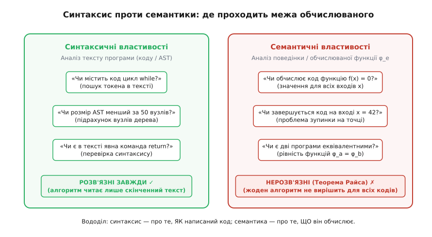
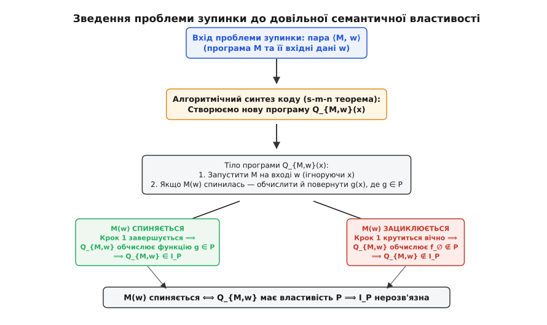
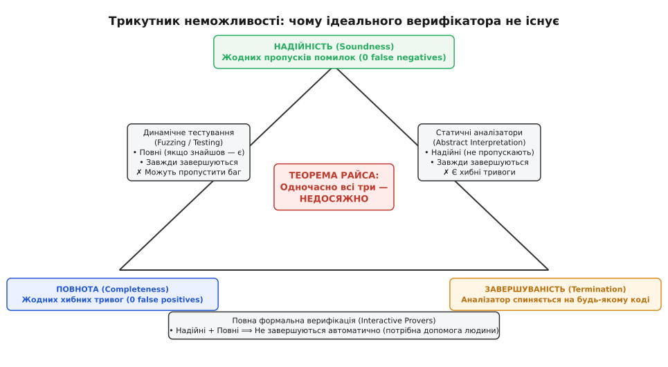
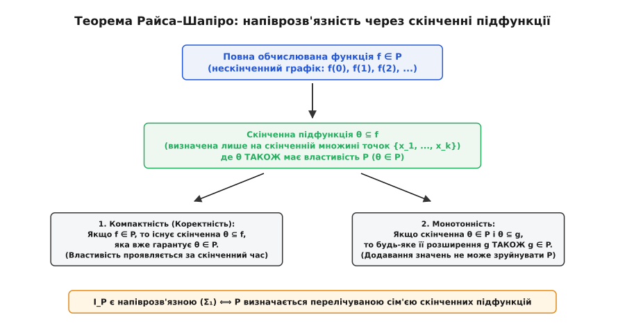

# Теорема Райса

<preknowlist>
- [Проблема зупинки](topic:computability/halting-problem) — нерозв'язність питання, чи спиниться довільна машина Тюрінга на заданому вході; доведення через діагональну суперечність.
- [Машина Тюринга](topic:computability/turing-machine) — формальна дискретна модель алгоритму, кодування програм числами (індексація за Ґьоделем та Кліні).
- [Часткові обчислювані функції](topic:computability/recursively-enumerable-sets) — функції, визначені не на всіх входах (на частині значень алгоритм зациклюється).
</preknowlist>

Коли програміст уперше дізнається про нерозв'язність проблеми зупинки, виникає природна спокуса вважати її поодинокою прикрістю. Здається, що Тюрінг зловив у пастку лише одне специфічне, граничне запитання: «Чи буде цей цикл крутитися вічно?». Якщо універсального детектора зависань не існує, то, можливо, ми здатні створити надійні автоматичні інструменти для скромніших і практичніших задач? Наприклад: «Чи повертає ця функція завжди нуль?», «Чи є ця гілка коду мертвою?», «Чи обчислюють ці дві різні реалізації один і той самий алгоритм сортування?», «Чи впаде програма хоча б на одному вході?».

Ця надія виявляється цілковитою ілюзією. Будь-яке змістовне запитання про те, **що саме робить** програма під час виконання, стикається з тією ж абсолютною математичною стіною. Не можна написати аналізатор, який би гарантовано й безпомилково перевіряв хоча б одну нетривіальну особливість поведінки коду.

Це фундаментальне узагальнення встановив 1953 року американський математик Генрі Ґордон Райс (англ. *Henry Gordon Rice*). Сформульована ним **теорема Райса** перетворює нерозв'язність із поодинокого парадоксу на універсальний закон природи обчислень: будь-яка нетривіальна семантична властивість програм є алгоритмічно нерозв'язною.

## Текст коду проти поведінки: де проходить вододіл

Щоб точно зрозуміти, що саме забороняє теорема Райса, необхідно розрізнити два принципово різні рівні аналізу будь-якої програми: **синтаксичний** (інтенсіональний, від лат. *intensio* — напруження, внутрішній зміст) та **семантичний** (екстенсіональний, від лат. *extensio* — протяжність, зовнішній вияв).

Синтаксичні властивості стосуються самого тексту коду, форми запису або структури абстрактного синтаксичного дерева (AST). Це питання про те, **як** програму записано. Оскільки текст коду є скінченним рядком символів, будь-яка синтаксична властивість перевіряється елементарним переглядом за скінченний час:
- «Чи містить файл більше за 500 рядків коду?» (підрахувати символи переведення рядка);
- «Чи оголошено в коді змінну з назвою `buffer`?» (пошук підрядка);
- «Чи є в тексті ключове слово `while`?» (лексичний розбір);
- «Чи має граф потоку керування цикли?» (пошук циклів у скінченному графі);
- «Чи містить синтаксичне дерево команди безумовного переходу `goto`?» (обхід вузлів AST).

Усі ці властивості є тривіально **розв'язними**. Компілятори та лінтери перевіряють їх щодня за частки мілісекунди, бо для цього не потрібно уявляти виконання програми в часі — досить розібрати статичний текст.

Семантичні властивості (від грец. *semantikos* — значущий) стосуються виключно того, **яку саме математичну функцію** обчислює програма. Це питання про її чорну скриньку: які виходи видає алгоритм у відповідь на ті чи інші входи, де він завершується з результатом, а де зависає назавжди.

Розглянемо дві функції:

:::tabs
```c
// Варіант A: пряме додавання
int compute_a(int x) {
    return x + x;
}

// Варіант B: цикл з акумулятором
int compute_b(int x) {
    int sum = 0;
    for (int i = 0; i < x; ++i) {
        sum += 2;
    }
    return sum;
}
```
```cpp
#include <concepts>

// Варіант A: пряме додавання
constexpr int compute_a(int x) noexcept {
    return x + x;
}

// Варіант B: цикл з акумулятором
constexpr int compute_b(int x) noexcept {
    int sum = 0;
    for (int i = 0; i < x; ++i) {
        sum += 2;
    }
    return sum;
}
```
:::

Синтаксично ці дві функції абсолютно різні: у `compute_a` немає циклів і всього один рядок, тоді як `compute_b` містить локальну змінну та цикл `for`. Проте семантично для невід'ємних чисел вони задають **одну й ту саму часткову функцію** `f(x) = 2·x`.

Властивість називається **семантичною (екстенсіональною)**, якщо для будь-яких двох програм `A` та `B`, які обчислюють однакову функцію, відповідь аналізатора зобов'язана бути однаковою: або обидві програми мають цю властивість, або обидві її не мають.



*Вододіл між синтаксисом і семантикою. Зліва — синтаксичні властивості: алгоритм читає скінченний текст коду або дерево AST і дає точну відповідь за скінченний час. Справа — семантичні властивості: поведінка функції на всіх можливих входах. За теоремою Райса будь-яка нетривіальна семантична властивість є алгоритмічно нерозв'язною.*

Тепер уточнимо, що означає слово **нетривіальна**. Властивість називається тривіальною, якщо їй задовольняють абсолютно всі можливі обчислювані програми (наприклад, «програма обчислює часткову рекурсивну функцію») або не задовольняє жодна програма («програма обчислює магію, що не моделюється машиною Тюрінга»). Для таких властивостей відповідь завжди однакова: стале «так» або стале «ні».

Як тільки властивість є нетривіальною — тобто існує **хоча б одна** програма, яка її має, і **хоча б одна** програма, яка її не має, — точне автоматичне розпізнавання стає неможливим.

> 🔧 **Навіщо це.** Це головний закон збереження складності в розробці програмного забезпечення. Він доводить, що неможливо створити ідеальний статичний аналізатор, бездоганний оптимізатор компілятора чи абсолютний антивірус. Будь-який інструмент, що аналізує поведінку коду без його виконання, приречений або давати хибні тривоги (*false positives*), або пропускати реальні дефекти (*false negatives*), або зависати на складних конструкціях.

## Формулювання теореми

Сформулюємо теорему мовою теорії обчислюваності.

Нехай `PR` — множина всіх одномісних часткових рекурсивних функцій, що відображають натуральні числа в натуральні числа (`f: ℕ ⇀ ℕ`). Кожна програма (машина Тюрінга) має свій порядковий номер `e ∈ ℕ` у стандартній нумерації Кліні, а відповідна їй функція позначається як `φ_e`.

Нехай `P ⊆ PR` — деяка множина часткових функцій (семантична властивість). Відповідна їй **індексна множина** `I_P` складається з усіх номерів програм, які обчислюють функції з класу `P`:

```
I_P = { e ∈ ℕ | φ_e ∈ P }
```

Умова семантичності означає екстенсіональність: якщо дві програми обчислюють однакову функцію (`φ_a = φ_b`), то або обидва індекси належать `I_P`, або обидва не належать (`a ∈ I_P ⟺ b ∈ I_P`).

**Теорема Райса:**
> Якщо `P` є нетривіальною підмножиною часткових рекурсивних функцій (тобто `P ≠ ∅` та `P ≠ PR`), то індексна множина `I_P` є алгоритмічно нерозв'язною (нерекурсивною).

Інакше кажучи, не існує алгоритму (загальнорекурсивної функції), який би за кодом довільної програми `e` завжди завершувався за скінченний час і видавав `1`, якщо `φ_e ∈ P`, та `0`, якщо `φ_e ∉ P`.

## Механізм доведення: ґаджет-трансформатор

Сила теореми Райса полягає в тому, що її доведення не вимагає вивчення структури конкретної властивості `P`. Достатньо лише знати, що існує хоча б одна функція всередині `P` і хоча б одна функція поза `P`. Механізм базується на універсальному зведенні проблеми зупинки до задачі розпізнавання `P`.

Розглянемо доведення крок за кроком.

### Крок 1. Базовий вибір відносно порожньої функції

Позначимо через `f_∅` скрізь невизначену функцію (функцію з порожньою областю визначення, яка зациклюється на кожному вході `x`).

Можливі два випадки:
1. Порожня функція не володіє властивістю `P` (`f_∅ ∉ P`).
2. Порожня функція володіє властивістю `P` (`f_∅ ∈ P`). У цьому разі ми просто переходимо до доповнення властивості: `P' = PR \ P`. Оскільки доповнення нетривіальної множини також є нетривіальним, а `f_∅ ∉ P'`, розв'язання задачі для `P'` автоматично розв'язало б її для `P`.

Тому без обмеження загальності вважаємо, що `f_∅ ∉ P`.

### Крок 2. Фіксація представника властивості

Оскільки `P` нетривіальна і не є порожньою (`P ≠ ∅`), у ній існує хоча б одна обчислювана функція. Зафіксуємо її та назвемо `g` (`g ∈ P`). Нехай `e_g` — відомий код програми, яка обчислює цю функцію `g`.

### Крок 3. Конструювання ґаджета-пастки

Тепер припустимо від супротивного, що у нас є чарівний алгоритм-суддя `Decide_P(e)`, який за кодом програми `e` безпомилково визначає, чи належить її функція до класу `P`.

Покажемо, як за допомогою `Decide_P` розв'язати класичну [проблему зупинки](topic:computability/halting-problem).

Нехай нам дано довільну програму `M` та її вхідні дані `w`. Ми хочемо дізнатися, чи зупиниться `M` на вході `w`. Замість того щоб запускати `M(w)` напряму й ризикувати зависнути, ми алгоритмічно синтезуємо код нової програми `Q_{M,w}`.

Синтезована програма `Q_{M,w}` приймає аргумент `x` і влаштована так:

```py
def Q_M_w(x):
    # Крок 1: запустити M на вході w (ігноруючи x)
    run_simulation(M, w)

    # Крок 2: якщо перший крок завершився — обчислити функцію g на вході x
    return run_program(e_g, x)
```

Зверніть увагу на вирішальний нюанс: ми **не виконуємо** цей код під час конструювання! Ми лише збираємо його текст або синтаксичне дерево за формальними правилами. За [теоремою Кліні про параметризацію](topic:computability/rices-theorem/math-rices-theorem.md) (s-m-n теоремою) перетворення пари `⟨M, w⟩` на код програми `Q_{M,w}` є абсолютно алгоритмічним і займає фіксований час.



*Механізм зведення за Райсом. За парою ⟨M, w⟩ алгоритмічно будується код програми Q_{M,w}. Якщо M(w) зупиняється, Q обчислює функцію g ∈ P. Якщо M(w) зациклюється, Q обчислює порожню функцію f_∅ ∉ P. Оракул для властивості P миттєво відповів би на питання про зупинку M(w), що неможливо.*

### Крок 4. Аналіз двох гілок поведінки

Дослідимо, яку саме математичну функцію обчислює програма `Q_{M,w}` на довільному вході `x`:

1. **Гілка зупинки**: якщо `M` зупиняється на вході `w`, то крок 1 успішно завершується за скінченну кількість тактів. Після цього програма переходить до кроку 2 і повертає `g(x)`. Тобто для **всіх** входів `x` програма `Q_{M,w}` поводиться точно як функція `g`. Оскільки `g ∈ P`, сама функція `φ_{Q_{M,w}}` належить до класу `P`.
2. **Гілка зациклення**: якщо `M` не зупиняється на вході `w`, то програма назавжди зависає вже на кроці 1. Крок 2 не настане ніколи, і жодного результату для жодного `x` видано не буде. Тобто `Q_{M,w}` не завершується на жодному аргументі, а отже, обчислює скрізь невизначену функцію `f_∅`. Оскільки `f_∅ ∉ P`, функція `φ_{Q_{M,w}}` **не належить** до класу `P`.

Ми отримали суворе логічне співвідношення:

```
M зупиняється на w ⟺ φ_{Q_{M,w}} ∈ P ⟺ Decide_P(Q_{M,w}) == 1
```

### Крок 5. Суперечність

Якби алгоритм `Decide_P` існував, ми могли б перевірити зупинку будь-якої машини `M` на вході `w`: сконструювати код `Q_{M,w}` і згодувати його функції `Decide_P`. Відповідь `1` означала б, що `M(w)` зупиняється; відповідь `0` — що `M(w)` зациклюється.

Але проблема зупинки є доведено нерозв'язною! Жоден алгоритм не здатен вирішувати її для всіх пар `⟨M, w⟩`. Отже, наше єдине припущення про існування алгоритму `Decide_P` було хибним.

Алгоритму для перевірки нетривіальної семантичної властивості `P` **не існує**. Теорему Райса повністю доведено.

Як саме це доведення формалізується через індексні множини та як теорему Райса можна довести альтернативним шляхом через другу теорему Кліні про нерухому точку — [розібрано у математичній вставці](topic:computability/rices-theorem/math-rices-theorem.md).

## Спектр практичних наслідків

Сфера застосування теореми Райса охоплює практично всі аспекти аналізу та оптимізації програмного забезпечення. Щоразу, коли розробник намагається автоматизувати судження про поведінку коду, він натрапляє на цю теорему.

Розглянемо найважливіші практичні випадки:

### 1. Перевірка еквівалентності програм (`φ_A = φ_B`)
Чи можна написати інструмент, який автоматично перевірятиме, чи виконує оптимізована функція ті самі обчислення, що й початкова?
- *Семантична властивість*: для фіксованої програми `A` множина `P_A = { f | f = φ_A }` є нетривіальною (вона містить `φ_A` і не містить інших функцій).
- *Наслідок*: задача еквівалентності програм є алгоритмічно нерозв'язною. Жоден інструмент тестування рефакторингу чи автоматичної перевірки студентських робіт не може гарантувати 100% точність.

### 2. Видалення мертвого коду (Dead Code Elimination)
Компілятор хоче видалити фрагмент коду, якщо він ніколи не виконується:
- *Семантична властивість*: «чи існує такий вхід `x`, для якого керування досягає рядка `L`?».
- *Наслідок*: це питання нерозв'язне. Компілятор може легко видалити синтаксично недосяжний код (після безумовного `return`), але якщо недосяжність зумовлена складним арифметичним інваріантом чи зупинкою іншої функції, компілятор зобов'язаний залишити цей код, щоб не порушити коректність програми.

### 3. Пошук помилок часу виконання (Null Pointer, Buffer Overflow, Division by Zero)
Чи містить програма вразливість або потенційний збій?
- *Семантична властивість*: «чи існує вхідний вектор, який спричиняє вихід за межі масиву або ділення на нуль?».
- *Наслідок*: ідеального статичного аналізатора безпеки не існує. Інструменти або видають попередження про безпечний код (хибні тривоги), або пропускають вразливості, або обмежуються наближеним аналізом.

### 4. Перевірка тотальності та завершуваності
Чи можна перевірити, що сервіс ніколи не зависне і завжди повертає відповідь клієнту?
- *Семантична властивість*: `f` є скрізь визначеною (тотальною) функцією.
- *Наслідок*: неможливо створити компілятор загального призначення, який би відмовлявся компілювати код, що потенційно зациклюється, не відкидаючи при цьому цілком коректні програми.

| Практична задача | Формальна семантична властивість | Наслідок теореми Райса |
| :--- | :--- | :--- |
| **Еквівалентність програм** | `φ_A = φ_B` | Неможливо створити ідеальний рефакторинг-тестер або перевіряльник студентських лаб, який би завжди визначав, чи дві програми роблять те саме. |
| **Видалення мертвого коду** | `∃x: шлях_виконання(x) проходить через рядок L` | Компільований код завжди міститиме потенційно недосяжні блоки, які оптимізатор не ризикне видалити. |
| **Пошук витоків пам'яті / NullPointer** | `∃x: виконання(x) викликає помилку` | Не існує статичного аналізатора, який би знаходив усі реальні баги без генерації хибних попереджень. |
| **Перевірка тотальності (завершуваності)** | `∀x: φ_e(x)↓` (функція всюди визначена) | Неможливо створити компілятор, який би автоматично гарантував, що довільна програма ніколи не зависне. |
| **Безпека та антивірусний аналіз** | `φ_e обчислює шкідливу корисну дію` | Ідеальний евристичний антивірус математично неможливий: або пропускає шкідливий код, або блокує безпечний. |

## Трикутник компромісів: як живе індустрія

Оскільки точний семантичний аналіз заборонено законами математики, виникає запитання: як працюють сучасні промислові аналізатори на зразок Clang Static Analyzer, Coverity, SonarQube або Astrée?

Усі вони спираються на фундаментальний інженерний компроміс. У будь-якому автоматичному аналізі програм є три бажані характеристики:
1. **Надійність (Soundness)**: якщо аналізатор стверджує, що в коді немає помилок певного типу, їх там дійсно немає на 100% (нуль пропущених багів, *zero false negatives*).
2. **Повнота (Completeness)**: якщо аналізатор видав попередження про помилку, вона дійсно присутня в коді (нуль хибних тривог, *zero false positives*).
3. **Завершуваність (Termination)**: аналізатор гарантовано завершує роботу за скінченний час для будь-якого вхідного коду.



*Трикутник неможливості. За теоремою Райса жоден автоматичний інструмент не може одночасно мати всі три вершини. Статичні аналізатори обирають надійність і завершуваність, платячи хибними тривогами. Тестування та фазинг обирають повноту і завершуваність, платячи пропусками багів. Повна формальна верифікація обирає надійність і повноту, вимагаючи допомоги людини.*

Згідно з теоремою Райса, жоден автоматичний інструмент не може поєднати всі три властивості для тьюрінг-повної мови. Інженери змушені обирати щонайбільше дві:

- **Статичний аналіз та абстрактна інтерпретація** (Soundness + Termination): аналізатор будує грубу консервативну модель програми (наприклад, замінює точні числа на їхні знаки чи інтервали). Він гарантує, що жодна справжня помилка не буде пропущена, але платить за це появою **хибних тривог** — попереджень на цілком коректному коді.
- **Динамічне тестування та фазинг** (Completeness + Termination): програма запускається на реальних вхідних наборах даних. Якщо знайдено вхід, що спричиняє аварію, помилка гарантовано реальна (немає хибних тривог). Проте такий аналіз не є надійним: він може не помітити критичний баг, якщо відповідний вхідний вектор не було згенеровано.
- **Інтерактивні доводжувачі теорем (Coq, Lean, Isabelle)** (Soundness + Completeness): дозволяють довести абсолютну коректність коду без наближень і без хибних тривог. Але процес доведення не є автоматичним і вимагає безпосередньої участі людини, яка формулює інваріанти та леми.

Як влаштована абстрактна інтерпретація в робочому коді на мовах C та C++ і як оператори розширення (*widening*) змушують цикли завершуватися за рахунок втрати точності — [показано у практичному проєкті](topic:computability/rices-theorem/proj-rices-theorem.md).

## Теорема Райса–Шапіро: коли можлива напіврозв'язність

Теорема Райса стверджує, що повна розв'язність неможлива: алгоритм не може завжди видавати точне «так» або «ні». Але в теорії обчислюваності є слабший клас — **напіврозв'язні (рекурсивно перелічувані, `Σ₁`)** властивості. Це задачі, для яких існує алгоритм, що гарантовано зупиняється з відповіддю «так», якщо властивість справджується, але може працювати нескінченно довго, якщо вона хибна.

Наприклад, властивість «програма зупиняється хоча б на одному вході» є напіврозв'язною: ми можемо паралельно моделювати виконання програми на всіх можливих входах `x = 0, 1, 2, ...` і, щойно вона зупиниться на якомусь із них, радісно вигукнути «так!».

Проте властивість «програма є всюди визначеною (зупиняється на всіх входах)» не є навіть напіврозв'язною: скільки б входів ми не перевірили за скінченний час, ми ніколи не зможемо переконатися, що на наступному мільярдному вході програма не зависне.

Точну відповідь на те, які саме семантичні властивості є напіврозв'язними, дає **теорема Райса–Шапіро** (англ. *Rice–Shapiro theorem*), сформульована Норманом Шапіро в середині 1950-х років.



*Теорема Райса–Шапіро. Семантична властивість P є напіврозв'язною тоді й лише тоді, коли вона є компактною (проявляється на скінченній підфункції θ ⊆ f) та монотонною (будь-яке розширення збереже властивість P).*

Теорема Райса–Шапіро стверджує, що індексна множина `I_P` є рекурсивно перелічуваною (`Σ₁`) тоді й лише тоді, коли:
1. **Компактність**: будь-яка нескінченна функція `f ∈ P` належить до `P` тому, що вже деяка її **скінченна частина** `θ ⊆ f` (визначена лише в кількох точках) належить до `P`. Тобто властивість проявляється на скінченному обсязі спостережень.
2. **Монотонність**: якщо скінченна функція `θ ∈ P`, то будь-яке її розширення `g ⊇ θ` також гарантовано належить до `P`. Додавання нових обчислених значень не може знищити вже набуту властивість.

Цей результат пояснює, чому ми можемо за скінченний час переконатися в наявності локальних подій (виклику певної інструкції або аварійного завершення на конкретному прикладі), але принципово не здатні навіть у напіврозв'язному режимі перевірити глобальні інваріанти на кшталт повної коректності чи тотальності.

Повне доведення теореми Райса–Шапіро та класифікація властивостей програм за рівнями [арифметичної ієрархії](topic:computability/arithmetic-hierarchy) наведені у [математичній вставці](topic:computability/rices-theorem/math-rices-theorem.md).

## Межі теореми: що вона НЕ стверджує

Через категоричність висновків теореми Райса довкола неї часто виникають небезпечні міфи та хибні інтерпретації. Важливо чітко розуміти, чого саме ця теорема **не** забороняє:

1. **Теорема Райса не забороняє доводити властивості конкретних програм.** Вона стверджує лише те, що не існує **єдиного універсального алгоритму**, придатного для абсолютно всіх можливих програм. Для вашої конкретної функції сортування чи системного драйвера ви цілком можете математично довести коректність та зупинку за допомогою інваріантів циклу чи інтерактивних верифікаторів.
2. **Теорема Райса стосується лише тьюрінг-повних систем.** Якщо звузити мову програмування — наприклад, заборонити необмежену рекурсію та нескінченні цикли (як у мовах смарт-контрактів із лімітом газу, мовах опису апаратури Verilog/VHDL або тотальних функційних мовах на зразок Idris чи Coq), — мова перестає бути тьюрінг-повною, і багато семантичних властивостей стають повністю розв'язними.
3. **Теорема Райса не забороняє наближений аналіз.** Вона забороняє лише абсолютну точність без хибних спрацьовувань і пропусків. Наближені методи (абстрактна інтерпретація, аналіз діапазонів, символьне моделювання) є основою сучасної інженерії компіляторів.

Історія того, як Генрі Райс відкрив цю універсальну закономірність, працюючи над дисертацією в Сіракузькому університеті, і як його результат змінив погляди логіків після Тюрінга та Поста, детально описана в [історичному нарисі](topic:computability/rices-theorem/hist-rices-theorem.md).

Зрештою, теорема Райса — це не привід опускати руки, а надійний компас у світі розробки та аналізу програм. Вона звільняє дослідників від марних спроб побудувати неможливий ідеальний інструмент і вказує точні напрямки для практичних інженерних компромісів: від консервативних систем типів до багатошарового тестування.
