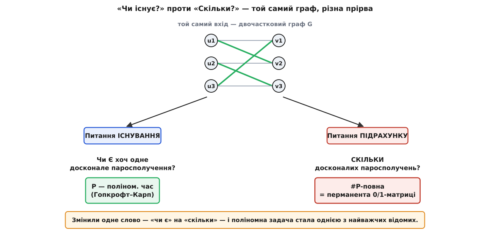
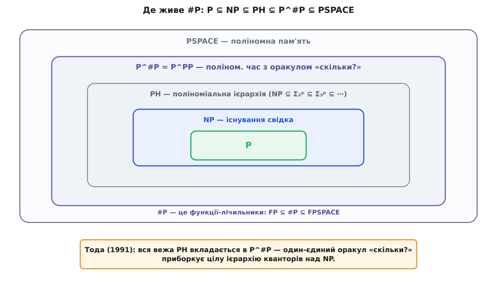

# Клас #P: складність підрахунку розв'язків

<preknowlist>
- [Класи P і NP та NP-повнота](topic:computability/np-completeness) — P (розв'язне за поліном) і NP (свідок перевіряється за поліном), зведення A ≤ₚ B, поняття «найважчої» задачі класу й NP-повнота.
- [Машина Тюринга](topic:computability/turing-machine) — абстрактна покрокова машина; недетермінований варіант розгалужується на багато обчислень, і «приймальна гілка» стає точним поняттям.
- [Задача здійсненності (SAT)](topic:computability/boolean-satisfiability) — булева формула та її здійсненний набір (satisfying-присвоєння); питання «чи існує набір, за якого формула істинна».
- [Асимптотична складність](topic:computability/asymptotic-complexity) — нотація O(…), прірва між поліномом (n³) і експонентою (2ⁿ, n!).
- [Визначник матриці](topic:math-algebra/matrix-determinant) — знакозмінна сума по перестановках; рахується швидко методом виключення.
</preknowlist>

Дайте машині двочастковий граф — ліворуч люди, праворуч роботи, ребро означає «цей береться за те» — і спитайте: чи можна роздати роботи так, щоб кожен дістав рівно одну свою й жодна не лишилась без виконавця? Це питання про [досконале паросполучення](topic:sf-algorithms/bipartite-matching), і відповідь машина знайде швидко — є класичний поліномний алгоритм, що впорається навіть на графі з мільйоном вершин. А тепер змініть у питанні одне-єдине слово. Не «**чи можна**» роздати, а «**скількома способами**» можна. Той самий граф, той самий вхід — і ви щойно вперлися в одну з найважчих задач, які знає інформатика. Порахувати способи виявилося незмірно важче, ніж переконатися, що бодай один спосіб є.

Ця прірва не випадкова для паросполучень — вона зяє всюди, де питання «**чи існує** розв'язок?» має брата-близнюка «**скільки** їх?». [Класи P і NP](topic:computability/np-completeness) міряють важкість першого питання: NP — це задачі, де відповідь «так» засвідчена коротким свідком, який легко перевірити, а сам клас питає лише про **існування** такого свідка. Питання про **число** свідків живе в іншому класі — потужнішому, і саме він тут головний герой. Його позначають **#P** (читається «шарп-пі»; символ `#` — англ. *sharp*, «діез», значок числа/кількості). Щоб побачити, чому підрахунок — це окрема, більша сила, а не дрібна надбудова над пошуком, розберімо його від означення до самого дна.

## Від «чи існує» до «скільки»

Щоб точно сказати, що означає «порахувати свідків», згадаймо другу, машинну дефініцію NP. [Недетермінована машина Тюринга](topic:computability/turing-machine) на кожній розвилці не пробує варіанти по черзі, а розгалужується на всі одразу — її обчислення розростається деревом гілок. Задача належить NP, коли є така машина з поліномним часом, що **хоч одна** гілка приймає вхід рівно тоді, коли відповідь «так». Кожна приймальна гілка — це, по суті, один свідок: послідовність недетермінованих виборів, що ведуть до «прийняти». NP питає: чи є **бодай одна** приймальна гілка?

Поставмо натомість рахункове питання: **скільки** приймальних гілок? Це й задає клас #P. Формально: функція f належить #P, якщо існує недетермінована машина Тюринга з поліномним часом, для якої f(x) — це **число приймальних обчислень** машини на вході x. У перекладі з машинної мови: #P — це задачі, де треба порахувати розв'язки, кожен з яких сам по собі перевіряється за поліномний час.

Одразу зверніть увагу на зсув самої природи задачі. NP-задача — **рішенева**: її відповідь «так» або «ні». #P-задача повертає **число** — скільки саме. Тому #P — це клас не мов, а **функцій**: на вхід дають x, на вихід чекають натуральне число. Його «легкий» відповідник — клас **FP** (англ. *function polynomial*), функції, обчислювані за поліномний час; і очевидно **FP ⊆ #P**, бо що вміємо порахувати швидко, те й підходить під означення підрахунку. Цікаве, як завжди, — чи не завелика прірва в інший бік.

Кожна NP-задача автоматично родить свою рахункову сестру. SAT питає «чи є здійсненний набір формули?» — а [#SAT](topic:computability/boolean-satisfiability) питає «**скільки** їх?». «Чи є розфарбування графа трьома кольорами?» — а скільки таких розфарбувань? «Чи є гамільтонів цикл?» — а скільки їх? Скрізь, де NP питала про існування, #P питає про кількість.

І ось перше, що ставить #P **не нижче** за NP: хто вміє точно рахувати, той задарма вміє й вирішувати. Знаєте точне число свідків — знаєте й чи воно більше нуля, а це вже готова відповідь на питання NP. Отже, прилад, що миттєво відповідає «скільки?», миттєво відповідає й «чи є хоч один?». Підрахунок **містить** у собі розв'язання задачі існування — тому він щонайменше такий самий важкий. Наскільки саме важчий — з'ясуємо згодом; спершу назвімо найважчі задачі самого #P.

> 🔧 **Навіщо це.** Інженерові рідко потрібне голе «так/ні» — потрібне **число**. Яка ймовірність, що система витримає (сума ваг по всіх станах, де вона жива)? Скільки конфігурацій задовольняють обмеження? Який очікуваний результат за всіма сценаріями? Усі ці величини — не питання існування, а питання **підрахунку**, тобто #P. Тому межа «легко вирішити / важко порахувати» — це не академічна тонкість, а стіна, об яку розбивається точний розрахунок ймовірностей, надійностей і статистичних сум у реальних системах.

## #SAT і що означає #P-повнота

У NP є найважчі задачі — NP-повні: ті, до яких зводиться все NP, тож поліномний розв'язок однієї повалив би цілий клас. У #P влаштовано дзеркально. Задачу називають **#P-повною**, коли вона, по-перше, сама лежить у #P, а по-друге, будь-яку задачу з #P можна звести до неї за поліномний час. Така задача — найважча в класі: умій рахувати її швидко — і швидко порахуєш геть усе в #P.

Взірцевий представник — **#SAT**: порахувати число здійсненних наборів булевої формули. Він #P-повний, і це не дивує — адже SAT був першою NP-повною задачею, універсальним ключем до всього NP.

Та за перенесенням важкості з NP у #P ховається тонкість, від якої залежить усе. Звичайне зведення для NP зберігає лише відповідь «так/ні»: воно перекладає приклад A на приклад B так, щоб B мала розв'язок рівно тоді, коли його має A. Для підрахунку цього замало — нам треба, щоб збереглося саме **число** розв'язків. Тому потрібне сильніше зведення — **ощадливе** (англ. *parsimonious* — від лат. *parsimonia*, ощадливість): переклад, що встановлює **взаємно однозначну відповідність** між розв'язками A і розв'язками B. Тоді їх порівну, і лічильник для B — це лічильник для A.

Дивовижний факт: класичне зведення Кука–Левіна, яким усе NP втискають у SAT, **уже ощадливе** — воно не просто зберігає існування розв'язку, а й ставить свідки NP-задачі у взаємно однозначну відповідність зі здійсненними наборами формули. Тому воно переносить не лише NP-повноту SAT, а й #P-повноту #SAT. І багато класичних зведень Карпа теж ощадливі або легко такими робляться — звідси рахункові версії десятків знайомих NP-повних задач виявляються #P-повними.

Як же рахують #SAT насправді? Не сліпим перебором усіх 2ⁿ наборів, а пошуком, що ділить простір за значенням однієї змінної й **додає** числа розв'язків обох гілок — це знайомий за SAT-розв'язувачами метод DPLL, доповнений підрахунком, із поширенням одиничних диз'юнктів і кешуванням незалежних компонент формули. У найгіршому разі дерево пошуку все одно експоненційне — інакше було б P = #P, у що не вірить ніхто, — але на структурованих формулах воно різко обрізається. [Робочий такий лічильник із розбором складности](topic:computability/sharp-p-counting/proj-sharp-sat-counter.md) показує, як «розв'язати» перетворюється на «розгалузитися й скласти».

> 🔧 **Навіщо це.** Ощадливість — практична пересторога. Довівши, що ваша задача підрахунку зводиться до відомої #P-повної, ви ще нічого не довели про **її** важкість, якщо зведення губить число розв'язків: воно може склеювати багато свідків в один або плодити зайві. Аби успадкувати саме #P-повноту (а не слабшу NP-повноту рішеневої версії), стежте, щоб відповідність розв'язків була один-до-одного — інакше висновок про важкість підрахунку просто не випливає.

## Рахувати важче, ніж вирішувати — навіть коли вирішувати легко

Тут криється найглибша несподіванка теми, і саме вона робить #P окремим світом, а не прибудовою до NP. Здавалося б, рахункова задача важка тому, що важка її рішенева основа: #SAT важкий, бо важкий SAT. Але це не так. **#P-повнота підрахунку не успадковується від NP-повноти рішення** — вона живе на власній осі. Задача може бути #P-повною навіть тоді, коли її питання існування розв'язується **тривіально швидко**.

Повернімося до паросполучень, з яких почали. Спитати, **чи є** досконале паросполучення у двочастковому графі, — задача з P: її розв'язують за поліномний час класичним алгоритмом нарощування доповнювальних шляхів. Жодної NP-важкості тут немає й близько. А спитати, **скільки** таких паросполучень, — задача #P-повна (це доведе Валіант; побачимо за мить, як саме). Питання існування — копійки, питання числа — стіна, і все на тому самому графі.

Той самий розрив — у логіці. Формула виду 2-SAT, де кожне обмеження зв'язує лише дві змінні, **розв'язується** блискавично: чи є здійсненний набір, з'ясовують за лінійний час через граф імплікацій. Але порахувати, **скільки** здійсненних наборів у 2-SAT-формули (**#2SAT**), — знову #P-повна задача. Ще різкіше з формулою у диз'юнктивній нормальній формі (ДНФ): чи вона здійсненна — видно з першого погляду (досить одного несуперечливого доданка), а **порахувати** її здійсненні набори — #P-повно.


*Рахувати важче, ніж вирішувати. Вхід один — двочастковий граф. Питання існування («чи є хоч одне досконале паросполучення?») розв'язується за поліномний час алгоритмом Гопкрофта–Карпа. Питання підрахунку («скільки їх?») на тому самому графі — #P-повне: воно дорівнює обчисленню перманенти матриці суміжності. Важкість підрахунку — окрема вісь, не спадок рішеневої задачі.*

Висновок звідси більший, ніж три приклади. Легкість вирішити задачу **нічого не гарантує** про легкість її порахувати. Це два незалежні виміри важкости, і #P міряє саме другий. Тому не можна відмахнутися від рахункової задачі, глянувши, що її рішенева основа проста, — під простою поверхнею може ховатися одна з найважчих задач класу. Найчистіший приклад цієї підступності — перманента.

## Перманента: корона #P

Візьмімо квадратну матрицю A розміру n×n і два майже однакові числа з неї. Перше — **визначник** (лат. *determinans* — той, що визначає), який усі вчили в лінійній алгебрі:

```
det A = Σ  sgn(σ) · a[1,σ(1)] · a[2,σ(2)] · … · a[n,σ(n)]
        σ
```

Сума береться по всіх n! перестановках σ рядків-у-стовпці; кожен доданок — добуток n елементів, по одному з кожного рядка й кожного стовпця, а `sgn(σ)` — знак перестановки, +1 або −1. Друге число — **перманента** (лат. *permanere* — залишатися незмінною: на відміну від визначника, вона не міняє знак при перестановці рядків) — це **та сама сума, але без знаку**:

```
perm A = Σ  a[1,σ(1)] · a[2,σ(2)] · … · a[n,σ(n)]
         σ
```

Одна-єдина відмінність: у визначнику перед кожним добутком стоїть множник sgn(σ) = ±1, у перманенті його немає. Обидві формули підсумовують ті самі n! добутків. І ось разюче: **визначник рахується легко, а перманента — ні**.

![Формули визначника й перманенти поруч: обидві — сума по всіх n! перестановках однакових добутків a[i,σ(i)]; у визначнику є множник sgn(σ)=±1, у перманенті його немає; наслідок — визначник O(n³) методом Гаусса, перманента #P-повна за Валіантом 1979](img/det-vs-perm.svg)
*Уся різниця — знак. Визначник і перманента підсумовують ті самі n! добутків елементів матриці; єдина відмінність — множник sgn(σ) = ±1, присутній у визначнику й відсутній у перманенті. Цей знак робить визначник знакозмінним і полілінійним, тож [метод Гаусса](topic:math-algebra/gauss-elimination) обчислює його за O(n³). Без знаку жодної такої структури немає — і обчислення перманенти стає #P-повним.*

Чому знак усе вирішує? Він надає визначникові **структуру**. Через нього визначник знакозмінний (міняє знак при перестановці двох рядків) і полілінійний — а це рівно ті властивості, що дають працювати елементарним операціям над рядками: додаючи один рядок до іншого, визначник не зміниш, множачи рядок на число — помножиш і визначник. Саме на цьому стоїть [метод виключення Гаусса](topic:math-algebra/gauss-elimination): за O(n³) дій матрицю зводять до трикутного вигляду, де визначник — просто добуток діагоналі. Величезну суму по n! доданках згортає алгебра. У перманенти цієї алгебри **немає**: без знаку вона не знакозмінна, операції над рядками її псують, і згорнути суму нема чим. Лишається, на позір, чесний перебір усіх n! перестановок.

1979 року Леслі Валіант — британський математик угорського походження (народжений 1949 року в Будапешті), згодом лауреат премії Тюрінга — довів, що це не тимчасова невдача, а стіна: обчислити перманенту **#P-повно**, і то навіть для матриці з самих нулів та одиниць. Саме в цій роботі («The Complexity of Computing the Permanent», *Theoretical Computer Science*, 1979) він і ввів клас #P. Тобто прибирання одного множника-знаку переносить задачу з класу P (легкий O(n³)) у найважчі задачі #P. [Історію цього відкриття й дороги Валіанта до нього](topic:computability/sharp-p-counting/hist-valiant.md) варто прочитати окремо — рідкісний випадок, коли одну алгебраїчну дрібницю відділяє від іншої ціла прірва складности.

А чому перманента — це саме про паросполучення? Візьміть 0/1-матрицю A як таблицю двочасткового графа: рядок i — ліва вершина, стовпець j — права, a[i,j] = 1, коли між ними є ребро. Кожна перестановка σ призначає кожному рядку свій стовпець — це спроба досконалого паросполучення; її добуток a[1,σ(1)]·…·a[n,σ(n)] дорівнює 1 рівно тоді, коли **всі** призначені ребра справді є (жодного нуля), і 0 інакше. Отже перманента лічить рівно ті перестановки, що дають повне паросполучення:

```
A = 1 1 0      рядок i — ліва вершина uᵢ, стовпець j — права vⱼ
    0 1 1      a[i,j] = 1  ⟺  є ребро uᵢ—vⱼ
    1 0 1

perm A = Σ по всіх 6 перестановках σ добутку a[i,σ(i)]:
  σ=(1,2,3):  a[1,1]·a[2,2]·a[3,3] = 1·1·1 = 1   ← паросполучення {u1v1, u2v2, u3v3}
  σ=(2,3,1):  a[1,2]·a[2,3]·a[3,1] = 1·1·1 = 1   ← паросполучення {u1v2, u2v3, u3v1}
  решта 4 перестановок мають хоча б один 0     → 0
perm A = 2
```

Дві одиниці в сумі — два досконалі паросполучення. У загальному: для 0/1-матриці **perm A = число досконалих паросполучень** графа. Ось і замкнулося коло: «скільки паросполучень» — це «обчислити перманенту» — це #P-повна задача, тимчасом як «чи є паросполучення» лишається в P.

Чи це вирок будь-якому обчисленню перманенти? Не зовсім: n! — не остання межа. Формула Райзера (Герберт Райзер, 1963) через включення-виключення дає перманенту за O(2ⁿ · n) — усе ще експонента, та вже 2ⁿ замість неозорого n!, і на матрицях до 30–40 рядків це реально порахувати. [Виведення формул визначника й перманенти та алгебру за методом Гаусса й Райзером](topic:computability/sharp-p-counting/math-permanent-determinant.md) розписано в математичній вставці, а [робочий код обох способів обчислення перманенти — наївного та Райзерового з кодом Ґрея](topic:computability/sharp-p-counting/proj-permanent-ryser.md) — у проєктній.

> 🔧 **Навіщо це.** Пара «визначник / перманента» — найчистіший доказ, що **дрібна зміна умови може перекинути задачу через межу здійсненного**. Це пересторога інженерові й науковцеві: побачивши задачу, підозріло схожу на легку (перманента виглядає як визначник!), не переносьте автоматично надію на швидкий алгоритм — перевірте, чи збереглася та структура, на якій він тримався. Перманенти, до речі, не абстракція: вони описують інтерференцію бозонів у квантовій оптиці (задача boson sampling), і саме їхня #P-важкість — аргумент, чому такий квантовий пристрій важко наслідувати класично.

## Наскільки високо сидить #P: теорема Тоди

Ми з'ясували, що #P щонайменше такий важкий, як NP. Але наскільки саме? Відповідь приголомшлива й належить Сейносуке Тоді (Seinosuke Toda), який 1991 року довів її у роботі «PP is as Hard as the Polynomial-Time Hierarchy» (Ґеделівська премія 1998).

Щоб оцінити результат, треба знати, що над NP височіє ціла вежа складности — [поліноміальна ієрархія](topic:computability/polynomial-hierarchy), PH. NP — це задачі з одним квантором існування («**чи існує** свідок?»); co-NP — з квантором загальности («чи для **всіх** так?»). Дозвольте чергувати квантори — «чи існує хід, після якого для всіх відповідей суперника існує хід…» — і дістанете щаблі Σ₂, Σ₃, Σ₄… — рівні поліноміальної ієрархії, кожен наступний, як вважають, строго важчий за попередній. Це нескінченна вежа задач над NP.

Теорема Тоди каже: **вся ця вежа вкладається в один клас — P^#P**, тобто в задачі, розв'язні за поліномний час, якщо дозволити машині один вид звертань — до оракула #P, приладу, що миттєво відповідає «скільки?».

```
PH  ⊆  P^#P
```

Вдумаймося. Один-єдиний оракул, що вміє **рахувати**, накриває цілу ієрархію кванторних чергувань над NP. Це означає, що підрахунок — не скромний крок над пошуком, а сила, що **височіє над усією поліноміальною ієрархією**. Інтуїція за цим така: точне число несе колосально більше інформації, ніж голе «так/ні». З кількости (і навіть з її парности — чи парне число розв'язків) можна відтворити чергування кванторів, яке будує ієрархію; тому доступ до «скільки?» одним махом дає владу над усіма її щаблями.


*Де живе #P серед класів. У серці — P (легко розв'язне), навколо — NP (існування свідка), над ним — уся поліноміальна ієрархія PH з нескінченною вежею кванторних чергувань. Теорема Тоди (1991) втискає цілу цю вежу в P^#P — поліномний час з одним оракулом підрахунку. Зовні все обмежене PSPACE. Один прилад «скільки?» приборкує ієрархію, яку будували квантори «існує/для всіх».*

## Де живе #P серед класів

Тепер обведімо межі #P з обох боків, щоб бачити його місце цілком. Знизу — уже сказане: **FP ⊆ #P**, легкі функції всі тут. Зверху — **#P ⊆ FPSPACE**: будь-яку #P-функцію можна порахувати в поліномній пам'яті, просто перебираючи всі 2^poly можливих свідків і накручуючи лічильник, повторно вживаючи ту саму пам'ять. Отже #P затиснутий між функціями, обчислюваними за поліномний час, і функціями, обчислюваними в поліномній пам'яті.

Є в підрахунку й рішенева тінь — клас **PP** (англ. *probabilistic polynomial time*): він питає не «скільки приймальних гілок?», а «чи **більше половини** гілок приймають?». Це вже відповідь «так/ні», але вона криє в собі старший біт лічильника, тож [PP](topic:computability/pp-probabilistic-polynomial) — рішеневий двійник #P. Зв'язок точний: **P^#P = P^PP** — поліномна машина з оракулом підрахунку й машина з оракулом «більшости» мають однакову силу, бо двійковим пошуком по запитах «більше за t?» відновлюють точне число. Саме тому Тода й формулював теорему через PP: PH ⊆ P^PP — те саме, що PH ⊆ P^#P.

Разом карта така: `FP ⊆ #P ⊆ FPSPACE`, а на рішеневому боці `P ⊆ NP ⊆ PH ⊆ P^#P = P^PP ⊆ PSPACE`. #P — не край обчислюваного (усе тут скінченно розв'язне, лише дорого), а вершина **практичної** нездоланности для точного підрахунку.

## Коли точно порахувати неможливо: наближення й вибірка

#P-важкість не означає безсилля — вона означає, що замість **точного** числа беруть **гарантовано близьке**. І тут теорія дарує несподівано світлий висновок: багато задач, де точний підрахунок #P-повний, чудово **наближаються**.

Мірило успіху — **FPRAS** (англ. *fully polynomial randomized approximation scheme*, цілком поліноміальна рандомізована схема наближення): алгоритм, що за час, поліномний від розміру входу, від 1/ε і від log(1/δ), видає оцінку, яка з імовірністю щонайменше 1 − δ лежить у межах (1 ± ε) від правди. Простіше: будь-яку наперед задану точність можна купити за поліномний час.

І ось де межа проходить несподівано. Для підрахунку по ДНФ FPRAS **є** (Карп і Люби, 1983) — тому ймовірності над деревами відмов і надійність мереж, записані диз'юнкцією перерізів, наближають статистичною вибіркою з твердою гарантією. Ба більше: навіть перманента, точний підрахунок якої #P-повний, має FPRAS — але тільки для **невід'ємних** матриць (Джеррум, Сінклер і Віґода, 2004): їхній алгоритм блукає ланцюгом Маркова по паросполученнях і так оцінює їхнє число. А от наближати **#SAT** для формул у кон'юнктивній нормальній формі з будь-яким сталим множником — уже NP-важко: добра оцінка відрізняла б нуль від ненуля, тобто розв'язувала б сам SAT. Отже точні двері (#P) замкнені всюди, а от двері наближення відчинені **не для всіх** задач — де відчинені, там і проходить уся практика.

Чому взагалі вибірка дає підрахунок? Через глибокий зв'язок: для «саморозкладних» задач **наближено порахувати** й **майже рівномірно згенерувати** випадковий розв'язок — це по суті одне й те саме (Джеррум, Валіант, Вазірані, 1986). Уміючи семплувати розв'язки, оцінюєш їхнє число; уміючи наближено рахувати, вмієш і семплувати. Саме тому методи Монте-Карло над ланцюгами Маркова — не милиця, а теоретично обґрунтований обхід стіни #P.

> 🔧 **Навіщо це.** Практичний висновок: якщо ваша величина — сума або ймовірність по експоненційно багатьох конфігураціях, точного числа найпевніше не буде, зате **наближене з гарантією — часто буде**. Тому робочий інструмент інженера тут — не точний перебір, а вибірка (Монте-Карло, MCMC) з контролем похибки. Питання лише, чи ваша задача з тих, що наближаються (як ДНФ чи невід'ємна перманента), чи з упертих (як CNF-#SAT) — і від цього залежить, скільки можна пообіцяти замовнику.

## Підрахунок усюди

#P — не кабінетна вигадка, а справжня форма багатьох щоденних задач; варто впізнавати її в обличчя. Найяскравіше — **ймовірнісний вивід**. Обчислити в баєсівській мережі ймовірність одного факту за іншими — це зважено просумувати по всіх конфігураціях прихованих змінних, тобто зважений підрахунок моделей. Тому точний вивід у баєсівських мережах **#P-важкий** (Рот, 1996; ще 1990-го Купер показав NP-важкість). Не «поганий алгоритм не знайшли» — дешевого не існує, поки #P не збігається з P. Саме через це реальний імовірнісний вивід спирається на вибірку та наближені методи, а не на точну формулу.

Той самий корінь — у статистичній фізиці: **статистична сума** Z, з якої виводять усі термодинамічні величини, — це сума по всіх мікростанах системи, тобто (зважений) підрахунок; для моделі Ізінга обчислити Z точно — #P-важко. І в теорії надійности: [ймовірність, що мережа лишиться зв'язною при випадкових відмовах ребер](topic:sf-release/fault-tree-analysis), — #P-повна задача, доведена тим самим Валіантом 1979 року в парі з перманентою.

Спільний візерунок усюди один: щойно величина, яку ви хочете, — це **сума чи ймовірність по експоненційно багатьох можливостях**, ви майже напевно дивитесь у вічі #P. І мудрість тут та сама, що з NP-повнотою: не брати стіну штурмом точного перебору, а впізнати її й обійти — наближенням, вибіркою, використанням структури входу.

---

Отже, поряд із межею NP — між тим, що легко **перевірити**, і тим, що важко **знайти**, — пролягає друга, незалежна межа: між тим, чи розв'язок **існує**, і тим, **скільки** їх. Її міряє клас **#P** — функції, що лічать приймальні гілки поліномної недетермінованої машини, тобто розв'язки NP-задач. Підрахунок містить у собі розв'язання задачі існування, тож #P не легший за NP; а теорема Тоди показує, наскільки він важчий — один оракул «скільки?» накриває всю поліноміальну ієрархію. Найчистіший образ цієї важкости — перманента: та сама сума, що й визначник, лише без знаку, і саме брак того знаку перекидає задачу з легкого O(n³) у #P-повноту, а разом із нею — і підрахунок досконалих паросполучень, чиє існування тим часом перевіряють за поліном. Точних дверей крізь цю стіну немає; зате двері наближення — FPRAS, підпертий рівносильністю підрахунку й вибірки, — для багатьох задач відчинені навстіж, і саме крізь них проходить увесь практичний підрахунок ймовірностей, надійностей і статистичних сум.
