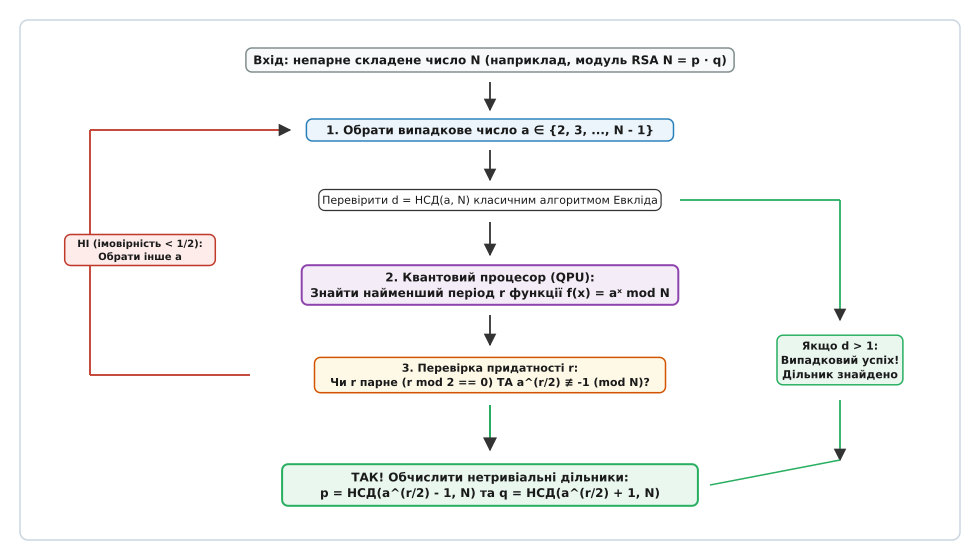
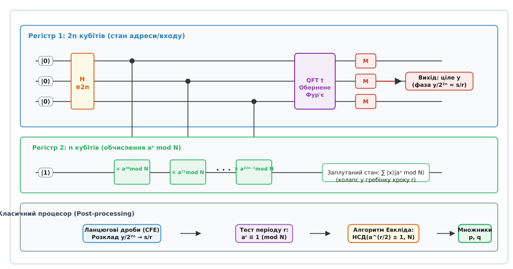
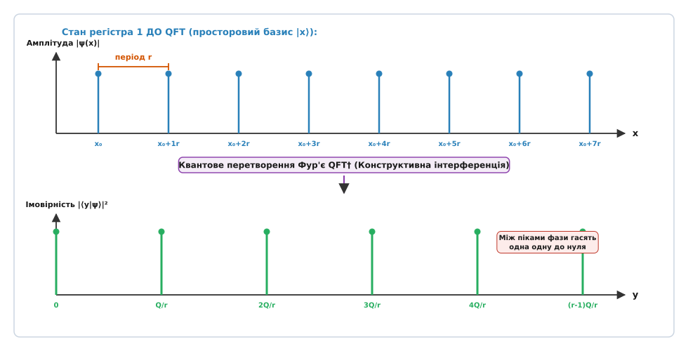
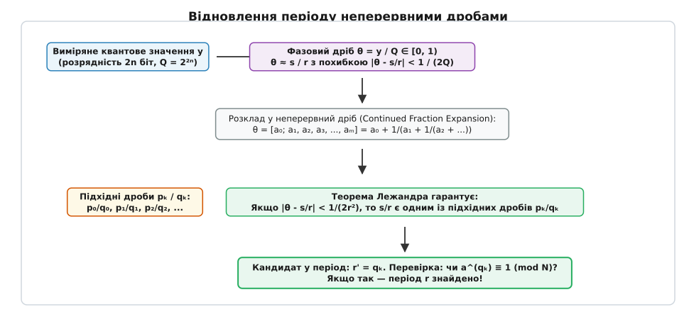

# Алгоритм Шора

<preknowlist>
- [Асимптотична складність](topic:computability/asymptotic-complexity) — O-нотація, класи складності, поліноміальне та субекспоненційне зростання.
- [Проблема дискретного логарифма](topic:sf-security/discrete-log-problem) — важкість обчислення показника степеня в циклічній групі.
- [Ймовірнісний клас BPP](topic:computability/bpp) — поліноміальні алгоритми з двосторонньою обмеженою ймовірністю помилки.
- [Розширений алгоритм Евкліда](topic:math-number-theory/gcd-euclidean) — знаходження найбільшого спільного дільника та співвідношення Безу.
- [Китайська теорема про остачі](topic:math-number-theory/chinese-remainder-theorem) — декомпозиція кілець лишків та ізоморфізм порівнянь за взаємно простими модулями.
</preknowlist>

Коли зашифроване з'єднання TLS 1.3 узгоджує сеансові ключі або цифровий підпис підтверджує фінансову транзакцію в системі інтернет-банкінгу, безпека всієї операції спирається на обчислювальну прірву між прямою та зворотною арифметикою цілих чисел. Перемножити два прості числа довжиною по 1024 біти сучасний класичний процесор здатний за кілька сотень наносекунд. Проте зворотна задача — розкладання отриманого 2048-бітного складеного числа `N = p · q` на прості множники (факторизація цілих чисел) — на звичайних комп'ютерах вимагає астрономічних часових витрат. Найефективніший з відомих класичних алгоритмів загального призначення — метод загального решета числового поля (англ. *General Number Field Sieve, GNFS*) — має субекспоненційну складність `exp(O((ln N)^(1/3) (ln ln N)^(2/3)))`, що для ключа RSA-2048 означає мільярди процесорних років безперервних обчислень на найпотужніших суперкомп'ютерних кластерах світу.

Усе змінилося 1994 року, коли американський математик Пітер Шор (*Peter Williston Shor*, нар. 1959) з лабораторії AT&T Bell Labs довів, що закони квантової механіки дозволяють обійти експоненційний бар'єр факторизації. Шор запропонував квантовий алгоритм, який знаходить розклад складеного числа `N` на множники за поліноміальний час `O((log N)³)` від бітової довжини числа.

Назва методу походить від імені його творця Пітера Шора. Термін «квантовий» веде походження від латинського *quantum* (скільки, дискретна неподільна порція величини), а слово «алгоритм» — від латинізованого імені перського математика IX століття Мухаммада ібн Муси аль-Хорезмі (*al-Khwarizmi*). Відкриття Шора стало поворотним моментом в історії комп'ютерних наук: воно довело, що квантовий комп'ютер — це не просто фізична модель для імітації молекул, а принципово новий клас обчислювальних машин, здатний зруйнувати фундамент сучасної асиметричної криптографії з відкритим ключем.

Детальний аналіз історичних передумов створення квантових алгоритмів та наукових дискусій довкола відкриття наведено у нарисі 📜 [Історія відкриття алгоритму Шора](topic:computability/shor-algorithm/hist-shor-discovery.md).

## 1. Теоретико-числова редукція: зведення факторизації до пошуку періоду

Головна концептуальна ідея алгоритму Шора полягає у строгому математичному зведенні: задача розкладання складеного числа `N` на прості множники зводиться до задачі знаходження порядку елемента (періоду періодичної послідовності залишків) у мультиплікативній групі кільця лишків `(ℤ/Nℤ)*`.

### Попередня класична фільтрація

Перш ніж застосовувати квантовий апарат, вхідне число `N` проходить два обов'язкові класичні перевірочні фільтри:
1. **Перевірка на парність:** Якщо `N mod 2 = 0`, число `N` є парним, і його нетривіальний дільник `p = 2` знаходиться миттєво.
2. **Перевірка на точний степінь:** Необхідно переконатися, що `N` не має вигляду `N = pᵏ` для деякого простого числа `p` та показника `k ≥ 2`. Для кожного цілого `k ∈ {2, 3, ..., log₂ N}` класичний процесор обчислює наближене значення `⌊N^(1/k)⌉` методом бінарного пошуку та перевіряє рівність степеня за поліноміальний час `O((log N)²)`.

Після відсіювання цих випадків ми отримуємо непарне складене число `N`, яке гарантовано має щонайменше два різних непарних простих дільники `p` та `q`.

### Алгебраїчний механізм зведення

Алгебраїчна редукція виконується у такій послідовності кроків:

1. Обираємо випадкове ціле число `a` в діапазоні `2 ≤ a ≤ N - 1`.
2. Обчислюємо найбільший спільний дільник `d = НСД(a, N)` за допомогою швидкого класичного алгоритму Евкліда. Якщо виявилося, що `d > 1`, ми випадково знайшли нетривіальний дільник числа `N`, і задача розв'язана без квантових обчислень.
3. Якщо ж `НСД(a, N) = 1`, число `a` належить мультиплікативній групі лишків `(ℤ/Nℤ)*`. Розглянемо числову функцію модульного піднесення до степеня:
   ```
   f(x) = aˣ mod N      [модульна показникова функція]
   ```
   За теоремою Ейлера, оскільки `НСД(a, N) = 1`, виконується рівність `a^(φ(N)) ≡ 1 (mod N)`, де `φ(N)` — функція Ейлера. Отже, у скінченній групі лишків послідовність значень `f(0), f(1), f(2), ...` неминуче зациклюється і є строго періодичною.
4. Найменше додатне ціле число `r > 0`, для якого виконується порівняння:
   ```
   aʳ ≡ 1 (mod N)      [означення порядку елемента r]
   ```
   називається **порядком елемента** `a` за модулем `N` (або періодом функції `f(x)`).


*Редукція задачі факторизації непарного складеного числа N до знаходження порядку елемента a в мультиплікативній групі лишків.*

Якщо нам вдалося знайти період `r`, ми можемо розкласти число `N` за допомогою різниці квадратів. Припустимо, що період `r` є **парним числом** (`r mod 2 = 0`). Тоді показник `r / 2` є цілим числом, і початкове порівняння можна переписати:

```
aʳ - 1 ≡ 0 (mod N)
(a^(r/2))² - 1 ≡ 0 (mod N)                   [подання у вигляді різниці квадратів]
(a^(r/2) - 1) · (a^(r/2) + 1) ≡ 0 (mod N)    [алгебраїчний розклад на множники]
```

Це порівняння означає, що добуток двох цілих чисел `(a^(r/2) - 1)` та `(a^(r/2) + 1)` ділиться націло на `N`. 

Якщо додатково виконується умова, що `a^(r/2) ≢ -1 (mod N)` (тобто число `a^(r/2) + 1` не ділиться націло на `N`), то число `N` не ділить жоден із цих двох множників окремо, але ділить їхній спільний добуток. Звідси безпосередньо випливає, що кожен із множників повинен містити спільний нетривіальний дільник із числом `N`.

Ці дільники миттєво обчислюються класичним алгоритмом Евкліда:

```
p = НСД(a^(r/2) - 1, N)      [перший нетривіальний дільник N]
q = НСД(a^(r/2) + 1, N)      [другий нетривіальний дільник N]
```

### Алгебра квадратних коренів з одиниці та ймовірність розщеплення

Чому цей метод гарантовано розщеплює число `N`? З погляду вищої алгебри число `x = a^(r/2) mod N` є розв'язком квадратного рівняння:

```
x² ≡ 1 (mod N)      [квадратні корені з одиниці]
```

У полі простих чисел `ℤ_p` рівняння `x² ≡ 1 (mod p)` має рівно два розв'язки: `x = 1` та `x = -1` (тривіальні корені). Проте у складеному кільці `ℤ_N`, де за [Китайською теоремою про остачі](topic:math-number-theory/chinese-remainder-theorem) кільце ізоморфне прямому добутку `ℤ_N ≅ ℤ_p × ℤ_q`, рівняння розпадається на незалежні пари рівнянь `x² ≡ 1 (mod p)` та `x² ≡ 1 (mod q)`. Кожна пара дає чотири розв'язки `(±1, ±1)`:

1. `(1, 1) ↦ x ≡ 1 (mod N)` — тривіальний корінь.
2. `(-1, -1) ↦ x ≡ -1 (mod N)` — тривіальний корінь.
3. `(1, -1) ↦ x ≡ c₁ (mod N)` — нетривіальний квадратний корінь з одиниці.
4. `(-1, 1) ↦ x ≡ -c₁ (mod N)` — нетривіальний квадратний корінь з одиниці.

Коли період `r` парний, значення `a^(r/2)` не може дорівнювати `1 (mod N)` (бо `r` — найменший додатний період). Якщо воно також не дорівнює `-1 (mod N)`, то `a^(r/2)` є саме нетривіальним квадратним коренем з одиниці. У цьому випадку `a^(r/2) ≡ 1 (mod p)` та `a^(r/2) ≡ -1 (mod q)`, звідки різниця `a^(r/2) - 1` ділиться на `p`, але не ділиться на `q`. Отже, найбільший спільний дільник `НСД(a^(r/2) - 1, N)` дорівнює саме `p`.

Строгий аналіз структури мультиплікативної групи доводить, що для довільного складеного непарного числа з `k ≥ 2` різними простими дільниками ймовірність того, що випадково обрана база `a` забезпечить парний період `r` і нетривіальний корінь, становить:

```
P(успіху) ≥ 1 - 1 / 2^(k - 1) ≥ 1 / 2
```

Для класичного модуля RSA `N = p · q` (де `k = 2`) ця ймовірність становить щонайменше 50%. Якщо спроба виявилася невдалою, алгоритм обирає нове випадкове `a`. За `t` незалежних спроб ймовірність невиявлення дільників падає як `(1/2)ᵗ`.

Отже, вся обчислювальна складність факторизації звелася до однієї-єдиної операції: **знайти період `r` функції `f(x) = aˣ mod N`**.

Чому класичні комп'ютери не здатні ефективно знаходити період `r`? Тому що порядок `r` може бути величиною того ж порядку, що й саме число `N` (наприклад, `r ≈ 2²⁰⁴⁸`). Класичний алгоритм змушений обчислювати значення `aˣ mod N` одне за одним і шукати колізію `aˣ¹ ≡ aˣ² (mod N)`. За парадоксом днів народження такий пошук вимагає не менше `Ω(√r) = Ω(2¹⁰²⁴)` обчислень.

## 2. Архітектура квантової схеми та підготовка суперпозиції

Квантовий алгоритм розв'язує задачу пошуку періоду `r` за рахунок принципу масивного квантового паралелізму та квантової інтерференції. Обчислення реалізується на схемі з двома квантовими регістрами:

1. **Перший регістр (керівний / фазовий):** містить `m = 2n` кубітів, де `n = ⌈log₂ N⌉` — розрядність числа `N` у двійковому записі. Кількість базисних станів першого регістра дорівнює `Q = 2ᵐ = 2²ⁿ`, що гарантує виконання фундаментальної умови `N² ≤ Q < 2N²`. Цей розмір необхідний для однозначного відновлення періоду через неперервні дроби.
2. **Другий регістр (робочий / цільовий):** містить `n = ⌈log₂ N⌉` кубітів, достатніх для збереження значень залишків `aˣ mod N < N`.


*Квантова схема алгоритму Шора: ініціалізація суперпозиції, контрольоване модульне піднесення до степеня, обернене квантове перетворення Фур'є та вимірювання фази.*

Повний квантовий процес факторизації проходить через кілька послідовних фізичних трансформацій квантового стану системи.

### Крок 1. Ініціалізація та накладання вентилів Адамара

Початковий стан обох регістрів готується у базисному стані, де перший регістр обнулено, а другий регістр містить двійковий запис одиниці (оскільки `a⁰ = 1`):

```
|Ψ₀⟩ = |0⟩^(⊗2n) ⊗ |1⟩^(⊗n) = |0⟩|1⟩
```

До кожного з `2n` кубітів першого регістра паралельно застосовується унітарний однокубітний вентиль Адамара `H`:

```
H = (1 / √2) · [ 1   1 ]
               [ 1  -1 ]
```

Тензорний добуток `H^(⊗2n)` переводить перший регістр у стан абсолютно рівномірної суперпозиції всіх можливих `Q = 2²ⁿ` двійкових чисел:

```
|Ψ₁⟩ = (H^(⊗2n) ⊗ I) |0⟩|1⟩ = (1 / √Q) · ∑_{x=0}^{Q-1} |x⟩ |1⟩
```

У цей момент система містить одночасно всі значення аргументу `x` від `0` до `Q - 1` з однаковою амплітудою ймовірності `1 / √Q`.

## 3. Квантовий оракул модульного піднесення та заплутування регістрів

### Крок 2. Контрольоване унітарне відображення

Наступним етапом є виконання квантового модульного піднесення до степеня. На обидва регістри діє унітарний квантовий оператор `U_a`:

```
U_a |x⟩|y⟩ = |x⟩ |(y · aˣ) mod N⟩
```

Оскільки число `a` є взаємно простим із модулем `N`, операція множення на `aˣ mod N` є бієктивною перестановкою елементів групи `(ℤ/Nℤ)*`. Відповідно, матриця оператора `U_a` є унітарною (`U_a† U_a = I`), що забезпечує її точну фізичну реалізовність без порушення квантової оборотності.

У фізичній квантовій схемі оператор `U_a` розкладається за двійковими розрядами керуючого числа `x = x_{2n-1} ... x₁ x₀`:

```
aˣ mod N = a^(∑_{i=0}^{2n-1} x_i · 2ⁱ) mod N = ∏_{i=0}^{2n-1} (a^(2ⁱ) mod N)^(x_i) mod N
```

Схема містить `2n` послідовних контрольованих модульних помножувачів `C-MULT(a^(2ⁱ) mod N)`, кожен із яких керується відповідним `i`-м кубітом першого регістра. Константа `a^(2ⁱ) mod N` попередньо обчислюється на класичному комп'ютері за методом повторного піднесення до квадрата за час `O(n)`.

### Схемна реалізація модульної квантової арифметики

Фізична побудова модульного помножувача `|y⟩ ↦ |(y · c) mod N⟩` вимагає оборотного складання квантових суматорів:
- **Квантовий суматор Дрейпера (QFT Adder):** додавання константи `c` виконується безпосередньо у фазовому просторі: до цільового регістра застосовується `QFT`, після чого фази кубітів обертаються на кути `Δθ_k = 2π · c / 2ᵏ`, і застосовується `QFT†`. Такий підхід не потребує ліній перенесення розрядів.
- **Модульне віднімання та відновлення перенесення:** Щоб виконати редукцію за модулем `N`, суматор додає число `y + c`, віднімає `N` і перевіряє знаковий анцильний кубіт. Якщо стався переповнення (результат менший за 0), константа `N` додається назад контрольованою операцією, а анцильний кубіт розплутується зворотним обчисленням (*uncomputation*).

Після завершення дії оракула загальний стан системи набуває вигляду:

```
|Ψ₂⟩ = U_a |Ψ₁⟩ = (1 / √Q) · ∑_{x=0}^{Q-1} |x⟩ |aˣ mod N⟩
```

У стані `|Ψ₂⟩` перший і другий регістри виявляються максимально заплутаними (*quantum entanglement*): кожному базисному стану аргументу `|x⟩` у першому регістрі строго відповідає стан обчисленого залишку `|aˣ mod N⟩` у другому регістрі.

## 4. Вимірювання другого регістра та колапс у квантову гребінку

Розгляньмо, що відбувається з квантовим станом, якщо виконати вимірювання кубітів другого регістра.

Припустимо, що детектор другого регістра зафіксував деяке конкретне числове значення залишку `y₀`. Оскільки функція `f(x) = aˣ mod N` є періодичною з періодом `r`, цей самий залишок `y₀` досягається не в одній точці, а в цілій арифметичній прогресії значень аргументу:

```
x = x₀, x₀ + r, x₀ + 2r, x₀ + 3r, ...
```

де `x₀ ∈ {0, 1, ..., r - 1}` — найменший невід'ємний показник, для якого `a^(x₀) mod N = y₀`.

Відповідно до постулату фон Неймана про редукцію хвильової функції при вимірюванні, другий регістр колапсує у фіксований стан `|y₀⟩`, а стан першого регістра зазнає миттєвої проєкції на підпростір аргументів, що породжують цей залишок. Отримуємо нормовану суперпозицію періодичної гребінки:

```
|ψ_comb⟩ = (1 / √M) · ∑_{k=0}^{M-1} |x₀ + k · r⟩
```

де `M` — точна кількість точок гребінки, що потрапили в робочий діапазон `[0, Q - 1]`:

```
M = ⌊(Q - 1 - x₀) / r⌋ + 1 ≈ Q / r
```


*Перетворення періодичного квантового стану (гребінки з кроком r) на гострі інтерференційні максимуми навколо кратних частот s · Q / r за допомогою QFT.*

### Чому пряме вимірювання першого регістра безглузде?

Якщо на цьому кроці безпосередньо виміряти стан першого регістра, квантовий стан сколапсує у випадкове значення `x = x₀ + k · r`. Оскільки зміщення `x₀` є абсолютно випадковим числом, а кратність `k` невідома, одне отримане число `x` не дає жодної інформації про період `r`. 

Повторний запуск квантової схеми згенерує новий випадковий залишок `y₁` і абсолютно нове, незалежне випадкове зміщення `x₁`, тому різниця результатів вимірювань двох різних запусків `x' - x` не буде кратною `r`.

Інформація про період `r` захована не в окремих значеннях аргументів, а у **глобальній просторовій періодичності** квантового вектора амплітуд. Щоб вилучити цей просторовий період, необхідно перевести квантовий стан із координатного простору в частотний.

Повний математичний апарат унітарного квантового перетворення Фур'є, виведення амплітуд імовірностей та аналіз інтерференційних сум детально викладено у вставці 🧮 [Математичний апарат квантового перетворення Фур'є та оцінки фази](topic:computability/shor-algorithm/math-period-finding-qft.md).

## 5. Квантове перетворення Фур'є та інтерференція амплітуд

Для перетворення періодичності амплітуд у частотний спектр застосовується унітарне **квантове перетворення Фур'є** (англ. *Quantum Fourier Transform, QFT*).

Оператор дискретного квантового перетворення Фур'є `F_Q` переводить довільний базисний стан `|j⟩` у симетричну суперпозицію з комплексними фазовими множниками:

```
F_Q |j⟩ = (1 / √Q) · ∑_{k=0}^{Q-1} exp(2πi · j · k / Q) |k⟩
```

В алгоритмі Шора до першого регістра застосовується обернене квантове перетворення Фур'є `F_Q†`:

```
|Ψ₃⟩ = F_Q† |ψ_comb⟩ = ∑_{y=0}^{Q-1} c_y |y⟩
```

Обчислимо амплітуду ймовірності `c_y = ⟨y| F_Q† |ψ_comb⟩` для довільного вихідного базисного стану `|y⟩`:

```
c_y = (1 / √(Q · M)) · ∑_{k=0}^{M-1} exp(-2πi · y · (x₀ + k · r) / Q)
```

Винесемо спільний фазовий множник, що залежить від випадкового початкового зміщення `x₀`, за дужки:

```
c_y = (exp(-2πi · y · x₀ / Q) / √(Q · M)) · ∑_{k=0}^{M-1} exp(-2πi · y · k · r / Q)
```

Внутрішня сума є сумою скінченної геометричної прогресії зі знаменником `q = exp(-2πi · y · r / Q)`. Поведінка цієї суми визначає фізику квантової інтерференції:

1. **Конструктивна інтерференція (підсилення):** Якщо величина `y · r / Q` є цілим числом `s ∈ {0, 1, ..., r - 1}` (тобто `y ≈ s · Q / r`), усі комплексні вектори в сумі мають однаковий фазовий кут (близький до `0 mod 2π`). Усі `M` доданків додаються строго у фазі вздовж дійсної осі:
   ```
   ∑_{k=0}^{M-1} exp(0) = M
   ```
   Амплітуда `c_y` набуває максимального значення `|c_y| ≈ M / √(Q · M) = √(M / Q) ≈ 1 / √r`. Відповідно, ймовірність спостереження стану `|y⟩` становить `P(y) = |c_y|² ≈ 1 / r`.
2. **Деструктивна інтерференція (взаємне гасіння):** Якщо частота `y` далека від точок `s · Q / r`, комплексні експоненти спрямовані рівномірно в усі боки на комплексній одиничній окружності. Сумування таких векторів призводить до їхнього майже повного взаємного знищення: `c_y ≈ 0`.

В результаті деструктивної інтерференції ймовірності всіх некратних частот падають практично до нуля, а хвильова функція концентрується виключно у вузьких піках навколо `r` резонансних значень:

```
y_s ≈ s · Q / r      [де s ∈ {0, 1, ..., r - 1}]
```

Аналітична оцінка інтегральної ймовірності показує, що ймовірність виміряти стан `y`, для якого похибка фази не перевищує половини інтервалу дискретизації `|y / Q - s / r| ≤ 1 / (2Q)`, задовольняє нерівність:

```
P(успішного вимірювання) ≥ 4 / π² ≈ 0.4053      [нижня межа контрастності QFT]
```

Вимірювання першого регістра тепер із переважною ймовірністю дає одне з цілих чисел `y`, яке з високою точністю кодує дріб `s / r`.

### Алгебраїчний зв'язок з алгоритмом оцінки фази Кітаєва

Алгоритм Шора можна інтерпретувати як частковий випадок алгоритму оцінки фази Кітаєва (*Quantum Phase Estimation, QPE*) для унітарного оператора `U_a`. 

Власні вектори оператора `U_a` задаються як дискретні перетворення Фур'є над циклічною орбітою залишків:

```
|u_s⟩ = (1 / √r) · ∑_{k=0}^{r-1} exp(-2πi · s · k / r) |aᵏ mod N⟩      [власні стани оракула]
```

для кожного `s ∈ {0, 1, ..., r - 1}`. Дія оператора `U_a` на стан `|u_s⟩` зсуває індекси степенів і множить вектор на точну фазу:

```
U_a |u_s⟩ = exp(2πi · s / r) |u_s⟩      [фазове власне значення]
```

Початковий стан другого регістра `|1⟩ = |a⁰ mod N⟩` є рівномірною суперпозицією всіх `r` власних векторів:

```
|1⟩ = (1 / √r) · ∑_{s=0}^{r-1} |u_s⟩
```

Застосування алгоритму оцінки фази до стану `|1⟩` заплутує перший регістр із фазами `s / r`, після чого `QFT†` виділяє кожну фазу `s / r` у відповідному базисному стані першого регістра.

## 6. Класичне декодування періоду методом неперервних дробів

Вимірявши перший квантовий регістр, ми отримуємо одне ціле число `y ∈ {0, 1, ..., Q - 1}`. Ми знаємо, що відношення цього числа до розмірності простору `Q` наближає невідоме раціональне число `s / r`:

```
θ = y / Q ≈ s / r      [фазова оцінка]
```

Оскільки `Q = 2²ⁿ ≥ N² > r²`, точність квантової оцінки фази задовольняє фундаментальну нерівність:

```
| y / Q - s / r | ≤ 1 / (2Q) < 1 / (2r²)
```


*Класичне декодування періоду r з виміряної фазової оцінки θ = y / Q за допомогою алгоритму неперервних дробів та теореми Лежандра.*

Як знайти невідомий дріб `s / r` зі знаменником `r < N`, знаючи лише дійсне число `θ = y / Q`? Відповідь дає класична теорія неперервних (ланцюгових) дробів.

### Теорема Лежандра про неперервні дроби

> **Теорема Лежандра:** Якщо дійсне число `θ` та нескоротний дріб `p / q` (де `q ≥ 1`) задовольняють нерівність `|θ - p / q| < 1 / (2q²)`, то дріб `p / q` є одним із підхідних дробів (англ. *convergents*) розкладу числа `θ` у неперервний дріб.

Класичний процесор розкладає число `θ = y / Q` у скінченний неперервний дріб:

```
θ = a₀ + 1 / (a₁ + 1 / (a₂ + 1 / (a₃ + ...))) = [a₀; a₁, a₂, a₃, ...]
```

Послідовність підхідних дробів `p_k / q_k` обчислюється за швидким рекурентним співвідношенням:

```
p_(-1) = 1,  p_0 = a₀,  p_k = a_k · p_(k-1) + p_(k-2)
q_(-1) = 0,  q_0 = 1,   q_k = a_k · q_(k-1) + q_(k-2)
```

Для кожного отриманого знаменника `q_k < N` алгоритм перевіряє, чи є він шуканим періодом `r`, шляхом безпосередньої перевірки умови порядку:

```
a^(q_k) ≡ 1 (mod N)      [тест кандидата в період]
```

Якщо чисельник `s` і знаменник `r` були взаємно простими (`НСД(s, r) = 1`), то нескоротний дріб `p_k / q_k` дасть точний знаменник `q_k = r`.

Якщо ж виявилося, що `НСД(s, r) = g > 1`, дріб скотиться до `(s/g) / (r/g)`, і знаменник `q_k` буде дільником `r`. У цьому разі достатньо запустити квантову схему ще 1–2 рази, отримати інший дільник `r'` і знайти період як найменше спільне кратне отриманих знаменників: `r = НСК(q_k^{(1)}, q_k^{(2)})`.

## 7. Наскрізний числовий розрахунок: факторизація N = 15

Простежмо роботу алгоритму Шора на класичному навчальному прикладі розкладання числа `N = 15`.

1. **Вибір бази:** Обираємо випадкове число `a = 7`. Перевіряємо `НСД(7, 15) = 1`.
2. **Параметри регістра:** Розрядність `N = 15` у двійковому записі становить `n = 4` біти (`15 = 1111₂`). Для першого регістра беремо `m = 2n = 8` кубітів. Розмірність `Q = 2⁸ = 256`. Умова `15² = 225 ≤ 256` виконується.
3. **Періодичність функції:** Обчислимо теоретичну послідовність залишків `f(x) = 7ˣ mod 15`:
   - `7⁰ mod 15 = 1`
   - `7¹ mod 15 = 7`
   - `7² mod 15 = 49 mod 15 = 4`
   - `7³ mod 15 = (4 · 7) mod 15 = 28 mod 15 = 13`
   - `7⁴ mod 15 = (13 · 7) mod 15 = 91 mod 15 = 1`
   
   Послідовність повторюється з точним періодом `r = 4`.
4. **Стан гребінки:** Нехай при вимірюванні другого регістра випав залишок `y₀ = 1`. Тоді перший регістр колапсує у стан суперпозиції значень `{0, 4, 8, 12, ..., 252}`:
   ```
   |ψ_comb⟩ = (1 / 8) · (|0⟩ + |4⟩ + |8⟩ + ... + |252⟩)
   ```
5. **Квантове перетворення Фур'є:** Застосування `F₂₅₆†` створює конструктивну інтерференцію в точках `y = s · 256 / 4 = {0, 64, 128, 192}` для `s ∈ {0, 1, 2, 3}`. Кожен із цих чотирьох станів вимірюється з ймовірністю `1/4 = 25%`.
6. **Вимірювання та неперервні дроби:** Припустимо, що квантовий детектор зафіксував стан `y = 192`.
   - Обчислюємо фазу: `θ = 192 / 256 = 3 / 4 = 0.75`.
   - Розкладаємо дріб `3/4` у неперервний дріб:
     ```
     3 / 4 = 0 + 1 / (1 + 1/3) = [0; 1, 3]
     ```
   - Обчислюємо підхідні дроби:
     - `k = 0`: дріб `0 / 1`
     - `k = 1`: дріб `1 / 1`
     - `k = 2`: дріб `3 / 4`
   - Отримуємо знаменник-кандидат `q₂ = 4`.
7. **Перевірка періоду:**
   - Перевіряємо `7⁴ mod 15 = 2401 mod 15 = 1`. Період `r = 4` знайдено абсолютно точно!
8. **Обчислення множників:**
   - Період `r = 4` є парним: `r / 2 = 2`.
   - Перевіряємо умову нетривіальності: `7² mod 15 = 4 ≢ -1 (mod 15)`.
   - Обчислюємо нетривіальні дільники через найбільший спільний дільник:
     ```
     p = НСД(7² - 1, 15) = НСД(48, 15) = 3
     q = НСД(7² + 1, 15) = НСД(50, 15) = 5
     ```
   
   Отримано розклад: `15 = 3 · 5`.

## 8. Складносна класифікація та клас BQP

У теорії обчислювальної складності алгоритм Шора визначає приналежність задач факторизації цілих чисел та дискретного логарифмування до класу **BQP** (*Bounded-error Quantum Polynomial time* — клас задач, які розв'язуються квантовим комп'ютером за поліноміальний час із ймовірністю успіху не менше 2/3).

| Алгоритм факторизації | Тип обчислювача | Часова складність від `n = log₂ N` |
| :--- | :--- | :--- |
| **Метод пробного ділення** | Класичний детермінований | `O(2^(n/2))` (експоненційна) |
| **ρ-алгоритм Полларда** | Класичний імовірнісний | `O(2^(n/4))` (експоненційна) |
| **Квадратичне решето (QS)** | Класичний субекспоненційний | `exp((1 + o(1)) √(ln N ln ln N))` |
| **Загальне решето числового поля (GNFS)** | Класичний субекспоненційний | `exp((1.923 + o(1)) (ln N)^(1/3) (ln ln N)^(2/3))` |
| **Алгоритм Шора** | Квантовий (BQP) | `O(n³)` або `O(n² log n log log n)` |

### Квантові ресурси та просторова складність

Асимптотична складність алгоритму Шора залежить від обраної схеми модульної арифметики:

1. **Кількість квантових вентилів:** При використанні шкільного множення схема вимагає `O(n³)` елементарних квантових вентилів (CNOT, Toffoli, фазові зсуви). При використанні швидких алгоритмів квантового множення типу Шьонхаге — Штрассена або алгоритмів Карацуби схемна складність знижується до `O(n² log n log log n)`.
2. **Кількість логічних кубітів:** Базова схема вимагає `3n` кубітів (`2n` для першого регістра та `n` для другого). Оптимізована напівкласична схема Стефана Беджореґара (2003) дозволяє виконувати QFT з побітовим вимірюванням на одному рециркуляційному кубіті, зменшуючи загальну потребу до `2n + 3` логічних кубітів.
3. **Квантова глибина схеми:** Паралелізація модульних суматорів Куккаро дозволяє досягти глибини схеми `O(n)`.

### Узагальнення на проблему дискретного логарифма

Алгоритм Шора безпосередньо узагальнюється на [проблему дискретного логарифма](topic:sf-security/discrete-log-problem): знаходження цілого показника `x`, що задовольняє рівняння `gˣ ≡ y (mod p)` у мультиплікативній групі порядку `p - 1` (або в групі точок еліптичної кривої `E(𝔽ₚ)`).

Для дискретного логарифма квантовий оракул будує суперпозицію над двовимірною сіткою аргументів:

```
f(x₁, x₂) = (g^(x₁) · y^(-x₂)) mod p      [двовимірна періодична функція]
```

Оскільки `y = gˣ`, функція набуває однакових значень уздовж паралельних прямих `x₁ - x · x₂ ≡ const (mod p - 1)`. Двовимірне квантове перетворення Фур'є `QFT_(p-1) ⊗ QFT_(p-1)` концентрує амплітуди у станах `(d₁, d₂)`, де `d₁ · x + d₂ ≡ 0 (mod p - 1)`. Звідси шуканий логарифм знаходиться за одну операцію ділення за модулем `x = -d₂ · d₁⁻¹ mod (p - 1)`. Квантова складність розв'язання дискретного логарифма також становить `O((log p)³)`.

### Парадигма проблеми прихованої підгрупи (HSP)

З теоретичної точки зору алгоритм Шора є частиною ширшого сімейства квантових алгоритмів розв'язання **проблеми прихованої підгрупи** (англ. *Hidden Subgroup Problem, HSP*).

Нехай задано скінченну групу `G`, множину `X` та оракульну функцію `f: G → X`, яка є постійною на суміжних класах деякої невідомої підгрупи `H ≤ G` та набуває різних значень на різних суміжних класах (`f(g₁) = f(g₂) ⇔ g₁ · g₂⁻¹ ∈ H`). Задача полягає у знаходженні генераторів підгрупи `H`.

- **Алгоритм Саймона:** розв'язує HSP над бінарною абелевою групою `G = (ℤ₂)ⁿ`.
- **Факторизація Шора:** розв'язує HSP над циклічною абелевою групою `G = ℤ`. Прихована підгрупа є підгрупою кратних періоду `H = rℤ`.
- **Дискретний логарифм Шора:** розв'язує HSP над прямою сумою двох циклічних груп `G = ℤ_(p-1) × ℤ_(p-1)`.

Усі абелеві проблеми HSP квантовий комп'ютер розв'язує за поліноміальний час завдяки дискретному перетворенню Фур'є над відповідною групою характерів. Натомість для неабелевих груп (наприклад, симетричної групи `S_n`, до якої зводиться ізоморфізм графів, або діедральної групи `D_n`, до якої зводяться решіткові задачі) квантове перетворення Фур'є не дає простого розділення підгруп, що робить задачі на евклідових решітках стійкими до квантових атак.

## 9. Фізична реалізація, квантові коди виправлення помилок та постквантова ера

Чому ж алгоритм Шора, відкритий понад 30 років тому, досі не зламав усі криптографічні системи світу? Відповідь полягає у прірві між **логічними** та **фізичними** кубітами.

### Проблема декогеренції та квантова корекція помилок

Будь-який фізичний квантовий процесор (на надпровідниках, іонах у пастках чи нейтральних атомах) зазнає квантової декогеренції — неконтрольованої взаємодії з тепловими та електромагнітними шумами навколишнього середовища. Імовірність помилки одного фізичного вентиля у сучасних процесорах становить близько `p_err ≈ 10⁻³`.

Для виконання мільярдів квантових операцій алгоритму Шора потрібні відмовостійкі обчислення (*Fault-Tolerant Quantum Computing*). Логічний кубіт кодується ансамблем із сотень фізичних кубітів за допомогою топологічних **поверхневих кодів** (*Surface Codes*). За розрахунками Крейґа Гідні та Мартіна Екеро (Google Quantum AI, 2021):

- Для факторизації ключа RSA-2048 потрібно близько **4096 логічних кубітів**.
- При фізичній частоті помилок `10⁻³` для забезпечення надійності потрібна кодова відстань поверхневого коду `d = 27..31`.
- Загальна кількість **фізичних кубітів** становить близько **20 мільйонів**.
- Основний час роботи квантового комп'ютера (~8 годин) витрачається не на власне модульне множення, а на фабрики дистиляції магічних станів (*Magic State Distillation*) для вентилів Тоффолі (T-вентилів), які не входять до групи Кліффорда.

### Постквантова криптографія (PQC)

Усвідомлення неминучості створення повномасштабного квантового комп'ютера змусило Національний інститут стандартів і технологій США (NIST) розпочати глобальну стандартизацію алгоритмів постквантової криптографії (*Post-Quantum Cryptography, PQC*).

Стійкість до квантових атак базується на математичних задачах, для яких не існує прихованої періодичності абелевих груп:
1. **Криптографія на евклідових решітках (Lattice-based):** задачі знаходження найкоротшого вектора (SVP) та навчання з помилками (LWE / Ring-LWE). Стандарти **ML-KEM** (раніше *Kyber*) для інкапсуляції ключів та **ML-DSA** (*Dilithium*) для цифрового підпису.
2. **Хеш-орієнтовані підписи (Stateful / Stateless Hash-based):** протокол **SLH-DSA** (*SPHINCS+*), безпека якого спирається виключно на стійкість криптографічних хеш-функцій до колізій.

Слід розрізняти вплив алгоритму Шора та квантового алгоритму пошуку Ґровера. Алгоритм Ґровера дає лише квадратичне прискорення неструктурованого перебору `O(√N)`, що для симетричних шифрів (AES) нейтралізується простим збільшенням довжини ключа з 128 до 256 біт. Натомість алгоритм Шора забезпечує **експоненційне прискорення**, повністю руйнуючи математичну основу класичних асиметричних систем RSA, DH, DSA та ECDSA.

Практичну програмну емуляцію квантового регістра, алгоритму QFT та числового експерименту факторизації наведено у статті ⚙️ [Програмна емуляція та моделювання вектора стану квантового регістра](topic:computability/shor-algorithm/proj-shor-simulation.md).

## 10. Програмна реалізація класичного контуру пост-обробки

Подамо завершений програмний код на C та C++, який реалізує класичний контур алгоритму Шора: розклад виміряної фази `θ = y / Q` у неперервний дріб, обчислення підхідних дробів, перевірку знаменників на роль періоду `r` та фінальне вилучення простих множників через алгоритм Евкліда.

:::tabs
```c
#include <stdio.h>
#include <stdint.h>
#include <stdbool.h>

/* Обчислення найбільшого спільного дільника (алгоритм Евкліда) */
uint64_t gcd_u64(uint64_t a, uint64_t b) {
    while (b != 0) {
        uint64_t temp = b;
        b = a % b;
        a = temp;
    }
    return a;
}

/* Швидке модульне піднесення до степеня: (base^exp) mod mod */
uint64_t mod_pow_u64(uint64_t base, uint64_t exp, uint64_t mod) {
    uint64_t result = 1;
    base %= mod;
    while (exp > 0) {
        if (exp & 1) {
            result = (uint64_t)((__int128)result * base % mod);
        }
        base = (uint64_t)((__int128)base * base % mod);
        exp >>= 1;
    }
    return result;
}

/* Відновлення періоду r та факторизація N за виміряною фазою y/Q */
bool shor_classical_postprocess(uint64_t N, uint64_t a, uint64_t y, uint64_t Q,
                                uint64_t *out_p, uint64_t *out_q) {
    if (y == 0) return false;

    uint64_t num = y;
    uint64_t den = Q;

    uint64_t p_prev2 = 0, p_prev1 = 1, p_curr = 0;
    uint64_t q_prev2 = 1, q_prev1 = 0, q_curr = 0;

    /* Покроковий розклад у неперервний дріб */
    while (den != 0) {
        uint64_t a_k = num / den;
        uint64_t rem = num % den;

        p_curr = a_k * p_prev1 + p_prev2;
        q_curr = a_k * q_prev1 + q_prev2;

        /* Оновлення чисельників та знаменників */
        p_prev2 = p_prev1; p_prev1 = p_curr;
        q_prev2 = q_prev1; q_prev1 = q_curr;

        num = den;
        den = rem;

        if (q_curr >= N) break;

        /* Тестуємо отриманий знаменник q_curr як період r */
        uint64_t r_candidate = q_curr;
        if (mod_pow_u64(a, r_candidate, N) == 1) {
            /* Період знайдено! Перевіряємо парність */
            if (r_candidate % 2 == 0) {
                uint64_t half_pow = mod_pow_u64(a, r_candidate / 2, N);
                if (half_pow != N - 1 && half_pow != 1) {
                    uint64_t factor1 = gcd_u64(half_pow - 1, N);
                    uint64_t factor2 = gcd_u64(half_pow + 1, N);

                    if (factor1 > 1 && factor1 < N) {
                        *out_p = factor1;
                        *out_q = N / factor1;
                        return true;
                    }
                    if (factor2 > 1 && factor2 < N) {
                        *out_p = factor2;
                        *out_q = N / factor2;
                        return true;
                    }
                }
            }
        }
    }
    return false;
}

int main(void) {
    uint64_t N = 15;
    uint64_t a = 7;
    uint64_t y = 192;
    uint64_t Q = 256;

    uint64_t p = 0, q = 0;
    if (shor_classical_postprocess(N, a, y, Q, &p, &q)) {
        printf("Успіх: %llu = %llu * %llu\n", (unsigned long long)N,
               (unsigned long long)p, (unsigned long long)q);
    } else {
        printf("Не вдалося розкласти модуль на множники.\n");
    }
    return 0;
}
```
```cpp
#include <iostream>
#include <numeric>
#include <optional>
#include <utility>
#include <cstdint>

// Швидке модульне піднесення до степеня
constexpr uint64_t mod_pow(uint64_t base, uint64_t exp, uint64_t mod) noexcept {
    uint64_t result = 1;
    base %= mod;
    while (exp > 0) {
        if (exp & 1) {
            result = static_cast<uint64_t>(static_cast<unsigned __int128>(result) * base % mod);
        }
        base = static_cast<uint64_t>(static_cast<unsigned __int128>(base) * base % mod);
        exp >>= 1;
    }
    return result;
}

// Класичне декодування періоду через неперервні дроби та факторизація
std::optional<std::pair<uint64_t, uint64_t>> factorize_from_phase(
    uint64_t N, uint64_t a, uint64_t y, uint64_t Q) noexcept {
    
    if (y == 0) return std::nullopt;

    uint64_t num = y;
    uint64_t den = Q;

    uint64_t p_prev2 = 0, p_prev1 = 1;
    uint64_t q_prev2 = 1, q_prev1 = 0;

    while (den != 0) {
        const uint64_t a_k = num / den;
        const uint64_t rem = num % den;

        const uint64_t p_curr = a_k * p_prev1 + p_prev2;
        const uint64_t q_curr = a_k * q_prev1 + q_prev2;

        p_prev2 = p_prev1; p_prev1 = p_curr;
        q_prev2 = q_prev1; q_prev1 = q_curr;

        num = den;
        den = rem;

        if (q_curr >= N) break;

        // Перевіряємо q_curr як порядок елемента r
        if (mod_pow(a, q_curr, N) == 1) {
            if (q_curr % 2 == 0) {
                const uint64_t half_pow = mod_pow(a, q_curr / 2, N);
                if (half_pow != N - 1 && half_pow != 1) {
                    const uint64_t factor1 = std::gcd(half_pow - 1, N);
                    const uint64_t factor2 = std::gcd(half_pow + 1, N);

                    if (factor1 > 1 && factor1 < N) {
                        return std::make_pair(factor1, N / factor1);
                    }
                    if (factor2 > 1 && factor2 < N) {
                        return std::make_pair(factor2, N / factor2);
                    }
                }
            }
        }
    }
    return std::nullopt;
}

int main() {
    constexpr uint64_t N = 15;
    constexpr uint64_t a = 7;
    constexpr uint64_t y = 192;
    constexpr uint64_t Q = 256;

    if (const auto factors = factorize_from_phase(N, a, y, Q)) {
        const auto [p, q] = *factors;
        std::cout << "Успіх: " << N << " = " << p << " * " << q << '\n';
    } else {
        std::cout << "Не вдалося знайти дільники з фази.\n";
    }
    return 0;
}
```
:::

> 🔧 **Навіщо це.**
> Алгоритм Шора є головною рушійною силою сучасної безпекової модернізації цифрових протоколів зв'язку. Навіть до появи комерційних відмовостійких квантових комп'ютерів загроза класу *«Harvest Now, Decrypt Later»* (збирання зашифрованого трафіку ворожими спецслужбами сьогодні з метою його розшифрування квантовим комп'ютером через 10–15 років) вимагає негайного впровадження квантово-стійких протоколів. Інженери сучасних мережевих систем вже сьогодні інтегрують гібридні схеми узгодження ключів (наприклад, `X25519MLKEM768` у TLS 1.3 та OpenSSH), де класичний обмін Диффі — Геллмана на еліптичних кривих комбінується з постквантовим алгоритмом ML-KEM на евклідових решітках, унеможливлюючи ретроспективний злом зв'язку.
