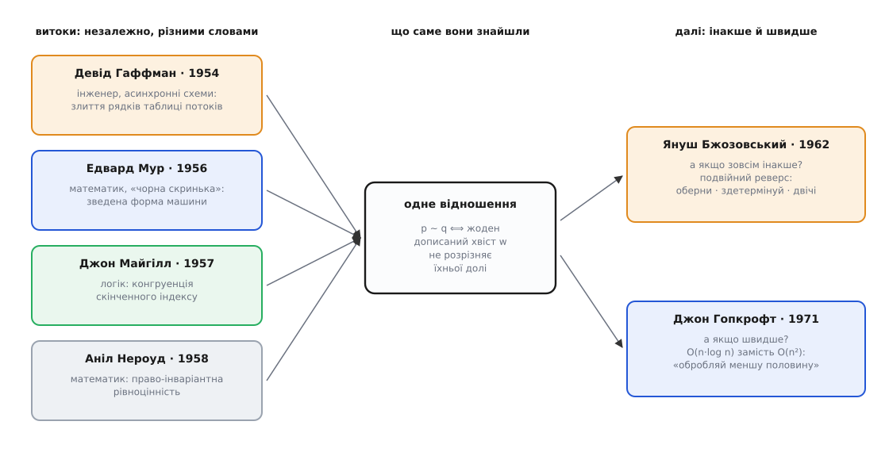

# 📜 Одна ідея, чотири дороги

Є винаходи з автором, датою й патентом — і є ідеї, до яких люди приходять юрбою. Кожен своєю дорогою, кожен своїми словами, і потім із подивом виявляють, що сусід уже стоїть на тому самому місці. Мінімізація автомата — саме з таких. Протягом одного десятиліття те саме відношення знайшли інженер, що рахував реле, математик, що допитував чорну скриньку, і двоє логіків, яких цікавило зовсім інше питання — де межа. Просто питання «коли два стани — це насправді один?» має одну-єдину відповідь, і хто його щиро поставить, той у неї й упреться.

Найцікавіше тут — не дати, а те, що майже ніхто з цих людей не збирався писати алгоритм мінімізації. Майже щоразу він вилазив збоку: як крок чужої процедури, як зауваження після доведення, як інструмент усередині статті про зовсім інше. Так виглядає ідея, що дозріла: її не шукають — на неї наступають.


*Чотири дороги до однієї точки. Ліворуч — витоки: інженер зливає рядки таблиці потоків, математик зводить машину до найпростішої форми, логіки шукають відношення на самих рядках. Слова різні, галузі різні, мотиви різні — а відношення одне. Праворуч — те, що з ним зробили пізніше: Бжозовський знайшов дорогу до нього зовсім збоку, Гопкрофт зробив шлях швидким.*

## Інженер, якому заважали зайві рядки

Почнімо з людини, яку ви знаєте з іншого приводу. Девід Гаффман (David Albert Huffman, 1925–1999) — той самий, чиє прізвище носить код Гаффмана. Історія того коду відома: професор в MIT запропонував студентам вибір — або звичайний іспит, або спроба поліпшити найкращий на той час алгоритм стиснення. Гаффман, тоді аспірант, вибрав друге, задачу розв'язав і надрукував результат 1952 року; кодові це подарувало його ім'я назавжди.

Але докторат Гаффмана був **не про це**. Він захистився в MIT 1953 року під керівництвом Семюела Колдвелла (Samuel H. Caldwell), і робота називалася «The Synthesis of Sequential Switching Circuits» — синтез послідовнісних перемикальних схем. Наступного року вона вийшла у *Journal of the Franklin Institute*, том 257 (1954), двома частинами: сторінки 161–190 і 275–303. За свідченнями, які переказують біографи, Гаффман пишався саме цією роботою більше, ніж кодом, що зробив його знаменитим, — і підстави мав.

> 🔧 **Навіщо це.** Гаффман працював не з абстракцією, а з залізом: [автомат у схемі](root:hw-digital/finite-state-machines) — це пам'ять стану плюс логіка переходів. У 1950-х пам'яттю були реле й лампи, і кожен зайвий стан коштував фізичних деталей, місця на панелі та ще однієї нагоди чомусь зламатися. «Зайвий рядок у таблиці» звучить як охайність; насправді це були гроші й надійність. Саме тому питання «а чи не описав я той самий стан двічі?» першим поставив саме інженер — його про це питав кошторис.

Гаффманів опис машини — **таблиця потоків** (*flow table*): рядок на стан, стовпець на вхідну комбінацію, у клітинах — куди перейти. Це та сама [машина зі станами й переходами](root:computability/finite-automata), тільки записана як бланк для складання схеми: стани — рядки, функція переходів — уміст клітин. І тут одразу впадає в око, що деякі рядки поводяться однаково: хоч що подай, вони ведуть в однакові місця з однаковими виходами. Тримати їх нарізно — просто дублювати обладнання. Тож у процедуру синтезу Гаффман уписав крок **злиття рядків**: перед тим як розкладати машину на схему, зведи таблицю до найменшої. Це і є мінімізація — тільки названа мовою людини, яка збирається паяти.

Тут потрібне уточнення, без якого історія стає надто гладенькою. Реальні інженерні таблиці потоків рідко заповнені до кінця: у них повно **неозначених** клітин — комбінацій, що фізично не трапляються, тож у них можна писати що завгодно. І щойно в таблиці з'являються такі прогалини, «однаковість» рядків перестає бути рівноцінністю: два рядки можуть бути **сумісні** (їх не заважає злити), при цьому кожен окремо сумісний із третім, а всі троє разом — уже ні. Сумісність не переходить по ланцюжку, а рівноцінність переходить, — і це не дрібниця, а розлам.

Марвін Полл і Стівен Унгер (Marvin C. Paull, Stephen H. Unger) сказали це прямо 1959 року в *IRE Transactions on Electronic Computers* (том EC-8, с. 356–367): задача зменшення числа рядків у неповно означеній таблиці «надзвичайно складна і в загальному випадку **не розв'язується жодним простим розширенням** методів для повністю означених функцій». Чим саме складна, стало ясно ще через чотирнадцять років: Чарльз Пфліґер (Charles P. Pfleeger) 1973 року в *IEEE Transactions on Computers* показав, що вона **поліноміально повна** — тодішній термін для того, що ми звемо NP-повнотою. Тобто акуратна, єдина, дешева відповідь, заради якої вся ця тема й існує, живе лише у **повністю означеному** світі. Варто впустити в таблицю дірки — і задача перестрибує в інший клас складності. Гаффманів крок злиття — про світ без дірок; світ із дірками виявився окремим і значно гіршим звіром.

## Математик, який допитував чорну скриньку

Тепер — інший бік, і інша людина. Едвард Мур (Edward Forrest Moore, 1925–2003) прийшов до автоматів звідусіль потроху: бакалаврат із хімії у Virginia Tech (1947), докторат із математики в Браунському університеті (1950), далі Іллінойс, а з 1952 по 1966 рік — Bell Labs. Його стаття «Gedanken-experiments on Sequential Machines» вийшла 1956 року у збірнику *Automata Studies* (Annals of Mathematics Studies № 34) за редакцією Клода Шеннона й Джона Маккарті, сторінки 129–153. Одноосібна — Шеннон із Маккарті були редакторами тому, а не співавторами.

І ця стаття **не про мінімізацію**. Мур починає так:

> Ця праця розглядає скінченні автомати з експериментального погляду. Це не означає, що вона звітує про результати експериментування на справжніх фізичних моделях; радше вона про те, яких висновків про внутрішній стан скінченної машини можна дійти з зовнішніх експериментів.

Слово він позичив у фізиків: Gedankenexperiment, уявний експеримент. Питання Мура — не «як зробити машину меншою», а «що взагалі можна дізнатися про машину, не заглядаючи всередину». Це питання розвідника, а не конструктора. І Мур цього не приховує: перший його приклад — **захоплений у ворога секретний пристрій**. Ви знаєте, що це підривник або шифрувальна машинка, але точний устрій треба з'ясувати. Мур незворушно зауважує, що пристрій може й вибухнути — тож експериментувати варто дистанційно; а сам вибух чудово вкладається в теорію як особливий «підірваний» стан, у який є вхід і з якого немає виходу. Стан-пастка, з якого не вибратися, тут — буквально пастка. Другий приклад — психіатр, який дає пацієнтові входи (переважно словесні) і дивиться на виходи.

Саме звідси в теорії з'явилася та сама **чорна скринька**. Мур накладає обмеження явно: експериментатору «не дозволено відкрити машину й подивитися на деталі»; у воєнному прикладі це відповідає пастці на розкриття, а взагалі — тому, що машини «є просто те, що інколи звуть *чорними скриньками*, описані через свої входи й виходи, а жодних відомостей про внутрішній устрій дістати не можна». Мур тут же в примітці відмежовує скінченні автомати від машин Тюрінга — у тих є нескінченна стрічка, тож поведінка складніша.

> 🔧 **Навіщо це.** Чорна скринька — не просто образ, а точна причина, чому мінімізація взагалі має сенс. Якщо машину дозволено розкрити, то стани розрізняються тривіально: вони в різних місцях схеми. Уся тема тримається на забороні заглядати всередину: два стани однакові тоді, коли їх не розрізнити **ззовні**, жодним входом. Мурове «артифіційне обмеження» — це і є означення того, що ми взагалі згодні вважати різницею.

І аж третім прикладом Мур згадує інженера — того самого, що вже описав машину списком станів і переходів:

> Якщо він виявить, наприклад, що не існує експериментального способу відрізнити його конструкцію від якоїсь машини з меншим числом станів, то він з тим самим успіхом може збудувати простішу машину.

Далі йдуть теореми. Теорема 4 будує **зведену форму** (*reduced form*) машини й доводить її **єдиність**. Теорема 5 каже: сильно зв'язна машина вже в зведеній формі тоді й лише тоді, коли будь-яка пара її станів розрізнима. А доведення спирається на те, що нерозрізнюваність — відношення рівноцінності, тож вона розбиває стани на класи.

Алгоритм же з'являється в найнесподіванішому місці — **як зауваження після доведення теореми 6**. Сама теорема про довжину експериментів:

```text
Теорема 6 (Мур, 1956): якщо в (n, m, p)-машині будь-які два стани
розрізнимі, то вони розрізнимі експериментом довжини n − 1.
```

Доводить Мур це так. Для кожного k він бере відношення R_k — «нерозрізнимі жодним експериментом довжини k» — і відповідне розбиття P_k. Кожне наступне уточнює попереднє. Ключ: якщо P_k ще не розсипалося на окремі стани, то P_{k+1} — **строго дрібніше** за P_k. Отже, кожен раунд обов'язково щось розколює, а розколювати скінченну множину можна лише скінченне число разів — звідси й межа n−1. І одразу після цього доведення Мур додає буденне речення, з якого й виріс увесь напрям:

> Наведене доведення підказує метод пошуку найкоротших експериментів для розрізнення будь-яких двох станів.

Далі — рецепт: спершу поділи стани за вихідним символом; потім рекурсивно будуй P_{k+1} з P_k; якщо два стани по тому самому вхідному символу переходять у **різні класи** P_k, розведи їх. Це рівно те, що сьогодні звуть алгоритмом Мура. Він не був метою статті. Він був побічним продуктом доведення про довжину допитів.

Варто згадати й дальшу долю сусідньої теореми 8 — вона обіцяла експеримент довжини n(n−1)/2, що визначає стан машини. Її межу дотиснув Анатолій Карацуба (1937–2008), тоді четвертокурсник механіко-математичного факультету Московського університету: він довів **точну** оцінку — і зверху, і знизу:

```text
Мур (1956):      довжина ≤ n(n−1)/2
Карацуба:        довжина ≤ (n−1)(n−2)/2 + 1  — і ця межа досяжна
```

Роботу подали до журналу «Успехи математических наук» 17 грудня 1958 року, надрукували в червні 1960-го; результат знають як теорему Мура-Карацуби. До швидкодії алгоритмів це стосунку не має — тут ідеться про довжину експерименту, а не про час обчислення, і жодного n·log n тут немає: обидві межі квадратичні. Але воно добре показує, як Мурова стаття розліталася на задачі, які підбирали по всьому світу.

## Зізнання в примітці

А тепер найкраще, заради чого цю історію взагалі варто розповідати. Зазвичай про незалежні відкриття доводиться судити з непрямих ознак: хто де публікувався, хто кого міг читати. Тут гадати не треба — **Мур сказав це сам**, у своїй-таки статті, просто посеред абзацу про інженера:

> Варто зауважити, що з цього інженерного погляду певні результати, які близько збігаються з частинами цієї праці (зокрема зведення, описане в теоремі 4), нещодавно **незалежно знайшов Д. А. Гаффман** у своїй дисертації з електротехніки (M.I.T.). Його результати мають вийти в *Journal of the Franklin Institute*.

І ще раз, окремо, у подяках наприкінці:

> Дещо перетинну працю д-ра Д. А. Гаффмана вже згадано, і її слід визнати **цілком незалежним внеском**. Автор хотів би особливо відзначити свій борг перед д-ром К. Е. Шенноном за кілька підказок, що привели до цієї роботи.

Прочитайте уважно час дієслова: «його результати **мають вийти**». Мур писав це тоді, коли Гаффманова стаття ще не була надрукована. Тобто дата 1956 на збірнику — це дата **публікації тому**, а не дата думки: сам текст складався десь у 1953–1954 роках, паралельно з Гаффмановим докторатом і до його виходу друком. Два чоловіки в різних закладах, з різних галузей, з несумісними мотивами — інженерний кошторис проти теорії допиту чорних скриньок — за той самий рік-два дійшли того самого зведення. І перший же з них, хто отримав нагоду сказати це вголос, чесно назвав другого незалежним.

Обидві праці невдовзі стали спільним ґрунтом. Уже 1955 року Джордж Мілі (George H. Mealy) у *Bell System Technical Journal* (том 34, с. 1045–1079) надрукував «A Method for Synthesizing Sequential Circuits», де теоретичну базу синтезу розвинуто **з прямим посиланням на праці Гаффмана й Мура** — тобто ще до того, як Мурів текст побачив друк, він уже ходив по руках і працював. Мілі тим самим заходом подарував світові автомат, чий вихід залежить і від стану, і від входу; але тут важливіше інше: за рік дві незалежні дороги вже злилися в одну звичну колію.

## Де тут межа: за справу беруться логіки

Гаффман і Мур відповіли на питання «які стани **цієї машини** насправді збігаються?». Це питання про машину. Наступний крок був тихіший, але глибший: перенести питання **з машини на мову**. Не «чи можна стиснути ось цю таблицю», а «скільки станів **взагалі** потрібно, щоб розпізнавати ось цю множину рядків?». Друге питання ставить межу, якої не обійде жодна конструкція, — а перше лише прибирає в конкретній кімнаті.

> Щоб відчути стрибок, тримайте в голові розрізнення [мова проти машини](root:computability/regular-languages): одну й ту саму мову розпізнає безліч різних автоматів, і всі вони — випадковості реалізації. Мова ж — те, що лишається, коли машину перебудували. Питання про мінімум має сенс лише тоді, коли його адресують мові, а не якійсь одній машині.

Джон Майгілл (John R. Myhill, 1923–1987) — британський математик, логік і філософ, який захистився в Гарварді 1949 року під керівництвом Вілларда Квайна (W. V. O. Quine), — виклав свій результат 1957 року в технічному звіті WADD TR-57-624 «Finite automata and the representation of events», с. 112–137. Аніл Нероуд (Anil Nerode, нар. 1932) — американський математик, який вступив до Чиказького університету в п'ятнадцять і захистився там 1956 року під керівництвом Сондерса Мак-Лейна (Saunders Mac Lane), — надрукував «Linear automaton transformations» у *Proceedings of the American Mathematical Society*, том 9, номер 4 (1958), с. 541–544; поряд стоїть і його звіт із Бертоном Зауером (Nerode, Sauer, «Fundamental Concepts in the Theory of Systems», WADC, листопад 1957).

Зверніть увагу, де це виходило. Не в математичних журналах — у **технічних звітах Wright Air Development Center**. Теорію найменшого автомата дописували, зокрема, за гроші військової авіації США: у 1950-х саме там був попит на те, щоб машини були малі, надійні й доказово правильні.

Найкращий свідок цього періоду — стаття Майкла Рабіна й Дани Скотта (Michael O. Rabin, Dana S. Scott) «Finite Automata and Their Decision Problems» в *IBM Journal of Research and Development*, том 3, номер 2 (квітень 1959), с. 114–125; рукопис у редакції — 8 серпня 1958-го, а основну частину роботи, як зазначено виноскою, зроблено влітку 1957 року в дослідному центрі IBM. За неї обидва отримали премію Тюрінга 1976 року. І от у ній обидва відношення стоять поруч, названі поіменно.

Спершу про Майгілла Рабін і Скотт кажуть таке:

> Дж. Р. Майгілл у неопублікованій праці подав нове опрацювання результатів Кліні, і саме це стало відправною точкою для досліджень цього звіту.

А далі друкують його теорему — з дозволу автора, бо власної публікації в неї ще не було: «Ця теорема належить Дж. Р. Майгіллу і друкується з його ласкавого дозволу». Теорема 1 (Майгілл) характеризує розпізнавані множини через **конгруенцію** скінченного індексу. Теорема 2 (Нероуд) — через **право-інваріантну рівноцінність** скінченного індексу. А одразу за нею стоїть речення, заради якого вся ця тема існує:

> **Наслідок 2.1.** Число класів рівноцінності за відношенням E є найменшим числом внутрішніх станів будь-якого автомата, що визначає U. Інакше кажучи, відношення E одразу дає найощадливіший автомат, що визначає U. Це зауваження теж належить Нероуду.

Ось тут і народилася **нижня межа**. Не «ми стиснули таблицю й вона перестала стискатися», а «стільки класів має мова — отже, менше станів не буває **в принципі**, хоч би що ви робили».

Чому імен два? Бо відношення справді різні, і різниця не косметична. Майгіллове — **конгруенція**, тобто інваріантна з обох боків: рівні рядки лишаються рівними, коли до них дописати щось і зліва, і справа. Нероудове — інваріантне лише **справа**: дописуємо тільки хвіст. Для найменшого автомата вистачає слабшого, право-інваріантного відношення — саме тому мінімальну машину дає Нероудова половина. Двобічна конгруенція Майгілла сильніша й веде далі, в алгебру мови. Тож подвійне ім'я — не данина ввічливості й не суперечка про першість, а чесна бухгалтерія: два різні відношення, обидва потрібні, обидва про одне.

Тут, до речі, «незалежність» слабша, ніж у пари Гаффман-Мур, і краще цього не прикрашати. Праця Майгілла тоді ходила в рукописах, Рабін зі Скоттом друкували її з дозволу, всі ці люди були в тісному колі й читали одне одного. Назва «теорема Майгілла-Нероуда» в їхніх власних текстах не трапляється — її склала пізніша література, зшивши докупи два сусідні результати. Це не збіг двох далеких голів, а радше дві половини однієї розмови, які згодом отримали спільну табличку.

## Той самий фокус, тільки навпаки

Наступна дійова особа заслуговує, щоб про неї спершу розповіли не як про алгоритм.

Януш Антоній Бжозовський (Janusz Antoni Brzozowski, у Канаді — John, 10 травня 1935, Варшава — 24 жовтня 2019) — **польсько-канадський** інформатик. Його батько, капітан Війська Польського, за даними родини й меморіального нарису Ватерлоо, потрапив у полон і загинув у Росії під час Другої світової. У квітні 1940-го Януша, його матір Марію й сестру Галину депортували до Казахстану. Вибратися вдалося 1942 року — з армією генерала Андерса, через Персію; далі роки біженства в Тегерані й Лівані, і аж 1949-го — Канада. Школа святого Михаїла в Торонто (1953), бакалаврат з електротехніки в Торонтському університеті (1957), магістратура (1959), докторат у Прінстоні (1962) під керівництвом Едварда Мак-Класкі (Edward J. McCluskey); дисертація — «Regular Expression Techniques for Sequential Circuits». Викладав в Оттаві й Берклі, а з 1967-го й далі понад півстоліття — у Ватерлоо, де двічі очолював кафедру. Близько двохсот публікацій, п'ятнадцять докторантів. Його правило, яке любили переказувати колеги: працюй над задачею, що тебе **захоплює**, а не над тією, що просто дасть більшу платню чи більший ґрант.

Ці подробиці тут не для зворушення: прізвище, вивезення до Казахстану й слово «автомати» разом легко злипаються в чуже «радянський науковець», а Бжозовський — поляк, вивезений тією державою, і канадець, який виріс і працював за океаном. Алгоритм, про який ідеться, народився в Прінстоні й прожив життя у Ватерлоо.

Стаття, про яку йдеться, називається «Canonical regular expressions and minimal state graphs for definite events». І з нею пов'язана невеличка бібліографічна плутанина, яку варто розплутати раз і назавжди: одні джерела датують її 1962 роком, інші 1963-м, і **обидва мають рацію**. Симпозіум із математичної теорії автоматів відбувся в Нью-Йорку у квітні 1962-го; том праць (с. 529–561) вийшов у Polytechnic Press Бруклінського політехнічного інституту 1963 року. Хто цитує доповідь — пише 1962; хто цитує том — 1963.

Тепер сам фокус. Погляньте на назву ще раз: **definite events** — визначені події, окремий вузький клас мов, де приналежність рядка залежить лише від кількох останніх символів. Стаття була про канонічні вирази для них. Мінімізація тут — знову **інструмент усередині чужої задачі**, а не мета. Утретє поспіль.

А сам прийом такий, що його хочеться перечитати двічі:

```text
оберни автомат  →  здетермінуй  →  оберни  →  здетермінуй
    A  ⟶  Aᴿ  ⟶  det(Aᴿ)  ⟶  (det(Aᴿ))ᴿ  ⟶  det((det(Aᴿ))ᴿ)  =  мінімальний DFA
```

Жодного розбиття. Жодних раундів уточнення. Жодного обчислення класів. Ви двічі виконуєте дві операції, які й так є в кожному підручнику, — і на виході **само собою** випадає мінімальний автомат.

Чому це працює, видно з одного спостереження — і воно варте того, щоб його простежити повільно.

Почніть із детермінованого автомата. Детермінованість означає, що кожен рядок веде рівно в один стан; отже, множини рядків, що приводять у **різні** стани, ніде не перетинаються — вони ділять усі можливі рядки на неперетинні пачки. Тепер оберніть машину. Те, що було «шляхом **до** стану q», стає «тим, що з q можна прочитати **далі**». Тобто в оберненій машині кожен стан має своє майбутнє, і ці майбутні в різних станів **не перетинаються** — просто тому, що не перетиналися минулі до обертання.

А далі спрацьовує арифметика множин. Побудова підмножин зліплює стани оберненої машини в підмножину S, і майбутнє цієї підмножини — це просто **об'єднання** тих неперетинних шматків. Але з об'єднання неперетинних шматків однозначно вичитується, які саме шматки в нього ввійшли. Тож різні підмножини мають різні майбутні — а це рівно й означає, що жодні два одержані стани не є нерозрізнюваними. Мінімальність виходить **безкоштовно**: уся робота, яку в Мура робить уточнення розбиття, тут уже зроблена всередині побудови підмножин.

Лишається зібрати. Перший прохід (обернути + здетермінувати) дає мінімальний автомат — але для **оберненої** мови. Другий такий самий прохід повертає мову на місце, і, за тим самим міркуванням, разом із нею повертає мінімальність.

Ціна теж чесна. Побудова підмножин може роздути машину експоненційно, тож у найгіршому разі метод Бжозовського працює експоненційний час — і саме тому він не витіснив уточнення розбиття. У сучасному огляді Берстеля, Буассона, Картона й Фаньйо його становище описано влучно: алгоритм Бжозовського «стоїть цілком осібно» й не належить ні до сімейства уточнення, ні до сімейства злиття; його найгірша поведінка експоненційна, зате він **концептуально простий**. Це рідкісний випадок, коли алгоритм лишається в підручниках не через швидкодію, а через красу доведення й те, що його можна записати в один рядок.

Останній штрих найкращий. 2014 року — **через п'ятдесят два роки** — Бжозовський разом із Гелліс Тамм (Hellis Tamm) надрукував «Theory of átomata» (*Theoretical Computer Science*, том 539, с. 13–27), де знайшов **точну** умову: детермінізація дає мінімальний DFA тоді й лише тоді, коли обернений автомат є атомним. Тобто людина повернулася до власного побічного результату піввіковою давнини й дописала до нього «тоді й лише тоді». Через п'ять років його не стало.

## А чи не можна швидше

Досі всі питали «як?» і «чому?». Питання «за скільки?» дозріло аж наприкінці 1960-х — разом із самою звичкою рахувати асимптотику алгоритмів, якої за часів Мура ще просто не було як окремої дисципліни.

Джон Гопкрофт (John Edward Hopcroft, нар. 7 жовтня 1939, Сіетл) — бакалавр Сіетлського університету (1961), доктор Стенфорда (1964, керівник Річард Меттсон), три роки в Прінстоні, а з 1967-го в Корнеллі. Премію Тюрінга він отримав 1986 року разом із Робертом Тар'яном — за «фундаментальні досягнення в проєктуванні й аналізі алгоритмів і структур даних». Робота, що нас цікавить, вийшла у січні 1971 року як стенфордський технічний звіт STAN-CS-71-190 «An n log n algorithm for minimizing states in a finite automaton»; остаточна версія — у збірнику *Theory of Machines and Computations* за редакцією Цві Кохаві й Азарії Паза (Academic Press, 1971, с. 189–196), працях міжнародного симпозіуму в Техніоні (Хайфа, 16–19 серпня 1971).

Гопкрофт формулює причину без дипломатії:

> Хоча більшість базових підручників зі скінченних автоматів подають алгоритми мінімізації станів, аналіз найгіршого випадку показує, що це n²-процеси, і для автоматів із великим числом станів такі алгоритми **вкрай неефективні**.

Зверніть увагу й на те, що стоїть у самій анотації: алгоритм подано «для мінімізації числа станів у скінченному автоматі **або для визначення, чи два скінченні автомати еквівалентні**». Дві задачі — одна робота; Гопкрофт це знав і звів їх разом уже в назві.

Ідея, що дає log n, коротка, але тонка. Наївне уточнення після кожного розколу сумлінно перепрощує **всі** блоки — і саме тому платить n². Гопкрофт помітив ось що: нехай блок B уже відпрацював як розділювач (спліттер), а потім сам розколовся на B₁ і B₂. Тоді далі досить узяти за розділювач **лише одну** з половин — будь-яку. Другу брати не треба не тому, що вона нічого не розрізняє, а тому, що її роботу вже виконано: те, що вона могла б розколоти, розколюють B і перша половина **разом**, бо B₁ і B₂ у сумі і є B.

А раз брати можна будь-яку — беріть **меншу**. Вигода з цього арифметична: стан потрапляє до розділювача лише тоді, коли блок, у якому він сидить, зменшився щонайменше вдвічі, а вдвічі зменшуватися можна лише log₂n разів:

```text
наївно (Мур):  кожен прохід O(n·|Σ|), проходів до n         →  O(n²·|Σ|)
Гопкрофт:      кожен стан у розділювачі ≤ log₂n + 1 разів   →  O(n·log n·|Σ|)
```

Ця «оброби меншу половину» — не фокус одного алгоритму, а прийом, що дарує log n у цілому сімействі задач із поділом.

Але найкраще в історії Гопкрофтового алгоритму — те, що сталося **після** публікації. Шість сторінок виявилися такими незручними для читання, що їх довелося переказувати наново — і не раз. Уже 1973 року Девід Ґріз (David Gries) надрукував у *Acta Informatica* (том 2, с. 97–109) статтю з промовистою назвою «Describing an algorithm by Hopcroft» — «Описуючи алгоритм Гопкрофта». Ґріз чесно зізнався, що головна причина статті — показати, **як узагалі варто пояснювати алгоритм іншим**, згори вниз і структуровано; заразом він трохи скоротив сам алгоритм, відповідно ускладнивши доведення оцінки часу. Через двадцять вісім років Тімо Кнуутіла (Timo Knuutila) надрукував у *Theoretical Computer Science* статтю «Re-describing an algorithm by Hopcroft» — «**Пере**описуючи алгоритм Гопкрофта». Потім Жан Берстель і Олів'є Картон розбиралися з його складністю (2004), потім вийшло «Around Hopcroft's algorithm» (2006)…

Тобто півстоліття кращі люди галузі по черзі пояснювали одне одному шість сторінок. Причина не в тому, що Гопкрофт погано пише. Причина в тому, що його алгоритм **недовизначений навмисно**: він не каже, який саме блок брати за розділювач наступним, — і різні відповіді дають різні прогони, всі правильні, всі в межах O(n·log n), але з різною поведінкою. Довести оцінку, яка тримається за **будь-якого** вибору, — важче, ніж описати процедуру. І за всі ці роки нічого швидшого в загальному випадку не знайшли: у згаданому огляді Берстеля та співавторів алгоритм Гопкрофта досі значиться як «найефективніший відомий у загальному випадку».

## Чому всі вони приходили в одне місце

Зберімо докупи. Інженер зливав рядки таблиці, щоб зекономити реле. Математик допитував чорну скриньку й між ділом довів, що зведена форма єдина. Логіки шукали, чим характеризується мова, і знайшли нижню межу. Поляк, якого дитиною вивезли до Казахстану, а вивчився він у Прінстоні, дістав ту саму машину, двічі обернувши автомат. Американець, що згодом отримав премію Тюрінга, зробив дорогу до неї швидкою.

Різні мови опису, різні мотиви, жодної змови. Пояснення просте, і воно не про геніальність: **відношення нерозрізнюваності ніхто не вигадав**. Його й не можна було вигадати інакше — воно однозначно випливає з питання. Щойно ви погодилися, що машина — чорна скринька і що різницю між станами видно лише ззовні, «однаковість станів» уже визначена, і свободи щодо неї у вас немає. Гаффман, Мур, Майгілл і Нероуд не придумували кожен свій варіант — вони натрапляли на єдиний наявний і різнилися тільки словами, якими його записали, та цілями, задля яких прийшли.

Тому й питати «хто перший?» тут майже нецікаво — цікавіше розкласти внески за родом, бо вони різні:

- **Гаффман (1954)** — крок злиття всередині процедури синтезу схем: перший, хто зробив це **задля діла**, у робочому інженерному конвеєрі.
- **Мілі (1955)** — перший, хто стояв на обох і звів їх в одну колію.
- **Мур (1956)** — зведена форма, доведення її **єдиності** і — зауваженням після доведення — процедура уточнення розбиття; він же, першим отримавши нагоду, засвідчив незалежність Гаффмана.
- **Майгілл (1957) і Нероуд (1958)** — перенесення питання з машини на **мову** й **нижня межа**: не «ця таблиця не стискається», а «менше неможливо».
- **Рабін і Скотт (1959)** — ті, хто поставив обидва відношення поруч, назвав імена й надрукував Майгіллове з дозволу; без їхньої статті ця історія була б куди темнішою.
- **Бжозовський (1962/63)** — доказ, що до тієї самої точки є дорога **зовсім з іншого боку**, без жодного розбиття.
- **Гопкрофт (1971)** — не нове знання, а нова **ціна**: O(n·log n) замість O(n²).

І остання деталь, що прошиває всю історію наскрізь. Гаффманів алгоритм — крок чужої процедури. Мурів — зауваження після доведення про довжину допитів. Бжозовського — інструмент у статті про визначені події. Троє з них не збиралися робити те, чим уславилися: вони йшли повз. Лише Гопкрофт цілив просто в мішень — але на той час вона вже п'ятнадцять років стояла на видноті, і поставили її ті, хто йшов повз.

Зазвичай ми уявляємо відкриття як влучний постріл. Тут же вийшло навпаки: спершу четверо людей, кожен у своїй справі, протоптали стежку до одного місця, ще не знаючи, що місце одне, — і аж потім прийшов той, хто цю стежку заасфальтував.
