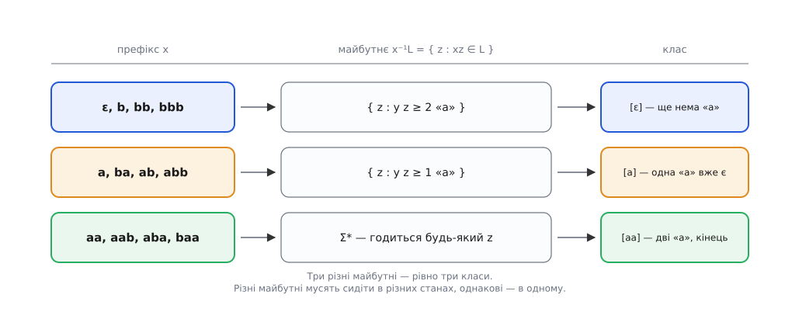
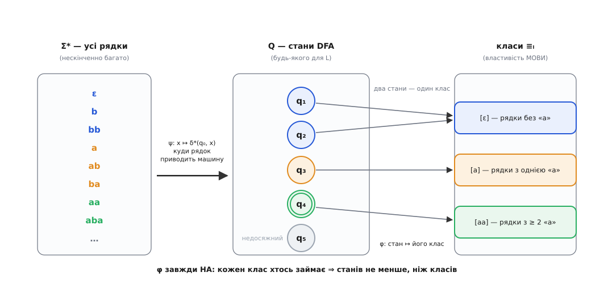
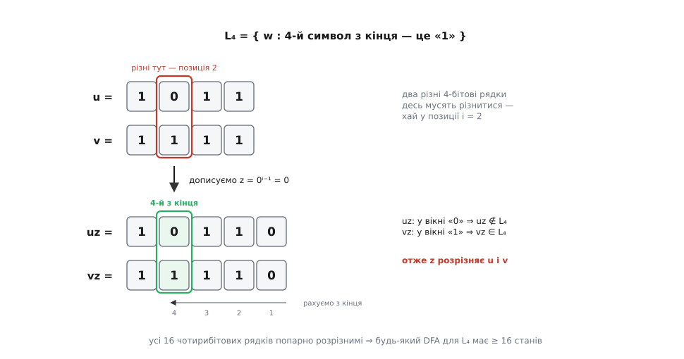

# 🧮 Відношення Майгілла-Нероуда: межа, яку задає сама мова

## Кільце, яке треба розірвати

Нерозрізнюваність станів — інструмент чудовий, але в нього вбудована пастка. Він говорить про стани **конкретної машини**: дали автомат — він скаже, які кружечки в ньому зайві. А питання «чи існує взагалі менша машина?» цим апаратом не береться. Щоб на нього відповісти, довелося б перебрати **всі** автомати для цієї мови — а їх нескінченно багато.

Отже, потрібне поняття, яке автоматів **узагалі не згадує**: властивість самої мови. Тоді твердження «менше не буває» перестане залежати від того, з якої машини ми почали, — бо машини в ньому не буде.

Хід Майгілла й Нероуда простий до нахабства: перенести нерозрізнюваність зі **станів** на **рядки**.

## Майбутнє префікса

Уявіть, що машина прочитала префікс x і спинилася перевести дух. Що з прочитаного їй ще знадобиться? Рівно одне: **які продовження доведуть до приймання**. Усе інше — довжина x, порядок літер у ньому, скільки разів машина крутилася на місці — після цієї миті не важить ніяк.

Зберімо ці продовження в одну множину:

```
x⁻¹L = { z ∈ Σ* : xz ∈ L }
```

Це **ліва частка** (англ. *left quotient* — ліва частка) мови L за префіксом x. Називатимемо її **майбутнім префікса x**: так видніше, що вона значить.

Тепер справа стає прозорою. Автомат — це пам'ять. Прочитавши x, він тримає якийсь стан, і цей стан — усе, що він **пам'ятає** про x. Скільки ж пам'яті насправді треба? Рівно стільки, щоб знати x⁻¹L. Не більше: якщо два префікси мають однакове майбутнє, то пам'ятати, котрий із них трапився, — марнота, бо це знання ніде далі не спрацює. І не менше: якщо майбутні різні, то забути різницю — смертельно, бо існує продовження, на якому ці префікси розходяться, а машині вже не буде чим їх розвести.

> 🔧 **Навіщо це.** Ось звідки береться відчуття «автомат мусить це пам'ятати». Коли ви прикидаєте, скільки станів потрібно розбирачеві кадру чи рукостисканню протоколу, ви насправді питаєте: **скільки різних майбутніх** буває в уже прочитаного шматка. Порахували майбутні — дістали точну потребу в пам'яті, ще не намалювавши жодного кружечка й не обравши мови реалізації.

Погляньмо на мову «рядки над {a, b}, де a трапляється щонайменше двічі». Майбутніх у неї виявляється тільки три, хоч префіксів — нескінченно:


*Кожен префікс тягне за собою множину продовжень, які доводять до приймання. Префікси ε, b, bb нічим не відрізняються: усім їм для приймання потрібні дві «a» попереду. Префіксам a, ba, ab вистачить однієї. А після aa справу вже зроблено — годиться будь-яке продовження, зокрема порожнє. Різних майбутніх рівно три, скільки б префіксів ми не перебирали далі.*

## Означення

Тепер це можна записати як відношення на рядках:

```
x ≡ₗ y   ⟺   ∀z ∈ Σ*:  ( xz ∈ L  ⟺  yz ∈ L )
```

Рядок z, на якому рівносильність ламається — тобто рівно один із xz, yz лежить у L, — називають **розрізняльним продовженням** (англ. *distinguishing extension*). Через майбутні те саме коротше:

```
x ≡ₗ y   ⟺   x⁻¹L = y⁻¹L
```

Два зауваження, і обидва важать більше, ніж здається на вигляд.

Перше: в означенні **немає автомата**. Ні станів, ні переходів, ні δ — лише мова L і рядки. Саме тому висновки з нього стосуватимуться **всіх** машин одразу, а не тієї, яку нам дали.

Друге: L тут — **будь-яка** мова, не конче регулярна. Означення однаково працює для {aⁿbⁿ}, для мови простих чисел у двійковому записі, для чого завгодно. Просто для нерегулярних мов класів виявиться нескінченно багато — і в цьому вся сіль.

## Чому це еквівалентність — і чому це не три перевірки

Формально належить показати три властивості, і кожна займає рядок:

- **рефлексивність:** x⁻¹L = x⁻¹L;
- **симетричність:** рівність множин симетрична;
- **транзитивність:** з x⁻¹L = y⁻¹L і y⁻¹L = w⁻¹L випливає x⁻¹L = w⁻¹L.

Але за цією рутиною ховається причина, варта того, щоб її побачити. Відношення ≡ₗ — це **ядро відображення** x ↦ x⁻¹L, тобто «мати однакове значення функції». А «однакове значення» — еквівалентність **завжди**, хай яка функція: рівність значень успадковує всі три властивості від самої рівності, задарма. Перевіряти тут по суті нема чого — три пункти вище є данина формі, а не роботою.

Отже, ≡ₗ ріже Σ* на класи. Клас [x] — усі рядки з тим самим майбутнім, що й у x. Число класів звуть **індексом** мови (лат. *index* — покажчик) і позначають index(L). Він або скінченний, або ні; третього не дано.

## Права конгруентність — те, без чого нічого не збереться

Одна властивість ≡ₗ стоїть окремо від решти: без неї автомата не побудуєш.

```
якщо  x ≡ₗ y,  то  xa ≡ₗ ya   для кожної літери a ∈ Σ
```

Доведення від протилежного вміщується в речення. Хай xa ≢ₗ ya — тоді існує z, що їх розрізняє: рівно один із xaz, yaz лежить у L. Але ж xaz = x·(az), а yaz = y·(az). Виходить, рядок az розрізняє x і y — а це заперечує x ≡ₗ y. ∎

Індукцією по довжині це поширюється з однієї літери на цілий рядок: x ≡ₗ y ⟹ xw ≡ₗ yw для будь-якого w.

Відношення з такою властивістю звуть **правою конгруентністю** (лат. *congruens* — узгоджений): дописування справа не руйнує еквівалентності. Мовою класів це читається так: **[xa] залежить тільки від [x] і від a**, а не від того, якого саме представника x ми витягли з класу. Тримайте цю фразу в голові — за хвилину саме вона зробить автомат можливим.

Зліва, до речі, так не працює, і це не дрібниця. Візьмімо Σ = {a, b} і мову L = {ab} — рівно один рядок. Майбутнє в b порожнє (з рядка, що почався на b, вже нічим не врятуватися), і в aa теж порожнє. Отже b ≡ₗ aa. А тепер допишімо «a» **зліва**: майбутнє в ab — це {ε}, бо ab вже і є шуканий рядок; майбутнє в aaa — так само порожнє. Тобто ab ≢ₗ aaa. Приписування зліва еквівалентність зламало.

Причина повчальна: b і aa **приречені однаково**, але приречені **по-різному**. Обидва вже не врятувати справа — проте b ще можна врятувати зліва (a·b = ab), а aa не можна ніяк. Правому відношенню ця різниця не видна, бо воно дивиться тільки вперед. Запам'ятаймо цю мову — вона ще стане в пригоді.

## Теорема

> **Мова L регулярна ⟺ index(L) скінченний. І тоді число станів найменшого DFA дорівнює рівно index(L).**

Регулярна мова — це така, яку розпізнає бодай якийсь скінченний автомат (рівносильно — яку задає регулярний вираз); теорема характеризує саме цей клас, [не згадуючи машин](root:computability/regular-languages). Доводити треба два напрями, і кожен дає своє: перший — нижню межу, другий — те, що межа досяжна.

### Є машина ⟹ індекс скінченний. І звідси ж — межа

Хай M = ⟨Q, Σ, δ, q₀, F⟩ — **будь-який** DFA, для якого L(M) = L. Візьмімо [розширену функцію переходів δ*](root:computability/finite-automata), що веде машину зі стану через цілий рядок, і побудуймо відображення

```
ψ(x) = δ*(q₀, x)     — стан, у якому машина опиняється, прочитавши x
```

Ключове спостереження:

```
ψ(x) = ψ(y)   ⟹   x ≡ₗ y
```

Чому — видно одразу. Для будь-якого z

```
δ*(q₀, xz) = δ*( ψ(x), z ) = δ*( ψ(y), z ) = δ*(q₀, yz)
```

Обидва запуски після свого префікса продовжуються з **того самого** стану, тож і закінчуються однаково. Отже xz ∈ L ⟺ yz ∈ L. ∎

Прочитаймо це повільно, бо тут уся суть. Кожен стан **лежить усередині одного класу** — не навпаки. Стан не може «розтягтися» на два класи: усі рядки, що ведуть у нього, приречені мати спільне майбутнє. А що кожен рядок кудись та приводить, то й кожен клас має принаймні один стан, у який його рядки потрапляють. Звідси

```
index(L) ≤ число досяжних станів M ≤ |Q|
```

Індекс скінченний — бо |Q| скінченне. Але це той самий рядок, що дає **нижню межу**: нерівність виконується для **кожного** DFA, який розпізнає L. Не для вдалого, не для мінімізованого — для кожного. index(L) — це підлога під усіма ними одразу.


*Ліворуч — усі рядки, посередині — стани якогось автомата для L, праворуч — класи ≡ₗ. Відображення ψ веде рядок у стан, куди той приводить машину; φ веде стан у клас тих рядків, що в нього ведуть. φ визначене коректно (рядки одного стану лежать в одному класі) і завжди сюр'єктивне — кожен клас хтось займає. Тому станів не буває менше, ніж класів. Видно й два способи бути завеликим: стан q₅, у який не веде жоден рядок, і пара q₁, q₂, яку φ склеює в один клас.*

### Індекс скінченний ⟹ є машина. Канонічний автомат

Тепер навпаки: маємо скінченний індекс і **будуємо** машину прямо з класів. Стани — це класи, і більше нічого:

```
Q_L  = { [x] : x ∈ Σ* }        — класи ≡ₗ (їх скінченно за припущенням)
q₀_L = [ε]                      — клас порожнього рядка
δ_L([x], a) = [xa]              — прочитали a — перейшли в клас продовженого рядка
F_L  = { [x] : x ∈ L }          — класи, складені з рядків мови
```

Тут два місця, де конструкція могла б розсипатися, — і саме вони роблять теорему теоремою.

**Чи δ_L взагалі функція?** Запис «δ_L([x], a) = [xa]» визначає результат через **представника** x. Візьміть іншого представника y з того самого класу — результат зобов'язаний збігтися, інакше це не функція, а лотерея. Потрібно: [x] = [y] ⟹ [xa] = [ya]. Це **дослівно** права конгруентність, доведена вище. Ось навіщо вона була: алгебра тут не оздоба, а те, завдяки чому машина взагалі існує.

**Чи F_L взагалі складається з класів?** Так само. Якщо [x] = [y] і x ∈ L, чи буде y ∈ L? Підставте в означення ≡ₗ рядок z = ε: воно каже, що x·ε ∈ L ⟺ y·ε ∈ L, тобто x ∈ L ⟺ y ∈ L. Отже приналежність до L **стала на класі**: клас або цілком усередині L, або цілком поза ним. Розколотих класів не буває, тож F_L зібране коректно.

Далі — робоча лема, [індукцією](root:math-logic/mathematical-induction) по довжині рядка:

```
δ*_L([ε], w) = [w]      для кожного w ∈ Σ*
```

- **база**, |w| = 0: δ*_L([ε], ε) = [ε] = [w]. ✓
- **крок**, w = ua (теза для u вже є):

```
δ*_L([ε], ua) = δ_L( δ*_L([ε], u), a )   — означення δ*
              = δ_L( [u], a )             — припущення індукції
              = [ua]                      — означення δ_L
```

∎

Звідси випадає все одразу: машина приймає w ⟺ δ*_L([ε], w) = [w] ∈ F_L ⟺ w ∈ L. Тобто L(M_L) = L, і станів у M_L рівно index(L). Дрібниця, яка знадобиться далі: недосяжних станів у M_L немає **за побудовою** — у клас [x] заводить сам рядок x.

Складімо два напрями:

```
кожен DFA для L:      |Q| ≥ index(L)         — перший напрям
канонічний M_L:       |Q| = index(L)         — другий напрям
──────────────────────────────────────────
найменше можливе число станів = index(L)     ТОЧНО
```

Не «приблизно», не «десь близько» — рівність. Причому index(L) рахують, **не маючи жодної машини**: він живе в самій мові.

## Як цим користуються: набір-обманка

Вигода з цього миттєва. Щоб довести «жоден DFA для L не має менше ніж k станів», не треба ні мінімального автомата, ні всіх класів. Досить пред'явити **k рядків, попарно нееквівалентних**: кожен сидить у своєму класі, отже класів щонайменше k, отже станів щонайменше k. Такий набір звуть **набором-обманкою** (англ. *fooling set*).

Приклад, від якого стає ніяково:

```
Lₙ = { w ∈ {0,1}* : n-й символ з кінця дорівнює «1» }
```

Недетермінований автомат для неї дістається майже задарма — n+1 станів: крутися на початку скільки завгодно, вгадай ту саму «1», відлічи n−1 символів і опинися в кінці. А детермінований?

Візьмімо **всі** 2ⁿ рядків завдовжки n і покажімо, що вони попарно розрізнимі. Хай u ≠ v — два такі рядки; десь вони мусять різнитися, скажімо в i-й позиції зліва. Допишімо z = 0ⁱ⁻¹. Довжина uz — це n+i−1, тож n-й символ **з кінця** сидить у позиції (n+i−1) − n + 1 = i зліва. Дописування z **підсунуло** саме ту позицію, де u і v розходяться, точно під приціл мови. Один із них має там «1», другий «0» — отже рівно один із uz, vz лежить у Lₙ. Розрізнили. ∎


*Хитрість набору-обманки для L₄. Рядки u = 1011 і v = 1111 різняться у 2-й позиції. Дописуємо один нуль — і рядки видовжуються рівно так, щоб 2-га позиція зліва стала 4-ю з кінця, тобто саме тією, на яку дивиться мова. Тепер uz відкинуто, а vz прийнято: рядок z їх розвів. Той самий трюк працює для будь-якої пари, тож усі 16 чотирибітових рядків попарно розрізнимі — а отже сидять у 16 різних класах.*

Виходить, index(Lₙ) ≥ 2ⁿ, а отже **будь-який** DFA для Lₙ має щонайменше 2ⁿ станів. Межа ще й досяжна: автомат, що тримає в стані останні n прочитаних символів (коротший вхід доповнюємо нулями зліва), має рівно 2ⁿ станів і розпізнає Lₙ. Отже index(Lₙ) = 2ⁿ **точно**.

І ось що з цього справді випливає. Роздування при детермінізації — не гріх ледачого алгоритму й не привід шукати кращий: для Lₙ воно **неминуче**. Мінімізації тут нічого стискати, бо стискати нема чого — n+1 станів недетермінованої машини й 2ⁿ детермінованої розділяє не недбальство, а сама мова. Відношення Майгілла-Нероуда — це те, що дозволяє відрізнити «мій автомат роздутий» від «ця мова просто така», не витративши місяць на пошуки неіснуючого поліпшення.

## Єдиність — з точністю до перейменування

Теорема дала розмір. Лишилося найцікавіше: найменший автомат не просто має правильний розмір — він **один**.

Хай M — будь-який DFA для L, у якого рівно index(L) станів.

Спершу дрібниця, що виявиться не дрібницею: **усі стани M досяжні**. Бо якби якийсь був недосяжний, ми б його викинули — мова б не змінилася, — і дістали DFA для L із меншим за index(L) числом станів. А це заборонено нижньою межею. Отже мінімальність **сама** тягне досяжність; окремо припускати її не треба.

Тепер будуємо відображення φ: Q → Q_L:

```
φ(q) = [x],   де x — будь-який рядок із ψ(x) = q
```

Перевіримо його по пунктах — кожен займає рядок, а разом вони дають ізоморфізм.

- **Існує.** Такий x знайдеться для кожного q — стани ж досяжні.
- **Однозначне.** Якщо ψ(x) = ψ(y) = q, то x ≡ₗ y (перший напрям теореми), тобто [x] = [y]. Вибір представника нічого не міняє.
- **Сюр'єктивне.** Клас [x] — це φ(ψ(x)). Жоден клас не лишається без стану.
- **Бієктивне.** |Q| = |Q_L| = index(L), обидві множини скінченні, φ — на. А сюр'єкція між скінченними множинами однакового розміру є бієкцією.
- **Береже старт.** ψ(ε) = q₀, тож φ(q₀) = [ε] = q₀_L.
- **Береже переходи.** Хай ψ(x) = q. Тоді ψ(xa) = δ(q, a), а отже

```
φ( δ(q, a) ) = [xa] = δ_L( [x], a ) = δ_L( φ(q), a )
```

- **Береже приймання.** Хай ψ(x) = q. Тоді q ∈ F ⟺ x ∈ L ⟺ [x] ∈ F_L ⟺ φ(q) ∈ F_L.

Це і є **ізоморфізм** (гр. *ísos* — рівний, *morphḗ* — форма): бієкція станів, узгоджена зі стартом, переходами й прийманням. Інакше кажучи, M — це M_L, у якому стани **перейменовано**. Хоч би з якого роздутого автомата ви стартували, хоч би яким алгоритмом мінімізували — на виході та сама машина з точністю до підписів на кружечках. ∎

Варто помітити, чого це доведення **не** каже. Воно наскрізь спирається на детермінованість: ψ — функція, «рядок → рівно один стан», і саме тому φ склеюється. Для недетермінованої машини ψ дає **множину** станів, уся конструкція розсипається на першому ж кроці — і жодної канонічної найменшої форми не лишається.

## Чому кроків прибирання рівно два

Тепер видно, чому розбивка станів на класи — не хитрий трюк, а єдине, що взагалі можна зробити.

Візьмімо будь-який DFA M для L. Його стани поділяються надвоє тривіально:

```
|Q| − index(L)  =  |недосяжні|  +  ( |досяжні| − index(L) )
                    └─ марнота 1 ┘    └────── марнота 2 ──────┘
```

Сама рівність — шкільна арифметика. Нетривіальне те, що **обидва доданки невід'ємні**, і кожен має ім'я.

Другий невід'ємний, бо досяжна частина M — це сама по собі DFA для L (викидання недосяжних мови не міняє), тож до неї застосовна нижня межа: |досяжні| ≥ index(L). А нуль він тоді й лише тоді, коли φ на досяжних станах ще й **ін'єктивне** — бо сюр'єктивним воно є завжди, і бієкцією стає рівно тоді, коли жодних двох станів воно не склеює.

Отже:

- **марнота 1** — стани, у які не веде жоден рядок. φ про них навіть не говорить: їм нема що зіставити;
- **марнота 2** — досяжні стани, які φ **склеює**: різні кружечки, той самий клас. Тобто нерозрізнювані.

Зникають обидві — і |Q| = index(L), автомат мінімальний. Ось чому рецепт «прибрати недосяжні, злити нерозрізнювані» **повний**, а не просто вдалий: третього способу бути завеликим у DFA не існує. Не тому, що ніхто не придумав, — його не існує, бо доданків у рівності два.

І ще одне зчеплення, тонше. Нерозрізнюваність **станів** і еквівалентність **рядків** — це не дві схожі ідеї, а одна:

```
p ~ q  (досяжні стани)   ⟺   φ(p) = φ(q)   ⟺   x ≡ₗ y,   де ψ(x) = p, ψ(y) = q
```

Розгорнімо середину. φ(p) = φ(q) значить x ≡ₗ y, тобто ∀z: xz ∈ L ⟺ yz ∈ L. Але xz веде машину в δ*(p, z), а yz — у δ*(q, z). Тож умова читається так: ∀z: δ*(p, z) ∈ F ⟺ δ*(q, z) ∈ F — а це дослівно означення нерозрізнюваності станів p і q.

Отже класи станів — це **тінь** класів рядків на машині: клас стану є клас тих рядків, що в нього приводять. Розбивка станів рахує ≡ₗ, ані разу не згадавши рядків, — і має на це повне право, бо на досяжній машині ці дві розбивки збігаються.

## Чому скінченний перебір чесний щодо нескінченного означення

Лишилася остання дивовижа. Означення ≡ₗ пробігає по **нескінченній** множині продовжень z. Уточнення розбиття робить **скінченне** число проходів. Звідки певність, що воно не проґавило якогось довжелезного z, який ще розвів би пару станів?

Розгляньмо наближення — нерозрізнюваність «до довжини k»:

```
p ~ₖ q   ⟺   ∀w, |w| ≤ k:  ( δ*(p, w) ∈ F  ⟺  δ*(q, w) ∈ F )
```

Тут ~₀ — це «обидва приймальні або обидва ні», тобто стартовий поділ. Справжня нерозрізнюваність ~ — це перетин **усіх** ~ₖ. А кожне наступне рахується з попереднього, без жодної нескінченності:

```
p ~ₖ₊₁ q   ⟺   p ~₀ q   і   ∀a ∈ Σ:  δ(p, a) ~ₖ δ(q, a)
```

(бо рядок завдовжки ≤ k+1 — це або ε, або a·w' з |w'| ≤ k, а δ*(p, aw') = δ*( δ(p,a), w' ) — тобто після першої літери лишається та сама задача, на одиницю коротша). Це і є один прохід уточнення.

А тепер вирішальне: **щойно ~ₖ = ~ₖ₊₁, ланцюг завмер назавжди**. Бо ~ₖ₊₂ рахується з ~ₖ₊₁ тією самою формулою, якою ~ₖ₊₁ рахувалося з ~ₖ; однакові входи дають однакові виходи. Отже ~ₖ = ~ⱼ для всіх j > k, а значить ~ₖ і є ~.

І завмерти воно **мусить**: кожен нетривіальний прохід додає щонайменше один блок, а блоків у скінченній множині станів не більше n. Нескінченний перетин в означенні виявляється скінченним не з ласки долі, а тому, що ланцюг розбиттів скінченної множини не може дробитися вічно.

Ось де ховається чесність алгоритму. Він не перебирає нескінченність — він користується тим, що нескінченність **тут** нічого нового не додає.

## Дві родички, і котра з них чия

Наостанок — про назву, бо в ній сховано математичну відмінність, а не самі лише два прізвища.

Відношення, з яким ми щойно працювали, — **праве**: дописуємо тільки справа. Але є й двобічне:

```
x ≡ₗ y   ⟺   ∀z ∈ Σ*:      ( xz ∈ L   ⟺  yz ∈ L )      — Нероудове, праве
x ≈ₗ y   ⟺   ∀u, v ∈ Σ*:  ( uxv ∈ L  ⟺  uyv ∈ L )      — Майгіллове, двобічне
```

Друге **дрібніше** за перше: підставте u = ε — і двобічна умова перетворюється на праву, тож x ≈ₗ y ⟹ x ≡ₗ y. Класи ≈ₗ подрібнюють класи ≡ₗ, і індекс у Майгіллового не менший.

Будують вони різне. З Нероудового виростає **мінімальний DFA** — ми щойно його склали. З Майгіллового — **синтаксичний моноїд** мови; двобічність потрібна саме на те, щоб класи можна було **перемножувати**: рівність [x]·[y] = [xy] має бути коректною, а це вимагає узгодженості з обох боків, не з одного. Обидва індекси скінченні тоді й лише тоді, коли L регулярна, — але це різні об'єкти й різного розміру.

Різницю видно на тій самій мові L = {ab}, що вже показала нам асиметрію лівого й правого:

```
Нероудові класи (за майбутнім x⁻¹L):
  [ε]   → {ab}          [a]   → {b}
  [ab]  → {ε}           [решта: b, aa, ba, bb, …] → ∅
  index ≡ₗ = 4          мінімальний DFA має 4 стани (разом із мертвим)

Майгіллові класи (за наборами контекстів (u,v), де uxv = ab):
  [ε]   → {(ε,ab), (a,b), (ab,ε)}      [a]   → {(ε,b)}
  [b]   → {(a,ε)}                       [ab]  → {(ε,ε)}
  [решта: aa, ba, bb, …] → ∅
  index ≈ₗ = 5          синтаксичний моноїд має 5 елементів
```

Чотири проти п'яти — і розходяться вони рівно там, де ми вже дивилися. Рядки b і aa мають те саме майбутнє (порожнє: обидва вже не врятувати справа), тож Нероуд зливає їх в один клас. Але контексти в них різні — b добудовується до ab зліва, aa не добудовується ніяк, — тож Майгілл їх розводить. Права нерозрізнюваність питає «що попереду?», двобічна — «що попереду й позаду?», і другого питання мінімальному автоматові просто не треба.

Тепер про людей — коротко й точно.

**Джон Майгілл** (John Myhill, 11.08.1923 — 15.02.1987) — британський математик, логік і філософ, народжений у Бірмінгемі; бакалаврат — Кембридж (1944), докторат — Гарвард (1949) під керівництвом Вілларда Ван Ормана Квайна. Його текст «Finite automata and the representation of events» — це розділ 5 звіту «Fundamental Concepts in the Theory of Systems» (WADC Technical Report 57-624, база ВПС Райт-Паттерсон, 1957). Основна маса його доробку лежить деінде: теорія рекурсивних функцій, теорія множин, конструктивна математика.

**Аніл Нероуд** (Anil Nerode, нар. 4.06.1932) — американський математик, народжений у Лос-Анджелесі, бенгальського походження по батькові (Нірад Ранджан Рой Чоудгурі, знаний як Сри Нероуд; прізвище родина змінила офіційно). Докторат — Чиказький університет (1956) під керівництвом Сондерса Мак-Лейна; від 1959 року й донині — у Корнельському університеті. Стаття «Linear automaton transformations» вийшла в Proceedings of the American Mathematical Society, том 9, № 4 (1958), с. 541–544.

**Статус доказовості.** Дати, тексти й вихідні дані — **усталено**: звіряються за самими публікаціями. Парна назва «теорема Майгілла-Нероуда» — пізніша конвенція, не самоназва авторів. А от що обидва дійшли до неї **незалежно** — це **усталена оповідь, а не задокументований факт**: обидва тексти постали в одному вузькому колі досліджень 1957–58 років, а Майгіллів — усередині збірного звіту ВПС США, тож про цілковиту ізоляцію говорити важко. Хто що саме зробив, точніше за назву передає сама математика: **праве** відношення й мінімальний автомат тягнуться від Нероуда, **двобічне** й моноїд — від Майгілла. Назва злила їх докупи; означення — розводять.
