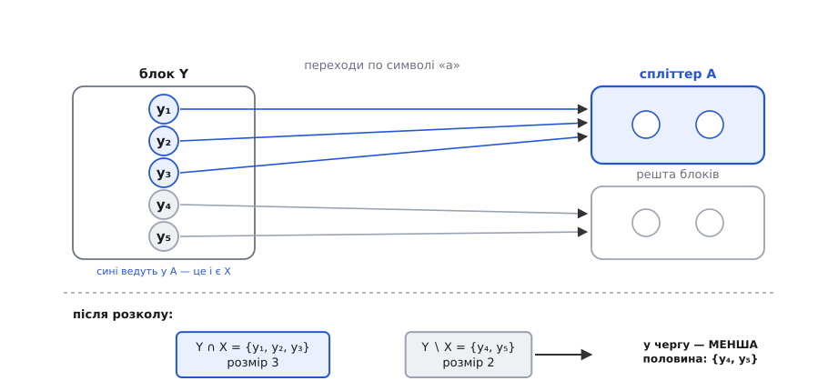
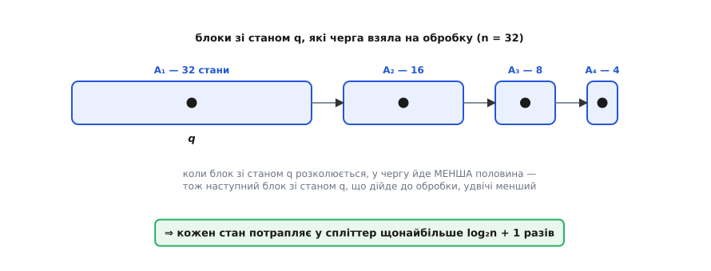

# ⚙️ Мінімізація DFA у коді: Мур, Гопкрофт і трюк меншої половини

Ідея уточнення розбиття вміщається в абзац, і від цього легко повірити, ніби реалізація — формальність. Насправді між ідеєю та інструментом, якому можна довірити таблицю переходів, лежать дві речі, про які сама ідея мовчить. Перша: класи нерозрізнюваності — це **ще не автомат**; хтось мусить зібрати з них таблицю, і зробити це можна тихо-неправильно. Друга: найпростіший цикл уточнення **квадратичний**, і є цілком буденна форма автомата, на якій та квадратичність б'є на повну — причому саме тоді, коли зливати взагалі нема чого. Обидві прогалини закриваємо тут: спершу акуратний Мур, далі Гопкрофт, який знімає квадрат одним-єдиним словом «менша».

## Що на вході, що на виході

Домовмося про дані, бо від їхньої форми залежить половина коду. На вході — **повний** детермінований [автомат](topic:computability/finite-automata): у кожного стану для кожного символа є рівно один перехід, дірок немає. Це не дрібниця й не зручність — на повноті стоятимуть обидві леми, якими Гопкрофт виправдовує свій трюк, тож запам'ятаймо цю умову як несучу.

Повнота одразу підказує представлення. Коли δ — усюди визначена функція з Q × Σ, її природна форма — **щільна таблиця**: стани нумеруємо 0…n−1, символи 0…|Σ|−1, і `delta[s][a]` дає наступний стан за одне звертання. Жодних словників з іменами станів: імена — то справа введення-виведення, а всередині вони лише сповільнюють гарячий цикл.

Візьмімо наскрізним прикладом п'ятистановий автомат над {a, b}, що приймає рядки, де **«a» трапляється щонайменше двічі**. Стани, названі 1…5, стають індексами 0…4:

```python
# приймальний стан — 5;  таблиця переходів:
#   стан │  a    b        індекс │  a    b
#    1   │  3    2           0   │  2    1
#    2   │  4    1           1   │  3    0
#    3   │  5    3           2   │  4    2
#    4   │  5    4           3   │  4    3
#    5   │  5    5           4   │  4    4
SIGMA  = ("a", "b")
DELTA  = [[2, 1],
          [3, 0],
          [4, 2],
          [4, 3],
          [4, 4]]
ACCEPT = {4}
START  = 0
```

На виході має бути автомат **тієї самої форми** — таблиця, множина приймальних, початковий стан, — просто менший. Це важливо тримати в голові: мінімізація, що повертає лише розбиття станів на класи, роботу не доробила. Увесь шлях — три кроки: викинути недосяжне → знайти класи → зібрати з класів таблицю.

## Крок нуль, який мовчки псує відповідь

Почнімо з кроку, який здається технічним і тому першим вилітає з реалізації. У машині можуть бути стани, у які з початкового не веде жоден шлях. Знайти їх — звичайний обхід графа переходів:

```python
def reachable(delta, start):
    """Стани, у які веде хоч який шлях зі start."""
    seen, stack = {start}, [start]
    while stack:
        for t in delta[stack.pop()]:
            if t not in seen:
                seen.add(t)
                stack.append(t)
    return seen


def prune(delta, accept, start):
    """Викинути недосяжне й перенумерувати стани у 0…m−1."""
    keep = sorted(reachable(delta, start))
    idx = {s: i for i, s in enumerate(keep)}
    new_delta = [[idx[t] for t in delta[s]] for s in keep]
    return new_delta, {idx[s] for s in accept if s in idx}, idx[start]
```

А тепер про те, чому цей крок мусить бути **перед** уточненням, а не після нього чи замість. Спокуса міркувати так: недосяжні стани все одно ні на що не впливають, уточнення їх просто розкладе по якихось класах, а зайве відсіємо потім. Не розкладе — вірніше, розкладе так, що зіпсує відповідь. Ось найдрібніший приклад, який це показує. Алфавіт з однієї літери «a», три стани:

```text
індекс │  a   │ приймальний?
───────┼──────┼──────────────
   0   │  0   │              ← початковий, петля сам на себе
   1   │  2   │
   2   │  2   │   так
```

Зі стану 0 нікуди не вийти, тож стани 1 і 2 недосяжні, а мова автомата — **порожня**: мінімальний DFA для неї має рівно один стан. Але уточнення нічого про досяжність не знає. Воно чесно бачить, що стан 2 приймальний, а 0 і 1 — ні; що по «a» стан 1 веде в приймальний, а стан 0 — ні; отже 0 і 1 **розрізнимі**. Три стани, три класи, і в зібраній таблиці їх так і лишиться три:

```text
без prune : класи [[2], [0], [1]]  → 3 стани
з prune   : класи [[0]]            → 1 стан,  delta = [[0]],  accept = {}
```

Пастка підступна тим, що уточнення тут не помиляється. Воно відповідає на своє питання — «які стани поводяться однаково» — і відповідає правильно: стани 0 і 1 таки поводяться по-різному. Просто питання не те. Нерозрізнюваність порівнює стани за їхнім **майбутнім**, а недосяжність — це твердження про **минуле**, якого в означенні немає взагалі. Два різні критерії зайвини, і жоден не покриває другого. Тому кроки й не переставляються: спершу викинути те, куди не дійти, і аж тоді зливати те, чого не розрізнити.

> 🔧 **Навіщо це.** Автомат, що приїхав із побудови підмножин або з-під генератора лексерів, майже завжди тягне недосяжний баласт — і саме на такому вході мінімізацію запускають найчастіше. Забути `prune` означає отримати автомат, який працює правильно (мова та сама — недосяжні стани ж нікуди не впливають), але **не мінімальний**, і мовчки. Ніхто не впаде, тест на мову пройде; ви просто возитимете зайві стани й будете певні, що возите найменше можливе. А якщо на мінімізації тримається перевірка еквівалентності двох автоматів через порівняння канонічних форм — то вже не косметика: два автомати однієї мови дадуть різні таблиці, і перевірка збреше «не еквівалентні».

## Мур: підпис стану

Тепер класи. Найпростіший спосіб уточнювати розбиття — дати кожному станові **підпис**: його поточний блок плюс блоки, куди він веде по кожному символу. Стани з однаковим підписом лишаються разом, з різним — розходяться. Повторюємо, доки розбиття не завмре:

```python
def moore(delta, accept):
    """Класи нерозрізнюваності уточненням розбиття. Повертає block[s]."""
    n = len(delta)
    block = [1 if s in accept else 0 for s in range(n)]
    while True:
        # підпис = (свій блок, блоки, куди ведуть переходи по кожному символі)
        sig = [(block[s], tuple(block[t] for t in delta[s])) for s in range(n)]
        ids, new = {}, [0] * n
        for s in range(n):
            new[s] = ids.setdefault(sig[s], len(ids))   # номер за першою появою
        if new == block:                                # ніщо не розкололось
            return block
        block = new
```

Одна деталь варта пояснення, бо в неї вбудована ціла асимптотика. Номери блоків роздаємо **за першою появою** підпису — через `setdefault`, а не сортуванням різних підписів. Номери тут працюють лише як мітки: усе, що від них треба, — щоб однакові підписи в межах проходу дістали однакове число, а різні — різні. Сортування дало б те саме з точністю до перейменування блоків, але коштувало б зайвий множник log n на кожному проході — плата за впорядкованість, якою ніхто не скористається.

Проженімо це на наших п'яти станах. Стартуємо поділом за прийманням: `block = [0, 0, 0, 0, 1]` — самотній приймальний 5 проти решти. У колонці «куди веде» після стрілки стоїть **блок** цілі, а не її номер, — саме блоки й ідуть у підпис:

```text
раунд 1        block = [0, 0, 0, 0, 1]

 стан │ свій блок │ куди веде (a, b) │ підпис      │ новий блок
 ─────┼───────────┼──────────────────┼─────────────┼────────────
  1   │     0     │   3→0     2→0    │ (0, (0, 0)) │      0
  2   │     0     │   4→0     1→0    │ (0, (0, 0)) │      0
  3   │     0     │   5→1     3→0    │ (0, (1, 0)) │      1
  4   │     0     │   5→1     4→0    │ (0, (1, 0)) │      1
  5   │     1     │   5→1     5→1    │ (1, (1, 1)) │      2
```

Ось де ламається блок {1, 2, 3, 4}: стани 3 і 4 по «a» падають просто в блок приймального, а 1 і 2 — ні. Підписи розходяться, блок тріскає, і з чотирьох станів робиться два блоки. Другий раунд лише перевіряє, чи є ще за що чіплятися:

```text
раунд 2        block = [0, 0, 1, 1, 2]

 стан │ свій блок │ куди веде (a, b) │ підпис      │ новий блок
 ─────┼───────────┼──────────────────┼─────────────┼────────────
  1   │     0     │   3→1     2→0    │ (0, (1, 0)) │      0
  2   │     0     │   4→1     1→0    │ (0, (1, 0)) │      0
  3   │     1     │   5→2     3→1    │ (1, (2, 1)) │      1
  4   │     1     │   5→2     4→1    │ (1, (2, 1)) │      1
  5   │     2     │   5→2     5→2    │ (2, (2, 2)) │      2
```

Підписи стали іншими — блоки ж перенумерувалися, — але **групуються так само**: 1 з 2, 3 з 4, 5 окремо. Розбиття не зрушило, `new == block`, повертаємо `[0, 0, 1, 1, 2]`. П'ять станів виявилися трьома класами: {1, 2}, {3, 4}, {5}.

Зупинка гарантована, і за дуже дешевим доказом. Кожен прохід або лишає розбиття як є — і тоді ми скінчили, — або **дробить** якийсь блок, тобто додає щонайменше один новий. Блоків не буває більше за стани. Отже проходів, що щось міняють, не більше n−1, плюс один останній, який лише підтверджує нерухому точку.

## Скільки коштує Мур і де це стає боляче

Складімо ціну. Один прохід рахує n підписів, кожен завдовжки 1 + |Σ|, тож коштує O(n·|Σ|) — у середньому, бо підписи ще й хешуються. Проходів, як щойно порахували, до n. Разом:

```text
один прохід │  n станів × (свій блок + |Σ| цілей)      =  O(n·|Σ|)
проходів    │  кожен, крім останнього, додає ≥ 1 блок
            │  блоків не більше n   ⇒   проходів ≤ n
разом       │  O(n²·|Σ|)
```

Питання, від якого залежить, чи варто взагалі писати щось складніше: **чи буває тих проходів справді n**, чи це параноїдальна межа, якої життя не бачить? Буває, і на автоматі, простішому нікуди. Візьміть ланцюг: стани 0…n−1, алфавіт з однієї літери, кожен стан веде в наступний, останній — приймальна пастка. Стартовий поділ відриває останній стан. Другий раунд відриває передостанній — він єдиний веде в приймальний. Третій відриває наступного за ним. Розрізнюваність **розповзається назад по ланцюгу рівно по одному стану за раунд**, тож раундів буде n−1, і кожен чесно перебирає всі n станів.

Найїдкіше в цьому те, що ланцюг **уже мінімальний**: стан на відстані k від кінця приймає рівно ті слова, що завдовжки від k, тож усі n станів попарно розрізнимі й зливати нема чого взагалі. Мур платить квадрат, щоб урешті сказати «нічого не роблю». Ось виміряні числа — рахуємо **дотики до переходів**, тобто скільки разів алгоритм узагалі подивився на перехід (це не секунди, і константи в різних алгоритмів різні; дивимось на порядок росту):

```text
ланцюг із n станів, Σ = {a}, приймальний лише останній — АВТОМАТ УЖЕ МІНІМАЛЬНИЙ

    n │ Мур       │ Гопкрофт, менша половина
 ─────┼───────────┼──────────────────────────
   16 │       480 │                       16
   64 │     8 064 │                       64
  256 │   130 560 │                      256
 1024 │ 2 095 104 │                    1 024
```

Мур лягає рівно на 2n(n−1). Гопкрофт на цій сім'ї — **лінійний**: рівно n. На тисячі станів це різниця у дві тисячі разів, і не між «швидко» й «дуже швидко», а між квадратом і прямою. Заради такого варто розібратися, звідки береться log n.

## Гопкрофт: перевернути питання

Марнотратство Мура можна показати пальцем. Прохід уточнення питає: «**чи розколеться цей блок?**» — і, щоб відповісти, обходить усі n станів. Але раунд, у якому розкололася одна пара блоків, коштує рівно стільки ж, скільки раунд, у якому вибухнуло все: n підписів. Тобто ціна проходу залежить від розміру автомата, а користь — від того, скільки насправді сталося змін. На ланцюгу користь щоразу мізерна — один відірваний стан, — а ціна щоразу повна.

Гопкрофт перевертає питання: «**кого розколює оцей блок?**» Беремо один блок A — назвімо його **спліттером** — і один символ a, і питаємо, які блоки він розводить. Розводить він рівно тих, хто по a **потрапляє** в A. А щоб знати, хто потрапляє в A, треба вміти ходити по стрілках **назад**:

```text
δ⁻¹(A, a)  =  { s : δ(s, a) ∈ A }   — усі стани, що по «a» ведуть у A
```

І в цьому вся зміна. Робота обробки спліттера пропорційна до |δ⁻¹(A, a)| — до кількості стрілок, що входять у A, — а не до n. Блоки, у яких немає жодного стану з δ⁻¹(A, a), ми навіть не торкаємось: їх для нас не існує.


*Один крок Гопкрофта. Знявши з черги спліттер A, ідемо оберненими стрілками: X = δ⁻¹(A, a) — це ті стани, що по «a» падають у A (сині). Блок Y, у якому опинилися і сині, і сірі, розколюється на Y ∩ X та Y ∖ X — бо подавши «a», а за ним хвіст, що розводить A з рештою, ми розведемо й ці дві половини. Блоків, куди обернені стрілки не привели, ми не торкаємось узагалі — тому робота міряється розміром X, а не числом станів.*

Словник, що робить решту розмови точною: блок Y **стабільний** щодо множини C по символу a, якщо всі стани Y ведуть по a в C або жоден не веде — тобто Y цілком усередині δ⁻¹(C, a) або цілком поза ним. Якщо ж Y лежить на межі, C його розколює. Шукані класи — це розбиття, **стабільне щодо кожного власного блоку**: коли жоден блок нікого не розводить, розводити більше нема кому.

Звідси й черга. Тримаємо список блоків, які ще не пробували як спліттери; беремо звідти по одному, розколюємо кого розколиться, а нові блоки повертаємо в чергу. Спорожніла черга означає стабільність. І ось тут, на питанні «що саме повертати в чергу», Гопкрофт робить свій хід.

## Дві леми, без яких трюк був би шахрайством

Коли блок Y розколовся на дві половини, здається очевидним, що в чергу треба класти **обидві**: кожна з них — новий блок, кожна може когось розвести. Гопкрофт кладе **одну**, до того ж меншу. Це виглядає як азартна оптимізація, що псує правильність заради швидкості. Насправді за нею стоять дві акуратні леми, і обидві спираються на **повноту** автомата.

Перша лема каже, що множина й **її доповнення розколюють однаково**. У повному DFA кожен стан має рівно один перехід по a, і той веде або в C, або поза C — третього не дано:

```text
δ⁻¹(Q ∖ C, a)  =  Q ∖ δ⁻¹(C, a)

⇒   Y ∩ δ⁻¹(C, a) = ∅   ⟺   Y ⊆ δ⁻¹(Q ∖ C, a)
    Y ⊆ δ⁻¹(C, a)       ⟺   Y ∩ δ⁻¹(Q ∖ C, a) = ∅

⇒   стабільність щодо C   ⟺   стабільність щодо Q ∖ C
```

Обидва рядки описують ту саму стабільність, тільки з різних боків. Отже перевіряти обидві сторони поділу — робити ту саму роботу двічі. Уже на старті це дає економію: з двох блоків {F, Q∖F} у чергу досить покласти **менший** — другий нічого нового не розколе.

Друга лема — та сама думка, доведена на крок далі, і саме вона годує головний цикл. Нехай блок B ми вже обробили як спліттер, а потім B розкололося на B₁ і B₂. Чи треба ганяти обидві половини?

```text
Дано:   Y стабільний щодо B,   B = B₁ ⊎ B₂,   Y стабільний щодо B₁.
Треба:  Y стабільний щодо B₂.

Випадок 1.  Y ∩ δ⁻¹(B, a) = ∅
   δ⁻¹(B₂, a) ⊆ δ⁻¹(B, a)   ⇒   Y ∩ δ⁻¹(B₂, a) = ∅.      Стабільний.

Випадок 2.  Y ⊆ δ⁻¹(B, a)      — кожен y веде по a у B = B₁ ⊎ B₂
   2а.  Y ⊆ δ⁻¹(B₁, a)        ⇒   Y ∩ δ⁻¹(B₂, a) = ∅.    Стабільний.
   2б.  Y ∩ δ⁻¹(B₁, a) = ∅    ⇒   Y ⊆ δ⁻¹(B₂, a).         Стабільний.

Інших випадків немає: стабільність щодо B лишає рівно 1 і 2,
стабільність щодо B₁ лишає рівно 2а і 2б.
```

Отже: хто вже стабільний щодо цілого B і став стабільним щодо B₁ — той **задарма** стабільний і щодо B₂. Друга половина не розколе нікого нового. Тому в чергу йде одна половина — і, раз вибір вільний, беремо **меншу**, бо робота пропорційна до розміру спліттера.

Але приглянемось до умови леми, бо в ній сидить найпоширеніша помилка реалізації. Лема вимагає, щоб Y був стабільним **щодо B** — тобто щоб B уже **відпрацював** як спліттер. Якщо ж B ще чекало в черзі, коли його розкололи, ніякої стабільності щодо B ніхто не гарантував, лема не застосовна, і тоді в чергу мусять піти **обидві** половини. Звідси й розгалуження, що виглядає як примха, а насправді є межею застосовності леми: **блок ще в черзі — обидві половини; блок уже оброблений — досить меншої.**

## Головний цикл

Тепер усе разом. Обернені переходи будуємо один раз наперед; блоки тримаємо як множини, а `where[s]` каже, у якому блоці живе стан s, — це дозволяє від стану миттю дістатися до його блоку:

:::tabs
```python
from collections import defaultdict

def hopcroft(delta, accept):
    """Класи нерозрізнюваності за O(|Σ|·n·log n). Повертає список блоків."""
    n, k = len(delta), len(delta[0])

    # обернені переходи: inv[a][t] — усі s, що по a йдуть у t
    inv = [defaultdict(list) for _ in range(k)]
    for s in range(n):
        for a in range(k):
            inv[a][delta[s][a]].append(s)

    F = set(accept)
    blocks = [b for b in (F, set(range(n)) - F) if b]
    if len(blocks) == 1:                       # усі стани в одному класі
        return blocks
    where = [0] * n                            # where[s] — індекс блоку стану s
    for i, b in enumerate(blocks):
        for s in b:
            where[s] = i

    # у чергу — лише МЕНША з двох стартових половин (лема про доповнення)
    work = {0 if len(blocks[0]) <= len(blocks[1]) else 1}
    while work:
        splitter = set(blocks[work.pop()])     # знімок: блок ще може подрібнитись
        for a in range(k):
            # згрупувати δ⁻¹(splitter, a) за блоками — торкаємось лише їх
            touched = defaultdict(list)
            for t in splitter:
                for s in inv[a][t]:
                    touched[where[s]].append(s)
            for j, part in touched.items():
                if len(part) == len(blocks[j]):
                    continue                   # блок цілком у splitter — стабільний
                blocks[j] -= set(part)         # Y лишається на місці як Y∖X
                new = len(blocks)
                blocks.append(set(part))       # Y∩X виїжджає в новий блок
                for s in part:
                    where[s] = new
                if j in work:                  # Y ще не оброблений — обидві половини
                    work.add(new)
                else:                          # інакше досить МЕНШОЇ
                    work.add(new if len(blocks[new]) <= len(blocks[j]) else j)
    return blocks
```
```cpp
#include <vector>
#include <unordered_set>
#include <unordered_map>
#include <utility>
using std::vector, std::unordered_set, std::unordered_map;

// Класи нерозрізнюваності за O(|Σ|·n·log n). Повертає список блоків.
vector<unordered_set<int>> hopcroft(const vector<vector<int>>& delta,
                                    const unordered_set<int>& accept) {
    const int n = (int)delta.size();
    const int k = n ? (int)delta[0].size() : 0;

    // обернені переходи: inv[a][t] — усі s, що по a йдуть у t
    vector<vector<vector<int>>> inv(k, vector<vector<int>>(n));
    for (int s = 0; s < n; ++s)
        for (int a = 0; a < k; ++a)
            inv[a][delta[s][a]].push_back(s);

    // стартовий поділ: приймальні окремо від решти
    unordered_set<int> F(accept.begin(), accept.end()), rest;
    for (int s = 0; s < n; ++s)
        if (!F.count(s)) rest.insert(s);
    vector<unordered_set<int>> blocks;
    if (!F.empty())    blocks.push_back(std::move(F));
    if (!rest.empty()) blocks.push_back(std::move(rest));
    if (blocks.size() == 1) return blocks;          // усі стани в одному класі

    vector<int> where(n);                           // where[s] — індекс блоку стану s
    for (int i = 0; i < (int)blocks.size(); ++i)
        for (int s : blocks[i]) where[s] = i;

    // у чергу — лише МЕНША з двох стартових половин (лема про доповнення)
    unordered_set<int> work{ blocks[0].size() <= blocks[1].size() ? 0 : 1 };
    while (!work.empty()) {
        int wi = *work.begin();
        work.erase(work.begin());
        // знімок: блок ще може подрібнитись, поки ми ним працюємо
        vector<int> splitter(blocks[wi].begin(), blocks[wi].end());
        for (int a = 0; a < k; ++a) {
            // згрупувати δ⁻¹(splitter, a) за блоками — торкаємось лише їх
            unordered_map<int, vector<int>> touched;
            for (int t : splitter)
                for (int s : inv[a][t])
                    touched[where[s]].push_back(s);
            for (auto& [j, part] : touched) {
                if (part.size() == blocks[j].size())
                    continue;                       // блок цілком у splitter — стабільний
                int fresh = (int)blocks.size();
                blocks.emplace_back();              // Y∩X виїжджає в новий блок
                for (int s : part) {
                    blocks[j].erase(s);             // Y лишається як Y∖X
                    blocks[fresh].insert(s);
                    where[s] = fresh;
                }
                if (work.count(j))                  // Y ще не оброблений — обидві половини
                    work.insert(fresh);
                else                                // інакше досить МЕНШОЇ
                    work.insert(blocks[fresh].size() <= blocks[j].size() ? fresh : j);
            }
        }
    }
    return blocks;
}
```
:::

Два місця в цьому коді варті окремого погляду, бо саме там реалізації тихо ламаються.

Перше — `splitter = set(blocks[...])`, знімок. Блок, який ми щойно зняли з черги, може **сам розколотися**, поки ми ним працюємо: цілком законний випадок, бо його стани теж кудись ведуть. Якби ми ходили по живому блоку, то читали б множину, що змінюється під руками. Спліттер — це множина **на момент зняття з черги**, і копія фіксує саме її. Копія коштує O(|A|) — рівно стільки, скільки ми й так закладаємо на обробку A.

Друге тонше й дорожче. Знайти блоки, які розколює X, можна двома способами. Перший, очевидний: пройти всі блоки розбиття й для кожного порахувати Y ∩ X. Другий: пройти **X** і рознести його стани по блоках через `where`. Результат однаковий, ціна — ні. Перший спосіб коштує O(n) на кожен спліттер, бо чесно обходить усе розбиття; і цього одного досить, щоб зруйнувати всю оцінку — весь виграш Гопкрофта саме в тому, що робота не залежить від n. Другий коштує O(|X|). Тому `touched` будується **від X**, а не від блоків. Так само й розкол: `blocks[j] -= set(part)` викидає з Y меншу згадану частину за O(|part|), а другу половину ми не матеріалізуємо ніколи — вона просто лишається тим самим об'єктом Y.

## Чому саме log n

Тепер порахуймо, і ось тут «менша половина» покаже, за що її тримають. Обробка спліттера A коштує стільки, скільки в нього входить стрілок. Припишімо цю ціну **станам самого A** — кожен стан q платить за свої вхідні стрілки:

```text
вартість обробки спліттера A  =  Σ  |δ⁻¹(A, a)|  =  Σ    Σ    indeg(q, a)
                                a∈Σ                 a∈Σ  q∈A
```

Лишається одне питання: **скільки разів той самий стан q може опинитися всередині спліттера?** Тут і спрацьовує трюк. Простежмо за одним станом q. Хай блок A з ним щойно зняли з черги й обробили — тепер блок стану q **не в черзі**. Щоб q заплатив ще раз, якийсь блок із ним мусить у чергу **повернутися**. А повернутися він може лише одним шляхом: блок Y ∋ q розколовся, і половина зі станом q виявилася **меншою** — інакше в чергу пішла б інша половина, а q лишився б поза чергою. Отже кожен наступний блок зі станом q, що дійде до обробки, **щонайменше вдвічі менший** за попередній:


*Чому множник саме log n. Блоки, що містять стан q і доходять до обробки, утворюють ланцюг, у якому кожен наступний удвічі менший за попередній: повернутися в чергу блок зі станом q може лише як менша половина розколу. Ділити навпіл від n до 1 можна лише log₂n разів — стільки разів q і платить за свої вхідні стрілки.*

Ділити навпіл від n до одиниці можна log₂n разів, і на цьому все складається:

```text
кожен стан q потрапляє у спліттер  ≤  log₂n + 1  разів

разом  ≤  (log₂n + 1) · Σ    Σ    indeg(q, a)
                        a∈Σ  q∈Q

     а   Σ  indeg(q, a)  =  n    для кожного a   — у повному DFA кожен стан
        q∈Q                        має рівно один перехід по a, тож усіх
                                   стрілок по a рівно стільки, скільки станів

разом  ≤  (log₂n + 1) · |Σ| · n   =   O(|Σ|·n·log n)
```

Ось де ділася квадратичність. Мур платив n проходів по n станів, бо кожен прохід чіпав **усіх**. Гопкрофт бере з кожного стану плату лише тоді, коли той стан сидить у спліттері, — а спліттери, що містять даний стан, вимушено дрібнішають удвічі. Множник n перетворився на log n не через хитріші структури даних, а через **порядок**, у якому робота роздається.

> 🔧 **Навіщо це.** «Клади в чергу меншу половину» — не прийом мінімізації автоматів, а прийом узагалі. Той самий рахунок — «елемент платить лише коли він у меншій частині, а менша частина щоразу вдвічі менша, отже плата з нього береться log n разів» — дає оцінки об'єднанню за розміром у системі неперетинних множин і злиттю структур «менша в більшу». Варто впізнавати цей аргумент у профіль: щоразу, коли ви маєте вибір, з якою з двох частин працювати далі, і робота пропорційна до розміру обраної, — вибір меншої коштує вам log n замість n. І це не інтуїція про «менше — швидше», а доказ: ланцюг половинок просто не буває довшим за log₂n.

## Зібрати автомат із класів

Класи є — лишилося перетворити їх на таблицю. По одному стану на клас, переходи беремо з **будь-якого** представника:

```python
def rebuild(delta, accept, start, blocks):
    """Зібрати мінімальний автомат: по одному стану на клас."""
    where = {s: i for i, b in enumerate(blocks) for s in b}
    new_delta, new_accept = [], set()
    for i, b in enumerate(blocks):
        rep = min(b)                           # будь-який представник класу
        new_delta.append([where[t] for t in delta[rep]])
        if rep in accept:
            new_accept.add(i)
    return new_delta, new_accept, where[start]


def minimize(delta, accept, start):
    delta, accept, start = prune(delta, accept, start)
    return rebuild(delta, accept, start, hopcroft(delta, accept))
```

Слово «будь-якого» тут не недбалість, а вся суть — і воно чесно заслужене двома інваріантами. Переходи представника можна брати за весь клас, **бо розбиття стабільне**: усі стани блоку ведуть по кожному символі в один і той самий блок, тож який представник не візьми, `where[delta[rep][a]]` дасть те саме. А приймальність представника можна брати за весь клас, **бо стартовий поділ був за прийманням**, і жодне уточнення блоки не зливає, лише дробить — отже всередині класу приймальність однакова від початку й назавжди. Якби бодай один із цих інваріантів був не той, `rebuild` мовчки збрехав би.

На наскрізному прикладі виходить рівно те, що й мало вийти:

```text
мінімальний: 3 стани,  delta = [[0, 0], [2, 1], [0, 2]],  accept = {0},  start = 1

блок 0 = {5}     : a→0, b→0   приймальна пастка
блок 1 = {1, 2}  : a→2, b→1   «ще не бачив a»   ← початковий
блок 2 = {3, 4}  : a→0, b→2   «бачив одну a»
```

Мертвий біт «парність числа b», через який стани й двоїлися, зник без сліду: обидві реалізації — і Мур, і Гопкрофт — дають ті самі три класи. Перевірка не на слово: на 1500 випадкових автоматах (до 8 станів, алфавіт до 3 символів) `minimize` дав ту саму мову, що й вихідний автомат, на **всіх** рядках завдовжки до 6; повторна мінімізація результату нічого не змінювала; а число класів щоразу збігалося з Муровим.

## Пастки й чесні числа

Найважливіше число вже було: на ланцюгу Гопкрофт лінійний там, де Мур квадратичний. Але варто побачити, **скільки з того дає саме слово «менша»**. Поміняймо в одному рядку вибір половини на протилежний — беремо не меншу, а більшу — і проженімо той самий ланцюг. Алгоритм лишається **правильним** (лема ж дозволяє будь-яку з половин), змінюється тільки порядок роздачі роботи:

```text
ланцюг із n станів — та сама сім'я, той самий код, різниця в одному слові

    n │ Мур       │ Гопкрофт, менша │ Гопкрофт, більша │  n²/2
 ─────┼───────────┼─────────────────┼──────────────────┼──────────
   16 │       480 │              16 │              106 │      128
   64 │     8 064 │              64 │            1 954 │    2 048
  256 │   130 560 │             256 │           32 386 │   32 768
 1024 │ 2 095 104 │           1 024 │          522 754 │  524 288
 2048 │         — │           2 048 │        2 094 082 │2 097 152
```

«Більша половина» лягає майже точно на n²/2 — тобто той самий квадрат, від якого ми тікали. Одне слово в одному рядку — і різниця між прямою та параболою, у тисячу разів на тисячі станів. Ось за що тримають цей трюк.

Тепер чесна половина картини, бо з таблиці вище легко винести хибний висновок «Гопкрофт завжди вриває Мура на порядки». Не завжди. Ось дві інші сім'ї. Перша — циклічний автомат над однією літерою, у якого приймальні стани задані **словом де Брейна**: на ній Гопкрофт показує свою власну **найгіршу** поведінку (саме цією конструкцією Берстель і Картон 2004 року довели, що оцінка n·log n **точна** — краще за n·log n у загальному випадку не буде). Друга — просто випадкові автомати над {a, b}:

```text
цикл, приймальні за словом де Брейна        випадкові автомати над {a, b}

    n │  Мур   │ менша │ більша │ ½·n·log₂n      n │  Мур   │ менша │ більша
 ─────┼────────┼───────┼────────┼───────────  ─────┼────────┼───────┼────────
  256 │  4 096 │ 1 024 │    938 │     1 024     256 │  3 840 │   985 │  1 159
 1024 │ 20 480 │ 5 007 │  4 040 │     5 120    1024 │ 15 360 │ 4 645 │  4 962
 2048 │ 45 056 │11 264 │  8 722 │    11 264    4096 │ 61 440 │20 392 │ 20 671
```

Читаймо це без прикрас. На сім'ї де Брейна робота Гопкрофта лягає рівно на ½·n·log₂n — оцінка точна, — але й **Мур тут лише вчетверо гірший**, бо на цьому автоматі йому вистачає log n проходів, а не n. Мурова квадратичність — це властивість не Мура взагалі, а **довгих ланцюгів розрізнюваності**. На випадкових автоматах розрив іще менший, разів у три: випадковий автомат розсипається на класи за кілька проходів, і Мурові просто нема де просісти. Ба більше: на сім'ї де Брейна «більша половина» подекуди **виграє** в «меншої». Це не спростування — це якраз пояснює, за що ми платимо. Правило «менша» купує не рекорд на кожному вході, а **гарантію**: воно прибирає квадратичний хвіст, і байдуже, що подекуди програє кілька відсотків. Хто пише інструмент, а не бенчмарк, обирає гарантію.

Звідси й практичний висновок про вибір. Мур коротший разів у три, налагоджувати його майже нема чого, і на добрих входах він програє в рази, а не на порядки. Гопкрофт вартий свого коду тоді, коли ви **не володієте формою входу**: коли автомат приїхав з-під побудови підмножин чи від генератора лексерів і може виявитися одним довгим ланцюгом. Різниця між ними — це страховка від структури, якої ви не обирали.

Решта пасток, кожна з яких уже проступала вище, зібрана в одному місці:

- **Не викинули недосяжне.** `prune` **перед** уточненням, не після. Інакше автомат вийде правильний, але не мінімальний — і мовчки. Найгидкіший різновид помилки: усе працює, тести на мову зелені, відповідь неправильна.
- **Автомат неповний.** Обидві леми стоять на тому, що кожен стан має перехід по кожному символі — саме звідти рівність δ⁻¹(Q∖C, a) = Q ∖ δ⁻¹(C, a). На частковій таблиці ця рівність хибна, і «менша половина» перестає бути обґрунтованою. Лікується або дописуванням стану-пастки (просто, але роздуває таблицю до n·|Σ| переходів, чого на розрідженому автоматі буває шкода), або алгоритмом, спеціально написаним під часткові переходи, — Валмарі й Лехтінен дали такий 2008 року.
- **Ходили по живому спліттеру.** Блок, знятий із черги, може розколотися під час власної обробки. Потрібен знімок.
- **Шукали розколені блоки, обходячи всі блоки.** Це O(n) на спліттер, і воно з'їдає весь сенс: іти треба **від X через `where`**, а не від розбиття.
- **Поклали одну половину, коли блок ще чекав у черзі.** Лема про розкол вимагає, щоб блок **уже відпрацював**. Блок ще в черзі — обидві половини. Ця гілка спрацьовує рідко, тож помилка переживе купу тестів і проявиться на чомусь великому.
- **Повірили, що класи — це відповідь.** `rebuild` — обов'язковий крок, і тримається він на двох інваріантах: стабільності (переходи представника — за весь клас) і стартовому поділі за прийманням (приймальність представника — за весь клас).

## Куди дивитися далі

Ця тема має незвично багату історію **уточнень самого опису**, і то з повчальної причини: оригінальна стаття Гопкрофта 1971 року (`An n log n algorithm for minimizing states in a finite automaton`, технічний звіт Стенфорда STAN-CS-71-190) лишила в алгоритмі досить свободи, щоб її можна було витлумачити по-різному — а від тлумачення залежить оцінка. Девід Ґріз 1973 року (`Describing an algorithm by Hopcroft`, Acta Informatica 2, с. 97–109) дав перший акуратний опис із доказом і межею K·m·n·log n. Тімо Кнуутіла 2001 року (`Re-describing an algorithm by Hopcroft`, Theoretical Computer Science 250, с. 333–363) розібрав ці двозначності й показав річ, яку варто знати: якщо **не** вважати розмір алфавіту сталим, оригінальне формулювання Гопкрофта O(m·n·log n) не дає — усупереч поширеній вірі, — тоді як варіант Ґріза дає. Форма з чергою блоків і внутрішнім циклом по Σ, яку ми написали, — саме та, для якої наведений рахунок чесний.

Про точність оцінки вже йшлося: Жан Берстель і Олів'є Картон (CIAA 2004) побудували сім'ю з n = 2ᵏ станів над **однолітерним** алфавітом, де приймальні стани задано словом де Брейна, і показали на ній час k·2ᵏ — тобто n·log n досяжне, і покращити оцінку в загальному випадку не вийде. Тонкість, варта згадки: час Гопкрофта залежить від **порядку**, у якому спліттери знімаються з черги, — алгоритм цього порядку не фіксує. Андрей Пеун згодом показав, що для однолітерних мов слова де Брейна дають абсолютно найгірший випадок, і що заміна FIFO на LIFO цього найгіршого випадку вже не відтворює.

Нарешті, Гопкрофт — не кінець дороги. Анті Валмарі 2012 року (`Fast brief practical DFA minimization`, Information Processing Letters 112, с. 213–217) дав помітно компактнішу практичну реалізацію, що працює з частковими переходами й міряє час у **переходах**, а не станах. А для **ациклічних** автоматів — тих, що впізнають скінченні словники, — Домінік Рьовю ще 1992 року (Theoretical Computer Science 92, с. 181–189) показав **лінійний** алгоритм: без циклів стани можна мінімізувати знизу вгору за глибиною, і жодного log n не треба. Для загального DFA лінійного алгоритму не знають досі — n·log n лишається межею, до якої вміємо.
