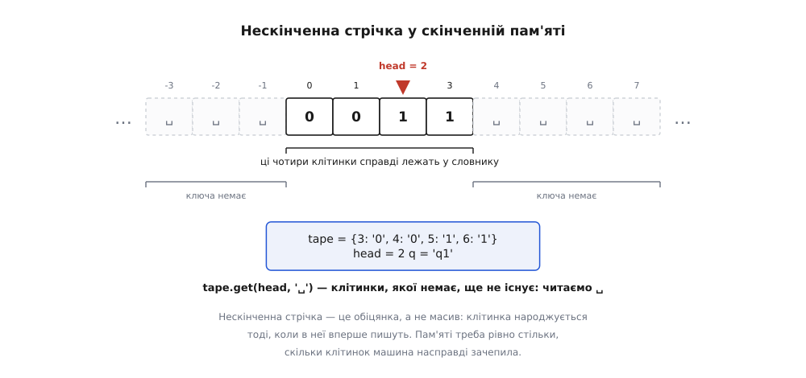
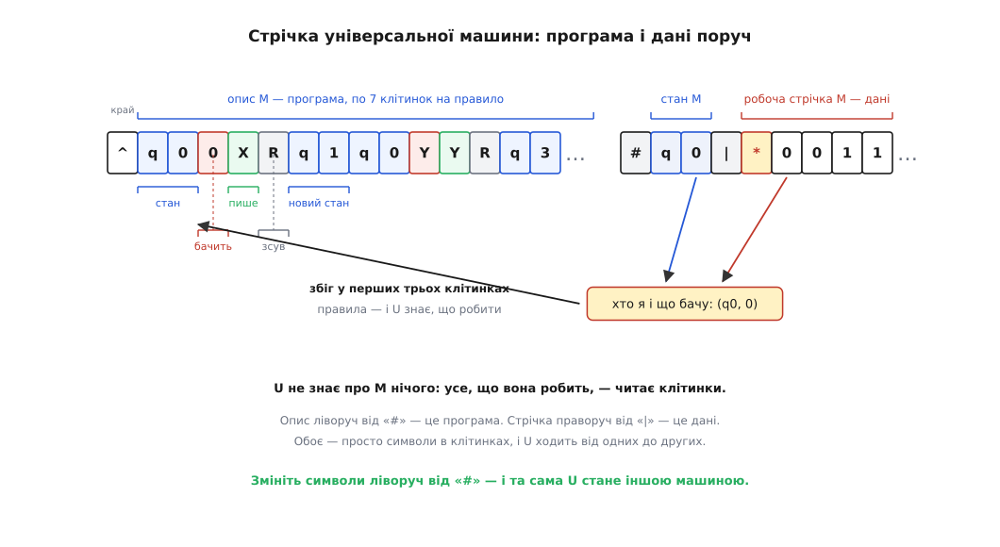
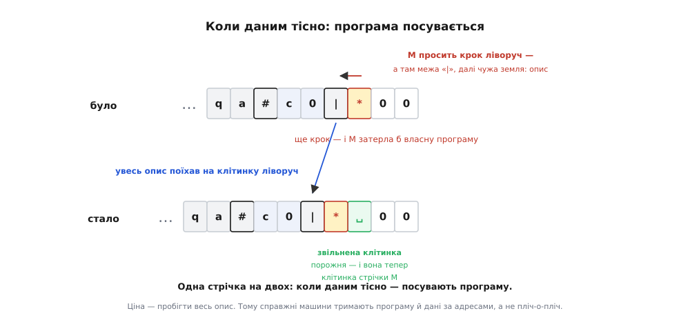

# ⚙️ Симулятор машини Тюринга: від таблиці δ до універсальної машини

<preknowlist>
- [Проблема зупинки](topic:computability/halting-problem) — не існує алгоритму, який про будь-яку пару «програма, вхід» скаже, чи скінчиться робота; тому будь-який виконавець чужого коду приречений мати третій вирок — «не знаю».
- [Теза Черча–Тюринга](topic:computability/church-turing-thesis) — усе, що обчислює будь-яка мова програмування, обчислює й машина Тюринга, і навпаки: класи обчислюваного збігаються.
- [Асимптотична складність](topic:computability/asymptotic-complexity) — запис O(·): як росте вартість роботи зі зростанням входу, з точністю до сталого множника.
</preknowlist>

**Задача.** Виконувати таблицю переходів олівцем можна рівно доти, доки кроків десяток. Рядок `0011` — це тринадцять кроків і хвилина уваги; `00001111` — уже сорок один, і десь на тридцятому в чернетці з'явиться зайвий `Y`, якого ви не помітите. Машина, що бездумно виконує правила, заслуговує на виконавця, який теж їх не тлумачить — і не втомлюється.

Зберімо його, і не спинімося на очевидному. Ціль має два рівні, і другий значно цікавіший за перший:

1. **Симулятор** — подаємо таблицю δ і вхідний рядок, дістаємо покроковий знімок стрічки й вирок.
2. **Універсальна машина** — та сама програма виконує таблицю, про яку **не знає нічого**: опис чужої машини лежить у неї на стрічці, поруч із даними, такими самими символами.

Перший рівень — вправа на акуратність. Другий — те місце, де програма перестає бути будовою машини й стає рядком, який можна прочитати, переписати й підмінити. Разом — сімнадцять рядків на симулятор і тридцять п'ять на універсальну.

## Ідея: конфігурація — це геть усе

Перше питання будь-якої реалізації: **що саме треба зберігати?** Машина Тюринга влаштована так, що відповідь коротка й вичерпна. У будь-яку мить про неї відомо рівно три речі: у якому вона **стані**, що написано на **стрічці** й де стоїть **голівка**. Ця трійка зветься **конфігурацією** — і в ній справді все: два прогони з однаковою конфігурацією нерозрізненні й підуть далі однаково. Жодної прихованої пам'яті, жодного контексту збоку: δ дивиться на стан і на символ під голівкою, і більше дивитися нема на що.

Отже, крок — це чиста функція «конфігурація → конфігурація», а вся δ зводиться до **одного пошуку в словнику**: ключ `(стан, символ)`, значення `(що писати, куди зсунутись, у який стан перейти)`. Реалізовувати тут нічого — досить записати означення мовою, у якої є словник.

Уся справжня робота ховається в другій складовій трійки. **Стрічка нескінченна.** А пам'ять — ні.

## Нескінченна стрічка у скінченній пам'яті

Спокуса очевидна: стрічка — це ж низка клітинок, отже, масив. Спокуса хибна, і не лише тому, що масив скінченний.

Придивімося, чого ми насправді хочемо від нескінченності. Не того, щоб десь лежало нескінченно багато клітинок, — а того, щоб **на будь-яке звертання знайшлася клітинка**. Це різні речі. Перше неможливе; друге — тривіальне, бо клітинка, у яку ніхто не писав, порожня, а порожню клітинку **не треба зберігати**: її можна щоразу вигадати наново.

Тож стрічка — це **словник** `позиція → символ`, а читання — `tape.get(head, "␣")`. Ключа немає? Клітинки ще не існує, повертаємо ␣. Записали? Ключ народився. Нескінченна стрічка коштує рівно стільки, скільки клітинок машина справді зачепила; решта — обіцянка, яку виконує значення за замовчуванням.


*Нескінченне у скінченному. У словнику лежать лише клітинки, яких машина торкнулася; сусідні позиції ключа не мають — і `get` віддає для них ␣. Клітинка народжується тоді, коли в неї вперше пишуть, тож пам'яті треба стільки, скільки стрічки насправді використано, а не скільки її «є».*

Бонусом словник знімає те, об що спотикається масив: **від'ємні позиції**. Стрічка нескінченна в обидва боки, голівка вільно йде ліворуч від початку — і для словника ключ `-1` означає рівно те, що має означати: клітинку ліворуч від нульової.

> 🔧 **Навіщо це.** Прийом «величезне сховище, у якому лежить тільки зачеплене» — не хитрість заради симулятора, а щоденна інженерія. Так влаштована **віртуальна пам'ять**: процес бачить рівний адресний простір на терабайти, а фізична сторінка з'являється аж тоді, коли в неї вперше пишуть. Так само живуть **розріджені файли** й розріджені матриці: нулі не зберігають — їх повертає значення за замовчуванням. Скрізь один хід: відрізнити «клітинка порожня» від «клітинку треба зберігати». Нескінченна стрічка — найчистіший приклад цього прийому, бо тут «є все» і «зберігаємо майже нічого» доведено до краю.

## Рівень 1: симулятор

Тепер код пишеться майже сам. Вирок — три можливості: `ПРИЙНЯТО`, `ВІДКИНУТО` і — про це нижче окремо — `НЕ ЗНАЮ`. Приймальний і відкидальний стани звемо `qa` й `qr`: «зупинитися з відповіддю» — це просто перехід у виділений стан, і жодного окремого механізму для цього не треба.

:::tabs
```py
BL = "␣"                                      # порожня клітинка

def run(delta, w, start="q0", limit=10_000, trace=False):
    tape = {i: c for i, c in enumerate(w)}    # стрічка — словник, не масив
    q, head = start, 0
    for steps in range(limit + 1):
        if trace:
            print(snapshot(tape, head, q))
        if q == "qa":
            return "ПРИЙНЯТО", steps, content(tape)
        if q == "qr":
            return "ВІДКИНУТО", steps, content(tape)
        rule = delta.get((q, tape.get(head, BL)))     # уся δ — один пошук
        if rule is None:                              # правила немає — за домовленістю «ні»
            return "ВІДКИНУТО", steps, content(tape)
        write, move, q = rule
        tape[head] = write
        head += 1 if move == "R" else -1
    return "НЕ ЗНАЮ", limit, content(tape)            # ліміт вичерпано — і це НЕ «зациклилась»

def snapshot(tape, head, q):
    keys = list(tape) + [head]
    cells = "".join(("▸" if i == head else " ") + tape.get(i, BL)
                    for i in range(min(keys), max(keys) + 1))
    return "%-3s%s" % (q + ":", cells)

def content(tape):
    return "".join(tape[i] for i in sorted(tape)).strip(BL)

# таблиця δ машини, що перевіряє мову {0ⁿ1ⁿ}: викреслюємо пари 0↔1 позначками X та Y
D01 = {
    ("q0", "0"): ("X", "R", "q1"), ("q0", "Y"): ("Y", "R", "q3"), ("q0", BL): (BL, "R", "qa"),
    ("q1", "0"): ("0", "R", "q1"), ("q1", "Y"): ("Y", "R", "q1"), ("q1", "1"): ("Y", "L", "q2"),
    ("q2", "0"): ("0", "L", "q2"), ("q2", "Y"): ("Y", "L", "q2"), ("q2", "X"): ("X", "R", "q0"),
    ("q3", "Y"): ("Y", "R", "q3"), ("q3", BL): (BL, "R", "qa"),
}
```
```ts
const BL = "␣";

type Dir = "L" | "R";
type Rule = { write: string; move: Dir; next: string };
type Delta = Map<string, Rule>;
type Verdict = "ПРИЙНЯТО" | "ВІДКИНУТО" | "НЕ ЗНАЮ";

const key = (q: string, c: string) => `${q},${c}`;
const table = (rows: [string, string, string, Dir, string][]): Delta =>
  new Map(rows.map(([q, c, write, move, next]) => [key(q, c), { write, move, next }]));

function run(delta: Delta, w: string, start = "q0", limit = 10_000, trace = false) {
  const tape = new Map<number, string>([...w].map((c, i) => [i, c])); // словник, не масив
  let q = start, head = 0;
  for (let steps = 0; steps <= limit; steps++) {
    if (trace) console.log(snapshot(tape, head, q));
    if (q === "qa") return { v: "ПРИЙНЯТО" as Verdict, steps, tape: content(tape) };
    if (q === "qr") return { v: "ВІДКИНУТО" as Verdict, steps, tape: content(tape) };
    const rule = delta.get(key(q, tape.get(head) ?? BL));   // уся δ — один пошук
    if (!rule) return { v: "ВІДКИНУТО" as Verdict, steps, tape: content(tape) };
    tape.set(head, rule.write);
    head += rule.move === "R" ? 1 : -1;
    q = rule.next;
  }
  return { v: "НЕ ЗНАЮ" as Verdict, steps: limit, tape: content(tape) };
}

function snapshot(tape: Map<number, string>, head: number, q: string) {
  const ks = [...tape.keys(), head];
  let cells = "";
  for (let i = Math.min(...ks); i <= Math.max(...ks); i++)
    cells += (i === head ? "▸" : " ") + (tape.get(i) ?? BL);
  return (q + ":").padEnd(3) + cells;
}

const content = (tape: Map<number, string>) =>
  [...tape.keys()].sort((a, b) => a - b).map((i) => tape.get(i)!).join("").replace(/^␣+|␣+$/g, "");

// таблиця δ машини, що перевіряє мову {0ⁿ1ⁿ}: викреслюємо пари 0↔1 позначками X та Y
const D01 = table([
  ["q0", "0", "X", "R", "q1"], ["q0", "Y", "Y", "R", "q3"], ["q0", BL, BL, "R", "qa"],
  ["q1", "0", "0", "R", "q1"], ["q1", "Y", "Y", "R", "q1"], ["q1", "1", "Y", "L", "q2"],
  ["q2", "0", "0", "L", "q2"], ["q2", "Y", "Y", "L", "q2"], ["q2", "X", "X", "R", "q0"],
  ["q3", "Y", "Y", "R", "q3"], ["q3", BL, BL, "R", "qa"],
]);
```
:::

Сімнадцять рядків — і машина жива. `run(D01, "0011", trace=True)` друкує весь прогін, `▸` стоїть перед клітинкою під голівкою:

```text
q0:▸0 0 1 1
q1: X▸0 1 1
q1: X 0▸1 1
q2: X▸0 Y 1
q2:▸X 0 Y 1
q0: X▸0 Y 1
q1: X X▸Y 1
q1: X X Y▸1
q2: X X▸Y Y
q2: X▸X Y Y
q0: X X▸Y Y
q3: X X Y▸Y
q3: X X Y Y▸␣
qa: X X Y Y ␣▸␣
('ПРИЙНЯТО', 13, 'XXYY')
```

Тринадцять кроків, стрічка `XXYY` — усі пари викреслено. Тепер найдешевша перевірка на світі: прогнати десяток слів і глянути, чи машина каже те, що мала б.

```text
''          ПРИЙНЯТО      '0'         ВІДКИНУТО
'01'        ПРИЙНЯТО      '1'         ВІДКИНУТО
'0011'      ПРИЙНЯТО      '001'       ВІДКИНУТО
'000111'    ПРИЙНЯТО      '011'       ВІДКИНУТО
'00001111'  ПРИЙНЯТО      '0110'      ВІДКИНУТО
                          '10'        ВІДКИНУТО
                          '0101'      ВІДКИНУТО
                          '00111'     ВІДКИНУТО
```

Збалансовані рядки прийнято, решту відкинуто, зокрема `0110` й `0101` — де нулів і одиниць порівну, але порядок не той. Симулятор працює.

## Рівень 2: програма переїжджає на стрічку

Симулятор вище має ваду, і вада принципова: таблиця δ у ньому **чужорідна**. Це структура даних мови, якою написано симулятор, — вона живе поза стрічкою, у зовсім іншому світі. Універсальна машина вимагає більшого: опис M мусить лежати **на стрічці**, серед тих самих символів, що й дані. Тільки тоді програма справді стає даними, а не лишається окремою сутністю, яку ми вдаємо даними на словах.

Отже, потрібне **кодування**. Опис — скінченний текст, тож питання одне: як розкласти його по клітинках, щоб машина з голівкою, яка бачить одну клітинку за раз, могла його читати. Спокуса — зробити «зручно людині»: коми, дужки, назви станів довільної довжини. Не варто: розбирати такий текст голівкою — окрема морока, більша за саму задачу. Візьмімо **сталу ширину**.

```math
одне правило — рівно 7 клітинок, без роздільників усередині:

   q 0   0   X   R   q 1
   └┬┘   │   │   │   └┬┘
    │    │   │   │    └── новий стан (2 клітинки)
    │    │   │   └─────── зсув L/R
    │    │   └─────────── що писати
    │    └─────────────── що бачить
    └──────────────────── стан (2 клітинки)

наступне правило — просто +7 клітинок праворуч
```

Стан — дві клітинки, символ — одна, зсув — одна. Жодних роздільників усередині правила не треба: щоб перейти до наступного, досить додати 7 до позиції. Уся таблиця — правила підряд, і пошук у ній — крок сімками, доки перші три клітинки не збігатимуться з парою «хто я і що бачу».

Далі на стрічці треба ще дві речі, які в симуляторі були змінними: **у якому стані M** і **де її голівка**. Стан кладемо після межі `#` — рівно дві клітинки. Голівку позначаємо символом `*` просто перед потрібною клітинкою: тоді зсув голівки — це обмін `*` із сусідом. Робоча стрічка M починається після межі `|`. Ось повна стрічка U для машини 0ⁿ1ⁿ і входу `0011` — геть усе, що вона має:

```text
^q00XRq1q0YYRq3q0␣␣Rqaq100Rq1q11YLq2q1YYRq1q200Lq2q2XXRq0q2YYLq2q3YYRq3q3␣␣Rqa#q0|*0011
```

Сімдесят сім клітинок опису — одинадцять правил по сім, — межа, стан, межа, чотири клітинки даних. Уся машина 0ⁿ1ⁿ, яку ви щойно бачили таблицею, тепер лежить рядком.


*Програма і дані пліч-о-пліч на одній стрічці. Ліворуч від `#` — опис M сталими записами по сім клітинок; між `#` і `|` — поточний стан M; праворуч від `|` — робоча стрічка M, де `*` позначає клітинку під її голівкою. U не знає про M нічого: вона зчитує пару «стан, символ», бігає описом сімками, доки перші три клітинки правила не збігатимуться, і робить те, що там написано.*

Тепер сам цикл U. Він робить рівно те, що ви робили б олівцем, читаючи чужу таблицю: подивитися, у якому M стані й що в неї під голівкою, знайти в таблиці рядок, зробити написане.

:::tabs
```py
def encode(delta):                                     # правило → рівно 7 клітинок
    return "".join(q + c + w + d + n for (q, c), (w, d, n) in sorted(delta.items()))

def load(delta, w, start="q0"):                        # опис + стан + робоча стрічка
    return "^" + encode(delta) + "#" + start + "|*" + w

def universal(tape_str, limit=200_000):
    T = {i: c for i, c in enumerate(tape_str)}
    at = lambda i: T.get(i, BL)
    left, h = 0, 1
    while at(h) != "#":                                # h — межа «#», за нею стан M
        h += 1
    bar = h + 3                                        # bar — межа «|», за нею стрічка M
    for steps in range(limit + 1):
        q = at(h + 1) + at(h + 2)                      # хто я: стан M — 2 клітинки
        if q == "qa":
            return "ПРИЙНЯТО", steps, work(T, bar)
        if q == "qr":
            return "ВІДКИНУТО", steps, work(T, bar)
        s = bar
        while at(s) != "*":                            # що бачу: дійти до позначки голівки
            s += 1
        c = at(s + 1)
        p = left + 1                                   # шукаємо правило: крок сімками
        while p < h and not (at(p) + at(p + 1) == q and at(p + 2) == c):
            p += 7
        if p >= h:
            return "ВІДКИНУТО", steps, work(T, bar)
        T[s + 1] = at(p + 3)                           # пише
        T[h + 1], T[h + 2] = at(p + 5), at(p + 6)      # новий стан
        if at(p + 4) == "R":
            T[s], T[s + 1] = at(s + 1), "*"            # позначка міняється з сусідом
        else:
            if s - 1 == bar:                           # ліворуч межа: посунути весь опис
                for i in range(left, bar + 1):
                    T[i - 1] = at(i)
                T[bar] = BL
                left -= 1; h -= 1; bar -= 1
            T[s], T[s - 1] = at(s - 1), "*"
    return "НЕ ЗНАЮ", limit, work(T, bar)

def work(T, bar):
    return "".join(T[i] for i in sorted(k for k in T if k > bar) if T[i] != "*").strip(BL)
```
```ts
const encode = (d: Delta): string =>
  [...d].sort(([a], [b]) => (a < b ? -1 : a > b ? 1 : 0))
    .map(([k, r]) => { const [q, c] = k.split(","); return q + c + r.write + r.move + r.next; })
    .join("");

const load = (d: Delta, w: string, start = "q0") => `^${encode(d)}#${start}|*${w}`;

function universal(tapeStr: string, limit = 200_000) {
  const T = new Map<number, string>([...tapeStr].map((c, i) => [i, c]));
  const at = (i: number) => T.get(i) ?? BL;
  let left = 0, h = 1;
  while (at(h) !== "#") h++;                       // h — межа «#», за нею стан M
  let bar = h + 3;                                 // bar — межа «|», за нею стрічка M
  for (let steps = 0; steps <= limit; steps++) {
    const q = at(h + 1) + at(h + 2);               // хто я: стан M — 2 клітинки
    if (q === "qa") return { v: "ПРИЙНЯТО" as Verdict, steps, tape: work(T, bar) };
    if (q === "qr") return { v: "ВІДКИНУТО" as Verdict, steps, tape: work(T, bar) };
    let s = bar;
    while (at(s) !== "*") s++;                     // що бачу: дійти до позначки голівки
    const c = at(s + 1);
    let p = left + 1;                              // шукаємо правило: крок сімками
    while (p < h && !(at(p) + at(p + 1) === q && at(p + 2) === c)) p += 7;
    if (p >= h) return { v: "ВІДКИНУТО" as Verdict, steps, tape: work(T, bar) };
    T.set(s + 1, at(p + 3));                       // пише
    T.set(h + 1, at(p + 5)); T.set(h + 2, at(p + 6));   // новий стан
    if (at(p + 4) === "R") {
      T.set(s, at(s + 1)); T.set(s + 1, "*");      // позначка міняється з сусідом
    } else {
      if (s - 1 === bar) {                         // ліворуч межа: посунути весь опис
        for (let i = left; i <= bar; i++) T.set(i - 1, at(i));
        T.set(bar, BL);
        left--; h--; bar--;
      }
      T.set(s, at(s - 1)); T.set(s - 1, "*");
    }
  }
  return { v: "НЕ ЗНАЮ" as Verdict, steps: limit, tape: work(T, bar) };
}

const work = (T: Map<number, string>, bar: number) =>
  [...T.keys()].filter((i) => i > bar).sort((a, b) => a - b)
    .map((i) => T.get(i)!).filter((c) => c !== "*").join("").replace(/^␣+|␣+$/g, "");
```
:::

Прочитайте цей код ще раз і спробуйте знайти в ньому бодай слово про нулі, одиниці, `X`, `Y` чи про мову 0ⁿ1ⁿ. Його там немає. Є `#`, `|`, `*`, число 7 і чотири порівняння символів. Уся «розумність» машини 0ⁿ1ⁿ лишилася в тих сімдесяти семи клітинках на стрічці — а U просто ходить туди-сюди й звіряє клітинки.

Перевіряємо очевидним способом: `universal(load(D01, w))` має давати те саме, що `run(D01, w)`, на кожному слові. Дає — на всіх тринадцятьох, разом із порожнім входом.

## Та сама U, інша машина

Ось випробування, заради якого все затівалося. Візьмімо машину, яка не має з 0ⁿ1ⁿ спільного нічого, — **додавання одиниці до двійкового числа**. Вона добігає праворуч до кінця числа, а тоді вертається ліворуч, перетворюючи одиниці на нулі, доки не натрапить на нуль (чи на порожнє місце) — туди й ляже перенесення:

```py
INC = {
    ("r0", "0"): ("0", "R", "r0"), ("r0", "1"): ("1", "R", "r0"), ("r0", BL): (BL, "L", "c0"),
    ("c0", "1"): ("0", "L", "c0"), ("c0", "0"): ("1", "R", "qa"), ("c0", BL): ("1", "R", "qa"),
}
```

І подаймо її **тій самій U**. У коді U не змінено жодного символу — змінено символи **на стрічці**:

```text
0       -> 1          кроків: 3   | U: 1          OK
1       -> 10         кроків: 4   | U: 10         OK
10      -> 11         кроків: 4   | U: 11         OK
11      -> 100        кроків: 6   | U: 100        OK
111     -> 1000       кроків: 8   | U: 1000       OK
1011    -> 1100       кроків: 8   | U: 1100       OK
1111    -> 10000      кроків: 10  | U: 10000      OK
10011   -> 10100      кроків: 9   | U: 10100      OK
```

Перевірка не на око: для кожного рядка окремо звірено, що `int(w, 2) + 1` дорівнює прочитаному з вихідної стрічки числу. Одинадцять правил на стрічці — і U перевіряє баланс нулів та одиниць; шість інших правил на тій самій стрічці — і та сама U рахує двійкову арифметику з перенесенням. Це і є комп'ютер зі збереженою програмою в мініатюрі: залізо одне, а що воно робить, визначає вміст пам'яті.

> 🔧 **Навіщо це.** Ви щойно написали **інтерпретатор**, і написали його в тій єдиній формі, у якій ідея видно голою. Цикл U — «дістати поточну команду, розібрати поля, виконати, посунути лічильник» — це буквально цикл вибірки-виконання процесора й головний цикл будь-якої віртуальної машини: JVM, CPython, WebAssembly-рушія. Стала ширина запису, за яку ми вхопилися заради простоти, — це причина, чому машинні команди RISC мають фіксовану довжину, а поля в них стоять на закріплених бітах: декодер, який уміє тільки додати сталу до адреси й порівняти кілька бітів, у сотні разів дешевший за той, що розбирає текст. Ми не робили аналогію до процесора — ми випадково побудували процесор.

## Одна стрічка на двох: коли даним тісно

У цій конструкції є місце, де ідилія «програма й дані поруч» дає тріщину, — і воно варте окремого погляду, бо саме воно пояснює, чому справжні комп'ютери влаштовані інакше.

Стрічка M нескінченна в обидва боки. Праворуч від `|` місця скільки завгодно — там порожнеча. А ліворуч? Ліворуч від початку робочої стрічки M стоїть межа `|`, а за нею — **чужа земля**: власний опис M. Щойно голівка M ступить крок ліворуч за свій початок, вона затре програму, за якою працює.

Машина `+1` робить це на першому ж числі: перенесення біжить ліворуч і вибігає за початок. Тож U мусить дати їй ту клітинку — а взяти її нема звідки, крім як **посунути весь опис на клітинку ліворуч**.


*Ціна сусідства. Голівка M дійшла до межі `|` — далі ліворуч лежить опис. U посуває ліворуч геть усе — опис, `#`, стан, `|`, — і звільнена клітинка, порожня, як і належить незайманій стрічці, стає новою клітинкою M. Ідея працює, але кожен такий крок коштує пробігу по всьому опису — тому справжні машини тримають програму й дані за адресами, а не пліч-о-пліч.*

На числах це видно точно: машині `+1` вистачає **одного** зсуву на прогін, і кожен зсув переписує 48 клітинок — увесь її опис із межами плюс звільнена клітинка. Одна клітинка стрічки коштує сорока восьми переписувань. Саме тут абстракція «нескінченна стрічка» стикається з реальністю розкладки: нескінченність є, але вона нескінченна тільки **назовні**, а всередині стрічки, між програмою й даними, місця рівно стільки, скільки ви його зробили.

## Опис — це число

Лишився останній крок, після якого «програма стає даними» перестає бути метафорою остаточно.

Опис M — рядок над скінченним алфавітом. А рядок над скінченним алфавітом — це запис числа в позиційній системі: пронумеруймо тринадцять використаних символів і читаймо опис як число за основою 13.

```py
ABC = "␣0123XYqacrLR"

def to_number(desc):
    n = 0
    for ch in desc:
        n = n * 13 + ABC.index(ch) + 1
    return n

def from_number(n):
    out = ""
    while n:
        n, r = divmod(n - 1, 13)
        out = ABC[r] + out
    return out
```

Машина `+1` — це число:

```text
47741128561282470997255542744789492491601594957
```

Сорок сім цифр, і в них — уся машина, без залишку. Машина 0ⁿ1ⁿ — число з 86 цифр. Перевірка, що це не гра слів: `universal("^" + from_number(n) + "#r0|*1011")` — тобто **з самого числа й нічого більше** — дає `('ПРИЙНЯТО', 8, '1100')`, правильну відповідь `1011 + 1 = 1100`.

Це не наша вигадка. Саме так зробив Тюринг 1936 року: у праці «Про обчислювані числа» кожній машині приписано **стандартний опис** (*standard description*, S.D.) — рядок сталого формату, — а тоді **номер опису** (*description number*, D.N.) — число, у яке цей рядок згортається. Наслідок звідси один із найглибших у математиці: машин **зліченно багато**, бо кожна є числом. Наш `to_number` — той самий хід, тільки з нашим алфавітом.

## Складність: чого коштує універсальність

U повторює кожен крок M — але сама на це витрачає далеко не один крок. Порахуймо чесно: не секунди Python, а те, за що платила б справжня однострічкова машина, — **клітинки, які голівка мусить пройти**. Джерел витрат два, і поводяться вони по-різному.

```text
  n | кроків M | пошук правила/крок | біганина/крок | усього клітинок U | разів повільніше
  1 |        5 |               30.8 |           5.6 |               182 |   36.4
  2 |       13 |               34.5 |           7.4 |               544 |   41.8
  4 |       41 |               36.5 |          11.2 |              1958 |   47.8
  8 |      145 |               37.6 |          19.1 |              8218 |   56.7
 16 |      545 |               38.0 |          35.1 |             39842 |   73.1
 32 |     2113 |               38.3 |          67.0 |            222514 |  105.3
 64 |     8321 |               38.4 |         131.0 |           1409618 |  169.4
128 |    33025 |               38.4 |         259.0 |           9823378 |  297.5
```

Стовпчик «пошук правила» **виходить на полицю**: 30.8 → 38.4 і далі не росте. Причина зрозуміла: описом більшим, ніж він є, машина не стане. Хай яким довгим буде вхід, перегляд таблиці коштує щонайбільше |опис| = 77 клітинок — для сталої M це **стала**.

А от «біганина» подвоюється щоразу, коли подвоюється n: 5.6 → 11.2 → 35.1 → 131.0 → 259.0. Це та сама хвороба сусідства: після кожного кроку U мусить вернутися від голівки M до опису й назад, а голівка M тим часом іде все далі праворуч. Дорога туди-назад — двічі по ширині зачепленої стрічки.

Складімо разом. Якщо M працює T кроків і зачіпає W клітинок, U платить приблизно так:

```math
кроків U ≈ T · (|опис| + 2·W)

а що на одній стрічці W ≤ T + |вхід|, то для сталої M:

кроків U = O(T²)
```

Ось точний зміст твердження «інші машини швидші, але не сильніші». Універсальність **не безкоштовна** — вона коштує множника. Але множник цей **поліноміальний**, а не показниковий, і саме тому клас «розв'язне за поліноміальний час» не залежить від того, яку модель обчислення взяти за еталон: перехід між моделями псує показник степеня, а не природу задачі.

Квадрат — плата за єдину стрічку, і її можна збити. Ф. Генні (*F. C. Hennie*) і Річард Стернз (*Richard E. Stearns*) 1966 року в *Journal of the ACM* показали: **двострічкова** машина відтворює T кроків будь-якої багатострічкової за **O(T log T)** — від квадрата лишається логарифм. Ця межа й досі найкраща з відомих для такої симуляції.

Питання «а наскільки малою може бути U?» виявилося окремим спортом. Марвін Мінський (*Marvin Minsky*) 1962 року побудував універсальну машину на 7 станів і 4 символи. Юрій Рогожин і наступники дотиснули низку рекордів — (4, 6), (5, 5), (6, 4), (9, 3), (15, 2); машина Рогожина (4, 6) обходиться 22 командами. Найгучніший епізод варто назвати з поправкою: 2007 року Алекс Сміт (*Alex Smith*) отримав приз Вольфрама за доведення універсальності машини (2, 3) — але це **слабка** універсальність, яка вимагає нескінченної неперіодичної початкової стрічки й машини, що ніколи не спиняється. Вон Претт (*Vaughan Pratt*) заперечив доведенню публічно, а Мартін Девіс (*Martin Davis*), член журі, зауважив, що присудження оголосили без ухвали журі. Статус чесно назвати так: **результат спірний**, і суперечка почасти про те, що взагалі означає «універсальна».

## Пастки

**Стрічка списком — тиха неправда.** Найдорожча помилка тут не падає з винятком. Замініть словник на список — і `tape[-1]` у Python не поскаржиться: він поверне **останню** клітинку. Голівка, що зробила крок ліворуч від нуля, опиняється у правому кінці стрічки й пише туди. Ось та сама машина `+1` на вході `11`, двома способами:

```text
словник : ('ПРИЙНЯТО', 6, '100')
список  : ('qa', '00␣␣␣1')      ← 11 + 1 має бути 100
```

Ніякого винятку, ніякого попередження: машина дійшла до `qa` й радісно **прийняла** сміття. Одиниця перенесення лягла в останню клітинку списку замість клітинки ліворуч від початку. Мова, у якій від'ємний індекс має «зручне» значення, тут працює проти вас; словник же ставить `-1` на те місце, де йому й належить бути.

**Третій вирок — «не знаю», а не «не спиниться».** Симулятор мусить мати ліміт кроків, інакше на першій-ліпшій машині він зависне назавжди. Але вирок за вичерпаним лімітом треба називати чесно. Погляньте:

```text
вічний цикл, limit=50      : НЕ ЗНАЮ, кроків 50, стрічка ''
0ⁿ1ⁿ на 00001111, limit=10 : НЕ ЗНАЮ, кроків 10, стрічка 'XX00Y111'
0ⁿ1ⁿ на 00001111, limit=10⁴: ПРИЙНЯТО, кроків 41, стрічка 'XXXXYYYY'
```

Перший рядок — машина, що справді крутиться вічно. Другий — машина, якій до відповіді лишалося тридцять один крок. **Вирок той самий.** Симулятор не розрізняє «не спиниться ніколи» й «не спинилася поки що», і це не недбальство реалізації: розрізняти їх у загальному випадку — [проблема зупинки](topic:computability/halting-problem), задача без алгоритму. Тому тип відповіді має три значення, а не два, і третє звучить «не знаю». Функція, що повертає `bool`, тут просто бреше.

**Ліміт не має правильного значення.** Спокуса підібрати «досить велике» число розбивається об [завзятого бобра](topic:computability/busy-beaver) — функцію BB(n), яку ввів Тібор Радо (*Tibor Radó*) — угорський математик, що від 1929 року працював у США, — статтею «Про необчислювані функції» (*On Non-Computable Functions*) у *Bell System Technical Journal* у травні 1962-го. BB(n) — це найбільше число кроків, яке може зробити машина на n станів, що **все-таки спиняється**. Числа знущальні. Машину на 5 станів, що працює 47 176 870 кроків і спиняється, знайшли Гайнер Марксен і Юрген Бунтрок 1990 року; що більшої немає, довели аж 2 липня 2024-го — колаборація Busy Beaver Challenge перебрала 181 385 789 машин, і доведення записане в Coq, тобто перевірене машинно. П'ять станів — і сорок сім мільйонів кроків. Для шести станів навіть нижня оцінка вже не має розумного запису: BB(6) ≥ 2↑↑2↑↑2↑↑10. Тож ліміт у вашому симуляторі — не інженерний недогляд, який колись виправлять кращим числом: жодне число не є правильним, і в цьому вся суть.

**Правила немає — це «ні», і про це треба домовитися вголос.** Коли пари `(стан, символ)` у таблиці нема, машина спиняється й відкидає. Це **домовленість**, а не істина: інша, така сама законна домовленість — вважати відсутнє правило помилкою опису. Обидві версії дають робочий симулятор і **різні** відповіді на тому самому вході. Ловиться це не тестом, а рядком у документації.

**Межі мусять бути чужими для Γ.** Символи `^`, `#`, `|` і `*` — не частина жодної машини, вони наші. Хай хоч один із них трапиться в стрічковому алфавіті M — і U прочитає дані як межу, тихо й безповоротно. Це не абстрактна причепливість: рівно те саме ламає нашвидкуруч зроблені формати даних, де роздільник може зустрітися всередині поля. Ліки — ті самі, що й у справжніх форматах: тримати службові символи поза алфавітом даних або екранувати їх.

**Стала ширина дає простий парсер і жорстку стелю.** Стан — дві клітинки, тож станів щонайбільше десяток на літеру: `q0`…`q9`. Спробуйте машину з `q10` — і U прочитає `q1`, а `0` вважатиме символом, який машина бачить. Тиха катастрофа. Парсер, що вміє тільки додати 7 і порівняти три клітинки, **бо** формат сталий, — платить за це стелею на розмір машини. Той самий компроміс живий і в справжніх наборах команд: фіксована довжина дає дешевий декодер і скупу адресацію.

**U спиняється рівно тоді, коли спиняється M** — і це не вада, а необхідність. Спокусливо було б навчити U «розпізнавати зациклення» й повертати чесну відповідь замість того, щоб крутитися разом із M. Якби це вдалося бодай для всіх машин, які U вміє виконувати, ми дістали б розв'язувач проблеми зупинки — а його не існує. Тож усе, на що має право виконавець чужого коду, — крутитися стільки ж, скільки крутиться виконуване. Універсальність і нерозв'язність — це одна властивість, побачена з двох боків: U може все, що може будь-яка машина, — зокрема й не спинитися.
