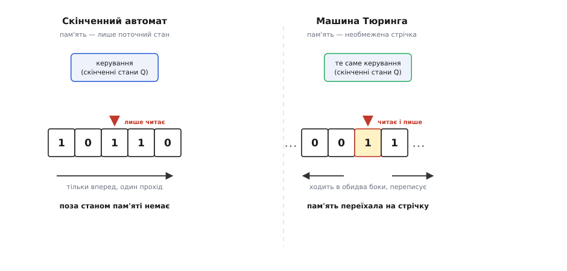
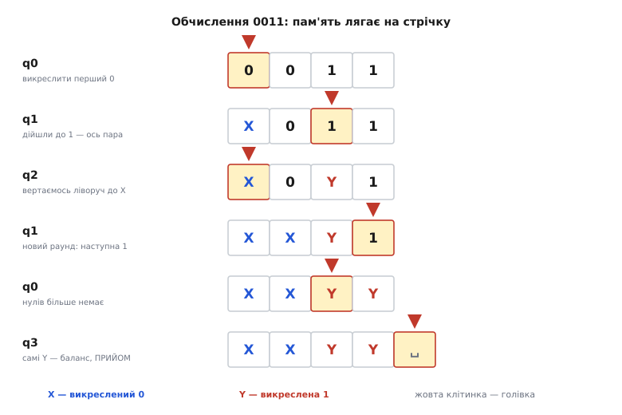
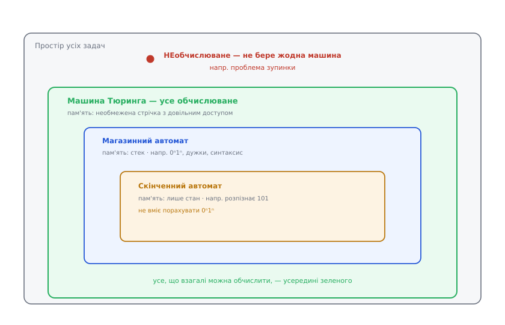

# Машина Тюринга

<preknowlist>
- [Скінченні автомати](root:computability/finite-automata) — машина зі станами й функцією переходів δ, п'ятірка ⟨Q, Σ, δ, q₀, F⟩, ідея «стан як стиснута скінченна пам'ять» і що таке мова, яку машина розпізнає. Машина Тюринга виростає саме з цієї конструкції — додаванням пам'яті.
</preknowlist>

[Скінченний автомат](root:computability/finite-automata) — напрочуд сильна ідея: машина, що читає вхід по символу й тримає в голові лише один зі скінченного числа станів. Але в неї є тверда стеля. Спитайте автомат, чи стоїть у рядку `n` нулів, за якими рівно стільки ж одиниць, чи збалансовані дужки, — і він не впорається. Причина проста й невблаганна: щоб порахувати **довільну** кількість, потрібна пам'ять, що росте з входом, а вся пам'ять автомата — це його стани, і їх скінченно багато. Раніше чи пізніше два різні входи заженуть машину в один стан, і далі вона їх уже не розрізнить.

Напрошуються ліки: дати машині **записник**. Хай вона не тільки читає вхід, а й має необмежений аркуш, на якому вільно пише, стирає й перечитує написане скільки завгодно разів. Виявляється, цієї єдиної добавки досить, щоб зі скромного автомата вийшов **найпотужніший обчислювач, який ми взагалі вміємо означити**. Ця машина — **машина Тюринга**, названа на честь британського математика Алана Тюринга (*Alan Turing*, 1912–1954), який придумав її 1936 року.

Тюринг, що варто підкреслити, не будував комп'ютер — електронних комп'ютерів іще не було. Він розв'язував задачу з чистої логіки. Давид Гільберт (*David Hilbert*) поставив питання, відоме як **Entscheidungsproblem** (нім. *Entscheidung* — «рішення»): чи існує механічна процедура, яка про будь-яке математичне твердження скаже, доказовне воно чи ні? Щоб узагалі відповісти на це «так» чи «ні», Тюрингові спершу довелося означити те, чого доти ніхто строго не означував — **що таке «механічна процедура» взагалі**, на що здатна будь-яка машина, яка бездумно виконує правила. Машина Тюринга і є цим означенням. [Як із питання про підвалини математики народилася машина, що визначила саме поняття обчислення](root:computability/turing-machine/hist-computable-numbers.md) — окрема історія, і в ній Тюринг був не сам.

## Що додаємо до автомата: стрічку

Візьмімо скінченний автомат як він є — коробку з правилами, що завжди перебуває в одному зі станів. Це буде **керування** машини Тюринга: та сама скінченна, наперед задана логіка. А тепер докладімо до неї три речі, яких автоматові бракувало.

По-перше, **стрічку** (*tape*) — необмежену в обидва боки стрічку клітинок, у кожній стоїть один символ. Спершу на ній записаний вхід, решта клітинок порожні. По-друге, **голівку** (*head*) — вона стоїть над однією клітинкою, читає її символ, може **вписати туди інший** і **зсунутися** на клітинку ліворуч або праворуч. По-третє — і це наслідок перших двох — машина тепер **читає не лише вхід, а й те, що сама щойно написала**, і читати може будь-яку клітинку, скільки завгодно разів, у будь-якому порядку.

Ось де захований увесь стрибок. Автомат проходив вхід один раз, зліва направо, і не пам'ятав нічого, крім поточного стану. Машина Тюринга ходить стрічкою туди-сюди, лишає на ній позначки й повертається їх перечитати. Пам'ять більше **не замкнена в станах** — вона розлилася на нескінченну стрічку, а стани лишилися тим, чим і були: маленьким скінченним мозком, що вирішує, що робити далі.

Точна аналогія — людина з олівцем, гумкою й нескінченним рулоном паперу, яка тримає в голові скінченний набір правил. Правил мало, і вони незмінні; уся сила — в тому, що паперу вистачить на будь-який обсяг чернеток. Аналогія ламається в одному місці, і місце це принципове: жива людина втомлюється, а рулон паперу насправді скінченний. Машина Тюринга — **ідеалізація без цих обмежень**, і саме в цьому суть. Вона відповідає не на питання «що влізе в цю-от пам'ять», а на питання «що можна обчислити **в принципі**, маючи скільки завгодно часу й місця».

> 🔧 **Навіщо це.** Ідеалізована нескінченна стрічка — не абстрактна забаганка, а робочий інструмент межування. Вона проводить лінію між «**алгоритму не існує**» (жодна пам'ять і жоден час не зарадять — братися марно) і «**алгоритм є, але потрібно більше пам'яті/часу**» (це вже інженерна задача — оптимізувати, докупити RAM, почекати). Плутати ці два випадки дорого: тижні полювання на реалізацію того, що доведено неможливим, — типова пастка, від якої рятує саме погляд через машину Тюринга.

## Означення: сімка

Скінченний автомат задають п'ятіркою. Машині Тюринга, бо в неї більше рухомих частин, потрібна **сімка** (*7-tuple*):

```math
M = ⟨ Q, Σ, Γ, δ, q₀, q_прийм, q_відкид ⟩

Q      — скінченна множина станів (те саме керування, що й в автомата)
Σ      — вхідний алфавіт        (символи, з яких складено вхід)
Γ      — стрічковий алфавіт     (Σ ⊂ Γ; сюди входить порожній символ ␣)
δ      — функція переходів      δ: Q × Γ → Q × Γ × {L, R}
q₀     — початковий стан
q_прийм  — приймальний стан  («так»)
q_відкид — відкидальний стан («ні»)
```

Уся новизна — знову у функції переходів **δ**, тільки тепер вона робить утричі більше. В автомата було δ: стан × вхід → стан. Тепер:

```math
δ(поточний стан, символ під голівкою) = (новий стан, символ на запис, зсув L або R)
```

Прочитавши пару «де я і що бачу», машина за один крок робить три дії разом: **переходить** у новий стан, **вписує** символ у клітинку під голівкою (можливо, той самий) і **зсуває** голівку на одну клітинку ліворуч чи праворуч. Оці «запис» і «зсув у будь-який бік» — і є та пам'ять, якої бракувало автоматові. Решта сімки — обрамлення: Γ додає до вхідних символів робочі позначки й порожній символ ␣, а два виділені стани, q_прийм і q_відкид, — це два способи **зупинитися** з відповіддю. Машина працює, доки δ веде її далі; щойно вона потрапляє в q_прийм чи q_відкид — спиняється й оголошує «так» або «ні». Є й третя можливість, якої в автомата не було зовсім: машина може **не зупинитися ніколи**, крутячись стрічкою без кінця. Ця третя доля — не дефект, а, як з'ясується, найглибша властивість усієї конструкції.

## Машина за роботою: перевірка 0ⁿ1ⁿ

Найкраще силу стрічки видно на тому самому завданні, що ламало автомат.

**Завдання:** розпізнати мову **{0ⁿ1ⁿ}** — рядки, де спершу йде якесь число нулів, а тоді **рівно стільки ж** одиниць (`0011` — так, `001` — ні, `0110` — ні). Скінченному автоматові це не під силу; машині зі стрічкою — легко.

Ідея людська й проста: **викреслювати пари**. Знайти найлівіший невикреслений `0`, замінити його на позначку `X`; піти праворуч до найлівішої `1`, замінити на `Y`; повернутися ліворуч і повторити. Якщо в кінці все спарувалося без залишку — «так». Ось ця стратегія як таблиця δ (позначки `X`, `Y` — це робочі символи зі стрічкового алфавіту Γ):

```math
стан  бачить →  (пише, зсув, новий стан)         # що робимо
q0    0      →  (X,  R,  q1)     # викреслили 0, шукаємо парну 1
q0    Y      →  (Y,  R,  q3)     # нулів не лишилось — перевіримо, що й одиниць
q0    ␣      →  ПРИЙНЯТИ          # порожній вхід: 0⁰1⁰, теж підходить
q1    0      →  (0,  R,  q1)     # проминаємо ще не викреслені нулі
q1    Y      →  (Y,  R,  q1)     # і вже викреслені одиниці
q1    1      →  (Y,  L,  q2)     # знайшли пару — викреслили 1, вертаємось
q2    0      →  (0,  L,  q2)     # ідемо ліворуч назад…
q2    Y      →  (Y,  L,  q2)     # …до останнього X
q2    X      →  (X,  R,  q0)     # стали праворуч від нього — новий раунд
q3    Y      →  (Y,  R,  q3)     # хвіст має бути з самих Y…
q3    ␣      →  ПРИЙНЯТИ          # …і нічого зайвого — баланс!
# будь-яка пара, якої немає в таблиці (напр. q1 бачить ␣) → ВІДКИНУТИ
```

Проженімо вхід `0011`. Показую стрічку, а `▸` стоїть перед клітинкою під голівкою:

```math
q0:  ▸0 0 1 1        q0 бачить 0 → пише X, R, q1
q1:  X ▸0 1 1        проминаємо 0
q1:  X 0 ▸1 1        q1 бачить 1 → пише Y, L, q2
q2:  X ▸0 Y 1        ідемо ліворуч
q2: ▸X 0 Y 1         дійшли до X → R, q0
q0:  X ▸0 Y 1        q0 бачить 0 → пише X, R, q1
q1:  X X ▸Y 1        проминаємо Y
q1:  X X Y ▸1        q1 бачить 1 → пише Y, L, q2
     …               вертаємось до X, новий раунд
q0:  X X ▸Y Y        нулів більше нема → R, q3
q3:  X X Y ▸Y        хвіст із Y → R
q3:  X X Y Y ▸␣      кінець, самі Y → ПРИЙНЯТИ ✓
```

**Висновок:** машина не тримала лічильника «скільки нулів» у голові — стільки станів у неї немає. Вона **клала пам'ять на стрічку** у вигляді викреслень і щоразу читала її наново. Ось чому скінченного керування (лишень чотири робочі стани!) вистачило для мови з нескінченним числом рядків будь-якої довжини: рахунок живе на папері, а не в станах.


*Що саме додає машина Тюринга. Ліворуч — скінченний автомат: скінченне керування читає вхід по символу, рухаючись лише вперед, і не має пам'яті поза станом. Праворуч — машина Тюринга: те саме керування, але тепер голівка стоїть над необмеженою стрічкою, читає й **записує** клітинку та зсувається в **обидва** боки. Уся сила — в цій добавці: пам'ять переїхала зі станів на нескінченну стрічку.*


*Обчислення як переписування стрічки. Кожен рядок — знімок стрічки на одному кроці; підсвічена клітинка — під голівкою. Машина йде вправо, викреслює одиницю (`Y`), вертається вліво до останнього викресленого нуля (`X`) і починає новий раунд. Лічильника ніде немає — його роль грають самі позначки на стрічці.*

## Чому ця дрібничка — стеля обчислень

Тепер найдивовижніше. Ця гранично проста машина — стрічка, голівка, жменька станів — здатна обчислити **все, що взагалі можна обчислити**. Не «багато»; не «майже все» — а рівно все, що піддається будь-якому механічному, покроковому методу. Ваш ноутбук, найбільший суперкомп'ютер, будь-яка мова програмування не вміють обчислити **жодної функції**, якої не обчислить машина Тюринга. Вони швидші — але не сильніші.

Звідки така зухвала впевненість? Із дивовижного збігу. У ті самі 1930-ті кілька людей, не змовляючись, шукали, чим формально замінити розпливчасте «механічна процедура», — і кожен прийшов до **свого** означення. Алонзо Черч (*Alonzo Church*) збудував **λ-числення** (лямбда-числення) — систему чистих правил підстановки. Курт Гедель (*Kurt Gödel*) із Жаком Ербраном (*Jacques Herbrand*) означили **загальнорекурсивні функції**. Тюринг — свою машину. А Еміль Пост (*Emil Post*) незалежно описав майже таку саму машину зі стрічкою, лиш кількома місяцями пізніше. Три-чотири різні дороги, прокладені різними людьми з різних мотивів, — і всі привели **точно в одну точку**: клас функцій, обчислюваних λ-численням, рекурсіями й машиною Тюринга, виявився **тим самим**.

Цей збіг і є підставою [тези Черча–Тюринга](root:computability/church-turing-thesis): усе, що людина назвала б «обчислюваним за скінченну механічну процедуру», обчислює машина Тюринга — і навпаки. Важливо чесно назвати її статус: це **теза, а не теорема**. Довести її не можна, бо вона прирівнює строгий об'єкт (машину) до **інтуїтивного** поняття «алгоритм», а інтуїтивне не доводять. Але за майже сто років ніхто не знайшов жодного розумного означення обчислення, що вийшло б за межі машини Тюринга, — і три незалежні збіги роблять тезу настільки надійною, наскільки взагалі буває надійним недоказовне твердження. Саме тому машина Тюринга — **еталонна мірка обчислення**: сказати «ця задача обчислювана» означає рівно «її розв'язує якась машина Тюринга».

## Універсальна машина: програма стає даними

Досі кожна наша машина вміла одне: та, що вгорі, перевіряла `0ⁿ1ⁿ` і більше нічого. Це ще не комп'ютер, а радше окрема мікросхема під одну функцію. Але Тюринг зробив крок, від якого досі перехоплює подих.

Опис будь-якої машини Тюринга — це просто її таблиця δ, скінченний текст. А текст можна записати **на стрічку**, символами. Отже, можна збудувати одну особливу машину — **універсальну** (лат. *universalis* — «загальний») машину **U**, — якій на стрічку подають дві речі: **опис** якоїсь машини M і **вхід** для неї. U читає опис M і крок за кроком **вдає M**: дивиться, у якому M стані й що під її голівкою, знаходить у поданій таблиці потрібний рядок δ, і робить те, що зробила б M. Одна машина, що вміє прикинутися **будь-якою** машиною, — треба лишень покласти її опис на стрічку.

Вчитаймося, що це означає. **Програма перестала бути будовою машини й стала даними** — рядком на тій самій стрічці, де лежать і числа. Це і є ідея комп'ютера зі збереженою програмою: одне залізо, а що воно робить — визначає програма в пам'яті, така сама байтова послідовність, як і оброблювані дані. Тюринг сформулював це 1936 року — за роки до першої електронної машини. Ваш процесор — це (обмежений скінченною пам'яттю) фізичний родич універсальної машини: він читає з пам'яті потік команд-даних і виконує будь-яку з мільйонів програм, кожна з яких — просто інший вміст пам'яті. [Зібрати живий симулятор машини Тюринга й дорости до універсальної машини — інтерпретатора чужого коду](root:computability/turing-machine/proj-turing-simulator.md) можна кількома десятками рядків, і це найкоротший шлях відчути ідею на дотик.

## Стіна: проблема зупинки

За універсальність доводиться платити, і платня ця математично неминуча. Тільки-но одна машина вміє запускати будь-яку іншу — і навіть саму себе, — виникають питання, на які **не може відповісти жодна машина взагалі**. Найвідоміше з них: чи можна наперед сказати, **зупиниться** дана програма на даному вході чи крутитиметься вічно?

Здавалося б, корисна річ — вбудований сторож, що попереджає про зациклення. Але такого сторожа не існує, і ось чому. Припустімо, є машина **H**, яка про будь-яку пару «програма P, вхід x» безпомилково каже «зупиниться» або «не зупиниться». Тоді збудуймо капосну машину **D**: вона бере опис програми P, питає в H, що робить P, коли їй подати **саму себе**, — і робить **навпаки**. Якщо H віщує «P на собі зупиниться», D іде в нескінченний цикл; якщо «не зупиниться» — D негайно спиняється. А тепер фатальний хід: подаймо D **її власний опис**. Якщо D зупиняється — то за побудовою вона мала б зациклитися; якщо крутиться вічно — то мала б зупинитися. Обидві можливості суперечать самі собі. Отже, припущення хибне: всезнаючої **H не існує**. Це і є **проблема зупинки** — приклад **нерозв'язної** задачі, задачі без жодного алгоритму-розв'язувача.

Тут варто бути точним із приписуванням. Сам термін «halting problem» («проблема зупинки») та ця чиста формулювання — пізніші, їх ввів Мартін Девіс (*Martin Davis*) у 1950-х. Тюринг 1936 року довів по суті те саме, але у своїх поняттях (про машини, що ніколи не «застрягають» без нового символу), — і зробив це, щоб **закрити питання Гільберта**: механічної процедури, яка розв'язала б усю математику, немає. Того ж кола результат — знамениті [теореми Геделя про неповноту](root:math-logic/godel-incompleteness): у будь-якій досить багатій формальній системі є істинні твердження, до яких не дотягнеться жодне доведення. Логічна неповнота Геделя й обчислювальна нерозв'язність Тюринга — два боки однієї межі: не все істинне доказовне, і не все чітко поставлене — обчислюване.

> 🔧 **Навіщо це.** Нерозв'язність — не філософська цікавинка, а щоденна межа інструментів. Ідеального аналізатора, що для **будь-якого** коду скаже, чи той зациклиться, написати неможливо — це буквально проблема зупинки. Тому лінтери й статичні аналізатори працюють **наближено**: ловлять типові випадки, а в непевних чесно кажуть «не знаю». З тієї самої причини не буває антивіруса, що точним аналізом поведінки відрізнить будь-яку шкідливу програму від безпечної, ні компілятора, що виловив би геть усі мертві цикли. Знаючи це, ви не полюєте на неможливий ідеал, а свідомо будуєте розумне наближення.

## Драбина машин і де це працює

Машину Тюринга найлегше поставити на місце поряд із її слабшими родичами — за одним питанням: **скільки пам'яті** має машина понад скінченне керування.

- [Скінченний автомат](root:computability/finite-automata) — пам'яті нуль, лише стан. Розпізнає регулярні мови; на `0ⁿ1ⁿ` уже спотикається.
- [Магазинний автомат](root:computability/pushdown-automata) — має **стек** (одну купку, куди кладе й звідки бере лише згори). Цього рівно досить для вкладеності — дужок, `0ⁿ1ⁿ`, синтаксису мов програмування, — але не більше.
- **Машина Тюринга** — має **необмежену стрічку** з довільним доступом. Це вершина: усе обчислюване — тут.


*Ієрархія за пам'яттю. Кожен щабель додає пам'ять і розширює клас задач: жодної (автомат) → стек (магазинний) → необмежена стрічка (Тюринг). Стрічка сягає межі обчислюваного взагалі — а за нею лежить область, куди не дістає **жодна** машина: там живе проблема зупинки.*

Ця драбина — не музейна класифікація, а карта з чіткими краями, і саме тому машина Тюринга така важлива на практиці. Вона задає **саме поняття «обчислюване»** — зовнішній кордон того, на що здатен будь-який алгоритм; за ним — доведено безнадійні задачі, і знати про цей кордон означає не витрачати життя на облогу неприступного. Вона ж — підмурок **теорії складності**: полічіть не «чи спиниться», а «за скільки кроків» — і дістанете час роботи, а славетні класи P і NP означені саме через машину Тюринга. І вона ж — прабатько комп'ютера: універсальна машина, у якій програма є даними, — це креслення архітектури, за якою побудований пристрій, на якому ви це читаєте.

Підсумуймо. Машина Тюринга — це [скінченний автомат](root:computability/finite-automata) плюс одна річ: необмежена **стрічка**, яку голівка читає, переписує й обходить в обидва боки. Строго її задають **сімкою** ⟨Q, Σ, Γ, δ, q₀, q_прийм, q_відкид⟩, де серце — функція переходів **δ: (стан, символ) → (стан, запис, зсув)**. Ця дрібна добавка виносить пам'ять зі станів на нескінченну стрічку — і робить машину **найсильнішим означенням обчислення**, що ми маємо ([теза Черча–Тюринга](root:computability/church-turing-thesis)). Одна **універсальна** машина вміє запустити будь-яку іншу, поклавши її опис на стрічку, — і так програма стає даними. А та сама універсальність відкриває **стіну**: питання на кшталт зупинки, на які не відповість жодна машина. Одна стрічка перетворила автомат зі станами на визначення самого обчислення — і водночас накреслила край мапи, за яким починається необчислюване.
