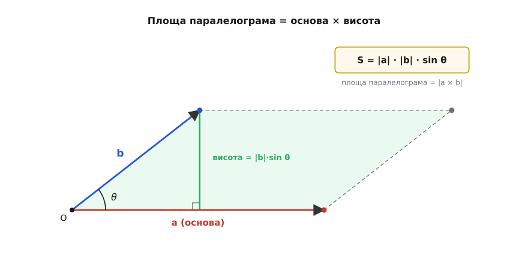
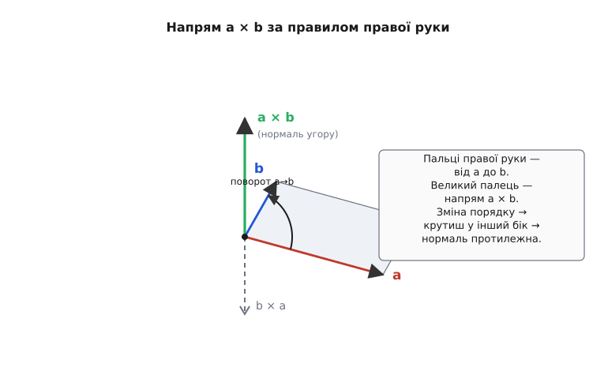

# Векторний добуток

Два вектори можна перемножити так, що вийде число, — це скалярний добуток, який міряє, наскільки два напрями збігаються. Та в природі постійно виникає протилежне питання: наскільки два напрями **розходяться**? Дві стрілки, що дивляться майже в один бік, майже не розгортають площини між собою; дві перпендикулярні стрілки натягують між собою найбільший «розмах». І ще одне питання — суто просторове: маємо площинку, задану двома стрілками, **куди вона дивиться**, тобто який напрям до неї перпендикулярний? Виявляється, на обидва ці питання — «наскільки впоперек?» і «куди перпендикулярно?» — відповідає одна-єдина операція, і вона віддає не число, а цілий вектор. Це векторний добуток.

Результат `a × b` улаштований так, що несе одразу дві річі. Його **довжина** дорівнює площі паралелограма, натягнутого на **a** і **b**, — і це число тим більше, чим ближче вектори до перпендикуляра. Його **напрям** перпендикулярний до обох векторів — тобто вказує, куди «дивиться» їхня площина. Одна стрілка, що водночас каже і «скільки розмаху», і «в який бік нормаль». Розібратися, **чому** добуток означують саме так і чому це виявляється напрочуд корисним — від моменту сили до орієнтації в просторі — і означає зрозуміти векторний добуток по-справжньому.

## Два протилежні запитання до пари векторів

Коли є два вектори, поставлені з однієї точки, про них природно спитати дві зовсім різні речі. Перше — «наскільки вони вздовж одне одного?». На нього відповідає скалярний добуток: він найбільший, коли вектори паралельні, і обертається в нуль, коли вони перпендикулярні.

> Скалярний добуток `a · b = |a||b|cos θ` стискає два вектори в одне число — міру збігу напрямів: максимум при θ = 0, нуль при θ = 90°. Це знадобиться лише для контрасту: векторний добуток поводиться рівно навпаки. Деталі — у статті [скалярний добуток](root:math-algebra/dot-product).

Друге питання — дзеркальне: «наскільки вони **впоперек** одне одного?». Дві стрілки, спрямовані майже однаково, ледь розкривають між собою клин — розмаху майже немає. Розведемо їх до прямого кута — клин найширший. Зведемо назад, тепер у протилежні боки, — площина знову схлопується. Бачимо, що міра «впоперек» має бути нульовою для паралельних векторів, найбільшою для перпендикулярних і взагалі вестися **синусом** кута, а не косинусом. Це вже не та величина, що дає скалярний добуток, — це інша, доповняльна до неї.

Найприродніша геометрична міра «розмаху» між двома векторами — це **площа**. Поставимо **a** і **b** з однієї точки й добудуємо на них паралелограм (дві копії кожного вектора, зсунуті до кінця іншого). Площа цього паралелограма й відповідає тому, що ми шукаємо: паралельні вектори дають вироджений, сплюснутий у відрізок паралелограм нульової площі; перпендикулярні дають найбільшу площу при тих самих довжинах сторін. Згадаймо шкільну формулу площі паралелограма — основа на висоту. Якщо за основу взяти |a|, то висота — це та частина **b**, що перпендикулярна до **a**, тобто |b|·sin θ. Звідси:

```
S = |a| · (|b| · sin θ) = |a| · |b| · sin θ
```


*Площа паралелограма як основа на висоту: за основу взято |a|, висота — це проєкція **b** упоперек **a**, тобто |b|·sin θ. Добуток |a|·|b|·sin θ і є площа — нуль для паралельних векторів (паралелограм сплющується), максимум для перпендикулярних. Це майбутня **довжина** векторного добутку.*

Ось і перша половина означення. **Довжина** (модуль) векторного добутку — це площа паралелограма на двох векторах:

```
|a × b| = |a| · |b| · sin θ
```

Зверніть увагу на дзеркальність до скалярного добутку: там cos θ і максимум при збігу напрямів, тут sin θ і максимум при перпендикулярності. Одна пара векторів, дві доповняльні величини: cos-частина каже, скільки в них спільного напряму, sin-частина — скільки розмаху. Разом cos²θ + sin²θ = 1 ділять усю «взаємність» двох напрямів між двома добутками без залишку.

## Чому результат — вектор, а не число

Площа паралелограма — це число, і, здавалося б, на ньому можна спинитися. Але є глибша інформація, яку саме число губить. Уявімо в просторі площинку, задану двома векторами. Дві різні пари векторів можуть натягувати паралелограми **однакової площі**, що лежать у **різних площинах** — одна горизонтальна, інша похила. Сама площа їх не розрізняє. А для фізики ця різниця критична: горизонтальний оберт і похилий оберт — це різні рухи. Тому корисно зберегти не лише «скільки розмаху», а й «**у якій площині** цей розмах».

Як одним вектором задати орієнтацію цілої площини? Площину в просторі найкоротше визначити **перпендикуляром до неї** — її **нормаллю** (лат. *norma* — пряма, косинець). У площини нескінченно багато векторів, що лежать у ній, але напрям, перпендикулярний до всіх них, по суті один (з точністю до того, в який із двох протилежних боків його спрямувати). Отже, домовмося: нехай векторний добуток дивиться вздовж нормалі до площини паралелограма. Тоді одна стрілка несе все відразу — її **довжина** дорівнює площі (скільки розмаху), а її **напрям** перпендикулярний до площини (де цей розмах відбувається). Саме тому результат мусить бути вектором: щоб умістити обидві відповіді, число замало.

Лишається єдина двозначність. Нормалей до площини дві — вони дивляться у протилежні боки. Куди ж спрямувати `a × b` — «вгору» чи «вниз» від площини? Сама геометрія тут вибору не диктує; його доводиться **домовити наперед**. І ця домовленість зветься правилом правої руки.

## Правило правої руки й антисиметрія

Щоб напрям був однозначним, його прив'язують до **порядку** множників. Правило таке: спрямуй пальці правої руки вздовж першого вектора **a**, тоді зігни їх у бік другого вектора **b** (по меншому кутку між ними) — відставлений великий палець покаже напрям `a × b`. Інакше кажучи, дивимося з кінця вектора `a × b` на площину: поворот від **a** до **b** видно проти годинникової стрілки.


*Правило правої руки задає напрям нормалі. Поворот пальців від **a** до **b** (проти годинникової, якщо дивитися згори) виштовхує великий палець угору — це напрям `a × b`. Поміняти місцями множники означає крутити в інший бік: `b × a` дивиться вниз, протилежно. Довжина обох однакова (та сама площа), напрям — протилежний.*

З цього означення одразу випливає найважливіша і найнезвичніша властивість векторного добутку — він **антисиметричний** (грец. *anti* — проти): від перестановки множників результат не зберігається, а **обертає знак**:

```
a × b = −(b × a)
```

Чому так, видно прямо з руки. Площа паралелограма від порядку сторін не залежить, тож довжина `b × a` така сама, як у `a × b`. А от напрям — інший: тепер пальці йдуть від **b** до **a**, тобто крутять у протилежний бік, і великий палець дивиться вниз замість угору. Та сама довжина, протилежний напрям — це і є `−(b × a)`. Контраст зі скалярним добутком разючий: там `a · b = b · a`, порядок байдужий, бо число не має напряму; тут порядок вирішує все, бо напрям несе зміст. Ця антисиметрія — не дивацтво, а саме той механізм, яким векторний добуток розрізняє «оберт сюди» й «оберт туди».

Звідси ж випливає, що **векторний добуток вектора самого на себе — нуль**: `a × a = 0`. Кут між вектором і ним самим нульовий, sin 0 = 0, площа виродженого «паралелограма» нульова. Те саме для будь-яких двох паралельних (колінеарних) векторів: якщо вони дивляться вздовж однієї прямої, θ = 0 або θ = 180°, sin = 0, добуток — нульовий вектор. Це дзеркало до скалярного добутку: там нуль означав перпендикулярність, тут нуль означає **паралельність**.

> 🔧 **Навіщо це.** Саме на цьому стоїть найдешевша перевірка колінеарності. Щоб дізнатися, чи три точки лежать на одній прямій (чи робот не зійшов із прямого курсу, чи контур не має зайвого зламу), беруть два вектори вздовж передбачуваної прямої й рахують їхній векторний добуток: вийшов нуль — точки колінеарні, ні — є злам, і знак добутку ще й каже, у який бік відхилення. Жодних кутів і ділень.

## Як це порахувати: означник із складових

Геометрична формула |a||b|sin θ пояснює **зміст**, але рахувати кут щоразу незручно — у пам'яті машини вектор живе як набір складових, а не як «довжина й кут». Потрібна арифметична формула, що дає `a × b` прямо зі складових. Виведемо її з першопричини — так само, як арифметичну формулу скалярного добутку виводять із поведінки базисних векторів.

Усе тримається на тому, як перемножуються між собою три одиничні вектори осей: **î** (вздовж x), **ĵ** (вздовж y), **k̂** (вздовж z). Вони взаємно перпендикулярні й мають довжину 1, тож площа паралелограма на будь-яких двох із них дорівнює 1·1·sin 90° = 1. Лишається з'ясувати напрям — і тут працює правило правої руки на осях. Якщо осі вибрані **правою трійкою** (стандартно: x — праворуч, y — угору, z — на спостерігача), то поворот від x до y виштовхує великий палець уздовж z:

```
î × ĵ = k̂      ĵ × k̂ = î      k̂ × î = ĵ      (за циклом x→y→z→x)
ĵ × î = −k̂     k̂ × ĵ = −î     î × k̂ = −ĵ     (проти циклу — знак мінус)
î × î = 0       ĵ × ĵ = 0       k̂ × k̂ = 0      (вектор сам на себе)
```

Ці дев'ять добутків — уся таблиця множення осей. Запам'ятати її легко за колом x → y → z → x: множиш дві осі **за** напрямом стрілки — дістаєш третю зі знаком плюс; **проти** стрілки — ту саму третю, але з мінусом; ось на ось саму себе — нуль. Тепер розкладемо обидва вектори за осями, **a** = aₓ**î** + a_y**ĵ** + a_z**k̂** і так само **b**, та перемножимо, розкриваючи дужки (векторний добуток розподільний над додаванням — це випливає з того, що площа розподіляється над складанням сторін). Більшість доданків згортається за таблицею вище, і після збирання подібних лишається:

```
a × b = (a_y·b_z − a_z·b_y) · î
      + (a_z·bₓ − aₓ·b_z) · ĵ
      + (aₓ·b_y − a_y·bₓ) · k̂
```

Кожна складова результату — це маленька «навхрест» різниця двох добутків. Структуру легко не плутати, якщо помітити: у x-складовій немає індексів x (працюють лише y і z), у y-складовій немає y, у z-складовій немає z; а всередині кожної дужки — «прямий добуток мінус перехресний». Це і є **означник** (детермінант) символічної матриці, де перший рядок — осі, другий — складові **a**, третій — складові **b**; розкриваючи його за першим рядком, дістаємо рівно три дужки вище. Формула виглядає громіздко лише на письмі — у коді це три рядки.

```c
typedef struct { float x, y, z; } Vec3;

Vec3 cross(Vec3 a, Vec3 b) {       /* векторний добуток a × b */
    Vec3 r;
    r.x = a.y * b.z - a.z * b.y;
    r.y = a.z * b.x - a.x * b.z;
    r.z = a.x * b.y - a.y * b.x;
    return r;
}
```

Перевіримо на знайомому. Візьмемо **a** = (1, 0, 0) (вісь x) і **b** = (0, 1, 0) (вісь y). Тоді x-складова: 0·0 − 0·1 = 0; y-складова: 0·0 − 1·0 = 0; z-складова: 1·1 − 0·0 = 1. Виходить (0, 0, 1) — вектор уздовж осі z, рівно те, що дала геометрична таблиця для `î × ĵ = k̂`. Арифметика й геометрія знову зійшлися: одна формула — щоб рахувати, друга — щоб розуміти.

> 🔧 **Навіщо це.** Один векторний добуток складових одразу віддає і нормаль, і подвоєну площу трикутника. У 3D-графіці нормаль до трикутної грані рахують саме так: беруть два вектори вздовж сторін, `cross` від них дає перпендикуляр до грані (його потім нормують для освітлення), а половина його довжини — це площа грані. Жодної тригонометрії, лише шість множень і три віднімання на грань.

## Worked-приклад: момент сили

**Умова.** До важеля прикладено силу. Плече (від осі обертання до точки прикладання) задане вектором **r** = (0.3, 0, 0) м — стрижень лежить уздовж осі x. Сила **F** = (0, 8, 0) Н тягне строго вгору, перпендикулярно до стрижня. Знайти вектор моменту сили (англ. *torque*) **M** = **r** × **F** — його напрям (вісь обертання) і модуль (Н·м).

```
Крок 1. Векторний добуток зі складових (r × F):
  Mₓ = r_y·F_z − r_z·F_y = 0·0   − 0·8   = 0
  M_y = r_z·Fₓ − rₓ·F_z = 0·0   − 0.3·0 = 0
  M_z = rₓ·F_y − r_y·Fₓ = 0.3·8 − 0·0   = 2.4

Крок 2. Вектор моменту:
  M = (0, 0, 2.4)  →  спрямований уздовж осі z, модуль 2.4 Н·м

Крок 3. Перевірка геометричною формулою |M| = |r||F|sin θ:
  |r| = 0.3 м,  |F| = 8 Н,  кут між ними θ = 90°, sin 90° = 1
  |M| = 0.3 · 8 · 1 = 2.4 Н·м          (збігається)
```

**Висновок.** Момент дорівнює 2.4 Н·м і спрямований уздовж осі z — за правилом правої руки це означає оберт проти годинникової стрілки в площині xy (важіль піде вгору з боку сили). Якби та сама сила тягнула не впоперек, а вздовж стрижня (**F** паралельна **r**), векторний добуток дав би нуль: тягнути за кінець стрижня вздовж нього — означає не обертати його зовсім. Векторний добуток сам, без окремих умов, ловить, що момент створює лише поперечна до плеча складова сили.

Те, що тут перпендикулярна сила дала найбільший момент, а паралельна — нульовий, не випадковість: це той самий sin θ. Звідси й щоденне правило — щоб відкрутити туго затягнутий болт, тиснемо на ключ **під прямим кутом** до нього й якнайдалі від голівки; і кут (sin θ = 1), і довге плече |r| працюють на момент.

## Чим він відрізняється від скалярного добутку

Два добутки векторів варто бачити поряд — вони доповняльні, і плутати їх легко, поки не зведеш різниці в одну картину.

Скалярний добуток віддає **число** й міряє збіг напрямів через **cos θ**: максимум для паралельних векторів, нуль для перпендикулярних, від перестановки множників не змінюється. Векторний добуток віддає **вектор** і міряє розмах через **sin θ**: нуль для паралельних, максимум для перпендикулярних, від перестановки множників обертає знак. Один відповідає на «наскільки вздовж?», другий — на «наскільки впоперек і в якій площині?».

```
                  скалярний a · b        векторний a × b
результат          число (скаляр)         вектор
залежність         |a||b| cos θ           |a||b| sin θ
максимум при       θ = 0   (паралельні)   θ = 90° (перпендикуляр.)
нуль при           θ = 90° (перпендик.)   θ = 0   (паралельні)
перестановка       a·b = b·a              a×b = −(b×a)
де живе            будь-яка вимірність    лише у 3D (і 7D)
```

Останній рядок вартий слова окремо. Скалярний добуток працює в просторі будь-якої вимірності — хоч на площині, хоч у тисячовимірному просторі ознак, бо «сума добутків складових» не залежить від кількості осей. А векторний добуток у тому вигляді, як ми його означили, живе **тільки у тривимірному просторі**. Причина проста й глибока: лише у 3D площина однозначно задається одним перпендикуляром. На площині (2D) «перпендикуляр до двох векторів» виводить із самої площини — нормаль нікуди покласти, бо третього виміру немає. У 4D і вище навпаки — перпендикулярних до даної площини напрямів більше, ніж один, і єдиної нормалі вже не вибереш. Те, що нормаль єдина саме у трьох вимірах, — особливість нашого простору, і векторний добуток нею користується. (На площині лишається корисний «уламок» — сама лише z-складова `aₓ·b_y − a_y·bₓ`, орієнтована площа; вона каже, чи поворот від **a** до **b** йде ліворуч чи праворуч, і на ній тримається вся обчислювальна геометрія орієнтацій.)

## Де працює

Векторний добуток з'являється скрізь, де фізика чи геометрія питають «у якій площині відбувається обертання» або «куди перпендикулярно». Три приклади з різних боків показують, що це **одна** ідея.

**Момент сили (механіка).** Найпрямше застосування ми вже бачили: момент **M** = **r** × **F**. Сила, прикладена на плечі **r**, крутить тіло, і векторний добуток одразу дає і величину обертального впливу (|r||F|sin θ — більше плече й перпендикулярна сила крутять сильніше), і **вісь** обертання (напрям **M**), і бік оберту (через знак за правилом правої руки). Те саме улаштування — у моменті імпульсу **L** = **r** × **p** і в силі, що діє на заряд у магнітному полі, **F** = q**v** × **B**: усюди, де результат залежить від того, наскільки два вектори перпендикулярні, **і** має напрям осі, стоїть векторний добуток.

**Нормаль до поверхні (графіка, геометрія, навігація).** Щоб знати, куди «дивиться» площина — грань 3D-моделі, схил рельєфу, площина крила, — беруть два вектори, що лежать у ній (наприклад, дві сторони трикутника), і їхній векторний добуток дає перпендикуляр до площини. Цей перпендикуляр — основа всього: освітлення в графіці рахують через [скалярний добуток](root:math-algebra/dot-product) нормалі на напрям до світла, відбиття променя будують відносно нормалі, а половина довжини того ж добутку одразу віддає площу трикутної грані. Одна операція — і орієнтація площини, і її площа.

**Кутова швидкість (кінематика обертання).** Коли тіло обертається, його кутову швидкість зручно записати **вектором** ω, спрямованим уздовж осі обертання (за правилом правої руки), а довжиною рівним швидкості обертання. Тоді лінійна швидкість будь-якої точки тіла — це векторний добуток **v** = ω × **r**, де **r** — радіус-вектор точки від осі. Формула сама дає правильну картину: точки на осі (**r** уздовж ω) не рухаються, бо добуток паралельних векторів нульовий; що далі точка від осі й що перпендикулярніше — то швидша, бо росте |r|sin θ; а напрям швидкості — перпендикулярний і до осі, і до радіуса, тобто рівно по дотичній до кола обертання. Усю кінематику оберту векторний добуток описує однією стрілкою.

Спільне в усіх трьох — те, що результат має бути **вектором з напрямом осі**, а величина його веде синусом кута, обертаючись у нуль для паралельних напрямів. Це доповнює інше множення — [скалярний добуток](root:math-algebra/dot-product), який, навпаки, віддає число й міряє збіг напрямів косинусом. Дві операції відповідають на протилежні питання до однієї пари векторів: скалярний — «наскільки вздовж?», векторний — «наскільки впоперек, і навколо якої осі?».

## Стисло про головне

Векторний добуток `a × b` бере два вектори у просторі й віддає третій, що несе одразу дві відповіді. Його **довжина** |a||b|sin θ дорівнює площі паралелограма на цих векторах — мірі того, наскільки вони розходяться: нуль для паралельних, максимум для перпендикулярних. Його **напрям** перпендикулярний до обох — це нормаль до їхньої площини, а котрий із двох боків нормалі брати, задає правило правої руки (звідки й антисиметрія `a × b = −(b × a)`).

Рахують його не через кут, а зі складових — кожна координата результату є «навхрест» різниця добутків (означник із осей і двох векторів). Це дзеркало скалярного добутку: там cos θ, число й максимум при збігу напрямів, тут sin θ, вектор і максимум при перпендикулярності; там нуль означає перпендикулярність, тут — паралельність. Саме тому, що векторний добуток одним махом дає і «скільки розмаху», і «навколо якої осі», ним описують момент сили, нормаль до поверхні й кутову швидкість — усе, де важать і величина, і вісь обертання.
