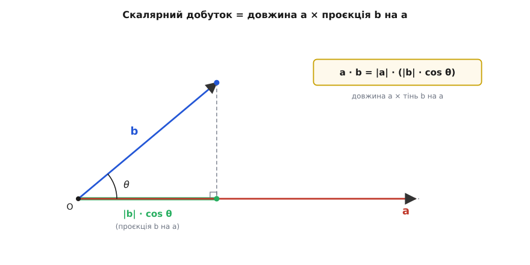

# Скалярний добуток

Два вектори можна скласти — і дістати третій вектор. Можна помножити вектор на число — знову вектор. Але чи можна **перемножити два вектори**? Виявляється, найкорисніше множення віддає не вектор, а одне-єдине число — скаляр. І це число відповідає на питання, яке постійно виникає в фізиці й обробці даних: **наскільки два напрями «згодні» один з одним?** Дві сили тягнуть в один бік чи борються? Сигнал схожий на еталон чи ні? Вектор лежить уздовж осі чи впоперек? На всі ці питання відповідає одна операція — скалярний добуток.

У неї дві зовсім різні на вигляд формули. Одна — суто арифметична: перемнож відповідні складові й додай. Друга — суто геометрична: довжина на довжину на косинус кута між ними. Дивовижно, що це **те саме число**. Розібратися, чому дві такі несхожі формули завжди збігаються, — і означає по-справжньому зрозуміти скалярний добуток. З цього збігу виростає вся його користь: ми рахуємо легкою арифметичною формулою, а **читаємо** результат геометричною мовою кутів і проєкцій.

## Дві формули одного числа

Почнемо з означення через складові — воно найпростіше для обчислення. Якщо два вектори задані складовими (про те, як стрілка перетворюється на набір чисел, — у статті [складові вектора](topic:math-algebra/vector-components)), то їхній скалярний добуток (англ. *dot product*, від крапки `·` в записі; також *scalar product* — бо результат є скаляром) — це сума попарних добутків складових:

```
a · b = aₓ·bₓ + a_y·b_y           (на площині)
a · b = aₓ·bₓ + a_y·b_y + a_z·b_z  (у просторі)
```

Перемножуємо «ікс на ікс», «ігрек на ігрек», складаємо. Результат — одне число. Зверніть увагу, що множимо лише **однойменні** складові: x-частина одного вектора зустрічається тільки з x-частиною другого. Чому саме так, а не «всі з усіма», стане ясно за хвилину — і це не випадковість, а наслідок того, що осі перпендикулярні.

Тепер друга формула — геометрична. Той самий скалярний добуток дорівнює добутку довжин обох векторів на косинус кута θ між ними:

```
a · b = |a| · |b| · cos θ
```

Тут |a| і |b| — довжини (модулі) векторів, а θ — кут між їхніми напрямами, коли їх поставити з однієї точки. Жодних складових — лише довжини й кут. І це **те саме число**, що дала перша формула. Два описи однієї величини: один зручний для комп'ютера (склав-перемножив), другий зручний для розуміння (довжини й кут).

Перш ніж доводити їхню рівність, варто відчути, що кожна формула осмислена сама по собі. Перша очевидно дає число й легко рахується. Друга одразу показує **зміст**: якщо вектори дивляться в один бік (θ = 0, cos θ = 1), добуток найбільший і додатний; якщо перпендикулярні (θ = 90°, cos θ = 0) — добуток нуль; якщо в протилежні боки (θ = 180°, cos θ = −1) — найбільший за модулем, але від'ємний. Знак добутку каже про **узгодженість** напрямів: плюс — гострий кут, тягнуть разом; мінус — тупий кут, борються; нуль — перпендикуляр, не заважають одне одному.

> 🔧 **Навіщо це.** Прошивка ніколи не зберігає «кут між векторами» — вона зберігає складові. Тому кут добувають саме зі скалярного добутку: порахували `a·b` арифметично за першою формулою, поділили на `|a||b|` — і дістали cos θ, а з нього й сам кут. Перевірити, чи давач дивиться приблизно туди ж, куди вектор сили тяжіння (тобто чи плата лежить горизонтально), — це один скалярний добуток і одне порівняння знаку. Жодної тригонометрії «в лоб».

## Чому обидві формули дають те саме

Збіг двох формул — не визначення «бо так домовились», а **доказова теорема**. Її варто пройти на очах, бо саме звідси видно, чому скалярний добуток поводиться так, як поводиться. Будемо будувати з першопричини — із самих базисних векторів.

Розклад будь-якого вектора за базисом — це **a** = aₓ·**î** + a_y·**ĵ**, де **î** і **ĵ** — одиничні вектори вздовж осей x і y (це показано в статті [складові вектора](topic:math-algebra/vector-components)). Тепер припустимо лише дві природні властивості скалярного добутку, які він мусить мати, щоб взагалі заслуговувати назву «множення»:

```
(1) розподільність:  (u + v) · w = u·w + v·w
(2) винесення числа:  (k·u) · v = k·(u·v)
```

Обидві — це просто вимога, щоб множення розкривалося покладинно, як звичні дужки в алгебрі. Якщо ми хочемо, щоб геометрична формула |a||b|cos θ слухалася цих правил (а вона слухається — перевіряється прямо через закон косинусів нижче), то решта виводиться сама. Підставмо розклади обох векторів і розкриймо дужки:

```
a · b = (aₓ·î + a_y·ĵ) · (bₓ·î + b_y·ĵ)
      = aₓ·bₓ·(î·î) + aₓ·b_y·(î·ĵ)
      + a_y·bₓ·(ĵ·î) + a_y·b_y·(ĵ·ĵ)
```

Усе зводиться до чотирьох скалярних добутків базисних векторів між собою. А їх легко порахувати **геометричною** формулою, бо для **î** і **ĵ** довжини й кути відомі точно:

```
î·î = |î||î|cos 0°  = 1·1·1 = 1     (вектор сам із собою, кут 0)
ĵ·ĵ = 1·1·1        = 1
î·ĵ = |î||ĵ|cos 90° = 1·1·0 = 0     (перпендикулярні осі!)
ĵ·î = 0
```

Ось де ховається вся суть. Однойменні базисні вектори дають 1, різнойменні — **0, бо осі перпендикулярні**. Підставмо ці чотири числа назад:

```
a · b = aₓ·bₓ·1 + aₓ·b_y·0 + a_y·bₓ·0 + a_y·b_y·1
      = aₓ·bₓ + a_y·b_y
```

Два мішані доданки занулилися, і лишилася рівно перша формула — сума добутків однойменних складових. Тепер видно відповідь на питання, відкладене раніше: складові множаться «однойменна з однойменною», а не «всі з усіма», саме тому, що добуток перпендикулярних осей дорівнює нулю. Перпендикулярність базису — не технічна дрібниця, а та причина, чому арифметична формула така коротка.

Лишилося замкнути коло — переконатися, що геометрична формула |a||b|cos θ справді підкоряється розподільності, з якої ми стартували. Найчистіший спосіб — закон косинусів. Поставмо **a** і **b** з однієї точки; вектор **a** − **b** з'єднує їхні кінці й замикає трикутник зі сторонами |a|, |b|, |a − b|. Закон косинусів для цього трикутника:

```
|a − b|² = |a|² + |b|² − 2·|a|·|b|·cos θ
```

З іншого боку, ту саму довжину |a − b|² можна розписати через складові, бо квадрат довжини — це скалярний добуток вектора самого на себе (адже **a**·**a** = |a||a|cos 0 = |a|²):

```
|a − b|² = (a − b)·(a − b)
         = a·a − 2·(a·b) + b·b      ← розкрили за розподільністю
         = |a|² − 2·(a·b) + |b|²
```

Прирівняймо два вирази для |a − b|²:

```
|a|² + |b|² − 2·|a||b|cos θ = |a|² − 2·(a·b) + |b|²
```

Однакові |a|² і |b|² скорочуються з обох боків, і лишається точно:

```
a · b = |a| · |b| · cos θ
```

Коло замкнулося. Геометрична формула не суперечить розподільності — вона з неї випливає, і навпаки. Дві формули — це два боки однієї монети: означення через складові дає **спосіб порахувати**, означення через кут дає **спосіб зрозуміти**, а закон косинусів — місток, що доводить їхню тотожність.

## Геометричний зміст: проєкція

Найкорисніше прочитання скалярного добутку — через **проєкцію**. Перепишемо геометричну формулу, згрупувавши інакше:

```
a · b = |a| · (|b| · cos θ)
```

Вираз |b|·cos θ — це довжина **тіні**, яку вектор **b** відкидає на напрям вектора **a**, коли світло падає перпендикулярно до **a**. Це і є проєкція **b** на **a**: наскільки далеко **b** «просувається» в напрямі **a**. Тоді весь скалярний добуток читається так: **проєкція одного вектора на другий, помножена на довжину другого**.


*Скалярний добуток як проєкція: |b|·cos θ — довжина тіні вектора **b** на напрямі **a** (катет прямокутного трикутника, прилеглий до кута θ). Помножена на |a|, ця тінь і дає a·b. Коли θ тупий, тінь падає в протилежний бік і проєкція стає від'ємною.*

Звідси одразу видно три речі, які роблять скалярний добуток таким зручним інструментом.

**Знак каже про напрям проєкції.** Якщо кут гострий, тінь падає в той самий бік, що й **a**, проєкція додатна — добуток додатний. Якщо тупий, тінь лягає назад, проєкція від'ємна — добуток від'ємний. Скалярний добуток — це детектор «попутно чи проти».

**Нуль означає перпендикулярність.** Коли θ = 90°, вектор **b** не має жодної тіні на **a** — він увесь поперек. Проєкція нульова, добуток нульовий. Це працює і навпаки: якщо `a·b = 0` (а самі вектори ненульові), то cos θ = 0, отже вектори **ортогональні** (грец. *orthós* — прямий + *gōnía* — кут). Перевірка перпендикулярності зводиться до однієї арифметичної дії — порахувати суму добутків складових і глянути, чи вийшов нуль. Не треба ні кутів, ні тригонометрії.

**Можна добути сам кут.** Якщо поділити добуток на обидві довжини, лишиться чистий косинус:

```
cos θ = (a · b) / (|a| · |b|)
```

Це найпряміший спосіб дізнатися кут між двома напрямами, заданими числами. А якщо обидва вектори заздалегідь зробити одиничної довжини (поділити кожен на його модуль — це називають **нормуванням**), то знаменник стає одиницею і скалярний добуток **сам дорівнює косинусу кута**. Саме так найчастіше й роблять, коли важливий лише напрям, а не довжина.

> 🔧 **Навіщо це.** Освітлення в 3D-графіці й машинному зорі тримається на цьому. Яскравість точки поверхні дорівнює скалярному добутку нормалі поверхні (куди дивиться площинка) на напрям до джерела світла — обидва нормовані. Косинус кута падіння і є частка світла: площинка дивиться прямо на лампу (добуток ≈ 1) — яскраво; під кутом — тьмяно; відвернулась (добуток ≤ 0) — у тіні. Один скалярний добуток на піксель замість будь-яких кутів. Так само в керуванні: щоб дізнатися, чи нахилена плата і куди, рахують скалярний добуток виміряного вектора тяжіння на вертикаль.

## Властивості, що випливають самі

Із суми добутків складових усі алгебраїчні властивості скалярного добутку видно без зусиль — вони успадковуються від звичайного множення чисел.

**Симетричність:** `a·b = b·a`. У сумі aₓ·bₓ + a_y·b_y можна переставити множники в кожному доданку — бо числа множаться комутативно. Порядок векторів не впливає на результат. У геометричній формі це теж очевидно: кут між **a** і **b** той самий, що між **b** і **a**.

**Розподільність:** `a·(b + c) = a·b + a·c`. Та сама властивість, з якої ми стартували в доказі; на рівні складових вона — звичайне розкриття дужок. Саме вона дозволяє розкладати складні вирази й робить скалярний добуток сумісним із додаванням векторів.

**Зв'язок із довжиною:** `a·a = |a|²`. Вектор, помножений сам на себе, дає квадрат власної довжини, бо кут із самим собою нульовий і cos 0 = 1. Звідси `|a| = √(a·a)` — довжина вектора є просто корінь зі скалярного добутку його на себе. Це не випадковий факт, а той самий Піфагор: `a·a = aₓ² + a_y²`. Скалярний добуток і поняття довжини — нерозривні; по суті, довжина **означується** через скалярний добуток.

**Винесення числа:** `(k·a)·b = k·(a·b)`. Розтягнули один вектор удвічі — добуток подвоївся. Очевидно зі складових: спільний множник k виноситься за суму.

Ці чотири властивості — не набір правил для зазубрювання, а прямі наслідки означення. Знаючи лише, що скалярний добуток є сума добутків складових, кожну з них можна відновити за пів хвилини.

## Де працює

Скалярний добуток корисний усюди, де треба звести два напрями до одного числа «наскільки вони згодні». Три приклади з зовсім різних галузей показують, що це **одна** ідея під різними масками.

**Робота сили (фізика).** Коли сила тягне тіло, корисна лише та її частина, що збігається з напрямом руху; складова поперек руху роботи не виконує. Це слово в слово означення проєкції — і робота дорівнює скалярному добутку вектора сили на вектор переміщення:

```
A = F · s = |F| · |s| · cos θ
```

Тягнеш санчата за мотузку під кутом θ до землі — працює тільки горизонтальна частина сили, і cos θ це враховує автоматично. Штовхаєш строго вздовж руху (θ = 0) — уся сила в діло. Несеш вантаж горизонтально, а сила тяжіння тягне вниз (θ = 90°) — робота тяжіння нульова, бо рух перпендикулярний силі. Якби фізика не мала скалярного добутку, його довелося б вигадати саме для означення роботи.

**Кореляція (статистика й обробка сигналів).** Уявімо два набори вимірів як два вектори з багатьма складовими — по складовій на кожен відлік. Їхній скалярний добуток (після віднімання середнього й нормування) — це **коефіцієнт кореляції**: число від −1 до +1, що каже, наскільки два сигнали схожі. Це той самий cos θ, лише у просторі великої вимірності, де стрілку вже не намалюєш, а формула працює без змін. Плюс одиниця — сигнали ідуть нога в ногу; нуль — незалежні (ортогональні!); мінус одиниця — дзеркальні. Розпізнавання шаблону, пошук еталона в записі, оцінка подібності — усе це скалярні добутки. Метод [найменших квадратів](topic:math-probability/least-squares), що шукає найкраще наближення, теж стоїть на цій геометрії ортогональності.

**Проєкції (геометрія, графіка, керування).** Будь-яке розкладання вектора «на складову вздовж напряму й складову поперек нього» робиться скалярним добутком. Частка **b** уздовж одиничного напряму **û** — це число (b·û); сам вектор-проєкція — це (b·û)·**û**. Так знаходять, скільки швидкості спрямовано до цілі, як відбити м'яч від стіни (розклавши швидкість на нормальну й дотичну до стіни складові), як прибрати з вектора непотрібну компоненту. Скалярний добуток — основний інструмент, коли вектор треба «розкласти за напрямами».

Спільне в усіх трьох — те, що дві стрілки (чи два набори чисел) стискаються в одне число, яке несе саме **узгодженість напрямів**. Це доповнює інше множення векторів — [векторний добуток](topic:math-algebra/cross-product), який, навпаки, міряє не збіг, а **розмах** між напрямами (площу й перпендикуляр) і віддає вектор, а не скаляр. Дві операції відповідають на протилежні питання: скалярний — «наскільки вздовж?», векторний — «наскільки впоперек?».

---

**Умова.** Робот їде з вектором швидкості **v** = (3, 4) (м/с) у системі координат поля. Ціль лежить у напрямі, що задається вектором **d** = (1, 0) (строго вздовж осі x). Яка складова швидкості спрямована до цілі та під яким кутом робот відхиляється від потрібного напряму?

```
Крок 1. Скалярний добуток (сума добутків складових):
  v · d = 3·1 + 4·0 = 3

Крок 2. Довжини обох векторів:
  |v| = √(3² + 4²) = √25 = 5 м/с
  |d| = √(1² + 0²) = 1            (одиничний — задає чистий напрям)

Крок 3. Проєкція швидкості на напрям до цілі:
  v_до_цілі = (v · d) / |d| = 3 / 1 = 3 м/с
  (з 5 м/с повної швидкості до цілі йдуть лише 3)

Крок 4. Косинус і кут відхилення:
  cos θ = (v · d) / (|v|·|d|) = 3 / (5·1) = 0.6
  θ = arccos(0.6) ≈ 53.13°
```

**Висновок.** Робот рухається на 53° убік від цілі; уздовж потрібного напряму йдуть лише 3 з 5 м/с, решта швидкості витрачається «вбік». Щоб їхати прямо на ціль, контролер має довернути курс так, щоб скалярний добуток зрівнявся з |v| (тоді cos θ = 1).

Той самий розрахунок у реальному C-коді для мікроконтролера (C99, `<math.h>`):

:::tabs
```c
#include <math.h>

typedef struct { float x, y; } Vec2;

float dot(Vec2 a, Vec2 b) {        /* скалярний добуток */
    return a.x * b.x + a.y * b.y;
}

float magnitude(Vec2 a) {          /* довжина = корінь з a·a */
    return sqrtf(dot(a, a));
}

/* кут між векторами у радіанах, чверть-незалежно */
float angle_between(Vec2 a, Vec2 b) {
    float c = dot(a, b) / (magnitude(a) * magnitude(b));
    if (c >  1.0f) c =  1.0f;      /* затиск проти похибки округлення */
    if (c < -1.0f) c = -1.0f;      /* інакше acosf поверне NaN */
    return acosf(c);
}
```
```python
import math


def dot(a, b):                     # скалярний добуток
    return a[0] * b[0] + a[1] * b[1]


def magnitude(a):                  # довжина = корінь з a·a
    return math.sqrt(dot(a, a))


def angle_between(a, b):           # кут між векторами у радіанах
    c = dot(a, b) / (magnitude(a) * magnitude(b))
    c = max(-1.0, min(1.0, c))     # затиск проти похибки округлення,
    return math.acos(c)            # інакше acos кине ValueError
```
:::

Дві пастки тут реальні, не вигадані. По-перше, `dot(a, a)` для довжини — не `a.x*a.x + a.y*a.y` руками: переписувати вже наявну формулу — зайвий шанс на одрук. По-друге, затиск косинуса в межі [−1, 1] обов'язковий: через скінченну точність `float` частка може вийти, скажімо, 1.0000001, і тоді `acosf` поверне NaN, який тихо отруїть весь подальший розрахунок. Один `if` рятує від важковловного збою керування.

## Стисло про головне

Скалярний добуток стискає два вектори в одне число, яке міряє узгодженість їхніх напрямів. Рахують його сумою добутків однойменних складових — швидко й без тригонометрії; а **читають** як |a||b|cos θ — мовою довжин і кута. Те, що ці дві формули дають те саме число, не випадковість: воно випливає з розподільності множення і з того, що базисні осі перпендикулярні (їхній взаємний добуток нульовий), а замикає доказ закон косинусів.

Уся практична сила йде звідси. Знак добутку каже, гострий кут чи тупий — тягнуть вектори разом чи проти. Нуль означає ортогональність — і це найдешевша перевірка перпендикулярності, яка існує. Поділивши добуток на довжини, дістають косинус кута; на нормованих векторах добуток і **є** косинус. Саме тому одна коротка операція описує і роботу сили, і кореляцію сигналів, і проєкцію вектора на напрям: усюди питання насправді одне — **наскільки два напрями збігаються**.
