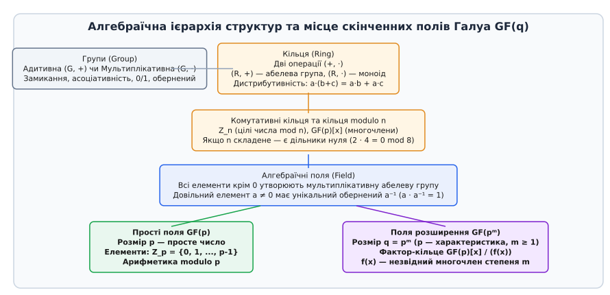
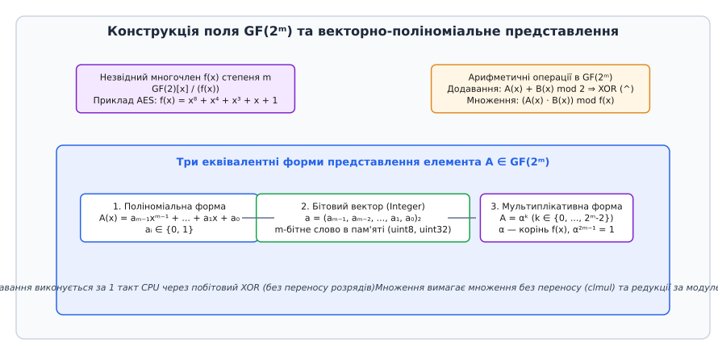
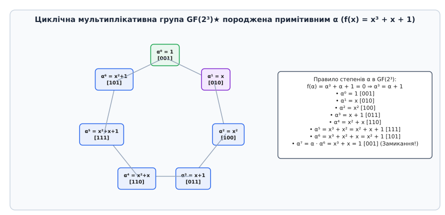
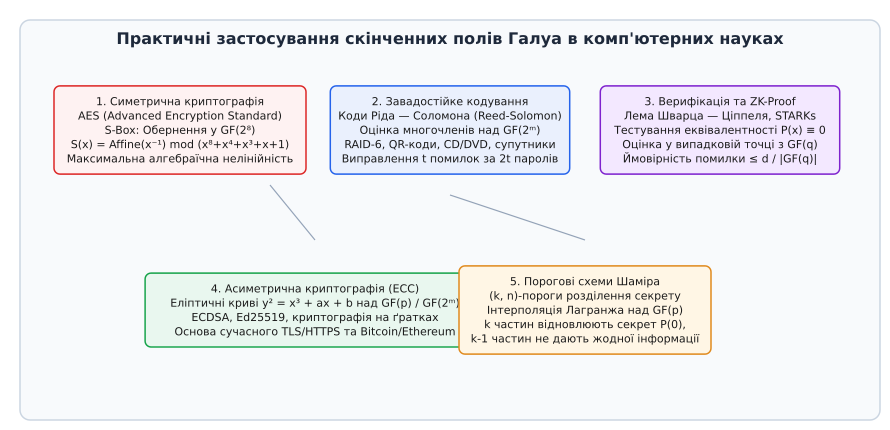

# Скінченні поля (поля Галуа)

<preknowlist>
- [Теорія груп](topic:math-algebra/group-theory) — абелеві та циклічні групи, порядок елемента, теорема Лагранжа.
- [Кільця та ідеали](topic:math-algebra/rings) — комутативні кільця, фактор-кільця, незвідні многочлени.
- [Асимптотична складність](topic:computability/asymptotic-complexity) — O-нотація та часова складність арифметичних алгоритмів.
- [Інтерполяція Лагранжа](topic:math-numeric/lagrange-interpolation) — побудова многочленів за точками.
</preknowlist>

У цифрових обчислювальних системах, апаратних криптопроцесорах та мережевих протоколах передачі даних спроба виконувати арифметичні операції над обчислювально нескінченними полями дійсних чисел `R` або комплексних чисел `C` наражається на обмеження фізичної реалізації: накопичення помилок округлення у форматі з плаваючою комою (IEEE 754) та неможливість точного представлення довільних дробів у скінченній кількості бітів. З іншого боку, звичайна целочисельна арифметика за модулем складеного числа `n` (у кільці `Z_n`, наприклад `Z_{256}` для 8-бітних байтів) втрачає фундаментальну алгебраїчну властивість — можливість виконувати ділення. Наприклад, у кільці `Z_8` вираз `2 · 4 = 0 (mod 8)` створює дільники нуля, через що елемент 2 не має мультиплікативно оберненого елемента, а рівняння `2 · x = 2 (mod 8)` має декілька нееквівалентних розв'язків (`x = 1` та `x = 5`).

Для побудови надійних завадостійких кодів (Reed-Solomon, BCH), симетричної криптографії (криптостандарт AES), криптосистем на еліптичних кривих (ECC) та протоколів доведення з нульовим розголошенням (ZK-STARKs) обчислювальна наука вимагає дискретних алгебраїчних структур, які поєднують скінченну кількість елементів із повноцінною аксіоматикою поля, де кожне рівняння вида `a · x = b` при `a ≠ 0` має єдиний і точний розв'язок. Творцем цієї теорії став французький геній Еваріст Галуа, який довів існування та побудував точну конструкцію **скінченних полів** (полів Галуа), позначуваних `GF(q)`.

Детальний аналіз історичного шляху відкриття скінченних полів, біографію Еваріста Галуа та хронологію впровадження полів Галуа у цифровий світ викладено у вставці [📜 Історія відкриття скінченних полів та спадщина Еваріста Галуа](topic:math-algebra/finite-field-arithmetic/hist-galois-fields.md).

## 1. Аксиоматика та класифікація скінченних полів

Алгебраїчне **поле (англ. *field*)** являє собою множину `F` із двома бінарними операціями — додаванням `+` та множенням `·`, які задовольняють дев'яти фундаментальним аксіомам:

1. **Замкненість:** Для будь-яких `a, b ∈ F` результати `a + b ∈ F` та `a · b ∈ F`.
2. **Комутативність:** `a + b = b + a` та `a · b = b · a`.
3. **Асоціативність:** `(a + b) + c = a + (b + c)` та `(a · b) · c = a · (b · c)`.
4. **Дистрибутивність:** `a · (b + c) = a · b + a · c`.
5. **Нейтральний елемент додавання (Нуль):** Існує `0 ∈ F` такий, що `a + 0 = a`.
6. **Нейтральний елемент множення (Одиниця):** Існує `1 ∈ F` (`1 ≠ 0`) такий, що `a · 1 = a`.
7. **Адитивно обернений елемент:** Для кожного `a ∈ F` існує `-a ∈ F` такий, що `a + (-a) = 0`.
8. **Мультиплікативно обернений елемент:** Для кожного ненульового `a ∈ F` (`a ≠ 0`) існує `a⁻¹ ∈ F` такий, що `a · a⁻¹ = 1`.

Якщо множина `F` є скінченною, то вона називається **скінченним полем**. Кількість елементів `q = |F|` називається **порядком (кардинальністю)** поля.


*Ієрархія алгебраїчних структур: від загальних груп та кілець до простих полів GF(p) та полів розширення GF(pᵐ).*

### Характеристика поля

Для будь-якого поля `F` можна розглянути послідовність елементів `1, 1+1, 1+1+1, ...`. Якщо існує найменше додатне ціле число `p` таке, що:

```
p · 1 = 1 + 1 + ... + 1  [p разів]
      = 0
```

то це число `p` називається **характеристикою поля** `char(F) = p`. Якщо такого додатного числа не існує (як у полі дійсних чисел `R`), кажуть, що поле має характеристику 0.

> **Важливий факт.** Характеристика будь-якого скінченного поля обов'язково є **простим числом** `p`. Припустимо протилежне: `p = a · b`, де `1 < a, b < p`. Тоді `(a · 1) · (b · 1) = p · 1 = 0`. Оскільки у полі немає дільників нуля, або `a · 1 = 0`, або `b · 1 = 0`, що суперечить мінімальності `p`.

### Прості поля GF(p) та арифметика за модулем p

Найпростішим прикладом скінченного поля є множина лишків від ділення цілих чисел на просте число `p`:

```
Z_p = {0, 1, 2, ..., p - 1}
```

Коли `p` є простим числом, кільце `Z_p` перетворюється на скінченне просте поле **`GF(p)`**. 

Додавання, віднімання та множення в `GF(p)` виконуються за звичайними правилами цілочисельної арифметики з подальшим взяттям залишку за модулем `p`:

```
a + b = (a_int + b_int) mod p
a · b = (a_int · b_int) mod p
```

Оскільки `p` — просте число, кожен ненульовий елемент `a ∈ {1, ..., p - 1}` є взаємно простим із `p` (`gcd(a, p) = 1`). За Малою теоремою Ферма, `a^{p-1} ≡ 1 (mod p)`, звідки мультиплікативно обернений елемент обчислюється як:

```
a⁻¹ ≡ a^{p-2}  (mod p)
```

Альтернативно, `a⁻¹` обчислюється за `O(log p)` кроків за допомогою Розширеного алгоритму Евкліда для цілих чисел: `u · a + v · p = 1 ⇒ a⁻¹ = u mod p`.

### Класифікаційна теорема існування та єдиності

Фундаментальна теорема класифікації скінченних полів (теорема Мура) повністю описує можливі порядки та алгебраїчну структуру скінченних полів:

1. **Порядок поля є степенем простого числа:** Порядок `q` будь-якого скінченного поля обов'язково дорівнює `q = pᵐ`, де `p` — просте число (характеристика поля), а `m ≥ 1` — ціле число (степінь розширення).
2. **Теорема існування:** Для кожного простого числа `p` та кожного цілого `m ≥ 1` існує принаймні одне скінченне поле порядку `pᵐ`.
3. **Теорема єдиності:** Усі скінченні поля одного і того самого порядку `q = pᵐ` є алгебраїчно **ізоморфними** між собою (`GF(pᵐ) ≅ F_{pᵐ}`).

У залежності від степеня `m` скінченні поля поділяються на два класи:
- **Прості поля `GF(p)` (при `m = 1`):** Складаються з `p` елементів і реалізуються як кільце лишків за модулем простого числа `Z_p = {0, 1, ..., p-1}`.
- **Поля розширення `GF(pᵐ)` (при `m > 1`):** Складаються з `pᵐ` елементів і будуються як фактор-кільця многочленів за модулем незвідного многочлена степеня `m` над полем `GF(p)`. Особливо важливими для обчислювальної техніки є **дволакунарні (двійкові) поля розширення `GF(2ᵐ)`**, де характеристика `p = 2`.

Повне строге доведення теорем існування, єдиності та алгебраїчної структури фактор-кілець наведено у вставці [𝔮 Строге доведення існування, єдиності та алгебраїчної структури GF(p^m)](topic:math-algebra/finite-field-arithmetic/math-field-extensions.md).

## 2. Конструкція полів розширення GF(p^m) через багаточлени

У той час як прості поля `GF(p)` легко реалізуються через целочисельну арифметику modulo `p`, комп'ютери працюють з бітовими реєстрами розміром 8, 16, 32 або 64 біти. Для створення полів, розмір яких строго збігається з потужністю байта чи машинного слова (`2⁸ = 256`, `2⁶⁴`), використовується конструкція полів розширення `GF(pᵐ)`.

Просте число 2 є єдиною характеристикою, де додавання й віднімання збігаються. Проте звичайне кільце `Z_{2ᵐ}` (наприклад `Z_{256}`) не є полем, бо парні числа не мають оберненого елемента. Щоб усунути дільники нуля, Галуа запропонував перейти від цілих чисел до кільця багаточленів.

Для побудови поля `GF(pᵐ)` розглядається кільце многочленів `GF(p)[x]`, коефіцієнти яких належать простому полю `GF(p)`. 

Формально **незвідним многочленом (англ. *irreducible polynomial*)** `f(x) ∈ GF(p)[x]` степеня `m` називається многочлен, який неможливо розкласти у добуток двох многочленів меншого степеня `g(x) · h(x)` з коефіцієнтами з `GF(p)`. Незвідний многочлен у кільці многочленів відіграє таку саму роль, як просте число у кільці цілих чисел `Z`.

Поле розширення `GF(pᵐ)` конструюється як фактор-кільце:

```
GF(pᵐ) ≅ GF(p)[x] / (f(x))
```


*Конструкція поля розширення GF(2ᵐ) через фактор-кільце за незвідним многочленом f(x) та двоїсте представлення елементів у формі многочлена, бітового вектора та степеня α.*

### Три еквівалентні форми представлення елементів GF(p^m)

Будь-який елемент `A` скінченного поля `GF(pᵐ)` має три взаємопов'язані форми представлення, які застосовуються у залежності від обчислювального контексту:

1. **Поліноміальна форма (Polynomial Basis):**
   Елемент `A` представляється як многочлен `A(x)` степеня строго меншого за `m`:

```
A(x) = aₘ₋₁·xᵐ⁻¹ + aₘ₋₂·xᵐ⁻² + ... + a₁·x + a₀
```

   де коефіцієнти `aᵢ ∈ GF(p) = {0, 1, ..., p-1}`.

2. **Векторна / Бітова форма (Bit Vector):**
   У двійковому полі `GF(2ᵐ)` коефіцієнти `aᵢ ∈ {0, 1}` відповідають бітам цілого числа. Елемент представляється вектором довжиною `m` бітів:

```
a = (aₘ₋₁, aₘ₋₂, ..., a₁, a₀)₂ ∈ {0, 1}ᵐ
```

   Наприклад, у полях `GF(2⁸)` елемент являє собою один байт (`uint8_t`), у `GF(2⁶⁴)` — 64-бітне слово (`uint64_t`).

3. **Мультиплікативна (Степінева) форма:**
   Елемент представляється як степінь `αᵏ` примітивного елемента `α` поля (`k ∈ {0, 1, ..., pᵐ-2}`), доповнена нульовим елементом.

### Арифметика в двійкових полях GF(2^m)

Арифметика у полях `GF(2ᵐ)` володіє унікальними властивостями, що робить її надзвичайно ефективною для апаратної реалізації у мікросхемах FPGA/ASIC та сучасних процесорах.

- **Додавання та віднімання:**
  Оскільки характеристика поля `p = 2`, то в `GF(2)` виконується тотожність `1 + 1 = 0`, що означає `-a = a`. Звідси операції додавання та віднімання в `GF(2ᵐ)` є тотожними і виконуються як побітовий **XOR (`^`)** над векторними представленнями без переносів між розрядами:

```
A(x) + B(x) = ∑ᵢ₌₀ᵐ⁻¹ (aᵢ ⊕ bᵢ) · xⁱ
```

  Ця операція виконується за **1 такт CPU** для довільної розрядності входу.

- **Множення:**
  Множення двох елементів `A(x)` та `B(x)` складається з двох послідовних етапів:
  1. *Поліноміальне множення без переносу (Carryless Multiplication):* Обчислення добутку `C'(x) = A(x) · B(x)`, що дає многочлен степеня щонайбільше `2m - 2`.
  2. *Редукція за модулем незвідного многочлена `f(x)`:* Обчислення залишку від ділення `C(x) = C'(x) mod f(x)` степеня `< m`.

  У процесорній архітектурі x86-64 для цієї операції реалізовано апаратну векторну інструкцію `PCLMULQDQ` (у кодовій базі ARM — `PMULL`), яка обчислює безпереносний добуток 64-бітних слів за один системний такт.

## 3. Мультиплікативна структура та примітивні елементи

У той час як адитивна структура поля `GF(pᵐ)` є елементарною абелевою групою ізоморфною `(Z_p)ᵐ`, мультиплікативна структура ненульових елементів підпорядковується фундаментальній теоремі про циклічність.

> **Теорема про циклічність мультиплікативної групи.** Множина всіх ненульових елементів поля `GF(q)* = GF(q) \ {0}` відносно операції множення утворює **циклічну групу** порядку `q - 1 = pᵐ - 1`.

Це означає, що у полі `GF(q)` обов'язково існує щонайменше один елемент `α` (називаний **примітивним елементом** або **порошувачем** поля), степені якого повністю вичерпують усі ненульові елементи поля:

```
GF(q)* = {α⁰, α¹, α², ..., α^{q-2}}
```

При цьому `α^{q-1} = α⁰ = 1`. Загальна кількість примітивних елементів у полі `GF(q)` дорівнює значенням функції Ейлера `φ(q - 1)`.


*Циклічна мультиплікативна група GF(2³)* порядку 7, породжена примітивним елементом α (коренем незвідного многочлена f(x) = x³ + x + 1). Граф показує цикл степеней α⁰ ... α⁶ та замикання α⁷ = 1.*

### Примітивні многочлени проти незвідних

Важливо розрізняти незвідні та примітивні многочлени:
- **Незвідний многочлен `f(x)`:** Не розкладається у добуток менших многочленів над `GF(p)`. Створює коректне поле `GF(pᵐ)`.
- **Примітивний многочлен `f(x)`:** Незвідний многочлен, корінь якого `α` є примітивним елементом (породжує усю мультиплікативну групу `GF(pᵐ)*`).

Наприклад, у полях `GF(2⁸)` канонічний багаточлен AES `f(x) = x⁸ + x⁴ + x³ + x + 1` (0x11B) є незвідним, але його корінь `x` (`0x02`) має порядок 51 (не є примітивним). Проте елемент `α = x + 1` (`0x03`) має порядок 255 і породжує всю мультиплікативну групу `GF(2⁸)*`.

### Таблиці Зеха (Log / Exp) та швидке множення O(1)

Завдяки циклічності групи `GF(q)*` довільний ненульовий елемент `a ∈ GF(q)*` можна однозначно подати у вигляді дискретного логарифма за основою примітивного елемента `α`:

```
a = α^{i}  ⇒  i = log_α(a),  де 0 ≤ i ≤ q - 2
```

Застосування цієї властивості дозволяє звести складне поліноміальне множення та ділення до простих операцій додавання та віднімання індексів у таблиці дискретних логарифмів:

```
A · B = α^{log_α(A)} · α^{log_α(B)} = α^{(log_α(A) + log_α(B)) mod (q-1)}
A / B = α^{log_α(A) - log_α(B) mod (q-1)}
```

Для малих полів (таких як `GF(2⁸)` у AES) розробники предобчислюють два масиви в оперативній пам'яті розміром 256 байтів:
- `exp_table[i] = αⁱ` (Таблиця антилогарифмів / експонент);
- `log_table[a] = log_α(a)` (Таблиця дискретних логарифмів).

Завдяки цим таблицям операції множення та ділення в `GF(2⁸)` виконуються за константний час `O(1)` через 3 звернення до пам'яті.

## 4. Алгоритми знаходження оберненого елемента

Операція знаходження мультиплікативно оберненого елемента `a⁻¹` (така, що `a · a⁻¹ = 1 mod f(x)`) є найважчою базовою арифметичною операцією у скінченних полях. Її обчислювальна складність визначає швидкодію побудови S-блоків шифрування та обчислення точки на еліптичній кривій.

В теорії алгоритмів застосовуються три основні методи обчислення оберненого елемента:

### 1. Розширений алгоритм Евкліда для многочленів (Polynomial EEA)
Оскільки `f(x)` є незвідним многочленом, а `A(x) ≠ 0` має степінь `deg(A) < m`, їхній найбільший спільний дільник `gcd(A(x), f(x)) = 1`. 
Розширений алгоритм Евкліда шукає многочлени `U(x)` та `V(x)` такі, що:

```
U(x) · A(x) + V(x) · f(x) = 1
```

Переходячи за модулем `f(x)`, отримуємо `A⁻¹(x) = U(x) mod f(x)`. 
- **Часова складність:** `O(m²)` бітових операцій.
- **Особливість:** Потребує змінної кількості ітерацій у залежності від коефіцієнтів, тому у сирій формі не є константним за часом (уразливий до атак по побічних каналах таймінгу).

### 2. Мала теорема Ферма (Exponentiation Inversion)
За теоремою Лагранжа для скінченної групи `GF(q)*` порядку `q - 1`, будь-який ненульовий елемент `a` задовольняє рівності `a^{q-1} = 1`. Помноживши обидві частини на `a⁻¹`, отримуємо:

```
a⁻¹ = a^{q-2} = a^{pᵐ - 2}
```

У двійковому полі `GF(2ᵐ)` обернений елемент дорівнює:

```
a⁻¹ = a^{2ᵐ - 2}
```

Обчислення піднесення до степеня виконується через алгоритм піднесення у квадрат та множення (англ. *square-and-multiply*).
- **Часова складність:** `O(m)` поліноміальних множень.
- **Перевага:** Строго константний час виконання (захист від хронометричних атак).

### 3. Алгоритм Іто — Цуджії (Itoh-Tsujii Algorithm)
Алгоритм Іто — Цуджії (1988) оптимізує метод Ферма у полях `GF(2ᵐ)`, використовуючи ланцюги додавання (англ. *addition chains*) для зменшення кількості загальних поліноміальних множень. 

Використовуючи тотожність `2ᵐ - 2 = (2^{m-1} - 1) · 2`, алгоритм зводить обчислення степеня `2^{m-1} - 1` до комбінації операцій піднесення до квадрата (які в нормальному базисі є безкоштовним цикличним зсувом) та `O(log m)` загальних множень.

Детальні програмні реалізації всіх цих алгоритмів мовами C та C++ подано у вставці [⚙️ Практична реалізація арифметики полів Галуа GF(2^m)](topic:math-algebra/finite-field-arithmetic/proj-galois-field-arithmetic.md).

## 5. Базиси представлення та апаратна реалізація

Вибір базису для представлення елементів розширення `GF(pᵐ)` фундаментально впливає на продуктивність алгоритмів у програмних та апаратних середовищах.

### Поліноміальний (стандартний) базис (Polynomial Basis)
Елементи представляються у базисі `{1, x, x², ..., xᵐ⁻¹}`.
- **Переваги:** Проста реалізація у програмному забезпеченні, природне відображення на векторні інструкції CPU (`PCLMULQDQ`, `AVX-512`, `ARM NEON`).
- **Недоліки:** Операція піднесення до квадрата вимагає повноцінного множення та редукції за модулем `f(x)`.

### Нормальний базис (Normal Basis)
**Нормальним базисом** поля `GF(pᵐ)` над `GF(p)` називається базис вигляду:

```
N = {β, βᵖ, β^{p²}, ..., β^{pᵐ⁻¹}}
```

де `β ∈ GF(pᵐ)` — спеціально обраний елемент, степені Фробеніуса якого є лінійно незалежними.

- **Головна апаратна перевага:** У нормальному базисі піднесення елемента до квадрата `A²` у полях `GF(2ᵐ)` виконується як **циклічний зсув бітового вектора на 1 позицію вправо**:

```
A = (a₀, a₁, a₂, ..., aₘ₋₁)  ⇒  A² = (aₘ₋₁, a₀, a₁, ..., aₘ₋₂)
```

  У цифровій схемотехніці (ASIC/FPGA) циклічний зсув реалізується простою перекомутацією провідників (англ. *hardwired routing*) з **нульовою часовою затримкою (0 тактів)** та нульовими витратами площі кристала!

Оптимальні нормальні базиси (ONB I та ONB II) застосовуються у стандартах еліптичної криптографії (NIST B-283, B-409, B-571) для прискорення обчислень у криптопроцесорах.

## 6. Практичні застосування у кодуванні, криптографії та теорії складності

Скінченні поля Галуа формують математичну основу для ключових технологій сучасного цифрового суспільства.


*Карта застосувань скінченних полів: симетричне шифрування AES, коди Ріда — Соломона, еліптична криптографія, порогові схеми та ZK-доведення.*

### 1. Криптографічний стандарт AES (Advanced Encryption Standard)
У криптографічному стандарті AES (Rijndael) обробка даних здійснюється над байтами, які розглядаються як елементи поля `GF(2⁸)` за незвідним модулем:

```
f(x) = x⁸ + x⁴ + x³ + x + 1  (0x11B)
```

Центральна нелінійна операція **SubBytes (S-Box)** обчислює мультиплікативно обернений елемент `x⁻¹` у полі `GF(2⁸)` (з `0⁻¹ = 0`), після чого застосовує афінне перетворення над полем `GF(2)`:

```
S(x) = M · x⁻¹ ⊕ b
```

де `M` — фіксована дволакунарна матриця розміром 8×8 бітів, а `b = 0x63`. Завдяки властивостям інверсії у полі Галуа, S-Box має максимально можливу алгебраїчну нелінійність (диференціальна рівномірність 4), що робить AES абсолютно стійким до лінійного та диференціального криптоаналізу.

### 2. Завадостійке кодування Ріда — Соломона (Reed-Solomon Codes)
Коди Ріда — Соломона є блоковими кодами виправлення помилок, побудованими на оцінці многочленів над скінченним полем `GF(q)`.

Інформаційний блок із `k` символів `(m₀, m₁, ..., m_{k-1})` представляється як многочлен `M(x) = ∑ mᵢ · xⁱ`. Кодер обчислює значення `M(x)` у `n` різних точках поля `α₁, α₂, ..., α♙ ∈ GF(q)`. За теоремою про єдиність інтерполяційного многочлена, два різні многочлени степеня `< k` можуть збігатися щонайбільше у `k - 1` точках. 

Декодування коду Ріда — Соломона виконується через обчислення синдромів помилок `S_i = Y(α^i)`, обчислення локатора помилок `Λ(x)` через алгоритм Берлекампа — Мессі, знаходження коренів через процедуру пошуку Ченя та обчислення амплітуд помилок за формулою Форні.

Коди Ріда — Соломона є **максимально рознесеними кодами (MDS-кодами)** і здатні виправляти до `t = (n - k) / 2` довільних помилок або до `n - k` втрат (стирань) символів. Вони застосовуються у:
- Компакт-дисках (CD, DVD, Blu-ray);
- Штрих-кодах QR-Code та DataMatrix;
- Дискових масивах підвищеної надійності RAID-6 (обчислення контрольних сум P та Q за допомогою двох контрольних матриць у `GF(2⁸)`);
- Супутниковому та космічному зв'язку NASA / ESA.

### 3. Порогові схеми розділення секрету Шаміра (Shamir Secret Sharing)
У порогових схемах розділення секрету `(k, n)` секрет `S` ховається у вільному коефіцієнті випадкового багаточлена степеня `k - 1` над скінченним простим полем `GF(p)`:

```
P(x) = S + a₁·x + a₂·x² + ... + a_{k-1}·x^{k-1}  (mod p)
```

Кожен із `n` учасників отримує одну пару `(x_i, P(x_i))`. Будь-які `k` учасників можуть об'єднатися і за допомогою [інтерполяції Лагранжа](topic:math-numeric/lagrange-interpolation) точно відновити многочлен `P(x)` та отримати секрет `S = P(0)`. Будь-яка група з `k - 1` або менше учасників не отримує **жодної** інформації про секрет `S` (доведена інформаційно-теоретична стійкість за Клодом Шенноном).

### 4. Алгебраїчна складність, лема Шварца — Ціппеля та ZK-STARKs
У теорії обчислювальної складності скінченні поля використовуються для імовірнісної верифікації тотожностей.

> **Лема Шварца — Ціппеля (Schwartz-Zippel Lemma).** Нехай `P(x₁, x₂, ..., xₙ)` є ненульовим многочленом багатьох змінних степеня `d` над скінченним полем `GF(q)`. Якщо значення змінних `r₁, r₂, ..., r♙` обираються незалежно та рівномірно випадково з підмножини `S ⊆ GF(q)`, то ймовірність того, що многочлен обнулиться у цій точці, обмежена:

```
Pr[ P(r₁, r₂, ..., r♙) = 0 ] ≤ d / |S|
```

Лема Шварца — Ціппеля дозволяє перевіряти еквівалентність складних алгебраїчних схем за `O(1)` оцінок у випадковій точці поля `GF(q)`, що лежить в основі імовірнісних алгоритмів перевірки комбінаторних матриць (алгоритм Фрейвальдса), інтерактивних систем доведення (`IP = PSPACE`, протокол LFKN) та сучасних доведень з нульовим розголошенням (ZK-STARKs).

У новітніх криптографічних системах ZK-STARKs використовуються спеціальні "швидкі" поля великого порядку, такі як поле **Goldilocks** (`p = 2⁶⁴ - 2³² + 1`) або поле **Baby Bear** (`p = 2³¹ - 2²⁷ + 1`), які оптимізовані під 64-бітну арифметику сучасних процесорів і забезпечують мільйони перевірок доведень на секунду.

Специфікацію виробничого C/C++ API для маніпуляцій з елементами скінченних полів, структури даних та аналіз швидкодії наведено у вставці [📋 Інтерфейс та специфікація C/C++ бібліотеки для GF(2^8) та GF(2^m)](topic:math-algebra/finite-field-arithmetic/api-galois-field.md).
