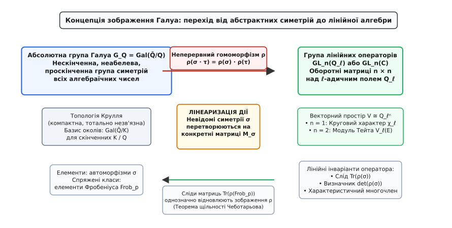
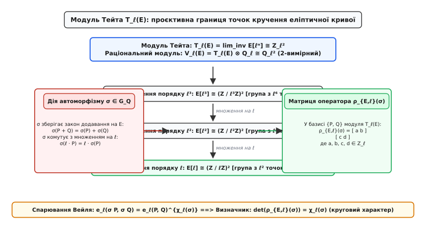
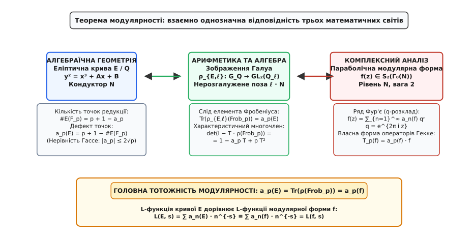
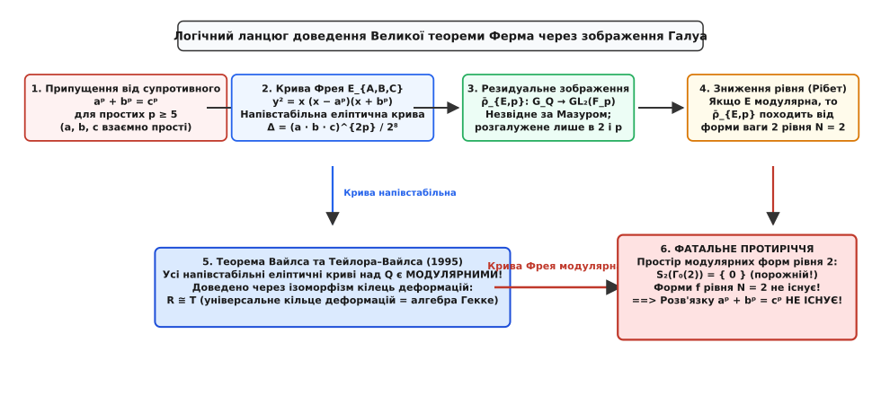

# Зображення Галуа

<preknowlist>
- [Група Ґалуа](root:math-algebra/galois-group) — автоморфізми полів розкладу, перестановка коренів та розв'язність рівнянь.
- [Автоморфізм Фробеніуса](root:math-algebra/frobenius-automorphism) — канонічна симетрія скінченних полів та піднесення до степеня p.
- [Кругові поля](root:math-algebra/cyclotomic-fields) — корені з одиниці, їхні мінімальні многочлени та абелеві розширення.
- [Групи, підгрупи й теорема Лагранжа](root:math-algebra/group-theory) — структури груп, гомоморфізми та дії на множинах.
- [Дуальний простір](root:math-algebra/dual-space) — векторні простори над полями, лінійні оператори та канонічні базиси.
</preknowlist>

Коли ми вивчаємо окремий многочлен, наприклад `x³ − 2 = 0`, його симетрії утворюють скінченну групу перестановок коренів. Проте раціональні числа `Q` породжують нескінченний океан усіх можливих алгебраїчних чисел — поле `Q̄`, що містить корені абсолютно всіх многочленів із раціональними коефіцієнтами. Симетрії цього океану утворюють єдину універсальну структуру — **абсолютну групу Галуа** `G_Q = Gal(Q̄/Q)`. Вона містить у собі інформацію про кожне алгебраїчне рівняння, кожну числову конфігурацію та кожну діофантову задачу, яка коли-небудь виникала в математиці.

Спроба описати цю групу напряму через перестановки нескінченної множини чисел натрапляє на нездоланний бар'єр: `G_Q` є незліченною, неабелевою і володіє складною неперервною топологією. В ній неможливо скласти таблицю множення чи виписати генератори.

Вихід із цього глухого кута підказала лінійна алгебра: замість дослідження абстрактних перестановок нескінченної множини ми змушуємо елементи групи діяти як лінійні оператори на векторних просторах. Невідомі автоморфізми перетворюються на звичайні квадратні матриці з числами, а їхні сліди, визначники та власні значення стають точними числовими спектрами числових полів. Такий міст між абстрактною симетрією та лінійною алгеброю називають **зображенням Галуа**.


*Зображення Галуа перетворює нескінченну проскінченну групу симетрій у групу лінійних операторів.*

### Абсолютна група Галуа та топологія Крулля

Поле всіх алгебраїчних чисел `Q̄` є нескінченним розширенням поля раціональних чисел `Q`. Будь-яке скінченне розширення Галуа `K / Q` (поле розкладу деякого скінченного многочлена) вкладається в `Q̄`.

Абсолютна група Галуа `Gal(Q̄/Q)` складається з усіх автоморфізмів `σ: Q̄ → Q̄`, які зберігають операції додавання, множення і залишають на місці кожне раціональне число:

```
σ(x + y) = σ(x) + σ(y)      [збереження додавання]
σ(x · y) = σ(x) · σ(y)      [збереження множення]
σ(q) = q  для кожного q ∈ Q [фіксація базового поля]
```

Оскільки кожне алгебраїчне число належить якомусь скінченному розширенню Галуа `K / Q`, будь-який автоморфізм `σ ∈ Gal(Q̄/Q)` повністю визначається своєю узгодженою дією на всі скінченні підполя `K`. Якщо `K₁ ⊆ K₂` — два скінченні розширення Галуа над `Q`, то існує природний гомоморфізм обмеження:

```
res_{K₂, K₁}: Gal(K₂/Q) → Gal(K₁/Q)      [звуження автоморфізму з більшого поля на менше]
```

Ці гомоморфізми перетворюють сім'ю скінченних груп Галуа на проєктивну систему. Абсолютна група Галуа є **проєктивною границею** (інверсною границею) цієї системи:

```
Gal(Q̄/Q) = lim_inv Gal(K/Q)      [границя за всіма скінченними розширеннями Галуа K/Q]
```

Групи, отримані як проєктивні границі скінченних груп, називають **проскінченними групами** (англ. *profinite groups*).

На абсолютній групі Галуа задають природну топологію — **топологію Крулля** (на честь Вольфганга Крулля). Базис відкритих околів одиничного автоморфізму `e` утворюють підгрупи вигляду:

```
U_K = Gal(Q̄/K) = { σ ∈ Gal(Q̄/Q) : σ(α) = α  для всіх α ∈ K }
```

де `K / Q` пробігає всі скінченні розширення Галуа. Базис відкритих множин усієї групи складається з усіх суміжних класів `σ · Gal(Q̄/K)`.

Топологія Крулля наділяє `Gal(Q̄/Q)` трьома вирішальними властивостями:
1. **Компактність**: будь-яке відкрите покриття містить скінченне підпокриття (наслідок теореми Тихонова про добуток скінченних дискретних просторів).
2. **Хаусдорфовість**: будь-які два різні автоморфізми `σ ≠ τ` розділяються неперетинними відкритими околами (завжди існує таке число `α ∈ Q̄`, що `σ(α) ≠ τ(α)`).
3. **Тотальна незв'язність**: єдиними зв'язними підмножинами є поодинокі точки. Простір `Gal(Q̄/Q)` гомеоморфний канторовому дисконтинууму.

У нескінченній теорії Галуа класична відповідність між полями та підгрупами зберігається у формі фундаментальної теореми: існує взаємно однозначна антиізоморфна відповідність між **усіма проміжними підполями** `E` (`Q ⊆ E ⊆ Q̄`) та **замкненими підгрупами** `H ≤ Gal(Q̄/Q)`:

```
E ↦ Gal(Q̄/E)
H ↦ Q̄ᴴ = { x ∈ Q̄ : σ(x) = x  для всіх σ ∈ H }
```

При цьому скінченним розширенням `[E : Q] < ∞` відповідають відкриті підгрупи (які в компактному просторі є автоматично замкненими підгрупами скінченного індексу), тоді як нескінченним розширенням відповідають замкнені підгрупи нескінченного індексу.

У топологічній групі головну роль відіграють не абстрактні гомоморфізми, а **неперервні відображення**. Якщо топологічний простір `X` має дискретну топологію, то будь-яке неперервне відображення `f: Gal(Q̄/Q) → X` має відкрите ядро, а отже, факторизується через деяку скінченну групу Галуа `Gal(K/Q)`. Проте якщо простір прибуття сам має недискретну `p`-адичну топологію, відкриваються принципово нові можливості.

### Від абстрактних симетрій до лінійних операторів

Нехай `G_Q = Gal(Q̄/Q)` — абсолютна група Галуа, і нехай `V` — скінченновимірний векторний простір над топологічним полем `E`.

**Зображенням Галуа** називають неперервний гомоморфізм груп:

```
ρ: G_Q → GL(V) ≅ GL_n(E)
```

де `GL_n(E)` — група оборотних матриць розміру `n × n` з коефіцієнтами з поля `E`, наділена природною топологією матричних елементів. Число `n = dim_E(V)` називають **розмірністю** (або степенем) зображення.

Вибір цільового поля `E` визначає тип і глибину інформації, яку здатне вловити зображення:

1. **Комплексні зображення (`E = C`) — зображення Артіна**:
   Поле комплексних чисел `C` з евклідовою метрикою має топологічну властивість: у групі `GL_n(C)` існує окіл одиниці, який не містить жодної нетривіальної підгрупи (так звана *лема про відсутність малих підгруп*). 
   Оскільки ядро `Ker(ρ)` неперервного гомоморфізму з компактної групи `G_Q` має бути відкритою підгрупою, образ `Im(ρ)` обов'язково є **скінченною підгрупою** в `GL_n(C)`. За теоремою Жордана про скінченні лінійні групи такі зображення факторизуються через скінченні групи Галуа `Gal(K/Q)`. Комплексні зображення Артіна описують скінченні числові розширення і лежать в основі класичних L-функцій Артіна, але не здатні охопити нескінченні арифметичні вежі.

2. **Модулярні (резидуальні) зображення (`E = F_p`)**:
   Зображення над скінченним полем `F_p` діють на векторних просторах `(F_p)ⁿ`. Оскільки поле `F_p` скінченне і дискретне, такі зображення завжди мають скінченний образ і описують поля розкладу точок `p`-кручення. Вони виникають як редукція `p`-адичних зображень за модулем `p` і є фундаментальним інструментом у вивченні деформацій Галуа.

3. **`ℓ`-адичні зображення (`E = Q_ℓ`)**:
   Поле `ℓ`-адичних чисел `Q_ℓ` (де `ℓ` — фіксоване просте число) містить компактне відкрите підкільце цілих `ℓ`-адичних чисел `Z_ℓ`. Група `GL_n(Z_ℓ)` володіє нескінченною спадною системою відкритих нормальних підгруп (головних конгруенц-підгруп):
   ```
   U_k = I + ℓᵏ · M_n(Z_ℓ) = { M ∈ GL_n(Z_ℓ) : M ≡ I (mod ℓᵏ) }
   ```
   Ці підгрупи утворюють базу околів одиниці. Завдяки цьому образ неперервного гомоморфізму `ρ: G_Q → GL_n(Q_ℓ)` може бути **нескінченною компактною `ℓ`-адичною групою Лі**.

Саме `ℓ`-адичні зображення Галуа виявилися універсальною мовою сучасної теорії чисел: вони вбирають у себе нескінченні послідовності алгебраїчних розширень, не втрачаючи неперервності.

### p-адична теорія Годжа: анатомія локальних зображень

Коли ми розглядаємо локальне зображення `ρ: Gal(Q̄_p / Q_p) → GL_n(Q_p)`, де просте число поля збігається з характеристикою коефіцієнтів зображення, виникає тонка геометрія. Жан-Марк Фонтен побудував систему так званих **кілець періодів Фонтена**: `B_{HT}` (кільце Годжа — Тейта), `B_{dR}` (кільце де Рама), `B_{crys}` (кристалічне кільце) та `B_{st}` (напівстабільне кільце).

Ці кільця дозволяють класифікувати `p`-адичні зображення за ступенем їхньої алгебраїчної регулярності:

1. **Кристалічні зображення (crystalline representations)**:
   Простір `D_{crys}(V) = (V ⊗_{Q_p} B_{crys})^{G_{Q_p}}` має повну розмірність `n`. Такі зображення виникають від етальних когомологій алгебраїчних многовидів із доброю редукцією за модулем `p`. Вони не мають внутрішнього розгалуження і володіють лінійним оператором Фробеніуса на просторі `D_{crys}(V)`.

2. **Напівстабільні зображення (semistable representations)**:
   Простір `D_{st}(V) = (V ⊗_{Q_p} B_{st})^{G_{Q_p}}` має розмірність `n`. Вони виникають від многовидів із напівстабільною редукцією (як-от крива Фрея) і несуть додатковий нільпотентний оператор монодромії `N: D_{st}(V) → D_{st}(V)`.

3. **Зображення де Рама (de Rham representations)**:
   Простір `D_{dR}(V) = (V ⊗_{Q_p} B_{dR})^{G_{Q_p}}` має розмірність `n` і наділений спадною фільтрацією Годжа. За теоремою Фальтінгса будь-яке зображення Галуа, що походить від геометрії алгебраїчного многовиду, обов'язково є зображенням де Рама.

4. **Зображення Годжа — Тейта**:
   Розпадаються на пряму суму скруток кругового характеру: `V ⊗ C_p ≅ ⨁ C_p(k_i)`. Набір цілих чисел `(k₁, k₂, ..., k_n)` називають **вагами Годжа — Тейта**. Для еліптичної кривої ці ваги строго дорівнюють `(0, 1)`.

### 1-вимірний еталон: круговий характер

Найпростішим, але абсолютно фундаментальним прикладом є 1-вимірне зображення, що описує симетрії коренів з одиниці.

Нехай `ℓ` — фіксоване просте число. Розглянемо для кожного натурального `n ≥ 1` групу коренів степеня `ℓⁿ` з одиниці в алгебраїчному замиканні `Q̄`:

```
μ_{ℓⁿ} = { ζ ∈ Q̄ : ζ^{ℓⁿ} = 1 }
```

Ця група є циклічною групою порядку `ℓⁿ`. Об'єднання всіх таких груп утворює нескінченну квазіциклічну групу Прюфера:

```
μ_{ℓ^∞} = ⋃_{n=1}^∞ μ_{ℓⁿ}
```

Нехай `σ ∈ G_Q` — довільний автоморфізм. Якщо `ζ ∈ μ_{ℓⁿ}`, то:

```
(σ(ζ))^{ℓⁿ} = σ(ζ^{ℓⁿ}) = σ(1) = 1      [образ кореня з одиниці знову є коренем того самого степеня]
```

Оскільки `σ` зберігає порядок елемента, дія автоморфізму на первісний корінь `ζ` полягає у піднесенні його до деякого степеня `c_n(σ)`:

```
σ(ζ) = ζ^{c_n(σ)},   де c_n(σ) ∈ (Z / ℓⁿZ)×      [оборотний елемент кільця лишків]
```

Узгодженість дій на різних поверхах вежі `μ_{ℓ} ⊂ μ_{ℓ²} ⊂ μ_{ℓ³} ...` означає, що при переході від `n+1` до `n` число `c_{n+1}(σ)` переходить у `c_n(σ)` за модулем `ℓⁿ`.

Переходячи до проєктивної границі за всіма `n`:

```
lim_inv (Z / ℓⁿZ)× = Z_ℓ× = GL₁(Z_ℓ)      [група оборотних елементів цілих ℓ-адичних чисел]
```

ми отримуємо неперервний гомоморфізм, який називають **`ℓ`-адичним круговим характером** (англ. *cyclotomic character*):

```
χ_ℓ: G_Q → Z_ℓ× ⊂ GL₁(Q_ℓ)
```

Для будь-якого кореня `ζ ∈ μ_{ℓ^∞}` закон дії автоморфізму `σ` записується формулою:

```
σ(ζ) = ζ^{χ_ℓ(σ)}      [круговий характер точно задає фазовий зсув коренів з одиниці]
```

Круговий характер `χ_ℓ` має вирішальні числові значення на ключових елементах:
1. На елементі комплексної спряженості `c ∈ G_Q` (який переводить `ζ = e^{2π i / ℓⁿ}` у `ζ̄ = ζ⁻¹`):
   ```
   χ_ℓ(c) = −1      [комплексне спряження діє як множення на −1 у групі Z_ℓ×]
   ```
2. На елементі Фробеніуса `Frob_p` для простого числа `p ≠ ℓ` (який за модулем `p` збігається з піднесенням до степеня `p`):
   ```
   χ_ℓ(Frob_p) = p      [значення характеру на Фробеніусі точно дорівнює самому простому числу p]
   ```

Круговий характер `χ_ℓ` відіграє роль фундаментального калібрувального масштабу: через нього визначаються визначники вищих зображень Галуа та операції алгебраїчного зсуву ваги — **скрутка Тейта** `V(k) = V ⊗ χ_ℓ^k`.

### Конкретний розрахунок: дія кругового характеру на корені 5-го степеня

Розглянемо кругове поле `Q(μ₅)`, утворене приєднанням первісного кореня `ζ₅ = e^{2π i / 5}`. Мінімальним многочленом числа `ζ₅` над `Q` є круговий многочлен:

```
Φ₅(x) = x⁴ + x³ + x² + x + 1 = 0
```

Група Галуа `Gal(Q(μ₅)/Q)` ізоморфна мультиплікативній групі лишків `(Z / 5Z)× ≅ Z₄`. Вона породжується єдиним автоморфізмом `σ₂`, який підносить корінь до квадрата: `σ₂(ζ₅) = ζ₅²`.

Знайдемо матриці кругового характеру `χ₅` на елементах Фробеніуса для малих простих чисел:

1. Для простого числа `p = 2`:
   `Frob₂` діє на корені як `ζ₅ ↦ ζ₅² = σ₂(ζ₅)`.
   Значення кругового характеру: `χ₅(Frob₂) = 2 ∈ Z₅×`.
   Оскільки `2` є первісним коренем за модулем 5, елемент `Frob₂` породжує всю групу Галуа `Gal(Q(μ₅)/Q)`.

2. Для простого числа `p = 3`:
   `Frob₃` діє на корені як `ζ₅ ↦ ζ₅³ = σ₂³(ζ₅)`.
   Значення кругового характеру: `χ₅(Frob₃) = 3 ∈ Z₅×`.

3. Для простого числа `p = 7`:
   Оскільки `7 ≡ 2 (mod 5)`, автоморфізм `Frob₇` діє абсолютно так само, як `Frob₂`: `ζ₅ ↦ ζ₅⁷ = ζ₅²`.
   Значення кругового характеру в 5-адичних цілих числах дорівнює `χ₅(Frob₇) = 7 = 2 + 1·5 ∈ Z₅×`.

Цей розрахунок наочно демонструє, як одне й те саме аналітичне число `p` виступає одночасно і значенням матричного характеру `χ₅(Frob_p) = p`, і степенем циклічної перестановки коренів многочлена.

### 2-вимірні зображення та модулі Тейта еліптичних кривих

Як побудувати нетривіальне 2-вимірне зображення абсолютної групи Галуа? Джерелом таких просторів є **еліптичні криві**.

Еліптична крива `E` над полем `Q` задається кубічним рівнянням Вейєрштрасса:

```
y² = x³ + A·x + B,   де A, B ∈ Q,  а дискримінант Δ = −16 · (4A³ + 27B²) ≠ 0
```

Множина точок кривої з координатами з `Q̄` разом із нескінченно віддаленою точкою `O` утворює абелеву групу щодо геометричного закону додавання хорд і дотичних.


*Проєктивна вежа точок кручення породжує 2-вимірний вільний ℓ-адичний модуль.*

Зафіксуємо просте число `ℓ`. Розглянемо групу точок `ℓⁿ`-кручення:

```
E[ℓⁿ] = { P ∈ E(Q̄) : ℓⁿ · P = O }
```

З комплексної теорії відомо, що над полем комплексних чисел `C` еліптична крива ізоморфна тору `C / Λ`, де `Λ = Z·ω₁ ⊕ Z·ω₂` — двовимірна ґратка періодів. Точки кручення порядку `ℓⁿ` відповідають точкам ґратки `(1/ℓⁿ)·Λ / Λ`. Звідси над алгебраїчним замиканням `Q̄` група точок кручення ізоморфна прямій сумі двох циклічних груп:

```
E[ℓⁿ] ≅ (Z / ℓⁿZ) ⊕ (Z / ℓⁿZ)      [двовимірний простір кручення порядку ℓⁿ]
```

Групи `E[ℓⁿ]` утворюють проєктивну систему щодо відображень множення на `ℓ`:

```
... ──>[·ℓ]──> E[ℓ³] ──>[·ℓ]──> E[ℓ²] ──>[·ℓ]──> E[ℓ] ──>[·ℓ]──> {O}
```

Проєктивна границя цієї системи називається **модулем Тейта** еліптичної кривої `E`:

```
T_ℓ(E) = lim_inv E[ℓⁿ] ≅ Z_ℓ ⊕ Z_ℓ = Z_ℓ²      [вільний модуль рангу 2 над Z_ℓ]
```

Помноживши модуль Тейта на поле `Q_ℓ`, отримуємо 2-вимірний векторний простір:

```
V_ℓ(E) = T_ℓ(E) ⊗_{Z_ℓ} Q_ℓ ≅ Q_ℓ²      [раціональний модуль Тейта]
```

Оскільки коефіцієнти рівняння кривої та формули додавання точок раціональні, будь-який автоморфізм `σ ∈ G_Q` переводить точку `P = (x, y)` у точку `σ(P) = (σ(x), σ(y))`, зберігаючи додавання:

```
σ(P + Q) = σ(P) + σ(Q)
```

Автоморфізм `σ` діє як лінійний оператор на вільному модулі `T_ℓ(E) ≅ Z_ℓ²`. Вибравши базис `{P, Q}` у `T_ℓ(E)`, ми записуємо дію `σ` у вигляді матриці 2 × 2:

```
ρ_{E,ℓ}(σ) = [ a(σ)  b(σ) ]
             [ c(σ)  d(σ) ]    де a, b, c, d ∈ Z_ℓ
```

Це задає неперервне 2-вимірне `ℓ`-адичне зображення Галуа:

```
ρ_{E,ℓ}: G_Q → GL₂(Z_ℓ) ⊂ GL₂(Q_ℓ)
```

Знаменита **теорема Серра про відкритий образ** (1972 рік) стверджує: якщо еліптична крива `E` над `Q` не має комплексного множення (non-CM), то образ зображення `ρ_{E,ℓ}(G_Q)` є відкритою підгрупою в `GL₂(Z_ℓ)` для всіх `ℓ`, а для майже всіх простих чисел `ℓ` зображення на точках кручення першого рівня `E[ℓ]` є сюр'єктивним:

```
ρ̄_{E,ℓ}(G_Q) = GL₂(F_ℓ)      [максимально можлива група симетрій точок кручення]
```

Повну алгебраїчну структуру модуля Тейта, властивості кососиметричного спарювання Вейля `e_ℓ: T_ℓ(E) × T_ℓ(E) → T_ℓ(μ)` та строге виведення того, що визначник матриці в точності дорівнює круговому характеру:

```
det(ρ_{E,ℓ}(σ)) = χ_ℓ(σ)
```

можна знайти в окремому математичному виведенні про [алгебру модуля Тейта, спарювання Вейля та многочлен Фробеніуса](root:math-algebra/galois-representations/math-tate-module-properties.md).

### Конкретний розрахунок: матриці Галуа для кривої з комплексним множенням

Розглянемо класичну еліптичну криву Гаусса:

```
E: y² = x³ − x
```

Ця крива має дискримінант `Δ = 64` і володіє комплексним множенням на кільце гауссових цілих чисел `Z[i]`, де ендоморфізм `[i]` діє як `[i](x, y) = (−x, i·y)`.

Знайдемо поведінку точок 2-кручення `E[2]`. Вони задовольняють рівняння `y = 0`, тобто `x³ − x = x(x − 1)(x + 1) = 0`. Отже, коренями є:

```
P₁ = (0, 0),   P₂ = (1, 0),   P₃ = (−1, 0)
```

Усі три точки 2-кручення мають раціональні координати. Це означає, що абсолютна група Галуа `G_Q` діє на `E[2]` абсолютно тривіально:

```
ρ̄_{E,2}(σ) = [ 1  0 ]
             [ 0  1 ]   для всіх σ ∈ G_Q
```

Тепер дослідимо дію елементів Фробеніуса `Frob_p` на модулі Тейта `T_ℓ(E)`:

1. **Просте число `p ≡ 1 (mod 4)`** (наприклад, `p = 5`):
   Число 5 розкладається в кільці `Z[i]` на добуток двох спряжених простих множників: `5 = (−1 + 2i) · (−1 − 2i)`.
   Ендоморфізм Фробеніуса в кільці `End(E) ≅ Z[i]` з умовою нормування `π ≡ 1 (mod (1 + i)³)` ототожнюється з числом `π = −1 + 2i`.
   Слід оператора Фробеніуса:
   ```
   a₅(E) = π + π̄ = (−1 + 2i) + (−1 − 2i) = −2
   ```
   Кількість точок над `F₅`: `#E(F₅) = 5 + 1 − (−2) = 8`.
   Характеристичний многочлен: `det(I − T · ρ(Frob₅)) = 1 + 2T + 5T²`.

2. **Просте число `p ≡ 3 (mod 4)`** (наприклад, `p = 3`):
   Число 3 залишається простим (інертним) у кільці `Z[i]`.
   Тому ендоморфізм Фробеніуса задовольняє `ϕ₃² = −3`, звідки його слід строго дорівнює нулю:
   ```
   a₃(E) = 0      [суперсингулярна редукція кривої за модулем 3]
   ```
   Кількість точок над `F₃`: `#E(F₃) = 3 + 1 − 0 = 4`.
   Характеристичний многочлен: `det(I − T · ρ(Frob₃)) = 1 + 3T²`.

Цей приклад виразно демонструє, як арифметика розкладу простих чисел у числових кільцях безпосередньо керує слідами та спектрами матриць зображення Галуа.

### Розгалуження, інерція та ейлерові множники L-функцій

Головна сила зображень Галуа полягає в тому, що вони містять у собі вичерпну інформацію про редукцію алгебраїчних об'єктів за всіма простими модулями `p`.

Нехай `p` — просте число. В абсолютній групі Галуа `G_Q` виберемо простий ідеал `p̄` кільця цілих чисел `Q̄`, що лежить над `p`. Підгрупу автоморфізмів, які зберігають цей простий ідеал, називають **групою розкладу** `D_p ⊂ G_Q` (вона канонічно ізоморфна локальній абсолютній групі Галуа `Gal(Q̄_p / Q_p)`).

Всередині `D_p` існує спадна фільтрація розгалуження:
1. **Підгрупа інерції** `I_p`: автоморфізми, що діють тривіально на полі лишків:
   ```
   I_p = { σ ∈ D_p : σ(x) ≡ x (mod p̄)  для всіх цілих x ∈ Q̄ }
   ```
2. **Підгрупа дикого розгалуження** `P_p ⊂ I_p`: єдина про-`p`-силівська підгрупа в `I_p`. Факторгрупа `I_p / P_p ≅ ∏_{q ≠ p} Z_q` відповідає слабкому (ручному) розгалуженню (tame ramification).

Факторгрупа групи розкладу за підгрупою інерції є канонічно ізоморфною групі Галуа скінченного поля лишків:

```
D_p / I_p ≅ Gal(F̄_p / F_p)
```

Група `Gal(F̄_p / F_p)` є проциклічною і породжується єдиним канонічним автоморфізмом — **арифметичним автоморфізмом Фробеніуса** `x ↦ xᵖ`. Його обернений елемент `x ↦ x^{1/p}` називають **геометричним Фробеніусом**. Його прообраз у групі `D_p` називають **елементом Фробеніуса** `Frob_p ∈ G_Q`.

Зображення Галуа `ρ: G_Q → GL_n(Q_ℓ)` називають **нерозгалуженим у простому числі `p`** (англ. *unramified at p*), якщо підгрупа інерції діє тривіально:

```
ρ(I_p) = { I }      [матриці інерції є одиничними]
```

Якщо зображення нерозгалужене в `p`, то оператор `ρ(Frob_p)` визначений абсолютно однозначно як клас спряженості в групі матриць.

Для еліптичної кривої `E` з дискримінантом `Δ` теорема Нерона — Оґґа — Шафаревича стверджує: зображення `ρ_{E,ℓ}` є нерозгалуженим у кожному простому числі `p`, яке не ділить добуток `ℓ · Δ`. Тобто для майже всіх простих чисел `p` зображення є нерозгалуженим.

Характеристичний многочлен матриці `ρ_{E,ℓ}(Frob_p)` має вигляд:

```
det(I − T · ρ_{E,ℓ}(Frob_p)) = 1 − a_p(E) · T + p · T²
```

де слід матриці `Tr(ρ_{E,ℓ}(Frob_p)) = a_p(E)` виражається через суму символів Лежандра:

```
a_p(E) = −∑_{x ∈ F_p} ( (x³ + Ax + B) / p ) = p + 1 − #E(F_p)
```

За теоремою Гассе модуль сліду обмежений фундаментальною нерівністю:

```
|a_p(E)| ≤ 2√p
```

Через характеристичні многочлени зображення будується глобальна **L-функція Хассе — Вейля** еліптичної кривої `L(E, s) = ∏_p L_p(E, s)⁻¹`, де локальні ейлерові множники мають вигляд:
- для доброї редукції (`p ∤ N`): `L_p(E, s) = 1 − a_p·p^{-s} + p^{1 - 2s}`;
- для мультиплікативної редукції (`p || N`): `L_p(E, s) = 1 − a_p·p^{-s}`, де `a_p = ±1`;
- для адитивної редукції (`p² | N`): `L_p(E, s) = 1`.

Сам геометричний кондуктор кривої `N = ∏ p^{f_p}` можна обчислити безпосередньо за зображенням Галуа `ρ` як **арифметичний кондуктор Серра — Артіна**:

```
f_p = dim(V / V^{I_p}) + sw(V)      [де sw(V) — кондуктор Свана, що вимірює дике розгалуження]
```

Для ручного розгалуження кондуктор Свана дорівнює нулю `sw(V) = 0`, і показник `f_p` дорівнює дефекту розмірності простору нерухомих векторів підгрупи інерції `V^{I_p}`. При добрій редукції `V^{I_p} = V` (розмірність 2), тому `f_p = 2 − 2 = 0`. При мультиплікативній редукції простір інваріантів `V^{I_p}` є 1-вимірним, тому `f_p = 2 − 1 = 1`. При адитивній редукції `V^{I_p} = {0}`, тому `f_p ≥ 2`. Це встановлює прямий зв'язок між кондуктором рівня модулярної форми та теорією розгалуження підгруп інерції.

За **теоремою щільності Чеботарьова** класи спряженості елементів Фробеніуса `Frob_p` для всіх простих чисел `p` утворюють усюди щільну підмножину в абсолютній групі Галуа `G_Q`. Звідси випливає фундаментальний наслідок: **напівпросте зображення Галуа повністю і однозначно визначається слідами елементів Фробеніуса `Tr(ρ(Frob_p))` для майже всіх простих чисел `p`**.

### Міст між світами: Теорема модулярності

У 1950–1960-х роках Ютака Таніяма, Ґоро Сімура та Андре Вейль висунули сміливу гіпотезу, яка об'єднала алгебраїчну геометрію та комплексний аналіз.


*Взаємно однозначна відповідність між геометрією кривих, арифметикою зображень Галуа та аналізом модулярних форм.*

**Параболічною модулярною формою** ваги 2 рівня `N` називають голоморфну функцію `f(z)` на верхній комплексній півплощині `H = { z ∈ C : Im(z) > 0 }`, яка задовольняє закон симетрії відносно дробово-лінійних перетворень конгруенц-підгрупи `Γ₀(N)`:

```
f((a·z + b) / (c·z + d)) = (c·z + d)² · f(z)   для всіх [ a  b ] ∈ Γ₀(N)
                                                         [ c  d ]
```

де `c ≡ 0 (mod N)`, і яка зникає в усіх куспах (параболічних вершинах).

Будь-яка така форма має розклад у ряд Фур'є (так званий `q`-розклад, де `q = e^{2π i z}`):

```
f(z) = ∑_{n=1}^∞ a_n(f) · qⁿ = q + a₂(f)·q² + a₃(f)·q³ + a₄(f)·q⁴ + ...
```

Якщо форма `f` є власною формою операторів Гекке `T_p` і нормована так, що `a₁(f) = 1`, то її коефіцієнти Фур'є `a_p(f)` є цілими числами.

У 1970-х роках П'єр Делінь довів, що кожній такій модулярній формі `f` відповідає неперервне 2-вимірне `ℓ`-адичне зображення Галуа:

```
ρ_{f,ℓ}: G_Q → GL₂(Q_ℓ)
```

яке є нерозгалуженим для всіх `p ∤ ℓ · N`, і для якого слід елемента Фробеніуса в точності дорівнює коефіцієнту Фур'є:

```
Tr(ρ_{f,ℓ}(Frob_p)) = a_p(f)
```

Геометричний зміст цієї відповідності відкрили Мартін Ейхлер та Ґоро Сімура: вони встановили так зване **співвідношення Ейхлера — Сімури** на редукції модулярної кривої `X₀(N)` за модулем простого числа `p`. Оператор Гекке `T_p`, що діє як алгебраїчний цикл на якобіані `J₀(N)`, за модулем `p` розпадається на суму автоморфізму Фробеніуса та його транспонованого двійника:

```
T_p = Frob_p + Frob_p^*      [у кільці ендоморфізмів якобіана над полем F_p]
```

**Теорема модулярності** (доведена для напівстабільних кривих Ендрю Вайлсом і Річардом Тейлором у 1995 році, а в повному обсязі — Крістофом Брейлем, Браяном Конрадом, Фредом Даймондом та Річардом Тейлором у 2001 році) стверджує:

> Для будь-якої еліптичної кривої `E` над полем `Q` з кондуктором `N` існує єдина параболічна нова форма `f ∈ S₂(Γ₀(N))` ваги 2 і рівня `N`, така що їхні зображення Галуа ізоморфні:
> ```
> ρ_{E,ℓ} ≅ ρ_{f,ℓ}
> ```

Це означає, що для кожного простого числа `p ∤ ℓ · N` дефект кількості точок кривої над скінченним полем `F_p` строго збігається з коефіцієнтом Фур'є модулярної форми:

```
p + 1 − #E(F_p) = a_p(E) ≡ a_p(f)      [тотожність геометричного сліду й коефіцієнта Фур'є]
```

Внаслідок цього L-функція еліптичної кривої `L(E, s) = ∑ a_n(E) · n^{-s}` збігається з L-функцією модулярної форми `L(f, s) = ∑ a_n(f) · n^{-s}`, успадковуючи від неї аналітичне продовження на всю комплексну площину та функціональне рівняння.

Побачити, як працює ця рівність на практиці, порахувати сліди `a_p` для еліптичної кривої `X₀(11)` та зіставити їх із коефіцієнтами ряду добутку Дедекінда на мовах Python та C++ можна у практичному проекті про [обчислення слідів Фробеніуса та перевірку модулярності](root:math-algebra/galois-representations/proj-frobenius-trace.md).

### Велика теорема Ферма та деформації зображень Галуа

Теорема модулярності стала тим вирішальним тараном, який зламав найвідомішу математичну проблему трьох століть — Велику теорему Ферма.


*Схема зведення Великої теореми Ферма до модулярності напівстабільних еліптичних кривих.*

План доведення складався з чотирьох логічних кроків:

1. **Крива Фрея**: Припустимо від супротивного, що існують ненульові попарно взаємно прості цілі числа `a`, `b`, `c`, які задовольняють рівняння `aᵖ + bᵖ = cᵖ` для простого показника `p ≥ 5`. Без обмеження загальності можна вважати, що `a ≡ −1 (mod 4)` та `b ≡ 0 (mod 32)`.
   Ґергард Фрей побудував за цими числами допоміжну еліптичну криву:
   ```
   E: y² = x · (x − aᵖ) · (x + bᵖ)
   ```
   Ця крива є **напівстабільною** (має мультиплікативну редукцію у всіх поганих простих дільниках). Її мінімальний дискримінант дорівнює `Δ = 2⁻⁸ · (a · b · c)²ᵖ`. За формулою Оґґа кондуктор кривої дорівнює строго радикалу добутку: `N = rad(abc) = ∏_{q | abc} q`.

2. **Резидуальне зображення `ρ̄_{E,p}`**:
   Розглянемо дію Галуа на точках `p`-кручення `E[p] ≅ (F_p)²`. Вона задає резидуальне зображення:
   ```
   ρ̄_{E,p}: G_Q → GL₂(F_p)
   ```
   За теоремою Баррі Мазура про кручення це зображення є абсолютно незвідним для `p ≥ 5`. Через те, що дискримінант `Δ` є точним `p`-м степенем, показники Тейта `v_q(Δ)` для всіх непарних простих `q | abc` кратні `p`. Це призводить до того, що розгалуження зображення `ρ̄_{E,p}` у всіх непарних простих дільниках числа `abc` повністю зникає («стає плоским» у сенсі теорії скінченних плоских груп-схем Фонтена — Лаффая). Єдиними точками розгалуження лишаються прості числа 2 та `p`.

3. **Теорема Рібета про зниження рівня (ε-гіпотеза Серра)**:
   У 1986 році Кеннет Рібет довів: якщо еліптична крива `E` є модулярною, то відповідна модулярна форма рівня `N = rad(abc)` може бути замінена на модулярну форму ваги 2 з мінімальним кондуктором, де вилучено всі прості дільники, в яких зображення `ρ̄_{E,p}` є нерозгалуженим.
   Застосовуючи теорему Рібета до кривої Фрея, ми отримуємо, що резидуальне зображення `ρ̄_{E,p}` має походити від параболічної модулярної форми ваги 2 надзвичайно низького рівня — рівня `N = 2`.

4. **Протиріччя**:
   Розмірність простору параболічних модулярних форм ваги 2 рівня 2 дорівнює нулю:
   ```
   dim S₂(Γ₀(2)) = 0      [простір параболічних форм рівня 2 є порожнім: S₂(Γ₀(2)) = {0}]
   ```
   Жодної модулярної форми рівня 2 у природі не існує. Отже, крива Фрея **не може бути модулярною**.

Залишалося одне: довести, що крива Фрея **зобов'язана бути модулярною**. Оскільки крива Фрея є напівстабільною, для завершення доведення Ферма вимагалося довести модулярність усіх напівстабільних еліптичних кривих над `Q`.

Саме це здійснив Ендрю Вайлс (за участі Річарда Тейлора у фінальній частині). Стратегія Вайлса ґрунтувалася на теорії деформацій зображень Галуа.

Вайлс розглянув фіксоване резидуальне зображення `ρ̄: G_Q → GL₂(F_3)` (або за модулем 5) і побудував два фундаментальні алгебраїчні об'єкти:
- **Універсальне кільце деформацій `R`**: повне локальне нетерове кільце над кільцем цілих 3-адичних чисел `Z₃`, яке представляє функтор деформацій `D(A)` у категорії повних локальних кілець. Дотичний простір цього кільця визначається когомологіями Галуа:
  ```
  t_R ≅ Hom(m_R / (m_R² + 3), F₃) ≅ H¹_{Σ}(G_Q, Ad(ρ̄))
  ```
- **Алгебру Гекке `T`**: кільце, породжене операторами Гекке `T_n`, що діють на просторі модулярних форм відповідного рівня `S₂(Γ₀(N))`.

За універсальною властивістю простору деформацій існує канонічний сюр'єктивний гомоморфізм кілець:

```
φ: R ↠ T      [кожна модулярна деформація є алгебраїчною деформацією]
```

Головна теорема Вайлса — Тейлора полягає в доведенні того, що відображення `φ` є **ізоморфізмом кілець**:

```
R ≅ T      [теорема R = T: простір усіх деформацій Галуа збігається з простором модулярних форм]
```

Для доведення рівності `R ≅ T` Вайлс і Тейлор розробили потужний метод «систем Тейлора — Вайлса»: вони додавали до рівня допоміжні множини простих чисел `Q_n = {q₁, ..., q_r}` (де `q_i ≡ 1 (mod 3ⁿ)`), будуючи розширені кільця деформацій `R_{Q_n}` та розширені алгебри Гекке `T_{Q_n}` над кільцем формальних степеневих рядів `Z₃[[S₁, ..., S_r]]`. Контролюючи розмірності подвійних груп Сельмера `H¹(G_Q, Ad(ρ̄)^*(1))`, вони здійснили граничний патчинг модулів і довели, що числові критерії повноти перетинів Вайлса — Ленстри задовольняються абсолютно точно.

Оскільки зображення Галуа `ρ_{E,3}`, що виникає від напівстабільної еліптичної кривої `E`, є допустимою деформацією, з ізоморфізму `R ≅ T` негайно випливає, що воно належить алгебрі Гекке `T`, а отже, крива `E` є модулярною.

Крива Фрея виявилася модулярною, що спричинило фатальне протиріччя з теоремою Рібета. Це остаточно довело, що рівняння `aᵖ + bᵖ = cᵖ` не має ненульових цілих розв'язків для жодного `p ≥ 3`.

Детально дізнатися про драматичні перипетії навколо конференції в Обервольфаху, сім років таємної роботи Вайлса у принстонській мансарді та виправлення помилки в кембриджському рукописі можна в історичному нарисі про те, [як гіпотеза Таніями привела до доведення Великої теореми Ферма](root:math-algebra/galois-representations/hist-modularity-flt.md).

### Програма Ленґлендса: велика гармонія математики

Зображення Галуа еліптичних кривих стали першим переконливим тріумфом значно масштабнішого задуму — **програми Ленґлендса**, сформульованої Робертом Ленґлендсом наприкінці 1960-х років.

Програма Ленґлендса передбачає існування глобального мосту між двома колосальними областями математики:

1. **Арифметична сторона**: `n`-вимірні зображення абсолютної групи Галуа `Gal(K̄/K)` або пов'язаної з нею групи Вейля — Деліня:
   ```
   ρ: Gal(K̄/K) → GL_n(C)  або  GL_n(Q_ℓ)
   ```
2. **Аналітична сторона**: автоморфні незвідні зображення редуктивних груп лінійних перетворень аделей:
   ```
   π ⊂ L²(GL_n(A_K) / GL_n(K))
   ```

Для `n = 1` відповідність Ленґлендса збігається з класичною глобальною теорією полів класів (законом взаємності Артіна): кожному одновимірному характеру Галуа відповідає характер Діріхле або характер Гекке числових іделей.

Для `n = 2` над полем `Q` теорема модулярності є якраз втіленням відповідності Ленґлендса: 2-вимірні `ℓ`-адичні зображення еліптичних кривих відповідають автоморфним формам групи `GL₂(A_Q)`.

Сьогодні зображення Галуа є головним дослідницьким інструментом сучасної арифметичної геометрії. Через їхні матриці математики досліджують мотиви Гротендіка, гіпотезу Берча — Свіннертона-Даєра про ранг еліптичних кривих та неабелеві закони взаємності, об'єднуючи геометрію многовидів, аналіз спектрів операторів та фундаментальні властивості простих чисел у єдину цілісну картину світобудови.
