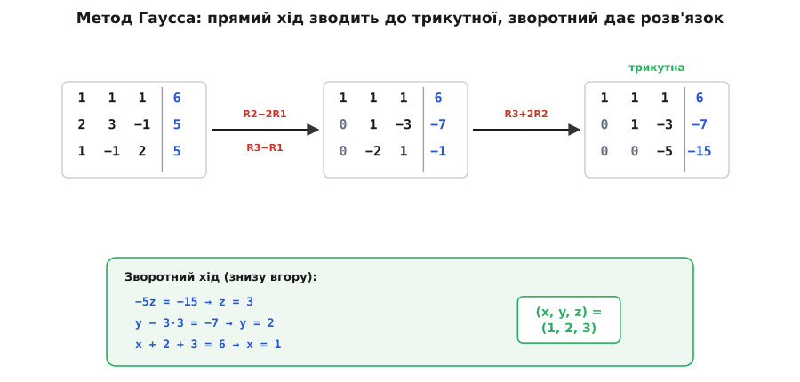
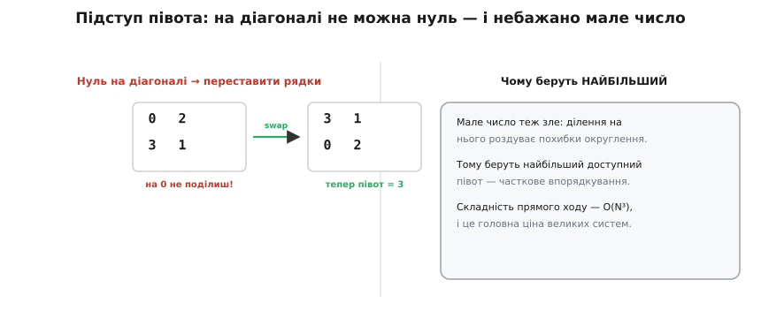
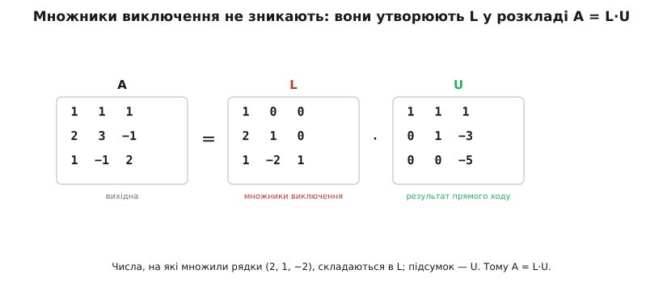

# 🧮 Метод Гаусса

Якщо невідомих дві, [систему лінійних рівнянь](topic:math-algebra/linear-systems) ще можна розплутати підстановкою: виразив одну змінну, підставив у друге рівняння — і готово. Але вже з трьох змінних підстановка перетворюється на плутанину з дробами, а з десяти — на безнадію. Потрібен спосіб, що діє **механічно й однаково за будь-якого розміру**, не вимагаючи кмітливості на кожному кроці. Такий спосіб є — це **метод Гаусса**, або виключення Гаусса (*Gaussian elimination*; названий на честь німецького математика Карла Фрідріха Гаусса, хоча, як побачимо наприкінці, винайшов його зовсім не Гаусс). Це той самий механізм, яким розв'язує систему всередині будь-яка програма — від симулятора кіл до бібліотеки лінійної алгебри.

Уся ідея вкладається в одне речення: **спрощувати систему, не міняючи її розв'язку, доки відповідь не стане очевидною**. «Очевидною» вона стає, коли система набуває **трикутної** форми — тоді останнє рівняння має одну невідому, передостаннє дві, і так далі, тож їх можна розв'язати одне за одним. Метод розпадається на два ходи: **прямий** доводить систему до трикутника, **зворотний** розв'язує цей трикутник знизу вгору. Розберімо обидва на конкретних числах, а тоді доберемося до того, що ховається під цією простою механікою: чому вона не псує розв'язку, скільки коштує і чому за нею стоїть глибша структура — розклад матриці на множники.

### Три дозволені дії — і чому вони не псують розв'язку

Перш ніж щось спрощувати, треба домовитися, що **дозволено робити з рівняннями системи**, не зачепивши при цьому відповіді. Таких дій рівно три:

- **переставити два рівняння місцями** — порядок, у якому записані умови, нічого не означає;
- **помножити рівняння на ненульове число** — рівність `2x + 2y = 4` вимагає рівно того самого, що й `x + y = 2`;
- **додати одне рівняння до іншого** (можливо, попередньо помножене на число) — якщо обидві рівності правдиві, то правдива й їхня сума.

Чому жодна з них не зрушує розв'язку? Розв'язок — це набір значень, що задовольняє **всі** рівняння **одночасно**. Перші дві дії очевидно лишають кожне рівняння рівносильним самому собі: переставлений і помножений на 3 рядок вимагає того самого, що й до того. Третя дія тонша, і саме на ній тримається весь метод. Уявімо, що до рядка R₂ ми додаємо рядок R₁. Будь-який набір значень, що вдовольняв і R₁, і R₂, вдовольнить і їхню суму — бо сума двох правдивих рівностей правдива. Назад: маючи нову систему (R₁ і «R₁+R₂»), ми завжди відновимо R₂ як різницю, тож і вона виконується. Виходить, **стара й нова системи мають точнісінько ту саму множину розв'язків** — ми лише переписали ті самі обмеження інакше.

> 🔧 **Навіщо це.** Ці три дії — не формальність, а гарантія, що розв'язувач не «з'їсть» вашу відповідь дорогою. Коли ви передаєте матрицю кола чи систему калібрування в бібліотеку, вона всередині робить тисячі таких кроків; знання, що кожен крок зберігає розв'язок, — це і є причина довіряти результату. А коли власний код раптом видає хибну відповідь, помилку шукають саме тут: десь дія була **не** з цих трьох (наприклад, рядок помножили на нуль — і втратили рівняння).

Цими трьома діями ми й виключатимемо змінні — стовпець за стовпцем зводячи систему до трикутника.

### Прямий хід: робимо трикутник

Вести всю систему з літерами `x`, `y`, `z` незручно — самі невідомі ніде не змінюються, змінюються лише **числа** перед ними. Тож запишімо систему компактно, **розширеною матрицею**: таблиця коефіцієнтів, а за вертикальною рискою — права частина. (Прямокутна таблиця коефіцієнтів і є [матриця](topic:math-algebra/matrices-as-operations) — об'єкт, що задає лінійне перетворення; тут вона нам потрібна просто як акуратний спосіб не загубити числа.) Візьмімо конкретну систему:

```
 x +  y +  z =  6
2x + 3y −  z =  5
 x −  y + 2z =  5
```

У вигляді розширеної матриці:

```
┌ 1   1   1 │  6 ┐
│ 2   3  −1 │  5 │
└ 1  −1   2 │  5 ┘
```

Мета прямого ходу — обнулити все **під діагоналлю**, рухаючись стовпець за стовпцем зліва направо. Беремо перший рядок за **опорний** і його кратними гасимо перший стовпець у рядках нижче. У другому рядку перший коефіцієнт — 2, тож віднімаємо подвоєний опорний (R2 − 2R1); у третьому він — 1, тож віднімаємо опорний один раз (R3 − R1):

```
┌ 1   1   1 │  6 ┐
│ 0   1  −3 │ −7 │
└ 0  −2   1 │ −1 ┘
```

Перший стовпець під діагоналлю вже обнулено. Тепер опорний — **другий** рядок, і ним гасимо другий стовпець нижче. У третьому рядку там стоїть −2, тож додаємо подвоєний опорний (R3 + 2R2):

```
┌ 1   1   1 │  6 ┐
│ 0   1  −3 │ −7 │
└ 0   0  −5 │−15 ┘
```

Готово — під діагоналлю самі нулі, система стала **трикутною**.


*Прямий хід виключає змінні стовпець за стовпцем: спершу кратними першого рядка обнуляють перший стовпець (R2−2R1, R3−R1), потім кратними другого — другий (R3+2R2). Матриця стає трикутною. Зворотний хід знизу вгору дає послідовно z=3, y=2, x=1.*

Зверніть увагу на ритм: на кожному стовпці один опорний рядок гасить усе під собою, потім опорним стає наступний рядок праворуч-нижче. Саме ця однаковість і робить метод придатним для будь-якого N — машина повторює той самий крок, не питаючи, скільки змінних попереду.

### Зворотний хід: підставляємо знизу вгору

Трикутна форма цінна тим, що **розплутується сама собою з низу**. Останній рядок містить лише одну невідому:

```
−5z = −15   →   z = 3
```

Знаючи z, піднімаємося в передостанній рядок — там тепер теж одна невідома:

```
y − 3·(3) = −7   →   y − 9 = −7   →   y = 2
```

І нарешті в перший рядок, підставивши обидва відомі значення:

```
x + (2) + (3) = 6   →   x + 5 = 6   →   x = 1
```

Розв'язок — `(x, y, z) = (1, 2, 3)`. Жодного здогаду чи підбору: самі механічні кроки, що завжди дають відповідь, якщо вона єдина. Скільки рівнянь — стільки зворотних підстановок; кожна додає одну вже відому змінну й розкриває наступну.

### Підступ опорного елемента

Придивімося до зворотного ходу уважніше: у кожному рядку ми **ділимо** на діагональний елемент (тут — на −5, на 1, на 1). Цей діагональний елемент, на який доводиться ділити, звуть **опорним**, або **півотом** (*pivot*, англ. «вісь, точка опори»). І з ним пов'язані дві халепи, через які наївний метод іноді ламається.

Перша очевидна: якщо на діагоналі опиниться **нуль**, ділити не можна взагалі. Це трапляється легко — навіть коли система чудово розв'язна. Тоді рятунок простий: переставити рядки, піднявши на місце опорного якийсь рядок нижче з ненульовим елементом у цьому стовпці. Перестановка рядків — одна з трьох дозволених дій, тож розв'язок від неї не страждає.


*Якщо на діагоналі опинився нуль, ділити неможливо — рядки переставляють, аби підняти ненульовий опорний елемент. Мале число теж шкідливе: ділення на нього роздуває похибки округлення, тому на практиці на діагональ завжди ставлять найбільший доступний елемент стовпця.*

Друга халепа підступніша й важлива саме для комп'ютера, який рахує не точно, а з округленням (числа [з рухомою комою](topic:math-numeric/ieee754) мають скінченну точність). Біда не лише з нулем — шкідливий і просто **малий** опорний елемент. Коли ми ділимо на крихітне число, усі похибки попередніх кроків множаться на велику величину й роздуваються; через кілька таких ділень накопичене сміття може повністю забити справжню відповідь. Тому надійні розв'язувачі не задовольняються будь-яким ненульовим півотом, а свідомо вибирають **найбільший за модулем** елемент стовпця й переставляють його на діагональ. Ця стратегія зветься **частковим впорядкуванням** (*partial pivoting*) і коштує лише перегляду стовпця перед кожним кроком, зате робить метод чисельно стійким.

> 🔧 **Навіщо це.** Без впорядкування ваш розв'язувач може видати правдоподібні, але геть хибні числа — і не повідомить про це жодною помилкою, бо формально все «порахувалося». Саме тому ручні реалізації виключення, написані «в лоб», сумнозвісно ненадійні, а промислові бібліотеки (LAPACK і все, що на ньому) **завжди** роблять часткове впорядкування. Коли бачите в коді пошук максимуму в стовпці перед діленням — це не оптимізація, а захист точності.

### Скільки це коштує

Метод дає відповідь завжди (коли вона єдина), але не безкоштовно — і ціна різко зростає з розміром. Порахуймо приблизно. На першому стовпці ми обнуляємо елементи під опорним у решті N−1 рядків, і на кожен такий рядок витрачаємо близько N операцій (помножити опорний рядок і відняти по всій довжині). На другому стовпці працюємо вже з підматрицею, меншою на один рядок і стовпець, і так далі — обсяг роботи на кроці зменшується як квадрат. Підсумувавши квадрати від 1 до N, дістаємо роботу пропорційно **N³** — точніше, близько **⅔·N³** арифметичних операцій для прямого ходу.

```
прямий хід    ≈ (2/3)·N³   операцій
зворотний хід ≈      N²     операцій
```

Зворотний хід на цьому тлі майже безкоштовний — лише близько N² операцій, бо там кожна з N змінних розкривається однією короткою підстановкою. Отже, **уся вартість методу — це прямий хід**, і вона **кубічна**. Практичний наслідок різкий: збільшили систему вдвічі — і чекати доведеться приблизно увосьмеро довше (2³ = 8). Саме ця кубічна вартість і пояснює, чому велике коло чи велика сітка рахуються помітно довше за малі, і чому навколо розв'язання лінійних систем виросла ціла індустрія хитріших методів для дуже великих розріджених систем.

### Що ховається під виключенням: розклад A = L·U

Тут варто зупинитися й помітити річ, яку прямий хід приховує. Числа, на які ми множили опорний рядок, перш ніж відняти, — **множники виключення** — нібито робять свою справу й зникають. Насправді вони не зникають: якщо їх акуратно зберегти, вони складаються в окрему матрицю й дають глибший погляд на весь процес.

У нашому прикладі множники були такі: щоб обнулити перший стовпець, ми віднімали 2×R1 з другого рядка й 1×R1 з третього; щоб обнулити другий — віднімали (−2)×R2 з третього. Поставимо ці множники на їхні місця нижче діагоналі, а на діагональ — одиниці. Вийде **нижня трикутна** матриця L. А підсумок прямого ходу — наш трикутник — це **верхня трикутна** матриця U. І тоді виявляється, що вихідна матриця системи дорівнює їхньому добутку:

```
A = L · U
```


*Множники, на які множили рядки під час прямого ходу (2, 1, −2), не пропадають марно: поставлені під діагональ із одиницями на ній, вони утворюють нижню трикутну L. Підсумок прямого ходу — верхня трикутна U. Їхній добуток відновлює вихідну матрицю: A = L·U.*

Це не випадковий збіг, а інший погляд на той самий прямий хід: виключення Гаусса — це і є **розклад матриці на дві трикутні** (*LU-decomposition*, від *lower* — нижня й *upper* — верхня). Чому це важливо на практиці? Бо часто одну й ту саму матрицю A треба розв'язувати з **багатьма** різними правими частинами **b** (те саме коло за різних входів, та сама конструкція за різних навантажень). Найдорожча частина — прямий хід, ⅔·N³, — залежить **лише від A**, не від **b**. Зробивши розклад `A = L·U` **один раз**, кожну нову праву частину розв'язуємо двома дешевими трикутними ходами по N² операцій кожен: спершу `L·y = b` згори вниз, тоді `U·x = y` знизу вгору. Тож «дорого» платимо одного разу, а далі відповідаємо майже миттєво — і саме так влаштовані всі серйозні розв'язувачі.

### Робочий приклад: виключення в коді

Зберемо все докупи в реальному C — прямий хід із частковим впорядкуванням і зворотна підстановка для системи N×N. Матриця `a` зберігається як розширена (N стовпців коефіцієнтів плюс стовпець правих частин), розв'язок лягає у `x`:

:::tabs
```cpp
#include <cmath>
#include <vector>

// Розв'язати a*x = b методом Гаусса з частковим впорядкуванням.
// a — розширена матриця N×(N+1): останній стовпець це праві частини b.
// Повертає true й кладе результат у x; false — якщо розв'язок не єдиний.
bool gauss(std::vector<std::vector<double>>& a, std::vector<double>& x)
{
    const int N = static_cast<int>(a.size());
    x.assign(N, 0.0);

    for (int col = 0; col < N; col++) {
        // 1) часткове впорядкування: знайти найбільший за модулем півот у стовпці
        int piv = col;
        for (int r = col + 1; r < N; r++)
            if (std::fabs(a[r][col]) > std::fabs(a[piv][col]))
                piv = r;

        if (std::fabs(a[piv][col]) < 1e-12)
            return false;                 // увесь стовпець ~0 → нема єдиного розв'язку

        // підняти знайдений рядок на діагональ (перестановка рядків)
        if (piv != col)
            std::swap(a[col], a[piv]);

        // 2) прямий хід: обнулити стовпець під опорним рядком
        for (int r = col + 1; r < N; r++) {
            double m = a[r][col] / a[col][col];   // множник виключення
            for (int c = col; c <= N; c++)
                a[r][c] -= m * a[col][c];
        }
    }

    // 3) зворотний хід: знизу вгору
    for (int r = N - 1; r >= 0; r--) {
        double s = a[r][N];                       // права частина рядка
        for (int c = r + 1; c < N; c++)
            s -= a[r][c] * x[c];                  // відняти вже відомі змінні
        x[r] = s / a[r][r];                       // поділити на півот
    }
    return true;
}
```
```python
def gauss(a):
    """Розв'язати a*x = b методом Гаусса з частковим впорядкуванням.

    a — розширена матриця N×(N+1): останній стовпець це праві частини b
    (список списків, модифікується на місці).
    Повертає список x; None — якщо розв'язок не єдиний.
    """
    N = len(a)

    for col in range(N):
        # 1) часткове впорядкування: знайти найбільший за модулем півот у стовпці
        piv = max(range(col, N), key=lambda r: abs(a[r][col]))

        if abs(a[piv][col]) < 1e-12:
            return None               # увесь стовпець ~0 → нема єдиного розв'язку

        # підняти знайдений рядок на діагональ (перестановка рядків)
        a[col], a[piv] = a[piv], a[col]

        # 2) прямий хід: обнулити стовпець під опорним рядком
        for r in range(col + 1, N):
            m = a[r][col] / a[col][col]           # множник виключення
            for c in range(col, N + 1):
                a[r][c] -= m * a[col][c]

    # 3) зворотний хід: знизу вгору
    x = [0.0] * N
    for r in range(N - 1, -1, -1):
        s = a[r][N]                               # права частина рядка
        for c in range(r + 1, N):
            s -= a[r][c] * x[c]                    # відняти вже відомі змінні
        x[r] = s / a[r][r]                         # поділити на півот
    return x
```
:::

Кожен блок тут — рівно крок методу: пошук максимуму й перестановка це впорядкування; внутрішня пара циклів це той самий прямий хід, що ми робили руками; останній цикл це зворотна підстановка. Порівняння `< 1e-12` замість `== 0` не випадкове: на дійсних числах опорний елемент рідко виходить **точно** нульовим, тож «виродженість» ловлять малим порогом, а не точним нулем. Той самий код без змін розв'язує систему будь-якого розміру — досить інших `N` і даних.

> 🔧 **Навіщо це.** На мікроконтролері такий короткий розв'язувач 3×3 чи 6×6 трапляється частіше, ніж здається: перерахунок калібрування багатовісного давача, розкладання виміряного вектора по базису, найпростіший фітинг прямо в прошивці. Розуміючи, що всередині це лише ⅔·N³ множень-віднімань, ви тверезо оцінюєте, чи влізе обчислення в бюджет такту, — і не тягнете важку бібліотеку туди, де вистачає двадцяти рядків.

### Звідки метод узявся — і чому «Гаусса»

Тут варто бути точним з історією, бо назва вводить в оману. **Гаусс цей метод не винаходив** — він давніший за нього на тисячоліття. Найраніший відомий запис елімінації лінійних систем — у китайському трактаті **«Цзю чжан суань шу»** (《九章算術》, «Дев'ять розділів про математичне мистецтво»), що складався поколіннями вчених приблизно з X по II століття до н. е. Його восьмий розділ, **«фанчен»** (方程), розв'язує системи лінійних рівнянь, розкладаючи числа прямокутником на лічильній дошці й виключаючи невідомі рядковими операціями — це по суті той самий прямий хід, тільки без сучасного запису зі змінними. Метод перевідкривали й пізніше: схожу процедуру описав, серед інших, **Ісаак Ньютон** (у нотатках, які сам не квапився друкувати), а серед математиків XVIII–XIX століть він вважався настільки буденним, що **Леонард Ейлер** не радив його як щось особливе, **Адрієн-Марі Лежандр** називав «звичайним», а сам **Гаусс** — «спільним», буденним (*eliminatio vulgaris*).

Чому ж тоді «метод Гаусса»? Через **інше** його застосування. Гаусс розробив систематичний запис цих обчислень для своєї астрономічної праці — визначення орбіт малих планет ([Церери, потім Паллади](topic:math-probability/least-squares)) за нечисленними й неточними спостереженнями. Щоб упоратися з похибками вимірів, він застосував метод найменших квадратів, а той зводиться до лінійної системи; для її розв'язання Гаусс і ввів зручну схему обчислень (праця *Theoria Motus*, 1809, і робота про квадратичні форми, 1810). Цю його схему згодом перейняли професійні обчислювачі — люди, що рахували орбіти й геодезію руками, — і разом зі схемою до методу прилипло ім'я Гаусса. Тобто справжній внесок Гаусса не у винаході елімінації, а в зручній систематизації її для найменших квадратів. Пізніше з'явився й варіант **Гаусса — Жордана**, що доводить матрицю не до трикутної, а до повністю діагональної форми; він трохи простіший на вигляд, але менш точний чисельно, тож на практиці зазвичай лишаються при класичному виключенні з впорядкуванням.

Підсумок без міфів: ідея елімінації **колективна й дуже стара** (Китай, потім незалежні перевідкриття в Європі); ім'я Гаусса метод носить за історичною випадковістю — через його запис для астрономічних обчислень, — а не тому, що Гаусс її придумав. Опанувавши ці кілька механічних кроків руками, ви точно знаєте, що відбувається всередині будь-якого розв'язувача лінійних систем, — і чому велика система рахується помітно довше за малу.
