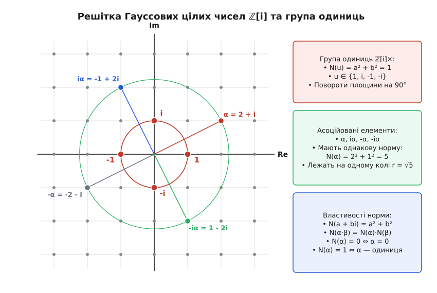
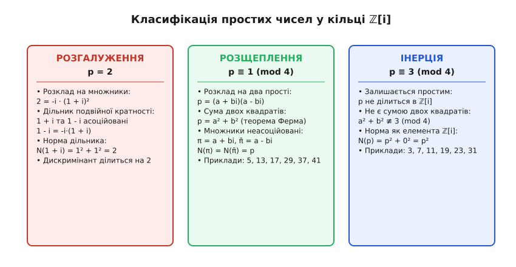
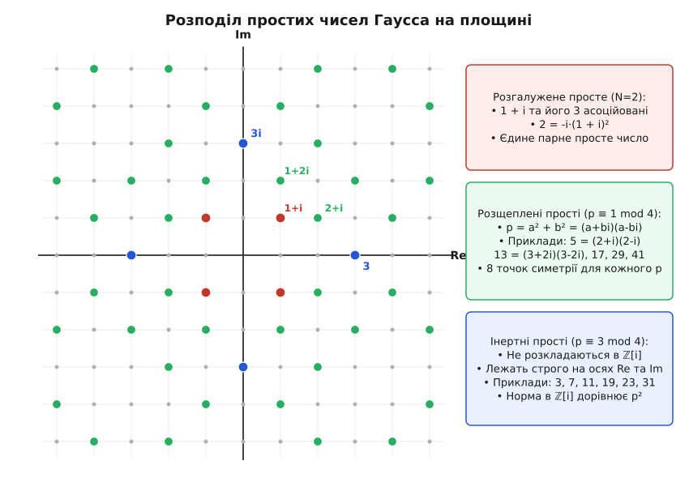

# Гауссові цілі числа ℤ[i]

<preknowlist>
- [Комплексні числа](topic:math-analysis/complex-numbers) — уявна одиниця i = √(-1), дійсна та уявна частини, комплексна площина: гауссові числа є підмножиною комплексних із цілими координатами.
- [Кільця](topic:math-algebra/rings) — алгебраїчна структура з додаванням і множенням, комутативність, дільники нуля та оборотні елементи: ℤ[i] є комутативним кільцем без дільників нуля.
- [Модульна арифметика](topic:math-number-theory/modular-arithmetic) — порівняння за модулем n, квадратичні лишки: поведінка простих чисел у ℤ[i] визначається їхнім залишком при діленні на 4.
- [Теорема Піфагора](topic:math-geometry/pythagorean-theorem) — геометрична відстань на площині та сума двох квадратів: алгебраїчна норма гауссового числа a² + b² є квадратом евклідової довжини вектора.
- [Алгоритм Евкліда](topic:math-number-theory/gcd-euclidean) — ділення з остачею та пошук найбільшого спільного дільника: алгоритм Евкліда в ℤ[i] працює на комплексній решітці.
</preknowlist>

Спробуймо розв'язати класичну арифметичну загадку: які натуральні числа можна записати як суму двох повних квадратів цілих чисел? Число 5 записується як 1² + 2², число 13 — як 2² + 3², число 65 — аж двома способами: 1² + 8² та 4² + 7². Водночас числа 3, 7, 11, 15, 19 за жодних умов неможливо виразити через a² + b². Якщо перевіряти числа по черзі, видно чітку закономірність, але всередині звичайної системи цілих чисел `ℤ = {..., -2, -1, 0, 1, 2, ...}` вираз a² + b² є операцією додавання, яка в дійсних числах не розкладається на простіші лінійні множники. Поки ми обмежені лише дійсною числовою прямою, адитивна структура суми двох квадратів чинить опір факторизації: неможливо розділити доданки так, щоб перетворити задачу додавання на мультиплікативну задачу розкладу на множники.

Усе докорінно змінюється, якщо додати до цілих чисел уявну одиницю `i`, квадрат якої дорівнює мінус одиниці: `i² = -1`. Тоді сума двох квадратів раптово розпадається на добуток двох комплексних множників:

```
a² + b² = (a + bi)·(a - bi)
```

Завдяки цьому простому переходу важка адитивна діофантова задача про суму квадратів миттєво перетворюється на мультиплікативну задачу: дослідження подільності та розкладу чисел на множники в розширеній числовій системі. Але тут виникає вирішальне структурне питання: чи утворюють числа вигляду `a + bi` з цілими коефіцієнтами `a` та `b` повноцінний арифметичний простір, де діють звичні закони подільності, існує однозначний розклад на прості множники і працює алгоритм пошуку найбільшого спільного дільника?

Саме таку систему чисел називають **кільцем гауссових цілих чисел** (лат. *numeri integri complexi*, позначається `ℤ[i]`). Її введення Карлом Фрідріхом Гауссом у 1832 році відкрило еру алгебраїчної теорії чисел і перетворило уявні величини з формального обчислювального трюку на фундаментальний інструмент строгої математики. Про те, як пошук закону біквадратичної взаємності привів Гаусса до цієї конструкції, детально розповідає [історичний нарис про відкриття нової арифметики](topic:math-algebra/gaussian-integers/hist-gauss-biquadratic.md).

### Геометрична будова: дискретна решітка на комплексній площині

Гауссовим цілим числом називають будь-яке комплексне число `α = a + bi`, де обидві складові — дійсна частина `a = Re(α)` та уявна частина `b = Im(α)` — є звичайними цілими числами з множини `ℤ`:

```
ℤ[i] = { a + bi | a ∈ ℤ, b ∈ ℤ }
```

Якщо звичайні цілі числа `ℤ` утворюють дискретні точки вздовж одновимірної числової прямої, то гауссові цілі числа утворюють правильну квадратну решітку на двовимірній комплексній площині з базисними векторами 1 (одиничний крок уздовж дійсної осі) та `i` (одиничний крок уздовж уявної осі).


*Решітка ℤ[i] на комплексній площині. Вузли утворюють квадратну дискретну сітку з кроком 1. Червоним виділено 4 оборотні одиниці {1, i, -1, -i} на одиничному колі N = 1. Зеленим колом радіуса √5 з'єднано 4 взаємно асоційовані числа 2 + i, -1 + 2i, -2 - i, 1 - 2i, які утворюються послідовним множенням на i (поворотом на 90°).*

Перевіримо, як на цій множині поводяться звичні арифметичні операції. Нехай маємо два довільні гауссові числа `α = a + bi` та `β = c + di`. Їхня сума та різниця обчислюються покомпонентно:

```
(a + bi) + (c + di) = (a + c) + (b + d)·i
(a + bi) - (c + di) = (a - c) + (b - d)·i
```

Оскільки суми й різниці цілих чисел `a ± c` та `b ± d` знову є цілими числами, множина `ℤ[i]` замкнена щодо додавання та віднімання і утворює абелеву групу за додаванням із нейтральним елементом `0 = 0 + 0i`.

Множення виконується за звичайними правилами множення многочленів із підстановкою `i² = -1`:

```
(a + bi)·(c + di)
= a·c + a·d·i + b·c·i + b·d·i²    [розкриття дужок]
= a·c + (a·d + b·c)·i + b·d·(-1)   [властивість уявної одиниці i² = -1]
= (a·c - b·d) + (a·d + b·c)·i      [групування дійсної та уявної частин]
```

Коефіцієнти нового числа `a·c - b·d` та `a·d + b·c` є цілими числами, тому добуток двох гауссових чисел завжди належить `ℤ[i]`. Множення є комутативним, асоціативним, має нейтральний елемент `1 = 1 + 0i` та узгоджується з додаванням через закон дистрибутивності. Крім того, у `ℤ[i]` немає дільників нуля: якщо добуток двох чисел дорівнює нулю `α · β = 0`, то принаймні одне з них обов'язково є нулем `α = 0` або `β = 0`. Таким чином, гауссові цілі числа утворюють комутативне кільце з одиницею та область цілісності.

### Алгебраїчна норма: міст між комплексною площиною та звичайними цілими

Головним аналітичним інструментом для дослідження подільності в `ℤ[i]` є алгебраїчна **норма** (лат. *norma* — правило, мірило). Нормою гауссового числа `α = a + bi` називають добуток цього числа на його комплексне спряження `ᾱ = a - bi`:

```
N(α) = α · ᾱ = (a + bi)·(a - bi) = a² + b²
```

Геометрично норма є квадратом евклідової відстані від точки `α` до початку координат `0` на комплексній площині. Звернімо увагу на вирішальну рису: для будь-якого ненульового гауссового числа `a + bi ≠ 0` його норма `N(a + bi) = a² + b²` є **строго додатним звичайним цілим числом** із `ℤ≥0`. Норма перетворює двовимірні комплексні структури на звичні одновимірні цілі числа, що дозволяє порівнювати їх за величиною та проводити математичну індукцію.

Найважливішою властивістю норми є її **мультиплікативність**: норма добутку двох гауссових чисел завжди дорівнює добутку їхніх норм. Доведімо це безпосереднім алгебраїчним розрахунком:

```
N(α · β)
= (α · β) · (α · β)̄               [означення норми: N(z) = z · z̄]
= (α · β) · (ᾱ · β̄)               [спряження добутку: (αβ)̄ = ᾱβ̄]
= (α · ᾱ) · (β · β̄)               [комутативність і асоціативність множення]
= N(α) · N(β)                      [згортання в окремі норми]
```

Якщо розписати це доведення в дійсних координатах для `α = a + bi` та `β = c + di`, ми миттєво отримуємо знамениту тотожність Брахмагупти — Фібоначчі:

```
(a² + b²)·(c² + d²) = (a·c - b·d)² + (a·d + b·c)²
```

Ця тотожність показує фундаментальний факт: добуток двох чисел, кожне з яких є сумою двох квадратів, сам обов'язково є сумою двох квадратів. Наприклад, якщо `5 = 1² + 2²` та `13 = 2² + 3²`, то їхній добуток `65 = 5 · 13` записується як норма добутку `(1 + 2i)(2 + 3i) = (2 - 6) + (3 + 4)i = -4 + 7i`, тобто `65 = (-4)² + 7² = 16 + 49`. А якщо взяти спряжений множник `(1 + 2i)(2 - 3i) = (2 + 6) + (-3 + 4)i = 8 + i`, ми отримуємо другий спосіб представлення: `65 = 8² + 1² = 64 + 1`. Таким чином, уся комбінаторика сум квадратів випливає з простого перемножування гауссових чисел.

### Геометрія множення та індекс підрешітки ідеалу

Множення на фіксоване гауссове число `α = a + bi` має прозорий геометричний зміст. Представимо число `α` в тригонометричній формі:

```
α = r · (cos θ + i·sin θ),    де r = √N(α), θ = arctan(b/a)
```

Множення довільного комплексного числа `z` на `α` є композицією двох перетворень площини:
1. **Поворот** на кут `θ = arg(α)` проти годинникової стрілки навколо початку координат.
2. **Масштабування (гомотетія)** з коефіцієнтом розтягу `r = √N(α)`.

Коли ми множимо всю решітку `ℤ[i]` на ненульовий елемент `α`, ми отримуємо головний ідеал `(α) = α · ℤ[i]`. Геометрично ідеал `(α)` — це нова квадратна решітка, повернена на кут `θ` і розтягнута у `√N(α)` разів.

Фундаментальна комірка вихідної решітки `ℤ[i]` є одиничним квадратом із площею 1. Фундаментальна комірка нової підрешітки `(α)` є квадратом зі стороною `|α| = √N(α)`, отже її площа дорівнює:

```
Площа = (|α|)² = N(α) = a² + b²
```

Звідси випливає фундаментальний зв'язок між геометрією та алгеброю: **кількість класів лишків у фактор-кільці `ℤ[i]/(α)` точно дорівнює алгебраїчній нормі `N(α)`**. Кожен клас лишків відповідає рівно одній цілій точці всередині фундаментального квадрата підрешітки `(α)`. Це повністю аналогічно тому, як у звичайних цілих числах фактор-кільце `ℤ/nℤ` містить рівно `n` елементів.

### Оборотні одиниці та асоційовані числа

У звичайному кільці цілих чисел `ℤ` є лише два числа, які мають обернені за множенням елементи: це `1` та `-1` (оскільки `1 · 1 = 1` та `(-1) · (-1) = 1`). Такі елементи називають оборотними одиницями кільця. Які елементи є оборотними в `ℤ[i]`?

Нехай гауссове число `u = a + bi` є оборотною одиницею. Це означає, що існує таке число `v ∈ ℤ[i]`, що `u · v = 1`. Застосуймо властивість мультиплікативності норми:

```
N(u · v) = N(1)
N(u) · N(v) = 1                    [мультиплікативність норми]
```

Оскільки `N(u)` та `N(v)` — невід'ємні цілі числа, їхній добуток може дорівнювати одиниці лише тоді, коли обидві норми точно дорівнюють одиниці:

```
N(u) = a² + b² = 1
```

У цілих числах діофантове рівняння `a² + b² = 1` має рівно чотири розв'язки:
1. `a = 1, b = 0` → число `1`
2. `a = -1, b = 0` → число `-1`
3. `a = 0, b = 1` → число `i`
4. `a = 0, b = -1` → число `-i`

Отже, кільце гауссових чисел має рівно **чотири оборотні одиниці**:

```
ℤ[i]× = { 1, i, -1, -i }
```

Ці чотири елементи утворюють циклічну мультиплікативну групу четвертого порядку, породжену елементом `i`: послідовні степені дають `i¹ = i`, `i² = -1`, `i³ = -i`, `i⁴ = 1`. Геометрично множення довільного комплексного числа на `i` відповідає повороту вектора на 90° проти годинникової стрілки навколо початку координат, множення на `-1` — повороту на 180°, а на `-i` — повороту на 270°.

Якщо одне гауссове число `α` можна отримати з іншого числа `β` множенням на деяку оборотну одиницю `u ∈ {1, i, -1, -i}` (тобто `α = u · β`), то числа `α` та `β` називають **взаємно асоційованими** (лат. *associare* — з'єднувати). Кожне ненульове гауссове число `α = a + bi` має рівно чотири асоційовані форми:

```
α = a + bi
i·α = -b + ai
-1·α = -a - bi
-i·α = b - ai
```

Усі чотири асоційовані числа мають абсолютно однакову норму `a² + b²` і лежать у вершинах квадрата, вписаного в коло радіуса `√(a² + b²)`. З погляду теорії подільності асоційовані числа є нерозрізненними еквівалентами — так само, як у звичайних цілих числах `5` та `-5` ділять одні й ті самі числа і породжують той самий головний ідеал.

### Подільність та алгоритм ділення з остачею

Кажуть, що гауссове число `α` ділиться на ненульове гауссове число `β` (позначається `β | α`), якщо існує таке гауссове число `γ ∈ ℤ[i]`, що:

```
α = β · γ
```

Якщо `β | α`, то з мультиплікативності норми `N(α) = N(β) · N(γ)` негайно випливає, що звичайна цілочисельна норма `N(β)` обов'язково ділить ціле число `N(α)` у звичайному кільці `ℤ`. Це дає потужний критерій неподільності: якщо `N(β)` не ділить `N(α)`, то `β` гарантовано не ділить `α` в `ℤ[i]`.

Але що робити, коли націло поділити не вдається? У звичайній арифметиці фундаментом усього аналізу є ділення з остачею: для будь-яких цілих `a` та `b > 0` існують частка `q` та остача `r`, для яких `a = b·q + r`, де остача строго менша за дільник: `0 ≤ r < b`. Чи існує точний аналог цього закону для двовимірної комплексної решітки `ℤ[i]`?

**Теорема про ділення з остачею в ℤ[i].** Для будь-яких двох гауссових цілих чисел `α` та `β ≠ 0` існують такі гауссові цілі числа `q` (частка) та `r` (остача), що:

```
α = β · q + r,    причому N(r) ≤ ½ · N(β) < N(β)
```

Доведення цієї теореми є надзвичайно наочним і спирається на геометрію комплексної площини.

![Геометричне обґрунтування ділення з остачею в ℤ[i]: точка частки на комплексній площині, найближчий вузол решітки та диск радіуса 1 поділити на корінь з двох](img/euclidean-division-circle.svg)
*Геометрія ділення з остачею. Точка точної частки z = α / β лежить усередині одиничного квадрата решітки ℤ[i]. Найближчий цілий вузол q обирається округленням дійсної та уявної частин. Відстань |z - q| ніколи не перевищує половини діагоналі квадрата: 1/√2 ≈ 0.707. Оскільки це число строго менше 1, норма остачі N(r) = N(β)·|z - q|² завжди не перевищує 0.5·N(β) < N(β).*

Розгляньмо крок за кроком, як знайти частку `q` та остачу `r`:

1. Спочатку виконаємо точне ділення `α` на `β` у полі всіх комплексних чисел `ℂ`:

```
z = α / β = (α · β̄) / (β · β̄) = (α · β̄) / N(β) = x + yi
```

Тут `x = Re(z)` та `y = Im(z)` — звичайні дійсні числа (раціональні дроби).

2. Точка `z = x + yi` потрапляє в деякий одиничний квадрат комплексної решітки, утворений сусідніми гауссовими цілими числами. Округлимо кожну координату `x` та `y` до найближчого звичайного цілого числа:

```
q₀ = ⌊x + ½⌋,    q₁ = ⌊y + ½⌋
q = q₀ + q₁·i ∈ ℤ[i]
```

3. За побудовою округлення похибка вздовж кожної осі не перевищує половини одиниці: `|x - q₀| ≤ ½` та `|y - q₁| ≤ ½`. Оцінимо квадрат відстані від точної частки `z` до вибраного цілого вузла `q`:

```
|z - q|²
= (x - q₀)² + (y - q₁)²
≤ (½)² + (½)²                      [максимальна похибка округлення]
= ¼ + ¼ = ½                        [сума квадратів похибок]
```

Отже, відстань `|z - q| ≤ 1/√2 ≈ 0.7071 < 1`. Найвіддаленішою точкою від усіх чотирьох вершин квадрата є його геометричний центр, де відстань досягає максимуму `1/√2`.

4. Визначимо остачу як різницю `r = α - q · β ∈ ℤ[i]`. Обчислимо її норму:

```
N(r)
= |r|²
= |α - q · β|²
= |β · (α/β - q)|²                 [винесення дільника β за дужки]
= |β|² · |z - q|²                  [квадрат модуля добутку]
= N(β) · |z - q|²                  [підстановка норми N(β) = |β|²]
≤ N(β) · ½                         [оскільки |z - q|² ≤ ½]
< N(β)                             [оскільки ½ < 1 для будь-якого N(β) > 0]
```

Оскільки `N(r) ≤ ½ · N(β)`, норма остачі строго менша за норму дільника. Це переконливо доводить, що кільце `ℤ[i]` є **евклідовим кільцем** (англ. *Euclidean domain*).

### Числовий приклад ділення з остачею

Розгляньмо ділення двох конкретних гауссових чисел: поділимо `α = 11 + 3i` на `β = 1 + 8i`.

1. Обчислюємо норму дільника `β`:
```
N(β) = 1² + 8² = 1 + 64 = 65
```

2. Обчислюємо точну частку в комплексних числах:
```
α · β̄ = (11 + 3i)·(1 - 8i) = 11 - 88i + 3i - 24i² = (11 + 24) + (-88 + 3)i = 35 - 85i
z = α / β = (35 - 85i) / 65 = 35/65 - (85/65)·i = 7/13 - (17/13)·i ≈ 0.5385 - 1.3077i
```

3. Округлюємо дійсну та уявну частини до найближчих цілих чисел:
```
q₀ = round(0.5385) = 1
q₁ = round(-1.3077) = -1
q = 1 - i
```

4. Обчислюємо остачу `r = α - q · β`:
```
q · β = (1 - i)·(1 + 8i) = 1 + 8i - i - 8i² = (1 + 8) + (8 - 1)i = 9 + 7i
r = (11 + 3i) - (9 + 7i) = (11 - 9) + (3 - 7)i = 2 - 4i
```

5. Перевіряємо норми:
```
N(r) = 2² + (-4)² = 4 + 16 = 20
N(β) = 65
```
Справді, `N(r) = 20 ≤ ½ · 65 = 32.5 < 65`. Рівність `11 + 3i = (1 + 8i)·(1 - i) + (2 - 4i)` повністю виконана.

### Алгоритм Евкліда та найбільший спільний дільник

Оскільки в `ℤ[i]` можливе ділення з остачею, в ньому без жодних змін працює класичний **алгоритм Евкліда** для знаходження найбільшого спільного дільника (НСД, англ. *Greatest Common Divisor, GCD*).

Найбільшим спільним дільником двох гауссових чисел `α` та `β` називають таке число `δ = gcd(α, β)`, яке:
1. Є спільним дільником: `δ | α` та `δ | β`.
2. Ділиться на будь-який інший спільний дільник `d`: якщо `d | α` та `d | β`, то `d | δ`.

НСД у `ℤ[i]` визначений із точністю до множення на одну з чотирьох оборотних одиниць `{±1, ±i}`.

Знайдімо найбільший спільний дільник для щойно розглянутої пари чисел `α = 11 + 3i` та `β = 1 + 8i`:

**Крок 1.** Ділимо `α` на `β`:
```
11 + 3i = (1 + 8i)·(1 - i) + (2 - 4i)      [остача r₁ = 2 - 4i, N(r₁) = 20]
```

**Крок 2.** Ділимо попередній дільник `1 + 8i` на нову остачу `2 - 4i`:
```
(1 + 8i) / (2 - 4i)
= ((1 + 8i)·(2 + 4i)) / (2² + (-4)²)            [множення на спряжене знаменника 2 + 4i]
= (2 + 4i + 16i + 32i²) / (4 + 16)               [розкриття дужок у чисельнику та знаменнику]
= (-30 + 20i) / 20                               [групування дійсної та уявної частин: i² = -1]
= -1.5 + 1.0i                                    [поділ на 20]
```
Округлюємо `-1.5` (можна обрати `-1` або `-2`; оберімо `q₂ = -1 + i`):
```
q₂ · (2 - 4i) = (-1 + i)·(2 - 4i) = -2 + 4i + 2i - 4i² = 2 + 6i
r₂ = (1 + 8i) - (2 + 6i) = -1 + 2i         [остача r₂ = -1 + 2i, N(r₂) = 5]
```

**Крок 3.** Ділимо `2 - 4i` на `-1 + 2i`:
```
(2 - 4i) / (-1 + 2i)
= -2 · (-1 + 2i) / (-1 + 2i)                     [винесення множника -2 за дужки]
= -2                                             [ділиться націло, остача r₃ = 0]
```

Остання ненульова остача дорівнює `r₂ = -1 + 2i`. Отже:

```
gcd(11 + 3i, 1 + 8i) = -1 + 2i
```

Його норма `N(-1 + 2i) = (-1)² + 2² = 5`. Будь-який інший асоційований дільник (`1 - 2i`, `2 + i`, `-2 - i`) також є законним значенням найбільшого спільного дільника.

З існування алгоритму Евкліда автоматично випливають дві найважливіші структурні теореми кільця `ℤ[i]`:
- **Співвідношення Безу:** для будь-яких `α, β ∈ ℤ[i]` існують такі коефіцієнти `u, v ∈ ℤ[i]`, що `α·u + β·v = gcd(α, β)`.
- **Кільце головних ідеалів (PID):** будь-який ідеал `I ⊆ ℤ[i]` є головним, тобто породжується одним-єдиним елементом: `I = (d) = d · ℤ[i]`.

### Однозначність розкладу на прості множники (факторіальність)

В евклідовому кільці головних ідеалів автоматично справджується фундаментальна лема Евкліда: якщо незвідне число `π` ділить добуток `α · β`, то `π` обов'язково ділить принаймні один із множників: `π | α` або `π | β`.

Звідси випливає **Основна теорема арифметики для гауссових цілих чисел**:
Кожне ненульове та необоротне гауссове число `α ∈ ℤ[i]` можна розкласти в добуток простих гауссових чисел:

```
α = u · π₁ · π₂ · ... · πₖ
```

де `u ∈ {1, i, -1, -i}` — оборотна одиниця, а `π₁, ..., πₖ` — прості гауссові числа. Цей розклад є **єдиним** з точністю до порядку слідування множників та їхнього множення на оборотні одиниці. Кільце `ℤ[i]` є факторіальним кільцем (англ. *Unique Factorization Domain, UFD*).

> ⚖️ **Чому це не очевидно.** Легко подумати, що факторіальність виконується в будь-якому числовому кільці автоматично. Це небезпечна омана. Розгляньмо сусіднє квадратичне кільце `ℤ[√-5] = { a + b√-5 | a, b ∈ ℤ }`. У ньому число 6 має два принципово різні розклади на незвідні множники:
> ```
> 6 = 2 · 3 = (1 + √-5)·(1 - √-5)
> ```
> Усі чотири числа `2`, `3`, `1 + √-5`, `1 - √-5` є незвідними в `ℤ[√-5]`, але жодне з них не є асоційованим із іншим. Однозначність розкладу в `ℤ[√-5]` повністю зруйнована! Чому ж у `ℤ[i]` розклад однозначний, а в `ℤ[√-5]` ламається? Причина криється саме в геометрії евклідового ділення: у `ℤ[i]` відстань від центру клітинки до вершин дорівнює `(½)² + (½)² = 0.5 < 1`, тому круги покривають площину із запасом. А в `ℤ[√-5]` квадрат відстані дорівнює `(½)² + (√5/2)² = ¼ + 5/4 = 1.5 > 1`. На площині виникають глибокі геометричні «дірки», через які ділення з меншою остачею стає неможливим, алгоритм Евкліда зникає, а разом із ним руйнується й однозначність факторизації.

### Класифікація простих чисел Гаусса

Які саме числа є простими в `ℤ[i]`? Елемент `π ∈ ℤ[i]` називають **простим гауссовим числом**, якщо його норма `N(π) > 1`, а єдиними його дільниками є чотири оборотні одиниці `{±1, ±i}` та чотири взаємно асоційовані числа `{±π, ±iπ}`.

Поведінка простих чисел у `ℤ[i]` тісно пов'язана зі звичайними простими числами з `ℤ` (які в цьому контексті називають *раціональними простими числами*). Якщо обчислити норму довільного простого гауссового числа `π`, то виявиться, що `N(π)` є або звичайним простим числом `p`, або квадратом простого числа `p²`.

Кожне звичайне просте число `p ∈ ℤ` при переході у світ гауссових чисел спіткає одна з трьох принципово різних доль: розгалуження, розщеплення або інертність.


*Три долі простих чисел у ℤ[i]. Парне просте число 2 розгалужується на квадрат простого множника 1+i. Прості числа вигляду 4k+1 розщеплюються на два спряжені комплексні множники норми p. Прості числа вигляду 4k+3 залишаються інертними (незвідними) простими числами з нормою p².*

#### 1. Розгалуження (єдине парне просте p = 2)

Число `2` перестає бути простим у `ℤ[i]`, оскільки воно розкладається на добуток двох множників:

```
2 = 1² + 1² = (1 + i)·(1 - i)
```

Зауважмо, що `1 - i = -i · (1 + i)`. Тобто множники `1 + i` та `1 - i` відрізняються лише множенням на оборотну одиницю `-i`, отже вони є взаємно асоційованими. Тому розклад числа 2 можна записати як:

```
2 = -i · (1 + i)²
```

Число 2 ділиться на квадрат простого гауссового числа `1 + i` (норма якого `N(1 + i) = 1² + 1² = 2`). Таке явище в алгебраїчній теорії чисел називають **розгалуженням** (англ. *ramification*).

#### 2. Розщеплення (прості числа p ≡ 1 mod 4)

Звичайні прості числа, які дають остачу 1 при діленні на 4 (`p = 5, 13, 17, 29, 37, 41, 53, ...`), завжди розкладаються в добуток двох **неасоційованих** простих гауссових чисел:

```
p = (a + bi)·(a - bi) = a² + b²
```

Кожен із множників `π = a + bi` та `π̄ = a - bi` є простим гауссовим числом із нормою `N(π) = p`. Наприклад:
- `5 = (2 + i)·(2 - i)`
- `13 = (3 + 2i)·(3 - 2i)`
- `17 = (4 + i)·(4 - i)`
- `29 = (5 + 2i)·(5 - 2i)`
- `41 = (5 + 4i)·(5 - 4i)`

Таке явище називають **розщепленням** (англ. *splitting*).

#### 3. Інертність (прості числа p ≡ 3 mod 4)

Звичайні прості числа, які дають остачу 3 при діленні на 4 (`p = 3, 7, 11, 19, 23, 31, 43, 47, ...`), залишаються **простими числами в ℤ[i]**. Їх неможливо розкласти на менші множники! Норма таких чисел як елементів `ℤ[i]` дорівнює `N(p) = p² + 0² = p²`. Наприклад, числа `3, 7, 11, 19` є повноцінними простими числами решітки `ℤ[i]`.

Таке явище називають **інертністю** (англ. *inertia*).


*Розподіл простих чисел Гаусса на комплексній площині. Червоні точки на діагоналях — розгалужені дільники двійки 1±i, -1±i. Сині точки строго на осях координат — інертні прості 3, -3, 3i, -3i. Зелені точки — розщеплені прості числа 2±i, 3±2i, 4±i тощо. Малюнок демонструє бездоганну симетрію 8-го порядку щодо 4 поворотів на 90° та 4 осьових віддзеркалень.*

Повний математичний апарат, строгі критерії розкладу на основі символу Лежандра та точні доведення всіх трьох випадків наведено у [вставці про норму, подільність та класифікацію простих чисел](topic:math-algebra/gaussian-integers/math-gaussian-primes-factorization.md).

### Розв'язання загадки Ферма про суму двох квадратів

Тепер ми маємо всі інструменти, щоб повністю закрити питання, поставлене на самому початку статті: які числа представляються як сума двох квадратів?

**Теорема Ферма про суму двох квадратів (1640 р.):** Непарне просте число `p` можна представити у вигляді суми двох квадратів цілих чисел `p = a² + b²` тоді й тільки тоді, коли `p ≡ 1 (mod 4)`.

Завдяки кільцю `ℤ[i]` доведення цієї знаменитої теореми, над якою століттями ламали голови П'єр Ферма та Леонард Ейлер, перетворюється на тривіальний висновок:
1. Записати `p = a² + b²` — це те саме, що розкласти `p = (a + bi)(a - bi)` у кільці `ℤ[i]`.
2. Число `p` розкладається в `ℤ[i]` тоді й тільки тоді, коли воно розщеплюється, тобто коли `-1` є квадратичним лишком за модулем `p` (`x² ≡ -1 (mod p)`).
3. За критерієм Ейлера `-1` є квадратичним лишком за модулем `p` тоді й тільки тоді, коли `p ≡ 1 (mod 4)`.

Більше того, єдиність розкладу на прості множники в `ℤ[i]` миттєво гарантує **єдиність** такого представлення: пара чисел `(a, b)` для кожного простого `p ≡ 1 (mod 4)` визначена однозначно (з точністю до перестановки доданків та зміни знаків).

А для довільного складеного числа `n` повна теорема формулюється так:
Натуральне число `n` можна розкласти в суму двох квадратів `n = a² + b²` тоді й тільки тоді, коли в його канонічному розкладі на прості множники кожне просте число вигляду `p ≡ 3 (mod 4)` входить у **парному степені**.

### Застосування до діофантових рівнянь: рівняння Морделла

Неймовірна сила кільця `ℤ[i]` розкривається при розв'язанні класичних кубічних діофантових рівнянь, які абсолютно не піддаються аналізу в звичайних цілих числах `ℤ`.

Розгляньмо знамените рівняння Баше — Морделла:

```
y³ = x² + 1
```

У множині дійсних цілих чисел `ℤ` вираз `x² + 1` неможливо розкласти на множники. Але в кільці `ℤ[i]` права частина розпадається на добуток:

```
y³ = (x + i)·(x - i)
```

Дослідимо подільність цих двох множників:
1. Нехай `d = gcd(x + i, x - i)` у `ℤ[i]`. Тоді `d` зобов'язаний ділити різницю цих чисел:
```
(x + i) - (x - i) = 2i = -i · (1 + i)²
```
Єдиними можливими простими дільниками числа `2i` є просте число `1 + i`.

2. Якби `1 + i` ділило `x + i`, то його норма `N(1 + i) = 2` ділила б норму `N(x + i) = x² + 1`. Це означає, що `x² + 1` було б парним числом, тобто `x` мусив би бути непарним. Але якщо `x` непарне, то `x² ≡ 1 (mod 4)` (або `x² ≡ 1 mod 8`), звідки `y³ = x² + 1 ≡ 2 (mod 4)`, що неможливо для куба цілого числа (куб не може давати залишок 2 за модулем 4).

3. Отже, `x` зобов'язане бути парним числом, а `y` — непарним. Тоді `gcd(x + i, x - i) = 1`, тобто множники `x + i` та `x - i` є **взаємно простими в ℤ[i]**.

4. Оскільки кільце `ℤ[i]` є факторіальним (UFD), добуток двох взаємно простих чисел дорівнює кубу `y³` тоді й тільки тоді, коли кожен із множників сам є точним кубом у `ℤ[i]` (з точністю до множення на оборотну одиницю):

```
x + i = u · (a + bi)³,    де a, b ∈ ℤ, u ∈ {±1, ±i}
```

Оскільки кожна оборотна одиниця `u` сама є точним кубом у `ℤ[i]` (`1 = 1³`, `-1 = (-1)³`, `i = (-i)³`, `-i = i³`), одиницю `u` можна поглинути всередину куба. Отже, без обмеження загальності:

```
x + i = (a + bi)³
```

Розкриємо куб суми за формулою бінома Ньютона:

```
(a + bi)³
= a³ + 3a²·(bi) + 3a·(bi)² + (bi)³       [розкриття куба суми]
= a³ + 3a²b·i - 3ab² - b³·i              [підстановка i² = -1 та i³ = -i]
= a·(a² - 3b²) + b·(3a² - b²)·i          [групування дійсної та уявної частин]
```

Прирівняємо дійсну та уявну частини в рівності `x + i = a(a² - 3b²) + b(3a² - b²)i`:

```
x = a·(a² - 3b²)
1 = b·(3a² - b²)
```

Друге рівняння є рівнянням у звичайних цілих числах: добуток двох цілих чисел `b` та `(3a² - b²)` дорівнює одиниці! Це можливо лише у двох випадках:
- Якщо `b = 1`: тоді `3a² - 1 = 1` ⇒ `3a² = 2`, що не має розв'язків у цілих числах `ℤ`.
- Якщо `b = -1`: тоді `3a² - (-1)² = -1` ⇒ `3a² - 1 = -1` ⇒ `3a² = 0` ⇒ `a = 0`.

Підставивши `a = 0` та `b = -1` у вираз для `x`, отримуємо:

```
x = 0 · (0² - 3·(-1)²) = 0
y³ = 0² + 1 = 1 ⇒ y = 1
```

Таким чином, рівняння Морделла `y³ = x² + 1` має єдиний розв'язок у цілих числах: `x = 0, y = 1`. Задача, яка видавалася нерозв'язною в системі `ℤ`, була повністю і вичерпно розв'язана за кілька кроків завдяки однозначності розкладу в кільці `ℤ[i]`.

### Параметризація піфагорових трійок через ℤ[i]

Ще одним класичним застосуванням кільця гауссових чисел є миттєве виведення формули для всіх примітивних піфагорових трійок `a² + b² = c²` (де `gcd(a, b, c) = 1`).

У геометрії зі школи відомі формули `a = u² - v²`, `b = 2uv`, `c = u² + v²`, але їхнє традиційне шкільне виведення спирається на громіздкі геометричні побудови або заміну змінних через тангенс половинного кута. У кільці `ℤ[i]` ці формули є прямим наслідком факторіальності:

1. Перепишемо діофантове рівняння Піфагора `a² + b² = c²` у формі розкладу в `ℤ[i]`:
```
(a + bi)·(a - bi) = c²
```

2. Оскільки трійка `(a, b, c)` примітивна, одне з чисел `a` чи `b` є непарним, а інше — парним, число `c` — непарне. Звідси випливає, що спільний дільник `gcd(a + bi, a - bi)` є оборотною одиницею, тобто числа `a + bi` та `a - bi` взаємно прості в `ℤ[i]`.

3. За основною теоремою арифметики для `ℤ[i]`, якщо добуток двох взаємно простих чисел дорівнює квадрату `c²`, то кожне з цих чисел саме зобов'язане бути повним квадратом деякого гауссового числа `u + vi ∈ ℤ[i]` (з точністю до одиниці):
```
a + bi = (u + vi)² = (u² - v²) + 2uv·i
```

4. Прирівнюючи дійсну та уявну частини, миттєво отримуємо класичні формули:
```
a = u² - v²
b = 2uv
c = u² + v²
```

Те, що в дійсних числах вимагало витончених геометричних маніпуляцій, у кільці `ℤ[i]` виявляється простим розкриттям дужок у виразі `(u + vi)²`.

### Практичне застосування та алгоритмічна перспектива

Теорія гауссових цілих чисел є фундаментом цілого ряду сучасних обчислювальних технологій:

1. **Алгоритм Корначчі — Ердеша для швидкого пошуку суми двох квадратів:** якщо треба знайти розклад великого простого числа `p ≡ 1 (mod 4)` на `a² + b²`, замість повільного перебору `O(√p)` розв'язують порівняння `z² ≡ -1 (mod p)` і запускають алгоритм Евкліда для пари `(p, z + i)` в `ℤ[i]`. Перша ж остача з нормою, меншою за `p`, дає шукане просте гауссове число `a + bi`, для якого `a² + b² = p`. Складність цього алгоритму становить лише `O(log² p)`, що дозволяє розкладати числа з сотнями знаків за мікросекунди.
2. **Факторизація чисел та криптографія на решітках:** сучасна постквантова криптографія (стандарти NTRU, Kyber, Dilithium) базується на складності задач пошуку найкоротшого та найближчого вектора (SVP, CVP) у багатовимірних дискретних решітках, найпростішим двовимірним прообразом яких є `ℤ[i]`.
3. **Цифрова обробка сигналів та теоретико-числові перетворення (NTT):** обчислення над фактор-кільцями `ℤ[i]/(p)` дозволяють виконувати швидку дискретну згортку та перетворення Фур'є для двовимірних комплексних сигналів абсолютно без похибок заокруглення, притаманних дійсним числам із рухомою комою.

Повну бібліотечну реалізацію арифметики `ℤ[i]`, алгоритмів ділення, швидкого пошуку найбільшого спільного дільника та факторизації мовами C та C++ розібрано у [проєктній вставці з алгоритмами та кодом](topic:math-algebra/gaussian-integers/proj-gaussian-arithmetic.md).
