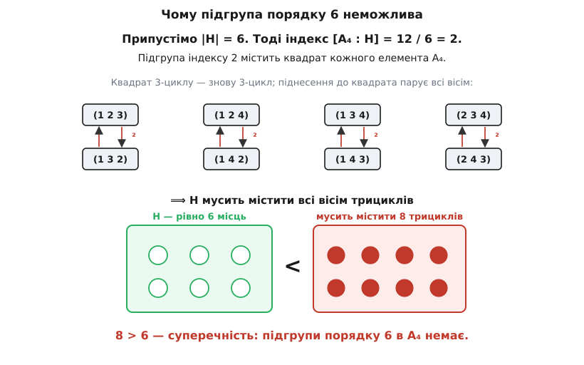
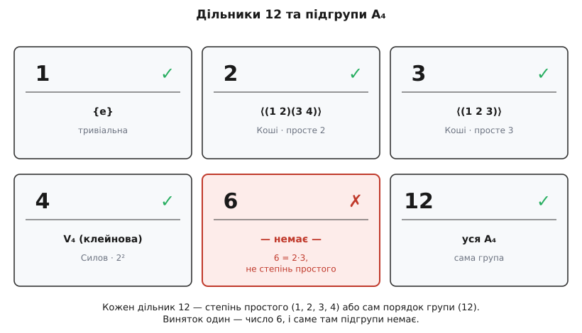

# Обернене до теореми Лагранжа хибне: A₄ без підгрупи порядку 6

Теорема Лагранжа обіцяє одне: порядок кожної підгрупи ділить порядок групи. Спокусливо прочитати її навпаки — якщо число d ділить |G|, то мусить же знайтися підгрупа порядку d. Це **хибно**, і найменший свідок хиби невеликий: знакозмінна група A₄ має 12 елементів, число 6 без остачі ділить 12, а підгрупи із шести елементів у A₄ немає жодної. Нижче це доведено до кінця — а тоді показано, що обернене все ж частково рятується, але лише для простих чисел (теорема Коші) та їхніх степенів (теореми Силова), і саме тому провал стається рівно на числі 6.

Групи, менші за 12, оберненому підкоряються всі до одної — у кожній для кожного дільника порядку підгрупа знаходиться. A₄ — перша, де ланцюг рветься, тому вона й стала канонічним контрприкладом.

## Що таке A₄

A₄ — це група [парних перестановок](topic:math-combinatorics/permutations) чотирьох предметів, скажімо чисел 1, 2, 3, 4. Перестановку звуть **парною**, якщо її можна скласти з парного числа транспозицій — обмінів двох предметів місцями. Таких перестановок рівно половина від усіх 24, тобто 12, і вони справді утворюють групу: склад двох парних — знову парна, тотожність парна (нуль обмінів), обернена до парної теж парна.

Ці 12 елементів бувають лише трьох ґатунків. Випишемо всі до одного, бо на цьому переліку триматиметься доведення.

```
тотожність e                                    — 1 елемент

3-цикли (a b c):
   (1 2 3)  (1 3 2)  (1 2 4)  (1 4 2)
   (1 3 4)  (1 4 3)  (2 3 4)  (2 4 3)            — 8 елементів

подвійні транспозиції (a b)(c d):
   (1 2)(3 4)   (1 3)(2 4)   (1 4)(2 3)          — 3 елементи
```

Запис (a b c) читаємо як «a переходить у b, b у c, c назад в a»; це 3-цикл, і він розкладається на дві транспозиції, тому парний. Подвійна транспозиція (a b)(c d) міняє місцями дві пари — теж дві транспозиції, теж парна. Разом 1 + 8 + 3 = 12, а порядок групи розкладається як 12 = 2²·3. Ці три числа — вісім трициклів, три подвійні транспозиції, одна тотожність — і вирішать усе.

## Важіль: підгрупа індексу 2 ковтає всі квадрати

Перш ніж чіпати A₄, доведемо крихітну загальну лему — саме вона зробить усю роботу.

**Лема.** Якщо підгрупа H має в групі G індекс 2, то x² ∈ H для кожного x ∈ G.

Індекс 2 означає, що H розбиває G рівно на два суміжні класи: саму H та все, що поза нею. Візьмімо будь-який x. Якщо x уже в H, то x² в H задарма — підгрупа замкнена щодо добутку. Нехай тепер x поза H. Тоді другий клас — це саме xH, і x² мусить потрапити в один із двох класів. Припустімо, що не в H, тобто в xH:

```
x² ∈ xH   ⟹   x² = x·h   для якогось h ∈ H
скоротимо x зліва:   x = h
```

Виходить x = h ∈ H — а ми ж узяли x поза H. Суперечність. Отже x² ∈ H. Лему доведено, і в ній немає ані слова про конкретну групу: **будь-яка** підгрупа індексу 2 містить квадрат кожного елемента. (До речі, підгрупа індексу 2 завжди [нормальна](topic:math-algebra/normal-subgroup), і «ковтання квадратів» — одна з граней тієї нормальності; але саме доведення її не потребує.)

> 🔧 **Навіщо це.** Лема перетворює питання «чи є підгрупа порядку 6» на зовсім інше — «які взагалі бувають квадрати в A₄». Розмір 6 дає індекс 2, а індекс 2 — це той рідкісний випадок, коли з самого лише розміру підгрупи вже випливає, кого вона зобов'язана містити. Далі лишається арифметика квадратів.

## Квадрати в A₄ — це всі вісім 3-циклів

Підносимо кожен ґатунок до квадрата. Тотожність: e² = e. Подвійна транспозиція має порядок 2, отже її квадрат — теж e. А от 3-цикл цікавіший: у нього порядок 3, тому квадрат — це обернений, знову 3-цикл.

```
(1 2 3)² :  1→2→3,  2→3→1,  3→1→2   =  (1 3 2)
```

Головне — не просто «квадрат 3-циклу є 3-циклом», а те, що **кожен** 3-цикл сам є чиїмось квадратом. Для 3-циклу τ маємо τ³ = e, звідки (τ⁻¹)² = τ, а τ⁻¹ — знову 3-цикл. Тобто кожен трицикл — це квадрат свого оберненого. Піднесення до квадрата просто переставляє вісім трициклів парами «елемент ↔ обернений»:

```
(1 2 3)² = (1 3 2)      (1 3 2)² = (1 2 3)
(1 2 4)² = (1 4 2)      (1 4 2)² = (1 2 4)
(1 3 4)² = (1 4 3)      (1 4 3)² = (1 3 4)
(2 3 4)² = (2 4 3)      (2 4 3)² = (2 3 4)
```

Отже множина всіх квадратів у A₄ — це рівно {e} разом з усіма вісьма 3-циклами.


*Зліва: піднесення до квадрата парує вісім трициклів «елемент ↔ обернений», тож усі вісім є квадратами. Справа: підгрупа індексу 2 зобов'язана вмістити всі квадрати — щонайменше вісім елементів, а місць у ній лише шість.*

## Суперечність

Тепер зводимо докупи. Припустімо всупереч, що підгрупа H ⊆ A₄ має шість елементів. Її індекс дорівнює 12 / 6 = 2, тож за лемою H містить квадрат кожного елемента A₄ — а квадрати ми щойно перелічили: усі вісім 3-циклів. Виходить, H зобов'язана вмістити щонайменше вісім елементів (самі трицикли, ще й тотожність на додачу), тоді як у неї їх лише шість.

```
мусить містити:   8 трициклів (+ e)   ≥ 8 елементів
насправді в H:    6 елементів
8 > 6   —   неможливо
```

Вісім у шість не влазить. Припущення про підгрупу порядку 6 хибне — її не існує. ∎

## Решта дільників підгрупу мають

Щоб побачити, наскільки хірургічно точний цей провал, перелічимо дільники числа 12: це 1, 2, 3, 4, 6, 12. Підгрупу заданого розміру A₄ має для кожного з них, окрім 6:

- **1:** тривіальна {e}.
- **2:** ⟨(1 2)(3 4)⟩ = {e, (1 2)(3 4)} — подвійна транспозиція має порядок 2.
- **3:** ⟨(1 2 3)⟩ = {e, (1 2 3), (1 3 2)} — трицикл породжує циклічну групу з трьох елементів.
- **4:** {e, (1 2)(3 4), (1 3)(2 4), (1 4)(2 3)} — три подвійні транспозиції разом з e. Що це підгрупа, видно відразу: добуток будь-яких двох дає третю, кожна сама собі обернена, тож множина замкнена. Це відома клейнова четвірка V₄.
- **12:** сама A₄.
- **6:** жодної (щойно доведено).

Замкненість четвірки V₄ — одна вправа на композицію (беремо «спершу права дія», як у запису функцій):

```
(1 2)(3 4) · (1 3)(2 4)   спершу права:
   1→3→4,  2→4→3,  3→1→2,  4→2→1   =   (1 4)(2 3)
```

Добуток двох подвійних транспозицій дав третю — множина не випускає за свої межі, підгрупа порядку 4 існує. А порядок 6 лишається єдиним провалом.

## Часткове обернене, яке таки правдиве

Провал на числі 6 не випадковий — він сидить рівно в тій щілині, якої не закривають дві класичні теореми. Обидві — часткові обернення до Лагранжа, кожна для свого сорту дільника.

**[Теорема Коші](topic:math-algebra/cauchy-theorem).** Якщо [просте число](topic:math-number-theory/prime-numbers) p ділить |G|, то в G є елемент порядку p, а отже й циклічна підгрупа порядку p. (Огюстен-Луї Коші, француз, 1845.) Для простих дільників обернене до Лагранжа справджується завжди.

**[Теореми Силова](topic:math-algebra/sylow-theorems).** Якщо степінь простого pᵏ ділить |G|, то в G є підгрупа порядку pᵏ. (Норвежець Людвіг Силов, *Peter Ludvig Mejdell Sylow*, 1832–1918; опублікував 1872, а відкрив ще 1862.) Для степенів простого обернене теж справджується завжди.

Прикладемо це до 12 = 2²·3. Кожен дільник дванадцяти — або степінь простого, і тоді підгрупу постачає Коші чи Силов, або сам порядок групи 12, який тривіально дає підгрупою всю групу.


*Числа 1, 2, 3, 4 — степені простих, тож підгрупу гарантує Коші (для простих) або Силов (для степенів простого); 12 — сам порядок групи. Єдиний дільник, що не є степенем простого, — 6 = 2·3, і жодна теорема його не покриває; підгрупи порядку 6 в A₄ немає.*

Ось де розгадка. Єдиний виняток серед дільників — 6, добуток двох різних простих 2·3; це не степінь простого, тож жодна з теорем його не гарантує. Обернене до Лагранжа тримається рівно доти, доки дільник лишається степенем простого, і провалюється на першому ж дільнику, що ним не є. A₄ — найменша група, де така щілина взагалі з'являється, і 6 — єдине число, яке в неї провалюється.
