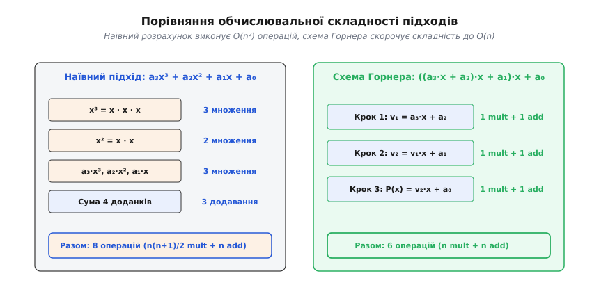
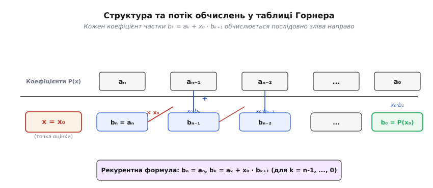
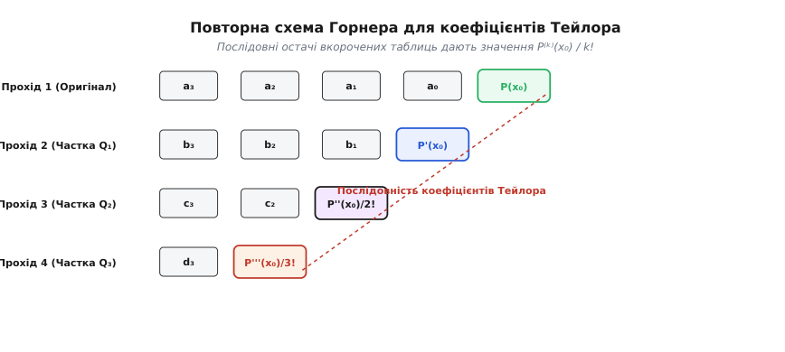

# Схема Горнера

<preknowlist>
- [Поліноми](topic:math-algebra/polynomials) — поняття алгебраїчного многочлена, його степеня, коефіцієнтів та ділення з остачею.
- [Кільця многочленів](topic:math-algebra/polynomial-rings) — кільцева структура множини многочленів та теорема Безу.
- [Афінні та лінійні перетворення](topic:math-algebra/affine-transform) — обчислення значень функцій від масивів, векторів та матриць.
</preknowlist>

Коли комп'ютерній системі потрібно обчислити значення многочлена у конкретній точці, пряме застосування традиційного алгебраїчного запису вимагає значної кількості обчислювальних ресурсів. У тривимірній комп'ютерній графіці при розрахунку кривих Безьє, B-сплайнів та поверхневих сіток, у цифровій обробці сигналів при фільтрації й синтезі звуку, у криптографії та чисельних методах підрахунок значень поліномів виконується мільйони разів на секунду. Пряме піднесення аргументу до степенів та множення на коефіцієнти створює надмірне навантаження на процесор і призводить до швидкого накопичення похибок округлення.

Схема Горнера є компактним алгоритмом, який перетворює многочлен степеня `n` на послідовність вкладених операцій множення та додавання. Це зменшує обчислювальну складність від квадратичної до строго лінійної, мінімізує кількість необхідних регістрів процесора та забезпечує високу чисельну стійкість обчислень.

## 1. Обчислювальна бар'єрна проблема наївного підходу

Алгебраїчний многочлен степеня `n` від однієї змінної `x` у канонічному вигляді записують як суму мономів:

```
P(x) = aₙ xⁿ + aₙ₋₁ xⁿ⁻¹ + aₙ₋₂ xⁿ⁻² + ... + a₁ x + a₀
```

де `aₙ, aₙ₋₁, ..., a₀` — задані числові коефіцієнти, причому старший коефіцієнт `aₙ ≠ 0`.

Якщо обчислювати значення `P(x₀)` у точці `x = x₀` за цією формулою «в лоб», алгоритм має окремо піднести `x₀` до кожного степеня `k` (від `2` до `n`), помножити кожен результат на коефіцієнт `aₖ` і скласти всі отримані доданки.

Порахуємо кількість обчислювальних операцій для наївного підходу:
1. Для обчислення степенів `x₀², x₀³, ..., x₀ⁿ` послідовним множенням потрібно `n - 1` операцій множення.
2. Для множення коефіцієнтів `aₖ` на відповідні степені `x₀ᵏ` потрібно ще `n` операцій множення.
3. Для додавання всіх `n + 1` доданків потрібно `n` операцій додавання.

Загалом для наївного алгоритму потрібно `2n - 1` множень та `n` додавань, тобто усього `3n - 1` арифметичних операцій. Якщо ж степені `x₀ᵏ` обчислювати незалежно для кожного доданку (наприклад, викликаючи функцію піднесення до степеня), кількість множень зростає до `n(n + 1) / 2`, що дає квадратичну складність `O(n²)`.

```
Складність наївного підходу з повторним множенням:
N_mult = 1 + 2 + 3 + ... + n = n(n + 1) / 2
N_add  = n
```


*Порівняння кількості операцій множення та додавання для наївного алгоритму та схеми Горнера.*

Крім високої часової складності, наївний підхід має три суттєві недоліки:
- **Накопичення похибок округлення:** При обчисленні високих степенів `x₀ⁿ` у комп'ютерній арифметиці з плаваючою крапкою похибки розряду швидко зростають через велику кількість послідовних множень.
- **Втрата продуктивності процесора:** Процесору потрібно зберігати в оперативності або регістрах усі проміжні значення степенів `x₀ᵏ`, що спричиняє додаткові операції читання та запису в пам'ять (register pressure).
- **Відсутність паралелізму на рівні інструкцій (ILP):** Оскільки обчислення `x₀ᵏ⁺¹ = x₀ᵏ · x₀` вимагає завершення попереднього множення, конвеєр процесора простаює в очікуванні готовності даних.

---

## 2. Алгебраїчна ідея перегрупування: вкладені дужки

Схема Горнера розв'язує цю проблему шляхом послідовного винесення змінної `x` за дужки. Перегрупуємо доданки многочлена `P(x)` у зворотному порядку, починаючи від старшого степеня:

```
P(x) = aₙ xⁿ + aₙ₋₁ xⁿ⁻¹ + aₙ₋₂ xⁿ⁻² + ... + a₁ x + a₀
     = (aₙ xⁿ⁻¹ + aₙ₋₁ xⁿ⁻² + ... + a₁) x + a₀                  [винесення x за дужки з перших n доданків]
     = ((aₙ xⁿ⁻² + aₙ₋₁ xⁿ⁻³ + ... + a₂) x + a₁) x + a₀          [повторне винесення x із внутрішніх доданків]
```

Продовжуючи цей процес до найглибшого рівня вкладеності, отримаємо еквівалентний запис многочлена у вигляді канонічної форми Горнера:

```
P(x) = (...((aₙ x + aₙ₋₁) x + aₙ₋₂) x ... + a₁) x + a₀
```

У цьому виразі відсутні піднесення до степеня. Алгоритм оцінки значення `P(x₀)` зводиться до послідовності однакових елементарних кроків. Позначимо проміжні значення як `bₙ, bₙ₋₁, ..., b₀`:

```
bₙ   = aₙ
bₙ₋₁ = aₙ₋₁ + x₀ · bₙ
bₙ₋₂ = aₙ₋₂ + x₀ · bₙ₋₁
...
bₖ   = aₖ + x₀ · bₖ₊₁      [загальна рекурентна формула]
...
b₀   = a₀ + x₀ · b₁
```

Кінцеве значення `b₀` дорівнює шуканій величині `P(x₀)`.

### Аналіз складності схеми Горнера

Порахуємо кількість операцій для схеми Горнера:
- Кількість множень: **строго `n`**.
- Кількість додавань: **строго `n`**.
- Загальна кількість арифметичних операцій: **`2n`**.

```
Порівняння кількості операцій для многочлена степеня n:
┌───────────────────────────┬───────────────────┬───────────────────┐
│ Метод                     │ Множення          │ Додавання         │
├───────────────────────────┼───────────────────┼───────────────────┤
│ Наївний (з нуля)          │ n(n + 1) / 2      │ n                 │
│ Наївний (зі збереженням)  │ 2n - 1            │ n                 │
│ Схема Горнера             │ n                 │ n                 │
└───────────────────────────┴───────────────────┴───────────────────┘
```

Економія є вражаючою: кількість множень зменшується у два рази порівняно з оптимальним наївним методом і в `n / 2` разів порівняно з прямим піднесенням до степеня. За теоремою Олександра Островського (1954), складність `n` множень є математично мінімально можливою нижньою межею для обчислення неструктованого многочлена степеня `n`.

### Апаратне прискорення: Fused Multiply-Add (FMA)

Сучасні мікропроцесорні архітектури (x86 з розширенням AVX2/AVX-512, ARM NEON, RISC-V) мають спеціалізовану апаратну інструкцію **FMA** (Fused Multiply-Add), яка виконує операцію `a · b + c` за один такт процесора без проміжного округлення.

Рекурентний крок схеми Горнера `bₖ = bₖ₊₁ · x₀ + aₖ` ідеально лягає на інструкцію FMA. Завдяки цьому обчислення многочлена степеня `n` виконується рівно за `n` процесорних інструкцій FMA, що забезпечує максимально можливу швидкість виконання на сучасному залізі.

> 🔧 **Навіщо це в реальній розробці.**
> У математичних бібліотеках мов програмування (`math.h`, `cmath`, NumPy) стандартні функції `sin(x)`, `cos(x)`, `exp(x)`, `log(x)`, `atan(x)` обчислюються через наближення поліномами Тейлора або Чебишова степенів 8–16. Використання схеми Горнера з інструкціями FMA дозволяє обчислювати елементарні функції в ядрах стандартних бібліотек за 10–15 наносекунд.

---

## 3. Синтетичне ділення та канонічна таблиця Горнера

Схема Горнера — це не лише алгоритм швидкого обчислення значень багаточлена, а й ефективний метод ділення многочлена `P(x)` на лінійний двочлен `x - x₀` з остачею.

Згідно з теоремою про ділення многочленів із остачею, для будь-якого `P(x)` і точки `x₀` існують єдиний многочлен-частка `Q(x)` степеня `n - 1` та числова остача `R`:

```
P(x) = (x - x₀) Q(x) + R
```

За теоремою Безу, якщо підставити `x = x₀`, перший доданок перетворюється на нуль `(x₀ - x₀) Q(x₀) = 0`, звідки маємо рівність `R = P(x₀)`.

### Алгебраїчний зв'язок частки та коефіцієнтів Горнера

Запишемо частку `Q(x)` у вигляді багаточлена з невідомими коефіцієнтами `bₙ, bₙ₋₁, ..., b₁`:

```
Q(x) = bₙ xⁿ⁻¹ + bₙ₋₁ xⁿ⁻² + ... + b₂ x + b₁
```

Розкривши дужки у виразі `(x - x₀) Q(x) + R` та прирівнявши коефіцієнти при однакових степенях `x` до коефіцієнтів вихідного многочлена `P(x)`, отримуємо систему рівностей:

```
aₙ   = bₙ                ⇒   bₙ   = aₙ
aₙ₋₁ = bₙ₋₁ - x₀ bₙ      ⇒   bₙ₋₁ = aₙ₋₁ + x₀ bₙ
aₙ₋₂ = bₙ₋₂ - x₀ bₙ₋₁    ⇒   bₙ₋₂ = aₙ₋₂ + x₀ bₙ₋₁
...
a₀   = R - x₀ b₁         ⇒   R = b₀ = a₀ + x₀ b₁
```

Ці коефіцієнти `bₙ, bₙ₋₁, ..., b₁` є коефіцієнтами частки `Q(x)`, а останній коефіцієнт `b₀` є остачею `R = P(x₀)`. Таким чином, рекурентний процес Горнера одночасно обчислює і значення многочлена, і коефіцієнти частки при діленні на `x - x₀`. Цей процес називається **синтетичним діленням**.

### Структура таблиці Горнера

Для практичних обчислень вручну та в табличних процесорах формують дворядкову таблицю Горнера:


*Структура та потік обчислень коефіцієнтів частки й остачі у таблиці Горнера.*

Порядок заповнення таблиці:
1. У першому рядку записують коефіцієнти багаточлена `P(x)` за спаданням степенів: `aₙ, aₙ₋₁, ..., a₀`. Якщо якийсь проміжний степінь відсутній, на його місці обов'язково пишуть нуль `0`.
2. Ліворуч у другому рядку записують точку оцінки `x₀`.
3. Перший коефіцієнт переносять у другий рядок без змін: `bₙ = aₙ`.
4. Для кожного наступного стовпчика значення `bₖ` обчислюють за правилом: помножити попередній знайдений коефіцієнт `bₖ₊₁` на `x₀` і додати коефіцієнт `aₖ` з першого рядка.

### Практичний чисельний приклад

Розглянемо многочлен 4-го степеня:

```
P(x) = 2x⁴ - 5x³ + 3x² - 7x + 8
```

Знайдемо значення `P(3)` та частку від ділення `P(x)` на `x - 3`.

Коефіцієнти многочлена: `a₄ = 2`, `a₃ = -5`, `a₂ = 3`, `a₁ = -7`, `a₀ = 8`. Точка оцінки: `x₀ = 3`.

Складемо та заповнимо таблицю Горнера крок за кроком:

```
       │   a₄ = 2 │  a₃ = -5 │   a₂ = 3 │  a₁ = -7 │   a₀ = 8
───────┼──────────┼──────────┼──────────┼──────────┼──────────
 x = 3 │   b₄ = 2 │   b₃ = 1 │  b₂ = 6  │  b₁ = 11 │  b₀ = 41
```

Обчислення за стовпчиками:
- `b₄ = a₄ = 2`
- `b₃ = a₃ + x₀ · b₄ = -5 + 3 · 2 = -5 + 6 = 1`
- `b₂ = a₂ + x₀ · b₃ = 3 + 3 · 1 = 3 + 3 = 6`
- `b₁ = a₁ + x₀ · b₂ = -7 + 3 · 6 = -7 + 18 = 11`
- `b₀ = R = a₀ + x₀ · b₁ = 8 + 3 · 11 = 8 + 33 = 41`

Отже:
- Значення многочлена у точці `x = 3` дорівнює **`P(3) = 41`**.
- Частка від ділення дорівнює **`Q(x) = 2x³ + x² + 6x + 11`**.
- Результат ділення можна записати у вигляді тотожності:

```
2x⁴ - 5x³ + 3x² - 7x + 8 = (x - 3)(2x³ + x² + 6x + 11) + 41
```

---

## 4. Похідні багаточлена та розклад у ряд Тейлора

У чисельному аналізі та методях оптимізації (наприклад, у методі Ньютона — Рафсона) окрім значення самого багаточлена `P(x₀)` виникає потреба обчислювати значення його похідних `P'(x₀), P''(x₀), ..., P⁽ⁿ⁾(x₀)`.

Схема Горнера дозволяє обчислити значення всіх похідних багаточлена у точці `x₀` без прямого символьного диференціювання, використовуючи лише повторне синтетичне ділення.

### Теоретичне обґрунтування

Розкладемо многочлен `P(x)` степеня `n` у ряд Тейлора в околі точки `x₀`:

```
P(x) = c₀ + c₁ (x - x₀) + c₂ (x - x₀)² + ... + cₙ (x - x₀)ⁿ
```

де коефіцієнти Тейлора пов'язані з похідними співвідношенням:

```
cₖ = P⁽ᵏ⁾(x₀) / k!
```

Поділимо `P(x)` на `x - x₀` за схемою Горнера. Отримаємо частку `Q₁(x)` та остачу `R₀ = c₀ = P(x₀)`:

```
P(x) = (x - x₀) Q₁(x) + c₀
```

Тепер поділимо отриману частку `Q₁(x)` на `x - x₀`. Отримаємо нову частку `Q₂(x)` та остачу `R₁ = c₁ = P'(x₀)`:

```
Q₁(x) = (x - x₀) Q₂(x) + c₁
```

Продовжуючи цей процес `n` разів, ми послідовно отримаємо всі коефіцієнти Тейлора `c₀, c₁, c₂, ..., cₙ` як остачі від ділення на кожному кроці:


*Послідовне обчислення похідних багаточлена через повторну вкорочену таблицю Горнера.*

### Чисельний приклад обчислення похідних

Розглянемо багаточлен `P(x) = x³ - 4x² + 6x - 2` та знайдемо значення його похідних у точці `x₀ = 2`.

Складемо трикутну таблицю повторного застосування схеми Горнера для `x₀ = 2`:

```
Прохід 1 (Обчислення P(2)):
       │  a₃ = 1 │ a₂ = -4 │  a₁ = 6 │ a₀ = -2
───────┼─────────┼─────────┼─────────┼─────────
 x = 2 │       1 │      -2 │       2 │   c₀ = 2   ⇒  P(2) = 2

Прохід 2 (Обчислення P'(2)):
       │  b₃ = 1 │ b₂ = -2 │  b₁ = 2
───────┼─────────┼─────────┼─────────
 x = 2 │       1 │       0 │   c₁ = 2            ⇒  P'(2) / 1! = 2  ⇒  P'(2) = 2

Прохід 3 (Обчислення P''(2)):
       │  c₃ = 1 │ c₂ =  0
───────┼─────────┼─────────
 x = 2 │       1 │   c₂ = 2                      ⇒  P''(2) / 2! = 2 ⇒  P''(2) = 4

Прохід 4 (Обчислення P'''(2)):
       │  d₃ = 1
───────┼─────────
 x = 2 │  c₃ = 1                                 ⇒  P'''(2) / 3! = 1 ⇒ P'''(2) = 6
```

Перевіримо результат символьним диференціюванням:
- `P(x) = x³ - 4x² + 6x - 2`  ⇒  `P(2) = 8 - 16 + 12 - 2 = 2`
- `P'(x) = 3x² - 8x + 6`       ⇒  `P'(2) = 12 - 16 + 6 = 2`
- `P''(x) = 6x - 8`            ⇒  `P''(2) = 12 - 8 = 4`
- `P'''(x) = 6`                ⇒  `P'''(2) = 6`

Результати повністю збігаються. Повторна схема Горнера дозволяє знайти всі похідні многочлена за `n(n + 1) / 2` множень та стільки ж додавань, що значно швидше за аналітичне обчислення похідних.

---

## 5. Застосування в обчисленні кривих Безьє та геометричному моделюванні

У комп'ютерній графіці, системах автоматизованого проектування (CAD/CAM) та географічних інформаційних системах (GIS) лінії, контури шрифтів (TrueType, OpenType) та поверхні моделюють за допомогою кривих Безьє.

Параметрична крива Безьє степеня `n` описується формою:

```
B(t) = ∑ Pₖ Bₖ,ₙ(t),    t ∈ [0, 1]
```

де `Pₖ` — опорні точки (вектори в `ℝ²` або `ℝ³`), а `Bₖ,ₙ(t) = C(n, k) tᵏ (1 - t)ⁿ⁻ᵏ` — базисні поліноми Бернштейна.

### Алгоритм де Кастельжо як узагальнена схема Горнера

Оцінка точки на криві Безьє при заданому параметрі `t₀ ∈ [0, 1]` традиційно виконується за алгоритмом де Кастельжо (de Casteljau's algorithm). З алгебраїчного погляду алгоритм де Кастельжо є прямою адаптацією схеми Горнера для поліноміального базису Бернштейна.

Замість множення на скаляр `x₀` у традиційній схемі Горнера, алгоритм де Кастельжо виконує послідовну лінійну інтерполяцію (афінну комбінацію) між сусідніми опорними точками:

```
Pₖ⁽ʳ⁾ = (1 - t₀) Pₖ⁽ʳ⁻¹⁾ + t₀ Pₖ₊₁⁽ʳ⁻¹⁾
```

Для кубічної кривої Безьє (`n = 3`) обчислення точки `B(t₀)` вимагає 6 лінійних інтерполяцій, що еквівалентно 3 послідовним крокам схеми Горнера для кожної координатної осі `(x, y, z)`. Це забезпечує чисельно стійке та апаратно прискорене обчислення графічних примітивів безпосередньо у GPU-шейдерах.

---

## 6. Переведення чисел між позиційними системами числення

У програмуванні та комп'ютерній інженерії схема Горнера використовується для перетворення рядкового представлення чисел у позиційній системі числення з основою `b` у внутрішнє двійкове значення процесора.

Число у позиційній системі числення з основою `b` (наприклад, десятирічній `b = 10`, шістнадцятковій `b = 16` або двійковій `b = 2`), записане цифрами `dₙ dₙ₋₁ ... d₁ d₀`, є алгебраїчним многочленом від основи `b`:

```
N = dₙ bⁿ + dₙ₋₁ bⁿ⁻¹ + ... + d₁ b + d₀
```

Застосовуючи схему Горнера до цього багаточлена, ми отримуємо алгоритм перетворення рядка у число без обчислення степенів основи `b`:

```
N = (...((dₙ · b + dₙ₋₁) · b + dₙ₋₂) · b ... + d₁) · b + d₀
```

### Алгоритм функції `atoi` / `strtol`

У стандартних бібліотеках мов C, C++, Rust, Go перетворення рядка в ціле число реалізоване саме за схемою Горнера.

Приклад зчитування шістнадцятеричного числа `"2AF"` (`b = 16`):
- Цифри: `d₂ = 2`, `d₁ = 10` (`A`), `d₀ = 15` (`F`).
- Крок 0: `N = 0`
- Крок 1 (символ `'2'`): `N = 0 · 16 + 2 = 2`
- Крок 2 (символ `'A'`): `N = 2 · 16 + 10 = 32 + 10 = 42`
- Крок 3 (символ `'F'`): `N = 42 · 16 + 15 = 672 + 15 = 687`

Алгоритм обробляє символи поодинці зліва направо у потоковому режимі за один прохід, вимагаючи лише `O(1)` додаткової пам'яті.

### Перетворення дробових чисел (по дробовій частині)

Дробова частина числа у позиційній системі числення з основою `b` представляється у вигляді від'ємних степенів:

```
F = d₋₁ b⁻¹ + d₋₂ b⁻² + ... + d₋ₘ b⁻ᵐ
```

Застосовуючи зворотно вкладену схему Горнера, цей вираз можна переписати як:

```
F = (((... (d₋ₘ / b + d₋ₘ₊₁) / b ... + d₋₂) / b + d₋₁) / b
```

Це дозволяє перетворювати дробові частини рядків у плаваючі числа швидким послідовним діленням без втрати точності розрядів.

---

## 7. Багатовимірне узагальнення: схеми Горнера для поліномів багатьох змінних

У наукових обчисленнях та просторовій інтерполяції виникає задача обчислення многочленів від кількох незалежних змінних `P(x, y)` або `P(x, y, z)`.

Двовимірний багаточлен степеня `n` по `x` та `m` по `y` можна записати у вигляді:

```
P(x, y) = ∑ (∑ aᵢ,ⱼ yʲ) xⁱ
```

Схема Горнера застосовується рекурсивно на двох рівнях (Horner Tree Evaluation):
1. **Зовнішній рівень:** Багаточлен `P(x, y)` розглядається як многочлен від змінної `x`, коефіцієнтами якого є многочлени `Aᵢ(y) = ∑ aᵢ,ⱼ yʲ`.
2. **Внутрішній рівень:** Кожен коефіцієнтний многочлен `Aᵢ(y)` обчислюється окремою класичною схемою Горнера від аргументу `y`.

Такий підхід зменшує кількість множень для двовимірного багаточлена з `O(n² m²)` до `O(n m)`, що принципово прискорює обчислення бікубічної інтерполяції зображень, геодезичних сіток та 3D-сканування.

---

## 8. Обчислювальна стійкість, точність та компенсовані алгоритми

При обчисленні многочленів високих степенів на комп'ютері з обмеженою розрядністю сітки (стандарт IEEE 754) виникають похибки округлення.

Абсолютна похибка обчислення за схемою Горнера у арифметиці з плаваючою крапкою обмежується нерівністю Вількінсона:

```
|fl(P(x₀)) - P(x₀)| ≤ 2n u P̃(|x₀|)
```

де `u` — машинне епсилон (`u ≈ 1.11 × 10⁻¹⁶` для 64-бітного `double`), а `P̃(x) = ∑ |aₖ| xᵏ` — многочлен, складений із модулів коефіцієнтів.

### Поняття обумовленості многочлена

Чисельна стійкість обчислення багаточлена залежить від числа обумовленості (condition number):

```
cond(P, x₀) = P̃(|x₀|) / |P(x₀)|
```

- Якщо `cond(P, x₀) ≈ 1` (усі коефіцієнти мають однаковий знак), схема Горнера забезпечує майже ідеальну точність.
- Якщо `cond(P, x₀) ≫ 1 / u` (знакопочередні багаточлени поблизу кратних коренів), виникає катастрофічне скасування доданків (catastrophic cancellation), і звичайна схема Горнера втрачає всі значущі цифри.

### Компенсована схема Горнера (Compensated Horner Scheme)

Для підвищення точності без переходу на повільне програмне забезпечення з довільною точністю розроблено **компенсовану схему Горнера** (Ogita–Rump–Oishi, 2005).

Ідея компенсованого алгоритму полягає у тому, що похибки кожної інструкції множення та додавання відстежуються в точному вигляді за допомогою алгоритмів **TwoProduct** (через інструкцію FMA) та **TwoSum** (Knuth). Ці похибки накопичуються у супутньому багаточлені похибки `E(x)`, який потім обчислюється додатковою схемою Горнера та додається до основного результату.

Компенсована схема Горнера дає результат з точністю, еквівалентною подвійній розрядності (`quad precision`, 128 біт), працюючи повністю на стандартній 64-бітній апаратній арифметиці `double`.

---

## 9. Узагальнення схеми Горнера

Алгебраїчна універсальність схеми Горнера дозволяє застосовувати її далеко за межами скалярних дійсних чисел.

### 1. Многочлени над скінченними полями Галуа `GF(2ᵐ)`
У теорії кодування та криптографії (контрольні суми CRC, коди Ріда — Соломона, шифрування AES, Galois/Counter Mode GCM) многочлени обчислюються над скінченними полями `GF(2ᵐ)`. Операція додавання замінюється на побітове виключальне АБО (`XOR`), а множення виконується за модулем непривідного многочлена. Схема Горнера зберігає свою `O(n)` складність і є основою апаратних прискорювачів контрольних сум та виправлення помилок.

### 2. Алгоритм Кленшоу для ортогональних поліномів
Якщо багаточлен подано у вигляді розкладу за базисом ортогональних многочленів (наприклад, поліномів Чебишова `Tₖ(x)` або Лежандра `Pₖ(x)`):

```
P(x) = c₀ T₀(x) + c₁ T₁(x) + ... + cₙ Tₙ(x)
```

пряме застосування схеми Горнера неможливе через тричленні рекурентні співвідношення між базисними функціями. Узагальненням схеми Горнера для таких базисів є **алгоритм Кленшоу** (Clenshaw algorithm), який також обчислює суму за `O(n)` операцій без прямого розрахунку ортогональних функцій.

### 3. Матричні многочлени та алгоритм Патерсона — Стокмаєра
Для обчислення матричних функцій (наприклад, матричної експоненти `exp(A)` у системному аналізі або розв'язку диференціальних рівнянь) потрібно обчислювати багаточлени від квадратних матриць `P(A)`. Пряма схема Горнера вимагає `n - 1` множень матриці на матрицю (`O(n m³)` операцій для матриць `m × m`).

**Алгоритм Патерсона — Стокмаєра** (Paterson–Stockmeyer) групує члени матричного многочлена у блоки розміру `k ≈ √n`, застосовуючи схему Горнера до блоків. Це скорочує кількість матричних множень із `n - 1` до `O(√n)`, значно прискорюючи обчислення.

---

## 10. Пов'язані матеріали та вставки

Для глибшого занурення у математичні доведення, історичний контекст та програмну реалізацію схеми Горнера зверніться до спеціалізованих вставок:

- [Історія схеми Горнера](topic:math-algebra/horner-scheme/hist-horner-scheme.md) — детальний історичний екскурс про вилучення коренів многочленів у давньокитайському трактаті Цзінь Цзюшао (1247 р.), праці перського вченого аль-Каші, відкриття Паоло Руффіні та статтю Вільяма Горнера 1819 року.
- [Математичне доведення та аналіз стійкості](topic:math-algebra/horner-scheme/math-horner-proof.md) — строге математичне доведення теореми про ділення многочленів з остачею, виведення теореми Островського про обчислювальну оптимальність, межа похибок Вількінсона та опис матричного алгоритму Патерсона — Стокмаєра.
- [Програмна реалізація схеми Горнера](topic:math-algebra/horner-scheme/proj-horner-scheme.md) — готовий до використання вихідний код мовами C та C++ для оцінки багаточленів, синтетичного ділення, знаходження похідних Тейлора та компенсованої схеми Горнера підвищеної точності.
