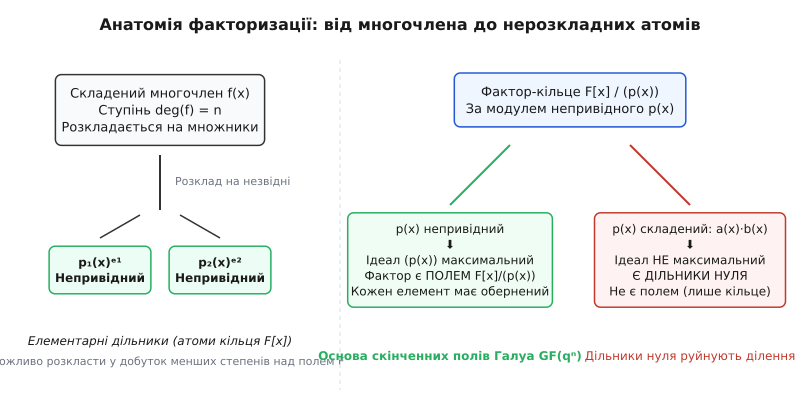
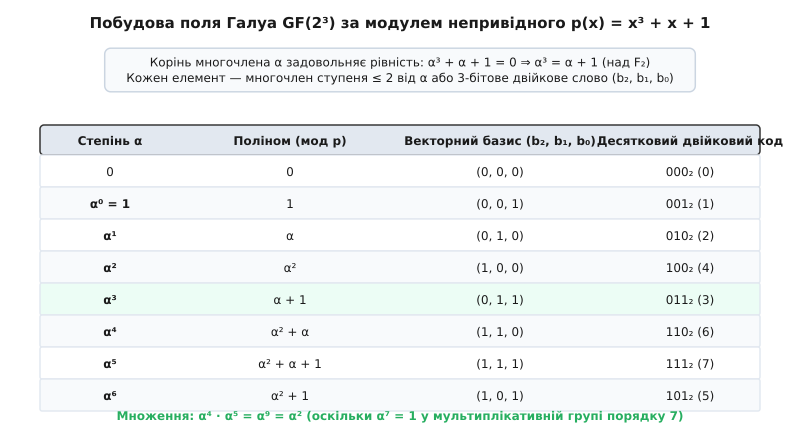
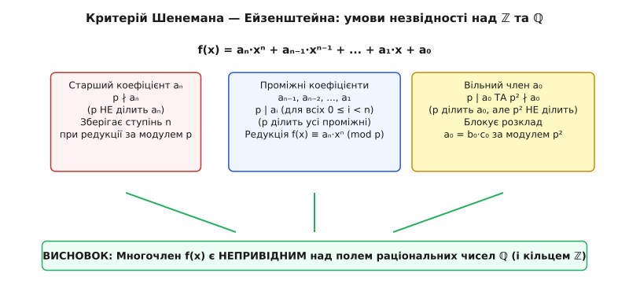
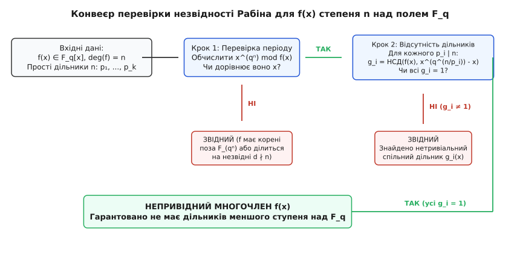

# Непривідні многочлени

<preknowlist>
- [Поліноми](topic:math-algebra/polynomials) — степінь, коефіцієнти, ділення з остачею та корені многочлена.
- [Кільця](topic:math-algebra/rings) — алгебраїчні структури з додаванням та множенням, ідеали та фактор-кільця.
- [Теорія груп](topic:math-algebra/group-theory) — циклічні групи, порядок елемента та мультиплікативна група поля.
</preknowlist>

Кожен раз, коли мережевий адаптер обчислює 32-бітну контрольну суму CRC32 для Ethernet-кадру, коли процесор смартфона шифрує платіж за алгоритмом AES, або коли контролер SSD зчитує пошкоджений сектор через завадостійкий код Ріда — Соломона, апаратні схеми виконують поліноміальне ділення за модулем одного спеціального фіксованого многочлена. Якщо обрати цей многочлен невдало — наприклад, якщо він розкладається на менші поліноміальні множники, — уся цифрова математика миттєво руйнується: операція ділення втрачає однозначність, з'являються дільники нуля (ненульові блоки даних, чий добуток дорівнює нулю), а обернені елементи для дешифрування перестають існувати. 

Фундаментом, що гарантує цілісність, оборотність і коректність таких обчислень, є концепція **непривідних многочленів** — неподільних первинних «атомів» алгебри, які виконують у кільцях многочленів ту саму роль, що й прості числа у звичайній арифметиці цілих чисел.

---

## 1. Практичний вихід: чому цифровий світ стоїть на нерозкладних многочленах

Арифметика звичайних чисел погано підходить для апаратних мікросхем: операція додавання з перенесенням розряду з молодшого біта до старшого створює довгий ланцюжок електричних затримок. Інженери натомість використовують паралельні двійкові операції без перенесення (порозрядний XOR), які природно описуються як додавання многочленів над полем двох елементів `F₂ = {0, 1}`. 

У цій моделі кожен байт чи машинне слово представляється як многочлен від змінної `x`, де біти слугують коефіцієнтами: наприклад, байт `11000011₂` відповідає поліному `x⁷ + x⁶ + x + 1`.

Проте для створення повноцінної алгебри необхідні не лише додавання та множення, а й ділення (знаходження оберненого елемента `a⁻¹`). Множення двох многочленів степеня 7 дає многочлен степеня 14, який не вміщується у вихідний 8-бітний регістр. Щоб утримати результат у межах 8 бітів, його ділять з остачею на фіксований многочлен `p(x)` восьмого степеня.

> 🔧 **Навіщо це.** Якщо многочлен `p(x)` виявиться складеним, тобто розкладатиметься на добуток двох многочленів менших степенів `p(x) = a(x) · b(x)`, то у фактор-системі виникне катастрофічний збій:
> 
> ```
> a(x) · b(x) ≡ 0 (mod p(x))
> ```
> 
> Два ненульові блоки даних `a(x) ≠ 0` та `b(x) ≠ 0` при перемножуванні дадуть нульовий результат. Це означає появу **дільників нуля**: для блоку `a(x)` неможливо знайти обернений елемент `a(x)⁻¹`, адже множення на будь-що ніколи не поверне одиницю. Дешифрування в криптографічному протоколі стане фізично неможливим.
> 
> Лише тоді, коли многочлен `p(x)` є **непривідним** (не має жодних дільників меншого додатного степеня), фактор-структура утворює повноцінне скінченне поле Галуа `GF(2⁸)`, де кожен ненульовий байт має єдиний гарантований обернений елемент. Саме тому в міжнародному криптографічному стандарті AES (Rijndael) жорстко зафіксовано непривідний многочлен `x⁸ + x⁴ + x³ + x + 1`.

Аналогічна ситуація виникає в інших галузях цифрової інженерії:
- **Контрольні суми CRC**: алгоритм CRC-32 використовує непривідний многочлен степеня 32 (`x³² + x²⁶ + x²³ + ... + 1`), гарантуючи виявлення будь-яких поодиноких, подвійних та пачкових помилок у мережевих пакетах Ethernet.
- **Генератори псевдовипадкових чисел LFSR**: регістри зсуву з лінійним зворотним зв'язком на базі непривідних примітивних поліномів генерують псевдовипадкові послідовності максимальної довжини `2ⁿ - 1`, що використовуються в супутниковій навігації GPS та мобільному зв'язку CDMA.
- **Постквантова криптографія (Kyber, Dilithium)**: сучасні алгоритми шифрування, стійкі до квантових комп'ютерів, будуються на кільцях поліномів `ℤ_q[x] / (xⁿ + 1)`, де степінь `n` є степенем двійки, а многочлен `xⁿ + 1` є круговим непривідним многочленом над раціональними числами.

---

## 2. Означення непривідності: атоми кільця многочленів

Нехай задано довільне поле `F` (наприклад, поле раціональних чисел `ℚ`, дійсних чисел `ℝ`, комплексних чисел `ℂ` або скінченне поле Галуа `F_p`). Розглянемо кільце многочленів `F[x]` від однієї змінної `x` із коефіцієнтами з поля `F`.

Многочлен `f(x) ∈ F[x]` записується у вигляді:

```
f(x) = aₙ·xⁿ + aₙ₋₁·xⁿ⁻¹ + ... + a₁·x + a₀
```

де показник `n` при старшому ненульовому коефіцієнті `aₙ ≠ 0` називається степенем многочлена і позначається як `deg(f) = n`.

Оборотними елементами кільця `F[x]` (дільниками одиниці) є виключно ненульові константи — многочлени нульового степеня `deg(c) = 0`, що належать множині `F* = F \ {0}`. Множення на ненульову константу є тривіальною операцією, яка не змінює сутнісної структури многочлена.

> **Означення.** Многочлен `p(x) ∈ F[x]` степеня `deg(p) ≥ 1` називається **непривідним** (або **незвідним**) над полем `F`, якщо його неможливо розкласти у добуток двох многочленів менших додатних степенів із коефіцієнтами з того самого поля `F`.
> 
> Тобто, якщо з рівності:
> 
> ```
> p(x) = a(x) · b(x),   де a(x), b(x) ∈ F[x]
> ```
> 
> неодмінно випливає, що або `deg(a) = 0` (тобто `a(x)` є константою), або `deg(b) = 0` (тобто `b(x)` є константою).
> 
> Якщо ж існують такі многочлени `a(x)` та `b(x)` із степенями `deg(a) ≥ 1` та `deg(b) ≥ 1`, що `p(x) = a(x) · b(x)`, то многочлен `p(x)` називається **звідним** (або **складеним**) над полем `F`.


*Анатомія факторизації: від складеного полінома до незвідних дільників та утворення поля залишків без дільників нуля.*

### Алгебраїчна структура ідеалів: максимальність та простота

У теорії кілець кожен многочлен `p(x)` породжує головний ідеал `(p(x)) = { q(x) · p(x) | q(x) ∈ F[x] }`. Зв'язок між властивостями многочлена та структурою ідеалу є наріжним каменем сучасної алгебри:

1. **Головне ідеальне кільце**: оскільки над полем `F` кільце `F[x]` є евклідовим, будь-який ідеал у ньому є головним (породжується єдиним многочленом).
2. **Критерій максимальності ідеалу**: ідеал `(p(x))` є **максимальним ідеалом** у кільці `F[x]` тоді й лише тоді, коли многочлен `p(x)` є **непривідним** над полем `F`.
3. **Еквівалентність простоти й непривідності**: у кільці `F[x]` поняття простого ідеалу та максимального ідеалу для ненульових елементів збігаються. Якщо непривідний многочлен `p(x)` ділить добуток двох многочленів `a(x) · b(x)`, то він обов'язково ділить хоча б один із множників:
   
   ```
   p(x) | (a(x) · b(x))   ⇒   p(x) | a(x)   або   p(x) | b(x)
   ```

Кожен многочлен `f(x) ∈ F[x]` степеня `deg(f) ≥ 1` однозначно (з точністю до порядку множників та множення на ненульові скаляри з поля `F`) розкладається у канонічний добуток нормованих непривідних многочленів:

```
f(x) = c · p₁ᵉ¹(x) · p₂ᵉ²(x) · ... · pₖᵉᵏ(x)
```

де `c ∈ F*` — старший коефіцієнт, `pᵢ(x)` — попарно різні незвідні нормовані многочлени, а `eᵢ ≥ 1` — їхні кратності.

---

## 3. Базове поле вирішує все: відносність нерозкладності

Найпоширеніша помилка під час першого знайомства з многочленами — сприймати непривідність як внутрішню, абсолютну властивість самої формули. Непривідність **завжди визначена відносно конкретного поля коефіцієнтів `F`**. Той самий символьний вираз може бути абсолютно нерозкладним в одному числовому полі й миттєво розпадатися на множники в іншому.

Розглянемо класичні показові випадки:

### Випадок 1: многочлен `x² + 1`
- **Над полем дійсних чисел `ℝ`**: многочлен `x² + 1` є **непривідним**. Для будь-якого дійсного числа `x ∈ ℝ` вираз `x² + 1 ≥ 1 > 0`, тобто многочлен не має дійсних коренів і не розкладається на лінійні множники з дійсними коефіцієнтами.
- **Над полем раціональних чисел `ℚ`**: аналогічно є **непривідним**.
- **Над полем комплексних чисел `ℂ`**: многочлен стає **звідним**, оскільки у полі `ℂ` існує уявна одиниця `i` (де `i² = -1`):
  
  ```
  x² + 1 = (x - i) · (x + i)   [коефіцієнти ±i належать ℂ]
  ```

- **Над скінченним полем двох елементів `F₂ = ℤ / 2ℤ`**: тут діє модульна арифметика за модулем 2, де `1 + 1 = 2 ≡ 0`, отже `+1 ≡ -1`. Вираз набуває вигляду:
  
  ```
  x² + 1 = x² + 2x + 1 = (x + 1)²   [над полем F₂]
  ```
  
  Многочлен `x² + 1` над `F₂` виявляється повним квадратом і є **звідним**!

### Випадок 2: многочлен `x² - 2`
- **Над полем раціональних чисел `ℚ`**: є **непривідним**, оскільки число `√2` є ірраціональним (`√2 ∉ ℚ`), і записати розклад із раціональними коефіцієнтами неможливо.
- **Над полем дійсних чисел `ℝ`**: є **звідним**, оскільки:
  
  ```
  x² - 2 = (x - √2) · (x + √2)   [коефіцієнти ±√2 належать ℝ]
  ```

### Теоретичні наслідки для числових полів

1. **Основна теорема алгебри над полем комплексних чисел `ℂ`**: поле `ℂ` є алгебраїчно замкненим. Єдиними непривідними многочленами в кільці `ℂ[x]` є многочлени **першого степеня** (лінійні біноми `a·x + b`). Будь-який многочлен степеня `n ≥ 2` над `ℂ` гарантовано розкладається на `n` лінійних множників.
2. **Непривідні многочлени над полем дійсних чисел `ℝ`**: у кільці `ℝ[x]` непривідними є виключно:
   - Многочлени першого степеня: `a·x + b`;
   - Многочлени другого степеня з від'ємним дискримінантом: `a·x² + b·x + c`, де `b² - 4ac < 0`.
   Усі многочлени степеня `n ≥ 3` над `ℝ` завжди є звідними.
3. **Кільця `ℚ[x]` та `F_q[x]`**: над полем раціональних чисел та над скінченними полями існують непривідні многочлени **довільно високих степенів** (хоч сотого, хоч мільйонного).

---

## 4. Мінімальні многочлени та розширення полів

Поняття непривідного многочлена нерозривно пов'язане з алгебраїчними числами. Число `α` називається алгебраїчним над полем `F`, якщо існує хоча б один ненульовий многочлен `f(x) ∈ F[x]`, для якого `f(α) = 0`.

Серед усіх таких многочленів існує єдиний нормований многочлен найменшого степеня, який називається **мінімальним многочленом** елемента `α` над полем `F` і позначається як `m_α(x)`:
1. **Непривідність**: мінімальний многочлен `m_α(x)` обов'язково є непривідним над `F`. Якби він розкладався `m_α(x) = g(x) · h(x)`, то `g(α) · h(α) = 0`, що означало б, що або `g(α) = 0`, або `h(α) = 0`, суперечачи мінімальності степеня `m_α`.
2. **Подільність**: будь-який інший многочлен `f(x) ∈ F[x]`, для якого `f(α) = 0`, обов'язково ділиться на `m_α(x)` без остачі в кільці `F[x]`.
3. **Ступінь розширення**: степінь розширення поля `[F(α) : F]`, тобто розмірність `F(α)` як векторного простору над `F`, точно дорівнює степеню мінімального непривідного многочлена: `deg(m_α)`.

**Приклади мінімальних многочленів над `ℚ`:**
- Для числа `α = √2`: мінімальний многочлен `m(x) = x² - 2` (степінь розширення `[ℚ(√2) : ℚ] = 2`, базис `{1, √2}`);
- Для числа `α = i = √(-1)`: мінімальний многочлен `m(x) = x² + 1` (степінь `[ℚ(i) : ℚ] = 2`, базис `{1, i}`);
- Для числа `α = ³√2`: мінімальний многочлен `m(x) = x³ - 2` (степінь `[ℚ(³√2) : ℚ] = 3`, базис `{1, ³√2, ³√4}`).

---

## 5. Корені та степені: де закінчується очевидна інтуїція

Як пов'язані корені многочлена з його подільністю? За теоремою Безу, число `α ∈ F` є коренем многочлена `f(x)` (тобто `f(α) = 0`) тоді й лише тоді, коли `f(x)` ділиться без остачі на лінійний біном `(x - α)`.

Звідси випливають фундаментальні закономірності залежно від степеня многочлена:

### Степінь 1 (лінійні многочлени)
Многочлени виду `a·x + b` (де `a ≠ 0`) мають степінь 1. Їх неможливо розкласти у добуток многочленів менших додатних степенів, оскільки єдині менші степені — це 0 (константи). Отже, **всі лінійні многочлени завжди непривідні над будь-яким полем**.

### Степені 2 та 3 (квадратичні й кубічні многочлени)
Для многочленів другого та третього степенів діє просте і надійне правило:

> **Теорема.** Многочлен `f(x) ∈ F[x]` степеня 2 або 3 є непривідним над полем `F` тоді й лише тоді, коли він **не має жодного кореня в полі `F`**.

**Доведення.** 
- Якщо `f(x)` має корінь `α ∈ F`, то за теоремою Безу `f(x) = (x - α) · q(x)`, де `deg(q) = deg(f) - 1 ≥ 1`. Це означає, що `f(x)` звідний.
- Навпаки, якщо `f(x)` звідний, то `f(x) = g(x) · h(x)`, де `deg(g) + deg(h) = deg(f) ≤ 3`, причому `deg(g) ≥ 1` та `deg(h) ≥ 1`. Єдині можливі розбиття степенів для суми 2 це `1 + 1`, а для суми 3 це `1 + 2`. В обох випадках щонайменше один із множників (позначимо його `g(x)`) має степінь рівно 1: `g(x) = c·x + d`. Тоді `α = -d/c ∈ F` є коренем многочлена `g(x)`, а отже, і коренем усього многочлена `f(x)`.

### Пастка вищих степенів (`deg ≥ 4`)

Поширена помилка — вважати, що відсутність коренів завжди означає непривідність для будь-якого степеня. Для степенів `n ≥ 4` це твердження **хибне**!

Многочлен степеня 4 може розкладатися на добуток двох непривідних многочленів другого степеня:

```
f(x) = g(x) · h(x),   де deg(g) = 2, deg(h) = 2
```

Якщо ані `g(x)`, ані `h(x)` не мають коренів у полі `F`, то й вихідний многочлен `f(x)` не матиме жодного кореня в `F`, але при цьому він залишається **звідним**.

**Класичні контрприклади:**
1. **Над полем дійсних чисел `ℝ`:**
   Многочлен `f(x) = x⁴ + 2x² + 1 = (x² + 1)²`.
   Для будь-якого `x ∈ ℝ` значення `f(x) ≥ 1 > 0`, тобто многочлен не має жодного дійсного кореня. Проте він розкладається на два дійсні множники `(x² + 1) · (x² + 1)` і є звідним.
2. **Над полем раціональних чисел `ℚ` (тотожність Софі Жермен):**
   Розглянемо многочлен `f(x) = x⁴ + 4`.
   Він не має раціональних коренів (рівняння `x⁴ = -4` не має розв'язків навіть у дійсних числах). Проте виконаємо штучне виділення повного квадрата:
   
   ```
   x⁴ + 4 = (x⁴ + 4x² + 4) - 4x²
   = (x² + 2)² - (2x)²                 [різниця квадратів]
   = (x² - 2x + 2) · (x² + 2x + 2)     [розклад над ℚ]
   ```
   
   Многочлен `x⁴ + 4` розклався на добуток двох квадратичних триномів із раціональними коефіцієнтами, отже він звідний над `ℚ`.
3. **Над скінченним полем `F₂`:**
   Многочлен `f(x) = x⁴ + x² + 1`.
   Підставимо всі можливі елементи поля `F₂ = {0, 1}`:
   `f(0) = 0 + 0 + 1 = 1 ≠ 0`;
   `f(1) = 1 + 1 + 1 = 1 ≠ 0`.
   Многочлен не має коренів у полі `F₂`. Проте:
   
   ```
   (x² + x + 1)² = x⁴ + x² + 1   [оскільки подвоєні добутки 2x³ = 0 та 2x = 0 над F₂]
   ```
   
   Многочлен є квадратом незвідного многочлена `x² + x + 1`, а отже, є звідним.

---

## 6. Сепарабельність та формальні похідні

Важливою властивістю непривідного многочлена є відсутність кратних коренів у його полі розкладу. Многочлен називається **сепарабельним**, якщо всі його корені в полі розкладу є простими (мають кратність 1).

Для перевірки кратності коренів використовується формальна похідна многочлена `f'(x)`:

```
(aₙ·xⁿ + ... + a₁·x + a₀)' = n·aₙ·xⁿ⁻¹ + ... + 2·a₂·x + a₁
```

> **Теорема про кратні корені.** Многочлен `f(x)` має кратний корінь у деякому розширенні поля `F` тоді й лише тоді, коли його найбільший спільний дільник із власною формальною похідною має додатний степінь: `deg(НСД(f, f')) ≥ 1`.

Для непривідного многочлена `p(x)` єдиними дільниками є константи та сам `p(x)`. Оскільки `deg(p') < deg(p)`, можливі лише два випадки:
1. `p'(x) ≠ 0`: тоді `НСД(p(x), p'(x)) = 1`, і многочлен `p(x)` гарантовано є **сепарабельним** (не має жодних кратних коренів).
2. `p'(x) = 0`: це можливо лише в полях додатної характеристики `p > 0`, коли всі ненульові показники степенів кратні `p`: `p(x) = g(xᵖ)`.

> **Наслідок.** Над будь-яким полем характеристики 0 (зокрема над `ℚ`, `ℝ`, `ℂ`) та над будь-яким скінченним полем `F_q` **кожен непривідний многочлен є строго сепарабельним**. 

Несепарабельні непривідні многочлени існують лише над нескінченними полями додатної характеристики (наприклад, многочлен `xᵖ - t` над полем раціональних функцій `F_p(t)`).

---

## 7. Побудова полів розширення та фактор-кільце `F[x] / (p(x))`

Головна алгебраїчна місія непривідних многочленів — створення нових числових систем (розширень полів). 

Нехай `p(x) ∈ F[x]` — непривідний многочлен степеня `n`. Головний ідеал, породжений цим многочленом, складається з усіх поліномів, що діляться на `p(x)`:

```
(p(x)) = { q(x) · p(x) | q(x) ∈ F[x] }
```

Розглянемо фактор-кільце за цим ідеалом:

```
K = F[x] / (p(x))
```

Елементами фактор-кільця є класи залишків від ділення на `p(x)`. Кожен такий клас однозначно задається канонічним представником — многочленом `r(x)` степеня строго менше `n`:

```
r(x) = cₙ₋₁·xⁿ⁻¹ + cₙ₋₂·xⁿ⁻² + ... + c₁·x + c₀,   де cᵢ ∈ F
```

> **Фундаментальна теорема.** Фактор-кільце `F[x] / (p(x))` є **полем** тоді й лише тоді, коли многочлен `p(x)` є **непривідним** над полем `F`.


*Структура розширення поля GF(2³) = F₂[x]/(x³ + x + 1): векторне представлення та степені твірного елемента α.*

### Доведення через розширений алгоритм Евкліда

Чому фактор-кільце стає полем, коли `p(x)` непривідний?
У полі кожен ненульовий елемент повинен мати мультиплікативний обернений. Візьмемо довільний ненульовий залишок `a(x) ≠ 0`, де `deg(a) < deg(p) = n`.

Оскільки `p(x)` є непривідним, він не має жодних дільників додатного степеня, окрім самого себе (помноженого на константу). Оскільки `deg(a) < deg(p)`, многочлен `a(x)` не може ділитися на `p(x)`. Звідси найбільший спільний дільник цих многочленів дорівнює одиниці:

```
НСД(a(x), p(x)) = 1
```

За теоремою Безу для многочленів (співвідношення Безу), існують такі многочлени `u(x), v(x) ∈ F[x]`, що:

```
a(x) · u(x) + p(x) · v(x) = 1
```

Розглянемо цю рівність за модулем многочлена `p(x)`:

```
a(x) · u(x) ≡ 1 (mod p(x))
```

Многочлен `u(x) mod p(x)` є точно шуканим мультиплікативним **оберненим елементом** `a(x)⁻¹` у фактор-кільці. Оскільки кожен ненульовий залишок має обернений, фактор-кільце `F[x] / (p(x))` є полем.

Якщо позначити клас залишку змінної `x mod p(x)` як новий символ `α`, то `p(α) = 0`. Ми буквально сконструювали нове більше поле `K = F(α)`, додавши до вихідного поля `F` формальний корінь непривідного многочлена `p(x)`.

---

## 8. Повний числовий приклад: побудова поля Галуа `GF(2³)`

Простежимо всі етапи побудови поля розширення `GF(8) = GF(2³)` на конкретних числах.

1. **Вибір базового поля та степеня:**
   Базове поле `F = F₂ = {0, 1}`. Ми хочемо побудувати поле з `2³ = 8` елементів, тому нам потрібен непривідний многочлен степеня `n = 3` над `F₂`.
2. **Пошук непривідного многочлена:**
   Розглянемо многочлен `p(x) = x³ + x + 1`.
   Перевіримо його на корені в полі `F₂`:
   - `p(0) = 0³ + 0 + 1 = 1 ≠ 0`;
   - `p(1) = 1³ + 1 + 1 = 3 ≡ 1 ≠ 0`.
   Многочлен третього степеня не має коренів у полі `F₂`, отже він є **непривідним**.
3. **Елементи поля `GF(8)`:**
   Кожен елемент поля `F₂[x] / (x³ + x + 1)` є залишком степеня не вище 2: `c₂·α² + c₁·α + c₀`, де `cᵢ ∈ {0, 1}`. Це дає рівно 8 елементів, які можна зіставити з 3-бітними двійковими векторами `(c₂, c₁, c₀)`:
   - `0` → `(0, 0, 0)`;
   - `1` → `(0, 0, 1)`;
   - `α` → `(0, 1, 0)`;
   - `α²` → `(1, 0, 0)`;
   - `α³ = α + 1` → `(0, 1, 1)` [оскільки `α³ + α + 1 = 0 ⇒ α³ = α + 1` над `F₂`];
   - `α⁴ = α · α³ = α(α + 1) = α² + α` → `(1, 1, 0)`;
   - `α⁵ = α · α⁴ = α(α² + α) = α³ + α² = (α + 1) + α² = α² + α + 1` → `(1, 1, 1)`;
   - `α⁶ = α · α⁵ = α(α² + α + 1) = α³ + α² + α = (α + 1) + α² + α = α² + 1` → `(1, 0, 1)`;
   - `α⁷ = α · α⁶ = α(α² + 1) = α³ + α = (α + 1) + α = 1` [мультиплікативна група замкнулася!].
4. **Пошук оберненого елемента через алгоритм Евкліда:**
   Знайдемо обернений елемент до `a(α) = α² + 1` (вектор `101₂`):
   Виконаємо ділення многочленів над `F₂`:
   
   ```
   (x³ + x + 1) : (x² + 1) = x,   остача 1
   ```
   
   Запишемо рівність Евкліда:
   
   ```
   (x³ + x + 1) + x · (x² + 1) = 1
   ```
   
   Перейдемо до фактор-кільця за модулем `p(x) = x³ + x + 1`:
   
   ```
   x · (x² + 1) ≡ 1 (mod x³ + x + 1)
   ```
   
   Отже, оберненим елементом до `α² + 1` є елемент `α` (тобто `(α² + 1)⁻¹ = α`).
   Перевіримо прямим множенням у полі:
   
   ```
   (α² + 1) · α = α³ + α
   = (α + 1) + α      [підстановка α³ = α + 1]
   = 2α + 1
   = 1                [оскільки 2 ≡ 0 над F₂]
   ```
   
   Отримано точну одиницю. Розрахунок повністю підтвердив теоретичну модель.

---

## 9. Примітивні многочлени проти непривідних

У прикладних задачах (LFSR, криптографія) часто вимагається не просто непривідність, а **примітивність** многочлена.

> **Означення.** Непривідний многочлен `p(x) ∈ F_q[x]` степеня `n` називається **примітивним**, якщо його корінь `α` у полі розширення `GF(qⁿ)` є генератором (первісним елементом) усієї мультиплікативної групи `GF(qⁿ)*`.
> 
> Тобто найменше натуральне число `e`, для якого `αᵉ = 1` у полі розширення, точно дорівнює максимальному порядку групи:
> 
> ```
> ord(p) = qⁿ - 1
> ```

Не кожен непривідний многочлен є примітивним:
- Над полем `F₂` розглянемо многочлен 4-го степеня `p₁(x) = x⁴ + x³ + x² + x + 1`. Він є **непривідним** над `F₂` (це круговий многочлен `Φ₅(x)`). Проте його корінь задовольняє `α⁵ = 1`. Період дорівнює 5, що значно менше за `2⁴ - 1 = 15`. Отже, `p₁(x)` є непривідним, але **не примітивним**.
- Натомість многочлен `p₂(x) = x⁴ + x + 1` над `F₂` є **примітивним**: його корінь `α` породжує всі 15 ненульових елементів поля `GF(16)`. Регістр LFSR із таким поліномом зворотного зв'язку генерує повний цикл бітів довжини 15.

Кількість примітивних многочленів степеня `n` над `F_q` визначається через функцію Ейлера `φ`:

```
N_prim(n) = φ(qⁿ - 1) / n
```

---

## 10. Поле розкладу та транзитивність групи Галуа

Непривідний многочлен `p(x) ∈ F[x]` степеня `n` може не мати всіх своїх коренів у простому приєднанні `F(α) = F[x] / (p(x))`. Полем розкладу (англ. *splitting field*) многочлена `p(x)` над `F` називається найменше розширення `E ⊇ F`, у якому `p(x)` повністю розпадається на лінійні множники:

```
p(x) = aₙ · (x - α₁) · (x - α₂) · ... · (x - αₙ),   де αᵢ ∈ E
```

### Транзитивна дія автоморфізмів Галуа

Групою Галуа `Gal(E / F)` називається група всіх польових автоморфізмів поля `E`, які залишають нерухомими всі елементи базового поля `F`.

> **Фундаментальна теорема про транзитивність.** Многочлен `p(x) ∈ F[x]` є непривідним над полем `F` тоді й лише тоді, коли група Галуа `Gal(E / F)` діє **транзитивно** на множині його коренів `{α₁, α₂, ..., αₙ}`.

Це означає, що для будь-якої пари коренів `αᵢ` та `αⱼ` обов'язково існує такий автоморфізм `σ ∈ Gal(E / F)`, який переводить корінь `αᵢ` у корінь `αⱼ`:

```
σ(αᵢ) = αⱼ
```

Якщо многочлен є складеним `f(x) = g(x) · h(x)`, множина його коренів розпадається на неперетинні орбіти дій групи Галуа (корені `g(x)` переходять лише у корені `g(x)`, а корені `h(x)` — лише у корені `h(x)`). Непривідність — це алгебраїчна нерозривність системи коренів під дією симетрій.

**Приклад поля розкладу для `x³ - 2` над `ℚ`:**
- Корені многочлена: `α₁ = ³√2`, `α₂ = ³√2 · ω`, `α₃ = ³√2 · ω²`, де `ω = e^(2πi/3) = (-1 + i√3)/2` — первісний кубічний корінь з 1.
- Просте розширення `ℚ(³√2)` є дійсним полем і містить лише один корінь `α₁`. Його степінь `[ℚ(³√2) : ℚ] = 3`.
- Поле розкладу `E = ℚ(³√2, ω)` потребує додаткового приєднання комплексного числа `ω` (степінь `[E : ℚ(³√2)] = 2`).
- Повний степінь розширення `[E : ℚ] = 3 · 2 = 6`. Група Галуа `Gal(E / ℚ)` ізоморфна повній симетричній групі перестановок трьох елементів `S₃` порядку 6.

---

## 11. Спряжені елементи, слід та норма у скінченних полях

У скінченних полях `F_q` поле розкладу довільного непривідного многочлена `p(x)` степеня `n` влаштоване значно простіше: воно **завжди збігається** з простим розширенням `GF(qⁿ) = F_q(α)`.

Група Галуа скінченного розширення `Gal(GF(qⁿ) / F_q)` є циклічною групою порядку `n`, яка породжується єдиним канонічним автоморфізмом — **автоморфізмом Фробеніуса**:

```
Frob_q(y) = y^q
```

Якщо `α` є коренем непривідного нормованого многочлена `p(x)` степеня `n` над полем `F_q`, то всі інші `n - 1` коренів утворюються послідовним застосуванням оператора Фробеніуса:

```
α, α^q, α^(q²), α^(q³), ..., α^(qⁿ⁻¹)
```

Ці елементи називаються **спряженими елементами** (англ. *Galois conjugates*) до `α`. Многочлен `p(x)` однозначно відновлюється як добуток:

```
p(x) = (x - α) · (x - α^q) · (x - α^(q²)) · ... · (x - α^(qⁿ⁻¹))
```

За теоремою Вієта коефіцієнти непривідного многочлена безпосередньо виражають інваріанти елемента `α`:
1. **Слід елемента (Trace)**:
   
   ```
   Tr(α) = α + α^q + α^(q²) + ... + α^(qⁿ⁻¹) ∈ F_q
   ```
   
   Коефіцієнт при `xⁿ⁻¹` у многочлені `p(x)` дорівнює `-Tr(α)`.
2. **Норма елемента (Norm)**:
   
   ```
   N(α) = α · α^q · α^(q²) · ... · α^(qⁿ⁻¹) = α^((qⁿ - 1) / (q - 1)) ∈ F_q
   ```
   
   Вільний член многочлена `p(x)` дорівнює `(-1)ⁿ · N(α)`.

---

## 12. Критерії та методи перевірки незвідності

Як швидко перевірити, чи є заданий многочлен непривідним, без повного перебору дільників? Алгебра виробила низку потужних аналітичних та алгоритмічних критеріїв:

1. **Лема Гаусса про зміст многочлена:** пов'язує незвідність над цілими числами `ℤ` та раціональними дробами `ℚ`. Вона стверджує, що для примітивного цілочисельного многочлена незвідність у кільці `ℤ[x]` повністю еквівалентна незвідності в полі `ℚ[x]`.
2. **Критерій Шенемана — Ейзенштейна:** якщо для многочлена `f(x) = aₙ·xⁿ + ... + a₀ ∈ ℤ[x]` існує просте число `p`, яке ділить усі коефіцієнти, крім старшого (`p ∤ aₙ`, `p | aᵢ` для `i < n`), а квадрат цього простого числа не ділить вільний член (`p² ∤ a₀`), то многочлен є непривідним над `ℚ`.


*Логіка критерію Ейзенштейна: умови на старший, проміжні коефіцієнти та вільний член, що блокують розклад над раціональними числами.*

3. **Редукція за простим модулем:** якщо при редукції коефіцієнтів многочлена за простим модулем `p` (де `p ∤ aₙ`) отриманий многочлен `f̄(x) ∈ F_p[x]` є непривідним у скінченному полі `F_p`, то вихідний многочлен `f(x)` є непривідним над `ℚ`.
4. **Формула кількості непривідних многочленів Гаусса:** дозволяє точно обчислити, скільки існує нормованих непривідних многочленів степеня `n` над полем `F_q`, використовуючи функцію Мьобіуса:
   
   ```
   N_q(n) = (1 / n) · ∑_{d | n} μ(d) · qⁿᐟᵈ
   ```

5. **Алгоритм Рабіна (1980):** високошвидкісний детермінований алгоритм перевірки незвідності многочлена степеня `n` над скінченним полем `F_q`, що базується на обчисленні `x^(qⁿ) mod f(x)` та перевірці найбільших спільних дільників із частковими степенями `НСД(x^(qⁿᐟᵖⁱ) - x, f(x)) = 1`.


*Конвеєр алгоритму Рабіна: перевірка періоду за модулем x^(qⁿ) - x та відсутності дільників менших степенів.*

Усі ці теореми, їхні строгі покрокові виведення та числові приклади винесено в окремий аналітичний розділ: [детальні математичні виведення та критерії незвідності від Ейзенштейна до Рабіна](topic:math-algebra/irreducible-polynomials/math-irreducibility-criteria.md).

---

## 13. Історичний розвиток концепції

Шлях до сучасного розуміння незвідності тривав майже два століття — від геометричних досліджень Карла Фрідріха Гаусса щодо побудови правильного 17-кутника у 1796 році та формулювання леми про примітивні многочлени в *Disquisitiones Arithmeticae* (1801), через праці Теодора Шенемана (1846) та Фердинанда Ейзенштейна (1850) з модульної редукції, до конструктивного алгоритму факторизації Леопольда Кронекера (1882).

У другій половині XX століття виклики цифрового зв'язку, радіолокації та завадостійкого кодування породили сучасні поліноміальні алгоритми факторизації над скінченними полями Елвіна Берлекампа (1967), Девіда Кантора та Ганса Цассенхауза (1981), а також метод редукції ґраток LLL (1982). 

Детальний життєпис цих ідей, історичні суперечки та практичний контекст відкриттів висвітлено у вставці: [історію відкриття критеріїв незвідності від Гаусса та Ейзенштейна до Кронекера і Берлекампа](topic:math-algebra/irreducible-polynomials/hist-eisenstein-gauss.md).

---

## 14. Алгоритми факторизації та програмна реалізація

Для розкладання складених многочленів на непривідні множники комп'ютерна алгебра застосовує трифазний конвеєр:
1. **Square-Free Factorization (Алгоритм Юна):** видалення кратних множників через взяття формальної похідної та обчислення `НСД(f, f')`.
2. **Distinct-Degree Factorization (DDF):** групування незвідних множників за їхніми степенями за допомогою послідовності `НСД(x^(pᵈ) - x, f(x))`.
3. **Equal-Degree Factorization (EDF, Кантор — Цассенхауз або матриця Берлекампа):** остаточне розщеплення многочленів однакового степеня через випадкові проекції сліду `T(a(x)) mod g(x)` або знаходження базису ядра матриці Фробеніуса `(Q - I)v = 0`. Імовірнісний підхід Кантора — Цассенхауза ділить множники за логарифмічний час і є оптимальним для криптографічних полів великої характеристики, тоді як матричний метод Берлекампа дає строго детермінований розв'язок для малих характеристик `p = 2, 3`.

Повний вихідний код автономної бібліотеки поліноміальної алгебри з підтримкою C та сучасного C++20 наведено у вставці: [програмну реалізацію факторизації многочленів над скінченними полями мовами C та C++](topic:math-algebra/irreducible-polynomials/proj-berlekamp-factorization.md).

---

## 15. Підсумковий синтез: непривідні многочлени як каркас алгебри

Непривідні многочлени — це фундаментальні атоми алгебраїчного простору. Вони з'єднують абстрактну теорію кілець та полів із конкретною кремнієвою архітектурою сучасних процесорів:

1. **У теорії полів та чисел**: непривідний многочлен задає мінімальний поліном алгебраїчного числа, визначаючи структуру числових полів, ступінь їхнього розширення та групу симетрій Галуа, що дає відповідь на класичне питання про розв'язність рівнянь у радикалах.
2. **У скінченній геометрії та комбінаториці**: корінь примітивного непривідного многочлена генерує мультиплікативну групу поля Галуа, утворюючи циклічні структури максимальної довжини для псевдовипадкових генераторів та скремблерів.
3. **У сучасній криптографії та кібербезпеці**: непривідні многочлени гарантують існування та однозначність обернених операцій у симетричному шифруванні (AES), формують поля для криптографії на еліптичних кривих (ECDSA, Ed25519) та лежать в основі доведень із нульовим розголошенням (ZK-SNARKs) і постквантових алгоритмів на поліноміальних ґратках (Kyber, Dilithium).

Без непривідних многочленів алгебра була б позбавлена неподільних структурних одиниць, а цифрова інформаційна інфраструктура — надійних математичних гарантій цілісності та безпеки.
