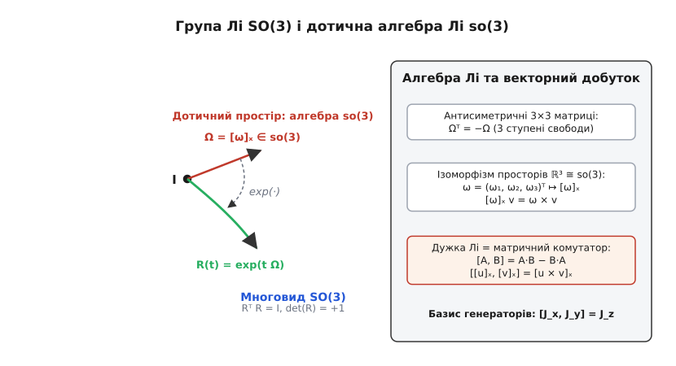
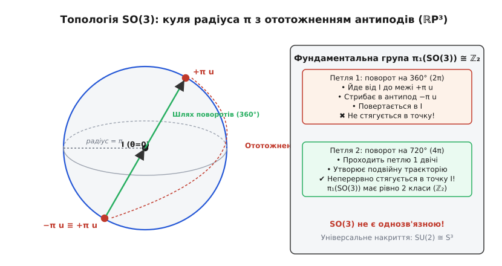
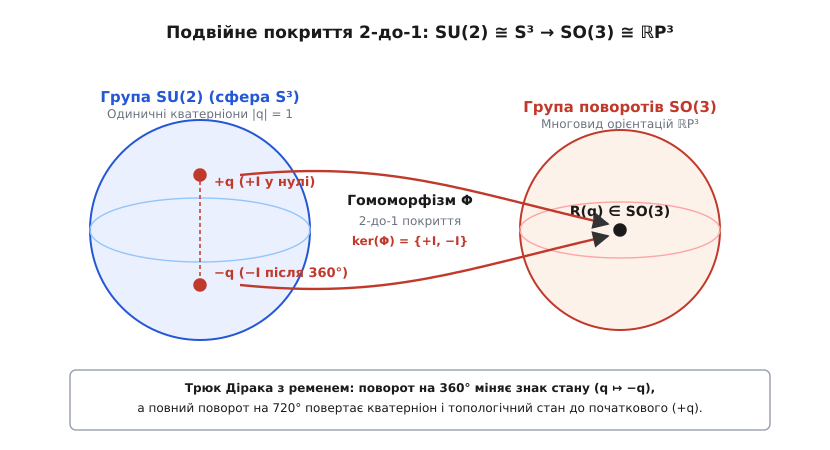
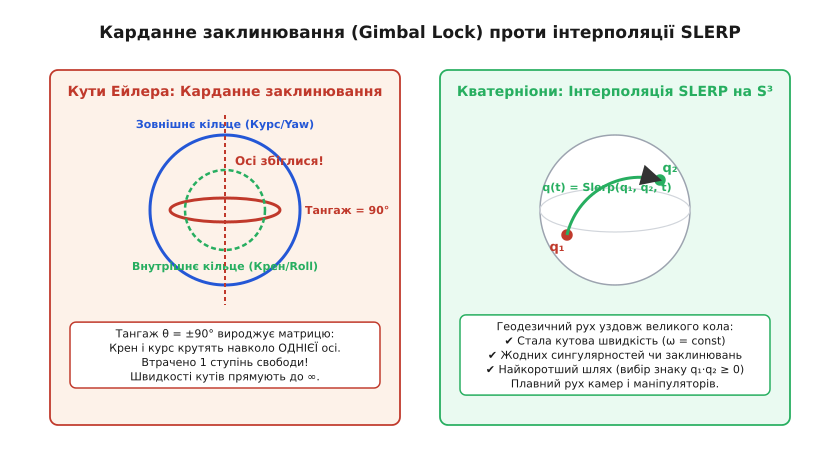

# Група SO(3) і її подвійне покриття SU(2)

<preknowlist>
- [Групи, підгрупи й теорема Лагранжа](topic:math-algebra/group-theory) — що таке група, асоціативність, нейтральний та обернений елементи, матричні групи та гомоморфізми.
- [Матриці та лінійні оператори](topic:math-algebra/matrices-as-operations) — множення матриць, транспонування, ортогональні матриці та збереження довжин векторів.
- [Визначник матриці](topic:math-algebra/matrix-determinant) — геометричний зміст визначника як коефіцієнта масштабування об'єму та орієнтація простору.
- [Векторний добуток](topic:math-algebra/cross-product) — некомутативний добуток тривимірних векторів, антисиметрія та правило правої руки.
- [Кватерніони](topic:math-geometry/quaternions) — чотиривимірні гіперкомплексні числа, множення кватерніонів і представлення поворотів.
</preknowlist>

Уявіть політний контролер квадрокоптера, руку роботизованого маніпулятора або віртуальну камеру у тривимірному графічному рушії. У кожен момент часу об'єкт має певне положення та орієнтацію у просторі. Якщо зафіксувати центр мас тіла, усі можливі зміни його положення зводяться до чистих поворотів. Під час обертання твердого тіла відстані між будь-якими його точками залишаються незмінними, кути між осями зберігаються, а права трійка координатних векторів ніколи не перетворюється на ліву.

Коли ми намагаємося описати ці повороти числами, виникає фундаментальна суперечність. Здавалося б, просторовий поворот має три ступені свободи, і його можна задати трьома числами — наприклад, трьома кутами Ейлера (крен, тангаж, курс). Проте будь-яка трипараметрична система координат у певний момент неминуче вироджується: дві осі обертання збігаються, один ступінь свободи втрачається, а кутові швидкості стрибають у нескінченність. Якщо ж перейти до матриць розміру 3×3, ми отримуємо дев'ять чисел замість трьох, зв'язаних шістьма жорсткими рівняннями ортогональності, які через похибки округлення швидко розсипаються в коді.

Щоб зрозуміти, чому простір обертань чинить такий опір спробам про глобальну параметризацію трьома числами, необхідно дослідити його справжню геометричну та топологічну форму. Множина всіх чистих тривимірних поворотів утворює неперервну гладку структуру — **групу Лі SO(3)**. Дослідження її дотичного простору біля одиниці відкриває **алгебру Лі so(3)**, де матричний комутатор виявляється точним дзеркалом звичайного векторного добутку. А глибший топологічний погляд розкриває разючий факт: простір SO(3) не є однозв'язним, а його повне розгортання веде до **групи унітарних матриць SU(2)** та одиничних кватерніонів, де кожен фізичний поворот накривається рівно двома різними станами.

### Матриці поворотів та ортогональна група SO(3)

Розглянемо лінійне перетворення простору ℝ³, яке переводить довільний вектор `v` у новий вектор `v' = R·v`. Вимога того, що перетворення є чистим просторовим поворотом твердого тіла, накладає на дійсну матрицю `R` розміру 3×3 дві базові геометричні умови.

**Перша умова — збереження скалярного добутку та довжин.** Для будь-яких двох векторів `u` та `v` їхній скалярний добуток після перетворення має залишатися незмінним:

```
(R·u) · (R·v) = u · v
```

Розпишемо ліву частину в матричному вигляді: `(R·u)ᵀ · (R·v) = uᵀ · Rᵀ · R · v`. Оскільки ця рівність має виконуватися для будь-яких векторів `u` та `v`, матриця `R` повинна задовольняти співвідношення:

```
Rᵀ · R = I
```

де `I` — одинична матриця 3×3, а `Rᵀ` — транспонована матриця. Матриці з цією властивістю називають **ортогональними** (від грец. *orthos* — прямий і *gonia* — кут). З рівності `Rᵀ·R = I` випливає, що обернена матриця збігається з транспонованою: `R⁻¹ = Rᵀ`. Стовпчики матриці `R` утворюють ортонормований базис: кожен стовпчик має одиничну довжину, а будь-які два різні стовпчики взаємно перпендикулярні. Множина всіх ортогональних матриць 3×3 утворює групу відносно матричного множення, яку позначають **O(3)** (*Orthogonal group*).

**Друга умова — збереження орієнтації простору (хіральності).** Обчислимо визначник матриці `R`, застосувавши властивість визначника добутку:

```
det(Rᵀ · R) = det(I)
det(Rᵀ) · det(R) = 1
(det(R))² = 1            [оскільки det(Rᵀ) = det(R)]
det(R) = ±1
```

Значення `det(R) = −1` відповідає перетворенням, які містять дзеркальне відбиття (наприклад, матриця `−I`, що міняє напрямки всіх трьох осей і перетворює праву трійку на ліву). Тверде тіло під час фізичного руху у просторі не може відбитися у дзеркалі без розриву матерії. Тому чисті повороти вимагають додаткової умови:

```
det(R) = +1
```

Матриці, що задовольняють обидві умови (`Rᵀ·R = I` та `det(R) = +1`), утворюють **спеціальну ортогональну групу** розміру 3, яку позначають **SO(3)** (*Special Orthogonal group*). Префікс «спеціальна» вказує на одиничний визначник.

```
SO(3) = { R ∈ ℝ³ˣ³ | Rᵀ·R = I,  det(R) = +1 }
```

Порахуймо кількість ступенів свободи матриці з SO(3). Загальна матриця 3×3 містить 9 дійсних чисел. Рівняння `Rᵀ·R = I` є симетричним матричним рівнянням (оскільки `(Rᵀ·R)ᵀ = Rᵀ·R`), тому воно задає 6 незалежних скалярних обмежень: 3 рівняння на одиничну довжину кожного зі стовпчиків і 3 рівняння на попарну ортогональність між ними. Умова `det(R) = +1` є дискретним вибором знаку і не зменшує неперервної розмірності. Віднімаючи обмеження від загальної кількості параметрів:

```
9 параметрів − 6 обмежень = 3 ступені свободи
```

Таким чином, простір SO(3) є тривимірним гладким многовидом.

Важливою рисою групи SO(3) є її **некомутативність** (неабелевість). Якщо виконати поворот навколо осі X на 90°, а потім навколо осі Y на 90°, результат буде зовсім іншим, ніж коли виконати ці самі повороти у зворотному порядку. Візьміть книжку на столі й перевірте самі: спочатку поворот від себе, потім праворуч — книжка дивиться корінцем убік; спочатку праворуч, потім від себе — корінець дивиться вгору. Матричне множення `R₁ · R₂ ≠ R₂ · R₁` точно відтворює цю геометричну властивість.

### Теорема Ейлера про вісь обертання

Чому будь-який елемент групи SO(3) завжди можна уявити як поворот навколо деякої прямої? Відповідь дає класична теорема Леонарда Ейлера, доведена ним у 1775 році.

**Теорема.** Будь-яка матриця `R ∈ SO(3)` має хоча б один ненульовий дійсний вектор `u ∈ ℝ³`, такий що:

```
R · u = u
```

Тобто `λ = 1` завжди є власним числом матриці `R`.

Доведення випливає з аналізу характеристичного многочлена `det(R - I)`. Скористаємося властивостями ортогональності та визначника:

```
det(R - I) = det(R - R·Rᵀ)            [оскільки R·Rᵀ = I]
           = det(R · (I - Rᵀ))         [винесли спільний множник R зліва]
           = det(R) · det(I - Rᵀ)      [визначник добутку матриць]
           = (+1) · det((I - R)ᵀ)      [det(R) = 1 та зміна знаку всередині транспонування]
           = det(I - R)                [визначник транспонованої матриці дорівнює вихідному]
           = (-1)³ · det(R - I)        [винесення мінуса з кожного з 3 рядків матриці розміру 3×3]
           = -det(R - I)
```

Маємо рівність `det(R - I) = -det(R - I)`, звідки неминуче випливає:

```
det(R - I) = 0
```

Визначник нульовий, отже однорідна система лінійних рівнянь `(R - I)·u = 0` має ненульовий розв'язок. Вектор `u` називають **віссю обертання**. Якщо ми нормуємо його до одиничної довжини (`||u|| = 1`), то поворот у площині, перпендикулярній до `u`, відбувається на певний кут `θ`. Будь-який просторовий поворот однозначно задається своєю віссю `u` та кутом повороту `θ`.

### Алгебра Лі so(3): нескінченно малі обертання та векторний добуток

Група SO(3) є не просто абстрактною групою, а **групою Лі** (на честь Софуса Лі) — гладким диференційовним многовидом, на якому групові операції множення та взяття оберненого є гладкими функціями.

Щоб вивчити структуру нелінійного многовиду SO(3), дослідимо його поведінку в нескінченно малому околі нейтрального елемента — одиничної матриці `I`.


*Многовид SO(3) та його дотична площина у точці I. Дотичний простір складається з антисиметричних матриць so(3), де матричний комутатор збігається з векторним добутком. Експоненційне відображення перетворює дотичний вектор кутової швидкості на гладку траєкторію обертання.*

Нехай `R(t)` — довільна гладка траєкторія в SO(3), що описує неперервне обертання тіла в часі, причому в початковий момент часу тіло перебуває у спокої: `R(0) = I`. Для кожного моменту часу виконується умова ортогональності:

```
R(t)ᵀ · R(t) = I
```

Продиференціюємо цю тотожність за часом `t` за правилом добутку Лейбніца:

```
d/dt [ R(t)ᵀ · R(t) ] = d/dt [ I ]
Ṙ(t)ᵀ · R(t) + R(t)ᵀ · Ṙ(t) = 0
```

Підставимо початковий момент `t = 0`, враховуючи, що `R(0) = I`:

```
Ṙ(0)ᵀ · I + Iᵀ · Ṙ(0) = 0
Ṙ(0)ᵀ + Ṙ(0) = 0
```

Позначимо швидкість зміни матриці повороту в нулі через `Ω = Ṙ(0)`. Отримане рівняння означає, що матриця `Ω` є **антисиметричною** (або кососиметричною):

```
Ωᵀ = -Ω
```

Дотичний простір до многовиду SO(3) в одиничній точці `I` складається з усіх дійсних антисиметричних матриць розміру 3×3. Його називають **алгеброю Лі** групи SO(3) і позначають готичними або малими літерами **`so(3)`** (або `𝔰𝔬(3)`).

Довільна антисиметрична матриця 3×3 має нулі на головній діагоналі та містить рівно три незалежні параметри:

```
    ┌   0   -ω₃   ω₂ ┐
Ω = │  ω₃    0   -ω₁ │
    └ -ω₂   ω₁    0  ┘
```

Ці три числа `ω = (ω₁, ω₂, ω₃)ᵀ` мають прямий фізичний зміст: це компоненти вектора **миттєвої кутової швидкості** тіла.

Визначимо лінійне взаємно однозначне відображення між вектором `ω ∈ ℝ³` та матрицею `[ω]ₓ ∈ so(3)`, яке називають оператором кососиметричної матриці (*hat map*):

```
         ┌   0   -ω₃   ω₂ ┐
[ω]ₓ  =  │  ω₃    0   -ω₁ │
         └ -ω₂   ω₁    0  ┘
```

Якщо помножити матрицю `[ω]ₓ` на довільний вектор `v = (v₁, v₂, v₃)ᵀ`, результат збігається зі звичайним векторним добутком у тривимірному просторі:

```
[ω]ₓ · v = ω × v
```

Тепер подивимося, як взаємодіють між собою елементи алгебри Лі. Алгебра — це векторний простір, оснащений операцією білінійного множення, яка для матричних алгебр Лі визначається як **матричний комутатор** (дужка Лі):

```
[A, B] = A·B - B·A
```

Якщо взяти дві антисиметричні матриці `A = [u]ₓ` та `B = [v]ₓ`, то їхній комутатор `[A, B]` знову буде антисиметричною матрицею. Обчисливши його дію на вектор, отримуємо тотожність:

```
[[u]ₓ, [v]ₓ] = [u × v]ₓ
```

Комутатор матриць в алгебрі Лі `so(3)` є точним образом векторного добутку в просторі ℝ³. Таким чином, векторний простір (ℝ³, ×) та алгебра Лі (so(3), [·,·]) є **ізоморфними**.

Виберемо стандартний базис в алгебрі `so(3)`, що відповідає одиничним поворотам навколо осей X, Y, Z (генератори нескінченно малих поворотів):

```
       ┌  0  0  0 ┐              ┌  0  0  1 ┐              ┌  0 -1  0 ┐
J_x =  │  0  0 -1 │,      J_y =  │  0  0  0 │,      J_z =  │  1  0  0 │
       └  0  1  0 ┘              └ -1  0  0 ┘              └  0  0  0 ┘
```

Ці генератори задовольняють фундаментальні комутаційні співвідношення:

```
[J_x, J_y] = J_z,      [J_y, J_z] = J_x,      [J_z, J_x] = J_y
```

Якщо ввести повністю антисиметричний символ Леві-Чивіта `ε_abc`, це співвідношення записується єдиною формулою `[J_a, J_b] = ∑_c ε_abc · J_c`. Ці комутаційні співвідношення є алгебраїчним серцем тривимірного простору: вони визначають геометрію обертань незалежно від того, у якому представленні (матричному чи квантовому) ми їх вивчаємо.

Кожен вектор `Ω ∈ so(3)` породжує **однопараметричну підгрупу** поворотів `R(t) = exp(t·Ω)`, яка є геодезичною лінією на многовиді SO(3), що проходить через одиничний елемент `I`.
Коли ми складаємо два нескінченно малі повороти `exp(A)` та `exp(B)`, їхній добуток задається формулою Бейкера-Кемпбелла-Гаусдорфа (BCH):

```
log( exp(A) · exp(B) ) = A + B + ½·[A, B] + 1/12·[A, [A, B]] - 1/12·[B, [A, B]] + ...
```

Саме доданок другого порядку `½·[A, B] = ½·[a × b]ₓ` є причиною того, чому кутові швидкості не можна просто інтегрувати додаванням векторів кутів при скінченних інтервалах часу.

### Експоненційне відображення та формула Родрігеса

Як перейти від дотичного простору (кутової швидкості) назад до самого многовиду (скінченного повороту)? Цей місток будує **матрична експонента**.

Якщо тіло обертається з постійною кутовою швидкістю навколо одиничної осі `u` (`||u|| = 1`), то його рух описується матричним диференціальним рівнянням:

```
Ṙ(t) = [u]ₓ · R(t),      R(0) = I
```

Розв'язком цього лінійного матричного рівняння є експоненційне відображення:

```
R(θ) = exp(θ · [u]ₓ) = ∑ [k=0..∞] (θ · [u]ₓ)ᵏ / k!
```

де `θ` — повний кут повороту. На перший погляд, обчислення нескінченного ряду матриць виглядає складним. Проте матриця `K = [u]ₓ` має унікальну алгебраїчну властивість: оскільки вектор `u` одиничний, піднесення до куба повертає саму матрицю зі знаком мінус:

```
K³ = -K
```

Завдяки цьому всі вищі степені зациклюються: парні степені зводяться до `K²`, а непарні — до `K`. Якщо згрупувати парні та непарні доданки ряду Тейлора, вони згортаються у тригонометричні ряди `sin(θ)` та `cos(θ)`. Це дає замкнену формулу скінченного повороту — **формулу Родрігеса**:

```
R(θ, u) = exp(θ · [u]ₓ) = I + sin(θ)·[u]ₓ + (1 - cos(θ))·[u]ₓ²
```

Повне математичне виведення цієї формули та алгоритм зворотного вилучення осі й кута з довільної матриці [наведено в окремій математичній вставці](topic:math-algebra/lie-group-so3/math-rodrigues-exponential.md).

Формула Родрігеса доводить, що експоненційне відображення `exp: so(3) → SO(3)` є **сюр'єктивним**: будь-який просторовий поворот є експонентою деякої антисиметричної матриці.

### Топологія SO(3): дійсний проективний простір ℝP³

Досі ми розглядали локальні властивості поворотів. Тепер поставимо глобальне топологічне запитання: яка форма простору SO(3) як цілісної множини?

Згідно з теоремою Ейлера, кожен поворот задається парою `(u, θ)`, де `u` — одиничний вектор осі, а `θ ∈ [0, π]` — кут повороту. Відобразимо кожен поворот у вигляді вектора `v = θ·u` у тривимірному просторі ℝ³. Довжина вектора `||v|| = θ` дорівнює куту повороту, а його напрямок вказує на вісь обертання.

Множина всіх таких векторів утворює **суцільну кулю радіуса π** у тривимірному просторі:

```
B³ = { v ∈ ℝ³ | ||v|| ≤ π }
```

Центр кулі `v = 0` (радіус 0) відповідає нульовому куту повороту — тобто одиничній матриці `I`. Точки всередині кулі (`||v|| < π`) однозначно відповідають поворотам на кути, менші за 180°.


*SO(3) як куля радіуса π. Поворот на 180° навколо осі u збігається з поворотом на 180° навколо −u, тому діаметрально протилежні точки межі ототожнюються. Петля від 0 до 360° не стягується в точку, а подвійна петля на 720° стягується.*

А що відбувається на самій поверхні кулі, де кут повороту досягає максимального значення `θ = π` (180°)?
Поворот на 180° навколо осі `u` переводить будь-який вектор `x` у вектор `-x + 2(u·x)u`. Але якщо ми повернемо простір на 180° навколо протилежної осі `-u`, результат буде абсолютно тим самим, оскільки `(-u · x)(-u) = (u · x)u`.

Отже, поворот на кут `π` навколо вектора `u` і поворот на кут `π` навколо вектора `−u` є **однією і тією самою матрицею**:

```
R(π, u) = R(π, -u)
```

Це означає, що кожна точка на поверхні кулі радіуса `π` є фізично тотожною протилежній до неї точці (антиподу). Топологічний простір, утворений тривимірною кулею, у якої всі діаметрально протилежні точки сферичної межі ототожнені між собою, називають **дійсним проективним простором розмірності 3**, або **ℝP³**:

```
SO(3) ≅ ℝP³
```

Ця топологічна будова має глибокий наслідок: простір SO(3) **не є однозв'язним**.

Розглянемо неперервну траєкторію в просторі поворотів, яка починається в одиничному елементі `I` (центр кулі), рухається по прямій до межі кулі вздовж осі `u` (кут зростає від 0 до `π`), досягає точки `+π·u`, миттєво переходить в ототожнений антипод `−π·u` на протилежному боці, і повертається від `-π·u` назад до центру `I`.

Ця траєкторія відповідає повороту твердого тіла на повний оберт у **360°** (від 0 до `2π`). Оскільки початкова і кінцева точки збігаються (`I`), це замкнена петля. Але цю петлю **неможливо неперервно стягнути в одну точку**, не розриваючи її, оскільки її кінці закріплені на протилежних точках межі!

Проте якщо ми пройдемо цей повний оберт ще раз — тобто виконаємо сумарний поворот на **720°** (4π), утворена подвійна петля вже **може бути неперервно деформована і стягнута в одну точку**.

Фундаментальна група простору SO(3) складається рівно з двох класів еквівалентності замкнених шляхів:

```
π₁(SO(3)) ≅ ℤ₂ = {0, 1}
```

Клас `0` — петлі, що стягуються (повороти на 720° або 0°), а клас `1` — петлі, що не стягуються (повороти на 360°).

### Спеціальна унітарна група SU(2) та одиничні кватерніони

Оскільки SO(3) не є однозв'язною групою, виникає потреба знайти її **універсальне накриття** — однозв'язну групу Лі з тією самою локальною алгеброю Лі. Такою групою є **спеціальна унітарна група SU(2)**.

Група SU(2) складається з комплексних матриць розміру 2×2, які є унітарними (`U† · U = I`, де `†` — ермітове спряження, тобто транспонування з комплексним спряженням) та мають одиничний визначник (`det(U) = 1`):

```
SU(2) = { U ∈ ℂ²ˣ² | U† · U = I,  det(U) = 1 }
```

Загальний вигляд матриці `U ∈ SU(2)` визначається двома комплексними числами `α, β ∈ ℂ`:

```
    ┌   α    β ┐
U = │          │,      де  |α|² + |β|² = 1
    └ -β̄    ᾱ ┘
```

Розпишемо комплексні числа через чотири дійсні координати: `α = q₀ + i·q₃` та `β = q₂ + i·q₁`. Тоді умова одиничного визначника перетворюється на рівняння:

```
|α|² + |β|² = (q₀² + q₃²) + (q₂² + q₁²) = q₀² + q₁² + q₂² + q₃² = 1
```

Рівняння `q₀² + q₁² + q₂² + q₃² = 1` задає одиничну тривимірну сферу **S³** у чотиривимірному дійсному просторі ℝ⁴.

Звідси випливає фундаментальний топологічний і алгебраїчний факт: група SU(2) як геометричний многовид є **тривимірною сферою S³**, а як алгебраїчна структура — групою **одиничних кватерніонів** (Sp(1)):

```
SU(2) ≅ S³ ≅ { q = q₀ + q₁·i + q₂·j + q₃·k | ||q|| = 1 }
```

Сфера S³ є компактною і **однозв'язною** (`π₁(S³) = {0}`). На ній будь-яка замкнена петля вільно стягується в точку.

Матриці Паулі утворюють базис для простору безслідових ермітових матриць:

```
       ┌ 0  1 ┐              ┌ 0 -i ┐              ┌ 1  0 ┐
σ_x =  │      │,      σ_y =  │      │,      σ_z =  │      │
       └ 1  0 ┘              └ i  0 ┘              └ 0 -1 ┘
```

Довільний елемент `U ∈ SU(2)` записується через експоненту матриць Паулі та одиничний вектор `u`:

```
U(θ, u) = exp( -i · (θ/2) · (u · σ) ) = cos(θ/2)·I - i·sin(θ/2)·(u · σ)
```

Зверніть увагу на половинний кут `θ/2`: саме він є джерелом подвійного покриття. Коли кут повороту `θ` змінюється від 0 до `2π` (360°), аргумент половинного кута `θ/2` проходить лише від 0 до `π`, і матриця переходить у `U(2π, u) = cos(π)·I = -I`. Щоб матриця `U` повернулася до початкового значення `+I`, просторовий кут `θ` повинен пройти повні `4π` (720°).

Алгебра Лі `su(2)` складається з антиермітових безслідових матриць 2×2 (`A† = -A`, `tr(A) = 0`). Її базис складають матриці `-i·σ_a / 2`. Комутаційні співвідношення цих генераторів точно повторюють комутаційні співвідношення генераторів `J_a` алгебри `so(3)`. Таким чином, алгебри Лі `su(2)` та `so(3)` є **повністю ізоморфними на рівні дотичного простору**, хоча глобальні групи Лі SU(2) та SO(3) мають різну топологію.

### Подвійне покриття 2-до-1: гомоморфізм SU(2) → SO(3)

Як група 2×2 матриць SU(2) керує поворотами тривимірного простору?

Зіставимо кожному тривимірному вектору `x = (x₁, x₂, x₃)ᵀ ∈ ℝ³` ермітову безслідову матрицю 2×2:

```
X = x₁·σ_x + x₂·σ_y + x₃·σ_z = ┌   x₃     x₁ - i·x₂ ┐
                               └ x₁ + i·x₂   -x₃    ┘
```

Визначник цієї матриці дорівнює довжині вектора з протилежним знаком:

```
det(X) = -x₃² - (x₁² + x₂²) = -(x₁² + x₂² + x₃²) = -||x||²
```

Нехай матриця `U ∈ SU(2)` діє на матрицю `X` через **приєднане перетворення** (спряження):

```
X' = U · X · U†
```

Матриця `X'` залишається ермітовою і безслідовою, тому вона відповідає деякому новому вектору `x' ∈ ℝ³`. Обчислимо її визначник:

```
det(X') = det(U · X · U†) = det(U) · det(X) · det(U†) = 1 · det(X) · 1 = det(X)
```

Звідси `-||x'||² = -||x||²`, тобто `||x'|| = ||x||`. Перетворення зберігає довжини векторів і орієнтацію, отже, воно задає лінійний поворот `x' = R(U)·x`, де `R(U) ∈ SO(3)`.


*Відображення Φ: SU(2) → SO(3). Дві протилежні точки сфери +q та −q перетворюються на одну й ту саму матрицю повороту R. Ядро гомоморфізму складається з {+I, −I}.*

Відображення `Φ: SU(2) → SO(3)`, задане правилом `Φ(U) = R(U)`, є **гладким груповим гомоморфізмом**:

```
Φ(U₁ · U₂) = Φ(U₁) · Φ(U₂)
```

Знайдемо ядро цього гомоморфізму `ker(Φ)` — множину матриць `U`, які відповідають тотожному повороту `R = I` (тобто `U·X·U† = X` для всіх `X`).
Матриця `U` комутує з усіма матрицями Паулі тоді й лише тоді, коли вона пропорційна одиничній матриці `U = c·I`. Оскільки `det(U) = c² = 1`, маємо рівно два розв'язки:

```
ker(Φ) = { +I, -I }
```

Це означає, що матриці `+U` та `−U` (або одиничні кватерніони `+q` та `−q`) задають **абсолютно однаковий поворот** у просторі ℝ³.

Гомоморфізм `Φ` є сюр'єктивним відображенням **два-до-одного** (2-to-1 cover). За першою теоремою про ізоморфізм груп:

```
SO(3) ≅ SU(2) / { +I, -I } ≅ S³ / { ±1 } ≅ ℝP³
```

На мові алгебри кватерніонів та сама дія записується через тривимірний чисто уявний кватерніон `v = x₁·i + x₂·j + x₃·k` та одиничний кватерніон `q = cos(θ/2) + u·sin(θ/2)`:

```
v' = q · v · q*
```

де `q* = cos(θ/2) - u·sin(θ/2)` — спряжений кватерніон. Якщо підставити `-q` замість `q`:

```
(-q) · v · (-q)* = (-1)² · (q · v · q*) = q · v · q* = v'
```

Обидва елементи `+q` та `-q` здійснюють однаковий поворот у тривимірному просторі.

Історію того, як математики й фізики від Ейлера та Гамільтона до Картана й Дірака відкривали цю неочевидну структуру, [винесено в історичну вставку](topic:math-algebra/lie-group-so3/hist-so3-su2.md).

### Трюк Дірака з ременем і 720-градусний поворот

Подвійне накриття — це не математична абстракція, а властивість нашого фізичного простору. Її можна продемонструвати наочним експериментом, відомим як **трюк Дірака з ременем** (*Dirac's belt trick*) або **трюк із тарілкою Фейнмана** (*Feynman's plate trick*).

Візьміть шкіряний ремінь або стрічку. Один кінець закріпіть на столі, а інший тримайте в руці.
1. Поверніть рухомий кінець ременя навколо осі на **360°** (один повний оберт). Ремінь перекрутиться. Скільки б ви не рухали кінець у просторі без обертання, усунути скручування не вдасться. Фізичний стан ременя перейшов з `+I` у стан `-I`.
2. Поверніть той самий кінець у тому ж напрямку ще на **360°** (сумарно **720°**, або два повні оберти). Тепер ремінь має подвійне перекручування. Проте якщо провести вільну петлю ременя навколо руки або обвести рухомий кінець під нерухомим, скручування **повністю зникає**, і ремінь знову стає абсолютно рівним, не змінюючи орієнтації кінців!

У квантовій механіці елементарні частинки з напівцілим спіном (ферміони: електрони, протони, нейтрони, кварки) описуються не векторами з ℝ³, а **спінорами** — елементами векторного простору ℂ², на якому діє група SU(2).
При просторовому обертанні на 360° хвильова функція електрона набуває фазового множника `-1` (`ψ → -ψ`), змінюючи знак. Щоб електрон повернувся до свого справжнього початкового квантового стану, його необхідно повернути на повні **720°**. Цей факт багаторазово підтверджено прямими експериментами з нейтронною інтерферометрією: пучок нейтронів розділяють на два рукави, в одному рукаві магнітним полем повертають спіни на 360°, і на виході інтерференційна картина демонструє протифазу (зсув на π), яка зникає лише при повороті на 720°.

### Карданне заклинювання проти сферичної інтерполяції (SLERP)

Чому практичні інженерні системи — від систем керування космічними апаратами до сучасних ігрових рушіїв (Unreal Engine, Unity) — зберігають орієнтацію саме у формі одиничних кватерніонів (SU(2)), а не в кутах Ейлера?

Причина полягає в топологічній невідповідності між геометрією простору орієнтацій ℝP³ та декартовим простором кутів ℝ³.


*Ліворуч: карданне заклинювання при тангажі 90° (осі крену і курсу зливаються в одну). Праворуч: сферична інтерполяція SLERP на однорідній сфері S³, де рух відбувається по найкоротшій геодезичній дузі.*

**Карданне заклинювання (Gimbal Lock).** Якщо орієнтацію задавати трьома послідовними поворотами (наприклад, послідовність ZYX: курс `ψ`, тангаж `θ`, крен `φ`):

```
R = R_z(ψ) · R_y(θ) · R_x(φ)
```

то при тангажі `θ = 90°` матриця `R_y(π/2)` переводить вісь X у вісь Z. У результаті добуток перетворюється на:

```
R = R_z(ψ) · R_y(π/2) · R_x(φ) = R_z(ψ + φ) · R_y(π/2)
```

Кути `ψ` (курс) та `φ` (крен) входять у підсумкову матрицю лише через свою суму `ψ + φ`. Окремо визначити курс і крен стає неможливо: нескінченна кількість пар кутів `(ψ, φ)` дає одну й ту саму просторову орієнтацію.

Диференціальний зв'язок між вектором кутової швидкості `ω` та швидкостями зміни кутів описується матрицею Якобі:

```
┌ ψ̇ ┐   ┌ 0   sin(φ)/cos(θ)   cos(φ)/cos(θ) ┐ ┌ ω_x ┐
│ θ̇ │ = │ 0      cos(φ)          -sin(φ)    │ │ ω_y │
└ φ̇ ┘   └ 1   sin(φ)·tan(θ)   cos(φ)·tan(θ) ┘ └ ω_z ┘
```

При `θ → 90°` величина `cos(θ) → 0`, а `tan(θ) → ∞`. Формули містять ділення на нуль. Фізичний гіроскоп у кардановому підвісі втрачає один ступінь свободи і блокується, а алгоритм чисельного інтегрування вибухає.

**Сферична інтерполяція (SLERP).** На сфері `SU(2) ≅ S³` немає жодних особливих точок чи виділених осей. Будь-який рух між двома орієнтаціями `q₁` та `q₂` здійснюється вздовж **геодезичної лінії** (дуги великого кола) за формулою Кена Шумейка (*Ken Shoemake*, 1985):

```
Slerp(q₁, q₂, t) = (sin((1 - t)·Ω) / sin(Ω)) · q₁ + (sin(t·Ω) / sin(Ω)) · q₂
```

де `cos(Ω) = q₁ · q₂`. Інтерполяція забезпечує строго постійну кутову швидкість `ω = const` і найкоротшу траєкторію повороту навколо фіксованої осі.

Алгоритм SLERP, його числову реалізацію на C, C++ та Python, а також правила обробки антиподального вибору знаку `q` проти `-q` [описано в практичній вставці](topic:math-algebra/lie-group-so3/proj-slerp-interpolation.md).

> 🔧 **Навіщо це.** Група SO(3) та її подвійне покриття SU(2) лежать у фундаменті сучасної інженерії та фізики:
> - **Авіація та космонавтика:** інерціальні навігаційні системи літаків, безпілотників та космічних апаратів інтегрують покази гіроскопів виключно у формі кватерніонів (`q̇ = ½·q·[0, ω]`), уникаючи заклинювання рамок при довільних просторових маневрах.
> - **Робототехніка:** пряма та зворотна кінематика маніпуляторів розраховується через експоненційне відображення алгебри Лі `so(3)` та спеціальної евклідової групи `SE(3)`.
> - **Комп'ютерна графіка та анімація:** кінематика скелетів персонажів і плавні переходи віртуальних камер використовують інтерполяцію SLERP для усунення ривків і артефактів.
> - **Квантові обчислення:** одиничний кубіт є вектором у двовимірному гільбертовому просторі ℂ², а квантові одномісні логічні вентилі — це матриці з групи SU(2), що повертають стан кубіта на сфері Блоха `S² ≅ ℂP¹ ≅ SU(2)/U(1)`.
