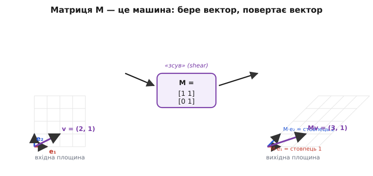
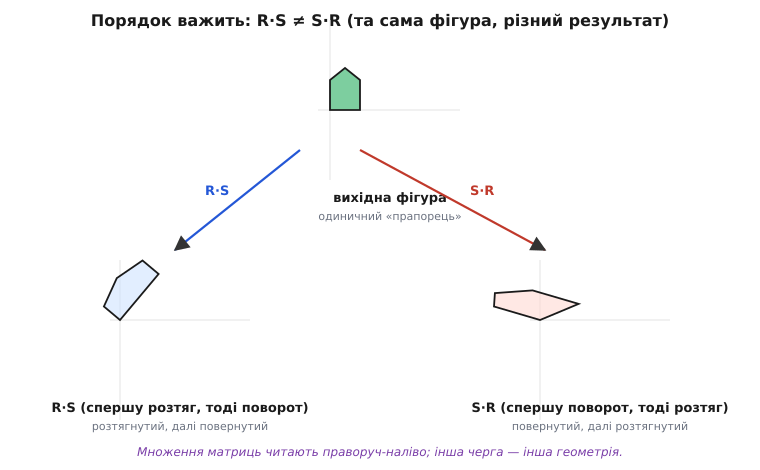

# 🧮 Матриці як дії

Матрицю найчастіше вперше зустрічають як таблицю коефіцієнтів: коли [аналіз кола](root:embedded/circuit-analysis) зводиться до [системи лінійних рівнянь](root:math-algebra/linear-systems), числа цієї системи зручно скласти в прямокутну сітку, і вся матриця там — лише акуратний запис. Але це не вся її природа. Матриця — більше за таблицю: це **дія**, машина, що бере вектор і повертає інший вектор. Саме цей, другий погляд — той апарат, на якому стоять повороти давачів, мікшер моторів і шари нейромережі. Тож познайомимося з матрицею з боку дії.

Тут немає двозначності навіть в історії. Слово **матриця** (лат. *matrix* — «утроба, лоно», від *mater* — «мати») увів 1850 року Джеймс Джозеф Сильвестр: для нього це була сітка чисел, «з якої народжуються» визначники менших квадратів усередині неї. А вже 1858-го Артур Келі у праці «A Memoir on the Theory of Matrices» означив множення матриць не абияк, а **так, щоб воно збігалося зі складанням лінійних перетворень** — і одразу зауважив, що таке множення некомутативне. Тобто матриця-як-дія — це не пізніша надбудова над таблицею, а той самий корінь, з якого виросла вся теорія.

### Означення: матриця — це лінійне перетворення

Формально **матриця** розміру m×n — прямокутна таблиця чисел: m рядків, n стовпців. Множення матриці M на вектор-стовпець **x** дає новий вектор **y** = M·**x** за правилом «рядок на стовпець»: i-й елемент результату — це сума добутків i-го рядка M на **x**:

```
yᵢ = Σⱼ Mᵢⱼ · xⱼ        (рядок i  «·»  вектор x)
```

Розмірності мусять збігатися: щоб помножити M (m×n) на **x**, вектор має мати рівно n компонент, а вийде m. Це і вся арифметика. Та за нею ховається куди цікавіша річ: множення на матрицю — це **лінійне перетворення** (від лат. *linearis* — «прямолінійний», від *linea* — «лінія, нитка») простору. «Лінійне» означає дві властивості разом:

```
M·(a + b) = M·a + M·b           (зберігає додавання)
M·(k·a)   = k·(M·a)             (зберігає масштаб)
```

Машина не ламає додавання й не ламає масштабування. Звідси випливає одразу й третя, дуже зручна річ: початок координат лишається на місці, бо M·**0** = **0** (підставте k = 0 у друге правило). Саме лінійність робить матриці всюдисущими: **будь-яке** перетворення, що не згинає прямих, не рве рівних відстаней між паралельними лініями й не зсуває початок координат, записується матрицею — і навпаки, кожна матриця задає рівно таке перетворення. Тому повороти, розтяги, віддзеркалення, проєкції, перекоси — усе це матриці; а от згин дуги чи перенесення всієї площини вбік (зсув початку) матрицею тих самих розмірів уже не запишеш, бо вони ламають одну з двох умов.

> 🔧 **Навіщо це.** Перевірка на лінійність — це швидкий фільтр у голові інженера. Якщо ланка системи зберігає додавання й масштаб (подвоїв вхід — подвоївся вихід, склав два входи — склались два виходи), її можна згорнути в матрицю й рахувати всю поведінку одним множенням. Підсилювач у лінійному режимі, мікшер моторів, ідеальний фільтр — лінійні, тож живуть у мові матриць. Щойно з'являється насичення чи поріг — лінійність ламається, і матриця перестає описувати ланку точно; це і є межа, де закінчується вся зручна лінійна алгебра.

### Інтуїція: куди їде базис

Найкорисніша картинка — геометрична. Уявімо вхідну площину з координатною сіткою й двома **базисними векторами** (від грец. *básis* — «основа, підмурок»): e₁ = (1, 0) уздовж осі x та e₂ = (0, 1) уздовж осі y. Матриця перетворює всю площину, але достатньо знати, **куди вона переносить ці два вектори** — і це прямо записано в ній: перший стовпець M — то образ e₁, другий стовпець — образ e₂.

Чому саме стовпці? Підставте e₁ = (1, 0) у правило «рядок на стовпець»: у сумі Σⱼ Mᵢⱼ·xⱼ виживає лише доданок з j = 1 (бо x₂ = 0), і кожен i-й рядок дає Mᵢ₁ — тобто весь результат M·e₁ дослівно дорівнює першому стовпцю. Так само M·e₂ — другий стовпець. Це не мнемоніка, а пряме читання означення.

Решта йде сама. Будь-який вектор **x** = (x₁, x₂) — це x₁·e₁ + x₂·e₂. Прогнавши його крізь лінійну машину й двічі скориставшись правилами лінійності, дістаємо:

```
M·x = M·(x₁·e₁ + x₂·e₂)
    = x₁·(M·e₁) + x₂·(M·e₂)        ← лінійність
    = x₁·(стовпець 1) + x₂·(стовпець 2)
```

Тобто образ вектора — та сама його комбінація, але вже зі **зміщеними** базисами. Уся робота матриці — переставити базис; решту бере на себе лінійність.


*Вхідна площина (ліворуч) має базис e₁, e₂ і вектор v = (2, 1). Матриця M = [[1, 1], [0, 1]] — «зсув» (англ. shear): перший стовпець (1, 0) каже, що e₁ лишився на місці, другий (1, 1) — що e₂ нахилився вправо. Тому вся сітка перекошується (праворуч), а вектор їде у Mv = (1·2 + 1·1, 0·2 + 1·1) = (3, 1). Стовпці матриці — це нові координати старого базису.*

Звідси й «фізичний сенс» добутку M·**x**: ми розкладаємо **x** за базисом, замінюємо базис на той, у який його переносить M, і збираємо назад. Так само поводиться матриця провідностей при [аналізі кола](root:embedded/circuit-analysis): вона бере вектор вузлових потенціалів і переводить «потенціали» у «струми, що втікають у вузли» — те саме лінійне перетворення, лише там на нього зазвичай дивляться не як на геометрію, бо цікавить зворотний хід (знайти потенціали за струмами).

### Два особливі мешканці: одиниця й нуль

Серед усіх машин дві варті окремої згадки, бо задають крайні точки.

**Одинична матриця** I — це машина, що нічого не робить: лишає кожен вектор на місці, I·**x** = **x**. Її стовпці — це самі e₁, e₂, … недоторкані, тож на головній діагоналі стоять одиниці, а решта нулі:

```
I = [1  0]      I·x = x   (для будь-якого x)
    [0  1]
```

Вона грає в множенні матриць ту саму роль, що число 1 у множенні чисел: M·I = I·M = M. Це єдина матриця, для якої порядок із будь-якою іншою байдужий.

**Нульова матриця** робить протилежне — стискає весь простір у точку: кожен вектор їде в **0**. Між цими двома крайнощами (нічого не змінити / усе знищити) лежить решта перетворень — повороти, розтяги, проєкції.

### Апарат: добуток двох матриць — це послідовність машин

Якщо одна матриця — машина, то **дві поспіль** — конвеєр. Спершу пропустимо вектор крізь B, тоді результат — крізь A: дістанемо A·(B·**x**). Виявляється, цей конвеєр сам є матрицею — їхнім **добутком** A·B, і обчислюють його тим самим правилом «рядок на стовпець», тільки тепер рядок A множать на стовпець B:

```
(A·B)ᵢₖ = Σⱼ Aᵢⱼ · Bⱼₖ
```

Чому саме так, а не «поелементно»? Бо означення добутку **підігнане** під складання дій: ми хочемо, щоб (A·B)·**x** завжди дорівнювало A·(B·**x**) для кожного вектора **x**. Це і є властивість **асоціативності** — дужки в ланцюжку можна ставити як завгодно:

```
(A·B)·x = A·(B·x)            ← дужки не міняють результату
```

Саме асоціативність дозволяє наперед «склеїти» хоч сто перетворень в одну матрицю A·B·C·…, а тоді бити нею по мільйону векторів одним множенням замість мільйона прогонів крізь увесь конвеєр. На цьому стоїть швидка графіка й нейромережі.

Щоб добуток існував, число стовпців A має дорівнювати числу рядків B (внутрішні розмірності збігаються): (m×n)·(n×p) = (m×p). І ось ключова, найчастіше забута властивість: множення матриць **некомутативне** — взагалі кажучи, **A·B ≠ B·A**. Порядок змінює результат, бо це порядок дій над простором: спершу повернути, тоді розтягнути — це не те саме, що спершу розтягнути, тоді повернути. Бувають винятки (дві матриці, що комутують), але це рідкість, а не правило.


*Та сама вихідна фігура (зверху) проходить дві однакові операції — поворот R на 50° і нерівномірний розтяг S (×2 по x, ×0.7 по y) — у різній черзі. Ліворуч A·B = R·S (спершу розтяг, тоді поворот), праворуч S·R (спершу поворот, тоді розтяг): результати різні. Запис читають справа наліво — найближча до вектора матриця діє першою.*

Напрям читання — теж не дрібниця. У записі A·B·**x** вектор стоїть праворуч, тож **першою** до нього торкається найближча матриця B, а вже потім A. Тому ланцюжок дій читають **справа наліво**, хоч пишуть зліва направо — звичне джерело плутанини, коли подумки «програєш» перетворення.

> 🔧 **Навіщо це.** Некомутативність — не математична причіпка, а щоденна пастка коду. Орієнтацію тіла в просторі складають із поворотів навколо осей, і повертати «спершу навколо x, тоді y» — це не те, що «спершу y, тоді x» (саме звідси неоднозначність [кутів Ейлера](root:math-geometry/euler-angles) й сумнозвісний gimbal lock). Якщо переплутати порядок множення матриць у такому ланцюжку, давач показуватиме правдоподібні, але **хибні** кути — помилку, яку важко спіймати очима.

### Як скасувати дію: обернена матриця

Раз матриця — це дія, природно спитати: чи можна її **відкотити**? Відкотити поворот — повернути назад; відкотити розтяг — стиснути. Машину-«відкат» називають **оберненою матрицею** (від лат. *invertere* — «перевертати») і позначають M⁻¹. Її означають саме як скасування:

```
M⁻¹·M = I        (спочатку M, тоді M⁻¹ — і ти там, де був)
M·M⁻¹ = I
```

Прикладена після M, обернена повертає кожен вектор на старе місце — конвеєр із двох таких машин еквівалентний «нічого не робити», тобто одиниці I. Саме через обернену розв'язують системи: якщо M·**x** = **b**, то домноживши зліва на M⁻¹, дістаємо **x** = M⁻¹·**b** — обернена «знімає» матрицю з невідомого.

Але відкат можливий не завжди. Якщо машина **схлопнула** простір — наприклад, спроєктувала всю площину на одну пряму, — то з прямої вже не відновити, звідки прийшла кожна точка: безліч різних точок злилися в одну. Така матриця **необоротна** (її називають виродженою). Числовий маркер цього схлопування — **визначник** (детермінант), що показує, у скільки разів перетворення розтягує площі: визначник дорівнює нулю рівно тоді, коли площа стиснулась у нуль, тобто простір втратив вимір і відкату немає. Поки визначник ненульовий, обернена існує.

### Worked-приклад: множення матриці на вектор у прошивці

Найчастіша «матрична» операція в коді мікроконтролера — навіть не повне множення двох матриць, а множення сталої матриці на вхідний вектор: рядок на вектор, повторений для кожного рядка. Саме так працює [мікшер моторів](root:sys-dron/motor-mixer) і будь-яка лінійна калібрувальна поправка давача.

**Умова.** Гіроскоп видає вектор кутових швидкостей **g** = (gx, gy, gz). Через перекіс під час монтажу осі давача не збігаються з осями апарата; виробник калібрування дав матрицю поправки C (3×3). Треба дістати швидкості в осях апарата **w** = C·**g**. Нехай для конкретного відліку

```
        [ 1.00  0.02 -0.01 ]            [ 0.50 ]
C =     [-0.02  0.99  0.03 ]   ,   g =  [-1.20 ]   (рад/с)
        [ 0.00 -0.01  1.00 ]            [ 2.00 ]
```

Рахуємо за правилом «рядок на стовпець» — кожен рядок C множимо на весь **g**:

```
wx = 1.00·0.50 + 0.02·(-1.20) + (-0.01)·2.00 = 0.500 - 0.024 - 0.020 = 0.456
wy = -0.02·0.50 + 0.99·(-1.20) + 0.03·2.00   = -0.010 - 1.188 + 0.060 = -1.138
wz = 0.00·0.50 + (-0.01)·(-1.20) + 1.00·2.00 = 0.000 + 0.012 + 2.000 = 2.012
```

Той самий обрахунок у прошивці — два вкладені цикли, без жодної бібліотеки:

:::tabs
```cpp
// w = C * g   (C: 3x3, g та w: 3)
void mat3_mul_vec(const float C[3][3], const float g[3], float w[3]) {
    for (int i = 0; i < 3; ++i) {   // i — рядок результату
        float acc = 0.0f;
        for (int j = 0; j < 3; ++j) // j — стовпець C та компонента g
            acc += C[i][j] * g[j];  // «рядок i на вектор g»
        w[i] = acc;
    }
}
```
```python
# w = C * g   (C: 3x3, g та w: по 3 компоненти)
def mat3_mul_vec(C, g):
    w = [0.0, 0.0, 0.0]
    for i in range(3):              # i — рядок результату
        acc = 0.0
        for j in range(3):          # j — стовпець C та компонента g
            acc += C[i][j] * g[j]   # «рядок i на вектор g»
        w[i] = acc
    return w
```
:::

Висновок: зовнішній цикл біжить по рядках (кожен дає одну компоненту результату), внутрішній — згортає рядок із вектором у скаляр. Помножити дві матриці — це те саме з третім циклом зовні (по стовпцях другої матриці). А головна практична засторога вже знайома: оскільки множення некомутативне, переставити C і ще одну поправку місцями в ланцюжку — означає дістати інше, хибне калібрування.

### Де це працює

У задачах про кола матриця лишається переважно «таблицею коефіцієнтів» — і цього досить, бо там мета розв'язати систему, а не перетворювати простір. Та погляд «матриця = машина перетворень» — це фундамент, на якому тримаються куди важчі речі.

- **Орієнтація в просторі.** Положення політного контролера задають [кутами повороту й матрицями повороту](root:math-geometry/euler-angles); ланцюжок roll-pitch-yaw — це саме добуток трьох таких машин, де порядок критичний.
- **[Мікшер моторів](root:sys-dron/motor-mixer).** Перехід «команди пілота (газ, крен, тангаж, рискання) → оберти кожного мотора» — одне множення матриці на вектор: рядок на мотор, стовпець на команду.
- **[Шар нейромережі](root:sf-ml/neuron-layer).** Один шар — це множення матриці ваг на вектор входів (плюс зсув і нелінійність); саме тому навчання й виконання мереж — це мегатонни матричних множень, які так люблять GPU.

Спільне в усіх трьох — те саме правило «рядок на стовпець» і та сама засторога про порядок, що проступає на перекошеній сітці. Хто звик читати матрицю як **дію над вектором**, добуток — як **послідовність дій**, а обернену — як **відкат**, той уже наполовину розуміє і стабілізацію польоту, і нейромережу.
