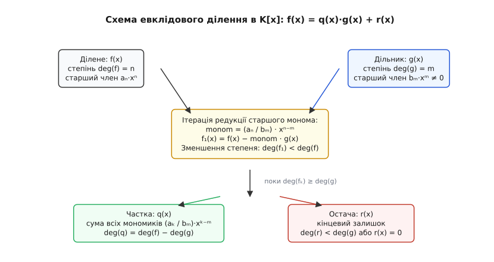
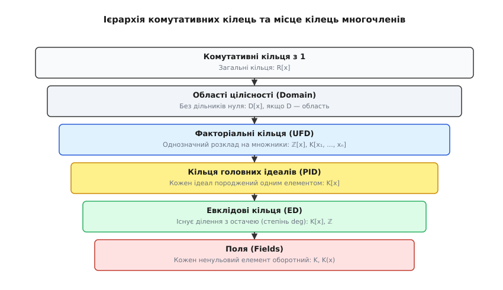
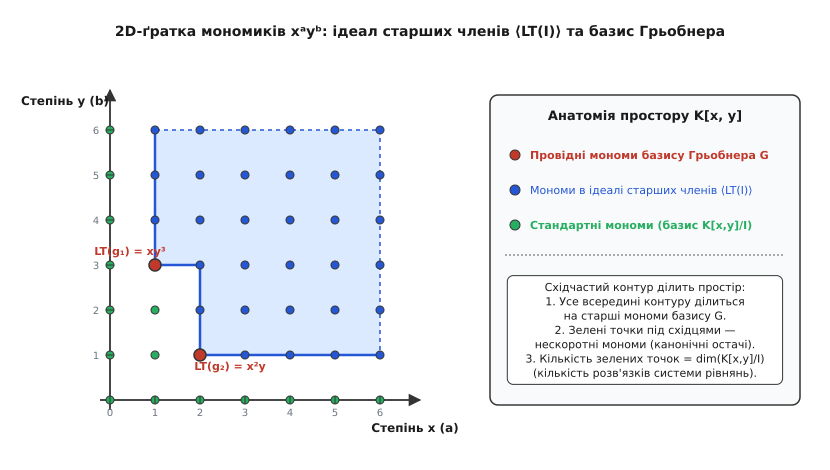

# Кільця многочленів

<preknowlist>
- [Кільця: додавання й множення в одній структурі](root:math-algebra/rings) — аксіоми кільця, комутативність, дільники нуля та ідеали.
- [Поліноми](root:math-algebra/polynomials) — анатомія многочлена, коефіцієнти, степені та обчислення значень за схемою Горнера.
- [Групи](root:math-algebra/group-theory) — абелеві групи, суміжні класи та фактор-групи.
- [Модульна арифметика](root:math-number-theory/modular-arithmetic) — ділення з остачею, алгоритм Евкліда та арифметика лишків.
</preknowlist>

Коли мікроконтролер обчислює контрольну суму Ethernet-кадру, криптографічний чип смартфона шифрує платіжні дані за стандартом AES або квантово-стійкий алгоритм Kyber генерує відкритий ключ на ґратках, процесор не обчислює значення функцій у точках. Апаратні регістри виконують точні арифметичні дії з формальними поліноміальними виразами: складають їх, перемножують, ділять з остачею та згортають за модулем одного незвідного виразу. Якщо розглядати многочлен лише як шкільну функцію `y = f(x)`, де замість `x` підставляють дійсні числа, така цифрова техніка втрачає будь-який сенс: над скінченними полями дві принципово різні формули можуть видавати однакові значення в усіх можливих точках, але утворювати зовсім різні структури даних.

Щоб працювати з многочленами як із самостійними числами нової природи, математика об'єднує їх у **кільце многочленів** (англ. *polynomial ring*, від нім. *Polynomring*). У цьому просторі формальний символ `x` слугує не невідомою величиною, яку потрібно знайти, а базисною віссю, що впорядковує коефіцієнти. Кільце многочленів відтворює всю глибину цілочислової арифметики — подільність, розклад на прості множники, найбільший спільний дільник і теорему Безу, — а також стає головним генератором нових числових полів і фундаментом розв'язання систем нелінійних рівнянь.

---

### 1. Формальне кільце R[x]: анатомія та різниця між виразом і функцією

Нехай задано довільне комутативне кільце з одиницею `R` (наприклад, кільце цілих чисел `ℤ`, поле раціональних чисел `ℚ`, дійсних чисел `ℝ`, комплексних чисел `ℂ` або скінченне поле лишків `𝔽_p = ℤ/pℤ`).

Формально **многочленом від однієї змінної** над кільцем `R` називають нескінченну послідовність елементів цього кільця `(a₀, a₁, a₂, a₃, …)`, у якій лише скінченна кількість членів є відмінними від нуля. Для зручності запису вводять формальний символ `x`, що відповідає елементарній послідовності `(0, 1, 0, 0, …)`. Тоді довільний многочлен записують у звичній канонічній формі:

```
f(x) = aₙ·xⁿ + aₙ₋₁·xⁿ⁻¹ + … + a₁·x + a₀ = ∑ aᵢ · xⁱ
```

Множину всіх таких виразів позначають через `R[x]`. Операції додавання та множення визначаються суто алгебраїчно через коефіцієнти:

1. **Додавання:** виконується покомпонентно:
```
(∑ aᵢ·xⁱ) + (∑ bᵢ·xⁱ) = ∑ (aᵢ + bᵢ) · xⁱ
```
2. **Множення:** виконується за правилом згортки Коші (дистрибутивне розкриття дужок):
```
(∑ aᵢ·xⁱ) · (∑ bⱼ·xʲ) = ∑ cₖ · xᵏ,   де cₖ = ∑ aᵢ · bⱼ  для всіх i + j = k
```

Множина `R[x]` разом із цими двома операціями задовольняє всі аксіоми кільця: додавання утворює абелеву групу з нейтральним нульовим многочленом `0 = (0, 0, …)`, множення є асоціативним і комутативним з одиницею `1 = (1, 0, 0, …)`, а множення дистрибутивне відносно додавання.

#### Універсальна властивість кільця многочленів

Чому саме така формальна конструкція є канонічною? Відповідь дає **універсальна властивість** (англ. *universal mapping property*). Кільце многочленів `R[x]` є найпростішим і найвільнішим способом додати до кільця `R` один новий формальний елемент, не накладаючи на нього жодних додаткових алгебраїчних обмежень, крім комутування з елементами `R`.

> **Теорема про універсальну властивість.** Нехай `R` та `S` — комутативні кільця з одиницею, `φ : R → S` — гомоморфізм кілець, а `s ∈ S` — довільний фіксований елемент кільця `S`.
> Тоді існує **єдиний** гомоморфізм кілець `Φ : R[x] → S`, який продовжує `φ` (тобто `Φ(a) = φ(a)` для всіх `a ∈ R`) та переводить формальну змінну `x` в елемент `s`:
> ```
> Φ(x) = s
> ```

Цей гомоморфізм називають **гомоморфізмом обчислення** (або підстановки, англ. *evaluation homomorphism*) і позначають `ev_s`. Він діє за природним правилом:
```
ev_s(∑ aᵢ · xⁱ) = ∑ φ(aᵢ) · sⁱ ∈ S
```
Саме універсальна властивість лежить в основі всіх подальших підстановок: коли замість `x` підставляють дійсне число, квадратну матрицю чи оператор диференціювання, коректність операцій гарантується тим, що підстановка є гомоморфізмом кілець.

```
Анатомія многочлена f(x) ∈ R[x]:
┌─────────────────────────────────────────────────────────────┐
│  f(x) = aₙ · xⁿ  +  aₙ₋₁ · xⁿ⁻¹  + … +  a₁ · x  +  a₀        │
│         └──┬──┘     └────┬────┘        └──┬──┘   └─┬┘       │
│      Старший член   Мономи             Моном    Вільний     │
│       (lead term)                              член         │
│                                                             │
│  aₙ — старший коефіцієнт (leading coefficient, lc)           │
│  x  — формальна змінна (indeterminate)                      │
│  n  — степінь многочлена deg(f) = n (якщо aₙ ≠ 0)           │
└─────────────────────────────────────────────────────────────┘
```

> ⚠️ **Пастка: многочлен проти поліноміальної функції.** У математичному аналізі многочлен ототожнюють із функцією відображення `f : R → R`. В абстрактній алгебрі це принципово різні речі. Кожен многочлен `f(x) ∈ R[x]` породжує функцію підстановки, але відображення многочленів у функції не завжди є взаємно однозначним.
>
> Візьмемо поле лишків `𝔽₂ = {0, 1}` та многочлен `f(x) = x² + x ∈ 𝔽₂[x]`. Як функція він повертає нуль для будь-якого вхідного значення: `f(0) = 0² + 0 = 0` та `f(1) = 1² + 1 = 0`. Функція є нульовою. Проте як елемент кільця многочленів `f(x) ≠ 0`, адже його коефіцієнти при `x²` та `x` дорівнюють одиниці, а степінь `deg(f) = 2`. У кільці `𝔽_p[x]` за малою теоремою Ферма многочлен `xᵖ − x` перетворюється на нульову функцію, залишаючись ненульовим многочленом степеня `p`.

---

### 2. Степінь многочлена та поведінка над областями цілісності

**Степенем** многочлена `f(x) = ∑ aᵢxⁱ` називають найбільший індекс `n`, для якого коефіцієнт `aₙ ≠ 0`. Позначають: `deg(f) = n`.

Для нульового многочлена `f(x) = 0`, де всі коефіцієнти дорівнюють нулю, степінь формально вважають рівним мінус нескінченності: `deg(0) = −∞`. Це правило запобігає появі винятків в алгебраїчних формулах степенів.

Для довільних двох многочленів `f(x), g(x) ∈ R[x]` степінь їхньої суми підпорядковується нерівності:

```
deg(f + g) ≤ max(deg f, deg g)
```

Строга нерівність виникає, коли старші члени мають однаковий степінь і взаємно знищуються внаслідок додавання коефіцієнтів (наприклад, `(x³ + 2x) + (−x³ + 5) = 2x + 5`, де степінь зменшується з 3 до 1).

Степінь добутку поводиться значно тонше і прямо залежить від природи кільця коефіцієнтів `R`:

```
deg(f · g) ≤ deg(f) + deg(g)
```

Якщо кільце коефіцієнтів `R` містить **дільники нуля** (ненульові елементи `a, b ∈ R`, для яких `a · b = 0`), старші коефіцієнти двох многочленів можуть перемножитися в нуль.

Розглянемо кільце лишків `ℤ/8ℤ[x]` і два многочлени `f(x) = 4x² + 1` та `g(x) = 2x³ + 3`. Їхні степені: `deg(f) = 2`, `deg(g) = 3`. Перемножимо їх:

```
f(x) · g(x)
= (4x² + 1) · (2x³ + 3)                         [розкриття дужок]
= (4 · 2) · x⁵ + (4 · 3) · x² + (1 · 2) · x³ + 3  [перемноження коефіцієнтів]
= 8x⁵ + 2x³ + 12x² + 3                          [спрощення коефіцієнтів]
= 0·x⁵ + 2x³ + 4x² + 3                          [редукція коефіцієнтів за модулем 8: 8 ≡ 0, 12 ≡ 4]
= 2x³ + 4x² + 3                                 [вилучення нульового старшого члена]
```

Степінь добутку дорівнює `3`, що строго менше за `deg(f) + deg(g) = 2 + 3 = 5`. Старший член випарувався, оскільки коефіцієнти `4` та `2` були дільниками нуля в `ℤ/8ℤ`.

Якщо ж кільце коефіцієнтів є **областю цілісності** `D` (комутативне кільце з одиницею без дільників нуля), зокрема будь-яким полем `K`, то добуток ненульових старших коефіцієнтів `aₙ · bₘ ≠ 0` ніколи не обнуляється.

```
Якщо D — область цілісності, то:
deg(f · g) = deg(f) + deg(g)    для всіх f, g ∈ D[x] \ {0}
```

З цієї рівності негайно випливають два фундаментальні наслідки:
1. Кільце многочленів `D[x]` над областю цілісності саме є **областю цілісності** (не містить дільників нуля).
2. Оборотними елементами кільця `D[x]` (елементами, для яких існує обернений многочлен `f · g = 1`) є виключно оборотні елементи самого базового кільця `D`, що розглядаються як многочлени нульового степеня: `(D[x])* = D*`. Для поля `K` оборотними многочленами є всі ненульові константи `K* = K \ {0}`.

---

### 3. Евклідове ділення в K[x]: чому над полем можлива повна арифметика

Коли коефіцієнти належать числовому полю `K` (де кожен ненульовий елемент має мультиплікативний обернений), кільце `K[x]` набуває властивостей евклідового простору. Тут стає можливим алгоритм ділення куточком, абсолютно аналогічний до ділення звичайних цілих чисел.


*Покроковий механізм евклідового ділення в кільці K[x]. На кожній ітерації старший член діленого анулюється відніманням відповідного кратного дільника, що гарантує строге монотонне спадання степеня залишку аж до досягнення deg(r) < deg(g).*

> **Теорема про ділення з остачею в K[x].** Для будь-яких двох многочленів `f(x), g(x) ∈ K[x]`, де `g(x) ≠ 0`, існує єдина пара многочленів `q(x) ∈ K[x]` (частка, англ. *quotient*) та `r(x) ∈ K[x]` (остача, англ. *remainder*), таких що:
>
> ```
> f(x) = q(x) · g(x) + r(x),   де deg(r) < deg(g) або r(x) = 0
> ```

**Механізм редукції:**
Якщо `deg(f) < deg(g)`, частка дорівнює нулю `q(x) = 0`, а остача дорівнює самому діленому `r(x) = f(x)`. Якщо ж `deg(f) = n ≥ m = deg(g)`, розглянемо старші члени: діленого `aₙ · xⁿ` та дільника `bₘ · xᵐ`.

Оскільки `bₘ ∈ K` і `bₘ ≠ 0`, у полі `K` існує обернений елемент `bₘ⁻¹`. Сформуємо одночлен:

```
t(x) = (aₙ / bₘ) · xⁿ⁻ᵐ
```

Віднімемо від `f(x)` добуток `t(x) · g(x)`:

```
f₁(x) = f(x) − t(x) · g(x)
```

Старший член многочлена `t(x) · g(x)` дорівнює `((aₙ / bₘ) · bₘ) · xⁿ = aₙ · xⁿ`, тому при відніманні старші члени взаємно знищуються. Степінь нового многочлена `f₁(x)` стає строго меншим: `deg(f₁) < deg(f)`. Повторюючи цей крок скінченну кількість разів (щонайбільше `n − m + 1` кроків), ми неминуче прийдемо до залишку `r(x)`, степінь якого строго менший за `deg(g)`.

> 🔧 **Навіщо це.** Якщо кільце коефіцієнтів не є полем, евклідове ділення руйнується. Спробуйте в кільці цілих многочленів `ℤ[x]` поділити `f(x) = 3x² + 1` на `g(x) = 2x + 1`. Старший коефіцієнт дільника дорівнює `2`. Оскільки число `3` не ділиться на `2` націло в `ℤ`, одночлен `(3/2)x` випадає з кільця `ℤ[x]`. У `ℤ[x]` не існує цілих многочленів `q(x)` та `r(x)`, для яких виконувалася б умова `f = q·g + r` із `deg(r) < 1`. Ділення з остачею гарантоване лише тоді, коли коефіцієнти беруться з поля `K`, або коли дільник `g(x)` є унітарним (його старший коефіцієнт дорівнює `1`).

---

### 4. Ідеали та структура K[x] як кільця головних ідеалів (PID)

Наявність евклідового ділення визначає внутрішню геометрію підмножин кільця `K[x]` — його ідеалів.

Нагадаємо: **ідеалом** кільця `R` називають непорожню підмножину `I ⊆ R`, яка є підгрупою за додаванням і витримує поглинання при множенні на будь-який елемент кільця (якщо `a ∈ I` та `r ∈ R`, то `r · a ∈ I`).

Ідеал називають **головним** (англ. *principal ideal*), якщо він породжується одним-єдиним елементом `d`, тобто складається з усіх його кратних:

```
(d) = { q · d | q ∈ R }
```

Кільце, у якому кожен ідеал є головним, називають **кільцем головних ідеалів** (PID, англ. *Principal Ideal Domain*).


*Ієрархія комутативних кілець. Кільце многочленів від однієї змінної над полем K[x] є евклідовим і головним ідеальним кільцем, тоді як кільця від кількох змінних K[x₁, ..., xₙ] та цілочислове кільце ℤ[x] піднімаються на рівень факторіальних кілець (UFD), втрачаючи властивість головності ідеалів.*

> **Фундаментальна теорема:** Кільце многочленів над полем `K[x]` є кільцем головних ідеалів (PID).

Логіка доведення спирається виключно на ділення з остачею: якщо взяти в ненульовому ідеалі `I ⊆ K[x]` многочлен найменшого додатного степеня `d(x)`, то будь-який інший многочлен `f(x) ∈ I` зобов'язаний ділитися на `d(x)` без остачі. Якби виникла ненульова остача `r(x) = f(x) − q(x)d(x)`, вона б сама належала ідеалу `I` і мала менший степінь, ніж мінімальний `deg(d)`, що неможливо. Повний математичний запис цього виведення зі збереженням усіх алгебраїчних тонкощів винесено в окремий розділ: [доведення PID та критеріїв незвідності](root:math-algebra/polynomial-rings/math-eisenstein-gauss.md).

З властивості головності ідеалів випливає наступний фундаментальний рівень: **факторіальність** (UFD, англ. *Unique Factorization Domain*).

У будь-якому кільці `K[x]` кожен ненульовий многочлен, що не є константою, однозначно (з точністю до перестановки множників та множення на ненульові скаляри з `K`) розкладається в добуток незвідних (простих) многочленів:

```
f(x) = c · p₁(x)ᵉ¹ · p₂(x)ᵉ² · … · pₖ(x)ᵉᵏ
```

де `c ∈ K*` — старший коефіцієнт, а `pᵢ(x)` — унітарні незвідні многочлени.

#### Межі ієрархії: чому не кожне кільце многочленів є PID або UFD

Щоб зрозуміти силу структури `K[x]`, варто побачити, де саме ламаються суміжні кільця:

1. **ℤ[x] — факторіальне (UFD), але НЕ кільце головних ідеалів (PID):**
   За лемою Ґаусса будь-який многочлен із цілими коефіцієнтами однозначно розкладається на незвідні множники. Проте ідеал `I = (2, x) = { 2·a(x) + x·b(x) | a, b ∈ ℤ[x] }` (множина многочленів із парним вільним членом) неможливо породити одним елементом. Спільний дільник чисел `2` та `x` у `ℤ[x]` дорівнює лише `±1`, але сам ідеал `(2, x) ≠ (1) = ℤ[x]`, адже одиниця не належить `I`.

2. **K[x, y] — факторіальне (UFD), але НЕ кільце головних ідеалів (PID):**
   Аналогічно, ідеал `(x, y) ⊆ K[x, y]` вимагає щонайменше двох генераторів.

3. **ℤ[√-5] — НЕ є факторіальним кільцем (не UFD):**
   Тут число `6` має два принципово різні розклади на незвідні елементи: `6 = 2 · 3 = (1 + √-5) · (1 − √-5)`. Елементи `2, 3, 1 ± √-5` є незвідними, але не є простими, тому однозначність розкладу руйнується.

| Кільце | Чи є областю цілісності? | Чи є факторіальним (UFD)? | Чи є кільцем головних ідеалів (PID)? | Чи є евклідовим (ED)? |
| :--- | :--- | :--- | :--- | :--- |
| **K[x]** (над полем) | Так | Так (лема Ґаусса) | Так (через степінь) | Так (степінь deg) |
| **ℤ[x]** (над цілими) | Так | Так (лема Ґаусса) | Ні (ідеал `(2, x)`) | Ні |
| **K[x, y]** (багато змінних) | Так | Так (теорема Ґаусса) | Ні (ідеал `(x, y)`) | Ні |
| **ℤ** (цілі числа) | Так | Так (основна теорема арифметики) | Так (через модуль \|n\|) | Так (модуль \|n\|) |
| **(ℤ/8ℤ)[x]** (з дільниками нуля) | Ні (є дільники нуля) | Ні | Ні | Ні |

```
Ієрархія кілець многочленів:
┌─────────────────────────────────────────────────────────────┐
│  Евклідові кільця (ED):                                      │
│  Існує ділення з остачею: deg(r) < deg(g)                    │
│  Приклади: ℤ, K[x]                                          │
│         │                                                   │
│         ▼                                                   │
│  Кільця головних ідеалів (PID):                             │
│  Кожен ідеал породжується одним елементом I = (d)           │
│  Приклади: ℤ, K[x]   (але НЕ ℤ[x], НЕ K[x, y])              │
│         │                                                   │
│         ▼                                                   │
│  Факторіальні кільця (UFD):                                 │
│  Однозначний розклад на незвідні множники                   │
│  Приклади: ℤ, K[x], ℤ[x], K[x₁, …, xₙ]                      │
└─────────────────────────────────────────────────────────────┘
```

---

### 5. Найбільший спільний дільник, співвідношення Безу та алгоритм Евкліда

Оскільки кожен ідеал у `K[x]` є головним, розглянемо ідеал, породжений двома довільними многочленами `f(x)` та `g(x)`:

```
I = { u(x)·f(x) + v(x)·g(x) | u(x), v(x) ∈ K[x] }
```

Оскільки `I` — головний ідеал, існує такий єдиний унітарний многочлен `d(x)`, що `I = (d(x))`. Цей многочлен задовольняє дві умови:
1. `d(x)` ділить `f(x)` і ділить `g(x)` (є їхнім спільним дільником);
2. Будь-який інший спільний дільник `c(x)` ділить `d(x)`.

Такий многочлен `d(x)` називають **найбільшим спільним дільником** і позначають `НСД(f, g)` або `gcd(f, g)`.

Оскільки `d(x) ∈ I`, він обов'язково записується як лінійна комбінація вихідних многочленів:

```
u(x) · f(x) + v(x) · g(x) = НСД(f, g)
```

Ця рівність має назву **співвідношення Безу** (на честь Етьєна Безу). Багаточлени `u(x)` та `v(x)` знаходять за допомогою **розширеного алгоритму Евкліда**.

#### Числовий приклад обчислення в ℚ[x]

Знайдемо `НСД(f, g)` та поліноми Безу `u(x), v(x)` над полем раціональних чисел `ℚ[x]` для:
```
f(x) = x⁴ − 1
g(x) = x³ − x² + x − 1
```

**Крок 1: Ділимо f(x) на g(x) з остачею**
```
x⁴ − 1 = (x + 1) · (x³ − x² + x − 1) + 2x² − 2
```
Частка: `q₁(x) = x + 1`.
Остача: `r₁(x) = 2x² − 2`.
Звідси:
```
2x² − 2 = f(x) − (x + 1) · g(x)
```

**Крок 2: Ділимо g(x) на r₁(x)**
Поділимо `x³ − x² + x − 1` на `2x² − 2`:
```
x³ − x² + x − 1 = (1/2 x − 1/2) · (2x² − 2) + 0
```
Остача дорівнює нулю. Алгоритм зупиняється.

Останньою ненульовою остачею є `r₁(x) = 2x² − 2`. Нормалізуємо її до унітарного вигляду (ділимо на старший коефіцієнт `2`):
```
НСД(f, g) = x² − 1
```

**Крок 3: Співвідношення Безу**
З виразу першого кроку:
```
2x² − 2 = 1 · f(x) + (−x − 1) · g(x)
```
Поділивши на `2`, отримуємо остаточне співвідношення Безу:
```
(1/2) · f(x) + (−1/2 x − 1/2) · g(x) = x² − 1
```

Многочлени `f(x)` та `g(x)` називають **взаємно простими**, якщо їхній `НСД(f, g) = 1`. У цьому випадку співвідношення Безу набуває вигляду:
```
u(x) · f(x) + v(x) · g(x) = 1
```

Це співвідношення є основою обчислення обернених елементів у криптографічних схемах та фактор-кільцях.

> 🔧 **Навіщо це.** Якщо два многочлени взаємно прості, то в кільці лишків за модулем `g(x)` рівність Безу перетворюється на:
> ```
> u(x) · f(x) ≡ 1 (mod g(x))
> ```
> Це означає, що поліном `u(x)` є точним **мультиплікативним оберненим** до `f(x)` за модулем `g(x)`: `f(x)⁻¹ = u(x) mod g(x)`. Саме так криптопроцесори виконують операцію ділення в скінченних полях криптосистеми AES (множення на зворотну матрицю та обчислення байта S-Box).

Програмну реалізацію поліноміального ділення та розширеного алгоритму Евкліда наведено у вставці: [алгоритми поліноміальної арифметики в коді](root:math-algebra/polynomial-rings/proj-poly-algorithms.md).

---

### 6. Незвідні многочлени та критерій Ейзенштейна

Многочлен `p(x) ∈ K[x]` степеня `deg(p) ≥ 1` називають **незвідним** (або нерозкладним, англ. *irreducible*) над полем `K`, якщо його неможливо розкласти в добуток двох многочленів менших додатних степенів `p(x) = a(x) · b(x)` із коефіцієнтами з того самого поля `K`.

Незвідні многочлени є точними аналогами простих чисел: вони генерують максимальні ідеали в `K[x]` і не діляться ні на що, крім констант та самих себе.

> ⚠️ **Незвідність залежить від поля.** Той самий вираз може бути незвідним над одним числовим полем і розкладним над іншим.
> - Многочлен `x² + 1` є **незвідним** над `ℚ` та `ℝ` (не має дійсних коренів).
> - Над полем комплексних чисел `ℂ` він **розкладається**: `x² + 1 = (x − i)(x + i)`.
> - Над скінченним полем `𝔽₂ = {0, 1}` він також **розкладається**: `x² + 1 = (x + 1)²`, оскільки `1 + 1 ≡ 0 mod 2`.

Як довести, що многочлен є незвідним над полем раціональних чисел `ℚ`? Перевіряти всі можливі дільники у вищих степенях стає неможливо. Тут на допомогу приходить зв'язок між `ℚ[x]` та цілими числами `ℤ[x]`.

#### Лема Ґаусса та критерій Ейзенштейна

За **лемою Ґаусса**, якщо многочлен із цілими коефіцієнтами `f(x) ∈ ℤ[x]` не розкладається на множники менших степенів у кільці `ℤ[x]`, то він гарантовано не розкладається й у полі раціональних дробів `ℚ[x]`.

Це дозволило Фердинанду Ейзенштейну сформулювати потужний практичний критерій:

> **Критерій Ейзенштейна.** Нехай задано многочлен із цілими коефіцієнтами:
> ```
> f(x) = aₙ·xⁿ + aₙ₋₁·xⁿ⁻¹ + … + a₁·x + a₀ ∈ ℤ[x]
> ```
> Якщо існує таке **просте число** `p`, для якого виконуються три умови:
> 1. `p` ділить усі коефіцієнти, крім старшого: `p | aᵢ` для всіх `i = 0, 1, …, n − 1`;
> 2. `p` не ділить старший коефіцієнт: `p ∤ aₙ`;
> 3. Квадрат простого числа не ділить вільний член: `p² ∤ a₀`,
>
> тоді многочлен `f(x)` є **незвідним** над полем раціональних чисел `ℚ`.

#### Приклад застосування:
Дослідимо многочлен `f(x) = x⁵ − 6x³ + 12x − 6`.
Оберемо просте число `p = 3`.
1. Коефіцієнти: `a₄ = 0`, `a₃ = −6`, `a₂ = 0`, `a₁ = 12`, `a₀ = −6`. Усі вони діляться на `3` (`3 | 0, −6, 12`).
2. Старший коефіцієнт `a₅ = 1` не ділиться на `3` (`3 ∤ 1`).
3. Вільний член `a₀ = −6` ділиться на `3`, але `p² = 9` не ділить `−6` (`9 ∤ −6`).

Усі три умови виконано бездоганно: многочлен `x⁵ − 6x³ + 12x − 6` неможливо розкласти на раціональні множники в жодній формі.

Як цей критерій застосовується до доведення незвідності кругових многочленів `Φ_p(x) = xᵖ⁻¹ + … + x + 1` через заміну змінної `x = y + 1`, детально продемонстровано у вставці: [математичні доведення леми Ґаусса та критерію Ейзенштейна](root:math-algebra/polynomial-rings/math-eisenstein-gauss.md).

---

### 7. Фактор-кільця K[x]/(f(x)) як джерело нових алгебраїчних систем

Головна рушійна сила кілець многочленів — це можливість будувати за їхньою допомогою **нові числові поля та алгебри**. Цей процес називають факторизацією кільця за ідеалом.

Нехай задано кільце `K[x]` та фіксований многочлен `f(x)` степеня `n = deg(f) ≥ 1`. Розглянемо головний ідеал `(f(x)) = { q(x)·f(x) | q(x) ∈ K[x] }`.

**Фактор-кільце** `K[x]/(f(x))` — це множина класів еквівалентності (суміжних класів) за модулем `f(x)`:
```
g(x) + (f(x)) = { g(x) + h(x)·f(x) | h(x) ∈ K[x] }
```

Два многочлени потрапляють в один клас тоді й лише тоді, коли їхня різниця ділиться на `f(x)` націло: `g₁(x) ≡ g₂(x) (mod f(x))`.

Завдяки евклідовому діленню кожен суміжний клас містить **рівно один канонічний представник** — остачу `r(x)` від ділення на `f(x)`:
```
r(x) = cₙ₋₁·xⁿ⁻¹ + … + c₁·x + c₀,   де deg(r) < n
```

Отже, елементи фактор-кільця можна ототожнити з многочленами степеня менше `n`. Додавання в ньому відбувається звичайним чином, а множення — з подальшим взяттям остачі від ділення на `f(x)`.

![Побудова фактор-кільця K[x]/(f(x)) та розширення полів](img/quotient-ring-isomorphism.svg)
*Фактор-кільце K[x]/(f(x)). Якщо f(x) є незвідним многочленом, ідеал (f(x)) стає максимальним, а фактор-структура перетворюється на нове розширене поле K(α), де формальна змінна x грає роль кореня f(α) = 0.*

#### Теорема про структуру фактор-кільця

Властивості фактор-кільця повністю визначаються факторизацією многочлена `f(x)`:

1. **Якщо f(x) є незвідним над K:**
   Ідеал `(f(x))` є **максимальним ідеалом** кільця `K[x]`. Це означає, що фактор-кільце `K[x]/(f(x))` є **числовим полем**!
   Для будь-якого ненульового елемента `g(x)` маємо `НСД(g, f) = 1`. За співвідношенням Безу:
   ```
   u(x) · g(x) + v(x) · f(x) = 1  ⇒  u(x) · g(x) ≡ 1 (mod f(x))
   ```
   Тобто `u(x) mod f(x)` є точним мультиплікативним оберненим до `g(x)`.

2. **Якщо f(x) є розкладним: f(x) = g(x) · h(x):**
   У фактор-кільці з'являються **дільники нуля**:
   ```
   g(x) · h(x) = f(x) ≡ 0 (mod f(x))
   ```
   Два ненульові класи при перемножуванні дають нуль. Фактор-кільце не є полем.

#### Конструкція 1: Комплексні числа ℂ з дійсних чисел ℝ

Як отримати уявну одиницю `i = √-1` без містичних припущень?
Візьмемо кільце многочленів `ℝ[x]` над дійсними числами та незвідний многочлен `f(x) = x² + 1`.

Побудуємо фактор-кільце `ℝ[x] / (x² + 1)`:
- Елементи: остачі степеня менше 2, тобто лінійні двочлени `a + b·x`, де `a, b ∈ ℝ`.
- Додавання: `(a + bx) + (c + dx) = (a + c) + (b + d)x`.
- Множення:
```
(a + bx) · (c + dx)
= ac + (ad + bc)x + bd·x²                 [дистрибутивне розкриття дужок]
= ac + (ad + bc)x + bd·(x² + 1 − 1)        [виділення виразу модуля x² + 1]
= (ac − bd) + (ad + bc)x + bd·(x² + 1)    [групування вільних та змінних доданків]
≡ (ac − bd) + (ad + bc)x (mod x² + 1)     [редукція за модулем: x² + 1 ≡ 0]
```
Оскільки в фактор-кільці `x² + 1 ≡ 0`, маємо `x² ≡ −1`.
Формальна змінна `x` поводиться в точності як уявна одиниця `i`. Фактор-кільце `ℝ[x] / (x² + 1)` ізоморфне полю комплексних чисел `ℂ`.

#### Конструкція 2: Скінченні поля Ґалуа GF(2⁸) у криптографії AES

Для побудови 8-бітного байтового поля `GF(2⁸)` беруть кільце `𝔽₂[x]` (де коефіцієнти додаються за XOR) та незвідний многочлен 8-го степеня стандарту AES:
```
p(x) = x⁸ + x⁴ + x³ + x + 1 ∈ 𝔽₂[x]
```
Фактор-кільце `𝔽₂[x] / (p(x))` містить рівно `2⁸ = 256` елементів (усі многочлени степеня від 0 до 7, що відповідають 8-бітним регістрам `00000000₂ … 11111111₂`). Оскільки `p(x)` незвідний, кожен ненульовий байт має гарантований обернений елемент.

#### Конструкція 3: Теорема Кронекера та приєднання коренів

Історично математики століттями сперечалися про природу невідомих величин: чи існують корені многочленів, які не можна виразити звичайними числами? Леопольд Кронекер дав вичерпну та суто конструктивну відповідь за допомогою фактор-кілець:

> **Теорема Кронекера (1887).** Нехай `K` — довільне числове поле, а `p(x) ∈ K[x]` — незвідний многочлен степеня `n ≥ 1`. Тоді існує розширення поля `L ⊇ K`, у якому многочлен `p(x)` має корінь.
>
> **Конструкція:** Цим розширенням є фактор-поле `L = K[x] / (p(x))`. Якщо позначити через `α = x mod p(x)` образ формальної змінної у фактор-полі, то:
> ```
> p(α) = p(x mod p(x)) = p(x) mod p(x) = 0
> ```
> Елемент `α` є точним коренем многочлена `p(x)` у полі `L`. Більше того, кожен елемент поля `L` однозначно записується у вигляді лінійної комбінації степенів кореня `c₀ + c₁α + … + cₙ₋₁αⁿ⁻¹` над полем `K`. Поле `L` позначають як `K(α)` і називають простим алгебраїчним розширенням.

Історичний шлях визрівання цієї теорії — від пошуку коренів рівнянь до аксіоматики кілець Емми Нетер — описано в нарисі: [історія кілець многочленів та ідеалів](root:math-algebra/polynomial-rings/hist-polynomial-algebra.md).

---

### 8. Многочлени від багатьох змінних K[x₁, …, xₙ] та базиси Грьобнера

Коли задача описує геометричні фігури в просторі, просторові маніпулятори роботів або системи алгебраїчних рівнянь, однієї змінної стає недостатньо. Виникає кільце **многочленів від багатьох змінних** `K[x₁, x₂, …, xₙ]`.

Формально його визначають рекурсивно:
```
K[x₁, x₂, …, xₙ] = (K[x₁, …, xₙ₋₁])[xₙ]
```

Елементами кільця є скінченні лінійні комбінації мономиків:
```
f(x₁, …, xₙ) = ∑ c_(α₁, …, αₙ) · x₁^(α₁) · x₂^(α₂) · … · xₙ^(αₙ)
```

#### Втрата евклідовості та теорема Гільберта про базис

Для `n ≥ 2` кільце `K[x₁, …, xₙ]` перестає бути кільцем головних ідеалів (PID).
Розглянемо ідеал `I = (x, y) ⊆ K[x, y]`, складений з усіх многочленів без вільного члена. Цей ідеал неможливо породити жодним одним многочленом `d(x, y)`: єдиними спільними дільниками `x` та `y` є константи, але `(1) = K[x, y] ≠ I`.

Виникає загроза: чи можуть існувати ідеали, що вимагають нескінченної кількості генераторів? Відповідь дає фундаментальний результат Давида Гільберта:

> **Теорема Гільберта про базис (1890).** Якщо кільце `R` є нетеровим (кожен його ідеал скінченно породжений), то кільце многочленів `R[x]` також є нетеровим.
>
> Оскільки будь-яке поле `K` має лише два тривіальні ідеали `(0)` та `(1)` (а отже є нетеровим), кільце `K[x₁, …, xₙ]` є **нетеровим**: будь-який його ідеал породжується **скінченним набором многочленів**:
> ```
> I = ⟨f₁, f₂, …, fₘ⟩ = { ∑ hᵢ · fᵢ | hᵢ ∈ K[x₁, …, xₙ] }
> ```

#### Проблема багатовимірного ділення та мономіальні порядки

У кільці від однієї змінної мономи впорядковані природно за степенем: `1 < x < x² < x³ < …`. Для багатьох змінних порівняти `x²y` та `xy³` однозначно неможливо, доки не зафіксовано **мономіальний порядок** `>` (строгий лінійний порядок, сумісний із множенням: якщо `u > v`, то `u·w > v·w` для будь-якого моному `w`).

Найпоширеніші порядки:
1. **Лексикографічний (lex):** `xᵃyᵇ > xᶜyᵈ`, якщо `a > c`, або при `a = c` маємо `b > d` (як слова в словнику). Застосовується для виключення змінних.
2. **Градуйований обернено-лексикографічний (grevlex):** спершу порівнюється повний степінь `a + b > c + d`; при рівності степенів виграє той, у кого менший степінь останньої змінної `y`. Найефективніший для обчислень.

Фіксуючи порядок, для кожного многочлена `f` виділяють його **старший моном** `LM(f)` та **старший член** `LT(f) = c · LM(f)`.

Ділення многочлена `f` на систему `{g₁, …, gₘ}` полягає в послідовному відніманні відповідних кратних `gᵢ`, старші члени яких ділять поточний старший член діленого. Проте в багатовимірному випадку результат такого ділення (остача) **залежить від порядку дільників у списку**!

#### Базиси Грьобнера та розв'язання систем рівнянь

Щоб усунути неоднозначність багатовимірного ділення, Бруно Бухбергер (1965) увів концепцію спеціальних базисів.

> **Означення.** Набір многочленів `G = {g₁, g₂, …, gₛ}` називають **базисом Грьобнера** ідеалу `I`, якщо ідеал старших членів усіх многочленів з `I` збігається з ідеалом, породженим старшими членами елементів базису `G`:
> ```
> ⟨LT(I)⟩ = ⟨LT(g₁), LT(g₂), …, LT(gₛ)⟩
> ```


*Геометрія мономіального простору K[x, y]. Базис Грьобнера утворює східчастий контур у ґратці степенів. Будь-який моном всередині затіненої області ділиться на старший член базису, а кінцева кількість точок під східцями визначає розмірність фактор-простору та кількість розв'язків алгебраїчної системи.*

**Властивості базису Грьобнера:**
1. **Канонічна остача:** Остача від ділення будь-якого многочлена `f` на базис Грьобнера `G` є **єдиною** і не залежить від порядку редукції.
2. **Перевірка належності ідеалу:** Многочлен `f` належить ідеалу `I = ⟨G⟩` тоді й лише тоді, коли його остача від ділення на `G` тотожно дорівнює нулю: `f mod G = 0`.
3. **Розв'язання нелінійних систем (Елімінація):** Якщо побудувати базис Грьобнера для лексикографічного порядку `x > y > z`, система перетворюється на ступінчастий трикутний вигляд:
```
g₁(z) = 0             [рівняння лише від однієї змінної z]
g₂(y, z) = 0          [знаходимо y, підставивши корені z]
g₃(x, y, z) = 0       [знаходимо x, підставивши знайдені y та z]
```
Це перетворює складну нелінійну геометрію на послідовний пошук коренів одновимірних многочленів.

#### Практичний приклад: розв'язання нелінійної геометричної системи

Розглянемо задачу знаходження спільних точок одиничного кола та параболи на площині:
```
f₁ = x² + y² − 1 = 0
f₂ = x² − y = 0
```

Ці многочлени породжують ідеал `I = ⟨x² + y² − 1, x² − y⟩ ⊆ ℝ[x, y]`.
Застосуємо лексикографічний порядок `x > y`, метою якого є повне виключення змінної `x`.

**1. Обчислення S-многочлена:**
Старші члени: `LT(f₁) = x²`, `LT(f₂) = x²`. `LCM(x², x²) = x²`.
```
S(f₁, f₂)
= 1 · (x² + y² − 1) − 1 · (x² − y)   [взаємне знищення старших членів x²]
= y² + y − 1
```

**2. Редукція та новий елемент базису:**
Многочлен `g₁ = y² + y − 1` залежить виключно від змінної `y`. Його старший член `y²` не ділиться на `x²` (старші члени `f₁` та `f₂`), тому `g₁` не редукується і додається до базису.

**3. Редукований базис Грьобнера:**
Замінивши `x² + y² − 1` на `x² − y`, отримуємо трикутний редукований базис Грьобнера:
```
G = { x² − y,  y² + y − 1 }
```

**4. Знаходження точних розв'язків:**
- З другого рівняння `y² + y − 1 = 0` знаходимо значення ординати: `y = (−1 ± √5) / 2`. Оскільки для дійсних точок на параболі `y = x² ≥ 0`, обираємо додатний корінь (золотий перетин): `y = (√5 − 1) / 2`.
- З першого рівняння підставляємо `y` та знаходимо абсциси: `x = ±√y = ±√((√5 − 1) / 2)`.

Геометрична нелінійна система розв'язана абсолютно точно без наближених ітерацій.

---

### Підсумок: єдність поліноміальної алгебри

Кільце многочленів перетворює формальні вирази зі змінною на універсальний алгебраїчний інструмент:
- Над полем `K[x]` воно зберігає повну аналогію з цілими числами `ℤ`: евклідове ділення, найбільший спільний дільник, співвідношення Безу та однозначний розклад на незвідні множники (UFD і PID).
- Через фактор-кільця `K[x]/(f(x))` воно слугує універсальним конструктором нових полів — від комплексних чисел `ℂ` до криптографічних полів Ґалуа `GF(2ⁿ)`.
- У багатовимірному просторі `K[x₁, …, xₙ]` базиси Грьобнера узагальнюють алгоритм Евкліда та метод Гаусса, перетворюючи абстрактну нетеровість на дієвий обчислювальний апарат для розв'язання нелінійних систем.
