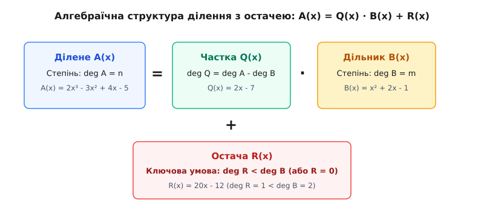
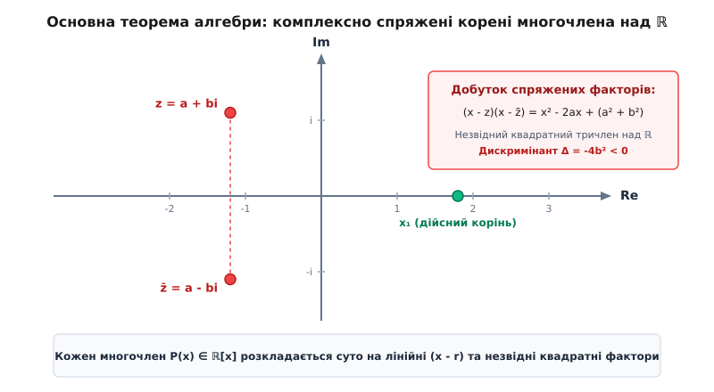
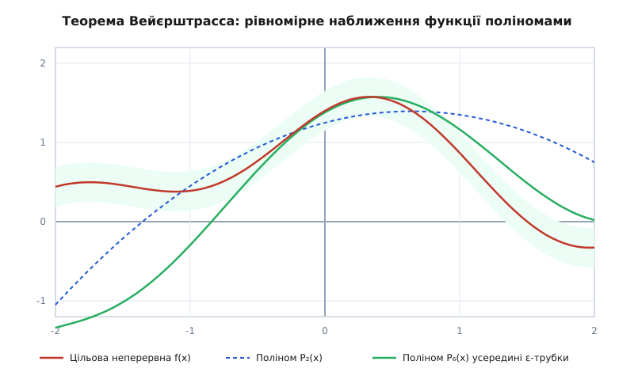
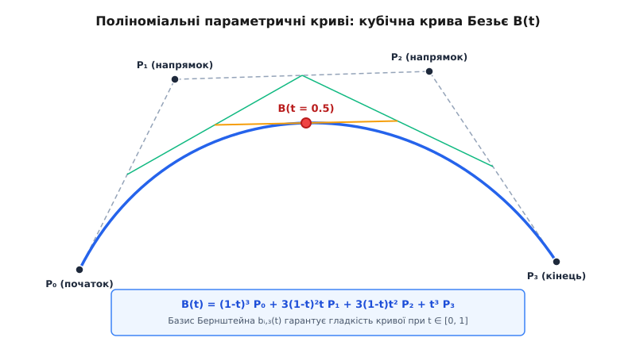

# Поліноми

<preknowlist>
- [Кільця: додавання й множення в одній структурі](topic:math-algebra/rings) — алгебраїчні структури з двома операціями: многочлени утворюють комутативне кільце `F[x]`.
- [Схема Горнера](topic:math-algebra/horner-scheme) — алгоритм обчислення значення многочлена за лінійний час та ділення на лінійний двочлен.
- [Інтерполяція Лагранжа](topic:math-numeric/lagrange-interpolation) — побудова єдиного многочлена степеня `n` через `n + 1` заданих точок.
- [Комплексні числа](topic:math-analysis/complex-numbers) — розширення дійсних чисел, у якому будь-яке алгебраїчне рівняння має корінь.
</preknowlist>

Будь-який цифровий мікропроцесор, арифметично-логічний пристрій (АЛП) чи графічний прискорювач на апаратному рівні транзисторної логіки вміє виконувати лише дві елементарні операції над числовими регістрами — додавання та множення. Сучасні обчислювальні процесори містять спеціалізовані конвеєрні блоки FMA (англ. *Fused Multiply-Add*), які виконують комбіновану апаратну операцію виду `a · b + c` за один такт процесорного часу без проміжної втрати точності. Проте ані експоненти `eˣ`, ані тригонометричного синуса `sin(x)`, ані логарифма `ln(x)`, ані плавної просторової траєкторії руху маніпулятора робота в кремнієвих кристалах фізично не існує. Єдиний спосіб, за допомогою якого цифрова обчислювальна машина відображає на екрані плавний векторний шрифт, розраховує аеродинамічний опір крила літака чи транслює зашифрований пакет даних супутникового зв'язку крізь атмосферний шум, — це перетворення складної неперервної залежності на скінченну послідовність операцій додавання та множення.

Математичним об'єктом, який конструюється виключно за допомогою скінченної кількості операцій додавання, віднімання та множення над однією або кількома змінними, є **поліном** або **многочлен** (грец. *polys* — численний, лат. *nomen* — ім'я, термін, назва).

Завдяки своїй конструктивній простоті та алгебраїчній жорсткості многочлени виступають універсальним сполучним мостом між дискретним цифровим світом і неперервними фізичними процесами. У комп'ютерній графіці та CAD-системах вони формують параметричні сплайни та криві Безьє, у телекомунікаціях (коди Ріда — Соломона, циклічні коди CRC) забезпечують гарантоване відновлення пошкоджених пакетів інформації, у сучасній криптографії (схема розділення секрету Шаміра та скінченні поля Ґалуа) гарантують математичний захист даних, а в математичному аналізі слугують універсальним апроксиматором будь-якої неперервної функції.

---

### 1. Анатомія многочлена та його складові

Щоб коректно працювати з многочленом, визначимо кожен його елемент і позначення. Нехай задано деяку абстрактну змінну, яку позначимо літерою `x`. Ця змінна може бути як невідомим числовим аргументом із певного поля, так і суто формальним символом, над яким виконуються алгебраїчні перетворення без підстановки конкретних числових значень.

Загальний канонічний вигляд многочлена від однієї змінної `x` записується так:

```
P(x) = aₙ·xⁿ + aₙ₋₁·xⁿ⁻¹ + … + a₂·x² + a₁·x + a₀
```

Кожен символ у цьому виразі має точне математичне ім'я та функціональне призначення:

1. **Змінна `x`** (або невизначена величина, англ. *indeterminate*) — формальний символ, степені якого `x⁰ = 1, x¹ = x, x², x³, …` виступають базисними позиціями («кошиками») для зберігання числових коефіцієнтів.
2. **Коефіцієнти `aₖ`** (де індекс `k` змінюється від `0` до `n`) — елементи фіксованого числового поля `F` (наприклад, раціональні `ℚ`, дійсні `ℝ` чи комплексні `ℂ` числа). Коефіцієнт `aₖ` визначає числову вагу відповідного степеня `xᵏ`.
3. **Мономи або одночлени `aₖ·xᵏ`** — окремі доданки у виразі многочлена, складені з числового множника та цілого невід'ємного степеня змінної.
4. **Старший член `aₙ·xⁿ`** — доданок із найвищим показником степеня `n`, для якого коефіцієнт строго відмінний від нуля (`aₙ ≠ 0`).
5. **Старший коефіцієнт `aₙ`** (англ. *leading coefficient*) — ненульовий числовий множник при найвищому степені. Якщо старший коефіцієнт дорівнює одиниці (`aₙ = 1`), такий многочлен називають **унітарним** або **зведеним** (англ. *monic polynomial*).
6. **Вільний член `a₀`** (англ. *constant term*) — коефіцієнт при нульовому степені `x⁰ = 1`. Значення вільного члена завжди збігається зі значенням многочлена в точці нуль: `P(0) = a₀`.
7. **Степінь многочлена `deg(P) = n`** (лат. *gradus*, франц. *degré*) — найбільший показник степеня змінної `x` із ненульовим коефіцієнтом `aₙ ≠ 0`.

Окремим випадком є **нульовий многочлен**, усі коефіцієнти якого тотожно дорівнюють нулю: `0·xⁿ + … + 0 = 0`. Оскільки він не містить жодного ненульового коефіцієнта, його степінь за загальноприйнятою алгебраїчною угодою вважають рівним мінус нескінченності `deg(0) = -∞` або невизначеним. Це необхідно для того, щоб універсальні закони взаємодії степенів залишалися бездоганними в усіх алгебраїчних теоремах (зокрема формула степеня добутку `deg(P · Q) = deg P + deg Q`).

---

### 2. Кільце многочленів F[x] та його алгебраїчні закони

Коли ми розглядаємо множину всіх можливих многочленів із коефіцієнтами з деякого поля `F`, ця множина разом із операціями додавання та множення утворює самостійну замкнену алгебраїчну структуру — **кільце многочленів**, яке позначають як `F[x]`.

**Операція додавання:**
Якщо задано два многочлени `A(x) = ∑ aₖ·xᵏ` та `B(x) = ∑ bₖ·xᵏ`, їхня сума утворюється попарним додаванням коефіцієнтів при однакових степенях змінної `x`:

```
A(x) + B(x) = ∑ (aₖ + bₖ) · xᵏ
```

Степінь суми двох многочленів задовольняє нерівність:

```
deg(A + B) ≤ max(deg A, deg B)
```

Нерівність стає строгою тоді, коли старші члени мають однаковий степінь і протилежні за знаком коефіцієнти, внаслідок чого вони взаємно знищуються: наприклад, для `A(x) = 3x⁴ + 2x` та `B(x) = -3x⁴ + 5` маємо `deg A = 4`, `deg B = 4`, але `deg(A + B) = deg(2x + 5) = 1`.

**Операція множення:**
Множення многочленів виконується за правилом дистрибутивності (розкриття дужок) та зведення подібних доданків. Якщо `A(x)` має степінь `n`, а `B(x)` — степінь `m`, то коефіцієнт `cₖ` при степені `xᵏ` у добутку `C(x) = A(x) · B(x)` обчислюється як згортка Коші:

```
cₖ = a₀·bₖ + a₁·bₖ₋₁ + a₂·bₖ₋₂ + … + aₖ·b₀ = ∑ aᵢ · bⱼ    (де i + j = k)
```

Оскільки коефіцієнти беруться з поля `F` (у якому відсутні дільники нуля: якщо `aₙ ≠ 0` та `bₘ ≠ 0`, то `aₙ · bₘ ≠ 0`), старший член добутку дорівнює `(aₙ · bₘ) · xⁿ⁺ᵐ`. Звідси випливає фундаментальний закон степеня добутку:

```
deg(A · B) = deg A + deg B
```

Завдяки цьому закону в кільці `F[x]` відсутні дільники нуля: добуток двох ненульових многочленів ніколи не перетворюється на нульовий многочлен. Кільце `F[x]` є **комутативною областю цілісності** з одиницею (одиничним многочленом `E(x) = 1`).

**Формальний многочлен проти поліноміальної функції:**
В алгебрі критично важливо розрізняти два різні поняття:
- **Формальний многочлен** — це алгебраїчний об'єкт, повністю визначений послідовністю своїх коефіцієнтів `(a₀, a₁, a₂, …)`. Два формальні многочлени рівні тоді й тільки тоді, коли всі їхні відповідні коефіцієнти попарно збігаються.
- **Поліноміальна функція** — це функціональне відображення `f: F → F`, яке кожному елементу `x ∈ F` ставить у відповідність результат обчислення значення `P(x)`.

Над нескінченними полями (такими як `ℚ`, `ℝ`, `ℂ`) ці два поняття ізоморфні: якщо дві поліноміальні функції дають однакові значення для всіх точок, їхні коефіцієнти гарантовано рівні. Проте над скінченними полями `𝔽_p` вони принципово розходяться. Наприклад, за малою теоремою Ферма для поля залишків за модулем 5 (`𝔽₅`) рівність `x⁵ = x` виконується для будь-якого елемента `x ∈ {0, 1, 2, 3, 4}`. Поліноміальні функції `f(x) = x⁵` та `g(x) = x` ідентичні як відображення, проте як формальні многочлени в кільці `𝔽₅[x]` вони різні, оскільки перший має степінь 5, а другий — степінь 1.

**Фактор-кільця та побудова розширень полів:**
Кільце `F[x]` дає універсальний механізм для побудови нових математичних світів через фактор-кільця `F[x] / (P(x))`. Якщо многочлен `P(x)` є незвідним, фактор-кільце за його головним ідеалом перетворюється на нове поле:
- Факторизація дійсних многочленів за незвідним поліномом `x² + 1` породжує поле комплексних чисел: `ℝ[x] / (x² + 1) ≅ ℂ`.
- Факторизація бінарних многочленів `𝔽₂[x]` за незвідним поліномом 8-го степеня породжує поле Галуа `GF(256)`, на якому тримається вся сучасна криптографія симетричного блочного шифрування AES.

---

### 3. Ділення з остачею та алгоритм Евкліда

Многочлени мають глибоку структурну спорідненість зі звичайними цілими числами `ℤ`. Як і в арифметиці цілих чисел, довільний многочлен не завжди ділиться на інший націло, проте для них завжди визначена операція **ділення з остачею**.


*Структурний зв'язок між діленим, дільником, часткою та остачею при поліноміальному діленні в кільці F[x]*

**Теорема про ділення з остачею:**
Для будь-яких двох многочленів `A(x)` та `B(x)` із кільця `F[x]`, де дільник `B(x) ≠ 0`, існує єдина пара многочленів `Q(x)` (частка, англ. *quotient*) та `R(x)` (остача, англ. *remainder*), для яких виконується рівність:

```
A(x) = Q(x) · B(x) + R(x)
```

де або `R(x) = 0` (ділення без остачі), або степінь остачі строго менший за степінь дільника: `deg R < deg B`.

**Покроковий приклад ділення в стовпчик:**
Розділимо многочлен `A(x) = 2x³ - 3x² + 4x - 5` на `B(x) = x² + 2x - 1` у кільці `ℝ[x]`.

**Крок 1.** Ділимо старший член `A(x)` на старший член `B(x)`: `2x³ / x² = 2x`. Перший доданок частки — `2x`.
Множимо дільник на `2x`: `2x · (x² + 2x - 1) = 2x³ + 4x² - 2x`.
Віднімаємо від діленого:

```
(2x³ - 3x² + 4x - 5) - (2x³ + 4x² - 2x)
= -7x² + 6x - 5
```

**Крок 2.** Ділимо новий старший член `-7x²` на `x²`: `-7x² / x² = -7`. Другий доданок частки — `-7`.
Множимо дільник на `-7`: `-7 · (x² + 2x - 1) = -7x² - 14x + 7`.
Віднімаємо:

```
(-7x² + 6x - 5) - (-7x² - 14x + 7)
= 20x - 12
```

Оскільки степінь многочлена `20x - 12` дорівнює 1, що строго менше за степінь дільника `deg B = 2`, алгоритм ділення завершено. Отримуємо точний аналітичний розклад:

```
2x³ - 3x² + 4x - 5 = (2x - 7) · (x² + 2x - 1) + (20x - 12)
```

**Алгоритм Евкліда та тотожність Безу:**
Завдяки наявності ділення з остачею для будь-яких двох многочленів можна знайти їхній найбільший спільний дільник `gcd(A, B)` за допомогою класичного алгоритму Евкліда: послідовного обчислення остач `Rₖ = Rₖ₋₂ mod Rₖ₋₁`. Остання ненульова остача після нормування на свій старший коефіцієнт дає `gcd(A, B)`.

Зворотний хід алгоритму Евкліда дозволяє виразити найбільший спільний дільник як лінійну комбінацію вихідних многочленів (поліноміальна тотожність Безу):

```
A(x) · U(x) + B(x) · V(x) = gcd(A(x), B(x))
```

Повні строгі доведення існування та єдиності частки й остачі, алгоритму Евкліда, а також єдиності розкладу на незвідні множники розкрито в окремому математичному розборі: [алгебраїчні доведення алгоритму Евкліда та тотожності Безу](topic:math-algebra/polynomials/math-polynomial-division.md).

**Застосування в контрольних сумах CRC:**
Операція ділення многочленів з остачею є серцем апаратних алгоритмів **CRC** (англ. *Cyclic Redundancy Check*), якими перевіряється цілісність кожного мережевого кадру Ethernet, бездротового пакета Wi-Fi або сектора накопичувача NVMe. Послідовність бітів повідомлення інтерпретується як коефіцієнти многочлена над полем `GF(2)`, ділиться на фіксований генераторний многочлен стандарту (наприклад, `x³² + x²⁶ + … + 1`), а отримана остача від ділення передається разом із даними як контрольний код. Якщо канал зв'язку спотворює хоча б один біт, прийнятий многочлен перестане ділитися націло, що дозволяє миттєво відкинути пошкоджений кадр.

---

### 4. Корені многочленів і теорема Безу

Число `c ∈ F` називається **коренем** (або нулем) многочлена `P(x)`, якщо його підстановка перетворює многочлен на нуль: `P(c) = 0`.

Зв'язок між значенням многочлена в точці та операцією ділення встановлює теорема Безу (на честь французького математика Етьєна Безу).

**Мала теорема Безу:**
Остача від ділення многочлена `P(x)` на лінійний двочлен `(x - c)` тотожно дорівнює значенню многочлена в точці `c`:

```
R = P(c)
```

**Виведення теореми Безу:**
Розділимо `P(x)` на `(x - c)` за теоремою про ділення з остачею:

```
P(x) = Q(x) · (x - c) + R
```

Оскільки дільник `(x - c)` має степінь 1, остача `R` повинна мати степінь `deg R < 1`, тобто бути звичайною сталою величиною (числом із поля `F`). Підставимо значення `x = c` в обидві частини рівності:

```
P(c)
= Q(c) · (c - c) + R    [підстановка аргументу x = c]
= Q(c) · 0 + R          [обчислення різниці c - c = 0]
= 0 + R                 [множення на нуль]
= R                     [тотожність]
```

Остача `R` точно дорівнює значенню `P(c)`.

**Головний наслідок теореми Безу:**
Многочлен `P(x)` ділиться на лінійний двочлен `(x - c)` без остачі (`R = 0`) тоді й тільки тоді, коли число `c` є коренем многочлена (`P(c) = 0`).

Якщо число `c` є коренем, ми можемо факторизувати многочлен, винісши лінійний множник: `P(x) = (x - c) · Q(x)`. Якщо частка `Q(x)` знову ділиться на `(x - c)`, ми продовжуємо винесення множників:

```
P(x) = (x - c)ᵐ · S(x)    [де S(c) ≠ 0]
```

Ціле число `m ≥ 1` називається **кратністю кореня** `c`. Корінь із кратністю `m = 1` називають простим, а з `m ≥ 2` — кратним.

**Теорема про кількість коренів:**
Ненульовий многочлен `P(x) ∈ F[x]` степеня `n` не може мати більше ніж `n` коренів у полі `F` (з урахуванням їхньої кратності).

**Інженерні наслідки обмеження на кількість коренів:**
1. **Інтерполяція Лагранжа:** якщо два многочлени степеня `≤ n` набувають однакових значень у `n + 1` різних точках `x₀, x₁, …, xₙ`, їхня різниця `A(x) - B(x)` має `n + 1` корінь. Оскільки ненульовий многочлен степеня `≤ n` не може мати більше ніж `n` коренів, ця різниця зобов'язана бути нульовим поліномом. Звідси випливає фундаментальний закон: через будь-які `n + 1` точок площини з різними абсцисами проходить **рівно один** інтерполяційний многочлен степеня `n`.

2. **Розділення секрету Шаміра (числовий приклад):**
   Нехай необхідно розділити секретне число `S = 42` між кількома учасниками так, щоб будь-які `k = 3` з них могли відновити секрет, а будь-які `2` — не дізналися нічого.
   Будуємо випадковий квадратний поліном степеня `k - 1 = 2` із вільним членом `a₀ = 42`:

   ```
   P(x) = 42 + 13·x + 7·x²
   ```

   Обчислюємо частки секрету для трьох учасників у точках `x = 1, 2, 3`:
   - Учасник 1: `(1, P(1)) = (1, 42 + 13·1 + 7·1) = (1, 62)`.
   - Учасник 2: `(2, P(2)) = (2, 42 + 13·2 + 7·4) = (2, 42 + 26 + 28) = (2, 96)`.
   - Учасник 3: `(3, P(3)) = (3, 42 + 13·3 + 7·9) = (3, 42 + 39 + 63) = (3, 144)`.

   Щоб відновити секрет `S = P(0)`, учасники застосовують базисні поліноми Лагранжа `ℓᵢ(0)`:

   ```
   ℓ₁(0) = ((0 - 2)·(0 - 3)) / ((1 - 2)·(1 - 3)) = 6 / 2 = 3
   ℓ₂(0) = ((0 - 1)·(0 - 3)) / ((2 - 1)·(2 - 3)) = 3 / (-1) = -3
   ℓ₃(0) = ((0 - 1)·(0 - 2)) / ((3 - 1)·(3 - 2)) = 2 / 2 = 1
   ```

   Обчислюємо секрет як лінійну комбінацію:

   ```
   P(0)
   = 62 · ℓ₁(0) + 96 · ℓ₂(0) + 144 · ℓ₃(0)     [підстановка інтерполяційної формули Лагранжа]
   = 62 · 3 + 96 · (-3) + 144 · 1              [підстановка обчислених ваг ℓᵢ(0)]
   = 186 - 288 + 144                           [виконання множення]
   = 42                                        [підсумовування доданків]
   ```

   Секрет `42` відновлено абсолютно точно. При цьому знаючи лише дві точки `(1, 62)` та `(2, 96)`, значення `P(0)` принципово неможливо відгадати, оскільки кожному можливому припущенню про секрет відповідає рівно одна парабола через ці дві точки.

3. **Коди корекції помилок Ріда — Соломона:** передане повідомлення кодується як коефіцієнти полінома `M(x)` степеня `k - 1`. Передавач обчислює значення цього полінома у `n` фіксованих точках (`n > k`) і відправляє ці значення в канал. Навіть якщо канал зв'язку спотворить до `t = (n - k) / 2` точок, алгоритм локалізації помилок відновлює істинний поліном завдяки алгебраїчній надлишковості.

---

### 5. Основна теорема алгебри та розклад у полях ℂ і ℝ

Чи завжди алгебраїчне рівняння `P(x) = 0` має корені? Відповідь вирішальним чином залежить від числового поля, у якому ми шукаємо корені.

У полі раціональних чисел `ℚ` рівняння `x² - 2 = 0` не має коренів, оскільки число `√2` є ірраціональним. У полі дійсних чисел `ℝ` рівняння `x² + 1 = 0` не має розв'язків, оскільки квадрат будь-якого дійсного числа є невід'ємним (`x² ≥ 0`). Проте при переході до поля комплексних чисел `ℂ` алгебраїчна система набуває абсолютної досконалості.

**Основна теорема алгебри (ОТА):**
Будь-який многочлен `P(x)` додатного степеня `n ≥ 1` із комплексними коефіцієнтами має принаймні один корінь у полі комплексних чисел `ℂ`.

Застосовуючи теорему Безу за індукцією, отримуємо прямий наслідок: над полем комплексних чисел `ℂ` будь-який многочлен степеня `n` повністю розпадається на добуток `n` лінійних множників:

```
P(x) = aₙ · (x - z₁) · (x - z₂) · … · (x - zₙ)
```

де `z₁, z₂, …, zₙ ∈ ℂ` — комплексні корені многочлена (серед яких можуть бути однакові відповідно до їхньої кратності). Поле `ℂ` є **алгебраїчно замкненим**.


*Симетрія комплексно спряжених коренів многочлена з дійсними коефіцієнтами на комплексній площині*

**Розклад многочленів із дійсними коефіцієнтами над ℝ:**
Нехай многочлен `P(x) = aₙ·xⁿ + … + a₀` має суто дійсні коефіцієнти (`aₖ ∈ ℝ`). Якщо деяке комплексне число `z = a + bi` (де `b ≠ 0`, `i² = -1`) є коренем многочлена `P(z) = 0`, то комплексно спряжене число `z̄ = a - bi` також гарантовано є його коренем: `P(z̄) = 0`.

Перемножимо пару спряжених лінійних множників:

```
(x - z) · (x - z̄)
= (x - (a + bi)) · (x - (a - bi))
= ((x - a) - bi) · ((x - a) + bi)      [групування дійсної та уявної частин]
= (x - a)² - (bi)²                    [формула різниці квадратів]
= (x² - 2ax + a²) - b²·i²             [розкриття квадрата двочлена, i² = -1]
= x² - 2ax + (a² + b²)                [підстановка -b²·(-1) = +b²]
```

Отриманий квадратний тричлен `x² + p·x + q` (де `p = -2a`, `q = a² + b²`) має суто дійсні коефіцієнти та строго від'ємний дискримінант:

```
Δ = p² - 4q = (-2a)² - 4(a² + b²) = 4a² - 4a² - 4b² = -4b² < 0
```

Звідси випливає фундаментальна теорема про структуру многочленів над полем дійсних чисел: будь-який многочлен із дійсними коефіцієнтами розкладається в добуток виключно **лінійних множників** (відповідають дійсним кореням) та **незвідних квадратних тричленів** із від'ємним дискримінантом (відповідають парам комплексно спряжених коренів):

```
P(x) = aₙ · ∏ (x - rᵢ) · ∏ (x² + pⱼ·x + qⱼ)
```

**Числовий приклад розкладу над ℝ:**
Розглянемо многочлен четвертого степеня `P(x) = x⁴ + 4`. Він не має дійсних коренів (оскільки `x⁴ + 4 ≥ 4 > 0`). Застосуємо тотожність Софі Жермен:

```
x⁴ + 4
= (x⁴ + 4x² + 4) - 4x²               [доповнення до повного квадрата]
= (x² + 2)² - (2x)²                  [виділення квадрата двочлена]
= (x² - 2x + 2) · (x² + 2x + 2)      [формула різниці квадратів]
```

Обидва квадратні тричлени мають від'ємні дискримінанти `Δ₁ = (-2)² - 4·2 = -4 < 0` та `Δ₂ = 2² - 4·2 = -4 < 0` і є незвідними над `ℝ`. Їхніми коренями є чотири комплексно спряжені числа: `1 ± i` та `-1 ± i`.

**Теорема Вієта:**
Розкриваючи дужки у факторизованому виразі `P(x) = aₙ · (x - z₁) · … · (x - zₙ)`, отримуємо прямий зв'язок між коефіцієнтами многочлена та елементарними симетричними многочленами від його коренів:

```
z₁ + z₂ + … + zₙ = -aₙ₋₁ / aₙ
∑ zᵢ · zⱼ = aₙ₋₂ / aₙ
…
z₁ · z₂ · … · zₙ = (-1)ⁿ · a₀ / aₙ
```

Детальну історію того, як математики боролися за доведення Основної теореми алгебри протягом чотирьох століть — від дуелей Тартальї та формул Кардано до робіт д'Аламбера, Ейлера та Ґаусса — викладено в окремому історичному нарисі: [історичний розвиток розв'язання рівнянь та теорію Ґалуа](topic:math-algebra/polynomials/hist-polynomials.md).

---

### 6. Незвідні многочлени над різними полями

Аналогом простих чисел у кільці многочленів є **незвідні многочлени** (англ. *irreducible polynomials*). Многочлен `P(x) ∈ F[x]` додатного степеня `deg P ≥ 1` називається незвідним над полем `F`, якщо його неможливо розкласти у добуток двох многочленів менших степенів із коефіцієнтами з того самого поля `F`.

Незвідність ніколи не є абсолютною властивістю самого виразу — вона повністю визначається базовим полем `F`:

1. **Над полем комплексних чисел `ℂ`:** незвідними є виключно лінійні многочлени степеня 1 (`a·x + b`). Будь-який многочлен степеня `n ≥ 2` над `ℂ` є звідним.
2. **Над полем дійсних чисел `ℝ`:** незвідними є лінійні двочлени степеня 1 та квадратні тричлени степеня 2 із від'ємним дискримінантом `Δ < 0`. Жодного незвідного многочлена степеня 3 або вище над `ℝ` не існує.
3. **Над полем раціональних чисел `ℚ`:** існують незвідні многочлени **довільно високого степеня `n`**. Наприклад, за критерієм Ейзенштейна многочлен `xⁿ - 2` є незвідним над `ℚ` для будь-якого натурального степеня `n ≥ 1`.

**Критерій Ейзенштейна для перевірки незвідності над ℚ:**
Нехай `P(x) = aₙ·xⁿ + aₙ₋₁·xⁿ⁻¹ + … + a₀` — многочлен із цілими коефіцієнтами. Якщо існує таке просте число `p`, що:
1. Число `p` ділить усі коефіцієнти, крім старшого: `p | aᵢ` для всіх `i ∈ [0, n - 1]`;
2. Число `p` не ділить старший коефіцієнт: `p ∤ aₙ`;
3. Квадрат простого числа `p²` не ділить вільний член: `p² ∤ a₀`,

то многочлен `P(x)` гарантовано є незвідним над полем раціональних чисел `ℚ`.

---

### 7. Поліноми як універсальні апроксиматори: теорема Вейєрштрасса та сплайни

Чому многочлени є центральним інструментом усього комп'ютерного моделювання та інженерії? Відповідь дає фундаментальна теорема Карла Вейєрштрасса 1885 року.


*Рівномірне наближення складної неперервної функції поліномами зростаючого степеня всередині заданої ε-трубки*

**Апроксимаційна теорема Вейєрштрасса:**
Нехай `f(x)` — довільна неперервна функція на замкненому числовому відрізку `[a, b]`. Тоді для будь-якої наперед заданої похибки наближення `ε > 0` (хоч би якою малою вона була) існує такий многочлен `P(x)` зі скінченним степенем `n`, що в кожній точці відрізка відхилення многочлена від функції строго менше за `ε`:

```
max |f(x) - P(x)| < ε    (для всіх x ∈ [a, b])
```

Це означає, що многочлени утворюють скрізь щільну множину в функціональному просторі `C[a, b]`. Будь-яку складну фізичну криву чи сигнал можна з наперед заданою точністю змоделювати звичайним многочленом.

**Многочлени Бернштейна:**
Сергій Бернштейн у 1912 році дав конструктивне доведення теореми Вейєрштрасса за допомогою ймовірнісних міркувань, побудувавши явну послідовність поліномів на відрізку `[0, 1]`:

```
Bₙ(f; x) = ∑ f(k / n) · C(n, k) · xᵏ · (1 - x)ⁿ⁻ᵏ    (сума по k від 0 до n)
```

де `C(n, k) = n! / (k! · (n - k)!)` — біноміальні коефіцієнти. Доданки `bₖ,ₙ(x) = C(n, k)·xᵏ·(1 - x)ⁿ⁻ᵏ` називають **базисними поліномами Бернштейна**. Базисні поліноми задовольняють умову розбиття одиниці `∑ bₖ,ₙ(x) = 1`, що гарантує додатність і неперервність наближення.


*Побудова параметричної кубічної кривої Безьє за допомогою алгоритму де Кастельжо*

**Феномен Рунге та вузли Чебишова:**
Якщо намагатися інтерполювати функцію єдиним глобальним многочленом високого степеня через рівновіддалені вузли `x╟ = a + k·(b - a)/n`, виникає **феномен Рунге**: поблизу країв відрізка інтерполянт починає дико осцилювати, а максимальна похибка експоненційно зростає через множник вузлової різниці `ωₙ(x) = ∏ (x - x╟)`.

Щоб повністю придушити цей ефект у глобальній інтерполяції, вузли згущують біля країв відрізка за правилом нулів поліномів Чебишова: `x╟ = cos((2k - 1)π / (2n))` на відрізку `[-1, 1]`.

**Криві Безьє та геометричні сплайни:**
У комп'ютерній графіці, анімації, шрифтових рушіях (FreeType) та CAD-системах проектування літаків і автомобілів замість глобальних поліномів високих степенів використовують **кусково-поліноміальні функції — сплайни та криві Безьє**.

Параметрична кубічна крива Безьє визначається чотирма опорними контрольними точками `P₀, P₁, P₂, P₃` за формулою:

```
B(t) = (1 - t)³ · P₀ + 3(1 - t)²·t · P₁ + 3(1 - t)·t² · P₂ + t³ · P₃    (t ∈ [0, 1])
```

**Властивості кривих Безьє:**
1. **Опукла оболонка:** крива повністю міститься всередині опуклого многокутника, утвореного контрольними точками `P₀, P₁, P₂, P₃`.
2. **Афінна інваріантність:** перетворення координат (зсув, обертання, масштабування) застосовуються безпосередньо до 4 контрольних точок без перерахунку самої кривої.
3. **Поділ де Кастельжо:** криву можна рекурсивно розбити на дві незалежні кубічні криві Безьє в точці `t = 0.5`, що дозволяє графічному процесору виконувати адаптивне згладжування (теселяцію) на екрані доти, доки кожен криволінійний сегмент не стане пласким у межах одного пікселя.

Повні вихідні тексти оптимізованих реалізацій схеми Горнера, поліноміального множення, ділення з остачею та кривих Безьє мовами C та C++ наведено у практичному проекті: [практичну реалізацію поліноміальних алгоритмів та кривих Безьє](topic:math-algebra/polynomials/proj-polynomial-arithmetic.md).

---

### 8. Підсумок: поліноми як алгебраїчний міст

Поліном — це найпростіший і водночас найглибший математичний конструкт, доступний як людині, так і обчислювальній машині. Обмежуючись лише двома базовими операціями додавання та множення, він поєднує в собі унікальні властивості:

- Утворює евклідове кільце `F[x]`, у якому визначено коректне ділення з остачею, алгоритм Евкліда та однозначний розклад на незвідні множники.
- Завдяки теоремі Безу має жорстко обмежену кількість коренів (`≤ deg P`), що забезпечує унікальність інтерполяції Лагранжа, стійкість криптографічного розділення секрету Шаміра та надійність кодів Ріда — Соломона.
- За Основною теоремою алгебри повністю факторизується на прості лінійні множники над полем комплексних чисел `ℂ`.
- За апроксимаційною теоремою Вейєрштрасса рівномірно наближає будь-яку неперервну функцію, забезпечуючи роботу сучасних графічних рушіїв, CAD-систем та апаратної арифметики комп'ютерів.
