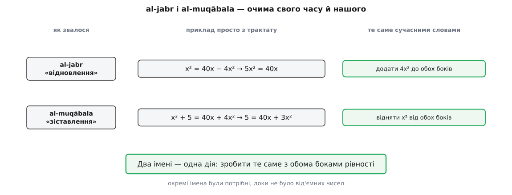
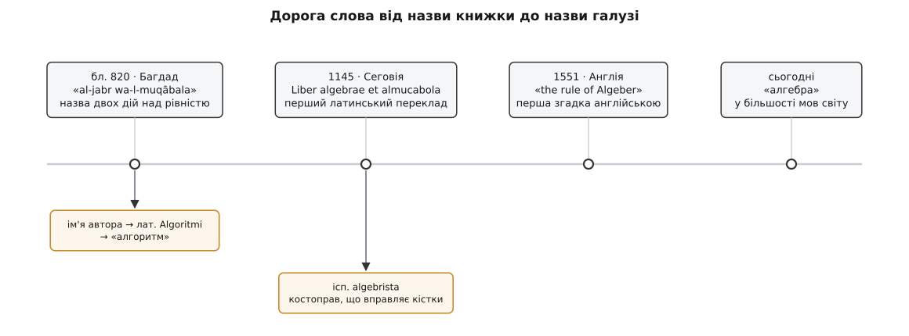

# 📜 «Алгебра» — це назва дії над рівністю

Цілу галузь математики звуть за операцією, яку сьогодні навіть не називають окремо: за рухом «зроби те саме з обома боками». Слово прийшло з назви багдадської книжки, писаної без жодного знака — без «=», без «x», навіть без цифр. Тут — звідки взялося це слово, чому в IX столітті таких рухів налічували два й кожному давали власне ім'я, і що з обома сталося, коли через сім століть після Багдада хтось нарешті поставив дві однакові рисочки.

## Книжка, назва якої стала іменем галузі

За халіфа аль-Мамуна, що правив із 813 по 833 рік, у Багдаді написано трактат «Аль-кітаб аль-мухтасар фі хісаб аль-джабр ва-ль-мукабала» (ар. *al-Kitāb al-mukhtaṣar fī ḥisāb al-jabr wa-l-muqābala*) — «Коротка книга про обчислення через al-jabr і al-muqābala». Автор — Мухаммад ібн Муса аль-Хорезмі, і книжку він присвятив самому халіфові. Точного року немає в жодному джерелі; більшість істориків ставить її десь між 820 і 830 роком, і надійне тут саме правління, а не рік.

Задум був цілком приземлений. У передмові аль-Хорезмі каже, що збирає найлегше й найпотрібніше з обчислень — те, що людям постійно треба при спадщині, заповітах, поділі майна, судових позовах і торгівлі, а ще при вимірюванні землі, копанні каналів і подібних роботах. Це не академічний трактат, а посібник для писаря й судді. Власне алгебри в ньому лише перша, найкоротша частина; далі йде практичне вимірювання, а найдовший розділ — задачі про спадкові частки за мусульманським правом. Слово, що назвало науку, вийшло з технічної глави книжки про те, як поділити майно небіжчика.

## Чому дій було дві, а не одна

Сьогодні «перенести доданок на другий бік» і «скоротити однакове по обидва боки» відчуваються як одна річ у двох одежах. У IX столітті це були дві різні роботи — і причина в тому, чого тоді просто не існувало: [від'ємних чисел](topic:math-number-theory/negative-numbers). Величина була кількістю чогось — дирхамів, площі, землі; «мінус п'ять дирхамів» не було числом. Віднімання було дією, яку виконують, а не станом, у якому доданок може перебувати.

Звідси наслідок, від якого все й крутиться. Рівність, де щось стоїть відняте, була не записом, а записом із діркою: там бракує величини, і поки не залатаєш, працювати з ним не можна. Латання й називалося **al-jabr** — «відновлення», буквально «складання докупи розламаного».

```
x² = 40x − 4x²        праворуч бракує чотирьох майн
5x² = 40x             після al-jabr: бракуюче відновлено — з обох боків
```

Нашими словами: додали 4x² до обох боків. Їхніми: правий бік був ущерблений на чотири майна, тож ці майна відновлюють — і рівно стільки ж додають ліворуч, щоб рівність не покривилася.

Друга дія — **al-muqābala**, «зіставлення», «постановка одного проти одного»: два боки ставлять лицем до лиця й викреслюють те, що є на обох.

```
x² + 5 = 40x + 4x²    майно стоїть по обидва боки
5 = 40x + 3x²         після al-muqābala: одне майно знято з обох боків
```

Нашими словами: відняли x² від обох боків.

Отже, обидві операції — це наш єдиний рух, і різняться вони лише напрямком: одна додає однакове, друга віднімає однакове. Чому ж їм давали окремі імена? Тому що мета була інша, ніж у нас. Ми переставляємо рівність, щоб лишити невідоме саме. Аль-Хорезмі переставляв, щоб загнати рівність в один із шести дозволених виглядів — бо на кожен вигляд він мав окремий рецепт, а на щось поза ними не мав жодного.


*Два стовпці ліворуч — те, що в книжці; зелений стовпець — те саме нашими словами. Різних дій дві лише тому, що доданок не міг бути від'ємним: доводилося окремо називати відновлення відсутнього й окремо — зняття зайвого.*

## Шість видів замість одного

Дозволених виглядів було шість, і кожен звучав як окреме речення:

```
ax² = bx          майно дорівнює кореням
ax² = c           майно дорівнює числу
bx  = c           корені дорівнюють числу
ax² + bx = c      майно й корені дорівнюють числу
ax² + c  = bx     майно й число дорівнюють кореням
bx  + c  = ax²    корені й число дорівнюють майну
```

Сьогодні всі шість — це один рядок ax² + bx + c = 0. Але цей рядок можливий тільки тоді, коли b і c дозволено бути від'ємними: інакше зігнати все на один бік не вийде, бо на другому боці лишиться нуль, а «нуль дирхамів» теж не був повноцінною величиною. Без від'ємних чисел шість виглядів не зливаються в один — і кожен потребує власного рецепта з власним доведенням. Саме тут al-jabr і al-muqābala виконували свою справжню службу: хай яка рівність вийшла із задачі про спадок, ці дві дії тягли її в одну з шести комірок, і аж тоді вмикався рецепт.

Те, що ми звемо [квадратним рівнянням](topic:math-algebra/quadratic-equations) — рівнянням, де невідоме входить у квадраті й де одна-єдина формула дає обидва корені, — у трактаті розсипане на шість випадків, бо шостої частини сучасного запису тоді ще не було.

## Рівність, записана прозою

І тут друга несподіванка: у книжці немає жодного символу. Ні «=», ні літери для невідомого — навіть числа виписані словами, а не цифрами. Алгебра аль-Хорезмі суцільно риторична: рівняння — це речення української, тобто арабської, мови.

Словник у нього такий. **Шай** (ар. *shayʾ* — «річ») — невідоме. **Джазр** (ар. *jadhr* — «корінь», як корінь рослини) — те саме невідоме, взяте як перший степінь. **Маль** (ар. *māl* — «майно», «статок») — його квадрат: майно виростає з кореня, як рослина. **Дирхам** — монета, тобто просто число. Латинські перекладачі передали *jadhr* словом *radix*, «корінь», — і звідти воно перейшло в усі європейські мови, включно з нашим «квадратним коренем». Слово досі носить у собі образ рослини, з якої росте квадрат.

Ось найвідоміша задача трактату, як її звучало прочитати:

> Майно і десять його коренів становлять тридцять дев'ять дирхамів.

А ось розв'язок — теж повністю словами, крок за кроком:

```
полови число коренів                 10 → 5
помнож половину саму на себе          5 · 5 = 25
додай до тридцяти дев'яти            25 + 39 = 64
візьми корінь із того, що вийшло      √64 = 8
відніми половину числа коренів        8 − 5 = 3
```

Корінь — три, майно — дев'ять. Сучасною рукою це x² + 10x = 39 і x = √((10/2)² + 39) − 10/2 = 3: ті самі п'ять кроків у тому самому порядку. Тобто формула коренів квадратного рівняння в трактаті вже є — просто розказана як історія, і працює вона бездоганно.

Але за розказаний рецепт доводиться платити. Історію не видно очима: на неї не можна глянути й перевірити, чи цей крок узагалі дозволений, — її можна лише виконати або не виконати. Ось чому рецептів мусило бути шість, і ось чому аль-Хорезмі підпер кожен складений випадок кресленням: справжній квадрат зі стороною *x*, до двох його боків прикладені прямокутники по 5*x*, і бракує кутового квадратика 5 · 5 = 25, який і треба **доповнити**, щоб вийшов великий квадрат. Геометричне «доповнити до цілого» й al-jabr «відновити відняте» — той самий образ, тільки в один бік про фігуру, а в другий про рівність. Аль-Хорезмі хотів доведення, а не голого правила; без символів креслення було єдиним доведенням, яке взагалі можна було подати.

Цікаво, що крок назад тут таки був. Александрійський грек Діофант ще в III столітті ввів скорочені позначки для невідомого та його степенів — не суцільну прозу, але й не нашу формулу; історики звуть це синкопованою алгеброю. Аль-Хорезмі до тих позначок не повернувся й писав словами все. Хто що зробив у цій довгій історії й чому ім'я Діофанта стоїть на рівняннях, методу для яких він не дав, — [розібрано окремо](topic:math-number-theory/linear-diophantine/hist-diophantus.md).

## Хто такий аль-Хорезмі — і чого про нього не знають

Тепер про людину, і тут доведеться говорити переважно про прогалини.

Мухаммад ібн Муса аль-Хорезмі (ар. *Muḥammad ibn Mūsā al-Khwārizmī*) жив приблизно з 780 по 850 рік — обидві дати реконструйовані істориками, а не взяті з документа.

Прізвисько «аль-Хорезмі» вказує на Хорезм — область на південь від Аральського моря, поділену нині між Узбекистаном і Туркменістаном. Саме через це його зазвичай звуть перським за походженням: тогочасний Хорезм належав до іранського культурного кола. Проте історик ат-Табарі (IX–X ст.) дає йому інше прізвисько — «аль-Кутруббуллі», тобто з Кутруббуля, округи під самим Багдадом. Тож навіть батьківщина не встановлена: або ім'я зберігає пам'ять про предків, що переселилися з Хорезму поколіннями раніше, або одне з двох свідчень хибне.

Той-таки ат-Табарі додає епітет «аль-Маджусі» — «маг», що зазвичай означає зороастрійця. Проти цього стоїть побожна мусульманська передмова самої «Алгебри». Історики читають розбіжність по-різному: родина зороастрійського кореня, а сам він мусульманин — або епітет узагалі помилка переписувача. Стан справ: суперечливо, документів, які б це вирішили, немає.

Чесне формулювання виходить довше за ярлик: писав арабською, працював у Багдаді, за власним іменем походив із Середньої Азії, найімовірніше іранського (перського) роду. Назвати його просто «арабом» — стерти походження; назвати просто «персом» — вдати, ніби походження задокументоване. Обидва ярлики коротші за правду.

Окремо про «Дім мудрості». За звичною розповіддю аль-Хорезмі працював у багдадському Байт аль-Хікма — науковій академії халіфа аль-Мамуна з перекладацьким відділом. Зв'язок ученого з двором халіфа справді засвідчений: він присвятив аль-Мамунові дві свої книжки, з алгебри та з астрономії. А от сама академія за останні десятиліття добряче зменшилася: Дімітрі Ґутас та інші дослідники доводять, що Байт аль-Хікма був палацовою бібліотекою й архівом, успадкованим із сасанідської придворної традиції, а образ дослідницького інституту — пізніша проєкція сучасних установ у IX століття. Тож «працював при дворі халіфа в Багдаді» — надійно; «викладав у Домі мудрості» — картинка на слабкому ґрунті.

Загальну біду з цією біографією влучно називає архів історії математики Сент-Ендрюського університету: подробиць життя відомо вкрай мало, і саме брак фактів спокушає добудовувати здогади майже ні з чого. Хто пише про аль-Хорезмі впевнено й барвисто, той майже напевно добудовує.

І остання відкрита рана — першість. Турецький історик науки Айдин Саїли (тур. Aydın Sayılı, 1913–1993) видав трактат «Логічні необхідності в мішаних рівняннях» математика Абд аль-Хаміда ібн Турка, що працював на початку IX століття, ймовірно одночасно з аль-Хорезмі, — і висунув здогад, що перша арабська книжка з алгебри могла належати саме йому. Від тексту Ібн Турка вціліли уривки, дати його життя непевні, і гіпотеза лишається гіпотезою: ні підтвердженою, ні спростованою. Що не оскаржують — так це те, що переписували, перекладали й викладали книжку аль-Хорезмі. Слово прийшло з її назви за правом поширення, а не за доведеною першістю.

## Дорога слова в Європу

1145 року в Сеговії англієць Роберт Честерський (лат. *Robertus Castrensis*) переклав трактат латиною під назвою «Liber algebrae et almucabola». Трохи згодом у Толедо свій переклад зробив Герард Кремонський. Через ці латинські версії книжка століттями лишалася в європейських школах головним підручником із предмета — аж до XVI століття.

В латину перейшли обидва арабські слова: *algebra* й *almucabola*. Вижило одне. Книжку цитували за першим словом пари, пару поступово вкорочували — і «almucabola» зникло разом із шістьма виглядами, яким воно служило.

Далі слово розгалузилося двічі, і обидві гілки варті уваги.

**Іспанська гілка.** В Іспанії *al-jabr* зберегло не математичне, а первісне, побутове значення — «складання докупи розламаного». Тому *algebrista* по-іспанському став костоправом: тим, хто вправляє зламану кістку. Цирульники-хірурги вивішували вивіски «Algebrista y Sangrador» — костоправ і кровопускач — ще у XVII столітті, а Сервантес згадує алгебриста в другій частині «Дон Кіхота» (розділ XV). Двісті років одне слово означало два ремесла — переставляти рівняння й вправляти кістки, — і обидва були точним перекладом одного образу: відновлення.

**Гілка від імені автора.** Друга книжка аль-Хорезмі, про індійські цифри й [позиційний запис](topic:math-number-theory/positional-systems), збереглася лише в латинському перекладі; рукопис починається словами «Dixit Algorizmi» — «сказав аль-Хорезмі». (Назва «Algoritmi de numero Indorum», під якою її звично цитують, не його — її дало видання 1857 року.) Із латинізованого імені постало слово *algorismus*: спершу воно означало сам спосіб рахувати індійськими цифрами в стовпчик, на противагу рахунку на абаку, і аж багато пізніше зсунулося до сьогоднішнього «алгоритму». Тут варто сказати прямо, бо помилка ходить повсюдно: від його імені пішло слово, а не поняття. Діяти за скінченним чітким рецептом уміли за тисячі років до нього — вавилонські таблички й Евклід тому свідки.

**Англійська гілка.** Найраніша відома поява слова в англійській — 1551 рік, книжка Роберта Рекорда «The Pathwaie to Knowledge», де мовиться про «the rule of Algeber».


*Головна вісь — дорога назви книжки до назви галузі. Дві жовті гілки внизу відщепилися дорогою: одна від імені автора, друга — від первісного, нематематичного значення слова al-jabr.*

## 1557: дві однакові лінії

Той самий Рекорд. Роберт Рекорд (валл. *Robert Recorde*, бл. 1510–1558) народився в Тенбі у Пембрукширі, в Уельсі; за фахом лікар, він писав математику англійською й у формі розмови вчителя з учнем — для людей, що не мали латини й тому були відрізані від усієї вченої літератури.

За шість років після «the rule of Algeber», 1557-го, він видав «The Whetstone of Witte» — «Точило дотепності», другу частину своєї арифметики, присвячену кореням, «косичній практиці» та правилу рівняння. «Косична» тут — від італ. *cosa*, «річ», як звали невідоме італійські рахівники; за однією з версій це прямий переклад арабського *shayʾ*, за іншою — від латинського *causa*, що в середньовічних текстах теж почало означати «річ». Німці з тієї ж причини звали алгебру *die Coss*, а алгебраїстів — коссистами.

І в цій книжці Рекорд наштовхнувся на цілком буденну прикрість: виписуючи рівняння, доводилося раз за разом писати «is equalle to». Щоб уникнути, за його ж словами, нудного повторення цих слів, він поставив пару паралельних, або «Gemowe lines», однакової довжини: **=**. Причина, яку він назвав, гідна того, щоб її запам'ятати: «noe .2. thynges, can be moare equalle» — жодні дві речі не можуть бути рівніші. «Gemowe» — від фр. *gemeau*, «близнюк». Дві однакові лінії як знак того, що ліворуч і праворуч одне й те саме.

Порахуймо проміжок. Дію назвали близько 820 року. Знак, над яким ця дія виконується, з'явився 1557-го. Понад сім століть люди переставляли рівності, не маючи чим записати саму рівність.

І перемога не була ні швидкою, ні певною. Рекордові лінії були значно довші за наші. Сам він помер наступного, 1558 року у в'язниці Кінґс-Бенч, куди потрапив за борги. На континенті Декарт у «Геометрії» (1637) вживав власний знак рівності, і більшу частину XVII століття європейські автори віддавали перевагу йому або ще іншим варіантам; «=» стало загальним пізніше — хоча сам Декарт написав його в листі 1640 року.

## Що змінив символьний запис

Самого знака рівності було замало: рівняння за ним усе одно доводилося писати числами конкретної задачі. Бракувало ще двох кроків, і обидва зробили за наступні вісімдесят років.

1591 року француз Франсуа Вієт (фр. *François Viète*) у праці «In artem analyticem isagoge» позначив літерами не тільки невідоме, а й **відомі** величини: голосними — шукане, приголосними — дане. Ось справжній стрибок. Відтепер можна записати не окремий числовий випадок, а рівняння взагалі: «майно й десять коренів» стає «ax² + bx», де a і b — будь-що.

1637 року Декарт у «Геометрії» довів запис до сьогоднішнього вигляду: a, b, c — відомі, x, y, z — невідомі, степінь — надрядковим числом. Відтоді формула на папері майже не змінилася.

І тепер те, заради чого вся ця історія. Коли обидва боки рівності стоять поруч як видимі предмети, правило «зроби те саме з обома боками» перестає бути дозволеним рецептом і стає тим, що видно очима. Дозволу на хід більше не треба питати — треба лише перевірити, чи хід зроблено з обома боками, а це перевіряє власний зір.

Наслідків два, і обидва миттєві.

**al-jabr і al-muqābala злилися в один рух.** Щойно доданок дістав право бути від'ємним, «відновити відняте» й «скоротити однакове» — це буквально одна дія, взята в два боки: додати однакове до обох боків або відняти однакове з обох боків. Два імені лишилися пам'ятником тому, що колись цих боків було не видно. Від'ємні числа, до речі, не Європа придумала: Брахмагупта в Індії дав правила дій із ними ще 628 року, говорячи про «майна й борги», а китайська рахунка на паличках розрізняла додане й відняте кольором паличок ще за століття до того. Європа приймала їх туго: Кардано в «Ars Magna» (1545) уже рахував із від'ємними коренями, але звав їх вигаданими.

**Шість виглядів згорнулися в один.** ax² + bx + c = 0 — і одна формула покриває всі шість випадків трактату, зокрема ті, які колись доводили окремими кресленнями.

> 🔧 **Навіщо це знати.** Шість видів рівнянь стали одним не тому, що математика подужчала, а тому, що змінився запис. Це варто тримати в голові щоразу, коли якась техніка виглядає як пачка окремих правил, які треба завчити напам'ять: часто це ознака не складності предмета, а того, що позначення ще не дозріло й ховає спільне під різними масками. Пошукайте запис, у якому ці правила стануть одним, — і половина «правил» зникне разом із потребою їх пам'ятати.

## Що встояло, а що ні

Розкладімо сказане за міцністю доказів, бо в цій історії вона дуже різна.

- **Усталений факт.** Слово «алгебра» — з назви трактату аль-Хорезмі, написаного в Багдаді за халіфа аль-Мамуна (813–833). Латиною його переклав Роберт Честерський 1145 року в Сеговії. Знак «=» увів Роберт Рекорд у «The Whetstone of Witte» 1557 року. Іспанське *algebrista* в значенні «костоправ» — засвідчене вживання, аж до Сервантеса.
- **Задокументовано слабко.** Біографія аль-Хорезмі: дати життя приблизні, батьківщина суперечлива (Хорезм за іменем — Кутруббуль за ат-Табарі), релігійне тло родини непевне. Перське походження правдоподібне за іменем і культурним колом, але документами не доведене.
- **Переглянуто наукою.** «Дім мудрості» як дослідницька академія — образ, що радше проєктує сучасний інститут у IX століття; зв'язок самого аль-Хорезмі з двором халіфа при цьому засвідчений присвятами.
- **Відкрите питання.** Чи не написав першу арабську книжку з алгебри Абд аль-Хамід ібн Турк — гіпотеза Айдина Саїли, ні підтверджена, ні спростована.
- **Хибно.** «Аль-Хорезмі винайшов алгоритм.» Від латинізованого імені пішло слово; спосіб діяти за скінченним рецептом старший за нього на тисячоліття.

Слово тим часом пережило все, що його породило: і шість виглядів рівнянь, і потребу відновлювати відняте, і саму мову, якою його написали. «Алгебра» на будь-якій мові світу досі щодня згадує ту хвилину, коли рівність доводилося рятувати від віднімання.
