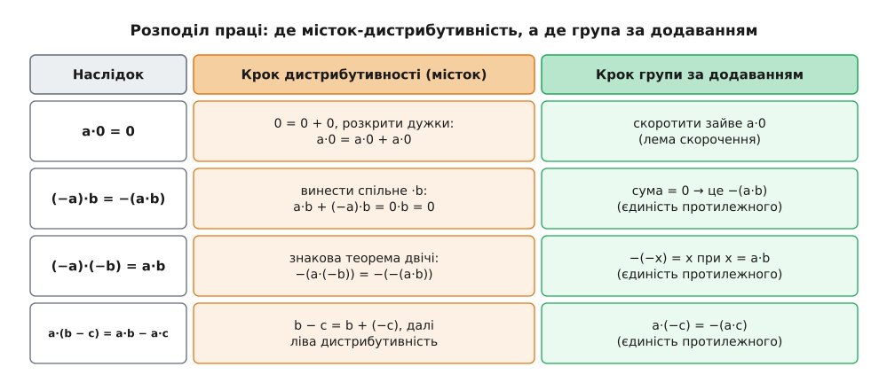
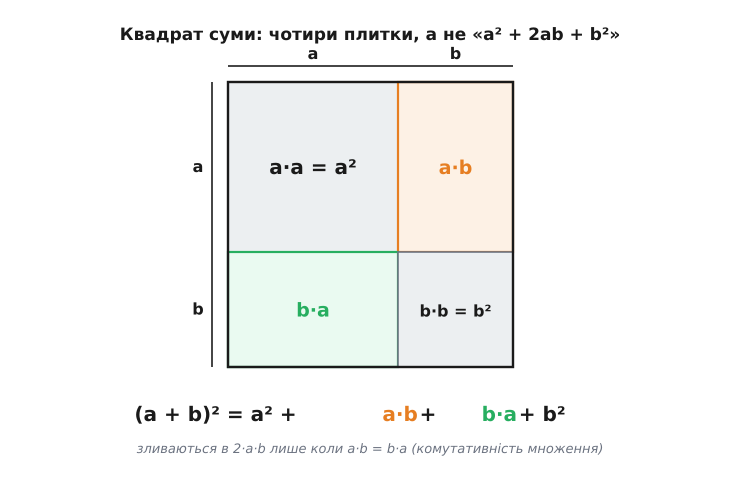

# 🧮 Наслідки аксіом кільця: строгий ланцюжок «арифметики знаків»

Ті кілька фактів, якими школяр користується не задумуючись — нуль, помножений на будь-що, дає нуль; «мінус на мінус — плюс»; дужки в a·(b − c) розкриваються зі зміною знака, — насправді не аксіоми й не домовленості, а **теореми**, що випливають із самого означення кільця. Тут вони доведені по черзі, і біля кожного кроку стоїть ім'я тієї аксіоми, на яку він спирається. Виграш подвійний: по-перше, доведення чинне не лише для цілих, а для **будь-якого** кільця одразу — тих самих слів вистачить і на многочлени, і на квадратні матриці, і на лишки за модулем. По-друге, тримаючи в полі зору, який саме крок працює на **дистрибутивності** (містку між двома діями), а який — лише на **груповій природі додавання** (скороченні), ми точно бачимо, як далеко кожен факт узагальнюється.

### Домовимося про позначки аксіом

Щоб у кожному рядку можна було вказати пальцем на використану аксіому, дамо їм короткі мітки. Кільце — це множина R із двома діями; ось увесь набір вимог.

```
Додавання (R, +) — абелева група:
  (A1) замкненість:      a + b ∈ R
  (A2) асоціативність:   (a + b) + c = a + (b + c)
  (A3) нейтральний нуль:  a + 0 = a   (а через A5 і  0 + a = a)
  (A4) протилежний:      a + (−a) = 0
  (A5) комутативність:   a + b = b + a

Множення (R, ·) — моноїд:
  (M1) замкненість:      a · b ∈ R
  (M2) асоціативність:   (a·b)·c = a·(b·c)
  (M3) одиниця:          a · 1 = 1 · a = a

Місток — дистрибутивність (обидві, бо · не оголошено переставним):
  (D←) ліва:   a·(b + c) = a·b + a·c
  (D→) права:  (b + c)·a = b·a + c·a
```

Віднімання — не окрема дія, а скорочення запису: **a − b означає a + (−b)**. Ця дрібниця важлива — усе, що ми знаємо про знак мінус, іде через A4 та дистрибутивність, а не через якесь окреме правило віднімання.

### Робочий кінь: лема скорочення

Перш ніж чіпати множення, витягнімо з самого додавання інструмент, яким користуватимемося раз у раз. Він каже: спільний доданок з обох боків рівності можна викреслити.

**Лема (скорочення за додаванням).** Якщо a + c = b + c, то a = b.

```
a + c = b + c
(a + c) + (−c) = (b + c) + (−c)   додаємо −c до обох боків (−c існує: A4)
a + (c + (−c)) = b + (c + (−c))   [A2: асоціативність]
a + 0 = b + 0                     [A4: c + (−c) = 0]
a = b                             [A3: нейтральний нуль]
```

Зверніть увагу: множення тут не з'явилося ані разу. Скорочення тримається виключно на трьох аксіомах додавання — асоціативності, нулі й протилежному, — тобто на тому, що (R, +) є [група](topic:math-algebra/group-theory). Це і є «групова природа додавання», про яку йтиметься нижче щоразу, коли ми щось «скоротимо».

> 🔧 **Навіщо це.** Ця лема — робочий кінь усього подальшого. Кожне шкільне «перенести доданок через знак рівності», кожне «відняти те саме з обох боків» — це рівно вона. І вона нічого не знає про множення: щойно в доведенні звучить «скоротимо X», працює не арифметика загалом, а сама лише група за додаванням. Розділити, де саме спрацював місток-дистрибутивність, а де — група, означає зрозуміти доведення до кінця.

### Нуль і одиниця — по одному в кільці

Ми весь час пишемо «нуль» і «одиниця» так, ніби вони єдині. Це треба довести, інакше запис «−a» чи «−(a·b)» був би двозначним.

**Єдиність нуля.** Хай і 0, і 0′ — нейтральні для додавання. Тоді

```
0 = 0 + 0′    [0′ нейтральний:  x + 0′ = x  при x = 0]
0 + 0′ = 0′   [0 нейтральний з обох боків (A3+A5):  0 + y = y  при y = 0′]
```

отже 0 = 0′. Двох різних нулів бути не може.

**Єдиність протилежного.** Хай у елемента a є два протилежні, b і b′ (тобто a + b = 0 і a + b′ = 0). Тоді

```
b = b + 0            [A3]
  = b + (a + b′)     [a + b′ = 0]
  = (b + a) + b′     [A2]
  = 0 + b′           [b + a = 0, бо a + b = 0 і A5]
  = b′               [A3]
```

Тому запис **−a** позначає **той самий, єдиний** елемент — і саме на цю єдиність спиратимуться всі знакові теореми: щоб довести «X = −(a·b)», досить показати, що X є протилежним до a·b.

**Єдиність одиниці.** Той самий хід, але для множення. Хай 1 і 1′ — обидві нейтральні для `·`. Тоді, користуючись двобічністю M3,

```
1 = 1 · 1′    [1′ нейтральний справа:  x · 1′ = x  при x = 1]
1 · 1′ = 1′   [1 нейтральний зліва:    1 · y = y  при y = 1′]
```

отже 1 = 1′. Жодна з цих трьох єдиностей ще не потребувала дистрибутивності — вони живуть окремо в «поверсі додавання» і «поверсі множення». Місток увімкнеться зараз.

### Множення на нуль: a·0 = 0 і 0·a = 0

Ось перше місце, де дистрибутивність вступає в гру. Ідея — записати нуль як 0 + 0 і розкрити дужки; тоді скорочення (наша лема) добиває результат.

**Зліва.**

```
a·0 = a·(0 + 0)      [A3:  0 = 0 + 0]
    = a·0 + a·0      [D←: ліва дистрибутивність]
```

Маємо a·0 = a·0 + a·0. Перепишемо ліву частину як a·0 + 0 (за A3) і скоротимо a·0:

```
a·0 + 0 = a·0 + a·0
      0 = a·0         [лема скорочення]
```

**Справа** — дзеркально, але тут потрібна вже **права** дистрибутивність, бо множник 0 стоїть з іншого боку:

```
0·a = (0 + 0)·a      [A3]
    = 0·a + 0·a      [D→: права дистрибутивність]
0·a = 0              [лема скорочення]
```

Два окремі доведення — не педантизм: множення не переставне, тож «a·0 = 0» і «0·a = 0» — різні твердження, і кожне спирається на **свою** дистрибутивність. Тут наочно видно розподіл праці: **дистрибутивність** робить розклад на два однакові доданки, а **група** (скорочення) вбиває зайвий. Приберіть будь-яку з половин — теорема розсиплеться.

### Знак добутку: (−a)·b = −(a·b) = a·(−b)

Тепер головне джерело «арифметики знаків». Твердження «(−a)·b = −(a·b)» за єдиністю протилежного зводиться до перевірки однієї рівності: що (−a)·b **у сумі з** a·b дає нуль.

```
a·b + (−a)·b = (a + (−a))·b   [D→: права дистрибутивність — виносимо ·b]
             = 0·b            [A4:  a + (−a) = 0]
             = 0              [щойно доведено:  0·b = 0]
```

Отже (−a)·b — протилежний до a·b, а протилежний єдиний, тому **(−a)·b = −(a·b)**. Дзеркально, виносячи цього разу лівий множник a·(…) через **ліву** дистрибутивність, дістаємо a·(−b):

```
a·b + a·(−b) = a·(b + (−b))   [D←: ліва дистрибутивність]
             = a·0            [A4]
             = 0              [a·0 = 0]
```

тож і **a·(−b) = −(a·b)**. Обидва вирази дорівнюють одному й тому ж −(a·b), звідки (−a)·b = a·(−b): знак можна «перекидати» з одного множника на інший. Знову той самий тандем — дистрибутивність виносить спільний множник, група (єдиність протилежного) робить висновок.

**Наслідок: (−1)·a = −a.** Досить у щойно доведеному взяти окремий випадок:

```
(−1)·a = −(1·a) = −a    [(−a)·b = −(a·b) при a := 1, b := a;  далі M3]
```

Помножити на −1 — це той самий негатив; але тепер це теорема, а не визначення знака.

### «Мінус на мінус — плюс» як теорема

Тепер той самий факт, який у школі проголошують правилом. Він падає з двох застосувань попередньої теореми плюс однієї дрібниці про подвійний мінус.

Спершу та дрібниця. **−(−x) = x** для будь-якого x: адже x у сумі з (−x) дає нуль (це A4, прочитане навпаки), тобто x є протилежним до (−x); а протилежний єдиний, отже −(−x) саме й дорівнює x. Множення тут ні до чого — знову чиста група.

Тепер сам ланцюжок:

```
(−a)·(−b) = −(a·(−b))    [(−a)·y = −(a·y) при y := −b]
          = −(−(a·b))    [a·(−b) = −(a·b), доведено вище]
          = a·b          [−(−x) = x при x := a·b]
```

Отже **(−a)·(−b) = a·b**. Це не угода й не «щоб знаки узгоджувалися»: рівність **вимушена** аксіомами — дистрибутивністю (через знакову теорему) і груповою природою додавання (через єдиність протилежного). Варто ще завважити, чого їй **не** треба: у виведенні жодного разу не з'явилася ні комутативність множення, ні навіть одиниця 1. Тому «мінус на мінус — плюс» правдиве й у некомутативному кільці, і в кільці без одиниці (у «рингу») — усюди, де взагалі є додавання групою і місток дистрибутивності.

Зведімо всю знакову трійку в одну таблицю — де саме працює місток, а де група:


*Розподіл праці в «арифметиці знаків». Помаранчева колонка — крок, де спрацьовує дистрибутивність (виносить спільний множник, розкладає добуток на доданки). Зелена колонка — крок, де спрацьовує сама група за додаванням: скорочення однакового доданка або єдиність протилежного −a. Жоден із наслідків не тримається на чомусь одному: усі вони — стик двох поверхів кільця через місток.*

### Розкриття дужок над різницею: a·(b − c) = a·b − a·c

Дистрибутивність в аксіомах записана над **сумою**. Що вона працює й над **різницею** — уже наслідок, бо різниця це замаскована сума:

```
a·(b − c) = a·(b + (−c))       [означення різниці:  b − c = b + (−c)]
          = a·b + a·(−c)       [D←: ліва дистрибутивність]
          = a·b + (−(a·c))     [a·(−c) = −(a·c), знакова теорема]
          = a·b − a·c          [означення різниці]
```

Ніякого окремого «закону дистрибутивності над відніманням» не існує — він увесь час був частиною того самого D← плюс правило знаку. Симетрично (b − c)·a = b·a − c·a через праву дистрибутивність D→.

### Квадрат суми — і місце, де самих цих аксіом **замало**

Досі кожен факт випадав із аксіом кільця задарма. Візьмімо тепер вираз, знайомий зі школи як (a + b)² = a² + 2ab + b², — і подивімося, скільки з нього насправді доводиться, а де доведення впирається в стіну.

Розкриваємо чесно, самими лише дистрибутивностями (і a² — це скорочення для a·a):

```
(a + b)² = (a + b)·(a + b)
         = a·(a + b) + b·(a + b)     [D→: права дистрибутивність]
         = (a·a + a·b) + (b·a + b·b) [D←: ліва, у кожній дужці]
         = a² + a·b + b·a + b²
```

Ось чесний результат у **будь-якому** кільці: **(a + b)² = a² + a·b + b·a + b²**. Два середні доданки — a·b і b·a — це різні добутки, поки ми не знаємо, що множники переставні. Злити їх в один «2ab» можна **тільки** маючи додаткову вимогу

```
a·b = b·a    (комутативність множення)
```

якої в означенні кільця немає. Отже звична формула a² + 2ab + b² — не теорема про кільця, а теорема про **комутативні** кільця; у загальному кільці вона просто хибна.

Щоб це не лишалося словами, ось конкретне спростування у кільці квадратних [матриць](topic:math-algebra/matrices-as-operations) 2×2, де множення некомутативне. Візьмімо

```
A = [0 1]    B = [0 0]
    [0 0]        [1 0]
```

Порахуймо всі шматки:

```
A + B = [0 1]        (A + B)² = [1 0] = I   (одинична матриця)
        [1 0]                   [0 1]

A² = [0 0] = 0       B² = [0 0] = 0
     [0 0]                [0 0]

A·B = [1 0]          B·A = [0 0]
      [0 0]                [0 1]
```

Порівняймо два прочитання. Чесна формула дає правильну відповідь:

```
A² + A·B + B·A + B² = 0 + [1 0] + [0 0] + 0 = [1 0] = I  ✓  (= (A+B)²)
                          [0 0]   [0 1]       [0 1]
```

А «шкільна» a² + 2ab + b² — ні, бо вона наперед злила A·B з B·A:

```
A² + 2·A·B + B² = 0 + 2·[1 0] + 0 = [2 0] ≠ I  ✗
                        [0 0]       [0 0]
```

Різниця рівно в тому, що A·B ≠ B·A: помаранчева й зелена клітинки квадрата — окремі, і зливаються в 2ab лише коли множники переставні.


*Чому (a+b)² = a² + a·b + b·a + b². Квадрат зі стороною a+b розрізано на чотири плитки: діагональні a·a та b·b і дві позадіагональні — a·b та b·a. У загальному кільці це різні добутки (різні плитки), тому їх чотири, а не «a² + 2ab + b²». Злити позадіагональні в 2ab дозволяє лише додаткова аксіома a·b = b·a — комутативність множення, якої в означенні кільця немає.*

Тим самим механізмом видно й долю формули різниці квадратів: (a + b)·(a − b) = a² − a·b + b·a − b², і воно згортається у звичне a² − b² знову-таки **тільки** за комутативності. Там, де множники не переставні, обидві шкільні тотожності — не закон, а окремий привілей комутативних кілець.
