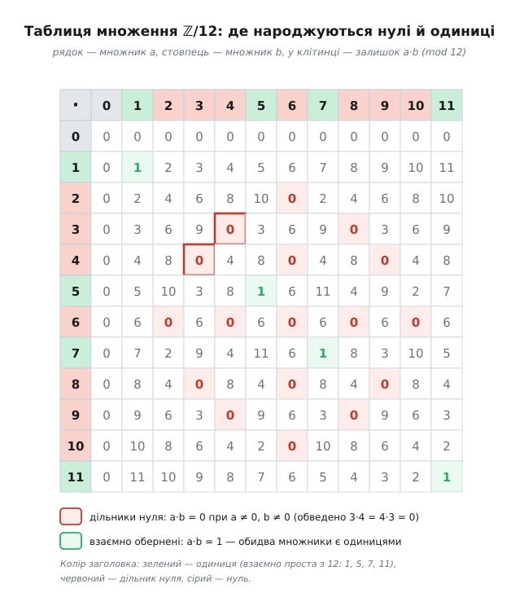

# ⚙️ Кільце ℤ/n у коді: нове число з перевантаженими «+» і «·»

Найпевніший спосіб побачити, як влаштоване кільце лишків ℤ/n, — не доводити його властивості, а **навчити компілятор**, що лишок за модулем n є числом: дати йому власний тип, у якому `a + b` і `a · b` самі згортаються назад у діапазон 0…n−1. Щойно це зроблено, вся структура кільця — повна таблиця множення, оборотні елементи, дільники нуля — стає звичайними циклами по звичайних числах. Абстракція перестає бути абстракцією й починає виконуватися: її можна запустити й подивитися.

### Ідея: елемент — це «лишок, що пам'ятає свій модуль»

Об'єкт, який ми хочемо змайструвати, гранично простий — пара «значення + модуль», де значення завжди тримають у канонічному вигляді 0…n−1. Уся сіль у двох діях. Додати два таких об'єкти означає додати їхні значення й узяти [залишок за модулем](topic:math-number-theory/modular-arithmetic); помножити — перемножити й узяти залишок. Більше в арифметиці кільця нема нічого: жодного третього правила, жодного винятку.

Мови програмування дають рівно той інструмент, який тут потрібен, — **перевантаження операторів** (англ. *operator overloading*): змогу сказати, що означають знаки `+` і `·` для нового типу. Це не косметика. Коли `+` і `·` для ℤ/n поводяться правильно, **весь код, написаний для звичайних чисел, працює для лишків без жодної зміни**. Подвійний цикл, що будує таблицю множення; перевірка `a * x == 1`, що шукає обернений; піднесення до степеня — усе це вже написано в голові для звичайних чисел і тепер просто застосовується до нового. У цьому й уся вигода абстракції в дії: ми означуємо дві операції — і задарма отримуємо всю арифметику навколо них.

> 🔧 **Навіщо перевантажувати, а не писати функцію `mulmod(a, b, n)`.** Можна, звісно, усюди кликати `mulmod(a, b, n)` замість `a * b` — але тоді кожна формула перетвориться на дерево викликів, і кільце за ними стане не видно. Перевантаження повертає нотацію: вираз `a * b + c` читається як математика, а не як програма. Тип бере на себе зведення за модулем, а думка лишається про структуру, а не про технічку. Абстракцію тому й варто робити виконуваною: правильний тип змушує машину рахувати рівно в тому світі, про який ми міркуємо.

### Тип ℤ/n і сканер його структури

Ось повна програма. Головний варіант — C++, бо перевантаження операторів там ідіоматичне — це канонічний спосіб оголосити «нове число»; поряд Python, де те саме роблять «магічні» методи `__add__` і `__mul__`. Обидва будують той самий тип, друкують таблицю множення для n = 12 й просканують кільце: для кожного елемента шукають обернений за множенням через [розширений алгоритм Евкліда](topic:math-number-theory/gcd-euclidean), а заразом і класифікують — оборотний він чи дільник нуля.

:::tabs
```cpp
#include <cstdint>
#include <iomanip>
#include <iostream>

// ── Елемент кільця лишків ℤ/n: значення завжди зведене в діапазон 0…n−1 ──
struct Zn {
    int64_t v;   // канонічний лишок
    int64_t n;   // модуль
    Zn(int64_t value, int64_t mod) : n(mod) {
        v = ((value % n) + n) % n;   // «+ n» рятує від'ємні: у C++ (−7) % 12 = −7, а не 5
    }
};

Zn  operator+(Zn a, Zn b) { return Zn(a.v + b.v, a.n); }   // a.v + b.v < 2n — влазить у int64
Zn  operator*(Zn a, Zn b) { return Zn(a.v * b.v, a.n); }   // a.v · b.v < n² — теж (n до ~3·10⁹)
bool operator==(Zn a, Zn b) { return a.v == b.v && a.n == b.n; }
std::ostream& operator<<(std::ostream& os, Zn a) { return os << a.v << " (mod " << a.n << ")"; }

// ── Розширений Евклід: gcd(a, b) + коефіцієнти Безу x, y  (a·x + b·y = gcd) ──
int64_t egcd(int64_t a, int64_t b, int64_t& x, int64_t& y) {
    if (b == 0) { x = 1; y = 0; return a; }
    int64_t x1, y1;
    int64_t g = egcd(b, a % b, x1, y1);
    x = y1;
    y = x1 - (a / b) * y1;
    return g;
}

// ── Обернений за множенням до a у ℤ/n, або −1, якщо його нема ──
int64_t inverse(int64_t a, int64_t n) {
    int64_t x, y;
    int64_t g = egcd(((a % n) + n) % n, n, x, y);
    if (g != 1) return -1;             // gcd ≠ 1 → взаємно не прості → оберненого нема
    return ((x % n) + n) % n;          // коефіцієнт Безу x і є обернений; зводимо в 0…n−1
}

int main() {
    const int64_t N = 12;
    std::cout << "3 * 4 = " << Zn(3, N) * Zn(4, N) << "\n\n";

    std::cout << "  *  |";                                   // шапка таблиці
    for (int b = 0; b < N; ++b) std::cout << std::setw(3) << b;
    std::cout << "\n-----+";
    for (int b = 0; b < N; ++b) std::cout << "---";
    std::cout << "\n";
    for (int a = 0; a < N; ++a) {                            // тіло: a·b для всіх пар
        std::cout << std::setw(3) << a << "  |";
        for (int b = 0; b < N; ++b)
            std::cout << std::setw(3) << (Zn(a, N) * Zn(b, N)).v;
        std::cout << "\n";
    }

    std::cout << "\nодиниці (оборотні): ";                   // скан за оберненістю
    for (int a = 1; a < N; ++a) if (inverse(a, N) != -1) std::cout << std::setw(3) << a;
    std::cout << "\nдільники нуля:      ";
    for (int a = 1; a < N; ++a) if (inverse(a, N) == -1) std::cout << std::setw(3) << a;
    std::cout << "\n";
}
```
```python
from math import gcd

# ── Елемент кільця лишків ℤ/n: значення завжди зведене в діапазон 0…n−1 ──
class Zn:
    def __init__(self, value, mod):
        self.n = mod
        self.v = value % mod          # у Python % за додатного модуля вже невід'ємний — «+ n» не треба
    def __add__(self, o):  return Zn(self.v + o.v, self.n)
    def __mul__(self, o):  return Zn(self.v * o.v, self.n)   # цілі Python необмежені — переповнення нема
    def __eq__(self, o):   return (self.v, self.n) == (o.v, o.n)
    def __repr__(self):    return f"{self.v} (mod {self.n})"

# ── Розширений Евклід: gcd(a, b) + коефіцієнти Безу  (a·x + b·y = gcd) ──
def egcd(a, b):
    if b == 0:
        return (a, 1, 0)
    g, x1, y1 = egcd(b, a % b)
    return (g, y1, x1 - (a // b) * y1)

# ── Обернений за множенням до a у ℤ/n, або None, якщо його нема ──
def inverse(a, n):
    g, x, _ = egcd(a % n, n)
    if g != 1:                        # gcd ≠ 1 → взаємно не прості → оберненого нема
        return None
    return x % n                      # коефіцієнт Безу x — і є обернений

N = 12
print(f"3 * 4 = {Zn(3, N) * Zn(4, N)}\n")

print("  *  |" + "".join(f"{b:3}" for b in range(N)))                       # шапка
print("-----+" + "---" * N)
for a in range(N):                                                         # тіло: a·b
    print(f"{a:3}  |" + "".join(f"{(Zn(a, N) * Zn(b, N)).v:3}" for b in range(N)))

units = [a for a in range(1, N) if inverse(a, N) is not None]              # скан
zdiv  = [a for a in range(1, N) if inverse(a, N) is None]
print("\nодиниці (оборотні): " + "".join(f"{a:3}" for a in units))
print("дільники нуля:      " + "".join(f"{a:3}" for a in zdiv))
```
:::

Ключ до всього типу — конструктор, а точніше рядок зведення `((value % n) + n) % n`. Він і є те місце, де кільце «замикається в коло»: хоч би яке ціле сюди прийшло — велике, від'ємне, узагалі поза діапазоном — на виході завжди канонічний лишок 0…n−1. Далі операторам `+` і `·` уже нема про що дбати: вони роблять звичайне додавання й множення цілих, а конструктор результату сам заганяє відповідь назад у коло. Дві дії кільця вміщуються у два однорядкові оператори саме тому, що вся робота «по колу» винесена в одне спільне місце.

### Що друкує програма

Обидві програми дають той самий вивід:

```
3 * 4 = 0 (mod 12)

  *  |  0  1  2  3  4  5  6  7  8  9 10 11
-----+------------------------------------
  0  |  0  0  0  0  0  0  0  0  0  0  0  0
  1  |  0  1  2  3  4  5  6  7  8  9 10 11
  2  |  0  2  4  6  8 10  0  2  4  6  8 10
  3  |  0  3  6  9  0  3  6  9  0  3  6  9
  4  |  0  4  8  0  4  8  0  4  8  0  4  8
  5  |  0  5 10  3  8  1  6 11  4  9  2  7
  6  |  0  6  0  6  0  6  0  6  0  6  0  6
  7  |  0  7  2  9  4 11  6  1  8  3 10  5
  8  |  0  8  4  0  8  4  0  8  4  0  8  4
  9  |  0  9  6  3  0  9  6  3  0  9  6  3
 10  |  0 10  8  6  4  2  0 10  8  6  4  2
 11  |  0 11 10  9  8  7  6  5  4  3  2  1

одиниці (оборотні):   1  5  7 11
дільники нуля:        2  3  4  6  8  9 10
```

Перший рядок — уся несподіванка модульної арифметики в мініатюрі: `3 * 4 = 0`, хоча жоден множник не нуль. У таблиці ці нулі-без-нуля розсипані всюди, де їх не мало б бути (рядки 2, 3, 4, 6, 8, 9, 10 усі проходять через 0), — це і є дільники нуля. А рядки 1, 5, 7, 11 нулів усередині не мають зовсім і містять по одиниці: у кожному з них десь стоїть `1`, тобто елемент має обернений. Сканер лише переклав це в два списки. Прикметно, що всі чотири одиниці ℤ/12 обертаються самі в себе — 5·5 = 25 = 2·12 + 1, 7·7 = 49 = 4·12 + 1, 11·11 = 121 = 10·12 + 1 — тож група оборотних тут особлива: кожен її елемент у квадраті дає одиницю.


*Уся структура ℤ/12 в одній сітці. Червоні клітинки — там, де a·b = 0 при ненульових a, b: їхні рядки й стовпці належать дільникам нуля. Зелені — там, де a·b = 1: це взаємно обернені пари, і кожен їхній елемент є одиницею. Заголовки зелені для оборотних (1, 5, 7, 11 — взаємно прості з 12), червоні для дільників нуля, сірий для нуля. Кожен ненульовий елемент потрапляє рівно в одну касту — третього не дано.*

Чому саме розширений Евклід класифікує елемент? Рівняння a·x ≡ 1 (mod n) означає a·x = 1 + n·(−y), тобто a·x + n·y = 1 для якихось цілих x, y. За [співвідношенням Безу](topic:math-number-theory/gcd-euclidean) такі x, y існують **точно тоді**, коли gcd(a, n) = 1. Тому обернений є ⟺ a взаємно просте з n — і розширений Евклід не лише каже «так/ні» через повернутий gcd, а й одразу видає сам обернений: це коефіцієнт x. А якщо gcd(a, n) = g > 1, то a·(n/g) = (a/g)·n ≡ 0, причому n/g ≠ 0 — отже ненульовий елемент з g > 1 неминуче дільник нуля. Один прогін Евкліда розкладає кільце на дві касти без жодного перебору.

### Складність і дві пастки

Побудова таблиці — це n² множень, тобто **O(n²)** часу й пам'яті, якщо таблицю зберігати; для показу її можна й не зберігати, а рахувати клітинку на льоту. Сканування — цікавіше. Наївний пошук оберненого «в лоб» перебирає всі x від 0 до n−1, доки не трапиться a·x = 1, — це O(n) на елемент і O(n²) на все кільце. Розширений Евклід знаходить і обернений, і gcd за **O(log n)** кроків (стільки ж, скільки звичайний Евклід), тож класифікація всього кільця коштує лише **O(n·log n)** — і та сама відповідь заразом каже, хто одиниця, а хто дільник нуля. Ось чому в коді стоїть Евклід, а не перебір: він дешевший і відповідає на обидва питання одним рухом.

Тепер пастки — обидві причаїлися саме в тих місцях, які виглядають найбезневиннішими.

**Перша: знаковий залишок у C і C++.** Природно думати, що `x % n` завжди в діапазоні 0…n−1. Це не так: за стандартом C++ результат `%` має **знак діленого**, а не дільника. Тому

```
у C/C++:      (−7) % 12  =  −7            (а не 5!)
виправлення:  ((−7 % 12) + 12) % 12  =  (−7 + 12) % 12  =  5
у Python:     (−7) % 12  =  5             (виправляти нема чого)
```

Якби конструктор `Zn` робив просто `v = value % n`, то `Zn(−7, 12)` дав би `v = −7` — і рівність `Zn(−7,12) == Zn(5,12)` зламалася б, хоча −7 і 5 — той самий лишок. Саме тому в конструкторі стоїть `((value % n) + n) % n`: додати n, щоб прогнати від'ємне в додатний бік, і взяти залишок ще раз. У Python цієї пастки нема — там `%` за додатного модуля завжди повертає невід'ємне, тож `value % mod` достатньо. Той самий математичний факт, а робота коду різна: пастка не в кільці, а в тому, як конкретна мова означила `%`.

**Друга: переповнення в добутку до зведення.** Оператор `·` спершу множить, а вже потім зводить за модулем — і множення відбувається **до** того, як число повернулося в діапазон. Множники менші за n, але їхній добуток аж до (n−1)², і саме він мусить уміститися в тип:

```
n = 100000,  a = b = 99999
a·b = 9 999 800 001                    ← понад 2³¹−1 = 2 147 483 647
32-бітний int  → переповнення, у v потрапляє сміття, а не лишок
64-бітний int  → влазить (безпечно доки n менше за ≈3·10⁹)
```

Для крихітного n = 12 добуток щонайбільше 121 — жодного клопоту; тому пастка й підступна, що на навчальному прикладі не спрацьовує, а вилазить на «дорослих» модулях. Тому в C++ тип поля — `int64_t`, а не `int`: він відсуває межу до кореня з 2⁶³, тобто десь до трьох мільярдів. Для ще більших модулів (криптографічні — це сотні цифр) 64 біт замало, і множення роблять окремо: або через ширший тип `__int128`, або спеціальним модульним множенням, що зводить за модулем **під час** множення, не даючи проміжку розростись. У Python обидві пастки зникають самі: цілі там необмежені, тож переповнення не буває взагалі, — але за це платять швидкістю, бо кожна дія над великим числом коштує більше, ніж одна машинна інструкція.

Обидві пастки об'єднує спільна мораль: кільце ℤ/n у математиці бездоганно скінченне й замкнене, а от його втілення в машині живе в реальному типі з реальними межами — і саме на стику ідеальної структури з конкретним `int` та конкретним `%` і треба бути пильним.
